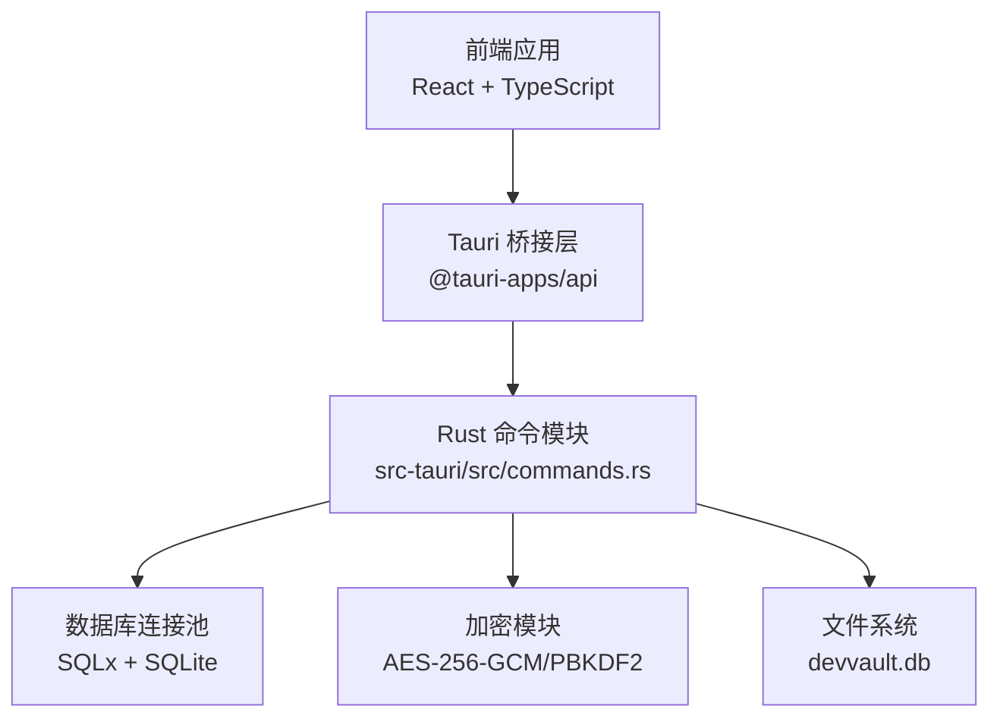
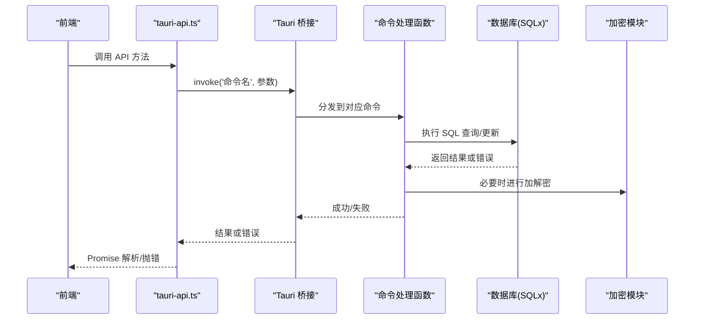
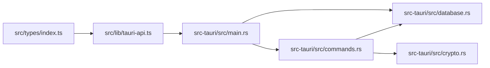
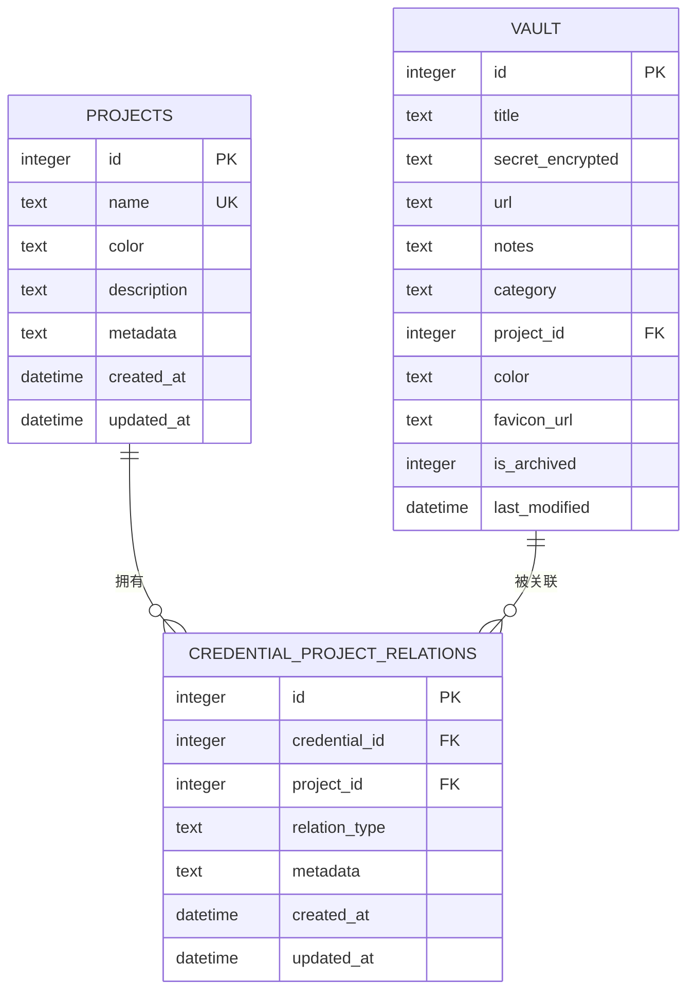
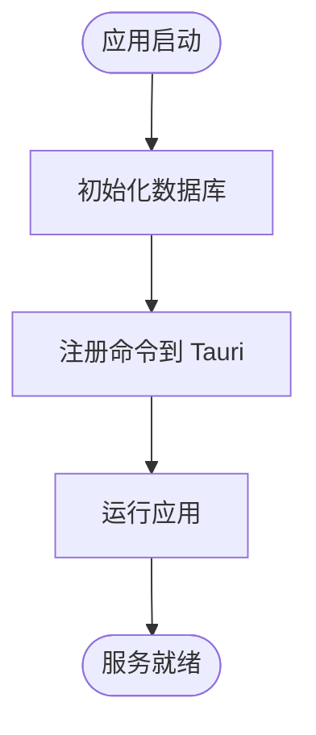

# API文档

<cite>
**本文档引用的文件**
- [src-tauri/src/commands.rs](file://src-tauri/src/commands.rs)
- [src-tauri/src/main.rs](file://src-tauri/src/main.rs)
- [src-tauri/src/lib.rs](file://src-tauri/src/lib.rs)
- [src-tauri/src/database.rs](file://src-tauri/src/database.rs)
- [src-tauri/src/crypto.rs](file://src-tauri/src/crypto.rs)
- [src-tauri/Cargo.toml](file://src-tauri/Cargo.toml)
- [src-tauri/tauri.conf.json](file://src-tauri/tauri.conf.json)
- [src-tauri/migrations/001_create_projects_table.sql](file://src-tauri/migrations/001_create_projects_table.sql)
- [src-tauri/migrations/002_create_relations_table.sql](file://src-tauri/migrations/002_create_relations_table.sql)
- [src-tauri/migrations/005_migrate_vault_relations.sql](file://src-tauri/migrations/005_migrate_vault_relations.sql)
- [src/lib/tauri-api.ts](file://src/lib/tauri-api.ts)
- [src/types/index.ts](file://src/types/index.ts)
- [src/components/VaultList.tsx](file://src/components/VaultList.tsx)
</cite>

## 目录
1. [简介](#简介)
2. [项目结构](#项目结构)
3. [核心组件](#核心组件)
4. [架构总览](#架构总览)
5. [详细组件分析](#详细组件分析)
6. [依赖分析](#依赖分析)
7. [性能考虑](#性能考虑)
8. [故障排除指南](#故障排除指南)
9. [结论](#结论)
10. [附录](#附录)

## 简介
本文件为 AIpassword 的完整 API 文档，覆盖 Tauri 命令接口与前端封装层。内容包括：
- 凭据操作：create_vault_item、get_vault_items、update_vault_item、delete_vault_item、search_items
- 项目管理：create_project、get_projects、get_project_counts
- 关系管理：create_credential_project_relation、delete_relation_by_credential_and_project
- 实用工具：copy_to_clipboard、fetch_favicon
- 安全认证：set_master_password、has_master_password、verify_master_password
- 数据模型与类型定义
- 错误处理、参数校验、权限控制与最佳实践
- 版本管理、兼容性与废弃策略
- 性能与限流建议

## 项目结构
后端采用 Rust + Tauri + SQLx + SQLite；前端使用 TypeScript + React。命令通过 Tauri 暴露到前端，前端通过 @tauri-apps/api 调用。

图表来源
- [src-tauri/src/main.rs](file://src-tauri/src/main.rs#L21-L51)
- [src-tauri/src/commands.rs](file://src-tauri/src/commands.rs#L1-L487)
- [src-tauri/src/database.rs](file://src-tauri/src/database.rs#L1-L104)
- [src-tauri/src/crypto.rs](file://src-tauri/src/crypto.rs#L1-L92)

章节来源
- [src-tauri/src/main.rs](file://src-tauri/src/main.rs#L1-L51)
- [src-tauri/src/lib.rs](file://src-tauri/src/lib.rs#L1-L4)

## 核心组件
- 命令注册与入口：在主程序中集中注册所有命令，并初始化数据库。
- 数据访问层：统一通过数据库连接池执行 SQL 查询与写入。
- 加密与认证：基于 PBKDF2 与 AES-256-GCM，支持主密码设置与校验。
- 类型系统：前后端共享类型定义，确保参数与返回值一致性。

章节来源
- [src-tauri/src/main.rs](file://src-tauri/src/main.rs#L21-L51)
- [src-tauri/src/database.rs](file://src-tauri/src/database.rs#L13-L52)
- [src-tauri/src/crypto.rs](file://src-tauri/src/crypto.rs#L11-L23)
- [src/types/index.ts](file://src/types/index.ts#L1-L46)

## 架构总览
下图展示从前端调用到数据库的完整链路，以及错误处理与事件监听位置。

图表来源
- [src/lib/tauri-api.ts](file://src/lib/tauri-api.ts#L1-L84)
- [src-tauri/src/main.rs](file://src-tauri/src/main.rs#L21-L51)
- [src-tauri/src/commands.rs](file://src-tauri/src/commands.rs#L40-L138)
- [src-tauri/src/database.rs](file://src-tauri/src/database.rs#L99-L104)
- [src-tauri/src/crypto.rs](file://src-tauri/src/crypto.rs#L25-L73)

## 详细组件分析

### 数据模型与类型定义
- VaultItem：凭据项的核心结构，包含标题、加密后的密文、URL、备注、分类、项目关联、颜色、图标、归档标记等。
- Project：项目结构，包含名称与颜色等。
- 请求体类型：CreateVaultItemRequest、UpdateVaultItemRequest 等，用于前端构造请求。

章节来源
- [src/types/index.ts](file://src/types/index.ts#L1-L46)

### 凭据操作 API

#### create_vault_item
- 功能：新增一个凭据项。
- 参数：VaultItem（除 id 外的所有字段）。
- 返回：新插入记录的自增 ID。
- 错误：数据库异常或序列化失败时返回字符串错误。
- 数据库行为：插入 vault 表，is_archived 默认为未归档。
- 安全：密文需由前端完成加密后再传入。

章节来源
- [src-tauri/src/commands.rs](file://src-tauri/src/commands.rs#L40-L64)
- [src/lib/tauri-api.ts](file://src/lib/tauri-api.ts#L7-L9)

#### get_vault_items
- 功能：获取所有未归档的凭据项，按最后修改时间倒序。
- 参数：无。
- 返回：VaultItem 数组。
- 错误：数据库查询失败返回错误字符串。

章节来源
- [src-tauri/src/commands.rs](file://src-tauri/src/commands.rs#L66-L98)
- [src/lib/tauri-api.ts](file://src/lib/tauri-api.ts#L11-L13)

#### update_vault_item
- 功能：更新指定 ID 的凭据项，并更新最后修改时间。
- 参数：id（数字）、VaultItem（除 id 外字段）。
- 返回：无（成功时返回空对象）。
- 错误：数据库更新失败返回错误字符串。

章节来源
- [src-tauri/src/commands.rs](file://src-tauri/src/commands.rs#L100-L125)
- [src/lib/tauri-api.ts](file://src/lib/tauri-api.ts#L31-L33)

#### delete_vault_item
- 功能：软删除（归档）指定 ID 的凭据项。
- 参数：id（数字）。
- 返回：无。
- 错误：数据库更新失败返回错误字符串。

章节来源
- [src-tauri/src/commands.rs](file://src-tauri/src/commands.rs#L127-L138)
- [src/lib/tauri-api.ts](file://src/lib/tauri-api.ts#L35-L37)

#### search_items
- 功能：按标题、备注或 URL 模糊搜索未归档的凭据项。
- 参数：query（字符串）。
- 返回：VaultItem 数组。
- 错误：数据库查询失败返回错误字符串。

章节来源
- [src-tauri/src/commands.rs](file://src-tauri/src/commands.rs#L174-L210)
- [src/lib/tauri-api.ts](file://src/lib/tauri-api.ts#L39-L41)

### 项目管理 API

#### create_project
- 功能：创建一个新项目。
- 参数：Project（除 id 外）。
- 返回：新插入记录的自增 ID。
- 错误：数据库插入失败返回错误字符串。

章节来源
- [src-tauri/src/commands.rs](file://src-tauri/src/commands.rs#L140-L152)
- [src/lib/tauri-api.ts](file://src/lib/tauri-api.ts#L44-L46)

#### get_projects
- 功能：获取所有项目，按名称排序。
- 参数：无。
- 返回：Project 数组。
- 错误：数据库查询失败返回错误字符串。

章节来源
- [src-tauri/src/commands.rs](file://src-tauri/src/commands.rs#L154-L172)
- [src/lib/tauri-api.ts](file://src/lib/tauri-api.ts#L48-L50)

#### get_project_counts
- 功能：获取每个项目的关联凭据数量。
- 参数：无。
- 返回：包含 id、name、color、count 的数组。
- 错误：数据库查询失败返回错误字符串。

章节来源
- [src-tauri/src/commands.rs](file://src-tauri/src/commands.rs#L373-L392)
- [src/lib/tauri-api.ts](file://src/lib/tauri-api.ts#L52-L54)

### 关系管理 API

#### create_credential_project_relation
- 功能：为凭据与项目建立关系，默认关系类型为 direct。
- 参数：credential_id（数字）、project_id（数字）、relation_type（可选）。
- 返回：新插入关系的自增 ID。
- 错误：数据库插入失败返回错误字符串。

章节来源
- [src-tauri/src/commands.rs](file://src-tauri/src/commands.rs#L312-L326)
- [src/lib/tauri-api.ts](file://src/lib/tauri-api.ts#L23-L25)

#### delete_relation_by_credential_and_project
- 功能：根据项目与凭据删除唯一的关系。
- 参数：project_id（数字）、credential_id（数字）。
- 返回：无。
- 错误：数据库删除失败返回错误字符串。

章节来源
- [src-tauri/src/commands.rs](file://src-tauri/src/commands.rs#L476-L487)
- [src/lib/tauri-api.ts](file://src/lib/tauri-api.ts#L27-L29)

### 实用工具 API

#### copy_to_clipboard
- 功能：将文本复制到系统剪贴板（Windows 平台）。
- 参数：text（字符串）。
- 返回：无。
- 错误：平台不支持或复制失败返回错误字符串。

章节来源
- [src-tauri/src/commands.rs](file://src-tauri/src/commands.rs#L213-L228)
- [src/lib/tauri-api.ts](file://src/lib/tauri-api.ts#L57-L59)

#### fetch_favicon
- 功能：从 URL 提取域名并生成 Google favicon 图标地址。
- 参数：url（字符串）。
- 返回：favicon URL（字符串）。
- 错误：解析失败时返回默认地址。

章节来源
- [src-tauri/src/commands.rs](file://src-tauri/src/commands.rs#L231-L245)
- [src/lib/tauri-api.ts](file://src/lib/tauri-api.ts#L61-L63)

### 安全认证 API

#### set_master_password
- 功能：设置主密码，存储盐与哈希。
- 参数：password（字符串）。
- 返回：无。
- 错误：数据库写入失败返回错误字符串。
- 安全：使用 PBKDF2 与随机盐，哈希值存入 settings 表。

章节来源
- [src-tauri/src/commands.rs](file://src-tauri/src/commands.rs#L248-L269)
- [src-tauri/src/crypto.rs](file://src-tauri/src/crypto.rs#L82-L92)
- [src/lib/tauri-api.ts](file://src/lib/tauri-api.ts#L66-L68)

#### has_master_password
- 功能：判断是否已设置主密码。
- 参数：无。
- 返回：布尔值。
- 错误：数据库查询失败返回错误字符串。

章节来源
- [src-tauri/src/commands.rs](file://src-tauri/src/commands.rs#L272-L281)
- [src/lib/tauri-api.ts](file://src/lib/tauri-api.ts#L70-L72)

#### verify_master_password
- 功能：验证输入的主密码是否正确。
- 参数：password（字符串）。
- 返回：布尔值。
- 错误：数据库查询或解码失败返回错误字符串。
- 安全：从 settings 表读取盐与哈希，重新计算比对。

章节来源
- [src-tauri/src/commands.rs](file://src-tauri/src/commands.rs#L284-L309)
- [src-tauri/src/crypto.rs](file://src-tauri/src/crypto.rs#L82-L92)
- [src/lib/tauri-api.ts](file://src/lib/tauri-api.ts#L74-L76)

### 前端调用示例与响应格式
以下为常见调用流程与返回结构说明（不含具体代码内容）：

- 新增凭据项
  - 调用：createVaultItem
  - 参数：Omit<VaultItem, 'id'>
  - 返回：number（新记录 ID）
  - 错误：Promise 拒绝，错误字符串

- 搜索凭据项
  - 调用：searchItems
  - 参数：string（查询关键字）
  - 返回：VaultItem[]
  - 错误：Promise 拒绝，错误字符串

- 设置主密码
  - 调用：setMasterPassword
  - 参数：string
  - 返回：void
  - 错误：Promise 拒绝，错误字符串

章节来源
- [src/lib/tauri-api.ts](file://src/lib/tauri-api.ts#L1-L84)
- [src/components/VaultList.tsx](file://src/components/VaultList.tsx#L30-L44)

### 错误处理机制
- 统一返回 Result<T, String> 或 Promise<T | string>。
- 数据库错误：捕获并转换为字符串错误。
- 平台相关错误：如剪贴板仅在 Windows 实现，其他平台返回空结果。
- 建议前端：对 Promise 拒绝进行统一处理，显示用户友好的提示。

章节来源
- [src-tauri/src/commands.rs](file://src-tauri/src/commands.rs#L213-L228)
- [src-tauri/src/commands.rs](file://src-tauri/src/commands.rs#L284-L309)

### 权限控制与数据验证
- 权限控制：当前实现未包含会话或令牌校验，建议在业务层增加鉴权中间件或在 Tauri 层启用窗口级权限。
- 数据验证：前端类型定义约束参数结构；后端通过 SQL 查询与索引保证基本完整性。
- 建议：对敏感操作（如删除、修改）增加二次确认与审计日志。

章节来源
- [src/types/index.ts](file://src/types/index.ts#L1-L46)
- [src-tauri/tauri.conf.json](file://src-tauri/tauri.conf.json#L13-L15)

### API 版本管理、兼容性与废弃策略
- 当前版本：0.1.0（应用与包版本一致）。
- 兼容性：数据库迁移脚本确保表结构演进；迁移表记录已应用的版本，避免重复执行。
- 废弃策略：新增功能优先以新命令形式提供，旧命令保持向后兼容；变更前通过迁移脚本处理数据结构变化。

章节来源
- [src-tauri/Cargo.toml](file://src-tauri/Cargo.toml#L1-L34)
- [src-tauri/tauri.conf.json](file://src-tauri/tauri.conf.json#L8-L11)
- [src-tauri/src/database.rs](file://src-tauri/src/database.rs#L54-L97)

## 依赖分析

图表来源
- [src-tauri/src/main.rs](file://src-tauri/src/main.rs#L8-L19)
- [src-tauri/src/lib.rs](file://src-tauri/src/lib.rs#L1-L4)
- [src/lib/tauri-api.ts](file://src/lib/tauri-api.ts#L1-L84)

章节来源
- [src-tauri/src/main.rs](file://src-tauri/src/main.rs#L1-L51)
- [src-tauri/src/lib.rs](file://src-tauri/src/lib.rs#L1-L4)

## 性能考虑
- 数据库连接池：全局 OnceCell 缓存连接池，减少连接开销。
- 索引优化：项目表与关系表均建立索引，提升查询效率。
- 查询优化：模糊搜索使用 LIKE，建议在高频查询字段上增加复合索引。
- 剪贴板：仅在 Windows 平台启用，避免跨平台性能与权限问题。
- 建议：对大量数据分页加载；对频繁操作使用本地缓存与批量更新。

章节来源
- [src-tauri/src/database.rs](file://src-tauri/src/database.rs#L5-L51)
- [src-tauri/migrations/001_create_projects_table.sql](file://src-tauri/migrations/001_create_projects_table.sql#L12-L13)
- [src-tauri/migrations/002_create_relations_table.sql](file://src-tauri/migrations/002_create_relations_table.sql#L14-L16)

## 故障排除指南
- 数据库未初始化：检查启动日志，确认 init_database 是否成功。
- 剪贴板无效：确认运行平台为 Windows，且已启用剪贴板权限。
- 主密码校验失败：确认 settings 表中存在盐与哈希，且输入密码正确。
- 查询超时：检查索引是否存在，必要时为查询字段添加索引。

章节来源
- [src-tauri/src/main.rs](file://src-tauri/src/main.rs#L40-L48)
- [src-tauri/src/database.rs](file://src-tauri/src/database.rs#L13-L52)
- [src-tauri/src/commands.rs](file://src-tauri/src/commands.rs#L284-L309)

## 结论
本 API 文档梳理了 AIpassword 的核心命令接口、数据模型与安全机制。建议在生产环境中补充鉴权、审计与限流策略，并持续通过迁移脚本保障数据库结构演进的稳定性。

## 附录

### 数据库表结构与关系

图表来源
- [src-tauri/migrations/001_create_projects_table.sql](file://src-tauri/migrations/001_create_projects_table.sql#L1-L13)
- [src-tauri/migrations/002_create_relations_table.sql](file://src-tauri/migrations/002_create_relations_table.sql#L1-L16)
- [src-tauri/migrations/005_migrate_vault_relations.sql](file://src-tauri/migrations/005_migrate_vault_relations.sql#L1-L18)

### 命令注册与导出

图表来源
- [src-tauri/src/main.rs](file://src-tauri/src/main.rs#L21-L51)