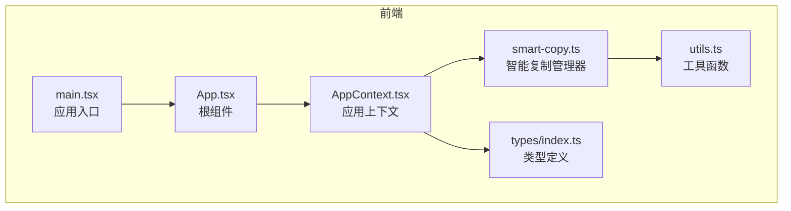
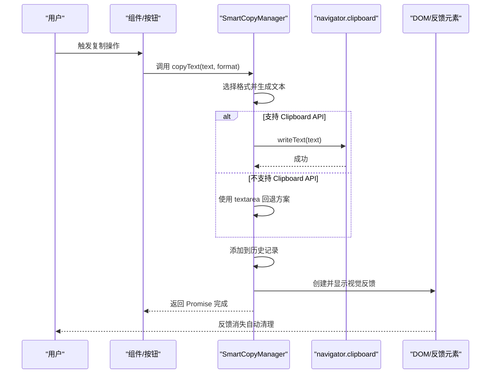
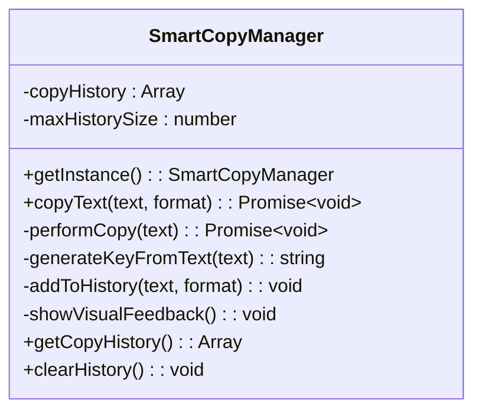
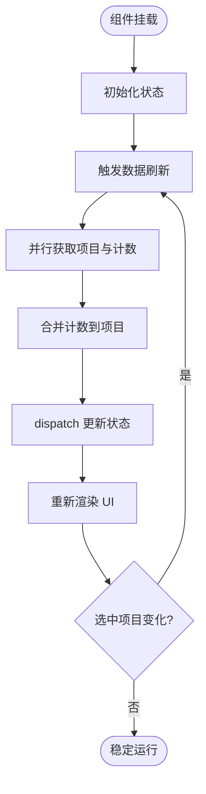
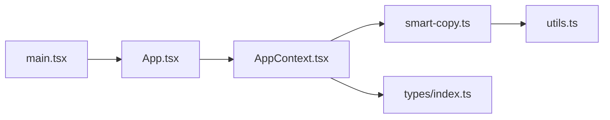

# 事件监听机制

<cite>
**本文引用的文件**
- [src/lib/smart-copy.ts](file://src/lib/smart-copy.ts)
- [src/lib/utils.ts](file://src/lib/utils.ts)
- [src/contexts/AppContext.tsx](file://src/contexts/AppContext.tsx)
- [src/types/index.ts](file://src/types/index.ts)
- [src/main.tsx](file://src/main.tsx)
- [src/App.tsx](file://src/App.tsx)
</cite>

## 目录
1. [简介](#简介)
2. [项目结构](#项目结构)
3. [核心组件](#核心组件)
4. [架构总览](#架构总览)
5. [详细组件分析](#详细组件分析)
6. [依赖关系分析](#依赖关系分析)
7. [性能考虑](#性能考虑)
8. [故障排除指南](#故障排除指南)
9. [结论](#结论)
10. [附录](#附录)

## 简介
本文件聚焦于前端事件监听机制与系统事件处理，特别是剪贴板事件监听与相关交互流程。通过对现有代码的深入分析，文档梳理了事件注册、回调函数、清理机制、事件类型定义、数据传递与错误处理策略，并提供可操作的使用示例、事件订阅与取消订阅的参考路径、事件循环与内存管理建议、性能优化策略以及调试与最佳实践。

需要特别说明的是：当前仓库中并未发现显式的“事件监听器注册”或“系统事件监听”的通用框架代码；与剪贴板相关的功能主要通过智能复制管理器与工具函数实现。因此，本文将以“智能复制管理器”为核心，扩展到应用上下文中的数据状态更新与事件驱动模式，帮助读者理解如何在现有架构上构建或扩展事件监听机制。

## 项目结构
本项目采用 React 前端与 Tauri 后端结合的架构。事件监听与系统事件处理主要集中在以下模块：
- 智能复制管理器：负责复制行为、历史记录与可视化反馈
- 工具函数：提供基础的复制能力与格式化工具
- 应用上下文：集中管理应用状态与副作用（如数据刷新）
- 类型定义：统一的状态与动作类型
- 入口与根组件：应用启动与渲染入口

图表来源
- [src/main.tsx](file://src/main.tsx#L1-L10)
- [src/App.tsx](file://src/App.tsx#L1-L29)
- [src/contexts/AppContext.tsx](file://src/contexts/AppContext.tsx#L1-L162)
- [src/lib/smart-copy.ts](file://src/lib/smart-copy.ts#L1-L152)
- [src/lib/utils.ts](file://src/lib/utils.ts#L1-L44)
- [src/types/index.ts](file://src/types/index.ts#L1-L46)

章节来源
- [src/main.tsx](file://src/main.tsx#L1-L10)
- [src/App.tsx](file://src/App.tsx#L1-L29)
- [src/contexts/AppContext.tsx](file://src/contexts/AppContext.tsx#L1-L162)
- [src/lib/smart-copy.ts](file://src/lib/smart-copy.ts#L1-L152)
- [src/lib/utils.ts](file://src/lib/utils.ts#L1-L44)
- [src/types/index.ts](file://src/types/index.ts#L1-L46)

## 核心组件
- 智能复制管理器（SmartCopyManager）：单例类，封装复制逻辑、历史记录、可视化反馈与错误处理
- 工具函数（utils.ts）：提供复制与格式化等通用能力
- 应用上下文（AppContext）：集中管理应用状态与副作用，体现事件驱动的数据流
- 类型定义（types/index.ts）：统一的动作类型与状态模型

章节来源
- [src/lib/smart-copy.ts](file://src/lib/smart-copy.ts#L8-L141)
- [src/lib/utils.ts](file://src/lib/utils.ts#L18-L31)
- [src/contexts/AppContext.tsx](file://src/contexts/AppContext.tsx#L5-L67)
- [src/types/index.ts](file://src/types/index.ts#L35-L46)

## 架构总览
下图展示了从用户触发复制到最终反馈的事件驱动流程，以及应用上下文中的状态更新与副作用执行：

图表来源
- [src/lib/smart-copy.ts](file://src/lib/smart-copy.ts#L20-L71)
- [src/lib/smart-copy.ts](file://src/lib/smart-copy.ts#L108-L132)

章节来源
- [src/lib/smart-copy.ts](file://src/lib/smart-copy.ts#L20-L71)
- [src/lib/smart-copy.ts](file://src/lib/smart-copy.ts#L108-L132)

## 详细组件分析

### 智能复制管理器（SmartCopyManager）
- 单例模式：确保全局唯一实例，便于跨组件共享状态与历史
- 复制流程：
  - 根据格式类型（原始、环境变量、JSON、自定义模板）生成目标文本
  - 优先使用 Clipboard API；不支持时回退到 textarea 方案
  - 成功后添加到历史记录并显示视觉反馈
- 历史记录：限制最大长度，避免内存膨胀
- 错误处理：捕获复制失败并抛出异常，供调用方处理
- 清理机制：反馈元素在短暂延迟后自动移除，避免 DOM 泄漏

图表来源
- [src/lib/smart-copy.ts](file://src/lib/smart-copy.ts#L8-L141)

章节来源
- [src/lib/smart-copy.ts](file://src/lib/smart-copy.ts#L8-L141)

### 工具函数（utils.ts）
- 提供基础复制能力与格式化工具，作为智能复制管理器的辅助
- 包含环境变量与 JSON 的格式化方法，以及文本截断等通用工具

章节来源
- [src/lib/utils.ts](file://src/lib/utils.ts#L18-L39)

### 应用上下文（AppContext）
- 集中式状态管理：通过 useReducer 维护应用状态与动作类型
- 副作用驱动：在组件挂载与依赖变化时触发数据刷新与搜索
- 事件驱动的数据流：状态变更通过 dispatch 触发，影响 UI 渲染

图表来源
- [src/contexts/AppContext.tsx](file://src/contexts/AppContext.tsx#L76-L147)

章节来源
- [src/contexts/AppContext.tsx](file://src/contexts/AppContext.tsx#L76-L147)

### 类型定义（types/index.ts）
- 动作类型（AppAction）：涵盖加载、列表、项目、搜索、选择项、隐身模式、主密码验证等
- 状态模型（AppState）：统一描述应用当前状态
- 复制格式类型（CopyFormat）：用于智能复制管理器的格式选择

章节来源
- [src/types/index.ts](file://src/types/index.ts#L5-L17)
- [src/types/index.ts](file://src/types/index.ts#L37-L46)
- [src/types/index.ts](file://src/types/index.ts#L35)

## 依赖关系分析
- 智能复制管理器依赖工具函数进行格式化与复制回退
- 应用上下文为组件提供状态与副作用，间接驱动复制行为的触发时机
- 类型定义贯穿于上下文与管理器之间，保证动作与状态的一致性

图表来源
- [src/lib/smart-copy.ts](file://src/lib/smart-copy.ts#L1-L6)
- [src/lib/utils.ts](file://src/lib/utils.ts#L1-L6)
- [src/contexts/AppContext.tsx](file://src/contexts/AppContext.tsx#L1-L3)
- [src/types/index.ts](file://src/types/index.ts#L1-L3)
- [src/App.tsx](file://src/App.tsx#L1-L3)
- [src/main.tsx](file://src/main.tsx#L1-L3)

章节来源
- [src/lib/smart-copy.ts](file://src/lib/smart-copy.ts#L1-L6)
- [src/lib/utils.ts](file://src/lib/utils.ts#L1-L6)
- [src/contexts/AppContext.tsx](file://src/contexts/AppContext.tsx#L1-L3)
- [src/types/index.ts](file://src/types/index.ts#L1-L3)
- [src/App.tsx](file://src/App.tsx#L1-L3)
- [src/main.tsx](file://src/main.tsx#L1-L3)

## 性能考虑
- 复制性能
  - 优先使用 Clipboard API，减少 DOM 操作与回流
  - 在不支持的环境中使用一次性 textarea 并立即移除，避免残留节点
- 历史记录管理
  - 控制最大历史条目数量，防止内存占用持续增长
- 渲染与状态更新
  - 使用 useReducer 与 useEffect 合理拆分副作用，避免不必要的重渲染
  - 并行请求（如项目与计数）以缩短首屏等待时间
- 反馈动画
  - 使用定时器控制反馈元素的显示与移除，确保及时清理

章节来源
- [src/lib/smart-copy.ts](file://src/lib/smart-copy.ts#L58-L71)
- [src/lib/smart-copy.ts](file://src/lib/smart-copy.ts#L96-L106)
- [src/contexts/AppContext.tsx](file://src/contexts/AppContext.tsx#L82-L85)
- [src/contexts/AppContext.tsx](file://src/contexts/AppContext.tsx#L123-L147)

## 故障排除指南
- 复制失败
  - 检查浏览器是否支持 Clipboard API；若不支持，确认回退方案是否正常创建与移除 textarea
  - 查看错误日志并根据异常类型提示用户授权或切换安全上下文
- 历史记录异常
  - 确认最大历史条目配置与数组操作逻辑
  - 在频繁复制场景下监控内存占用
- 反馈元素未消失
  - 检查定时器是否被意外清除，确认类名与过渡样式正确应用
- 状态不同步
  - 检查 dispatch 是否正确触发，确认依赖数组与副作用执行顺序

章节来源
- [src/lib/smart-copy.ts](file://src/lib/smart-copy.ts#L48-L55)
- [src/lib/smart-copy.ts](file://src/lib/smart-copy.ts#L124-L131)
- [src/contexts/AppContext.tsx](file://src/contexts/AppContext.tsx#L100-L104)
- [src/contexts/AppContext.tsx](file://src/contexts/AppContext.tsx#L116-L120)

## 结论
本项目通过智能复制管理器与应用上下文实现了清晰的事件驱动与状态管理模式。虽然未发现通用的事件监听框架代码，但现有组件已具备良好的可扩展性：可在智能复制管理器中引入事件发布/订阅模式，在应用上下文中扩展副作用与事件队列，从而构建更完善的事件监听机制。同时，遵循本文提供的性能与调试建议，可进一步提升系统的稳定性与用户体验。

## 附录

### 使用示例与参考路径
- 触发复制（智能复制管理器）
  - 路径参考：[copyText 调用点](file://src/lib/smart-copy.ts#L20-L56)
  - 路径参考：[performCopy 回退方案](file://src/lib/smart-copy.ts#L58-L71)
- 显示反馈与清理
  - 路径参考：[showVisualFeedback 与清理](file://src/lib/smart-copy.ts#L108-L132)
- 应用状态更新与副作用
  - 路径参考：[useEffect 刷新数据](file://src/contexts/AppContext.tsx#L123-L147)
  - 路径参考：[useEffect 搜索项](file://src/contexts/AppContext.tsx#L107-L121)
- 类型定义
  - 路径参考：[AppAction 类型](file://src/types/index.ts#L5-L17)
  - 路径参考：[AppState 类型](file://src/types/index.ts#L37-L46)

### 事件订阅与取消订阅（基于现有架构的扩展建议）
- 订阅方式
  - 在组件挂载时，通过应用上下文的副作用或本地状态注册事件监听（例如：复制完成后的回调）
- 取消订阅
  - 在组件卸载时，清理定时器与 DOM 节点，确保无内存泄漏
- 数据传递
  - 将复制结果与格式信息通过回调参数传递给订阅者
- 错误处理
  - 对复制异常进行捕获与上报，必要时向订阅者发出错误通知

章节来源
- [src/lib/smart-copy.ts](file://src/lib/smart-copy.ts#L108-L132)
- [src/contexts/AppContext.tsx](file://src/contexts/AppContext.tsx#L123-L147)
- [src/types/index.ts](file://src/types/index.ts#L5-L17)