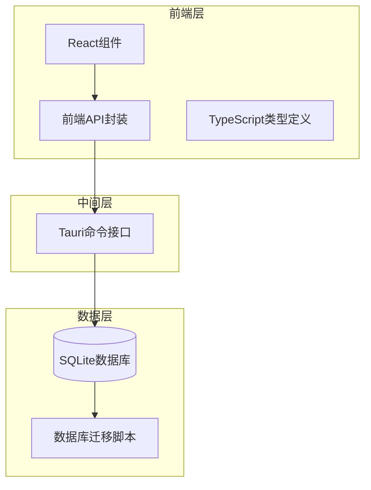
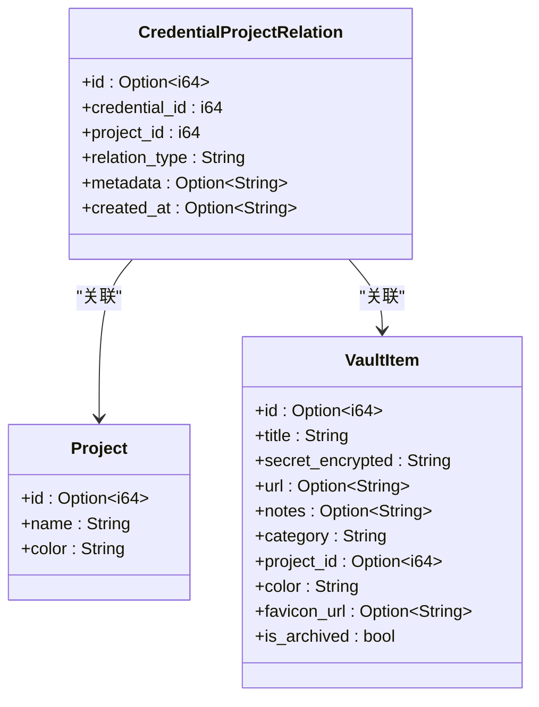
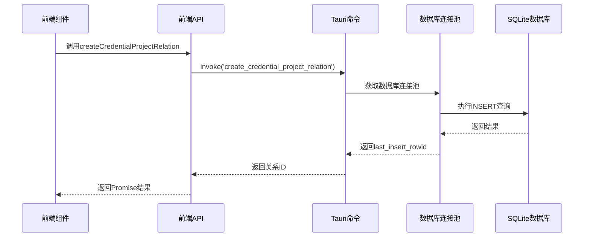
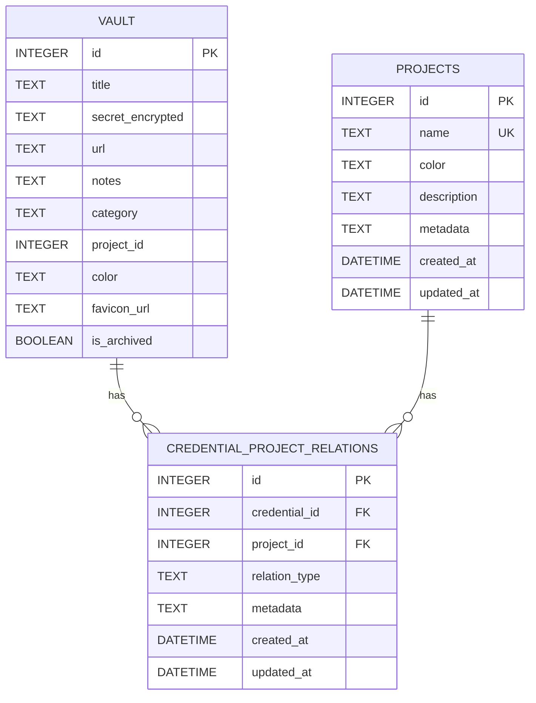
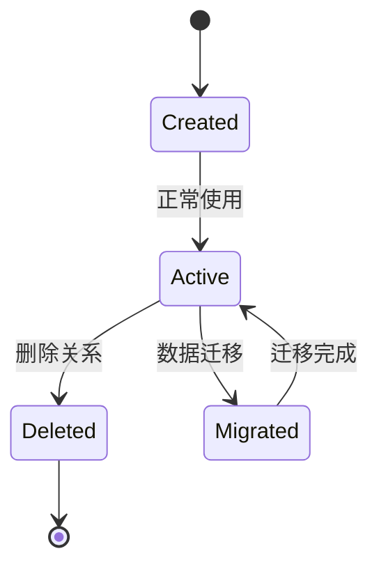
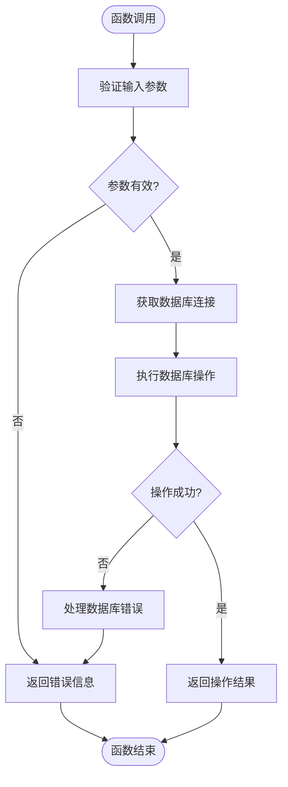
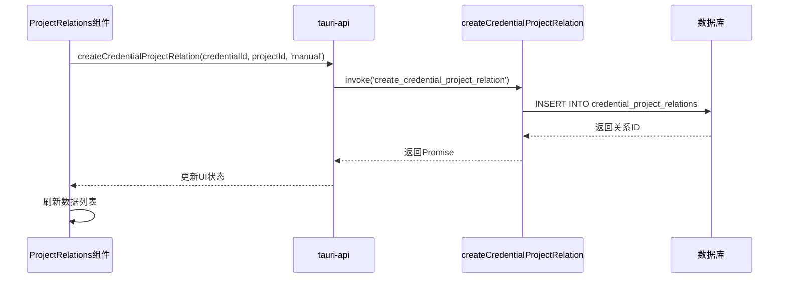
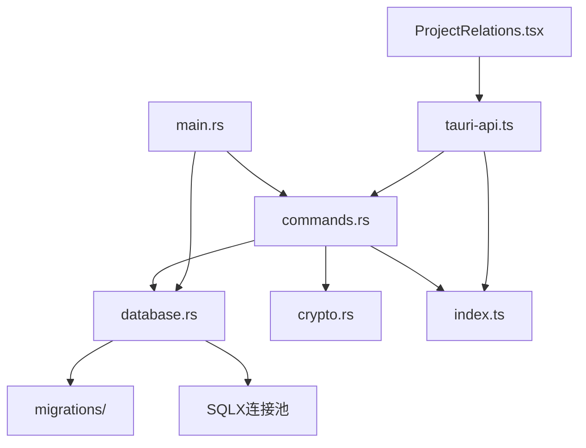
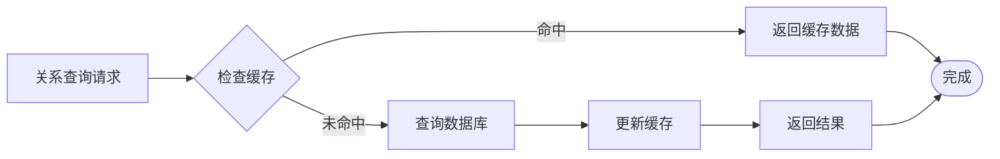

# 关系管理API

<cite>
**本文档引用的文件**
- [commands.rs](file://src-tauri/src/commands.rs)
- [database.rs](file://src-tauri/src/database.rs)
- [main.rs](file://src-tauri/src/main.rs)
- [001_create_projects_table.sql](file://src-tauri/migrations/001_create_projects_table.sql)
- [002_create_relations_table.sql](file://src-tauri/migrations/002_create_relations_table.sql)
- [005_migrate_vault_relations.sql](file://src-tauri/migrations/005_migrate_vault_relations.sql)
- [tauri-api.ts](file://src/lib/tauri-api.ts)
- [ProjectRelations.tsx](file://src/components/ProjectRelations.tsx)
- [index.ts](file://src/types/index.ts)
</cite>

## 目录
1. [简介](#简介)
2. [项目结构](#项目结构)
3. [核心组件](#核心组件)
4. [架构概览](#架构概览)
5. [详细组件分析](#详细组件分析)
6. [依赖关系分析](#依赖关系分析)
7. [性能考虑](#性能考虑)
8. [故障排除指南](#故障排除指南)
9. [结论](#结论)

## 简介

关系管理API是AIpassword应用中用于管理凭据与项目之间关系的核心功能模块。该模块实现了凭据项目关系的创建、删除、查询等操作，支持多种关系类型和复杂的业务逻辑。通过Tauri命令接口，前端可以与后端数据库进行交互，实现凭据与项目的灵活关联管理。

## 项目结构

AIpassword采用前后端分离的架构设计，关系管理功能主要分布在以下层次：

**图表来源**
- [main.rs](file://src-tauri/src/main.rs#L24-L58)
- [tauri-api.ts](file://src/lib/tauri-api.ts#L1-L97)

**章节来源**
- [main.rs](file://src-tauri/src/main.rs#L1-L58)
- [database.rs](file://src-tauri/src/database.rs#L1-L104)

## 核心组件

关系管理API的核心组件包括：

### 数据模型定义

**图表来源**
- [commands.rs](file://src-tauri/src/commands.rs#L30-L38)
- [commands.rs](file://src-tauri/src/commands.rs#L23-L28)
- [commands.rs](file://src-tauri/src/commands.rs#L9-L21)

### 命令接口定义

关系管理API提供了以下核心命令：

1. **createCredentialProjectRelation** - 创建凭据项目关系
2. **deleteRelationByCredentialAndProject** - 按凭据和项目删除关系
3. **getRelationsForCredential** - 查询凭据的所有关系
4. **deleteCredentialProjectRelation** - 按关系ID删除关系

**章节来源**
- [commands.rs](file://src-tauri/src/commands.rs#L311-L339)
- [commands.rs](file://src-tauri/src/commands.rs#L475-L487)
- [commands.rs](file://src-tauri/src/commands.rs#L341-L363)

## 架构概览

关系管理API采用分层架构设计，确保了良好的可维护性和扩展性：

**图表来源**
- [tauri-api.ts](file://src/lib/tauri-api.ts#L23-L25)
- [commands.rs](file://src-tauri/src/commands.rs#L311-L326)
- [database.rs](file://src-tauri/src/database.rs#L99-L104)

## 详细组件分析

### 数据模型与约束

#### 关系表结构

关系表`credential_project_relations`定义了凭据与项目之间的多对多关系：

| 字段名 | 类型 | 约束 | 描述 |
|--------|------|------|------|
| id | INTEGER | PRIMARY KEY, AUTOINCREMENT | 关系唯一标识符 |
| credential_id | INTEGER | NOT NULL, FOREIGN KEY | 凭据ID，引用vault表 |
| project_id | INTEGER | NOT NULL, FOREIGN KEY | 项目ID，引用projects表 |
| relation_type | TEXT | NOT NULL, DEFAULT 'direct' | 关系类型 |
| metadata | TEXT | NULL | 元数据JSON |
| created_at | DATETIME | DEFAULT CURRENT_TIMESTAMP | 创建时间 |
| updated_at | DATETIME | DEFAULT CURRENT_TIMESTAMP | 更新时间 |

#### 外键约束与级联操作

**图表来源**
- [002_create_relations_table.sql](file://src-tauri/migrations/002_create_relations_table.sql#L2-L12)
- [001_create_projects_table.sql](file://src-tauri/migrations/001_create_projects_table.sql#L2-L10)

#### 索引设计

为提高查询性能，建立了以下索引：
- `idx_relations_credential`: 基于credential_id的索引
- `idx_relations_project`: 基于project_id的索引
- `idx_projects_name`: 基于项目名称的索引

**章节来源**
- [002_create_relations_table.sql](file://src-tauri/migrations/002_create_relations_table.sql#L14-L16)
- [001_create_projects_table.sql](file://src-tauri/migrations/001_create_projects_table.sql#L12)

### 关系类型定义

关系管理支持多种关系类型，当前实现包含：

1. **direct**: 直接关系，用户手动创建
2. **migrated_default**: 迁移默认关系，用于历史数据兼容
3. **manual**: 手动关联关系

关系类型的默认值为'direct'，确保新创建的关系具有明确的类型标识。

### 参数规范

#### createCredentialProjectRelation 参数

| 参数名 | 类型 | 必需 | 默认值 | 描述 |
|--------|------|------|--------|------|
| credential_id | i64 | 是 | - | 凭据在vault表中的ID |
| project_id | i64 | 是 | - | 项目在projects表中的ID |
| relation_type | String | 否 | 'direct' | 关系类型，默认直接关系 |

#### deleteRelationByCredentialAndProject 参数

| 参数名 | 类型 | 必需 | 默认值 | 描述 |
|--------|------|------|--------|------|
| project_id | i64 | 是 | - | 项目ID |
| credential_id | i64 | 是 | - | 凭据ID |

**章节来源**
- [commands.rs](file://src-tauri/src/commands.rs#L311-L326)
- [commands.rs](file://src-tauri/src/commands.rs#L475-L487)

### 生命周期管理

关系的生命周期包括以下阶段：

**图表来源**
- [005_migrate_vault_relations.sql](file://src-tauri/migrations/005_migrate_vault_relations.sql#L9-L15)

### 数据一致性保证

系统通过以下机制确保数据一致性：

1. **外键约束**: 确保引用完整性
2. **级联删除**: 当项目或凭据被删除时，自动清理相关关系
3. **事务处理**: 在复杂操作中保持原子性
4. **唯一性约束**: 项目名称的唯一性保证

### 错误处理与状态码

关系管理API采用统一的错误处理模式：

**图表来源**
- [commands.rs](file://src-tauri/src/commands.rs#L311-L326)
- [commands.rs](file://src-tauri/src/commands.rs#L475-L487)

**章节来源**
- [commands.rs](file://src-tauri/src/commands.rs#L311-L339)
- [commands.rs](file://src-tauri/src/commands.rs#L475-L487)

### 前端集成示例

#### React组件集成

**图表来源**
- [ProjectRelations.tsx](file://src/components/ProjectRelations.tsx#L39-L48)
- [tauri-api.ts](file://src/lib/tauri-api.ts#L23-L25)

**章节来源**
- [ProjectRelations.tsx](file://src/components/ProjectRelations.tsx#L1-L107)
- [tauri-api.ts](file://src/lib/tauri-api.ts#L23-L29)

## 依赖关系分析

关系管理API的依赖关系如下：

**图表来源**
- [main.rs](file://src-tauri/src/main.rs#L8-L22)
- [commands.rs](file://src-tauri/src/commands.rs#L1-L8)
- [database.rs](file://src-tauri/src/database.rs#L1-L5)

**章节来源**
- [main.rs](file://src-tauri/src/main.rs#L8-L22)
- [commands.rs](file://src-tauri/src/commands.rs#L1-L8)

## 性能考虑

### 查询优化

1. **索引利用**: 通过在credential_id和project_id上建立索引，优化关联查询性能
2. **批量操作**: 支持批量关系查询和更新操作
3. **连接池管理**: 使用SQLX连接池减少数据库连接开销

### 缓存策略

### 并发控制

系统通过以下机制处理并发访问：
- 使用SQLite的行级锁机制
- 通过连接池管理并发连接数
- 在事务中执行原子性操作

## 故障排除指南

### 常见问题及解决方案

#### 数据库连接问题

**症状**: 调用关系管理API时出现"Database not initialized"错误

**原因**: 数据库连接池未正确初始化

**解决方案**: 
1. 检查数据库初始化过程
2. 确认数据库文件存在且可访问
3. 验证数据库权限设置

#### 外键约束违反

**症状**: 创建关系时出现外键约束错误

**原因**: 指定的credential_id或project_id不存在

**解决方案**:
1. 验证目标凭据和项目是否存在
2. 检查ID值的有效性
3. 确认数据类型匹配

#### 性能问题

**症状**: 关系查询响应缓慢

**原因**: 缺少必要的索引或查询优化不足

**解决方案**:
1. 确认索引已正确创建
2. 分析查询执行计划
3. 考虑添加复合索引

**章节来源**
- [database.rs](file://src-tauri/src/database.rs#L99-L104)
- [002_create_relations_table.sql](file://src-tauri/migrations/002_create_relations_table.sql#L14-L16)

## 结论

关系管理API为AIpassword应用提供了完整、可靠、高性能的凭据项目关系管理能力。通过清晰的架构设计、完善的错误处理机制和优化的性能策略，该模块能够满足复杂业务场景下的关系管理需求。

### 主要特性总结

1. **完整的CRUD操作**: 支持关系的创建、查询、更新和删除
2. **灵活的关系类型**: 支持多种关系类型以适应不同业务场景
3. **强一致性的数据模型**: 通过外键约束和级联操作确保数据完整性
4. **高性能的查询优化**: 通过索引和连接池提升查询性能
5. **健壮的错误处理**: 提供详细的错误信息和恢复机制

### 未来改进方向

1. **批量操作支持**: 实现批量关系创建和删除功能
2. **关系冲突检测**: 添加关系冲突检测和解决机制
3. **审计日志**: 记录关系变更历史以便追踪
4. **关系图谱**: 提供关系可视化和分析功能

该API为AIpassword应用的扩展和维护奠定了坚实的基础，能够支持更复杂的关系管理和业务需求。