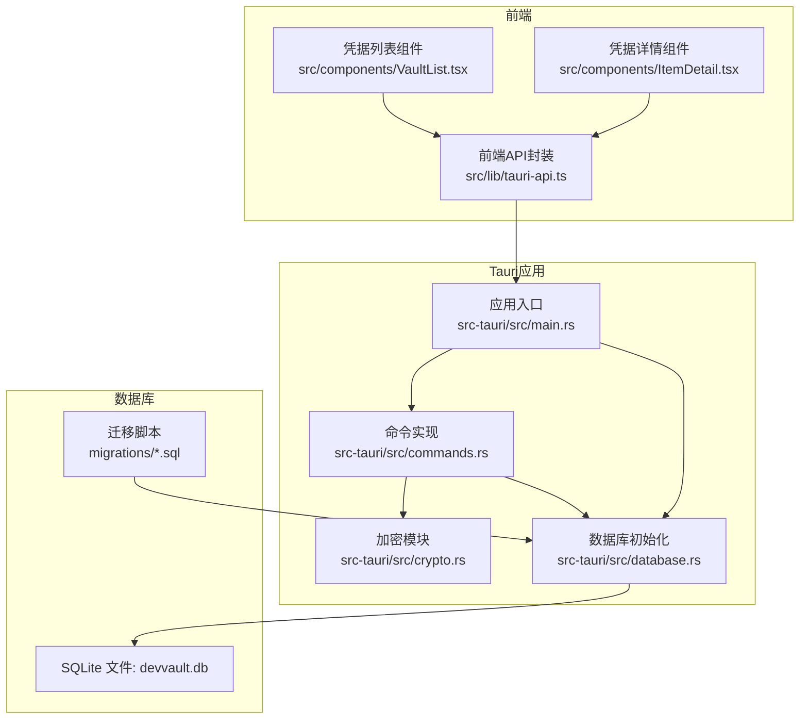
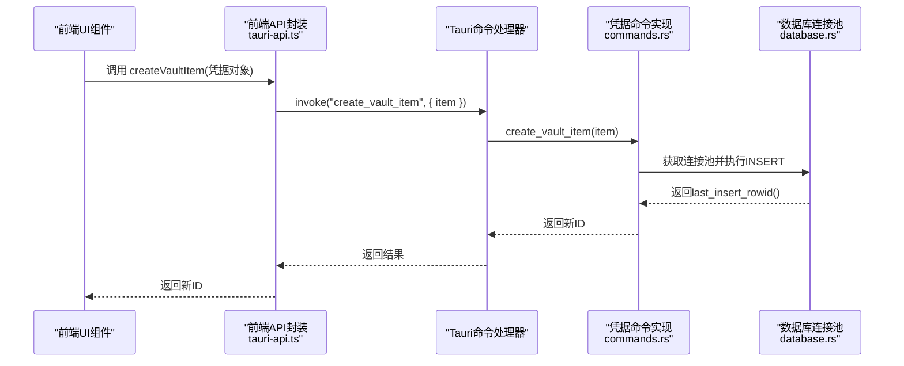
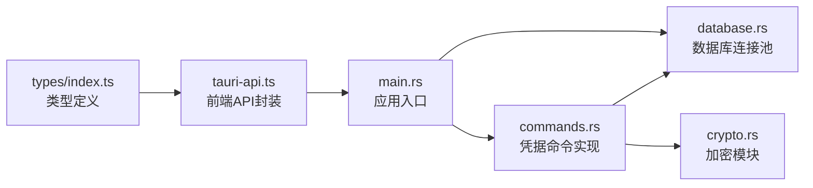

# 凭据管理API

<cite>
**本文档引用的文件**
- [src-tauri/src/commands.rs](file://src-tauri/src/commands.rs)
- [src-tauri/src/crypto.rs](file://src-tauri/src/crypto.rs)
- [src-tauri/src/database.rs](file://src-tauri/src/database.rs)
- [src-tauri/src/main.rs](file://src-tauri/src/main.rs)
- [src/lib/tauri-api.ts](file://src/lib/tauri-api.ts)
- [src/types/index.ts](file://src/types/index.ts)
- [src-tauri/Cargo.toml](file://src-tauri/Cargo.toml)
- [src-tauri/migrations/001_create_projects_table.sql](file://src-tauri/migrations/001_create_projects_table.sql)
- [src-tauri/migrations/005_migrate_vault_relations.sql](file://src-tauri/migrations/005_migrate_vault_relations.sql)
- [src/components/VaultList.tsx](file://src/components/VaultList.tsx)
- [src/components/ItemDetail.tsx](file://src/components/ItemDetail.tsx)
</cite>

## 目录
1. [简介](#简介)
2. [项目结构](#项目结构)
3. [核心组件](#核心组件)
4. [架构总览](#架构总览)
5. [详细组件分析](#详细组件分析)
6. [依赖关系分析](#依赖关系分析)
7. [性能考虑](#性能考虑)
8. [故障排除指南](#故障排除指南)
9. [结论](#结论)
10. [附录](#附录)

## 简介
本文件为凭据管理API的权威技术文档，覆盖所有与凭据相关的Tauri命令接口，包括：
- createVaultItem（创建凭据）
- getVaultItems（获取所有凭据）
- getVaultItemsByProject（按项目获取凭据）
- getUnlinkedVaultItems（获取未链接凭据）
- updateVaultItem（更新凭据）
- deleteVaultItem（删除凭据）

文档内容涵盖：
- 每个API的参数规范、返回值格式与错误处理机制
- VaultItem数据模型的字段定义、数据类型与验证规则
- 调用示例、请求/响应格式与状态码说明
- 凭据加密存储、数据完整性保证与安全传输机制
- 性能考量、批量操作与最佳实践建议

## 项目结构
后端采用Rust + Tauri + SQLx + SQLite架构；前端通过@tauri-apps/api调用后端命令。凭据数据以“加密字符串”形式存储于vault表，配合项目关联表实现多维组织。

图表来源
- [src-tauri/src/main.rs](file://src-tauri/src/main.rs#L24-L53)
- [src-tauri/src/commands.rs](file://src-tauri/src/commands.rs#L40-L138)
- [src-tauri/src/crypto.rs](file://src-tauri/src/crypto.rs#L1-L92)
- [src-tauri/src/database.rs](file://src-tauri/src/database.rs#L13-L52)
- [src/lib/tauri-api.ts](file://src/lib/tauri-api.ts#L1-L97)

章节来源
- [src-tauri/src/main.rs](file://src-tauri/src/main.rs#L24-L53)
- [src-tauri/src/database.rs](file://src-tauri/src/database.rs#L13-L52)
- [src/lib/tauri-api.ts](file://src/lib/tauri-api.ts#L1-L97)

## 核心组件
- 命令层：在commands.rs中定义并实现所有凭据相关命令，统一由main.rs注册到Tauri上下文。
- 加密层：crypto.rs提供基于AES-256-GCM的对称加密与PBKDF2密码派生，用于凭据加密与主密码校验。
- 数据层：database.rs负责SQLite连接池初始化、迁移执行与全局池管理。
- 前端封装：tauri-api.ts提供类型化API方法，前端组件通过这些方法调用后端命令。

章节来源
- [src-tauri/src/commands.rs](file://src-tauri/src/commands.rs#L40-L138)
- [src-tauri/src/crypto.rs](file://src-tauri/src/crypto.rs#L7-L74)
- [src-tauri/src/database.rs](file://src-tauri/src/database.rs#L99-L104)
- [src/lib/tauri-api.ts](file://src/lib/tauri-api.ts#L5-L50)

## 架构总览
以下序列图展示凭据创建流程从UI到数据库的完整链路：

图表来源
- [src/lib/tauri-api.ts](file://src/lib/tauri-api.ts#L7-L9)
- [src-tauri/src/commands.rs](file://src-tauri/src/commands.rs#L40-L64)
- [src-tauri/src/database.rs](file://src-tauri/src/database.rs#L99-L104)

## 详细组件分析

### VaultItem 数据模型
VaultItem是凭据的核心数据结构，字段定义如下：

- id: 可选整数，数据库自增主键
- title: 必填字符串，凭据标题
- secret_encrypted: 必填字符串，已加密的凭据值（Base64编码）
- url: 可选字符串，来源URL
- notes: 可选字符串，备注
- category: 必填字符串，分类标签
- project_id: 可选整数，所属项目ID
- color: 必填字符串，颜色标识（十六进制）
- favicon_url: 可选字符串，站点图标URL
- is_archived: 布尔值，逻辑删除标记（存储为整型）

字段类型与约束
- 所有字段均为SQL列映射字段，is_archived在写入时转换为整型存储，读取时转换回布尔值
- secret_encrypted必须为有效Base64编码字符串（由加密模块保证）
- category、color、title等字段在业务上应进行长度与格式校验

章节来源
- [src-tauri/src/commands.rs](file://src-tauri/src/commands.rs#L9-L21)
- [src/types/index.ts](file://src/types/index.ts#L1-L12)

### createVaultItem（创建凭据）
- 功能：向vault表插入一条新的凭据记录，并返回新增记录的ID
- 参数
  - item: VaultItem（不包含id）
- 返回值
  - 成功：返回新增记录的ID（整数）
  - 失败：返回错误信息字符串
- 错误处理
  - 数据库连接失败或查询执行失败时返回错误字符串
- 安全要点
  - secret_encrypted应为已加密后的字符串
  - is_archived写入时转换为整型

章节来源
- [src-tauri/src/commands.rs](file://src-tauri/src/commands.rs#L40-L64)
- [src/lib/tauri-api.ts](file://src/lib/tauri-api.ts#L7-L9)

### getVaultItems（获取所有凭据）
- 功能：查询所有未归档的凭据，按最后修改时间倒序排列
- 参数：无
- 返回值
  - 成功：VaultItem数组
  - 失败：错误信息字符串
- 错误处理
  - 查询异常时返回错误字符串

章节来源
- [src-tauri/src/commands.rs](file://src-tauri/src/commands.rs#L66-L98)
- [src/lib/tauri-api.ts](file://src/lib/tauri-api.ts#L11-L13)

### getVaultItemsByProject（按项目获取凭据）
- 功能：根据项目ID获取关联的凭据；若项目ID为空则返回所有非归档凭据
- 参数
  - projectId: 可选整数
- 返回值
  - 成功：VaultItem数组
  - 失败：错误信息字符串
- 错误处理
  - 查询异常时返回错误字符串
- 关联逻辑
  - 通过credential_project_relations中间表进行JOIN过滤

章节来源
- [src-tauri/src/commands.rs](file://src-tauri/src/commands.rs#L394-L435)
- [src/lib/tauri-api.ts](file://src/lib/tauri-api.ts#L15-L17)

### getUnlinkedVaultItems（获取未链接凭据）
- 功能：获取指定项目下未与任何凭据建立关联的凭据
- 参数
  - projectId: 必填整数
- 返回值
  - 成功：VaultItem数组
  - 失败：错误信息字符串
- 错误处理
  - 查询异常时返回错误字符串

章节来源
- [src-tauri/src/commands.rs](file://src-tauri/src/commands.rs#L437-L473)
- [src/lib/tauri-api.ts](file://src/lib/tauri-api.ts#L19-L21)

### updateVaultItem（更新凭据）
- 功能：根据ID更新指定凭据的所有字段，并更新最后修改时间
- 参数
  - id: 必填整数（目标记录ID）
  - item: VaultItem（不含id）
- 返回值
  - 成功：空
  - 失败：错误信息字符串
- 错误处理
  - 更新异常时返回错误字符串

章节来源
- [src-tauri/src/commands.rs](file://src-tauri/src/commands.rs#L100-L125)
- [src/lib/tauri-api.ts](file://src/lib/tauri-api.ts#L44-L46)

### deleteVaultItem（删除凭据）
- 功能：将指定凭据标记为归档（逻辑删除），而非物理删除
- 参数
  - id: 必填整数
- 返回值
  - 成功：空
  - 失败：错误信息字符串
- 错误处理
  - 更新异常时返回错误字符串
- 影响范围
  - 查询接口默认忽略is_archived=1的记录

章节来源
- [src-tauri/src/commands.rs](file://src-tauri/src/commands.rs#L127-L138)
- [src/lib/tauri-api.ts](file://src/lib/tauri-api.ts#L48-L50)

### API调用示例与响应格式
以下为常见调用场景的示例（仅描述请求与响应结构，不包含具体代码内容）：
- 创建凭据
  - 请求：调用createVaultItem，传入包含title、secret_encrypted、category、color等字段的对象
  - 响应：返回新增记录的ID（整数）
- 获取凭据列表
  - 请求：调用getVaultItems或getVaultItemsByProject
  - 响应：返回VaultItem数组，每项包含id、title、secret_encrypted、url、notes、category、project_id、color、favicon_url、is_archived
- 更新凭据
  - 请求：调用updateVaultItem，传入id与更新后的VaultItem对象
  - 响应：无（成功时返回空）
- 删除凭据
  - 请求：调用deleteVaultItem，传入id
  - 响应：无（成功时返回空）

章节来源
- [src/lib/tauri-api.ts](file://src/lib/tauri-api.ts#L7-L50)
- [src-tauri/src/commands.rs](file://src-tauri/src/commands.rs#L40-L138)

### 错误处理机制
- 统一返回类型
  - 成功：Result<T, String>中的Ok(T)
  - 失败：Result<T, String>中的Err(String)，错误信息为字符串
- 常见错误来源
  - 数据库连接池未初始化：get_db_pool返回错误字符串
  - SQL执行失败：sqlx查询/更新抛出错误并映射为字符串
  - 编解码错误：加密/解码Base64失败时返回错误字符串
- 建议前端处理
  - 对所有API调用进行try/catch捕获
  - 将错误字符串提示用户或记录日志

章节来源
- [src-tauri/src/database.rs](file://src-tauri/src/database.rs#L99-L104)
- [src-tauri/src/commands.rs](file://src-tauri/src/commands.rs#L41-L61)

### 凭据加密存储与安全传输
- 存储格式
  - secret_encrypted字段存储加密后的凭据值，采用Base64编码
- 加密算法
  - AES-256-GCM对称加密，随机盐值与随机nonce
  - PBKDF2-HMAC-SHA256用于从主密码派生密钥
- 密钥管理
  - 主密码设置时生成随机盐并存储其Base64编码
  - 实际存储的是PBKDF2派生的哈希值，不保存明文密码
- 传输安全
  - 前后端通信通过Tauri IPC完成，未见网络传输层
- 建议
  - 前端应在本地解密后再进行复制操作，避免泄露加密文本
  - 严格限制对加密字段的访问权限

章节来源
- [src-tauri/src/crypto.rs](file://src-tauri/src/crypto.rs#L7-L74)
- [src-tauri/src/commands.rs](file://src-tauri/src/commands.rs#L248-L309)

### 数据完整性保证
- 数据库初始化
  - 应用启动时初始化SQLite连接池并执行迁移脚本
  - 自动创建settings表与项目默认数据
- 迁移策略
  - 迁移脚本以“是否已存在”为条件，确保幂等性
  - 默认项目与关联关系的一次性迁移脚本
- 索引与查询
  - 项目表存在名称索引，提升查询效率
  - 凭据查询默认忽略归档记录，保证视图一致性

章节来源
- [src-tauri/src/database.rs](file://src-tauri/src/database.rs#L13-L52)
- [src-tauri/migrations/001_create_projects_table.sql](file://src-tauri/migrations/001_create_projects_table.sql#L1-L13)
- [src-tauri/migrations/005_migrate_vault_relations.sql](file://src-tauri/migrations/005_migrate_vault_relations.sql#L1-L18)

### 前端集成与使用
- API封装
  - 前端通过tauri-api.ts提供的方法调用后端命令
  - 类型定义来自src/types/index.ts，确保参数与返回值类型一致
- UI组件
  - VaultList与ItemDetail组件通过API调用实现凭据的增删改查与复制功能
  - 复制前需先解密secret_encrypted，当前UI中直接显示加密文本，实际应解密后再复制

章节来源
- [src/lib/tauri-api.ts](file://src/lib/tauri-api.ts#L1-L97)
- [src/types/index.ts](file://src/types/index.ts#L1-L46)
- [src/components/VaultList.tsx](file://src/components/VaultList.tsx#L1-L209)
- [src/components/ItemDetail.tsx](file://src/components/ItemDetail.tsx#L1-L234)

## 依赖关系分析

图表来源
- [src-tauri/src/main.rs](file://src-tauri/src/main.rs#L8-L22)
- [src-tauri/src/commands.rs](file://src-tauri/src/commands.rs#L1-L8)
- [src-tauri/src/database.rs](file://src-tauri/src/database.rs#L1-L5)
- [src-tauri/src/crypto.rs](file://src-tauri/src/crypto.rs#L1-L6)
- [src/lib/tauri-api.ts](file://src/lib/tauri-api.ts#L1-L4)
- [src/types/index.ts](file://src/types/index.ts#L1-L46)

章节来源
- [src-tauri/src/main.rs](file://src-tauri/src/main.rs#L8-L22)
- [src-tauri/src/commands.rs](file://src-tauri/src/commands.rs#L1-L8)
- [src-tauri/src/database.rs](file://src-tauri/src/database.rs#L1-L5)
- [src-tauri/src/crypto.rs](file://src-tauri/src/crypto.rs#L1-L6)
- [src/lib/tauri-api.ts](file://src/lib/tauri-api.ts#L1-L4)
- [src/types/index.ts](file://src/types/index.ts#L1-L46)

## 性能考虑
- 查询优化
  - getVaultItems与相关查询默认按最后修改时间排序，建议在高频场景下缓存结果
  - getVaultItemsByProject通过JOIN中间表过滤，建议确保credential_project_relations表具备合适的索引
- 批量操作
  - 当前命令未提供批量插入/更新接口，建议在前端聚合后再逐条调用
- I/O与连接
  - 数据库连接池为全局单例，避免频繁创建连接
- 前端渲染
  - 大量凭据时建议分页或虚拟滚动，减少DOM压力

## 故障排除指南
- 数据库未初始化
  - 现象：调用命令返回“Database not initialized”
  - 处理：确认应用启动时init_database已执行且无异常
- SQL执行失败
  - 现象：返回错误字符串
  - 处理：检查参数绑定与表结构是否匹配，查看迁移脚本是否成功
- Base64编解码错误
  - 现象：加密/解密返回错误
  - 处理：确认secret_encrypted为有效Base64编码
- 项目关联异常
  - 现象：getVaultItemsByProject或getUnlinkedVaultItems返回不符合预期的结果
  - 处理：检查credential_project_relations表数据与外键约束

章节来源
- [src-tauri/src/database.rs](file://src-tauri/src/database.rs#L99-L104)
- [src-tauri/src/commands.rs](file://src-tauri/src/commands.rs#L41-L61)
- [src-tauri/src/crypto.rs](file://src-tauri/src/crypto.rs#L47-L73)

## 结论
本凭据管理API以简洁稳定的命令接口为核心，结合SQLite与Rust的高性能特性，提供了可靠的凭据存储与管理能力。通过AES-256-GCM与PBKDF2的安全机制，保障了凭据数据的机密性与完整性。建议在前端实现本地解密后再复制的流程，并遵循本文的最佳实践以获得更佳的性能与安全性。

## 附录

### API定义与调用参考
- createVaultItem
  - 方法：createVaultItem(item)
  - 参数：VaultItem（不含id）
  - 返回：新增记录ID（整数）
- getVaultItems
  - 方法：getVaultItems()
  - 参数：无
  - 返回：VaultItem[]（未归档）
- getVaultItemsByProject
  - 方法：getVaultItemsByProject(projectId?)
  - 参数：projectId（可选）
  - 返回：VaultItem[]
- getUnlinkedVaultItems
  - 方法：getUnlinkedVaultItems(projectId)
  - 参数：projectId（必填）
  - 返回：VaultItem[]
- updateVaultItem
  - 方法：updateVaultItem(id, item)
  - 参数：id（整数）、VaultItem（不含id）
  - 返回：无
- deleteVaultItem
  - 方法：deleteVaultItem(id)
  - 参数：id（整数）
  - 返回：无

章节来源
- [src/lib/tauri-api.ts](file://src/lib/tauri-api.ts#L7-L50)
- [src-tauri/src/commands.rs](file://src-tauri/src/commands.rs#L40-L138)

### 数据模型字段说明
- id: 整数，数据库自增主键
- title: 字符串，必填
- secret_encrypted: 字符串，必填（Base64编码的加密值）
- url: 字符串，可选
- notes: 字符串，可选
- category: 字符串，必填
- project_id: 整数，可选
- color: 字符串，必填（十六进制颜色）
- favicon_url: 字符串，可选
- is_archived: 布尔值，逻辑删除标志（存储为整型）

章节来源
- [src-tauri/src/commands.rs](file://src-tauri/src/commands.rs#L9-L21)
- [src/types/index.ts](file://src/types/index.ts#L1-L12)

### 安全与合规建议
- 本地解密：复制前务必在前端完成解密，避免将加密文本暴露给剪贴板
- 最小权限：仅授权必要用户访问主密码与解密能力
- 审计日志：建议在应用层增加操作审计（当前未实现）
- 输入校验：前端对title、category、color等字段进行长度与格式校验