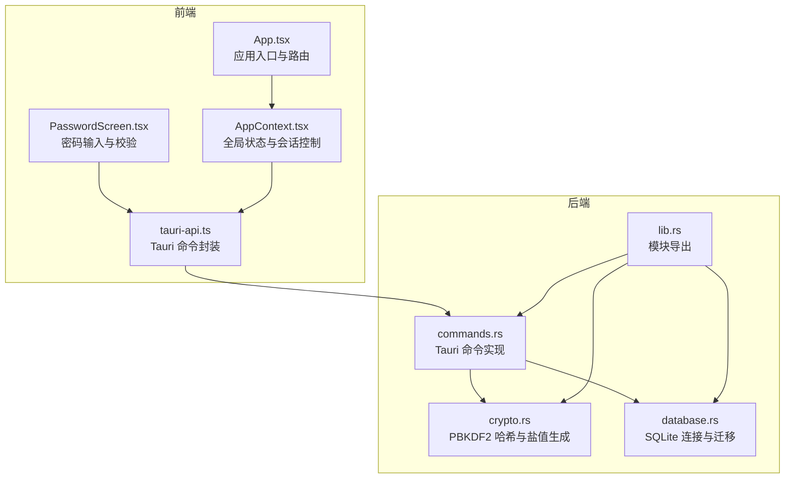
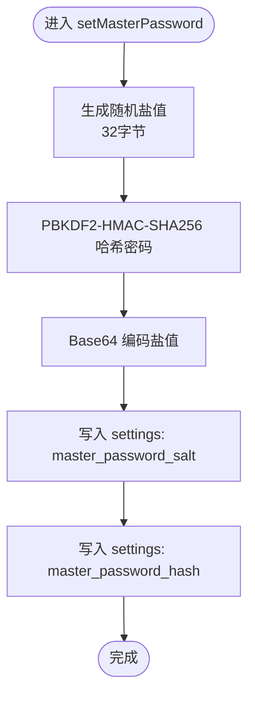
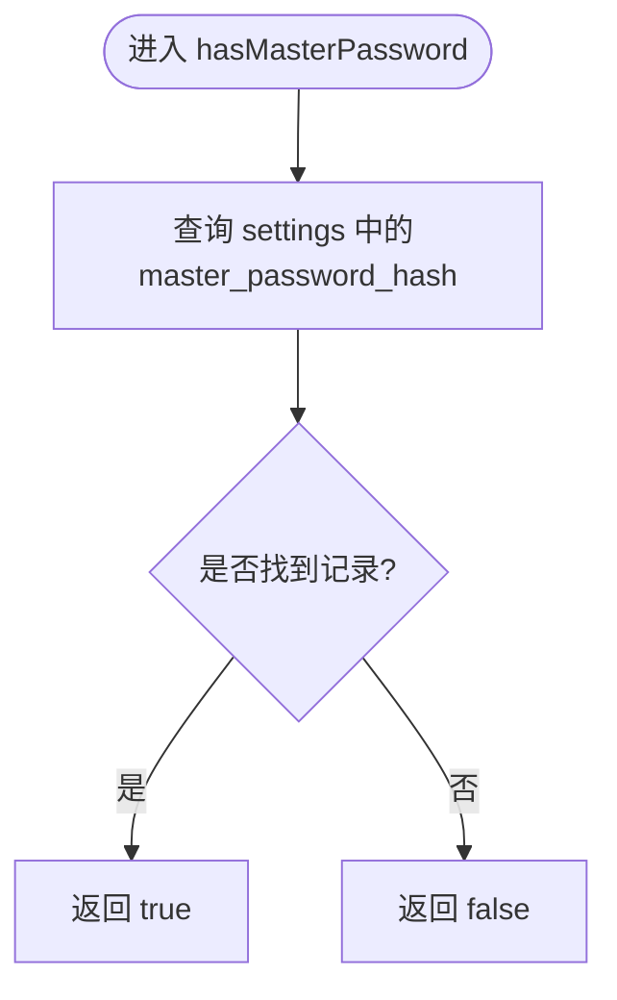
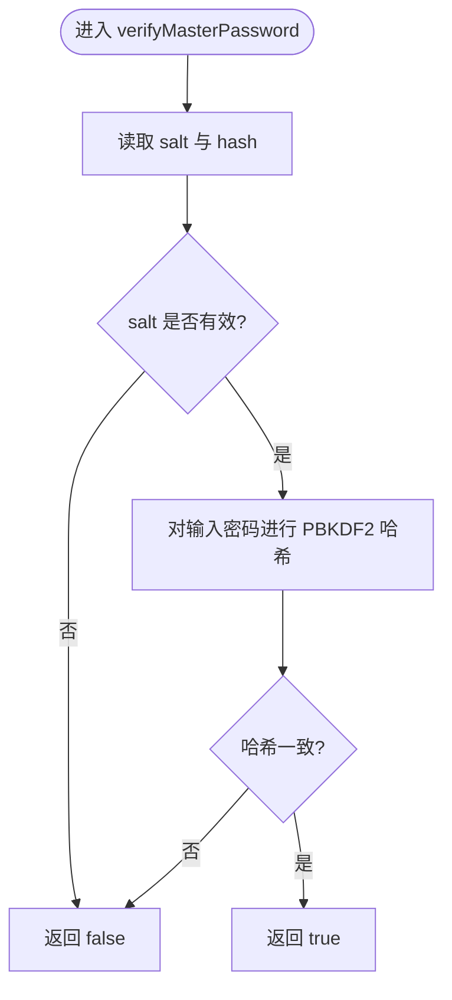
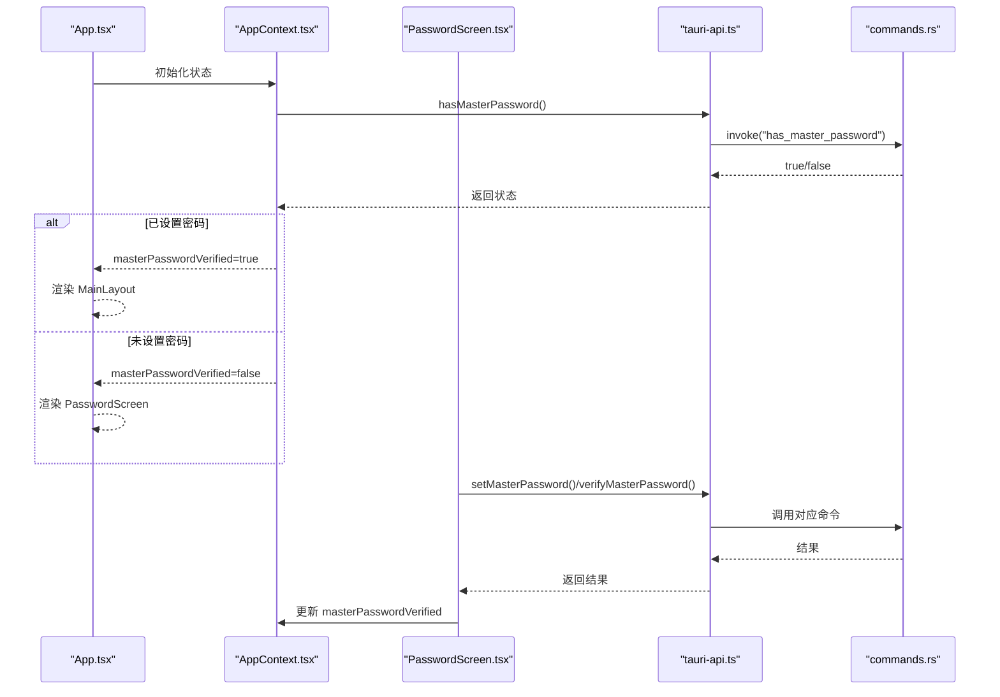
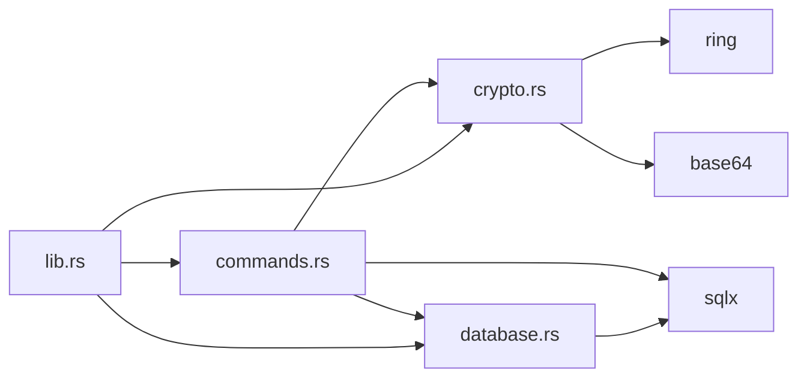

# 安全认证API

<cite>
**本文引用的文件**
- [src-tauri/src/lib.rs](file://src-tauri/src/lib.rs)
- [src-tauri/src/commands.rs](file://src-tauri/src/commands.rs)
- [src-tauri/src/crypto.rs](file://src-tauri/src/crypto.rs)
- [src-tauri/src/database.rs](file://src-tauri/src/database.rs)
- [src-tauri/Cargo.toml](file://src-tauri/Cargo.toml)
- [src/lib/tauri-api.ts](file://src/lib/tauri-api.ts)
- [src/components/PasswordScreen.tsx](file://src/components/PasswordScreen.tsx)
- [src/App.tsx](file://src/App.tsx)
- [src/contexts/AppContext.tsx](file://src/contexts/AppContext.tsx)
- [src/types/index.ts](file://src/types/index.ts)
</cite>

## 目录
1. [简介](#简介)
2. [项目结构](#项目结构)
3. [核心组件](#核心组件)
4. [架构总览](#架构总览)
5. [详细组件分析](#详细组件分析)
6. [依赖关系分析](#依赖关系分析)
7. [性能考虑](#性能考虑)
8. [故障排除指南](#故障排除指南)
9. [结论](#结论)
10. [附录](#附录)

## 简介
本文件系统性地记录了主密码系统的 Tauri 命令接口与前端集成方案，覆盖以下命令：
- setMasterPassword：设置主密码（含盐值生成与 PBKDF2 哈希）
- hasMasterPassword：检查是否已设置主密码
- verifyMasterPassword：验证主密码（基于存储的盐值与哈希）

文档内容包括：安全要求、验证流程、错误处理、密码哈希与盐值策略、安全存储、调用示例、状态码说明、生命周期管理、会话控制与安全审计建议、密码强度验证、重置流程与最佳实践。

## 项目结构
后端采用 Rust + Tauri，前端为 React。主密码逻辑位于后端命令模块与加密模块，前端通过 @tauri-apps/api 调用后端命令，并在应用启动时进行主密码校验与会话控制。



图表来源
- [src-tauri/src/lib.rs](file://src-tauri/src/lib.rs#L1-L4)
- [src-tauri/src/commands.rs](file://src-tauri/src/commands.rs#L1-L572)
- [src-tauri/src/crypto.rs](file://src-tauri/src/crypto.rs#L1-L92)
- [src-tauri/src/database.rs](file://src-tauri/src/database.rs#L1-L104)
- [src/lib/tauri-api.ts](file://src/lib/tauri-api.ts#L1-L97)
- [src/components/PasswordScreen.tsx](file://src/components/PasswordScreen.tsx#L1-L146)
- [src/App.tsx](file://src/App.tsx#L1-L29)
- [src/contexts/AppContext.tsx](file://src/contexts/AppContext.tsx#L1-L162)

章节来源
- [src-tauri/src/lib.rs](file://src-tauri/src/lib.rs#L1-L4)
- [src-tauri/src/commands.rs](file://src-tauri/src/commands.rs#L248-L309)
- [src-tauri/src/crypto.rs](file://src-tauri/src/crypto.rs#L76-L92)
- [src-tauri/src/database.rs](file://src-tauri/src/database.rs#L13-L52)
- [src/lib/tauri-api.ts](file://src/lib/tauri-api.ts#L78-L89)
- [src/components/PasswordScreen.tsx](file://src/components/PasswordScreen.tsx#L30-L61)
- [src/App.tsx](file://src/App.tsx#L7-L19)
- [src/contexts/AppContext.tsx](file://src/contexts/AppContext.tsx#L123-L140)

## 核心组件
- 后端命令模块：提供 setMasterPassword、hasMasterPassword、verifyMasterPassword 三个命令，负责与数据库交互、调用加密模块。
- 加密模块：提供 PBKDF2 哈希与随机盐值生成，确保主密码存储安全。
- 数据库模块：初始化 SQLite 连接池、执行迁移、提供全局连接池访问。
- 前端 API 封装：将后端命令暴露为前端可调用的函数，统一返回类型与错误处理。
- 前端会话控制：在应用启动时检查主密码状态，决定显示密码输入界面或主界面。

章节来源
- [src-tauri/src/commands.rs](file://src-tauri/src/commands.rs#L248-L309)
- [src-tauri/src/crypto.rs](file://src-tauri/src/crypto.rs#L76-L92)
- [src-tauri/src/database.rs](file://src-tauri/src/database.rs#L13-L52)
- [src/lib/tauri-api.ts](file://src/lib/tauri-api.ts#L78-L89)
- [src/contexts/AppContext.tsx](file://src/contexts/AppContext.tsx#L123-L140)

## 架构总览
下图展示主密码从用户输入到后端存储与验证的完整流程。

```mermaid
sequenceDiagram
participant UI as "PasswordScreen.tsx"
participant API as "tauri-api.ts"
participant CMD as "commands.rs"
participant CRY as "crypto.rs"
participant DB as "database.rs"
UI->>API : 调用 setMasterPassword(password)
API->>CMD : invoke("set_master_password", { password })
CMD->>CRY : generate_salt()
CRY-->>CMD : [u8; 32] 盐值
CMD->>CRY : hash_password(password, salt)
CRY-->>CMD : 哈希字符串
CMD->>DB : INSERT OR REPLACE settings(key='master_password_salt', value=base64(salt))
CMD->>DB : INSERT OR REPLACE settings(key='master_password_hash', value=hash)
CMD-->>API : Ok(())
API-->>UI : 成功
UI->>API : 调用 hasMasterPassword()
API->>CMD : invoke("has_master_password")
CMD->>DB : SELECT value FROM settings WHERE key='master_password_hash'
DB-->>CMD : 哈希值或空
CMD-->>API : true/false
API-->>UI : 返回状态
UI->>API : 调用 verifyMasterPassword(password)
API->>CMD : invoke("verify_master_password", { password })
CMD->>DB : SELECT salt/hash
DB-->>CMD : salt/base64编码, hash
CMD->>CRY : hash_password(input, salt)
CRY-->>CMD : 输入哈希
CMD->>CMD : 比较输入哈希与存储哈希
CMD-->>API : true/false
API-->>UI : 返回结果
```

图表来源
- [src/lib/tauri-api.ts](file://src/lib/tauri-api.ts#L78-L89)
- [src-tauri/src/commands.rs](file://src-tauri/src/commands.rs#L248-L309)
- [src-tauri/src/crypto.rs](file://src-tauri/src/crypto.rs#L76-L92)
- [src-tauri/src/database.rs](file://src-tauri/src/database.rs#L13-L52)

## 详细组件分析

### setMasterPassword 命令
- 功能：设置主密码，生成随机盐值，使用 PBKDF2-HMAC-SHA256 计算哈希，分别以键值形式存入 settings 表。
- 关键流程：
  1) 生成 32 字节随机盐值；
  2) 对输入密码进行 PBKDF2 哈希（迭代次数配置见加密模块）；
  3) 将盐值进行 Base64 编码后存入 settings.key='master_password_salt'；
  4) 将哈希字符串存入 settings.key='master_password_hash'。
- 错误处理：数据库写入异常转换为字符串错误返回；Base64 解码/长度校验失败时返回错误。
- 安全要点：盐值随机且固定长度；哈希使用 PBKDF2 并配置足够迭代次数；盐值以 Base64 存储便于跨语言读取。



图表来源
- [src-tauri/src/commands.rs](file://src-tauri/src/commands.rs#L248-L269)
- [src-tauri/src/crypto.rs](file://src-tauri/src/crypto.rs#L76-L92)

章节来源
- [src-tauri/src/commands.rs](file://src-tauri/src/commands.rs#L248-L269)
- [src-tauri/src/crypto.rs](file://src-tauri/src/crypto.rs#L76-L92)

### hasMasterPassword 命令
- 功能：检查 settings 表中是否存在 master_password_hash 键，存在即认为已设置主密码。
- 返回值：布尔值，true 表示已设置，false 表示未设置。
- 错误处理：查询异常转换为字符串错误返回。



图表来源
- [src-tauri/src/commands.rs](file://src-tauri/src/commands.rs#L272-L281)

章节来源
- [src-tauri/src/commands.rs](file://src-tauri/src/commands.rs#L272-L281)

### verifyMasterPassword 命令
- 功能：验证输入密码是否正确。从 settings 表读取存储的盐值与哈希，解码盐值，重新计算输入密码的哈希并与存储哈希比较。
- 关键流程：
  1) 从 settings 读取 salt 与 hash；
  2) Base64 解码 salt 并校验长度为 32 字节；
  3) 使用相同盐值与 PBKDF2 参数对输入密码进行哈希；
  4) 比较输入哈希与存储哈希，相等则返回 true，否则 false。
- 错误处理：盐值编码无效、长度不正确、数据库查询异常均转换为字符串错误；无密码设置时返回 false。



图表来源
- [src-tauri/src/commands.rs](file://src-tauri/src/commands.rs#L284-L309)
- [src-tauri/src/crypto.rs](file://src-tauri/src/crypto.rs#L82-L92)

章节来源
- [src-tauri/src/commands.rs](file://src-tauri/src/commands.rs#L284-L309)
- [src-tauri/src/crypto.rs](file://src-tauri/src/crypto.rs#L82-L92)

### 前端集成与会话控制
- 密码输入界面：首次使用提示设置密码，二次使用提示输入密码；设置时需确认密码且满足最小长度要求；验证时调用后端 verifyMasterPassword。
- 应用入口：根据 masterPasswordVerified 状态决定显示 PasswordScreen 或 MainLayout。
- 全局状态：AppContext 维护 masterPasswordVerified 状态，初始加载时通过 hasMasterPassword 判断是否已设置密码。



图表来源
- [src/App.tsx](file://src/App.tsx#L7-L19)
- [src/contexts/AppContext.tsx](file://src/contexts/AppContext.tsx#L123-L140)
- [src/components/PasswordScreen.tsx](file://src/components/PasswordScreen.tsx#L14-L61)
- [src/lib/tauri-api.ts](file://src/lib/tauri-api.ts#L78-L89)
- [src-tauri/src/commands.rs](file://src-tauri/src/commands.rs#L272-L309)

章节来源
- [src/components/PasswordScreen.tsx](file://src/components/PasswordScreen.tsx#L14-L61)
- [src/App.tsx](file://src/App.tsx#L7-L19)
- [src/contexts/AppContext.tsx](file://src/contexts/AppContext.tsx#L123-L140)
- [src/types/index.ts](file://src/types/index.ts#L45-L46)

## 依赖关系分析
- 外部依赖：ring（PBKDF2 与 AEAD）、base64（编码/解码）、sqlx（SQLite 异步 ORM）、tokio（异步运行时）。
- 内部模块：commands 依赖 crypto 与 database；crypto 独立；database 提供全局连接池。



图表来源
- [src-tauri/src/lib.rs](file://src-tauri/src/lib.rs#L1-L4)
- [src-tauri/src/commands.rs](file://src-tauri/src/commands.rs#L1-L8)
- [src-tauri/src/crypto.rs](file://src-tauri/src/crypto.rs#L1-L6)
- [src-tauri/src/database.rs](file://src-tauri/src/database.rs#L1-L3)
- [src-tauri/Cargo.toml](file://src-tauri/Cargo.toml#L15-L29)

章节来源
- [src-tauri/Cargo.toml](file://src-tauri/Cargo.toml#L15-L29)
- [src-tauri/src/lib.rs](file://src-tauri/src/lib.rs#L1-L4)

## 性能考虑
- PBKDF2 迭代次数：当前实现使用固定迭代次数，建议在生产环境评估设备性能后适当提高以增强抗暴力破解能力，同时注意 UI 响应时间。
- 数据库写入：盐值与哈希分别写入 settings 表，建议保持原子性（单事务）以避免状态不一致。
- Base64 编解码：仅在设置阶段进行一次编码，验证阶段进行一次解码，开销较小。
- 异步模型：命令均使用 async/await，避免阻塞主线程。

## 故障排除指南
- 设置主密码失败
  - 可能原因：数据库连接池未初始化、写入 settings 失败。
  - 排查步骤：确认数据库初始化成功；检查 settings 表是否存在；查看后端日志。
- 验证主密码始终失败
  - 可能原因：salt 编码格式错误、长度不为 32 字节、PBKDF2 参数不一致。
  - 排查步骤：确认 salt 为 32 字节 Base64 编码；确认哈希算法与迭代次数一致。
- 无法判断是否已设置密码
  - 可能原因：查询 settings 失败或表不存在。
  - 排查步骤：确认 settings 表已创建；检查迁移是否成功。

章节来源
- [src-tauri/src/commands.rs](file://src-tauri/src/commands.rs#L248-L309)
- [src-tauri/src/database.rs](file://src-tauri/src/database.rs#L13-L52)

## 结论
该主密码系统通过 PBKDF2-HMAC-SHA256 与随机盐值实现了安全的密码存储与验证，结合前端会话控制与应用入口路由，提供了完整的解锁流程。建议在生产环境中进一步优化 PBKDF2 迭代次数、增强错误日志与审计记录，并考虑支持密码重置流程以提升用户体验与安全性。

## 附录

### API 定义与调用示例
- setMasterPassword
  - 请求体：{ password: string }
  - 返回值：void
  - 调用示例路径：[src/lib/tauri-api.ts](file://src/lib/tauri-api.ts#L78-L81)
- hasMasterPassword
  - 请求体：无
  - 返回值：boolean
  - 调用示例路径：[src/lib/tauri-api.ts](file://src/lib/tauri-api.ts#L83-L85)
- verifyMasterPassword
  - 请求体：{ password: string }
  - 返回值：boolean
  - 调用示例路径：[src/lib/tauri-api.ts](file://src/lib/tauri-api.ts#L87-L89)

章节来源
- [src/lib/tauri-api.ts](file://src/lib/tauri-api.ts#L78-L89)

### 安全参数与策略
- 哈希算法：PBKDF2-HMAC-SHA256
- 盐值：32 字节随机数，Base64 编码存储
- 迭代次数：固定配置（建议按设备性能调整）
- 存储位置：settings 表，键分别为 master_password_salt 与 master_password_hash
- 前端策略：首次使用强制设置密码，二次使用输入验证；验证成功后进入主界面

章节来源
- [src-tauri/src/crypto.rs](file://src-tauri/src/crypto.rs#L82-L92)
- [src-tauri/src/commands.rs](file://src-tauri/src/commands.rs#L248-L309)
- [src/components/PasswordScreen.tsx](file://src/components/PasswordScreen.tsx#L36-L61)

### 生命周期管理与会话控制
- 应用启动：检查主密码状态，决定显示密码输入界面或主界面
- 会话状态：masterPasswordVerified 控制界面渲染
- 状态更新：验证成功后更新全局状态，切换到主界面

章节来源
- [src/App.tsx](file://src/App.tsx#L7-L19)
- [src/contexts/AppContext.tsx](file://src/contexts/AppContext.tsx#L123-L140)
- [src/types/index.ts](file://src/types/index.ts#L45-L46)

### 错误处理与状态码说明
- 返回类型：Result<T, String>，错误统一转换为字符串
- 典型错误场景：
  - 数据库查询/写入失败：返回错误字符串
  - Salt 编码无效或长度不正确：返回错误字符串
  - 未设置密码：hasMasterPassword 返回 false；verifyMasterPassword 返回 false
- 建议：前端统一捕获错误并提示用户；后端增加结构化错误日志以便审计

章节来源
- [src-tauri/src/commands.rs](file://src-tauri/src/commands.rs#L272-L309)

### 密码强度验证与最佳实践
- 强度要求：最小长度 8；建议包含大小写字母、数字与特殊字符
- 最佳实践：
  - 使用强随机源生成盐值
  - 适当提高 PBKDF2 迭代次数
  - 定期轮换主密码
  - 限制连续错误尝试次数
  - 记录安全事件（如多次验证失败）用于审计

章节来源
- [src/components/PasswordScreen.tsx](file://src/components/PasswordScreen.tsx#L41-L44)

### 重置流程建议
- 当前实现未提供密码重置命令。建议新增 resetMasterPassword 命令：
  - 需要管理员权限或额外验证（如邮箱/手机号）
  - 生成新盐值与哈希，替换旧值
  - 清理历史会话状态
  - 记录审计日志

[本节为概念性建议，不直接对应具体源文件]