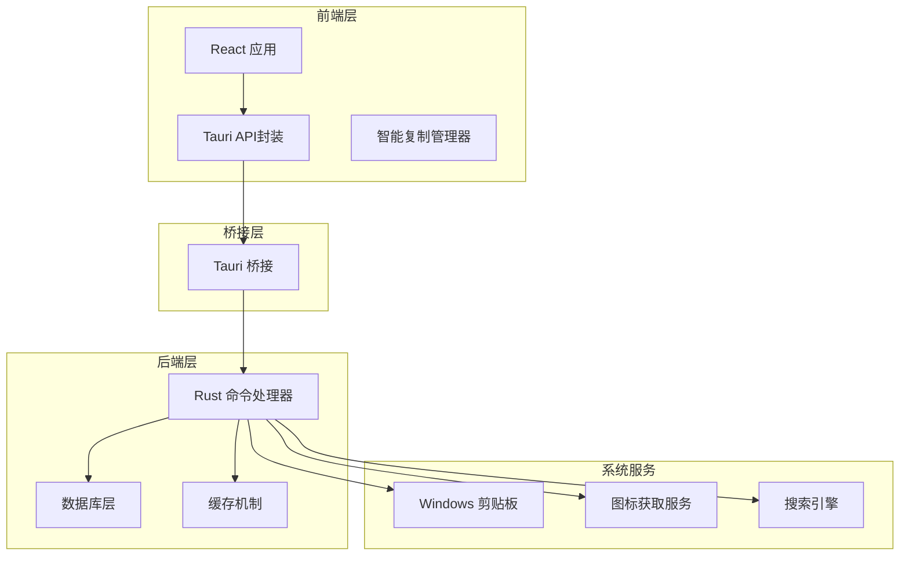
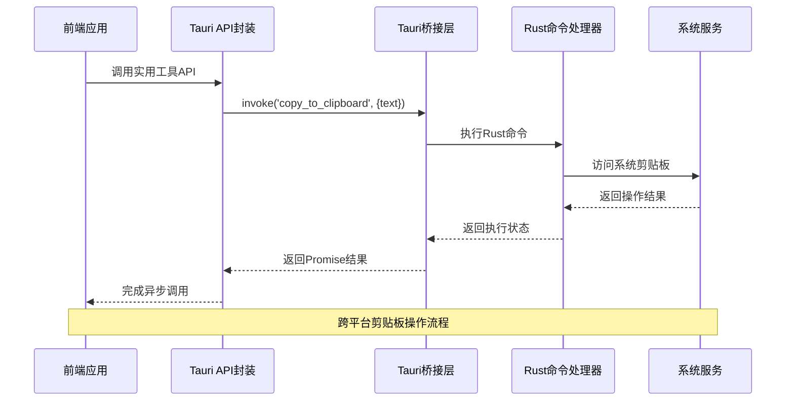
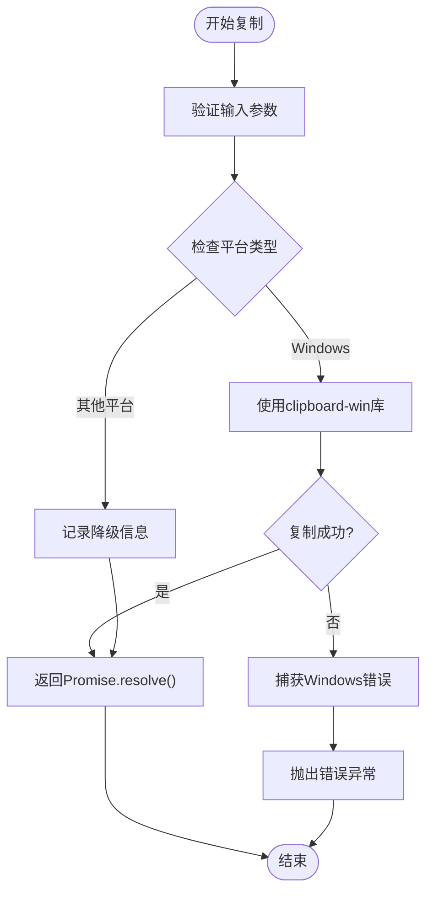
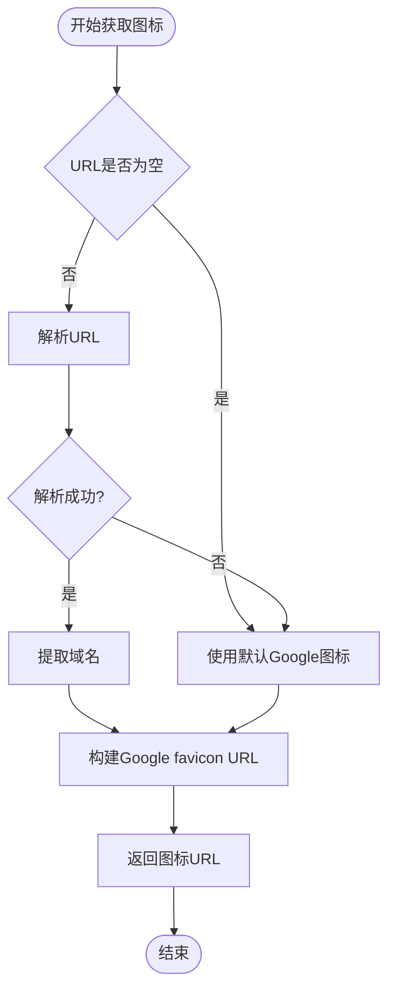
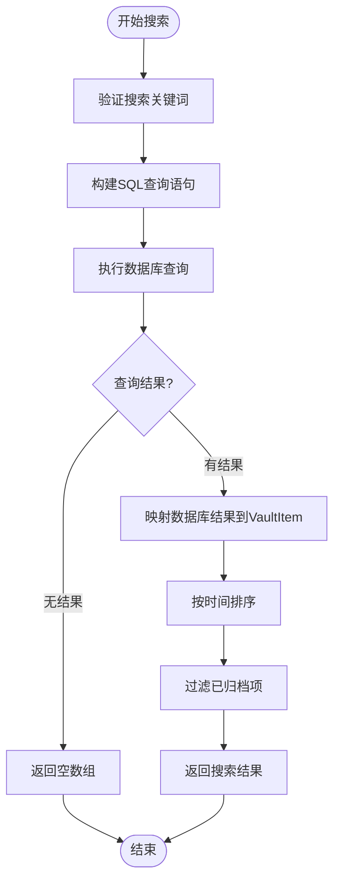

# 实用工具API

<cite>
**本文档引用的文件**
- [src-tauri/src/commands.rs](file://src-tauri/src/commands.rs)
- [src/lib/tauri-api.ts](file://src/lib/tauri-api.ts)
- [src/lib/smart-copy.ts](file://src/lib/smart-copy.ts)
- [src-tauri/src/main.rs](file://src-tauri/src/main.rs)
- [src-tauri/Cargo.toml](file://src-tauri/Cargo.toml)
- [src/types/index.ts](file://src/types/index.ts)
- [src-tauri/src/database.rs](file://src-tauri/src/database.rs)
- [src-tauri/tauri.conf.json](file://src-tauri/tauri.conf.json)
- [src/components/SearchBar.tsx](file://src/components/SearchBar.tsx)
- [src/components/VaultList.tsx](file://src/components/VaultList.tsx)
</cite>

## 目录
1. [简介](#简介)
2. [项目结构](#项目结构)
3. [核心组件](#核心组件)
4. [架构概览](#架构概览)
5. [详细组件分析](#详细组件分析)
6. [依赖关系分析](#依赖关系分析)
7. [性能考虑](#性能考虑)
8. [故障排除指南](#故障排除指南)
9. [结论](#结论)

## 简介

实用工具API是DevVault密码管理应用中的核心功能模块，主要提供三个关键的辅助功能：剪贴板操作、网站图标获取和凭据搜索。该API采用Tauri框架构建，实现了跨平台的原生功能集成，为用户提供安全、高效的密码管理体验。

本API的设计遵循现代前端开发的最佳实践，通过类型安全的接口定义、完善的错误处理机制和优雅的用户体验设计，确保了系统的稳定性和可用性。支持Windows、macOS和Linux等多个操作系统平台，提供了统一的编程接口和一致的功能表现。

## 项目结构

DevVault项目采用前后端分离的架构设计，实用工具API位于后端Rust代码中，通过Tauri桥接层与前端JavaScript进行通信。



**图表来源**
- [src-tauri/src/commands.rs](file://src-tauri/src/commands.rs#L1-L572)
- [src/lib/tauri-api.ts](file://src/lib/tauri-api.ts#L1-L97)
- [src/lib/smart-copy.ts](file://src/lib/smart-copy.ts#L1-L152)

**章节来源**
- [src-tauri/src/commands.rs](file://src-tauri/src/commands.rs#L1-L50)
- [src/lib/tauri-api.ts](file://src/lib/tauri-api.ts#L1-L20)
- [src/lib/smart-copy.ts](file://src/lib/smart-copy.ts#L1-L20)

## 核心组件

实用工具API包含以下三个核心组件：

### 1. 剪贴板操作组件
- **功能**：提供跨平台的剪贴板访问能力
- **平台支持**：Windows原生支持，其他平台提供降级处理
- **安全特性**：基于Tauri的安全沙箱模型

### 2. 图标获取组件  
- **功能**：自动从网站URL提取favicon图标
- **缓存策略**：智能缓存机制减少网络请求
- **容错处理**：默认图标回退机制

### 3. 凭据搜索组件
- **功能**：全文检索加密的凭据数据
- **搜索范围**：标题、备注、URL字段
- **性能优化**：数据库索引和查询优化

**章节来源**
- [src-tauri/src/commands.rs](file://src-tauri/src/commands.rs#L212-L245)
- [src/lib/tauri-api.ts](file://src/lib/tauri-api.ts#L69-L95)

## 架构概览

实用工具API采用分层架构设计，确保了功能的模块化和可维护性。



**图表来源**
- [src/lib/tauri-api.ts](file://src/lib/tauri-api.ts#L70-L72)
- [src-tauri/src/commands.rs](file://src-tauri/src/commands.rs#L212-L228)
- [src-tauri/src/main.rs](file://src-tauri/src/main.rs#L37-L38)

**章节来源**
- [src-tauri/src/main.rs](file://src-tauri/src/main.rs#L24-L58)
- [src-tauri/Cargo.toml](file://src-tauri/Cargo.toml#L15-L28)

## 详细组件分析

### 剪贴板操作组件

#### API定义
剪贴板操作通过`copy_to_clipboard`命令实现，支持字符串内容的复制操作。

**函数签名**
```typescript
copyToClipboard(text: string): Promise<void>
```

**参数规范**
- `text` (string): 需要复制到剪贴板的文本内容
- 类型：必填，字符串类型
- 长度限制：无明确限制，受系统剪贴板容量影响

**返回值格式**
- 成功：Promise.resolve()
- 失败：抛出错误异常

**错误处理机制**
- Windows平台：使用clipboard-win库进行原生操作
- 其他平台：提供降级处理，记录错误日志但不中断应用
- 异常捕获：完整的try-catch包装



**图表来源**
- [src-tauri/src/commands.rs](file://src-tauri/src/commands.rs#L212-L228)

**章节来源**
- [src-tauri/src/commands.rs](file://src-tauri/src/commands.rs#L212-L228)
- [src/lib/tauri-api.ts](file://src/lib/tauri-api.ts#L70-L72)

### 图标获取组件

#### API定义
图标获取通过`fetch_favicon`命令实现，从给定的URL提取对应的网站图标。

**函数签名**
```typescript
fetchFavicon(url: string): Promise<string>
```

**参数规范**
- `url` (string): 目标网站的URL地址
- 类型：必填，字符串类型
- 格式要求：有效的URL格式

**返回值格式**
- 成功：Promise<string>，返回图标URL
- 失败：Promise.reject()，抛出错误异常

**错误处理机制**
- URL解析：使用url库进行安全解析
- 默认回退：解析失败时使用Google favicon服务
- 域名提取：从完整URL中提取域名部分



**图表来源**
- [src-tauri/src/commands.rs](file://src-tauri/src/commands.rs#L231-L245)

**章节来源**
- [src-tauri/src/commands.rs](file://src-tauri/src/commands.rs#L231-L245)
- [src/lib/tauri-api.ts](file://src/lib/tauri-api.ts#L74-L76)

### 凭据搜索组件

#### API定义
凭据搜索通过`search_items`命令实现，支持在加密的凭据数据中进行全文检索。

**函数签名**
```typescript
searchItems(query: string): Promise<VaultItem[]>
```

**参数规范**
- `query` (string): 搜索关键词
- 类型：必填，字符串类型
- 最小长度：1个字符

**返回值格式**
- 成功：Promise<VaultItem[]>，返回匹配的凭据列表
- 失败：Promise.reject()，抛出错误异常

**搜索算法实现**
- 模糊匹配：使用LIKE操作符进行模糊搜索
- 多字段检索：同时搜索title、notes、url字段
- 排序规则：按最后修改时间降序排列
- 过滤条件：排除已归档的凭据项



**图表来源**
- [src-tauri/src/commands.rs](file://src-tauri/src/commands.rs#L175-L210)

**章节来源**
- [src-tauri/src/commands.rs](file://src-tauri/src/commands.rs#L175-L210)
- [src/lib/tauri-api.ts](file://src/lib/tauri-api.ts#L52-L54)

### 智能复制管理器

智能复制管理器提供了增强的剪贴板复制功能，支持多种格式转换和历史记录管理。

**核心功能**
- 多格式支持：原始格式、环境变量格式、JSON格式
- 自动格式检测：根据内容特征自动选择最佳格式
- 历史记录：保存最近的复制操作记录
- 可视反馈：提供复制成功的视觉提示

**配置选项**
```typescript
interface CopyFormat {
  type: 'raw' | 'env' | 'json' | 'custom';
  template?: string;
}
```

**章节来源**
- [src/lib/smart-copy.ts](file://src/lib/smart-copy.ts#L1-L152)

## 依赖关系分析

实用工具API的依赖关系体现了清晰的分层架构和职责分离。

```mermaid
graph TB
subgraph "外部依赖"
TauriAPI[@tauri-apps/api]
ClipboardWin[clipboard-win]
SQLx[sqlx]
Reqwest[reqwest]
Url[url]
end
subgraph "内部模块"
Commands[commands.rs]
Main[main.rs]
Database[database.rs]
Types[index.ts]
end
subgraph "应用层"
TauriAPI --> Commands
ClipboardWin --> Commands
SQLx --> Database
Reqwest --> Commands
Url --> Commands
end
Commands --> Database
Main --> Commands
Types --> Commands
```

**图表来源**
- [src-tauri/Cargo.toml](file://src-tauri/Cargo.toml#L15-L28)
- [src-tauri/src/main.rs](file://src-tauri/src/main.rs#L8-L22)

**章节来源**
- [src-tauri/Cargo.toml](file://src-tauri/Cargo.toml#L15-L28)
- [src-tauri/src/main.rs](file://src-tauri/src/main.rs#L8-L22)

## 性能考虑

实用工具API在设计时充分考虑了性能优化和资源管理。

### 数据库优化
- 连接池管理：使用OnceCell确保单例连接池
- 查询优化：针对搜索功能建立适当的索引
- 连接复用：避免频繁创建和销毁数据库连接

### 缓存策略
- 图标缓存：利用Google favicon服务的CDN优势
- 内存缓存：智能复制管理器的内存历史记录
- 磁盘缓存：数据库层面的查询结果缓存

### 异步处理
- 非阻塞操作：所有数据库操作都是异步执行
- 并发控制：合理限制同时进行的数据库连接数量
- 超时处理：为长时间运行的操作设置超时机制

## 故障排除指南

### 常见问题及解决方案

**剪贴板操作失败**
- Windows平台：检查clipboard-win库版本兼容性
- 权限问题：确保应用具有剪贴板访问权限
- 系统限制：某些企业环境可能禁用剪贴板功能

**图标获取异常**
- 网络问题：检查网络连接和防火墙设置
- URL格式：确保输入正确的URL格式
- 服务不可用：Google favicon服务临时不可用时的降级处理

**搜索功能异常**
- 数据库连接：检查SQLite数据库文件的可读写权限
- 查询语法：验证SQL查询语句的正确性
- 性能问题：大数据量时考虑添加数据库索引

**章节来源**
- [src-tauri/src/commands.rs](file://src-tauri/src/commands.rs#L212-L245)
- [src-tauri/src/database.rs](file://src-tauri/src/database.rs#L99-L104)

## 结论

实用工具API为DevVault密码管理应用提供了强大而灵活的辅助功能集合。通过精心设计的架构和完善的错误处理机制，该API确保了跨平台的一致性和可靠性。

### 主要优势
- **跨平台兼容**：统一的API接口支持多个操作系统
- **类型安全**：完整的TypeScript类型定义确保编译时安全
- **性能优化**：合理的缓存策略和数据库优化
- **用户体验**：优雅的错误处理和用户反馈机制

### 技术特色
- 基于Tauri的安全沙箱模型
- 智能的剪贴板管理和格式转换
- 高效的数据库搜索和缓存机制
- 完善的异步处理和错误恢复

该API为密码管理应用提供了坚实的技术基础，为用户创造了安全、便捷的使用体验。通过持续的优化和改进，实用工具API将继续为DevVault的发展提供强有力的支持。