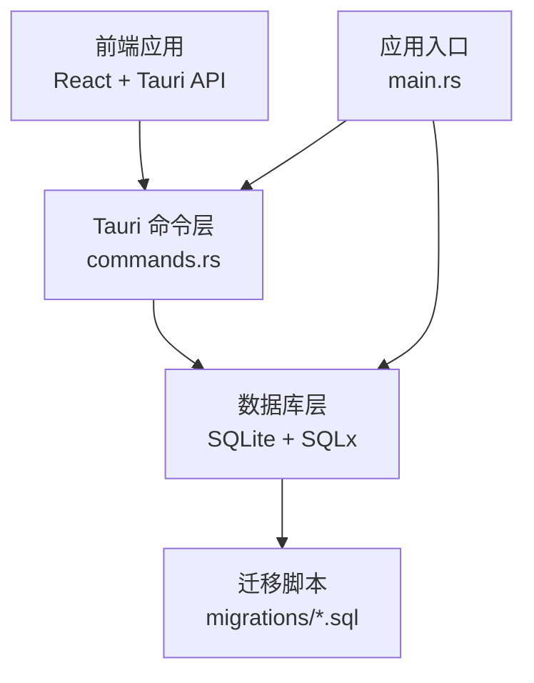
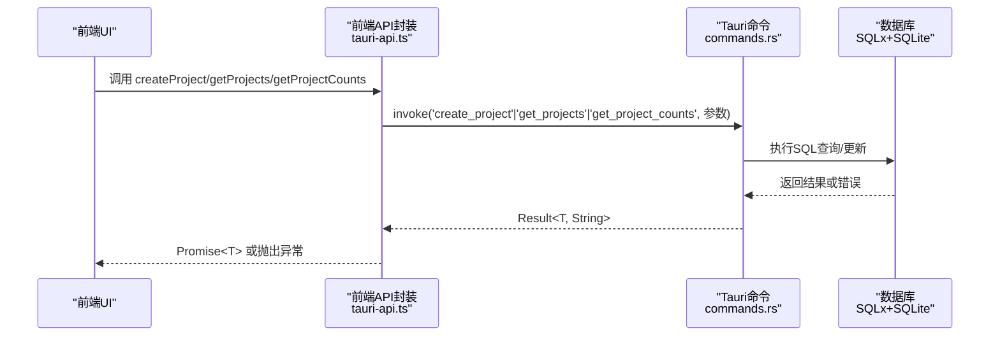
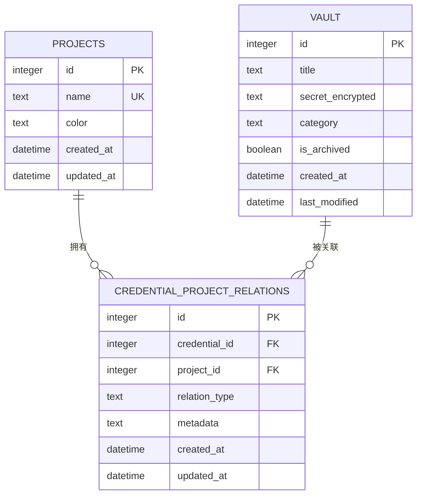

# 项目管理API

<cite>
**本文档引用的文件**
- [src-tauri/src/commands.rs](file://src-tauri/src/commands.rs)
- [src-tauri/src/database.rs](file://src-tauri/src/database.rs)
- [src-tauri/src/main.rs](file://src-tauri/src/main.rs)
- [src-tauri/migrations/001_create_projects_table.sql](file://src-tauri/migrations/001_create_projects_table.sql)
- [src-tauri/migrations/002_create_relations_table.sql](file://src-tauri/migrations/002_create_relations_table.sql)
- [src-tauri/migrations/005_migrate_vault_relations.sql](file://src-tauri/migrations/005_migrate_vault_relations.sql)
- [src/lib/tauri-api.ts](file://src/lib/tauri-api.ts)
- [src/types/index.ts](file://src/types/index.ts)
- [src/components/Sidebar.tsx](file://src/components/Sidebar.tsx)
- [src/components/ProjectRelations.tsx](file://src/components/ProjectRelations.tsx)
</cite>

## 目录
1. [简介](#简介)
2. [项目结构](#项目结构)
3. [核心组件](#核心组件)
4. [架构总览](#架构总览)
5. [详细组件分析](#详细组件分析)
6. [依赖分析](#依赖分析)
7. [性能考虑](#性能考虑)
8. [故障排除指南](#故障排除指南)
9. [结论](#结论)
10. [附录](#附录)

## 简介
本文件为项目管理API的权威技术文档，聚焦于与“项目”相关的Tauri命令接口，涵盖以下目标：
- 完整记录 createProject（创建项目）、getProjects（获取所有项目）、getProjectCounts（获取项目统计）三个核心API的参数规范、返回值格式与错误处理机制
- 解释 Project 数据模型字段、颜色主题配置与项目层级关系（通过凭证-项目关联表实现）
- 提供调用示例、请求/响应格式与状态码说明
- 说明项目分类逻辑、权限控制与数据隔离机制
- 给出项目重命名、删除保护与批量操作的最佳实践建议

## 项目结构
前端通过 @tauri-apps/api 调用后端 Tauri 命令；后端 Rust 模块负责数据库初始化、SQL 查询与业务逻辑；SQLite 数据库存储项目与关联信息。

图表来源
- [src-tauri/src/main.rs](file://src-tauri/src/main.rs#L24-L58)
- [src-tauri/src/commands.rs](file://src-tauri/src/commands.rs#L1-L572)
- [src-tauri/src/database.rs](file://src-tauri/src/database.rs#L1-L104)
- [src-tauri/migrations/001_create_projects_table.sql](file://src-tauri/migrations/001_create_projects_table.sql#L1-L13)
- [src-tauri/migrations/002_create_relations_table.sql](file://src-tauri/migrations/002_create_relations_table.sql#L1-L16)

章节来源
- [src-tauri/src/main.rs](file://src-tauri/src/main.rs#L1-L58)
- [src-tauri/src/database.rs](file://src-tauri/src/database.rs#L1-L104)

## 核心组件
- 前端封装：在 [src/lib/tauri-api.ts](file://src/lib/tauri-api.ts#L56-L67) 中导出 createProject、getProjects、getProjectCounts 三个方法，统一调用 invoke('命令名', 参数)
- 后端命令：在 [src-tauri/src/commands.rs](file://src-tauri/src/commands.rs#L140-L172) 实现 create_project、get_projects、get_project_counts
- 数据模型：Project 结构体定义于 [src-tauri/src/commands.rs](file://src-tauri/src/commands.rs#L23-L28)，类型定义于 [src/types/index.ts](file://src/types/index.ts#L14-L19)
- 数据库与迁移：项目表与关联表定义见 [001_create_projects_table.sql](file://src-tauri/migrations/001_create_projects_table.sql#L1-L13)、[002_create_relations_table.sql](file://src-tauri/migrations/002_create_relations_table.sql#L1-L16)，默认项目迁移见 [005_migrate_vault_relations.sql](file://src-tauri/migrations/005_migrate_vault_relations.sql#L1-L18)

章节来源
- [src/lib/tauri-api.ts](file://src/lib/tauri-api.ts#L56-L67)
- [src-tauri/src/commands.rs](file://src-tauri/src/commands.rs#L23-L28)
- [src/types/index.ts](file://src/types/index.ts#L14-L19)
- [src-tauri/migrations/001_create_projects_table.sql](file://src-tauri/migrations/001_create_projects_table.sql#L1-L13)
- [src-tauri/migrations/002_create_relations_table.sql](file://src-tauri/migrations/002_create_relations_table.sql#L1-L16)
- [src-tauri/migrations/005_migrate_vault_relations.sql](file://src-tauri/migrations/005_migrate_vault_relations.sql#L1-L18)

## 架构总览
下图展示从前端到后端再到数据库的数据流与职责边界：

图表来源
- [src/lib/tauri-api.ts](file://src/lib/tauri-api.ts#L56-L67)
- [src-tauri/src/commands.rs](file://src-tauri/src/commands.rs#L140-L172)
- [src-tauri/src/database.rs](file://src-tauri/src/database.rs#L99-L104)

## 详细组件分析

### API：createProject（创建项目）
- 前端调用
  - 方法：[src/lib/tauri-api.ts](file://src/lib/tauri-api.ts#L57-L59)
  - 参数：Project 接口（不包含 id），例如 { name, color }
  - 返回：Promise<number>（新项目的 id）
- 后端实现
  - 命令：[src-tauri/src/commands.rs](file://src-tauri/src/commands.rs#L140-L152)
  - SQL：向 projects 表插入 name 与 color
  - 错误处理：数据库错误映射为字符串错误
- 数据模型
  - Project 字段：id?, name, color
  - 类型定义：[src/types/index.ts](file://src/types/index.ts#L14-L19)
- 请求/响应示例
  - 请求体（JSON）：{"name":"Web开发","color":"#3b82f6"}
  - 成功响应：200，返回新 id（number）
  - 失败响应：500，返回错误字符串
- 状态码
  - 200：成功
  - 500：数据库错误（如唯一约束冲突导致的插入失败）

章节来源
- [src/lib/tauri-api.ts](file://src/lib/tauri-api.ts#L57-L59)
- [src-tauri/src/commands.rs](file://src-tauri/src/commands.rs#L140-L152)
- [src/types/index.ts](file://src/types/index.ts#L14-L19)

### API：getProjects（获取所有项目）
- 前端调用
  - 方法：[src/lib/tauri-api.ts](file://src/lib/tauri-api.ts#L61-L63)
  - 参数：无
  - 返回：Promise<Project[]>
- 后端实现
  - 命令：[src-tauri/src/commands.rs](file://src-tauri/src/commands.rs#L154-L172)
  - SQL：从 projects 表按 name 排序查询 id、name、color
- 请求/响应示例
  - 请求：GET /invoke/get_projects
  - 成功响应：200，返回数组 [{id,name,color}, ...]
  - 失败响应：500，错误字符串
- 状态码
  - 200：成功
  - 500：数据库错误

章节来源
- [src/lib/tauri-api.ts](file://src/lib/tauri-api.ts#L61-L63)
- [src-tauri/src/commands.rs](file://src-tauri/src/commands.rs#L154-L172)

### API：getProjectCounts（获取项目统计）
- 前端调用
  - 方法：[src/lib/tauri-api.ts](file://src/lib/tauri-api.ts#L65-L67)
  - 参数：无
  - 返回：Promise<ProjectWithCount[]>（含 count 字段）
- 后端实现
  - 命令：[src-tauri/src/commands.rs](file://src-tauri/src/commands.rs#L373-L392)
  - 数据模型：ProjectWithCount 包含 id、name、color、count
  - SQL：LEFT JOIN credential_project_relations 计算每个项目的凭证数量
- 请求/响应示例
  - 请求：GET /invoke/get_project_counts
  - 成功响应：200，返回数组 [{id,name,color,count}, ...]
  - 失败响应：500，错误字符串
- 状态码
  - 200：成功
  - 500：数据库错误

章节来源
- [src/lib/tauri-api.ts](file://src/lib/tauri-api.ts#L65-L67)
- [src-tauri/src/commands.rs](file://src-tauri/src/commands.rs#L365-L392)

### 数据模型与颜色主题
- Project 模型
  - 字段：id?, name, color
  - 类型定义：[src/types/index.ts](file://src/types/index.ts#L14-L19)
- ProjectWithCount 模型
  - 字段：id?, name, color, count
  - 定义位置：[src-tauri/src/commands.rs](file://src-tauri/src/commands.rs#L365-L371)
- 颜色主题
  - 默认颜色：迁移脚本中默认项目颜色为固定值
  - 自定义颜色：前端创建项目时可传入任意十六进制颜色值
  - 展示：侧边栏项目列表直接使用项目 color 渲染色块

章节来源
- [src/types/index.ts](file://src/types/index.ts#L14-L19)
- [src-tauri/src/commands.rs](file://src-tauri/src/commands.rs#L365-L371)
- [src-tauri/migrations/001_create_projects_table.sql](file://src-tauri/migrations/001_create_projects_table.sql#L4-L5)
- [src-tauri/migrations/005_migrate_vault_relations.sql](file://src-tauri/migrations/005_migrate_vault_relations.sql#L3-L5)
- [src/components/Sidebar.tsx](file://src/components/Sidebar.tsx#L88-L95)

### 项目层级关系与分类逻辑
- 层级关系
  - 项目（projects）与凭证（vault）通过 credential_project_relations 关联
  - 关系表包含 credential_id、project_id、relation_type、metadata、created_at
- 分类逻辑
  - 项目列表显示：getProjects 返回所有项目
  - 项目统计：getProjectCounts 基于关联表统计每个项目的凭证数量
  - 项目筛选：getVaultItemsByProject 通过关联表过滤指定项目下的凭证
- 数据隔离
  - 通过外键约束与关联表实现“凭证-项目”的多对多关系，避免凭证跨项目泄露
  - 删除保护：删除项目不会直接删除凭证，仅移除关联；删除凭证会级联删除其关联

图表来源
- [src-tauri/migrations/001_create_projects_table.sql](file://src-tauri/migrations/001_create_projects_table.sql#L1-L13)
- [src-tauri/migrations/002_create_relations_table.sql](file://src-tauri/migrations/002_create_relations_table.sql#L1-L16)
- [src-tauri/src/commands.rs](file://src-tauri/src/commands.rs#L311-L363)

章节来源
- [src-tauri/migrations/002_create_relations_table.sql](file://src-tauri/migrations/002_create_relations_table.sql#L1-L16)
- [src-tauri/src/commands.rs](file://src-tauri/src/commands.rs#L311-L363)

### 权限控制与数据隔离机制
- 权限控制
  - 当前实现未包含用户认证/授权逻辑；所有操作均基于本地数据库
- 数据隔离
  - 通过 credential_project_relations 的外键约束与索引保证数据一致性
  - 删除凭证时的 CASCADE 级联删除确保数据完整性

章节来源
- [src-tauri/migrations/002_create_relations_table.sql](file://src-tauri/migrations/002_create_relations_table.sql#L10-L11)

### 调用示例与最佳实践

- 前端调用示例
  - 创建项目：参考 [src/lib/tauri-api.ts](file://src/lib/tauri-api.ts#L57-L59)
  - 获取项目：参考 [src/lib/tauri-api.ts](file://src/lib/tauri-api.ts#L61-L63)
  - 获取项目统计：参考 [src/lib/tauri-api.ts](file://src/lib/tauri-api.ts#L65-L67)
- 最佳实践
  - 重命名：当前未提供 rename_project 命令，建议通过更新项目名称后端逻辑实现（需扩展命令与SQL）
  - 删除保护：删除项目不会影响凭证数据，但会移除关联；如需彻底删除凭证，请先解除所有关联
  - 批量操作：前端可并发调用多个 createProject/getProjects 等命令，注意错误聚合与回滚策略（当前命令不支持事务回滚，需在上层协调）

章节来源
- [src/lib/tauri-api.ts](file://src/lib/tauri-api.ts#L56-L67)

## 依赖分析
- 前端依赖
  - @tauri-apps/api：用于 invoke 命令与事件监听
  - 类型定义：src/types/index.ts
- 后端依赖
  - tauri、sqlx、serde、tokio、ring、base64、url 等
- 数据库依赖
  - SQLite + SQLx（异步运行时 tokio + rustls）
  - 迁移脚本确保表结构与默认数据一致性

图表来源
- [src/lib/tauri-api.ts](file://src/lib/tauri-api.ts#L1-L2)
- [src-tauri/Cargo.toml](file://src-tauri/Cargo.toml#L15-L29)
- [src-tauri/src/commands.rs](file://src-tauri/src/commands.rs#L1-L10)
- [src-tauri/src/database.rs](file://src-tauri/src/database.rs#L1-L5)

章节来源
- [src-tauri/Cargo.toml](file://src-tauri/Cargo.toml#L15-L29)
- [src-tauri/src/database.rs](file://src-tauri/src/database.rs#L1-L5)

## 性能考虑
- 索引优化
  - projects.name 上有索引，getProjects 排序与查询效率较高
  - relations 表对 credential_id 与 project_id 建有索引，getProjectCounts 与 getVaultItemsByProject 查询更高效
- 查询复杂度
  - getProjectCounts 使用 LEFT JOIN 计数，时间复杂度近似 O(n+m)，n 为项目数，m 为关联数
- 建议
  - 大规模项目场景下，可考虑分页查询或缓存统计结果
  - 避免频繁触发 getProjectCounts，可在项目变更后增量更新

章节来源
- [src-tauri/migrations/001_create_projects_table.sql](file://src-tauri/migrations/001_create_projects_table.sql#L12)
- [src-tauri/migrations/002_create_relations_table.sql](file://src-tauri/migrations/002_create_relations_table.sql#L14-L15)
- [src-tauri/src/commands.rs](file://src-tauri/src/commands.rs#L373-L392)

## 故障排除指南
- 常见错误
  - 数据库未初始化：检查 main.rs 初始化流程与日志输出
  - 唯一约束冲突：projects.name 唯一，重复名称会导致插入失败
  - 数据库连接失败：确认 devvault.db 文件存在且可读写
- 错误处理机制
  - 后端命令统一返回 Result<T, String>，错误映射为字符串
  - 前端捕获异常并提示用户
- 调试步骤
  - 在 main.rs 中查看初始化日志
  - 在浏览器开发者工具 Network 面板观察 invoke 请求与响应
  - 在终端查看 Tauri 应用日志输出

章节来源
- [src-tauri/src/main.rs](file://src-tauri/src/main.rs#L47-L55)
- [src-tauri/src/database.rs](file://src-tauri/src/database.rs#L13-L52)
- [src-tauri/src/commands.rs](file://src-tauri/src/commands.rs#L140-L152)

## 结论
本项目管理API以简洁的三命令为核心，结合凭证-项目关联表实现了清晰的项目分类与统计能力。前端通过统一的 API 封装屏蔽了底层细节，后端通过 SQLx 与 SQLite 提供稳定的数据持久化。建议后续扩展重命名、删除保护与批量操作等能力，并在需要时引入用户认证与权限控制以增强安全性。

## 附录

### API 定义与参数说明

- createProject
  - 前端：[src/lib/tauri-api.ts](file://src/lib/tauri-api.ts#L57-L59)
  - 后端：[src-tauri/src/commands.rs](file://src-tauri/src/commands.rs#L140-L152)
  - 参数：Project（name, color）
  - 返回：number（新项目 id）
  - 状态码：200 成功，500 失败
- getProjects
  - 前端：[src/lib/tauri-api.ts](file://src/lib/tauri-api.ts#L61-L63)
  - 后端：[src-tauri/src/commands.rs](file://src-tauri/src/commands.rs#L154-L172)
  - 参数：无
  - 返回：Project[]
  - 状态码：200 成功，500 失败
- getProjectCounts
  - 前端：[src/lib/tauri-api.ts](file://src/lib/tauri-api.ts#L65-L67)
  - 后端：[src-tauri/src/commands.rs](file://src-tauri/src/commands.rs#L373-L392)
  - 参数：无
  - 返回：ProjectWithCount[]
  - 状态码：200 成功，500 失败

### 数据模型字段定义

- Project
  - id?: number
  - name: string
  - color: string
  - count?: number（仅统计接口返回）
- ProjectWithCount
  - id?: number
  - name: string
  - color: string
  - count: number

章节来源
- [src/types/index.ts](file://src/types/index.ts#L14-L19)
- [src-tauri/src/commands.rs](file://src-tauri/src/commands.rs#L365-L371)