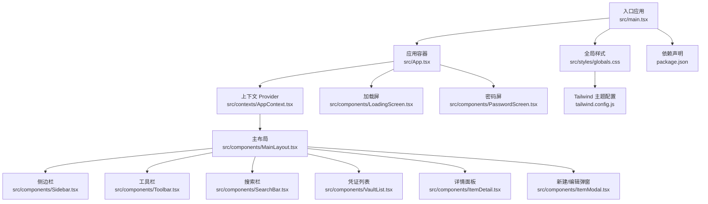
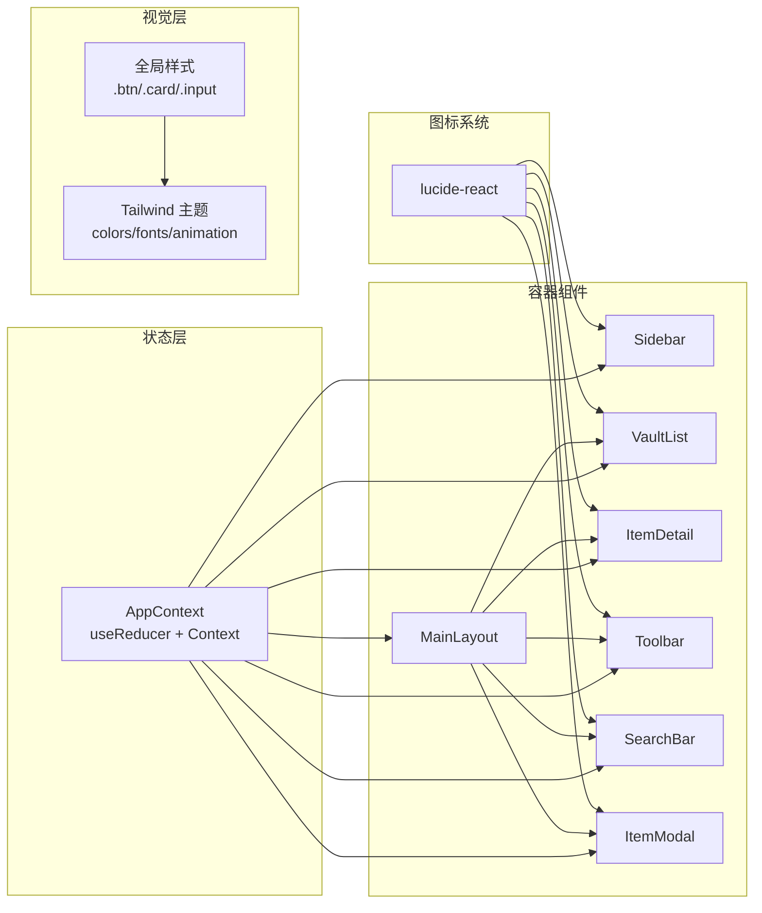
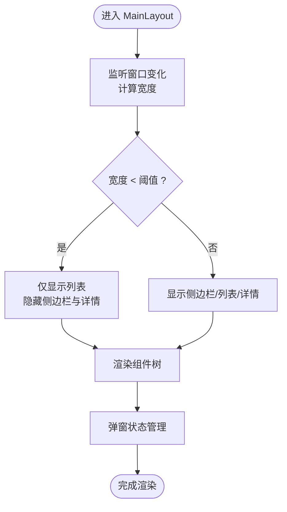
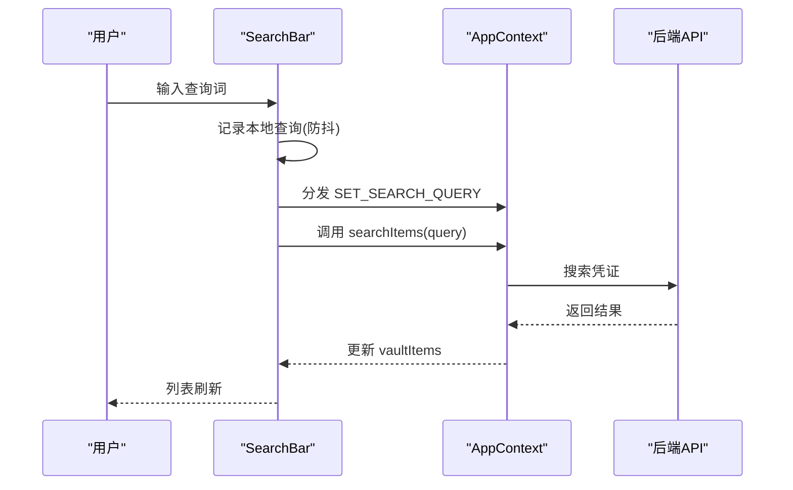
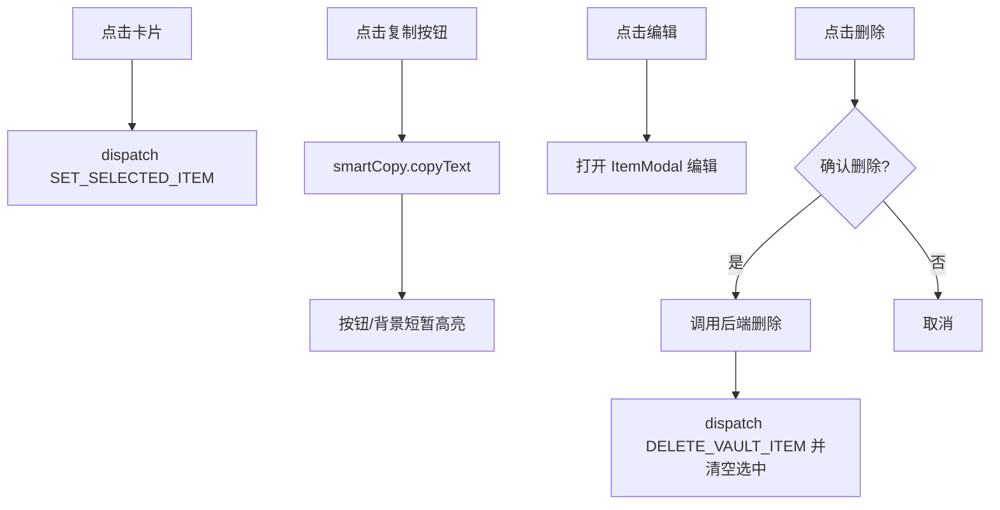
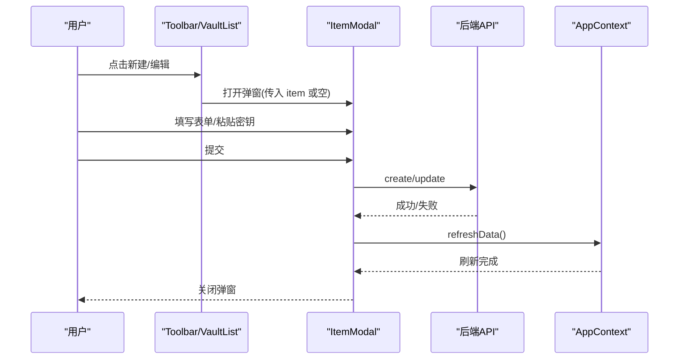
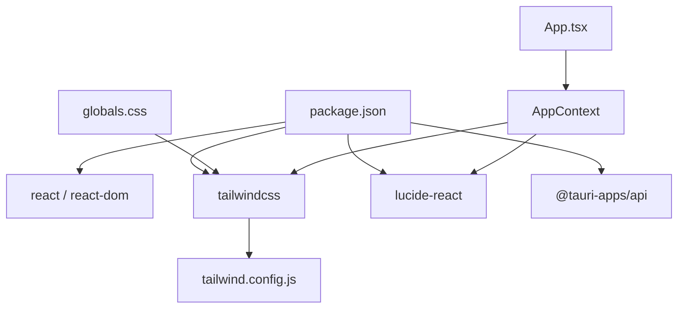

# UI设计

<cite>
**本文引用的文件**
- [package.json](file://package.json)
- [tailwind.config.js](file://tailwind.config.js)
- [src/styles/globals.css](file://src/styles/globals.css)
- [src/main.tsx](file://src/main.tsx)
- [src/App.tsx](file://src/App.tsx)
- [src/contexts/AppContext.tsx](file://src/contexts/AppContext.tsx)
- [src/components/MainLayout.tsx](file://src/components/MainLayout.tsx)
- [src/components/Sidebar.tsx](file://src/components/Sidebar.tsx)
- [src/components/Toolbar.tsx](file://src/components/Toolbar.tsx)
- [src/components/VaultList.tsx](file://src/components/VaultList.tsx)
- [src/components/SearchBar.tsx](file://src/components/SearchBar.tsx)
- [src/components/ItemDetail.tsx](file://src/components/ItemDetail.tsx)
- [src/components/ItemModal.tsx](file://src/components/ItemModal.tsx)
- [src/components/LoadingScreen.tsx](file://src/components/LoadingScreen.tsx)
- [src/components/PasswordScreen.tsx](file://src/components/PasswordScreen.tsx)
</cite>

## 目录
1. [简介](#简介)
2. [项目结构](#项目结构)
3. [核心组件](#核心组件)
4. [架构总览](#架构总览)
5. [组件详解](#组件详解)
6. [依赖关系分析](#依赖关系分析)
7. [性能与可用性](#性能与可用性)
8. [故障排查指南](#故障排查指南)
9. [结论](#结论)
10. [附录](#附录)

## 简介
本文件系统化梳理 AIpassword 的 UI 设计体系，围绕设计理念、视觉层次、交互模式展开；同时覆盖响应式布局、移动端适配、跨平台一致性；并从组件设计原则、用户体验优化、无障碍支持、图标系统（lucide-react）、动画与过渡、交互反馈、加载与错误状态等方面进行深入解析，辅以可视化图示帮助不同背景读者理解。

## 项目结构
- 前端采用 React + Vite 构建，样式通过 TailwindCSS 与自定义基础层组合实现。
- UI 组件集中在 src/components 下，状态管理通过 React Context + useReducer 实现，全局样式在 src/styles/globals.css 中集中定义。
- 图标统一使用 lucide-react，主题色板与动效在 tailwind.config.js 中集中配置。

图表来源
- [src/main.tsx](file://src/main.tsx#L1-L10)
- [src/App.tsx](file://src/App.tsx#L1-L29)
- [src/contexts/AppContext.tsx](file://src/contexts/AppContext.tsx#L1-L162)
- [src/components/MainLayout.tsx](file://src/components/MainLayout.tsx#L1-L103)
- [src/components/Sidebar.tsx](file://src/components/Sidebar.tsx#L1-L143)
- [src/components/Toolbar.tsx](file://src/components/Toolbar.tsx#L1-L46)
- [src/components/SearchBar.tsx](file://src/components/SearchBar.tsx#L1-L50)
- [src/components/VaultList.tsx](file://src/components/VaultList.tsx#L1-L209)
- [src/components/ItemDetail.tsx](file://src/components/ItemDetail.tsx#L1-L234)
- [src/components/ItemModal.tsx](file://src/components/ItemModal.tsx#L1-L327)
- [src/components/LoadingScreen.tsx](file://src/components/LoadingScreen.tsx#L1-L13)
- [src/components/PasswordScreen.tsx](file://src/components/PasswordScreen.tsx#L1-L146)
- [src/styles/globals.css](file://src/styles/globals.css#L1-L41)
- [tailwind.config.js](file://tailwind.config.js#L1-L46)
- [package.json](file://package.json#L1-L32)

章节来源
- [src/main.tsx](file://src/main.tsx#L1-L10)
- [src/App.tsx](file://src/App.tsx#L1-L29)
- [src/styles/globals.css](file://src/styles/globals.css#L1-L41)
- [tailwind.config.js](file://tailwind.config.js#L1-L46)
- [package.json](file://package.json#L1-L32)

## 核心组件
- 应用入口与路由控制：根据应用状态切换 LoadingScreen、PasswordScreen 或 MainLayout。
- 上下文与状态：集中管理凭证、项目、选中项、搜索、隐身模式、主密码校验等状态，并提供刷新与搜索方法。
- 主布局：响应式布局，按窗口宽度切换紧凑模式；左侧侧边栏、中间列表、右侧详情区域；支持弹窗编辑。
- 交互组件：搜索栏、工具栏、侧边栏、凭证列表、详情面板、新建/编辑弹窗。
- 视觉与动效：基于 Tailwind 自定义颜色、字体、动画与关键帧，统一按钮、卡片、输入框等组件样式。

章节来源
- [src/App.tsx](file://src/App.tsx#L1-L29)
- [src/contexts/AppContext.tsx](file://src/contexts/AppContext.tsx#L1-L162)
- [src/components/MainLayout.tsx](file://src/components/MainLayout.tsx#L1-L103)
- [src/components/Toolbar.tsx](file://src/components/Toolbar.tsx#L1-L46)
- [src/components/SearchBar.tsx](file://src/components/SearchBar.tsx#L1-L50)
- [src/components/Sidebar.tsx](file://src/components/Sidebar.tsx#L1-L143)
- [src/components/VaultList.tsx](file://src/components/VaultList.tsx#L1-L209)
- [src/components/ItemDetail.tsx](file://src/components/ItemDetail.tsx#L1-L234)
- [src/components/ItemModal.tsx](file://src/components/ItemModal.tsx#L1-L327)
- [src/styles/globals.css](file://src/styles/globals.css#L21-L41)
- [tailwind.config.js](file://tailwind.config.js#L8-L42)

## 架构总览
UI 层采用“容器-展示”分层：容器负责状态与副作用（如刷新、搜索），展示组件负责渲染与交互。图标系统统一使用 lucide-react，动效与主题通过 Tailwind 扩展实现。

图表来源
- [src/contexts/AppContext.tsx](file://src/contexts/AppContext.tsx#L76-L154)
- [src/components/MainLayout.tsx](file://src/components/MainLayout.tsx#L11-L102)
- [src/components/Toolbar.tsx](file://src/components/Toolbar.tsx#L1-L46)
- [src/components/SearchBar.tsx](file://src/components/SearchBar.tsx#L1-L50)
- [src/components/Sidebar.tsx](file://src/components/Sidebar.tsx#L1-L143)
- [src/components/VaultList.tsx](file://src/components/VaultList.tsx#L1-L209)
- [src/components/ItemDetail.tsx](file://src/components/ItemDetail.tsx#L1-L234)
- [src/components/ItemModal.tsx](file://src/components/ItemModal.tsx#L1-L327)
- [src/styles/globals.css](file://src/styles/globals.css#L21-L41)
- [tailwind.config.js](file://tailwind.config.js#L8-L42)
- [package.json](file://package.json#L17-L17)

## 组件详解

### 主布局 MainLayout
- 职责：承载头部（Logo、搜索、工具栏）、侧边栏、主内容区（列表/详情/空态）与弹窗。
- 响应式：监听窗口尺寸，小于阈值时进入紧凑模式，隐藏侧边栏与详情区。
- 数据流：通过 AppContext 获取状态，触发编辑/新建弹窗，传递回调更新选中项。

图表来源
- [src/components/MainLayout.tsx](file://src/components/MainLayout.tsx#L17-L26)
- [src/components/MainLayout.tsx](file://src/components/MainLayout.tsx#L28-L102)

章节来源
- [src/components/MainLayout.tsx](file://src/components/MainLayout.tsx#L1-L103)

### 工具栏 Toolbar
- 功能：新建条目、切换隐身模式、显示当前凭证数量。
- 交互：按钮使用统一 .btn 类，图标来自 lucide-react；状态切换通过 dispatch 触发。

章节来源
- [src/components/Toolbar.tsx](file://src/components/Toolbar.tsx#L1-L46)
- [src/styles/globals.css](file://src/styles/globals.css#L21-L28)

### 搜索栏 SearchBar
- 功能：本地输入缓存 + 去抖触发搜索；支持快捷键聚焦。
- 交互：输入变更后延迟 300ms 触发搜索；当为空时显示 ⌘K 提示。

图表来源
- [src/components/SearchBar.tsx](file://src/components/SearchBar.tsx#L9-L18)
- [src/contexts/AppContext.tsx](file://src/contexts/AppContext.tsx#L107-L121)

章节来源
- [src/components/SearchBar.tsx](file://src/components/SearchBar.tsx#L1-L50)
- [src/contexts/AppContext.tsx](file://src/contexts/AppContext.tsx#L107-L121)

### 侧边栏 Sidebar
- 功能：项目列表、新建项目、设置入口；高亮当前选中项目。
- 交互：新建项目表单、提交后立即更新本地状态并提示成功。

章节来源
- [src/components/Sidebar.tsx](file://src/components/Sidebar.tsx#L1-L143)
- [src/contexts/AppContext.tsx](file://src/contexts/AppContext.tsx#L30-L67)

### 凭证列表 VaultList
- 功能：展示凭证卡片，支持复制多种格式、编辑、删除；隐身模式对敏感字段打码。
- 交互：点击选中项；复制时提供视觉反馈；删除前二次确认。

图表来源
- [src/components/VaultList.tsx](file://src/components/VaultList.tsx#L9-L44)
- [src/components/VaultList.tsx](file://src/components/VaultList.tsx#L77-L190)
- [src/contexts/AppContext.tsx](file://src/contexts/AppContext.tsx#L48-L61)

章节来源
- [src/components/VaultList.tsx](file://src/components/VaultList.tsx#L1-L209)

### 详情面板 ItemDetail
- 功能：展示选中凭证的完整信息，支持显示/隐藏密钥、复制多种格式、编辑/删除。
- 交互：切换显示密钥时动态打码；复制提供视觉反馈；删除后清空选中。

章节来源
- [src/components/ItemDetail.tsx](file://src/components/ItemDetail.tsx#L1-L234)

### 新建/编辑弹窗 ItemModal
- 功能：表单收集标题、密钥、URL、分类、项目、颜色、备注；支持粘贴板检测与自动填充；提交后刷新数据并关闭。
- 交互：必填校验、错误提示、加载态禁用提交按钮；URL 变化时尝试抓取 favicon。

图表来源
- [src/components/ItemModal.tsx](file://src/components/ItemModal.tsx#L89-L160)
- [src/components/ItemModal.tsx](file://src/components/ItemModal.tsx#L26-L87)
- [src/contexts/AppContext.tsx](file://src/contexts/AppContext.tsx#L79-L105)

章节来源
- [src/components/ItemModal.tsx](file://src/components/ItemModal.tsx#L1-L327)

### 密码屏 PasswordScreen 与加载屏 LoadingScreen
- PasswordScreen：首次使用引导设置主密码，已设置则输入校验；支持初始化状态与错误提示。
- LoadingScreen：全屏旋转加载指示器，用于初始阶段或异步操作期间。

章节来源
- [src/components/PasswordScreen.tsx](file://src/components/PasswordScreen.tsx#L1-L146)
- [src/components/LoadingScreen.tsx](file://src/components/LoadingScreen.tsx#L1-L13)

## 依赖关系分析
- 依赖管理：React、React DOM、lucide-react、@tauri-apps/api；构建工具为 Vite + TypeScript。
- 样式依赖：TailwindCSS + 自定义插件；全局样式通过 @layer base/components 定义原子样式与复合组件。
- 主题与动效：tailwind.config.js 定义颜色、字体与动画；keyframes 提供淡入、滑入、边框脉冲等动效。

图表来源
- [package.json](file://package.json#L13-L20)
- [tailwind.config.js](file://tailwind.config.js#L1-L46)
- [src/styles/globals.css](file://src/styles/globals.css#L1-L41)
- [src/App.tsx](file://src/App.tsx#L1-L29)
- [src/contexts/AppContext.tsx](file://src/contexts/AppContext.tsx#L1-L7)

章节来源
- [package.json](file://package.json#L1-L32)
- [tailwind.config.js](file://tailwind.config.js#L1-L46)
- [src/styles/globals.css](file://src/styles/globals.css#L1-L41)
- [src/App.tsx](file://src/App.tsx#L1-L29)

## 性能与可用性

### 响应式设计与移动端适配
- 窗口监听：MainLayout 在挂载时监听 resize，动态计算宽度并切换紧凑模式，隐藏侧边栏与详情区，保证小屏体验。
- 交互密度：紧凑模式下优先保留列表与关键操作，减少层级嵌套，提升触达效率。

章节来源
- [src/components/MainLayout.tsx](file://src/components/MainLayout.tsx#L17-L26)

### 动画与过渡
- Tailwind 动画：fade-in、slide-in、pulse-border；配合 hover/active 状态提供即时反馈。
- 关键帧：fadeIn、slideIn、pulseBorder；用于加载、提示与交互反馈场景。

章节来源
- [tailwind.config.js](file://tailwind.config.js#L24-L42)
- [src/styles/globals.css](file://src/styles/globals.css#L21-L41)

### 图标系统（lucide-react）
- 统一图标风格：Eye、EyeOff、Plus、Copy、Edit、Trash2、Search、Settings、FolderPlus、X、ExternalLink 等。
- 使用方式：直接导入组件并在 JSX 中渲染，保持一致的尺寸与颜色。

章节来源
- [src/components/Toolbar.tsx](file://src/components/Toolbar.tsx#L1-L46)
- [src/components/Sidebar.tsx](file://src/components/Sidebar.tsx#L1-L143)
- [src/components/VaultList.tsx](file://src/components/VaultList.tsx#L1-L209)
- [src/components/ItemDetail.tsx](file://src/components/ItemDetail.tsx#L1-L234)
- [src/components/ItemModal.tsx](file://src/components/ItemModal.tsx#L1-L327)
- [src/components/SearchBar.tsx](file://src/components/SearchBar.tsx#L1-L50)

### 交互反馈与状态管理
- 加载状态：搜索与刷新时设置 loading，避免重复请求；LoadingScreen 提供占位。
- 错误状态：ItemModal 表单校验失败与 API 异常时显示错误消息；PasswordScreen 对密码长度、匹配、校验失败给出明确提示。
- 成功反馈：复制成功后按钮/背景短暂高亮；新建/编辑成功后关闭弹窗并刷新数据。

章节来源
- [src/contexts/AppContext.tsx](file://src/contexts/AppContext.tsx#L107-L121)
- [src/components/ItemModal.tsx](file://src/components/ItemModal.tsx#L89-L160)
- [src/components/PasswordScreen.tsx](file://src/components/PasswordScreen.tsx#L30-L61)
- [src/components/VaultList.tsx](file://src/components/VaultList.tsx#L9-L28)

### 无障碍支持建议
- 键盘可达性：SearchBar 支持 Ctrl/Cmd+K 快捷键聚焦；按钮具备 title 提示。
- 文本对比度：主题色板提供足够对比度，确保文本可读。
- 状态语义：使用语义化标签与 aria-label 辅助说明图标含义（如“复制为环境变量”）。
- 屏幕阅读器：为关键按钮与表单控件提供可读描述，避免仅依赖图标传达信息。

章节来源
- [src/components/SearchBar.tsx](file://src/components/SearchBar.tsx#L20-L30)
- [src/styles/globals.css](file://src/styles/globals.css#L10-L13)
- [tailwind.config.js](file://tailwind.config.js#L9-L20)

## 故障排查指南
- 搜索无结果：检查去抖逻辑与 searchItems 是否被正确调用；确认后端返回数据结构。
- 复制无效：检查 smartCopy 实现与权限；观察按钮高亮反馈是否触发。
- 新建/编辑失败：查看 ItemModal 的错误提示与 API 返回；确认必填字段校验。
- 密码屏异常：检查 hasMasterPassword 与 verifyMasterPassword 的返回值；关注初始化状态与错误分支。
- 列表空白：确认 refreshData 是否成功拉取项目与凭证；检查 selectedProject 切换后的数据刷新。

章节来源
- [src/contexts/AppContext.tsx](file://src/contexts/AppContext.tsx#L79-L121)
- [src/components/ItemModal.tsx](file://src/components/ItemModal.tsx#L89-L160)
- [src/components/PasswordScreen.tsx](file://src/components/PasswordScreen.tsx#L14-L28)
- [src/components/VaultList.tsx](file://src/components/VaultList.tsx#L9-L44)

## 结论
该 UI 设计系统以 TailwindCSS 为基础，结合 lucide-react 图标与自定义动效，形成统一的视觉语言与交互节奏。通过上下文集中管理状态与副作用，组件职责清晰、耦合度低。响应式布局与紧凑模式提升了移动端可用性；加载与错误状态的显式反馈增强了可靠性。建议后续在无障碍与国际化方面进一步完善，持续迭代设计系统规范。

## 附录

### 设计系统规范（建议）
- 颜色体系：背景/表面/文本/强调/成功/警告/错误；用于不同语义状态。
- 字体与排版：等宽字体用于代码类内容；标题、正文、说明采用分级字号与字重。
- 组件规范：按钮（主/次）、卡片、输入框、分割线、徽标等统一尺寸与间距。
- 动效规范：进入/离开/悬停/点击反馈；动效时长与缓动函数保持一致。
- 响应式断点：建议以 800px 作为紧凑模式阈值，配合网格与间距调整。

章节来源
- [tailwind.config.js](file://tailwind.config.js#L9-L23)
- [src/styles/globals.css](file://src/styles/globals.css#L21-L41)
- [src/components/MainLayout.tsx](file://src/components/MainLayout.tsx#L26-L26)