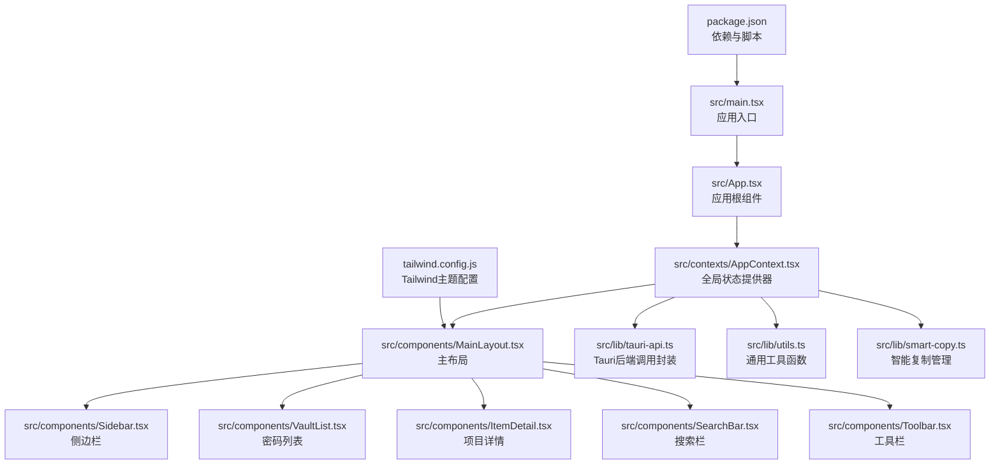
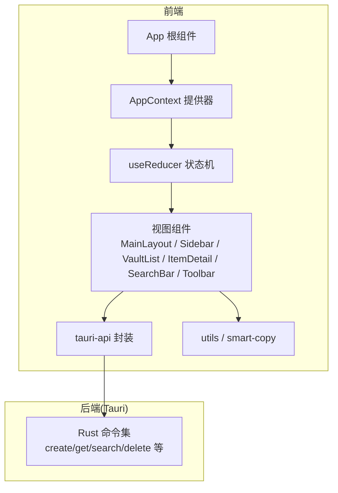
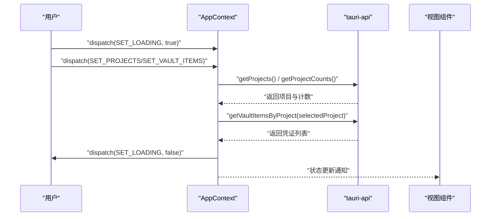
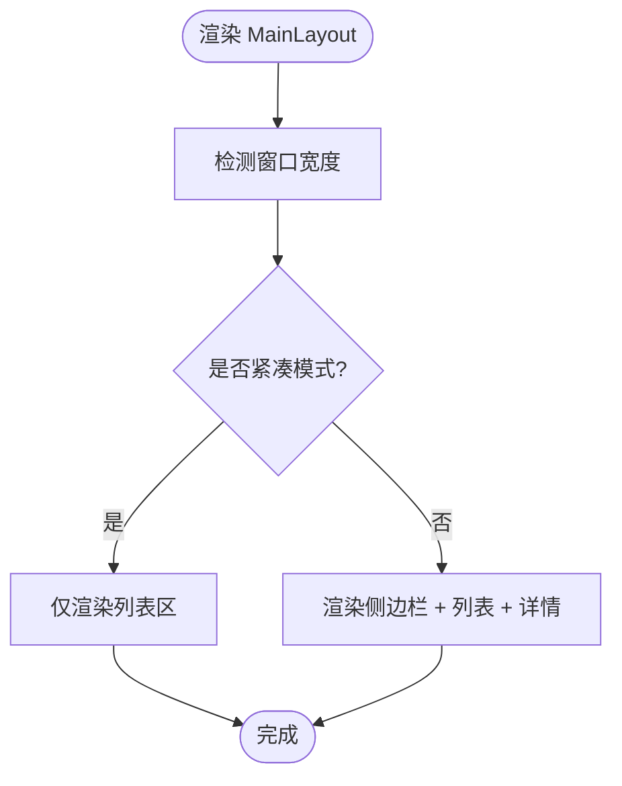
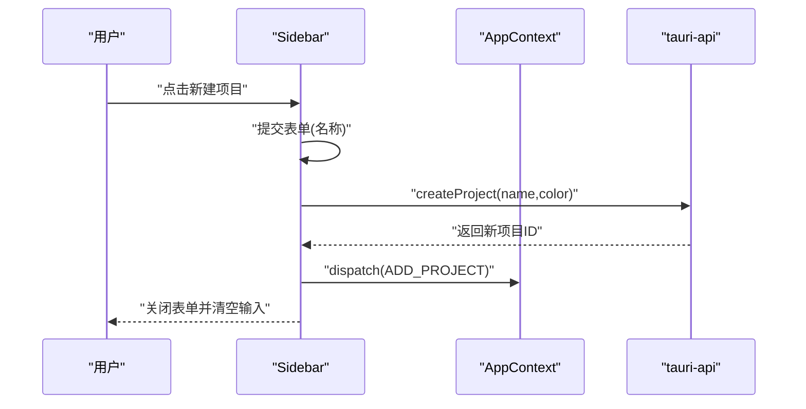
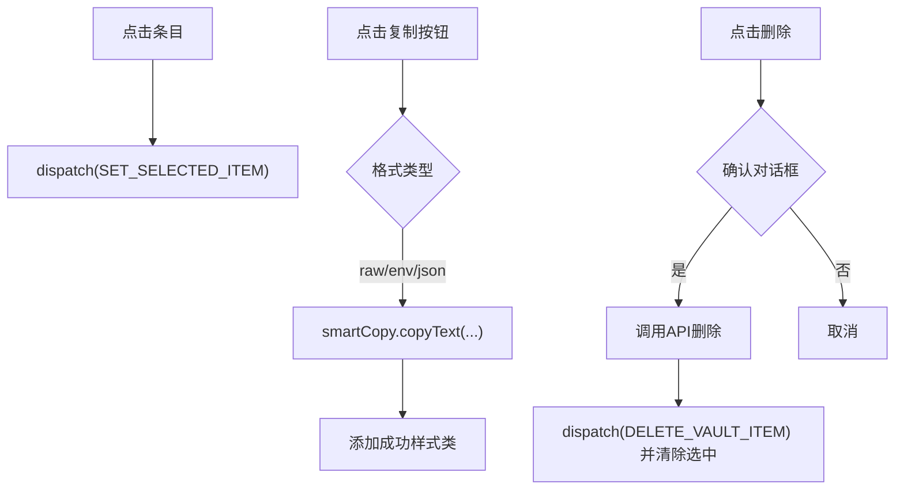
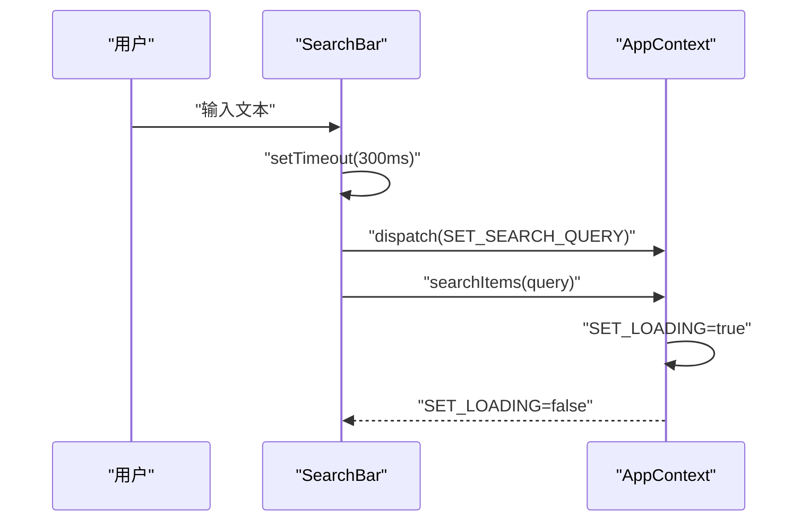
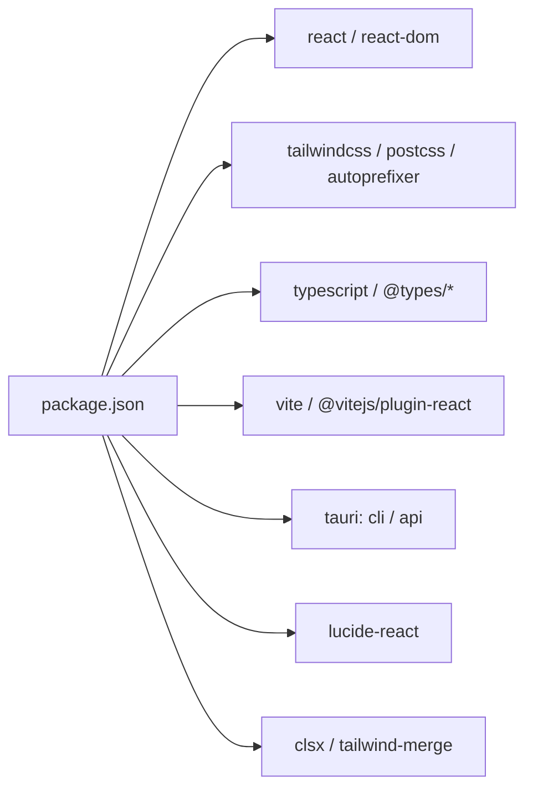

# 前端开发

<cite>
**本文引用的文件**
- [src/App.tsx](file://src/App.tsx)
- [src/main.tsx](file://src/main.tsx)
- [src/contexts/AppContext.tsx](file://src/contexts/AppContext.tsx)
- [src/components/MainLayout.tsx](file://src/components/MainLayout.tsx)
- [src/components/Sidebar.tsx](file://src/components/Sidebar.tsx)
- [src/components/VaultList.tsx](file://src/components/VaultList.tsx)
- [src/components/SearchBar.tsx](file://src/components/SearchBar.tsx)
- [src/components/Toolbar.tsx](file://src/components/Toolbar.tsx)
- [src/components/ItemDetail.tsx](file://src/components/ItemDetail.tsx)
- [src/lib/tauri-api.ts](file://src/lib/tauri-api.ts)
- [src/lib/utils.ts](file://src/lib/utils.ts)
- [src/lib/smart-copy.ts](file://src/lib/smart-copy.ts)
- [src/types/index.ts](file://src/types/index.ts)
- [tailwind.config.js](file://tailwind.config.js)
- [package.json](file://package.json)
</cite>

## 目录
1. [简介](#简介)
2. [项目结构](#项目结构)
3. [核心组件](#核心组件)
4. [架构总览](#架构总览)
5. [详细组件分析](#详细组件分析)
6. [依赖分析](#依赖分析)
7. [性能考虑](#性能考虑)
8. [故障排查指南](#故障排查指南)
9. [结论](#结论)
10. [附录](#附录)

## 简介
本文件面向AIpassword前端开发，系统性梳理React组件体系、状态管理与UI架构。重点覆盖：
- 全局状态管理：AppContext与useReducer驱动的状态机
- 组件间通信：上下文传递、回调与事件处理
- 主要UI组件：主布局、侧边栏导航、密码列表、项目详情、搜索栏、工具栏
- 响应式设计与Tailwind CSS主题系统
- 性能优化策略与最佳实践

## 项目结构
前端采用按功能分层的目录组织方式，核心入口在应用根组件，状态通过上下文提供器贯穿各页面与组件。

图表来源
- [src/main.tsx](file://src/main.tsx#L1-L10)
- [src/App.tsx](file://src/App.tsx#L1-L29)
- [src/contexts/AppContext.tsx](file://src/contexts/AppContext.tsx#L1-L162)
- [src/components/MainLayout.tsx](file://src/components/MainLayout.tsx#L1-L103)
- [src/components/Sidebar.tsx](file://src/components/Sidebar.tsx#L1-L143)
- [src/components/VaultList.tsx](file://src/components/VaultList.tsx#L1-L209)
- [src/components/ItemDetail.tsx](file://src/components/ItemDetail.tsx#L1-L234)
- [src/components/SearchBar.tsx](file://src/components/SearchBar.tsx#L1-L50)
- [src/components/Toolbar.tsx](file://src/components/Toolbar.tsx#L1-L46)
- [src/lib/tauri-api.ts](file://src/lib/tauri-api.ts#L1-L84)
- [src/lib/utils.ts](file://src/lib/utils.ts#L1-L44)
- [src/lib/smart-copy.ts](file://src/lib/smart-copy.ts#L1-L152)
- [tailwind.config.js](file://tailwind.config.js#L1-L46)
- [package.json](file://package.json#L1-L32)

章节来源
- [src/main.tsx](file://src/main.tsx#L1-L10)
- [src/App.tsx](file://src/App.tsx#L1-L29)
- [package.json](file://package.json#L1-L32)

## 核心组件
- 应用入口与根组件：负责渲染全局提供器与根据状态切换视图（加载屏、主密码输入、主布局）
- 全局状态提供器：集中管理应用状态、派发动作、执行数据刷新与搜索
- 主布局：组织头部、侧边栏、列表区、详情区与模态框，支持响应式布局
- 侧边栏：项目树展示与新建项目表单
- 密码列表：条目卡片、复制、编辑、删除与隐身模式显示控制
- 搜索栏：防抖搜索、快捷键聚焦
- 工具栏：新建条目、隐身模式切换、统计信息
- 项目详情：密钥显示/隐藏、复制格式化、元数据展示
- Tauri API封装：统一调用后端命令
- 工具与复制：格式化、历史与反馈

章节来源
- [src/App.tsx](file://src/App.tsx#L1-L29)
- [src/contexts/AppContext.tsx](file://src/contexts/AppContext.tsx#L1-L162)
- [src/components/MainLayout.tsx](file://src/components/MainLayout.tsx#L1-L103)
- [src/components/Sidebar.tsx](file://src/components/Sidebar.tsx#L1-L143)
- [src/components/VaultList.tsx](file://src/components/VaultList.tsx#L1-L209)
- [src/components/SearchBar.tsx](file://src/components/SearchBar.tsx#L1-L50)
- [src/components/Toolbar.tsx](file://src/components/Toolbar.tsx#L1-L46)
- [src/components/ItemDetail.tsx](file://src/components/ItemDetail.tsx#L1-L234)
- [src/lib/tauri-api.ts](file://src/lib/tauri-api.ts#L1-L84)
- [src/lib/utils.ts](file://src/lib/utils.ts#L1-L44)
- [src/lib/smart-copy.ts](file://src/lib/smart-copy.ts#L1-L152)

## 架构总览
整体采用“上下文提供器 + useReducer状态机”的前端架构，配合Tauri后端命令实现数据持久化与系统集成。

图表来源
- [src/App.tsx](file://src/App.tsx#L1-L29)
- [src/contexts/AppContext.tsx](file://src/contexts/AppContext.tsx#L1-L162)
- [src/components/MainLayout.tsx](file://src/components/MainLayout.tsx#L1-L103)
- [src/lib/tauri-api.ts](file://src/lib/tauri-api.ts#L1-L84)

## 详细组件分析

### AppContext 全局状态管理
- 状态模型：包含凭证列表、项目列表、选中项目、搜索词、选中项、加载状态、隐身模式、主密码验证状态
- 动作类型：加载、设置列表、设置选中、切换隐身、设置主密码验证、增删改查等
- 数据流：初始化时检查主密码状态；选择项目变化时自动刷新数据；搜索时延迟查询并回退刷新
- 生命周期：挂载时拉取初始数据与计数；监听项目变更触发二次刷新

图表来源
- [src/contexts/AppContext.tsx](file://src/contexts/AppContext.tsx#L76-L154)
- [src/lib/tauri-api.ts](file://src/lib/tauri-api.ts#L11-L21)

章节来源
- [src/contexts/AppContext.tsx](file://src/contexts/AppContext.tsx#L1-L162)
- [src/types/index.ts](file://src/types/index.ts#L37-L46)

### 主布局 MainLayout
- 负责响应式布局：窗口尺寸小于阈值时切换紧凑模式
- 组织头部（搜索栏、工具栏）、侧边栏、列表区、详情区与模态框
- 通过状态控制是否展示详情面板与空态提示

图表来源
- [src/components/MainLayout.tsx](file://src/components/MainLayout.tsx#L11-L103)

章节来源
- [src/components/MainLayout.tsx](file://src/components/MainLayout.tsx#L1-L103)

### 侧边栏 Sidebar
- 展示“全部条目”与项目列表，支持选择与高亮
- 新建项目表单：本地状态收集、调用API、立即更新本地状态避免闪烁
- 项目计数来源于后端聚合结果

图表来源
- [src/components/Sidebar.tsx](file://src/components/Sidebar.tsx#L11-L45)
- [src/contexts/AppContext.tsx](file://src/contexts/AppContext.tsx#L62-L63)

章节来源
- [src/components/Sidebar.tsx](file://src/components/Sidebar.tsx#L1-L143)

### 密码列表 VaultList
- 渲染条目卡片：标题、URL、备注、分类、颜色条与操作按钮
- 支持复制多种格式（原始、环境变量、JSON），并提供视觉反馈
- 删除确认、清除选中项、空态提示与“新建条目”引导

图表来源
- [src/components/VaultList.tsx](file://src/components/VaultList.tsx#L9-L44)
- [src/lib/smart-copy.ts](file://src/lib/smart-copy.ts#L20-L56)

章节来源
- [src/components/VaultList.tsx](file://src/components/VaultList.tsx#L1-L209)
- [src/lib/smart-copy.ts](file://src/lib/smart-copy.ts#L1-L152)

### 搜索栏 SearchBar
- 本地输入状态与全局搜索状态同步，使用防抖减少请求频率
- 支持快捷键聚焦（Cmd/Ctrl+K）

图表来源
- [src/components/SearchBar.tsx](file://src/components/SearchBar.tsx#L9-L18)
- [src/contexts/AppContext.tsx](file://src/contexts/AppContext.tsx#L107-L121)

章节来源
- [src/components/SearchBar.tsx](file://src/components/SearchBar.tsx#L1-L50)
- [src/contexts/AppContext.tsx](file://src/contexts/AppContext.tsx#L107-L121)

### 工具栏 Toolbar
- 新建条目按钮：向上层回调打开模态
- 隐身模式切换：切换全局状态
- 统计信息：显示凭证数量

章节来源
- [src/components/Toolbar.tsx](file://src/components/Toolbar.tsx#L1-L46)

### 项目详情 ItemDetail
- 显示选中条目的完整信息：标题、分类、项目色块、密钥区域、URL、备注、元数据
- 支持密钥显示/隐藏与多种复制格式
- 编辑/删除按钮联动上层逻辑

章节来源
- [src/components/ItemDetail.tsx](file://src/components/ItemDetail.tsx#L1-L234)

### 数据模型与类型
- 凭证项、项目、创建/更新请求、复制格式、应用状态接口定义清晰

章节来源
- [src/types/index.ts](file://src/types/index.ts#L1-L46)

## 依赖分析
- React与生态：React、React DOM、Lucide图标库
- 样式系统：Tailwind CSS、Tailwind Merge、clsx
- 构建与运行：Vite、TypeScript、PostCSS、Autoprefixer
- 桌面集成：@tauri-apps/api、@tauri-apps/cli

图表来源
- [package.json](file://package.json#L1-L32)

章节来源
- [package.json](file://package.json#L1-L32)

## 性能考虑
- 防抖搜索：降低频繁网络请求与重渲染
- 本地状态优先：新建项目等操作先更新本地状态，避免闪烁
- 条件渲染：紧凑模式下减少DOM节点，提升小屏体验
- 图标与样式：使用轻量图标库与原子化样式，减少打包体积
- 复制反馈：通过类名动画与定时器清理，避免内存泄漏

## 故障排查指南
- 加载状态异常：检查全局加载开关与异步流程是否正确收尾
- 搜索无结果：确认防抖间隔与查询词同步逻辑
- 删除后未更新：确保删除API调用成功且派发了删除动作
- 项目计数不更新：确认后端聚合结果映射与状态合并逻辑
- 复制失败：检查浏览器剪贴板权限与降级方案

章节来源
- [src/contexts/AppContext.tsx](file://src/contexts/AppContext.tsx#L107-L121)
- [src/components/VaultList.tsx](file://src/components/VaultList.tsx#L30-L44)
- [src/lib/smart-copy.ts](file://src/lib/smart-copy.ts#L58-L71)

## 结论
本项目以清晰的上下文与状态机为核心，结合响应式布局与Tailwind主题系统，构建出可扩展、易维护的前端架构。通过防抖搜索、本地状态优先与条件渲染等策略，兼顾用户体验与性能表现。

## 附录
- 主题与样式：Tailwind自定义颜色、字体与动画，满足深色主题需求
- 复制能力：多格式输出与历史记录，增强可用性
- 类型安全：严格的TS类型定义，保障状态与API调用一致性

章节来源
- [tailwind.config.js](file://tailwind.config.js#L1-L46)
- [src/lib/smart-copy.ts](file://src/lib/smart-copy.ts#L1-L152)
- [src/types/index.ts](file://src/types/index.ts#L1-L46)