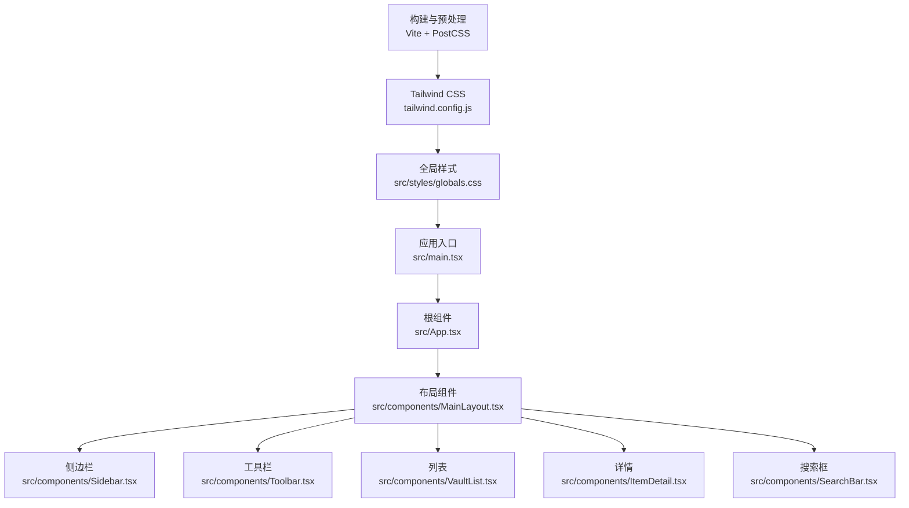
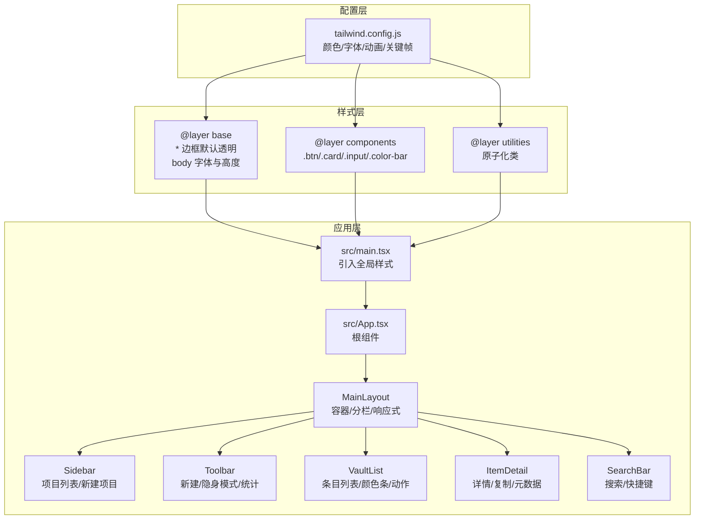
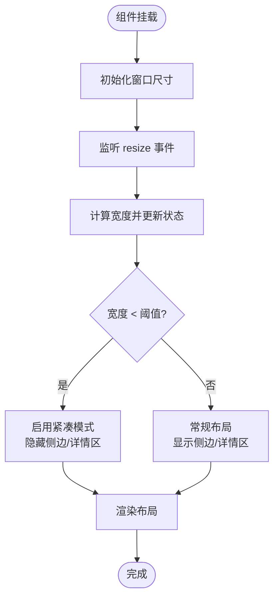
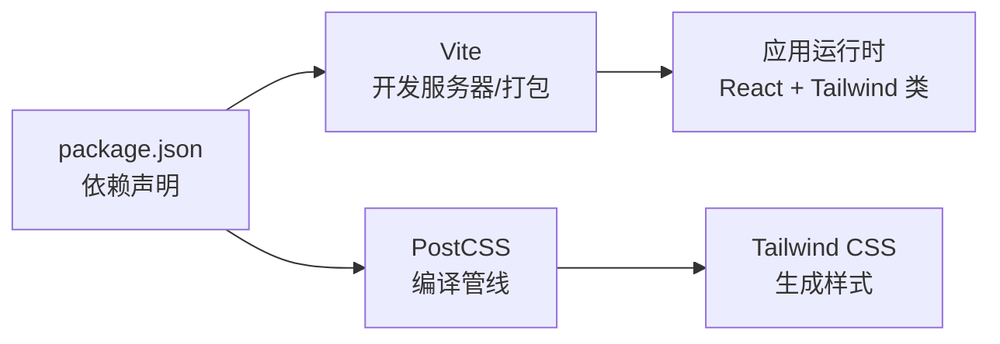

# 样式系统

<cite>
**本文引用的文件**
- [tailwind.config.js](file://tailwind.config.js)
- [postcss.config.js](file://postcss.config.js)
- [package.json](file://package.json)
- [vite.config.ts](file://vite.config.ts)
- [src/styles/globals.css](file://src/styles/globals.css)
- [src/main.tsx](file://src/main.tsx)
- [src/App.tsx](file://src/App.tsx)
- [src/components/MainLayout.tsx](file://src/components/MainLayout.tsx)
- [src/components/Sidebar.tsx](file://src/components/Sidebar.tsx)
- [src/components/Toolbar.tsx](file://src/components/Toolbar.tsx)
- [src/components/VaultList.tsx](file://src/components/VaultList.tsx)
- [src/components/ItemDetail.tsx](file://src/components/ItemDetail.tsx)
- [src/components/SearchBar.tsx](file://src/components/SearchBar.tsx)
- [src/contexts/AppContext.tsx](file://src/contexts/AppContext.tsx)
</cite>

## 目录
1. [简介](#简介)
2. [项目结构](#项目结构)
3. [核心组件](#核心组件)
4. [架构总览](#架构总览)
5. [详细组件分析](#详细组件分析)
6. [依赖关系分析](#依赖关系分析)
7. [性能考量](#性能考量)
8. [故障排查指南](#故障排查指南)
9. [结论](#结论)
10. [附录](#附录)

## 简介
本文件系统性梳理 AIpassword 的样式系统，围绕 Tailwind CSS 配置与使用、全局样式设计、主题定制、响应式与暗色模式、颜色体系、性能优化与调试实践展开。文档以“渐进式复杂度”方式呈现，既适合初学者理解整体结构，也为高级用户提供可操作的优化建议与最佳实践。

## 项目结构
样式系统由以下关键要素构成：
- 构建与预处理：Vite + PostCSS + Tailwind CSS
- 主题与工具类：Tailwind 自定义颜色、字体、动画与关键帧
- 全局样式：基础层、组件层、工具层的统一入口
- 组件级样式：通过原子化工具类与自定义组件类组合实现一致风格
- 上下文驱动的状态：用于控制隐身模式、选中态等视觉反馈

图表来源
- [vite.config.ts](file://vite.config.ts#L1-L21)
- [postcss.config.js](file://postcss.config.js#L1-L6)
- [tailwind.config.js](file://tailwind.config.js#L1-L46)
- [src/styles/globals.css](file://src/styles/globals.css#L1-L41)
- [src/main.tsx](file://src/main.tsx#L1-L10)
- [src/App.tsx](file://src/App.tsx#L1-L29)
- [src/components/MainLayout.tsx](file://src/components/MainLayout.tsx#L1-L103)
- [src/components/Sidebar.tsx](file://src/components/Sidebar.tsx#L1-L143)
- [src/components/Toolbar.tsx](file://src/components/Toolbar.tsx#L1-L46)
- [src/components/VaultList.tsx](file://src/components/VaultList.tsx#L1-L209)
- [src/components/ItemDetail.tsx](file://src/components/ItemDetail.tsx#L1-L234)
- [src/components/SearchBar.tsx](file://src/components/SearchBar.tsx#L1-L50)

章节来源
- [vite.config.ts](file://vite.config.ts#L1-L21)
- [postcss.config.js](file://postcss.config.js#L1-L6)
- [tailwind.config.js](file://tailwind.config.js#L1-L46)
- [src/styles/globals.css](file://src/styles/globals.css#L1-L41)
- [src/main.tsx](file://src/main.tsx#L1-L10)
- [src/App.tsx](file://src/App.tsx#L1-L29)

## 核心组件
- Tailwind 主题扩展：自定义颜色、字体族、动画与关键帧，覆盖背景、表面、文本、强调色、成功/警告/错误等语义色。
- 全局样式层：基础层统一边框、字体与页面高度；组件层定义按钮、卡片、输入框、颜色条等复用组件类；工具层引入原子化类。
- 应用入口：在入口处引入全局样式，确保主题与组件类在应用启动时生效。
- 布局与交互：主布局负责容器与分栏、响应式切换；工具栏与搜索框体现状态变化（如隐身模式）；列表与详情展示选中态与颜色标识。

章节来源
- [tailwind.config.js](file://tailwind.config.js#L7-L44)
- [src/styles/globals.css](file://src/styles/globals.css#L5-L41)
- [src/main.tsx](file://src/main.tsx#L4-L4)
- [src/components/MainLayout.tsx](file://src/components/MainLayout.tsx#L28-L90)
- [src/components/Toolbar.tsx](file://src/components/Toolbar.tsx#L24-L35)
- [src/components/SearchBar.tsx](file://src/components/SearchBar.tsx#L33-L48)

## 架构总览
样式系统采用“配置驱动 + 全局样式 + 组件原子化”的架构：
- 配置驱动：Tailwind 自定义颜色与动画，保证跨组件一致性。
- 全局样式：通过 @layer 组织基础、组件与工具层，避免重复定义。
- 组件原子化：在组件内直接使用工具类与自定义组件类，减少样式分散。
- 上下文联动：通过 AppContext 管理状态（如隐身模式、选中项），驱动 UI 视觉反馈。

图表来源
- [tailwind.config.js](file://tailwind.config.js#L7-L44)
- [src/styles/globals.css](file://src/styles/globals.css#L1-L41)
- [src/main.tsx](file://src/main.tsx#L4-L4)
- [src/App.tsx](file://src/App.tsx#L1-L29)
- [src/components/MainLayout.tsx](file://src/components/MainLayout.tsx#L1-L103)
- [src/components/Sidebar.tsx](file://src/components/Sidebar.tsx#L1-L143)
- [src/components/Toolbar.tsx](file://src/components/Toolbar.tsx#L1-L46)
- [src/components/VaultList.tsx](file://src/components/VaultList.tsx#L1-L209)
- [src/components/ItemDetail.tsx](file://src/components/ItemDetail.tsx#L1-L234)
- [src/components/SearchBar.tsx](file://src/components/SearchBar.tsx#L1-L50)

## 详细组件分析

### Tailwind 配置与主题扩展
- 内容扫描路径：确保仅扫描 HTML 与源码目录，避免无用样式进入产物。
- 主题扩展：
  - 颜色：背景、表面、文本、强调色、语义色（成功/警告/错误）。
  - 字体：等宽字体族（JetBrains Mono、Cascadia Code、monospace）。
  - 动画与关键帧：淡入、滑入、脉冲边框，配合过渡类使用。
- 插件：当前未启用额外插件，保持最小依赖。

章节来源
- [tailwind.config.js](file://tailwind.config.js#L3-L6)
- [tailwind.config.js](file://tailwind.config.js#L7-L44)

### 全局样式与 @layer 组织
- 基础层：统一边框透明、应用背景与文本色、等宽字体、根元素高度与溢出控制。
- 组件层：定义 .btn、.btn-secondary、.card、.input、.color-bar 等复用组件类，集中管理外观与过渡。
- 工具层：引入 Tailwind 的 base/components/utilities，确保按层顺序正确加载。

章节来源
- [src/styles/globals.css](file://src/styles/globals.css#L5-L19)
- [src/styles/globals.css](file://src/styles/globals.css#L21-L41)

### 应用入口与上下文联动
- 入口引入全局样式，保证主题与组件类在应用启动时生效。
- AppContext 提供状态（如隐身模式、选中项、搜索查询），组件根据状态动态应用类名，实现视觉反馈（如选中高亮、颜色条、语义色）。

章节来源
- [src/main.tsx](file://src/main.tsx#L4-L4)
- [src/App.tsx](file://src/App.tsx#L1-L29)
- [src/contexts/AppContext.tsx](file://src/contexts/AppContext.tsx#L19-L67)

### 主布局与响应式设计
- 容器与分栏：使用 flex 布局与边框类实现清晰的区域划分。
- 响应式：监听窗口尺寸，当宽度小于阈值时切换紧凑模式，隐藏非必要内容，提升移动端可用性。
- 选中态：被选中的卡片添加强调环，增强可识别性。

图表来源
- [src/components/MainLayout.tsx](file://src/components/MainLayout.tsx#L13-L26)
- [src/components/MainLayout.tsx](file://src/components/MainLayout.tsx#L28-L90)

章节来源
- [src/components/MainLayout.tsx](file://src/components/MainLayout.tsx#L11-L103)

### 工具栏与隐身模式
- 新建按钮与次要按钮：使用 .btn 与 .btn-secondary 统一样式与过渡。
- 隐身模式：根据状态切换按钮背景色与图标，提示用户当前模式。

章节来源
- [src/components/Toolbar.tsx](file://src/components/Toolbar.tsx#L13-L44)
- [src/contexts/AppContext.tsx](file://src/contexts/AppContext.tsx#L44-L45)

### 搜索栏与键盘快捷键
- 输入框：基于 .input 类统一外观与焦点态。
- 快捷键：监听 ⌘K/Ctrl+K 聚焦搜索框，提升效率。

章节来源
- [src/components/SearchBar.tsx](file://src/components/SearchBar.tsx#L33-L48)
- [src/components/SearchBar.tsx](file://src/components/SearchBar.tsx#L21-L30)

### 列表与详情页
- 列表项：使用 .card 与 .color-bar 实现卡片化展示与颜色标识；动作按钮使用语义色与过渡。
- 详情页：强调区域使用背景与边框类，复制按钮组与元数据区域清晰分层。

章节来源
- [src/components/VaultList.tsx](file://src/components/VaultList.tsx#L76-L190)
- [src/components/ItemDetail.tsx](file://src/components/ItemDetail.tsx#L60-L231)

### 侧边栏与新建项目
- 项目列表：根据选中状态切换背景色与强调色，提供即时反馈。
- 新建项目弹窗：使用 .card 与 .input/.btn 组合，保持与整体风格一致。

章节来源
- [src/components/Sidebar.tsx](file://src/components/Sidebar.tsx#L78-L98)
- [src/components/Sidebar.tsx](file://src/components/Sidebar.tsx#L108-L140)

## 依赖关系分析
- 构建链路：Vite 作为开发服务器与打包器，PostCSS 负责编译，Tailwind 生成原子化样式。
- 运行时依赖：React、Tailwind CSS、Autoprefixer、clsx、tailwind-merge 等。
- 开发依赖：TypeScript、Vite、Tailwind CSS、PostCSS、Autoprefixer 等。

图表来源
- [package.json](file://package.json#L13-L31)
- [postcss.config.js](file://postcss.config.js#L1-L6)
- [vite.config.ts](file://vite.config.ts#L1-L21)

章节来源
- [package.json](file://package.json#L13-L31)
- [postcss.config.js](file://postcss.config.js#L1-L6)
- [vite.config.ts](file://vite.config.ts#L1-L21)

## 性能考量
- 原子化优势：Tailwind 的原子化类减少重复样式，提升可维护性与体积可控性。
- 关键帧与过渡：合理使用内置动画与过渡类，避免过度复杂的 JS 动画导致掉帧。
- 组件类复用：通过 .btn、.card、.input 等组件类统一外观，降低重复定义带来的体积膨胀。
- 渐进增强：在组件内按需组合类，避免全局重写样式。
- 打包优化：确保内容扫描路径准确，避免将未使用的类打包进产物。

## 故障排查指南
- 样式不生效
  - 检查是否在入口引入全局样式。
  - 确认 Tailwind 配置的内容扫描路径是否包含目标文件。
  - 验证 PostCSS 插件顺序与版本兼容性。
- 动画/过渡异常
  - 检查自定义动画与关键帧是否正确定义与调用。
  - 确认过渡类与 hover/focus 状态的组合是否符合预期。
- 响应式布局错乱
  - 检查窗口尺寸监听逻辑与阈值设置。
  - 确认 flex 布局与边框类的组合是否正确。
- 颜色/主题不一致
  - 核对自定义颜色名称与语义色映射。
  - 确保在组件层与工具层正确使用主题色。

章节来源
- [src/main.tsx](file://src/main.tsx#L4-L4)
- [tailwind.config.js](file://tailwind.config.js#L3-L6)
- [postcss.config.js](file://postcss.config.js#L1-L6)
- [src/components/MainLayout.tsx](file://src/components/MainLayout.tsx#L13-L26)

## 结论
AIpassword 的样式系统以 Tailwind CSS 为核心，结合自定义主题与全局样式层，实现了高一致性、可维护与可扩展的视觉体系。通过组件原子化与上下文联动，系统在功能与体验上达到平衡。后续可在颜色体系细化、暗色模式扩展与样式体积优化方面持续演进。

## 附录

### 命名约定与模块化策略
- 组件类命名：.btn、.btn-secondary、.card、.input、.color-bar，统一语义与复用。
- 状态类：根据上下文状态动态拼接类名（如选中态、隐身模式）。
- 层次化组织：@layer base/components/utilities 明确职责边界。

章节来源
- [src/styles/globals.css](file://src/styles/globals.css#L21-L41)
- [src/components/MainLayout.tsx](file://src/components/MainLayout.tsx#L80-L84)
- [src/components/Toolbar.tsx](file://src/components/Toolbar.tsx#L27-L31)

### 响应式设计与暗色模式
- 响应式：通过监听窗口尺寸与条件渲染，实现紧凑/常规两种布局。
- 暗色模式：当前主题以深色为主，可通过扩展 Tailwind 配置增加暗色模式开关与自动检测。

章节来源
- [src/components/MainLayout.tsx](file://src/components/MainLayout.tsx#L26-L26)
- [tailwind.config.js](file://tailwind.config.js#L9-L20)

### 颜色系统与语义化
- 颜色体系：背景、表面、文本、强调色、语义色（成功/警告/错误）。
- 使用建议：优先使用语义色表达状态与操作结果，避免硬编码颜色。

章节来源
- [tailwind.config.js](file://tailwind.config.js#L9-L20)
- [src/components/VaultList.tsx](file://src/components/VaultList.tsx#L172-L186)

### 样式性能优化与调试技巧
- 优化建议：减少深层嵌套、合并过渡类、避免在运行时频繁切换复杂样式。
- 调试技巧：利用浏览器开发者工具查看元素类名与最终样式；确认 PostCSS 编译输出；检查 Tailwind 生成的类是否按预期注入。

章节来源
- [postcss.config.js](file://postcss.config.js#L1-L6)
- [tailwind.config.js](file://tailwind.config.js#L24-L42)