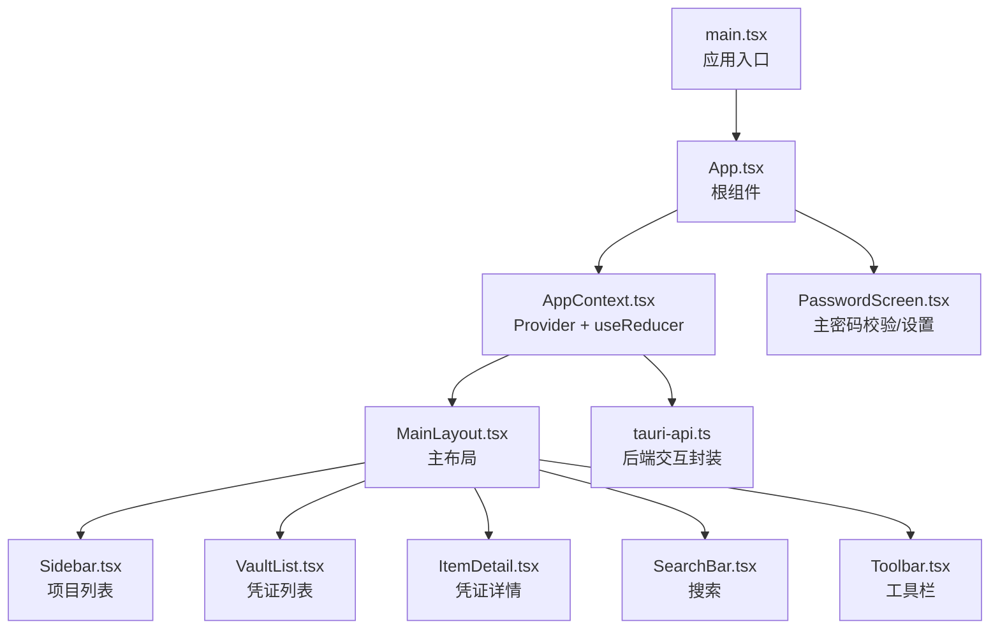
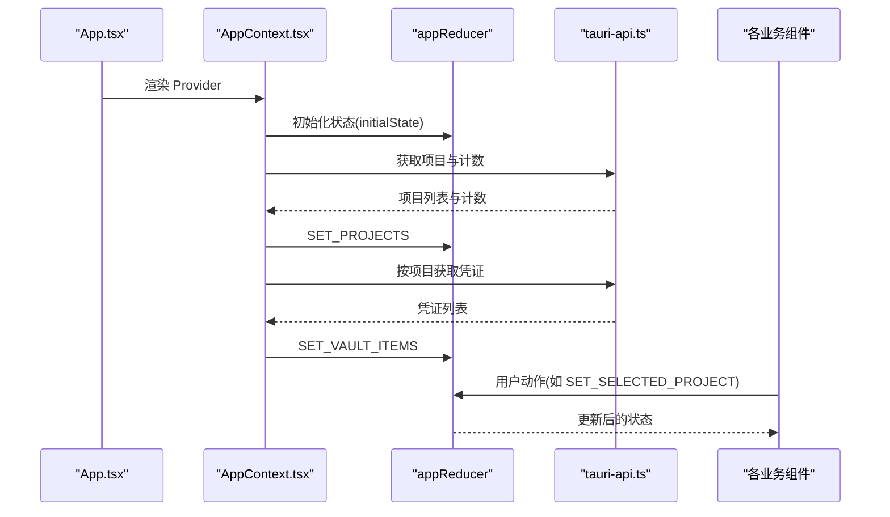
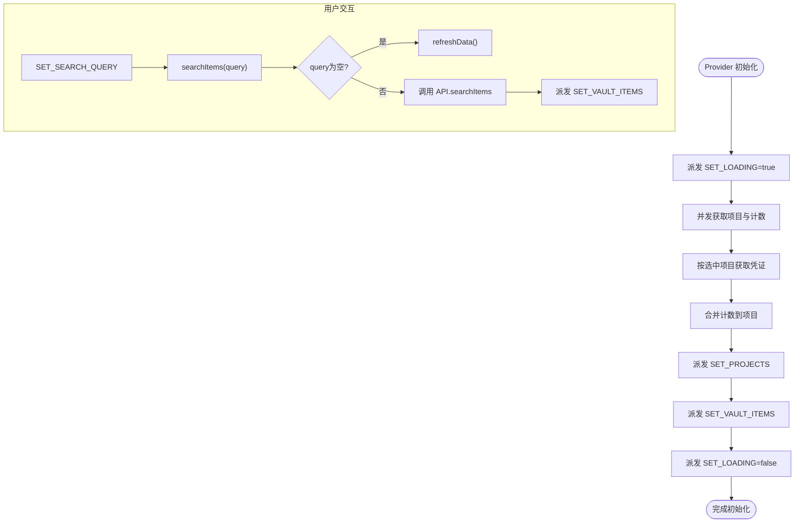
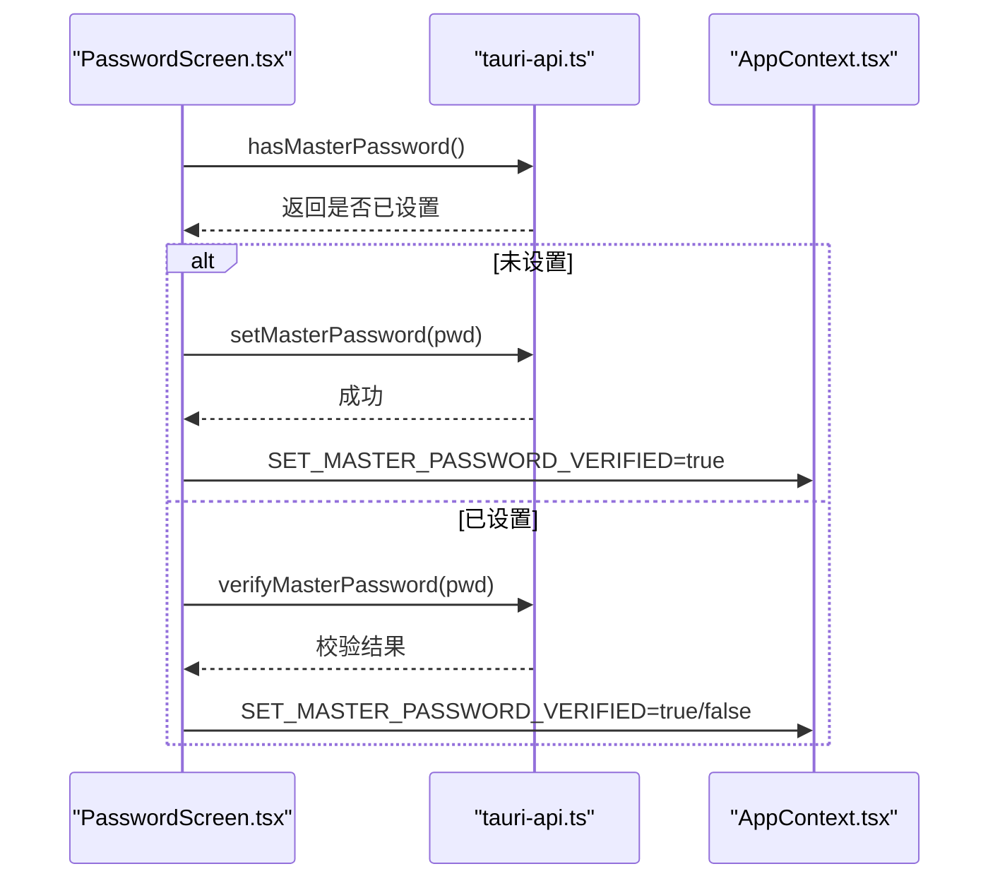
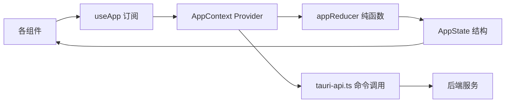
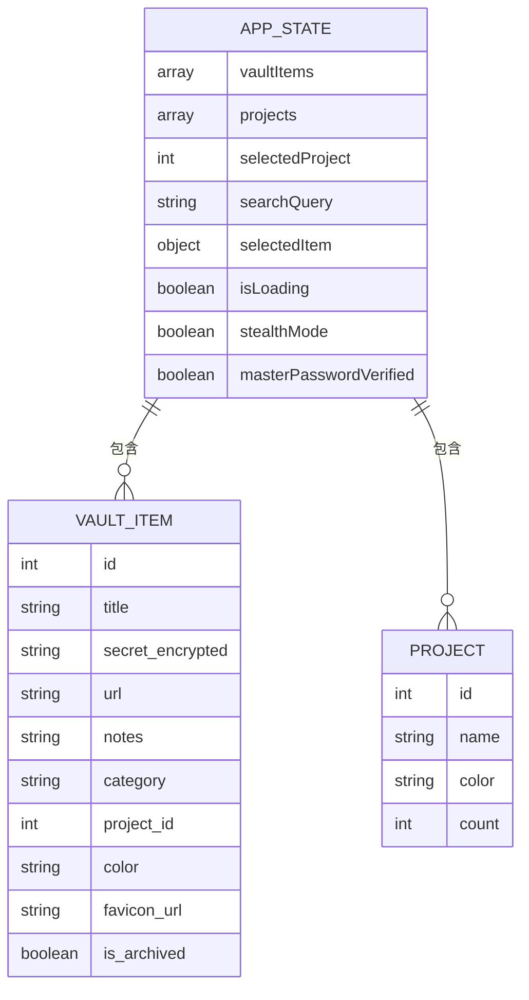
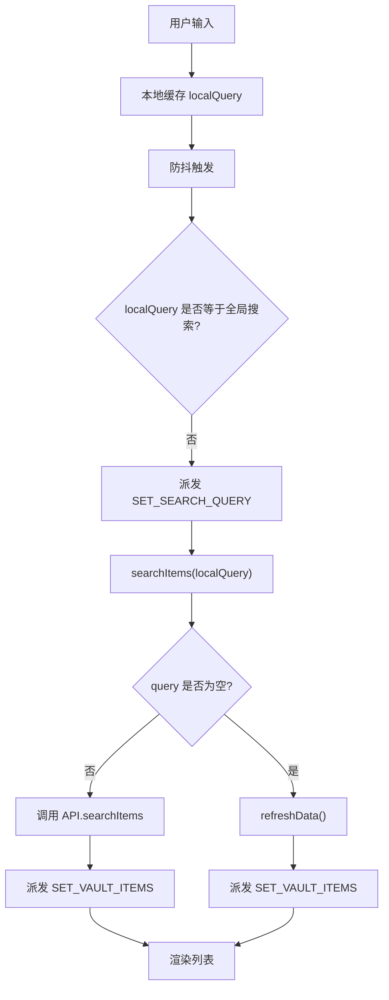

# 状态管理

<cite>
**本文引用的文件**
- [src/contexts/AppContext.tsx](file://src/contexts/AppContext.tsx)
- [src/App.tsx](file://src/App.tsx)
- [src/main.tsx](file://src/main.tsx)
- [src/types/index.ts](file://src/types/index.ts)
- [src/lib/tauri-api.ts](file://src/lib/tauri-api.ts)
- [src/components/MainLayout.tsx](file://src/components/MainLayout.tsx)
- [src/components/PasswordScreen.tsx](file://src/components/PasswordScreen.tsx)
- [src/components/SearchBar.tsx](file://src/components/SearchBar.tsx)
- [src/components/Toolbar.tsx](file://src/components/Toolbar.tsx)
- [src/components/VaultList.tsx](file://src/components/VaultList.tsx)
- [src/components/Sidebar.tsx](file://src/components/Sidebar.tsx)
- [src/components/ItemDetail.tsx](file://src/components/ItemDetail.tsx)
- [package.json](file://package.json)
</cite>

## 目录
1. [引言](#引言)
2. [项目结构](#项目结构)
3. [核心组件](#核心组件)
4. [架构总览](#架构总览)
5. [详细组件分析](#详细组件分析)
6. [依赖分析](#依赖分析)
7. [性能考虑](#性能考虑)
8. [故障排查指南](#故障排查指南)
9. [结论](#结论)
10. [附录](#附录)

## 引言
本文件系统性梳理 AIpassword 的全局状态管理设计与实现，围绕 AppContext 提供的 useReducer + Context 模式展开，覆盖状态数据结构、状态流转与更新策略、最佳实践（状态拆分、性能优化、内存管理）、持久化与异步更新、错误边界与调试方法等主题。读者无需深入源码即可理解整体架构与使用方式。

## 项目结构
- 应用入口通过 Provider 包裹根组件，子树内通过自定义 Hook 访问状态与派发动作。
- 类型定义集中于类型模块，确保状态结构与 API 请求/响应一致。
- 组件层按职责拆分：布局、列表、详情、工具栏、搜索、侧边栏、密码屏等，均以 useApp 订阅状态并派发动作。

图表来源
- [src/main.tsx](file://src/main.tsx#L1-L10)
- [src/App.tsx](file://src/App.tsx#L1-L29)
- [src/contexts/AppContext.tsx](file://src/contexts/AppContext.tsx#L1-L162)
- [src/components/MainLayout.tsx](file://src/components/MainLayout.tsx#L1-L103)
- [src/components/Sidebar.tsx](file://src/components/Sidebar.tsx#L1-L143)
- [src/components/VaultList.tsx](file://src/components/VaultList.tsx#L1-L209)
- [src/components/ItemDetail.tsx](file://src/components/ItemDetail.tsx#L1-L234)
- [src/components/SearchBar.tsx](file://src/components/SearchBar.tsx#L1-L50)
- [src/components/Toolbar.tsx](file://src/components/Toolbar.tsx#L1-L46)
- [src/components/PasswordScreen.tsx](file://src/components/PasswordScreen.tsx#L1-L146)
- [src/lib/tauri-api.ts](file://src/lib/tauri-api.ts#L1-L97)

章节来源
- [src/main.tsx](file://src/main.tsx#L1-L10)
- [src/App.tsx](file://src/App.tsx#L1-L29)

## 核心组件
- AppContext 提供全局状态与动作派发，内部以 useReducer 实现状态机，配合 Context 将状态与方法注入到子树。
- AppState 定义了凭证列表、项目列表、选中项、选中项目、搜索关键字、加载态、隐身模式、主密码校验结果等字段。
- 自定义 Hook useApp 负责读取上下文并提供 state、dispatch、refreshData、searchItems 等能力。
- Tauri API 封装了后端命令调用，作为状态更新的副作用来源。

章节来源
- [src/contexts/AppContext.tsx](file://src/contexts/AppContext.tsx#L1-L162)
- [src/types/index.ts](file://src/types/index.ts#L1-L46)
- [src/lib/tauri-api.ts](file://src/lib/tauri-api.ts#L1-L97)

## 架构总览
AppContext 采用“状态机 + 上下文”的组合模式：
- 使用 useReducer 维护纯函数式的状态更新逻辑，保证可预测性与可测试性。
- 使用 Context 将状态与动作暴露给任意层级的组件，避免跨层级传参。
- 通过副作用（Effect）在挂载时拉取初始数据，并在选中项目变化时刷新凭证列表。
- 通过 API 层封装 Tauri 命令，统一异步数据来源。

图表来源
- [src/App.tsx](file://src/App.tsx#L1-L29)
- [src/contexts/AppContext.tsx](file://src/contexts/AppContext.tsx#L76-L154)
- [src/lib/tauri-api.ts](file://src/lib/tauri-api.ts#L56-L67)

## 详细组件分析

### AppContext 全局状态与动作
- 状态结构：包含凭证数组、项目数组、选中项目、搜索查询、选中项、加载标志、隐身模式、主密码校验结果。
- 动作类型：涵盖加载控制、列表设置、新增/更新/删除、项目切换、搜索同步、隐身模式切换、主密码校验结果更新等。
- 状态机：appReducer 对应每个动作返回新的状态快照，保持不可变性。
- Provider 能力：
  - refreshData：并发拉取项目与计数、按项目获取凭证，合并计数后写入状态。
  - searchItems：防抖触发搜索，空查询回退到刷新数据。
  - 生命周期：挂载时拉取数据并检查主密码；选中项目变化时自动刷新凭证列表。

图表来源
- [src/contexts/AppContext.tsx](file://src/contexts/AppContext.tsx#L79-L121)
- [src/contexts/AppContext.tsx](file://src/contexts/AppContext.tsx#L123-L147)

章节来源
- [src/contexts/AppContext.tsx](file://src/contexts/AppContext.tsx#L5-L67)
- [src/contexts/AppContext.tsx](file://src/contexts/AppContext.tsx#L76-L154)
- [src/types/index.ts](file://src/types/index.ts#L37-L46)

### 密码屏 PasswordScreen
- 作用：首次使用设置主密码，或后续校验主密码。
- 行为：根据后端检查结果决定新设或校验流程；成功后通过动作标记主密码已验证，从而切换到主界面。

图表来源
- [src/components/PasswordScreen.tsx](file://src/components/PasswordScreen.tsx#L14-L61)
- [src/lib/tauri-api.ts](file://src/lib/tauri-api.ts#L78-L89)
- [src/contexts/AppContext.tsx](file://src/contexts/AppContext.tsx#L127-L139)

章节来源
- [src/components/PasswordScreen.tsx](file://src/components/PasswordScreen.tsx#L1-L146)
- [src/lib/tauri-api.ts](file://src/lib/tauri-api.ts#L78-L89)

### 主布局 MainLayout
- 作用：组织侧边栏、凭证列表、详情区、搜索与工具栏，根据窗口尺寸切换紧凑模式。
- 订阅：读取 AppState 中的选中项、选中项目、项目列表等，驱动布局与内容展示。

章节来源
- [src/components/MainLayout.tsx](file://src/components/MainLayout.tsx#L1-L103)

### 搜索 SearchBar
- 作用：本地输入缓存 + 防抖触发搜索；支持快捷键聚焦。
- 行为：本地状态与全局状态同步，触发 searchItems 并由 Provider 决策是走搜索还是回退刷新。

章节来源
- [src/components/SearchBar.tsx](file://src/components/SearchBar.tsx#L1-L50)
- [src/contexts/AppContext.tsx](file://src/contexts/AppContext.tsx#L107-L121)

### 工具栏 Toolbar
- 作用：提供新建条目、切换隐身模式等快捷操作。
- 行为：切换隐身模式通过动作 TOGGLE_STEALTH_MODE 更新状态。

章节来源
- [src/components/Toolbar.tsx](file://src/components/Toolbar.tsx#L1-L46)
- [src/contexts/AppContext.tsx](file://src/contexts/AppContext.tsx#L44-L45)

### 凭证列表 VaultList
- 作用：展示当前项目下的凭证列表，支持复制、编辑、删除等操作。
- 行为：点击条目设置选中项；删除成功后清理选中项；复制成功提供视觉反馈。

章节来源
- [src/components/VaultList.tsx](file://src/components/VaultList.tsx#L1-L209)
- [src/contexts/AppContext.tsx](file://src/contexts/AppContext.tsx#L48-L63)

### 侧边栏 Sidebar
- 作用：展示项目列表与计数，支持新建项目与切换选中项目。
- 行为：新建项目后立即更新本地状态，避免闪烁；切换项目通过动作 SET_SELECTED_PROJECT 触发刷新。

章节来源
- [src/components/Sidebar.tsx](file://src/components/Sidebar.tsx#L1-L143)
- [src/contexts/AppContext.tsx](file://src/contexts/AppContext.tsx#L38-L40)

### 凭证详情 ItemDetail
- 作用：展示选中凭证的详细信息，支持复制、编辑、删除等。
- 行为：删除成功后清理选中项；根据隐身模式对敏感内容进行遮蔽。

章节来源
- [src/components/ItemDetail.tsx](file://src/components/ItemDetail.tsx#L1-L234)

## 依赖分析
- 组件对 AppContext 的依赖：所有 UI 组件通过 useApp 订阅状态与派发动作者参与状态更新。
- AppContext 对 API 的依赖：Provider 内部通过 tauri-api.ts 调用后端命令，作为状态来源。
- 类型一致性：AppState 与 API 返回结构在 types/index.ts 中统一约束，减少类型漂移风险。

图表来源
- [src/contexts/AppContext.tsx](file://src/contexts/AppContext.tsx#L76-L154)
- [src/lib/tauri-api.ts](file://src/lib/tauri-api.ts#L1-L97)
- [src/types/index.ts](file://src/types/index.ts#L37-L46)

章节来源
- [src/contexts/AppContext.tsx](file://src/contexts/AppContext.tsx#L1-L162)
- [src/lib/tauri-api.ts](file://src/lib/tauri-api.ts#L1-L97)
- [src/types/index.ts](file://src/types/index.ts#L1-L46)

## 性能考虑
- 状态不可变更新：appReducer 通过浅拷贝与映射/过滤生成新对象，降低意外共享带来的重渲染风险。
- 选择性订阅：组件仅读取自身关心的状态片段，避免不必要的重渲染。
- 并发请求：Provider 在初始化阶段并发获取项目与计数，缩短首屏等待时间。
- 防抖搜索：SearchBar 对输入进行防抖，减少频繁网络请求与状态更新。
- 本地乐观更新：新建项目后立即更新本地状态，改善交互体验，随后由后端一致性保障兜底。
- 计算字段：项目计数在前端合并，避免重复请求；注意在数据量大时评估内存占用。
- 事件监听：Tauri 事件监听在组件卸载时需确保清理，避免内存泄漏（当前代码未见显式清理，建议补充）。

[本节为通用指导，不直接分析具体文件]

## 故障排查指南
- 主密码校验失败
  - 现象：密码屏提示错误或无法解锁。
  - 排查：确认后端命令可用、网络无异常；检查动作是否正确派发“主密码已验证”。
  - 参考路径：[src/components/PasswordScreen.tsx](file://src/components/PasswordScreen.tsx#L30-L61)、[src/lib/tauri-api.ts](file://src/lib/tauri-api.ts#L78-L89)
- 数据未刷新
  - 现象：切换项目后凭证列表未更新。
  - 排查：确认 Effect 是否执行；检查动作派发顺序与参数；验证 API 返回。
  - 参考路径：[src/contexts/AppContext.tsx](file://src/contexts/AppContext.tsx#L142-L147)
- 搜索无结果
  - 现象：输入关键词无响应。
  - 排查：确认防抖定时器是否触发；检查空查询回退逻辑。
  - 参考路径：[src/components/SearchBar.tsx](file://src/components/SearchBar.tsx#L9-L18)、[src/contexts/AppContext.tsx](file://src/contexts/AppContext.tsx#L107-L121)
- 删除后选中项未清空
  - 现象：删除凭证后详情仍显示。
  - 排查：确认删除成功后派发“清空选中项”动作。
  - 参考路径：[src/components/VaultList.tsx](file://src/components/VaultList.tsx#L30-L44)、[src/components/ItemDetail.tsx](file://src/components/ItemDetail.tsx#L41-L51)
- 事件监听导致内存泄漏
  - 建议：在组件卸载时移除事件监听，或在 Provider 层统一管理生命周期。

章节来源
- [src/components/PasswordScreen.tsx](file://src/components/PasswordScreen.tsx#L30-L61)
- [src/contexts/AppContext.tsx](file://src/contexts/AppContext.tsx#L142-L147)
- [src/components/SearchBar.tsx](file://src/components/SearchBar.tsx#L9-L18)
- [src/components/VaultList.tsx](file://src/components/VaultList.tsx#L30-L44)
- [src/components/ItemDetail.tsx](file://src/components/ItemDetail.tsx#L41-L51)

## 结论
AIpassword 的状态管理以 useReducer + Context 为核心，结合 Tauri 命令实现前后端一体化的数据流。该设计具备以下优势：
- 状态更新可预测、易于追踪；
- 组件解耦、复用性强；
- 初次加载与交互体验良好；
- 类型约束明确，降低维护成本。

建议在后续迭代中补充：
- 明确的动作日志与时间旅行调试；
- 事件监听的生命周期管理；
- 大数据量场景下的分页与懒加载策略；
- 状态持久化（如 IndexedDB 或本地存储）以提升离线体验。

[本节为总结性内容，不直接分析具体文件]

## 附录

### 状态数据模型

图表来源
- [src/types/index.ts](file://src/types/index.ts#L1-L46)

### 关键流程图：搜索与刷新

图表来源
- [src/components/SearchBar.tsx](file://src/components/SearchBar.tsx#L9-L18)
- [src/contexts/AppContext.tsx](file://src/contexts/AppContext.tsx#L107-L121)