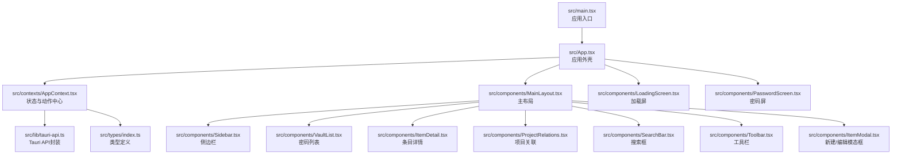
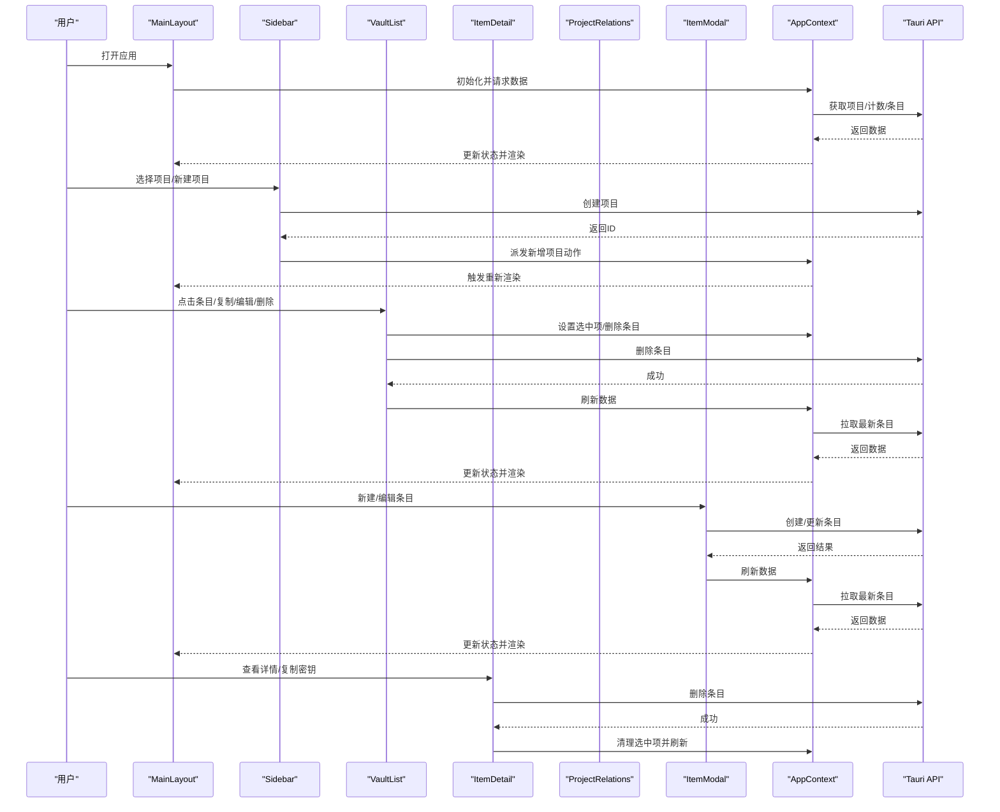
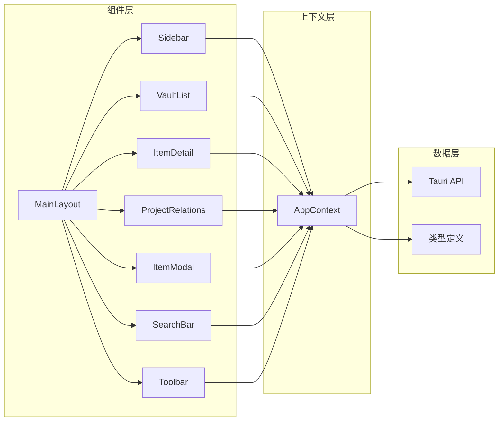

# 组件系统

<cite>
**本文引用的文件**
- [src/main.tsx](file://src/main.tsx)
- [src/App.tsx](file://src/App.tsx)
- [src/contexts/AppContext.tsx](file://src/contexts/AppContext.tsx)
- [src/types/index.ts](file://src/types/index.ts)
- [src/lib/tauri-api.ts](file://src/lib/tauri-api.ts)
- [src/components/MainLayout.tsx](file://src/components/MainLayout.tsx)
- [src/components/Sidebar.tsx](file://src/components/Sidebar.tsx)
- [src/components/VaultList.tsx](file://src/components/VaultList.tsx)
- [src/components/ItemDetail.tsx](file://src/components/ItemDetail.tsx)
- [src/components/ItemModal.tsx](file://src/components/ItemModal.tsx)
- [src/components/SearchBar.tsx](file://src/components/SearchBar.tsx)
- [src/components/Toolbar.tsx](file://src/components/Toolbar.tsx)
- [src/components/ProjectRelations.tsx](file://src/components/ProjectRelations.tsx)
- [src/components/LoadingScreen.tsx](file://src/components/LoadingScreen.tsx)
- [src/components/PasswordScreen.tsx](file://src/components/PasswordScreen.tsx)
</cite>

## 目录
1. [简介](#简介)
2. [项目结构](#项目结构)
3. [核心组件](#核心组件)
4. [架构总览](#架构总览)
5. [组件详解](#组件详解)
6. [依赖关系分析](#依赖关系分析)
7. [性能与可维护性](#性能与可维护性)
8. [故障排查指南](#故障排查指南)
9. [结论](#结论)
10. [附录](#附录)

## 简介
本文件面向AIpassword前端组件系统，聚焦于主布局组件MainLayout、侧边栏Sidebar、密码列表VaultList、项目详情/关联面板ProjectRelations、以及信息呈现组件ItemDetail等核心UI模块。文档从架构设计、数据流、状态管理、组件间通信、复用策略、条件渲染与动态加载等方面进行深入解析，并提供开发规范与最佳实践建议。

## 项目结构
应用采用“上下文驱动的状态管理 + 布局/功能组件分层”的组织方式：
- 应用入口负责挂载根组件与全局样式
- App根据应用上下文状态决定当前视图（加载屏、密码屏、主布局）
- 主布局作为容器，协调侧边栏、列表、详情、工具栏、搜索框、模态框等子组件
- 上下文AppContext集中管理应用状态、派发动作、刷新数据与搜索逻辑
- 类型定义统一约束数据模型
- Tauri API封装跨端调用，屏蔽平台差异

图表来源
- [src/main.tsx](file://src/main.tsx#L1-L10)
- [src/App.tsx](file://src/App.tsx#L1-L29)
- [src/contexts/AppContext.tsx](file://src/contexts/AppContext.tsx#L1-L162)
- [src/components/MainLayout.tsx](file://src/components/MainLayout.tsx#L1-L103)
- [src/components/Sidebar.tsx](file://src/components/Sidebar.tsx#L1-L143)
- [src/components/VaultList.tsx](file://src/components/VaultList.tsx#L1-L209)
- [src/components/ItemDetail.tsx](file://src/components/ItemDetail.tsx#L1-L234)
- [src/components/ProjectRelations.tsx](file://src/components/ProjectRelations.tsx#L1-L106)
- [src/components/SearchBar.tsx](file://src/components/SearchBar.tsx#L1-L50)
- [src/components/Toolbar.tsx](file://src/components/Toolbar.tsx#L1-L46)
- [src/components/ItemModal.tsx](file://src/components/ItemModal.tsx#L1-L327)
- [src/components/LoadingScreen.tsx](file://src/components/LoadingScreen.tsx#L1-L13)
- [src/components/PasswordScreen.tsx](file://src/components/PasswordScreen.tsx#L1-L146)
- [src/lib/tauri-api.ts](file://src/lib/tauri-api.ts#L1-L84)
- [src/types/index.ts](file://src/types/index.ts#L1-L46)

章节来源
- [src/main.tsx](file://src/main.tsx#L1-L10)
- [src/App.tsx](file://src/App.tsx#L1-L29)

## 核心组件
- 应用外壳与路由控制：App根据上下文状态在加载屏、密码屏与主布局之间切换
- 主布局容器：负责响应式布局、头部工具区、侧边栏、列表、详情/空态/关联面板、模态框
- 侧边栏：项目列表、新建项目表单、设置入口
- 密码列表：按项目过滤的条目列表、复制/编辑/删除、占位符与空态
- 条目详情：密钥显隐切换、复制多种格式、元数据展示、编辑/删除
- 模态框：新建/编辑条目，表单校验、剪贴板检测、favicon抓取、提交与刷新
- 搜索框：防抖查询、快捷键聚焦、触发搜索与回退
- 工具栏：新建条目、隐身模式切换、快速统计
- 项目关联：项目与凭证的关联/解绑、未关联凭证列表
- 上下文：集中状态、动作派发、数据刷新、搜索、主密码检查
- 类型与API：统一数据模型与跨端调用封装

章节来源
- [src/App.tsx](file://src/App.tsx#L1-L29)
- [src/contexts/AppContext.tsx](file://src/contexts/AppContext.tsx#L1-L162)
- [src/types/index.ts](file://src/types/index.ts#L1-L46)
- [src/lib/tauri-api.ts](file://src/lib/tauri-api.ts#L1-L84)

## 架构总览
组件系统遵循“自上而下”的单向数据流：
- AppContext提供状态与动作，所有组件通过useApp消费
- 主布局协调子组件，子组件通过dispatch改变状态
- 数据变更触发副作用（如刷新数据、搜索），再由组件重新渲染
- Tauri API封装跨端命令调用，返回Promise以保证异步一致性

图表来源
- [src/components/MainLayout.tsx](file://src/components/MainLayout.tsx#L1-L103)
- [src/components/Sidebar.tsx](file://src/components/Sidebar.tsx#L1-L143)
- [src/components/VaultList.tsx](file://src/components/VaultList.tsx#L1-L209)
- [src/components/ItemDetail.tsx](file://src/components/ItemDetail.tsx#L1-L234)
- [src/components/ItemModal.tsx](file://src/components/ItemModal.tsx#L1-L327)
- [src/contexts/AppContext.tsx](file://src/contexts/AppContext.tsx#L1-L162)
- [src/lib/tauri-api.ts](file://src/lib/tauri-api.ts#L1-L84)

## 组件详解

### MainLayout：主布局容器
- 职责：响应式布局、头部工具区、侧边栏、列表、详情/空态/关联面板、模态框
- 关键点：
  - 监听窗口尺寸，窄屏时折叠侧边栏与详情区域
  - 通过AppContext读取全局状态，控制模态框与编辑项
  - 条件渲染：无选中项时显示“选择条目”提示或项目关联面板
  - 事件：新建条目按钮回调打开模态框；列表/详情的编辑回调同样打开模态框

章节来源
- [src/components/MainLayout.tsx](file://src/components/MainLayout.tsx#L1-L103)

### Sidebar：侧边栏导航
- 职责：项目列表、新建项目表单、设置入口
- 关键点：
  - 通过dispatch设置/清空选中项目，实现按项目过滤
  - 表单新建项目后立即本地更新，避免闪烁
  - 项目计数来自后端聚合查询，直接渲染
  - 交互：点击项目高亮、点击设置按钮（预留）

章节来源
- [src/components/Sidebar.tsx](file://src/components/Sidebar.tsx#L1-L143)
- [src/contexts/AppContext.tsx](file://src/contexts/AppContext.tsx#L1-L162)
- [src/lib/tauri-api.ts](file://src/lib/tauri-api.ts#L1-L84)

### VaultList：密码列表
- 职责：展示当前项目下的条目，支持复制多种格式、编辑、删除、空态提示
- 关键点：
  - 通过AppContext读取当前项目与条目集合
  - 显示/隐藏逻辑：隐身模式下对标题、URL、备注进行遮罩
  - 复制反馈：通过DOM查找按钮并添加成功样式，稍后移除
  - 空态：根据是否存在搜索词给出不同提示
  - 事件：点击条目设置为选中项；点击新建按钮回调父组件打开模态框

章节来源
- [src/components/VaultList.tsx](file://src/components/VaultList.tsx#L1-L209)
- [src/contexts/AppContext.tsx](file://src/contexts/AppContext.tsx#L1-L162)
- [src/lib/tauri-api.ts](file://src/lib/tauri-api.ts#L1-L84)

### ItemDetail：条目详情
- 职责：展示选中条目的完整信息，支持密钥显隐、复制多种格式、编辑/删除
- 关键点：
  - 显示/隐藏：通过本地状态切换密钥显隐，结合隐身模式遮罩
  - 复制反馈：同列表组件，通过DOM查找按钮并添加成功样式
  - 编辑/删除：委托父组件回调打开模态框或执行删除
  - 项目标签：根据项目颜色与名称高亮显示

章节来源
- [src/components/ItemDetail.tsx](file://src/components/ItemDetail.tsx#L1-L234)
- [src/contexts/AppContext.tsx](file://src/contexts/AppContext.tsx#L1-L162)
- [src/lib/tauri-api.ts](file://src/lib/tauri-api.ts#L1-L84)

### ProjectRelations：项目关联面板
- 职责：展示项目关联的凭证与未关联凭证，支持添加/移除关联
- 关键点：
  - 并行加载“已关联”与“未关联”凭证列表
  - 添加：选择未关联凭证后创建关联并刷新
  - 移除：确认后删除关联并刷新
  - 依赖：选中项目ID变化时重新加载

章节来源
- [src/components/ProjectRelations.tsx](file://src/components/ProjectRelations.tsx#L1-L106)
- [src/contexts/AppContext.tsx](file://src/contexts/AppContext.tsx#L1-L162)
- [src/lib/tauri-api.ts](file://src/lib/tauri-api.ts#L1-L84)

### ItemModal：新建/编辑模态框
- 职责：统一的表单入口，支持新建与编辑两种模式
- 关键点：
  - 表单字段：标题、密钥、URL、分类、项目、颜色、备注
  - 校验：必填字段校验，错误提示
  - 剪贴板检测：检测潜在API Key并询问自动填充
  - favicon抓取：URL变化时自动拉取图标
  - 提交：新建/更新分别调用对应API，成功后刷新数据并关闭
  - 生命周期：打开时根据是否传入item决定模式；关闭时清理编辑项

章节来源
- [src/components/ItemModal.tsx](file://src/components/ItemModal.tsx#L1-L327)
- [src/contexts/AppContext.tsx](file://src/contexts/AppContext.tsx#L1-L162)
- [src/lib/tauri-api.ts](file://src/lib/tauri-api.ts#L1-L84)

### SearchBar：搜索框
- 职责：输入关键词，触发防抖搜索，支持快捷键聚焦
- 关键点：
  - 本地状态与全局状态同步，300ms防抖
  - 快捷键：Cmd/Ctrl+K聚焦输入框
  - 触发：本地状态变化时派发SET_SEARCH_QUERY并调用searchItems

章节来源
- [src/components/SearchBar.tsx](file://src/components/SearchBar.tsx#L1-L50)
- [src/contexts/AppContext.tsx](file://src/contexts/AppContext.tsx#L1-L162)

### Toolbar：工具栏
- 职责：新建条目、隐身模式切换、快速统计
- 关键点：
  - 新建条目：回调父组件打开模态框
  - 隐身模式：切换AppContext中的stealthMode
  - 统计：显示当前条目数量

章节来源
- [src/components/Toolbar.tsx](file://src/components/Toolbar.tsx#L1-L46)
- [src/contexts/AppContext.tsx](file://src/contexts/AppContext.tsx#L1-L162)

### LoadingScreen 与 PasswordScreen：应用启动阶段
- LoadingScreen：全屏加载动画
- PasswordScreen：首次使用设置主密码或验证已有主密码，完成后标记masterPasswordVerified

章节来源
- [src/components/LoadingScreen.tsx](file://src/components/LoadingScreen.tsx#L1-L13)
- [src/components/PasswordScreen.tsx](file://src/components/PasswordScreen.tsx#L1-L146)
- [src/contexts/AppContext.tsx](file://src/contexts/AppContext.tsx#L1-L162)
- [src/lib/tauri-api.ts](file://src/lib/tauri-api.ts#L1-L84)

## 依赖关系分析
- 组件到上下文：所有业务组件均依赖useApp消费状态与动作
- 组件到API：列表、详情、侧边栏、模态框、关联面板均通过API封装调用后端能力
- 上下文到API：AppContext在初始化、刷新、搜索、主密码检查等场景调用API
- 类型到组件：类型定义统一约束数据结构，确保组件间契约一致

图表来源
- [src/components/MainLayout.tsx](file://src/components/MainLayout.tsx#L1-L103)
- [src/components/Sidebar.tsx](file://src/components/Sidebar.tsx#L1-L143)
- [src/components/VaultList.tsx](file://src/components/VaultList.tsx#L1-L209)
- [src/components/ItemDetail.tsx](file://src/components/ItemDetail.tsx#L1-L234)
- [src/components/ProjectRelations.tsx](file://src/components/ProjectRelations.tsx#L1-L106)
- [src/components/ItemModal.tsx](file://src/components/ItemModal.tsx#L1-L327)
- [src/components/SearchBar.tsx](file://src/components/SearchBar.tsx#L1-L50)
- [src/components/Toolbar.tsx](file://src/components/Toolbar.tsx#L1-L46)
- [src/contexts/AppContext.tsx](file://src/contexts/AppContext.tsx#L1-L162)
- [src/lib/tauri-api.ts](file://src/lib/tauri-api.ts#L1-L84)
- [src/types/index.ts](file://src/types/index.ts#L1-L46)

章节来源
- [src/contexts/AppContext.tsx](file://src/contexts/AppContext.tsx#L1-L162)
- [src/lib/tauri-api.ts](file://src/lib/tauri-api.ts#L1-L84)
- [src/types/index.ts](file://src/types/index.ts#L1-L46)

## 性能与可维护性
- 性能优化
  - 防抖搜索：SearchBar对输入进行300ms防抖，减少不必要的API调用
  - 并行加载：AppContext在初始化时并行获取项目与计数，提升首屏速度
  - 本地预更新：新建项目时先本地更新项目列表，避免闪烁
  - 窄屏自适应：MainLayout根据窗口宽度折叠侧边栏与详情，降低重排成本
- 可维护性
  - 单一职责：每个组件专注自身领域，通过props与回调与父组件通信
  - 类型约束：严格的类型定义保证组件间契约清晰
  - 动作集中：所有状态变更通过AppContext派发，便于追踪与调试
  - 错误边界：各组件内部捕获并记录错误，避免崩溃传播

[本节为通用指导，无需列出具体文件来源]

## 故障排查指南
- 搜索无结果
  - 检查SearchBar是否正确派发SET_SEARCH_QUERY并调用searchItems
  - 确认API返回数据是否为空，必要时回退到refreshData
- 新建/编辑失败
  - 检查ItemModal表单校验与错误提示
  - 确认API调用返回与refreshData是否成功
- 项目切换后列表未更新
  - 检查AppContext中selectedProject变更是否触发refreshData
  - 确认getVaultItemsByProject是否正确按项目过滤
- 隐身模式显示异常
  - 检查stealthMode状态与displayText遮罩逻辑
- 复制反馈无效
  - 检查按钮ID生成与DOM查找逻辑，确保元素存在

章节来源
- [src/components/SearchBar.tsx](file://src/components/SearchBar.tsx#L1-L50)
- [src/contexts/AppContext.tsx](file://src/contexts/AppContext.tsx#L1-L162)
- [src/components/ItemModal.tsx](file://src/components/ItemModal.tsx#L1-L327)
- [src/components/VaultList.tsx](file://src/components/VaultList.tsx#L1-L209)
- [src/components/ItemDetail.tsx](file://src/components/ItemDetail.tsx#L1-L234)

## 结论
该组件系统以AppContext为核心，围绕主布局容器进行模块化拆分，实现了清晰的职责划分与稳定的单向数据流。通过防抖搜索、并行加载、本地预更新等策略提升了用户体验，同时严格的类型约束与统一的动作派发机制增强了可维护性。后续可在以下方面持续演进：引入更细粒度的缓存策略、增强错误恢复与重试机制、扩展主题与无障碍能力。

[本节为总结性内容，无需列出具体文件来源]

## 附录

### 组件Props与状态概览
- MainLayout
  - props：无
  - 状态：窗口尺寸、模态框开关、编辑项
- Sidebar
  - props：无
  - 状态：新建项目表单可见性与输入
- VaultList
  - props：onEditItem回调
  - 状态：无
- ItemDetail
  - props：onEditItem回调
  - 状态：密钥显隐
- ItemModal
  - props：isOpen、onClose、item
  - 状态：表单数据、加载状态、错误信息
- SearchBar
  - props：无
  - 状态：本地查询词
- Toolbar
  - props：onNewItem回调
  - 状态：无
- ProjectRelations
  - props：无
  - 状态：已关联/未关联列表、选中待添加项

章节来源
- [src/components/MainLayout.tsx](file://src/components/MainLayout.tsx#L1-L103)
- [src/components/Sidebar.tsx](file://src/components/Sidebar.tsx#L1-L143)
- [src/components/VaultList.tsx](file://src/components/VaultList.tsx#L1-L209)
- [src/components/ItemDetail.tsx](file://src/components/ItemDetail.tsx#L1-L234)
- [src/components/ItemModal.tsx](file://src/components/ItemModal.tsx#L1-L327)
- [src/components/SearchBar.tsx](file://src/components/SearchBar.tsx#L1-L50)
- [src/components/Toolbar.tsx](file://src/components/Toolbar.tsx#L1-L46)
- [src/components/ProjectRelations.tsx](file://src/components/ProjectRelations.tsx#L1-L106)

### 开发规范与最佳实践
- 状态管理
  - 使用AppContext集中管理应用状态，避免组件间重复状态
  - 动作命名语义化，payload结构清晰
- 组件通信
  - 父子通信使用props，回调使用函数型props
  - 事件冒泡需在子组件内阻止，避免意外触发父级逻辑
- 数据流
  - 读写分离：UI只读取状态，通过dispatch写入
  - 异步操作统一在上下文中处理，组件仅关注渲染
- 错误处理
  - 组件内部捕获并记录错误，必要时向上抛出或显示提示
- 可访问性
  - 为交互元素提供title或aria-label
  - 控制键盘焦点顺序与快捷键提示
- 性能
  - 对高频输入使用防抖/节流
  - 合理拆分组件，避免不必要的重渲染
  - 在列表渲染中使用稳定key，减少DOM变动

[本节为通用指导，无需列出具体文件来源]