# Tauri应用壳配置

<cite>
**本文档引用的文件**
- [src-tauri/src/main.rs](file://src-tauri/src/main.rs)
- [src-tauri/tauri.conf.json](file://src-tauri/tauri.conf.json)
- [src-tauri/build.rs](file://src-tauri/build.rs)
- [src-tauri/Cargo.toml](file://src-tauri/Cargo.toml)
- [src-tauri/src/lib.rs](file://src-tauri/src/lib.rs)
- [src-tauri/src/commands.rs](file://src-tauri/src/commands.rs)
- [src-tauri/src/database.rs](file://src-tauri/src/database.rs)
- [src-tauri/src/crypto.rs](file://src-tauri/src/crypto.rs)
- [src-tauri/migrations/001_create_projects_table.sql](file://src-tauri/migrations/001_create_projects_table.sql)
- [src-tauri/migrations/005_migrate_vault_relations.sql](file://src-tauri/migrations/005_migrate_vault_relations.sql)
- [package.json](file://package.json)
- [src/App.tsx](file://src/App.tsx)
- [src/main.tsx](file://src/main.tsx)
- [src/components/PasswordScreen.tsx](file://src/components/PasswordScreen.tsx)
- [src/contexts/AppContext.tsx](file://src/contexts/AppContext.tsx)
- [src/lib/tauri-api.ts](file://src/lib/tauri-api.ts)
</cite>

## 目录
1. [简介](#简介)
2. [项目结构](#项目结构)
3. [核心组件](#核心组件)
4. [架构概览](#架构概览)
5. [详细组件分析](#详细组件分析)
6. [依赖关系分析](#依赖关系分析)
7. [性能考虑](#性能考虑)
8. [故障排除指南](#故障排除指南)
9. [结论](#结论)

## 简介

AIpassword是一个基于Tauri框架开发的桌面应用程序壳，用于管理开发者的敏感凭证信息。该应用采用Rust作为后端语言，TypeScript/React作为前端技术栈，通过Tauri的桥接机制实现前后端通信。应用提供了密码管理、项目分类、搜索功能以及主密码保护等核心特性。

## 项目结构

该项目采用典型的Tauri项目结构，分为前端和后端两个主要部分：

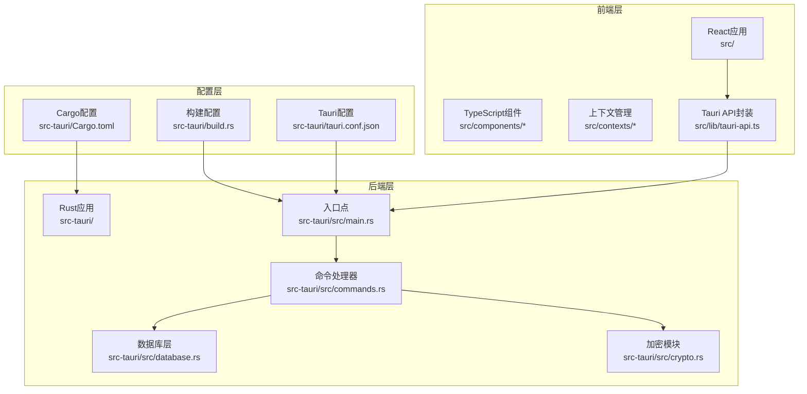

**图表来源**
- [src-tauri/src/main.rs](file://src-tauri/src/main.rs#L1-L51)
- [src-tauri/tauri.conf.json](file://src-tauri/tauri.conf.json#L1-L33)
- [src-tauri/build.rs](file://src-tauri/build.rs#L1-L3)
- [src-tauri/Cargo.toml](file://src-tauri/Cargo.toml#L1-L34)

**章节来源**
- [src-tauri/src/main.rs](file://src-tauri/src/main.rs#L1-L51)
- [src-tauri/tauri.conf.json](file://src-tauri/tauri.conf.json#L1-L33)
- [src-tauri/build.rs](file://src-tauri/build.rs#L1-L3)
- [src-tauri/Cargo.toml](file://src-tauri/Cargo.toml#L1-L34)

## 核心组件

### 应用启动流程

应用启动过程遵循标准的Tauri生命周期，从main.rs入口点开始，经过初始化到运行阶段：

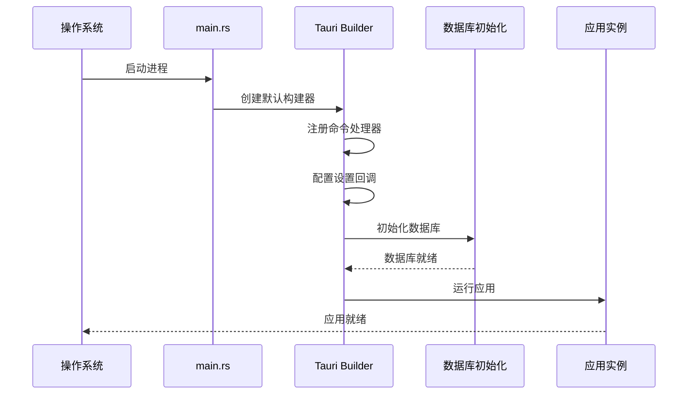

**图表来源**
- [src-tauri/src/main.rs](file://src-tauri/src/main.rs#L21-L51)
- [src-tauri/src/database.rs](file://src-tauri/src/database.rs#L13-L52)

### 命令处理器注册机制

应用通过`generate_handler!`宏批量注册所有可用的命令处理器，确保前后端通信的类型安全：

| 命令类别 | 命令数量 | 功能描述 |
|---------|---------|----------|
| 凭证管理 | 4个 | 创建、读取、更新、删除凭证项 |
| 项目管理 | 2个 | 创建、查询项目信息 |
| 关系管理 | 4个 | 凭证与项目的关联操作 |
| 工具函数 | 3个 | 剪贴板操作、图标获取、密码验证 |
| 统计查询 | 3个 | 项目统计、分组查询、未链接项 |

**章节来源**
- [src-tauri/src/main.rs](file://src-tauri/src/main.rs#L22-L39)
- [src-tauri/src/commands.rs](file://src-tauri/src/commands.rs#L1-L487)

### 数据库初始化策略

应用采用延迟初始化模式，在应用启动时异步建立数据库连接池，并自动执行迁移脚本：

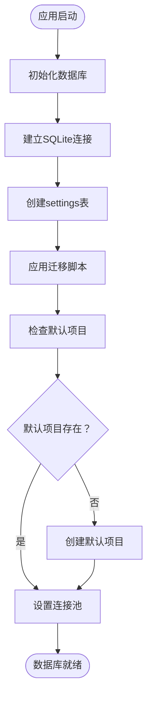

**图表来源**
- [src-tauri/src/database.rs](file://src-tauri/src/database.rs#L13-L52)
- [src-tauri/migrations/001_create_projects_table.sql](file://src-tauri/migrations/001_create_projects_table.sql#L1-L13)

**章节来源**
- [src-tauri/src/database.rs](file://src-tauri/src/database.rs#L13-L104)

## 架构概览

### 整体架构设计

应用采用分层架构，清晰分离关注点：

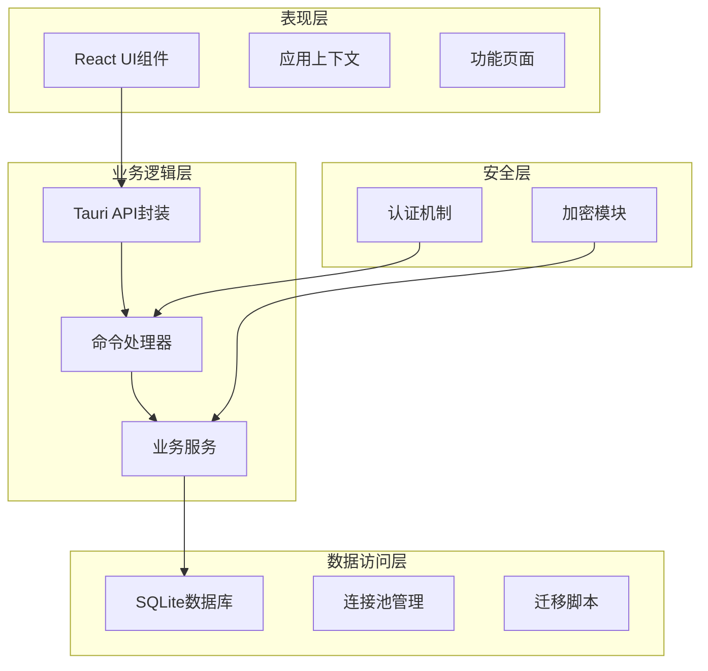

**图表来源**
- [src-tauri/src/main.rs](file://src-tauri/src/main.rs#L8-L19)
- [src-tauri/src/commands.rs](file://src-tauri/src/commands.rs#L1-L487)
- [src-tauri/src/database.rs](file://src-tauri/src/database.rs#L1-L104)

### 跨平台兼容性

应用通过条件编译实现跨平台支持：

| 平台 | 支持状态 | 特殊处理 |
|------|----------|----------|
| Windows | 完全支持 | 剪贴板操作、原生窗口管理 |
| macOS | 部分支持 | 剪贴板功能受限 |
| Linux | 部分支持 | 剪贴板功能受限 |
| Android | 不支持 | 缺少原生API支持 |
| iOS | 不支持 | 缺少原生API支持 |

**章节来源**
- [src-tauri/src/commands.rs](file://src-tauri/src/commands.rs#L213-L228)

## 详细组件分析

### 主应用入口点

main.rs作为应用的唯一入口点，负责初始化整个应用生命周期：

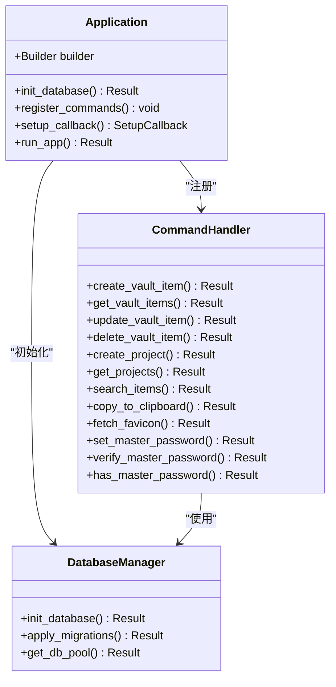

**图表来源**
- [src-tauri/src/main.rs](file://src-tauri/src/main.rs#L21-L51)
- [src-tauri/src/commands.rs](file://src-tauri/src/commands.rs#L40-L310)
- [src-tauri/src/database.rs](file://src-tauri/src/database.rs#L13-L104)

**章节来源**
- [src-tauri/src/main.rs](file://src-tauri/src/main.rs#L1-L51)

### 数据库管理系统

数据库层采用SQLx库实现异步数据库操作，支持SQLite数据库：

#### 数据库连接池设计

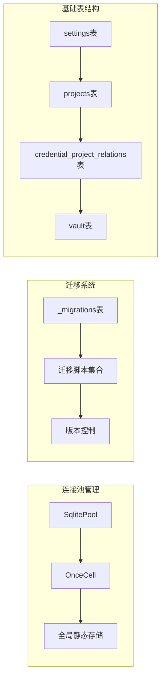

**图表来源**
- [src-tauri/src/database.rs](file://src-tauri/src/database.rs#L5-L104)
- [src-tauri/migrations/001_create_projects_table.sql](file://src-tauri/migrations/001_create_projects_table.sql#L1-L13)
- [src-tauri/migrations/005_migrate_vault_relations.sql](file://src-tauri/migrations/005_migrate_vault_relations.sql#L1-L18)

#### 迁移脚本分析

应用包含5个核心迁移脚本，确保数据库结构的演进：

| 迁移编号 | 文件名 | 功能描述 | 关键变更 |
|---------|--------|----------|----------|
| 001 | create_projects_table.sql | 创建项目表 | 基础项目结构、索引创建 |
| 002 | create_relations_table.sql | 创建关系表 | 凭证-项目关联机制 |
| 003 | create_imports_table.sql | 创建导入表 | 导入历史记录 |
| 004 | create_api_keys_table.sql | 创建API密钥表 | API密钥管理 |
| 005 | migrate_vault_relations.sql | 数据迁移脚本 | 默认项目创建、关系建立 |

**章节来源**
- [src-tauri/src/database.rs](file://src-tauri/src/database.rs#L7-L11)
- [src-tauri/migrations/001_create_projects_table.sql](file://src-tauri/migrations/001_create_projects_table.sql#L1-L13)
- [src-tauri/migrations/005_migrate_vault_relations.sql](file://src-tauri/migrations/005_migrate_vault_relations.sql#L1-L18)

### 加密安全模块

应用采用现代加密标准实现数据保护：

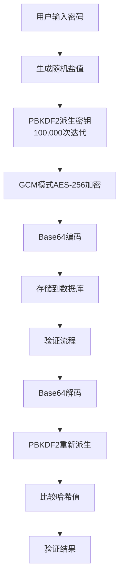

**图表来源**
- [src-tauri/src/crypto.rs](file://src-tauri/src/crypto.rs#L76-L92)
- [src-tauri/src/commands.rs](file://src-tauri/src/commands.rs#L248-L309)

#### 加密算法选择

| 组件 | 算法 | 参数 | 安全特性 |
|------|------|------|----------|
| 密钥派生 | PBKDF2-HMAC-SHA256 | 100,000次迭代 | 抗暴力破解 |
| 对称加密 | AES-256-GCM | 256位密钥 | 认证加密 |
| 随机数生成 | SystemRandom | 系统熵源 | 高质量随机 |
| 哈希存储 | Base64编码 | 标准变体 | 可逆编码 |

**章节来源**
- [src-tauri/src/crypto.rs](file://src-tauri/src/crypto.rs#L1-L92)

### 前端集成架构

前端通过Tauri API与后端进行通信，实现类型安全的跨语言调用：

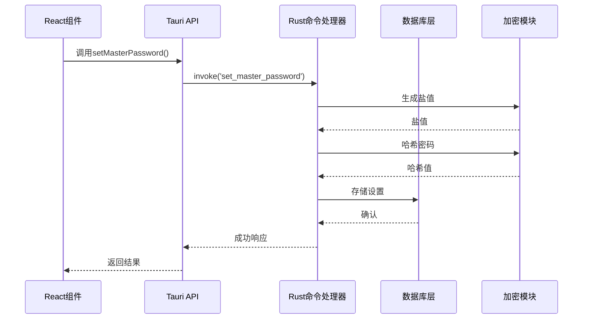

**图表来源**
- [src/lib/tauri-api.ts](file://src/lib/tauri-api.ts#L66-L76)
- [src-tauri/src/commands.rs](file://src-tauri/src/commands.rs#L248-L269)
- [src-tauri/src/crypto.rs](file://src-tauri/src/crypto.rs#L76-L92)

**章节来源**
- [src/lib/tauri-api.ts](file://src/lib/tauri-api.ts#L1-L84)
- [src-tauri/src/commands.rs](file://src-tauri/src/commands.rs#L248-L309)

## 依赖关系分析

### Rust依赖层次

应用的Rust依赖关系呈现清晰的分层结构：

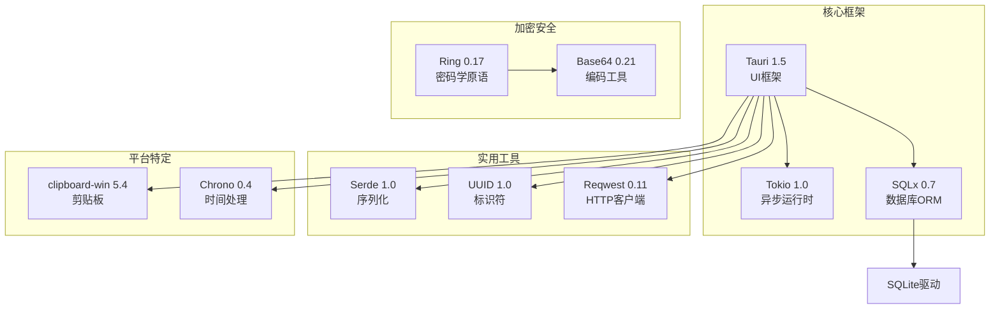

**图表来源**
- [src-tauri/Cargo.toml](file://src-tauri/Cargo.toml#L15-L29)

### 前端依赖集成

前端通过Vite构建系统与Tauri CLI集成：

| 依赖类型 | 包名称 | 版本 | 用途 |
|----------|--------|------|------|
| 框架核心 | @tauri-apps/api | ^1.5.3 | Tauri API接口 |
| React生态 | react | ^18.2.0 | 用户界面框架 |
| 构建工具 | @tauri-apps/cli | ^1.5.8 | 开发和构建工具 |
| TypeScript | typescript | ^5.2.2 | 类型检查 |
| 样式工具 | tailwindcss | ^3.3.6 | CSS框架 |

**章节来源**
- [src-tauri/Cargo.toml](file://src-tauri/Cargo.toml#L15-L29)
- [package.json](file://package.json#L13-L31)

## 性能考虑

### 数据库性能优化

应用采用多种策略优化数据库性能：

1. **连接池管理**：使用OnceCell实现线程安全的连接池缓存
2. **异步操作**：所有数据库操作使用async/await避免阻塞
3. **索引优化**：为常用查询字段创建索引
4. **批量操作**：支持Promise.all并行获取多个数据源

### 内存管理策略

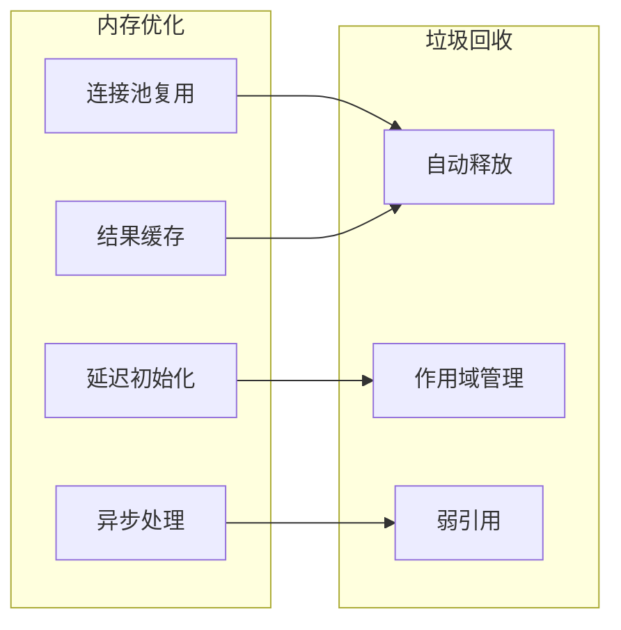

### 前端性能优化

前端应用通过以下方式提升用户体验：

1. **按需加载**：组件懒加载减少初始包大小
2. **状态管理**：使用useReducer优化复杂状态更新
3. **事件防抖**：搜索功能实现防抖机制
4. **虚拟滚动**：大量数据时使用虚拟化列表

## 故障排除指南

### 常见启动问题

| 问题症状 | 可能原因 | 解决方案 |
|----------|----------|----------|
| 应用无法启动 | 数据库连接失败 | 检查devvault.db文件权限 |
| 剪贴板功能异常 | 平台不支持 | 检查目标操作系统支持情况 |
| 命令调用失败 | 命令未注册 | 验证generate_handler!宏中的命令列表 |
| 迁移失败 | 数据库版本冲突 | 删除数据库文件重新初始化 |

### 调试方法

1. **日志输出**：使用eprintln!进行错误日志记录
2. **开发模式**：使用`npm run tauri:dev`启用热重载
3. **浏览器调试**：通过Tauri DevTools进行前端调试
4. **数据库检查**：使用SQLite客户端查看数据库状态

### 错误处理策略

应用采用统一的错误处理模式：

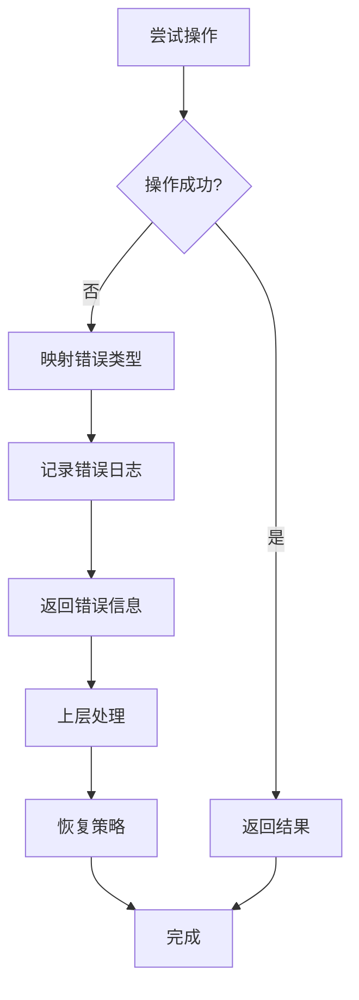

**章节来源**
- [src-tauri/src/main.rs](file://src-tauri/src/main.rs#L42-L46)
- [src-tauri/src/database.rs](file://src-tauri/src/database.rs#L13-L52)

## 结论

AIpassword的Tauri应用壳展现了现代桌面应用开发的最佳实践。通过精心设计的架构，应用实现了：

1. **安全性**：采用PBKDF2+AES-GCM的强加密方案保护敏感数据
2. **性能**：异步数据库操作和连接池优化确保流畅体验
3. **可维护性**：清晰的分层架构和模块化设计便于代码维护
4. **跨平台**：条件编译实现多平台兼容性

该应用为开发者提供了一个安全、高效、易用的凭证管理解决方案，展示了Tauri框架在构建现代桌面应用方面的强大能力。