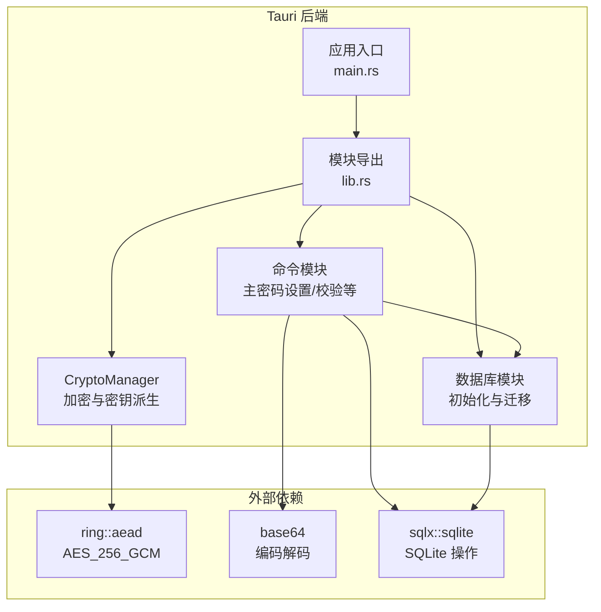
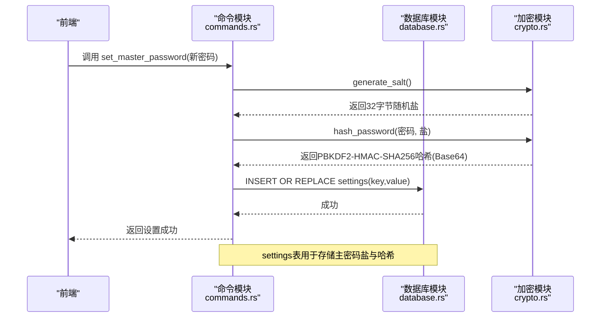
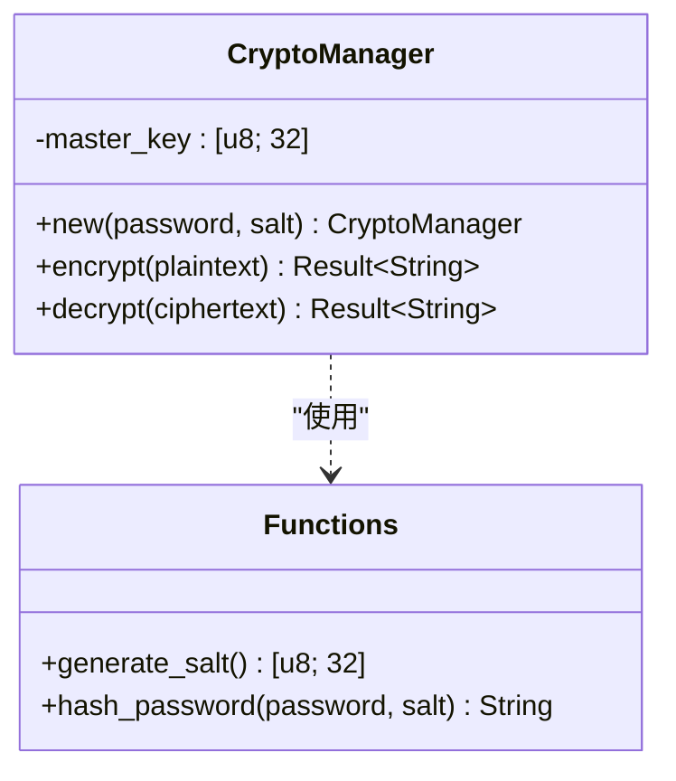
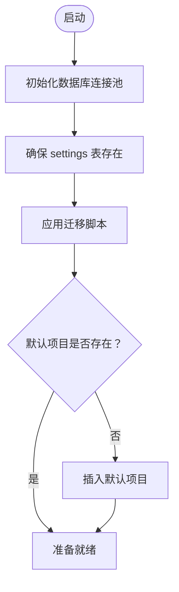
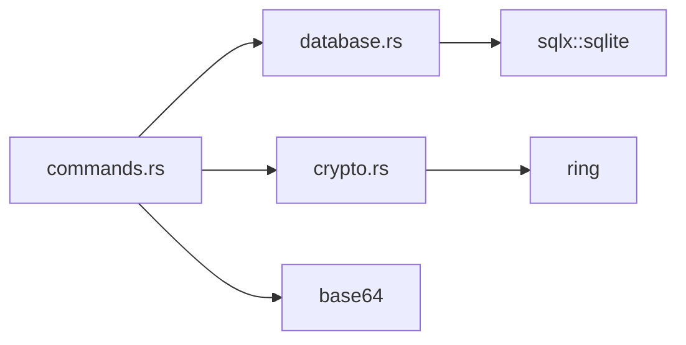

# 加密与安全模块

<cite>
**本文档引用的文件**
- [crypto.rs](file://src-tauri/src/crypto.rs)
- [commands.rs](file://src-tauri/src/commands.rs)
- [database.rs](file://src-tauri/src/database.rs)
- [lib.rs](file://src-tauri/src/lib.rs)
- [main.rs](file://src-tauri/src/main.rs)
- [Cargo.toml](file://src-tauri/Cargo.toml)
- [001_create_projects_table.sql](file://src-tauri/migrations/001_create_projects_table.sql)
- [002_create_relations_table.sql](file://src-tauri/migrations/002_create_relations_table.sql)
- [003_create_imports_table.sql](file://src-tauri/migrations/003_create_imports_table.sql)
- [004_create_api_keys_table.sql](file://src-tauri/migrations/004_create_api_keys_table.sql)
- [005_migrate_vault_relations.sql](file://src-tauri/migrations/005_migrate_vault_relations.sql)
</cite>

## 目录
1. [简介](#简介)
2. [项目结构](#项目结构)
3. [核心组件](#核心组件)
4. [架构总览](#架构总览)
5. [详细组件分析](#详细组件分析)
6. [依赖关系分析](#依赖关系分析)
7. [性能考虑](#性能考虑)
8. [故障排除指南](#故障排除指南)
9. [结论](#结论)
10. [附录](#附录)

## 简介
本文件为 AIpassword 的加密与安全模块技术文档，聚焦于密码加密算法选择与实现、数据保护机制与安全存储策略、主密码系统验证流程、密钥派生与哈希处理、数据传输与存储加密、会话管理、Ring 加密库使用、随机数生成与安全随机性保证，以及安全威胁防护、漏洞检测与安全审计机制。同时提供密码学最佳实践、安全配置指南与合规性建议，帮助开发者与运维人员理解并维护系统的安全性。

## 项目结构
AIpassword 的安全相关代码主要位于 Tauri 后端模块中，采用 Rust 实现，前端通过 Tauri 命令调用后端能力。加密与安全相关的关键文件包括：
- 加密与密钥派生：src-tauri/src/crypto.rs
- 主密码设置与校验：src-tauri/src/commands.rs
- 数据库初始化与迁移：src-tauri/src/database.rs
- 模块导出与入口：src-tauri/src/lib.rs、src-tauri/src/main.rs
- 依赖声明：src-tauri/Cargo.toml
- 数据库迁移脚本：src-tauri/migrations/*.sql



**图表来源**
- [main.rs](file://src-tauri/src/main.rs#L1-L58)
- [lib.rs](file://src-tauri/src/lib.rs#L1-L4)
- [crypto.rs](file://src-tauri/src/crypto.rs#L1-L92)
- [commands.rs](file://src-tauri/src/commands.rs#L1-L572)
- [database.rs](file://src-tauri/src/database.rs#L1-L104)
- [Cargo.toml](file://src-tauri/Cargo.toml#L15-L29)

**章节来源**
- [main.rs](file://src-tauri/src/main.rs#L1-L58)
- [lib.rs](file://src-tauri/src/lib.rs#L1-L4)
- [Cargo.toml](file://src-tauri/Cargo.toml#L15-L29)

## 核心组件
- CryptoManager：基于 PBKDF2-HMAC-SHA256 的主密码派生与 AES-256-GCM 的对称加密封装，提供加密与解密接口，并内置安全随机盐生成与密码哈希工具。
- 主密码命令集：set_master_password、verify_master_password、has_master_password，负责主密码的设置、校验与存在性检查，数据持久化在 SQLite 的 settings 表中。
- 数据库模块：初始化 SQLite 连接池、执行迁移脚本、确保基础表存在，支持安全可重复的迁移。
- 前端集成：通过 Tauri 命令暴露加密与安全能力，前端仅接收已加密或已哈希的数据，避免明文敏感信息泄露。

**章节来源**
- [crypto.rs](file://src-tauri/src/crypto.rs#L7-L92)
- [commands.rs](file://src-tauri/src/commands.rs#L248-L309)
- [database.rs](file://src-tauri/src/database.rs#L13-L52)

## 架构总览
下图展示了从主密码设置到数据存储的整体安全流程，包括 PBKDF2 密钥派生、AES-256-GCM 加密、Base64 编码与 SQLite 存储。



**图表来源**
- [commands.rs](file://src-tauri/src/commands.rs#L248-L269)
- [crypto.rs](file://src-tauri/src/crypto.rs#L76-L92)
- [database.rs](file://src-tauri/src/database.rs#L13-L52)

## 详细组件分析

### CryptoManager 组件分析
CryptoManager 封装了主密码派生与对称加解密逻辑，关键点如下：
- PBKDF2-HMAC-SHA256：使用 100,000 次迭代进行密钥派生，输出固定长度主密钥。
- AES-256-GCM：使用系统安全随机数生成器生成 12 字节随机 nonce，结合认证标签确保机密性与完整性。
- Base64 编码：将加密结果（前缀 12 字节 nonce + 密文 + 认证标签）统一编码以便存储与传输。
- 安全随机性：使用 ring::rand::SystemRandom 提供操作系统级熵源。



**图表来源**
- [crypto.rs](file://src-tauri/src/crypto.rs#L7-L92)

**章节来源**
- [crypto.rs](file://src-tauri/src/crypto.rs#L7-L92)

### 主密码系统验证流程
主密码设置与验证流程如下：
- 设置主密码：生成随机盐 → PBKDF2-HMAC-SHA256 派生哈希 → Base64 编码 → 写入 settings 表（键值对：salt 与 hash）。
- 验证主密码：从 settings 读取 salt 与 hash → Base64 解码盐 → 输入密码与盐重新计算哈希 → 比较哈希值决定是否通过。

```mermaid
sequenceDiagram
participant FE as "前端"
participant CMD as "命令模块"
participant DB as "数据库"
participant CR as "加密模块"
FE->>CMD : 调用 verify_master_password(输入密码)
CMD->>DB : 查询 settings('master_password_salt')
DB-->>CMD : 返回Base64编码盐
CMD->>DB : 查询 settings('master_password_hash')
DB-->>CMD : 返回存储哈希
CMD->>CR : decode(Base64盐) -> [u8; 32]
CMD->>CR : hash_password(输入密码, 盐)
CR-->>CMD : 返回计算哈希
CMD->>CMD : 比较计算哈希与存储哈希
CMD-->>FE : 返回验证结果
```

**图表来源**
- [commands.rs](file://src-tauri/src/commands.rs#L284-L309)
- [crypto.rs](file://src-tauri/src/crypto.rs#L82-L92)

**章节来源**
- [commands.rs](file://src-tauri/src/commands.rs#L248-L309)
- [crypto.rs](file://src-tauri/src/crypto.rs#L76-L92)

### 数据保护机制与存储策略
- 敏感数据存储：settings 表保存主密码盐与哈希；vault 表存储经客户端加密后的密文字段（如 secret_encrypted），避免明文落入数据库。
- 迁移与索引：通过迁移脚本创建 projects、credential_project_relations、chrome_imported_passwords、api_keys_registry 等表，并建立必要索引提升查询效率。
- 默认项目与一致性：迁移脚本确保默认项目存在，避免空引用；使用 WHERE NOT EXISTS 避免重复迁移。



**图表来源**
- [database.rs](file://src-tauri/src/database.rs#L13-L52)
- [001_create_projects_table.sql](file://src-tauri/migrations/001_create_projects_table.sql#L1-L13)
- [005_migrate_vault_relations.sql](file://src-tauri/migrations/005_migrate_vault_relations.sql#L1-L18)

**章节来源**
- [database.rs](file://src-tauri/src/database.rs#L13-L52)
- [001_create_projects_table.sql](file://src-tauri/migrations/001_create_projects_table.sql#L1-L13)
- [002_create_relations_table.sql](file://src-tauri/migrations/002_create_relations_table.sql#L1-L16)
- [003_create_imports_table.sql](file://src-tauri/migrations/003_create_imports_table.sql#L1-L15)
- [004_create_api_keys_table.sql](file://src-tauri/migrations/004_create_api_keys_table.sql#L1-L13)
- [005_migrate_vault_relations.sql](file://src-tauri/migrations/005_migrate_vault_relations.sql#L1-L18)

### 数据传输加密与会话管理
- 数据传输：当前实现未显式启用 TLS 或会话令牌管理。建议在生产环境中启用 HTTPS/TLS 并引入短期会话令牌与刷新机制，避免长期凭据暴露。
- 会话管理：当前未实现服务端会话状态管理，主密码校验通过后由前端自行控制后续操作。建议引入基于 JWT 的短期会话与安全 Cookie 策略。

[本节为概念性说明，不直接分析具体文件]

### Ring 加密库使用与随机数生成
- AES-256-GCM：使用 ring::aead::AES_256_GCM 与 LessSafeKey 实现密封与打开，自动附加认证标签，确保机密性与完整性。
- 随机数：SystemRandom 提供系统级安全随机源，用于生成盐与 nonce；nonce 采用 12 字节随机值并假设“每密钥唯一”。
- Base64：统一编码加密结果，便于数据库存储与网络传输。

**章节来源**
- [crypto.rs](file://src-tauri/src/crypto.rs#L1-L92)
- [Cargo.toml](file://src-tauri/Cargo.toml#L22-L23)

### 安全威胁防护与漏洞检测
- 针对主密码：PBKDF2 迭代次数较高，降低暴力破解风险；盐值随机且独立存储，防止彩虹表攻击。
- 针对存储：数据库文件本地化，建议配合文件系统权限与磁盘加密；迁移脚本幂等，避免重复写入。
- 针对传输：建议启用 TLS；当前未见专用 API 通道，需在前端或代理层确保 HTTPS。
- 漏洞检测：建议定期扫描依赖版本与已知漏洞；对用户输入进行严格校验与最小权限原则。

**章节来源**
- [commands.rs](file://src-tauri/src/commands.rs#L248-L309)
- [database.rs](file://src-tauri/src/database.rs#L13-L52)

### 安全审计机制
- 迁移审计：_migrations 表记录已应用迁移，便于审计与回溯。
- 日志与错误：数据库初始化失败时输出错误信息；命令返回错误字符串，便于前端提示与日志收集。
- 建议：增加结构化日志与审计事件（如主密码设置/修改、重要数据变更）。

**章节来源**
- [database.rs](file://src-tauri/src/database.rs#L54-L97)
- [main.rs](file://src-tauri/src/main.rs#L47-L55)

## 依赖关系分析
- ring：提供 AEAD（AES-256-GCM）、PBKDF2、安全随机数等密码学原语。
- base64：用于编码加密结果与存储盐值。
- sqlx：异步 SQLite 访问，支持运行时与编译时类型安全。
- tauri：提供命令注册与跨平台桌面应用运行时。



**图表来源**
- [commands.rs](file://src-tauri/src/commands.rs#L1-L10)
- [crypto.rs](file://src-tauri/src/crypto.rs#L1-L5)
- [database.rs](file://src-tauri/src/database.rs#L1-L3)
- [Cargo.toml](file://src-tauri/Cargo.toml#L15-L29)

**章节来源**
- [Cargo.toml](file://src-tauri/Cargo.toml#L15-L29)

## 性能考虑
- PBKDF2 迭代次数：100,000 次迭代在现代 CPU 上约需数十毫秒，平衡安全与体验；可根据设备性能调整。
- 加密开销：AES-256-GCM 认证标签附加与验证成本低；Base64 编码带来约 33% 字节膨胀。
- 数据库 I/O：SQLite 顺序写入与索引查询为主；建议在高频查询场景增加合适索引（已有迁移脚本创建索引）。
- 并发访问：sqlx 连接池支持并发；注意避免长时间持有锁与阻塞操作。

[本节提供一般性指导，不直接分析具体文件]

## 故障排除指南
- 数据库未初始化：检查 init_database 是否在应用启动时正确执行；确认 SQLite 文件路径与权限。
- 迁移失败：查看 _migrations 表与具体迁移脚本；确保 SQL 语法正确且幂等。
- 主密码设置失败：确认 settings 表存在；检查盐与哈希的 Base64 编解码是否正确。
- 加密/解密异常：核对 nonce 长度与格式；确保密文包含前缀盐与认证标签；检查 Base64 编码/解码链路。

**章节来源**
- [database.rs](file://src-tauri/src/database.rs#L13-L52)
- [commands.rs](file://src-tauri/src/commands.rs#L248-L309)
- [crypto.rs](file://src-tauri/src/crypto.rs#L25-L74)

## 结论
AIpassword 当前的安全实现以 PBKDF2-HMAC-SHA256 与 AES-256-GCM 为核心，结合安全随机盐与 Base64 编码，提供了可靠的本地存储保护与主密码验证机制。数据库迁移与幂等设计增强了系统稳定性。建议在生产环境中补充 TLS 传输加密、短期会话令牌与安全日志审计，以进一步提升整体安全性与合规性。

## 附录

### 密码学最佳实践清单
- 使用高迭代次数的 KDF（如 PBKDF2、scrypt、Argon2）并定期评估性能与安全参数。
- 对称加密优先选择 AEAD（如 AES-256-GCM），确保机密性与完整性。
- 随机数来源必须来自系统安全熵源；nonce 必须随机且不可预测。
- 密钥材料仅在内存中处理，避免落盘；如需持久化，使用受保护的密钥库或硬件安全模块。
- 传输层启用 TLS；会话管理采用短期令牌与安全 Cookie 策略。
- 定期进行依赖漏洞扫描与安全审计；最小权限原则与纵深防御。

[本节为通用最佳实践，不直接分析具体文件]

### 安全配置指南
- 运行环境：启用只读文件系统权限；数据库文件置于受保护目录；启用磁盘加密。
- 应用配置：禁用调试模式；限制窗口子系统；启用内容安全策略（CSP）。
- 传输安全：强制 HTTPS；禁用弱密码套件；启用 HSTS。
- 日志与监控：记录安全事件；限制日志敏感信息；部署入侵检测系统。

[本节为通用配置建议，不直接分析具体文件]