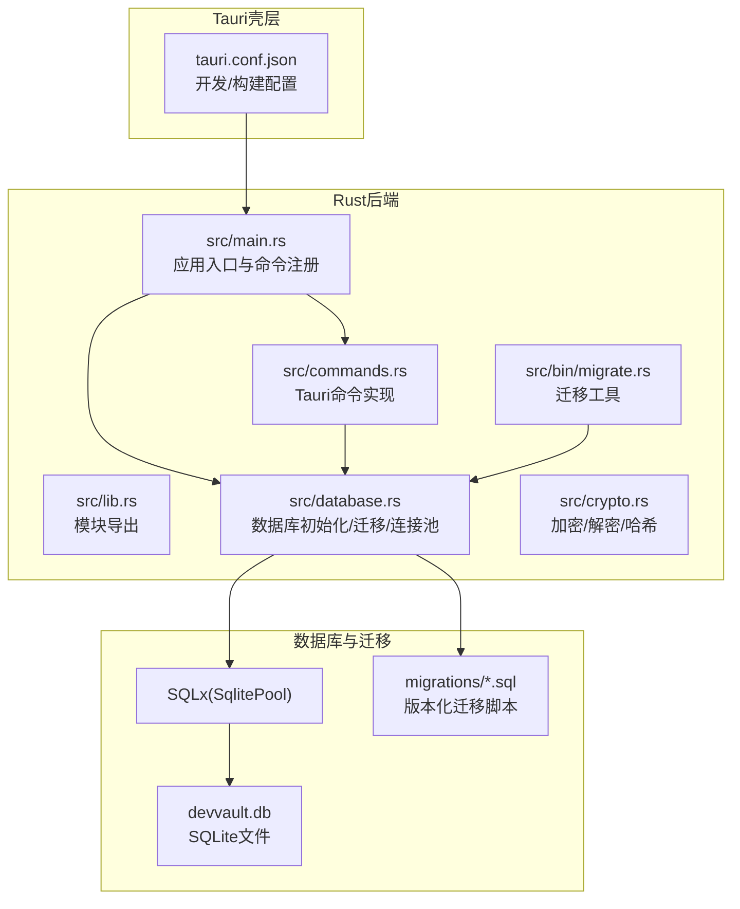
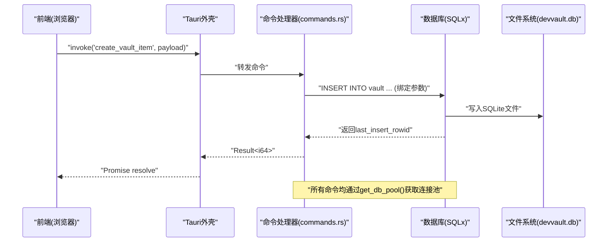
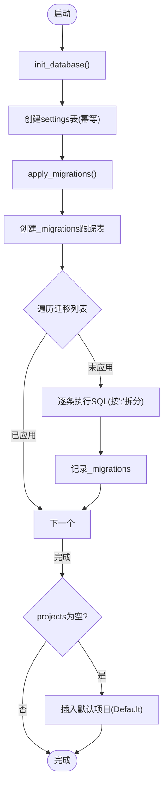
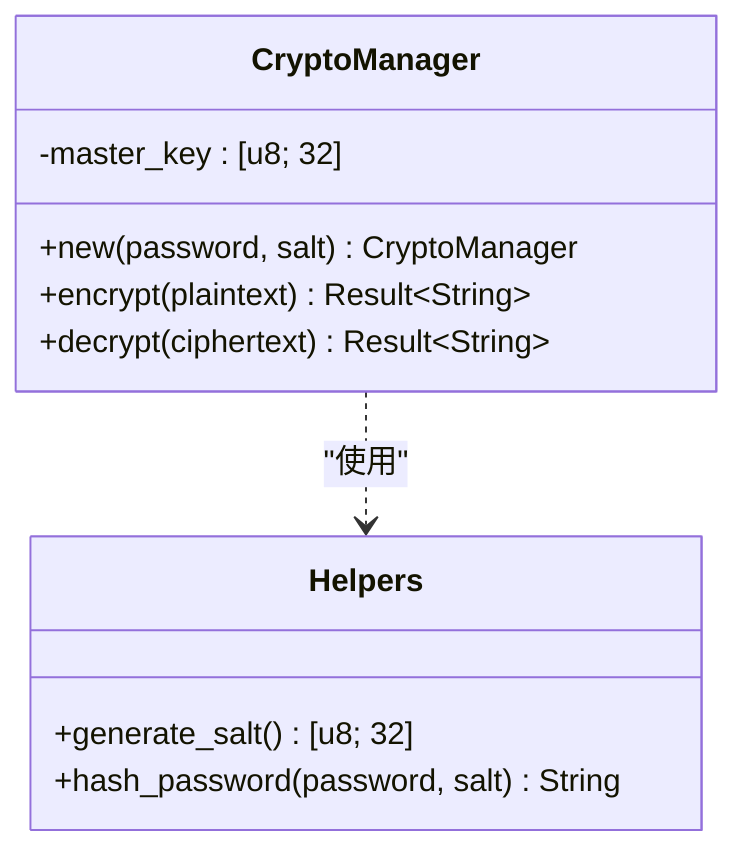
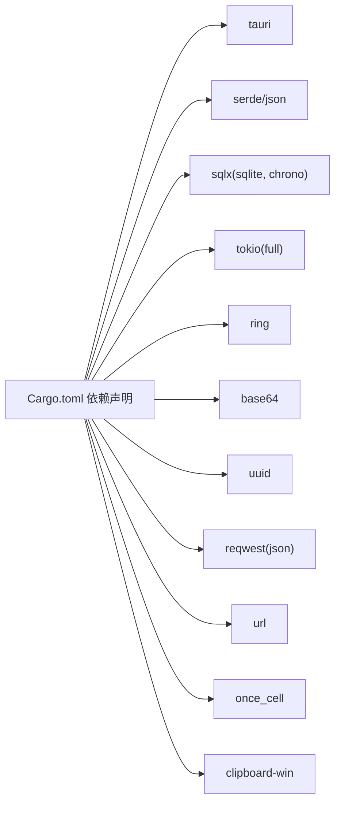
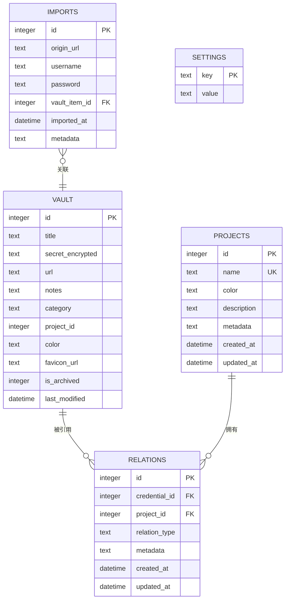

# 后端开发

<cite>
**本文引用的文件**
- [Cargo.toml](file://src-tauri/Cargo.toml)
- [tauri.conf.json](file://src-tauri/tauri.conf.json)
- [main.rs](file://src-tauri/src/main.rs)
- [lib.rs](file://src-tauri/src/lib.rs)
- [database.rs](file://src-tauri/src/database.rs)
- [crypto.rs](file://src-tauri/src/crypto.rs)
- [commands.rs](file://src-tauri/src/commands.rs)
- [migrate.rs](file://src-tauri/src/bin/migrate.rs)
- [001_create_projects_table.sql](file://src-tauri/migrations/001_create_projects_table.sql)
- [002_create_relations_table.sql](file://src-tauri/migrations/002_create_relations_table.sql)
- [003_create_imports_table.sql](file://src-tauri/migrations/003_create_imports_table.sql)
- [004_create_api_keys_table.sql](file://src-tauri/migrations/004_create_api_keys_table.sql)
- [005_migrate_vault_relations.sql](file://src-tauri/migrations/005_migrate_vault_relations.sql)
</cite>

## 目录
1. [简介](#简介)
2. [项目结构](#项目结构)
3. [核心组件](#核心组件)
4. [架构总览](#架构总览)
5. [详细组件分析](#详细组件分析)
6. [依赖关系分析](#依赖关系分析)
7. [性能考虑](#性能考虑)
8. [故障排查指南](#故障排查指南)
9. [结论](#结论)
10. [附录](#附录)

## 简介
本技术文档面向AIpassword后端开发，聚焦于Tauri应用壳配置、Rust后端服务架构与数据库操作实现，系统性解析以下主题：
- Tauri应用壳：窗口配置、开发与构建流程、权限白名单与协议设置
- Rust后端服务：命令系统、异步运行时、全局数据库连接池
- 数据库模块：SQLite连接、SQLx查询、迁移管理与索引设计
- 加密模块：主密码哈希、对称加密、随机盐生成与安全参数
- 前后端通信：Tauri命令调用、错误传播与平台特定功能
- 性能与并发：Tokio全栈异步、OnceCell单例池、SQLx连接池
- 开发与部署：迁移工具、依赖管理、版本兼容与安全更新建议

## 项目结构
后端位于src-tauri目录，采用Tauri 1.5 + Rust生态，前端位于根目录的dist目录并通过devPath指向本地Vite开发服务器。

图表来源
- [tauri.conf.json](file://src-tauri/tauri.conf.json#L1-L33)
- [main.rs](file://src-tauri/src/main.rs#L1-L51)
- [lib.rs](file://src-tauri/src/lib.rs#L1-L4)
- [database.rs](file://src-tauri/src/database.rs#L1-L104)
- [crypto.rs](file://src-tauri/src/crypto.rs#L1-L92)
- [commands.rs](file://src-tauri/src/commands.rs#L1-L487)
- [migrate.rs](file://src-tauri/src/bin/migrate.rs#L1-L39)

章节来源
- [tauri.conf.json](file://src-tauri/tauri.conf.json#L1-L33)
- [Cargo.toml](file://src-tauri/Cargo.toml#L1-L34)
- [main.rs](file://src-tauri/src/main.rs#L1-L51)
- [lib.rs](file://src-tauri/src/lib.rs#L1-L4)

## 核心组件
- 应用入口与命令注册：在入口中注册所有Tauri命令，并在启动阶段初始化数据库连接池
- 数据库模块：负责SQLite连接、迁移、默认项目初始化与全局连接池
- 加密模块：基于ring的AES-256-GCM对称加密、PBKDF2-HMAC-SHA256主密码派生与哈希
- 命令实现：围绕凭证、项目、关系与设置等业务域提供增删改查与辅助能力
- 迁移工具：独立可执行程序，用于在CI或本地验证迁移与计数

章节来源
- [main.rs](file://src-tauri/src/main.rs#L21-L50)
- [database.rs](file://src-tauri/src/database.rs#L13-L52)
- [crypto.rs](file://src-tauri/src/crypto.rs#L7-L92)
- [commands.rs](file://src-tauri/src/commands.rs#L40-L309)
- [migrate.rs](file://src-tauri/src/bin/migrate.rs#L27-L38)

## 架构总览
下图展示从Tauri前端到Rust后端再到数据库的完整调用链与数据流。

图表来源
- [main.rs](file://src-tauri/src/main.rs#L22-L39)
- [commands.rs](file://src-tauri/src/commands.rs#L40-L64)
- [database.rs](file://src-tauri/src/database.rs#L99-L104)

## 详细组件分析

### Tauri应用壳与配置
- 开发与构建：devPath指向本地Vite开发服务器，distDir指向打包产物；构建前/后命令分别由npm脚本驱动
- 权限控制：显式关闭全局allowlist，仅按需开放功能（如剪贴板）
- 打包与窗口：当前禁用打包，窗口尺寸与标题在配置中定义
- 协议特性：启用自定义协议特性位，便于生产构建或本地文件系统场景

章节来源
- [tauri.conf.json](file://src-tauri/tauri.conf.json#L2-L32)
- [Cargo.toml](file://src-tauri/Cargo.toml#L30-L33)

### Rust后端服务与命令系统
- 异步运行时：Tokio全栈异步，命令函数均为async，使用block_on在setup阶段初始化数据库
- 命令注册：集中注册所有命令，包括凭证、项目、关系、搜索、剪贴板与主密码相关操作
- 错误处理：命令返回Result<T, String>，统一将错误转换为字符串传递给前端
- 平台特定：剪贴板仅在Windows平台启用，其他平台返回成功但无动作

章节来源
- [main.rs](file://src-tauri/src/main.rs#L21-L50)
- [commands.rs](file://src-tauri/src/commands.rs#L213-L228)

### 数据库模块与迁移管理
- 连接与池化：使用SqliteConnectOptions与SqlitePool，创建失败自动创建数据库文件
- 初始化流程：确保settings基础表存在，应用V2迁移，若无项目则插入默认项目
- 迁移机制：维护_migrations跟踪表，按顺序应用脚本，支持多语句拆分与幂等
- 全局池：OnceCell存储连接池，提供get_db_pool()供各命令使用
- 迁移工具：独立程序先初始化数据库，再打印三类表的计数进行验证

图表来源
- [database.rs](file://src-tauri/src/database.rs#L13-L52)
- [database.rs](file://src-tauri/src/database.rs#L54-L97)
- [migrate.rs](file://src-tauri/src/bin/migrate.rs#L27-L38)

章节来源
- [database.rs](file://src-tauri/src/database.rs#L1-L104)
- [migrate.rs](file://src-tauri/src/bin/migrate.rs#L1-L39)

### 表结构设计与索引
- projects：项目元数据，含唯一约束与索引；默认颜色与时间戳字段
- credential_project_relations：凭证-项目关系，外键级联删除；对credential_id与project_id建立索引
- chrome_imported_passwords：Chrome导入记录，含origin_url与vault_item_id外键；对vault_item_id与origin_url建立索引
- api_keys_registry：API密钥注册表，按名称建立索引
- 迁移脚本005：一次性迁移，为现有vault条目创建默认项目的关联关系，避免重复插入

章节来源
- [001_create_projects_table.sql](file://src-tauri/migrations/001_create_projects_table.sql#L1-L13)
- [002_create_relations_table.sql](file://src-tauri/migrations/002_create_relations_table.sql#L1-L16)
- [003_create_imports_table.sql](file://src-tauri/migrations/003_create_imports_table.sql#L1-L15)
- [004_create_api_keys_table.sql](file://src-tauri/migrations/004_create_api_keys_table.sql#L1-L13)
- [005_migrate_vault_relations.sql](file://src-tauri/migrations/005_migrate_vault_relations.sql#L1-L18)

### 加密模块与安全机制
- 主密码派生：PBKDF2-HMAC-SHA256，迭代次数100000，生成32字节主密钥
- 对称加密：AES-256-GCM，随机12字节盐作为nonce，加密结果包含盐+密文并Base64编码
- 密码验证：从settings读取盐与哈希，重新计算输入密码哈希进行比对
- 随机性：使用ring::rand的SystemRandom保证密码学安全随机
- 安全要点：盐与nonce组合，避免重放；Base64编码便于持久化；哈希用于登录校验

图表来源
- [crypto.rs](file://src-tauri/src/crypto.rs#L7-L92)

章节来源
- [crypto.rs](file://src-tauri/src/crypto.rs#L1-L92)
- [commands.rs](file://src-tauri/src/commands.rs#L248-L309)

### 命令实现与数据访问
- 凭证管理：create/get/update/delete，返回last_insert_rowid或空结果
- 项目管理：create/get，按名称排序
- 关系管理：创建/删除/查询凭证-项目关系，支持按凭证查询与统计
- 搜索：模糊匹配title/notes/url，按最后修改时间倒序
- 辅助：复制到剪贴板（Windows）、抓取Favicon、主密码设置/校验/存在性判断
- 查询模式：统一通过get_db_pool()获取池，使用bind绑定参数，避免SQL注入

章节来源
- [commands.rs](file://src-tauri/src/commands.rs#L40-L487)

## 依赖关系分析
- 运行时与并发：Tokio提供全栈异步运行时，支持任务调度与I/O
- 数据库：SQLx提供类型安全的SQL执行与连接池，支持SQLite与chrono
- 加密：ring提供密码学原语，base64用于编码
- 平台：clipboard-win用于Windows剪贴板，once_cell提供线程安全单例
- Web：reqwest用于HTTP请求，url解析域名，uuid生成标识

图表来源
- [Cargo.toml](file://src-tauri/Cargo.toml#L15-L28)

章节来源
- [Cargo.toml](file://src-tauri/Cargo.toml#L1-L34)

## 性能考虑
- 异步与并发：全栈Tokio异步，命令函数均为async，减少阻塞；使用SQLx连接池复用连接
- 连接池：OnceCell单例存储SqlitePool，避免重复初始化；SQLx自动连接池管理
- 查询优化：迁移脚本为高频查询字段建立索引（如projects.name、relations(credential_id,project_id)、imports(vault_item_id,origin_url)）
- I/O与序列化：Base64编码与PBKDF2参数权衡安全性与性能；建议在高负载场景评估迭代次数
- 资源限制：Windows剪贴板写入为平台特定，避免跨平台阻塞

章节来源
- [database.rs](file://src-tauri/src/database.rs#L5-L51)
- [commands.rs](file://src-tauri/src/commands.rs#L213-L228)
- [001_create_projects_table.sql](file://src-tauri/migrations/001_create_projects_table.sql#L12-L12)
- [002_create_relations_table.sql](file://src-tauri/migrations/002_create_relations_table.sql#L14-L15)
- [003_create_imports_table.sql](file://src-tauri/migrations/003_create_imports_table.sql#L13-L14)

## 故障排查指南
- 数据库初始化失败：检查数据库URL、文件权限与磁盘空间；确认_migrations表是否可写
- 迁移未生效：确认迁移脚本是否被正确包含与执行；查看_migrations记录
- 命令返回错误：前端收到字符串错误，检查命令内部的map_err转换；关注参数绑定与表结构一致性
- 剪贴板无效：仅Windows平台可用；非Windows平台会输出提示但不报错
- 主密码校验失败：确认settings表中salt与hash存在且Base64编码有效；核对PBKDF2参数一致

章节来源
- [database.rs](file://src-tauri/src/database.rs#L13-L52)
- [commands.rs](file://src-tauri/src/commands.rs#L213-L309)
- [migrate.rs](file://src-tauri/src/bin/migrate.rs#L27-L38)

## 结论
本后端以Tauri为壳、Rust为核心，结合SQLx与ring实现高性能、安全的本地密码管理服务。通过幂等迁移、连接池与异步命令模型，满足日常使用与扩展需求。建议在生产环境进一步完善日志、监控与安全审计，并持续关注依赖版本与安全更新。

## 附录

### 命令与数据模型概览

图表来源
- [commands.rs](file://src-tauri/src/commands.rs#L9-L38)
- [001_create_projects_table.sql](file://src-tauri/migrations/001_create_projects_table.sql#L1-L13)
- [002_create_relations_table.sql](file://src-tauri/migrations/002_create_relations_table.sql#L1-L16)
- [003_create_imports_table.sql](file://src-tauri/migrations/003_create_imports_table.sql#L1-L15)