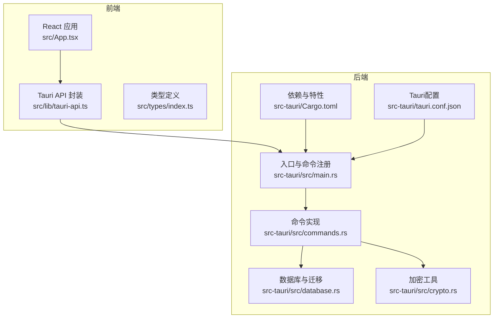
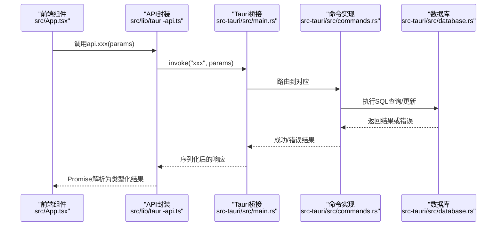
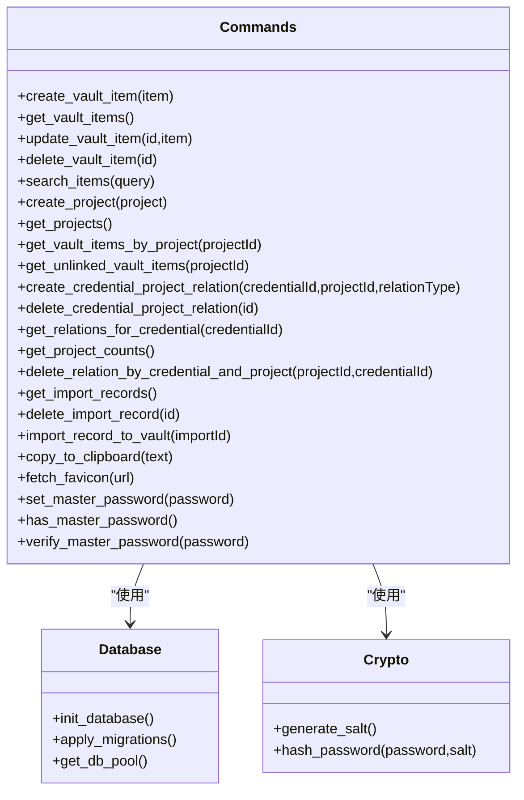
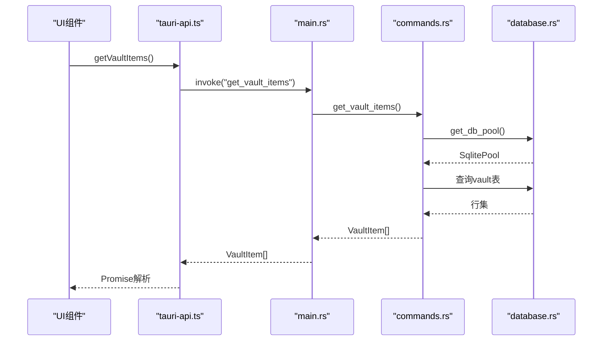
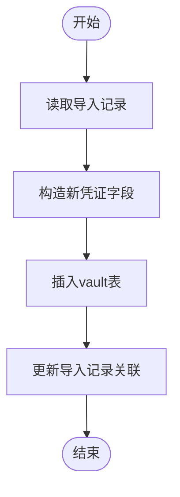
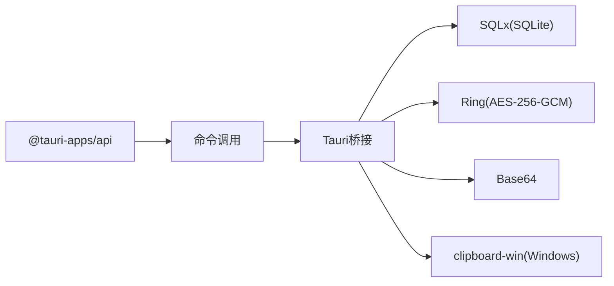

# 命令系统与通信

<cite>
**本文引用的文件**
- [src-tauri/src/main.rs](file://src-tauri/src/main.rs)
- [src-tauri/src/lib.rs](file://src-tauri/src/lib.rs)
- [src-tauri/src/commands.rs](file://src-tauri/src/commands.rs)
- [src-tauri/src/database.rs](file://src-tauri/src/database.rs)
- [src-tauri/src/crypto.rs](file://src-tauri/src/crypto.rs)
- [src-tauri/Cargo.toml](file://src-tauri/Cargo.toml)
- [src-tauri/tauri.conf.json](file://src-tauri/tauri.conf.json)
- [src/lib/tauri-api.ts](file://src/lib/tauri-api.ts)
- [src/types/index.ts](file://src/types/index.ts)
- [src/App.tsx](file://src/App.tsx)
- [src/components/PasswordScreen.tsx](file://src/components/PasswordScreen.tsx)
</cite>

## 目录
1. [简介](#简介)
2. [项目结构](#项目结构)
3. [核心组件](#核心组件)
4. [架构总览](#架构总览)
5. [详细组件分析](#详细组件分析)
6. [依赖关系分析](#依赖关系分析)
7. [性能考量](#性能考量)
8. [故障排除指南](#故障排除指南)
9. [结论](#结论)
10. [附录](#附录)

## 简介
本文件面向AIpassword应用的命令系统与前后端通信，系统基于Tauri构建，前端使用React+TypeScript，后端使用Rust。文档围绕以下目标展开：
- 深入解释Tauri命令系统的实现原理、命令注册机制与参数传递格式
- 逐项解析各命令的定义、输入输出规范与错误处理策略
- 说明前后端通信协议、消息序列化与异步处理机制
- 解释命令权限控制、参数验证与安全检查流程
- 提供命令扩展方法、自定义命令开发与性能监控建议
- 给出命令调试技巧、日志记录与故障排除方法

## 项目结构
本项目采用“前端React + 后端Tauri(Rust)”分层架构。前端通过@tauri-apps/api提供的invoke接口调用后端命令；后端在main.rs中集中注册命令，并在commands.rs中实现具体逻辑；数据库通过SQLx连接SQLite，迁移脚本位于src-tauri/migrations目录；加密模块使用ring与base64进行PBKDF2与AEAD加解密。

图表来源
- [src-tauri/src/main.rs](file://src-tauri/src/main.rs#L24-L58)
- [src-tauri/src/commands.rs](file://src-tauri/src/commands.rs#L1-L572)
- [src-tauri/src/database.rs](file://src-tauri/src/database.rs#L1-L104)
- [src-tauri/src/crypto.rs](file://src-tauri/src/crypto.rs#L1-L92)
- [src-tauri/Cargo.toml](file://src-tauri/Cargo.toml#L15-L28)
- [src-tauri/tauri.conf.json](file://src-tauri/tauri.conf.json#L1-L33)
- [src/lib/tauri-api.ts](file://src/lib/tauri-api.ts#L1-L97)
- [src/types/index.ts](file://src/types/index.ts#L1-L46)
- [src/App.tsx](file://src/App.tsx#L1-L29)

章节来源
- [src-tauri/src/main.rs](file://src-tauri/src/main.rs#L1-L58)
- [src-tauri/src/lib.rs](file://src-tauri/src/lib.rs#L1-L4)
- [src-tauri/src/commands.rs](file://src-tauri/src/commands.rs#L1-L572)
- [src-tauri/src/database.rs](file://src-tauri/src/database.rs#L1-L104)
- [src-tauri/src/crypto.rs](file://src-tauri/src/crypto.rs#L1-L92)
- [src-tauri/Cargo.toml](file://src-tauri/Cargo.toml#L1-L34)
- [src-tauri/tauri.conf.json](file://src-tauri/tauri.conf.json#L1-L33)
- [src/lib/tauri-api.ts](file://src/lib/tauri-api.ts#L1-L97)
- [src/types/index.ts](file://src/types/index.ts#L1-L46)
- [src/App.tsx](file://src/App.tsx#L1-L29)

## 核心组件
- 前端API封装：统一暴露命令调用函数，负责参数序列化与返回值类型转换，便于上层组件直接使用。
- 后端命令注册：在main.rs中集中注册所有命令，形成命令白名单，确保仅允许已声明的命令被调用。
- 数据库层：通过SQLx连接SQLite，支持迁移与连接池，提供全局连接池访问。
- 加密模块：提供PBKDF2派生与AES-256-GCM加解密能力，用于主密码存储与数据保护。
- 类型系统：前后端共享类型定义，保证命令参数与返回值结构一致。

章节来源
- [src/lib/tauri-api.ts](file://src/lib/tauri-api.ts#L1-L97)
- [src-tauri/src/main.rs](file://src-tauri/src/main.rs#L24-L58)
- [src-tauri/src/database.rs](file://src-tauri/src/database.rs#L1-L104)
- [src-tauri/src/crypto.rs](file://src-tauri/src/crypto.rs#L1-L92)
- [src/types/index.ts](file://src/types/index.ts#L1-L46)

## 架构总览
下图展示了从前端到后端的典型命令调用链路：前端通过invoke触发命令，后端根据命令名路由到对应实现，执行数据库或加密等操作，最终返回结果或错误信息。

图表来源
- [src/App.tsx](file://src/App.tsx#L1-L29)
- [src/lib/tauri-api.ts](file://src/lib/tauri-api.ts#L1-L97)
- [src-tauri/src/main.rs](file://src-tauri/src/main.rs#L24-L58)
- [src-tauri/src/commands.rs](file://src-tauri/src/commands.rs#L1-L572)
- [src-tauri/src/database.rs](file://src-tauri/src/database.rs#L1-L104)

## 详细组件分析

### 命令注册与路由机制
- 注册方式：在main.rs中使用generate_handler!宏集中注册所有命令，形成白名单，避免任意Rust函数被外部调用。
- 路由规则：前端invoke时传入字符串命令名，后端按名称匹配到对应#[command]函数。
- 异步模型：所有命令均声明为async，内部可并发执行数据库查询与加密计算。

章节来源
- [src-tauri/src/main.rs](file://src-tauri/src/main.rs#L24-L58)

### 命令分类与职责边界
- 凭证管理类：创建/读取/更新/删除凭证条目；搜索；按项目筛选；未关联条目查询；关系建立与删除。
- 项目管理类：创建/读取项目；统计每个项目的凭证数量。
- 导入管理类：读取Chrome导入记录；删除导入记录；将导入记录写入凭证库。
- 工具类：复制文本到剪贴板（Windows平台）；抓取网站favicon。
- 主密码类：设置主密码（含盐与哈希存储）；检测是否已设置；校验主密码。

章节来源
- [src-tauri/src/commands.rs](file://src-tauri/src/commands.rs#L40-L572)
- [src-tauri/src/main.rs](file://src-tauri/src/main.rs#L9-L22)

### 命令定义与参数/返回规范
以下以部分代表性命令为例说明规范（字段命名与类型来自前后端类型定义与命令实现）：

- create_vault_item
  - 输入：VaultItem（省略id）
  - 输出：新增项的id（数字）
  - 错误：数据库异常转字符串错误
  - 复杂度：O(1)插入
- get_vault_items
  - 输入：无
  - 输出：VaultItem数组（过滤归档）
  - 错误：数据库异常转字符串错误
  - 复杂度：取决于表大小与索引
- update_vault_item
  - 输入：id（数字）、VaultItem
  - 输出：无（成功/失败）
  - 错误：数据库异常转字符串错误
- delete_vault_item
  - 输入：id（数字）
  - 输出：无
  - 错误：数据库异常转字符串错误
- search_items
  - 输入：query（字符串）
  - 输出：VaultItem数组（模糊匹配标题/备注/URL）
  - 错误：数据库异常转字符串错误
- create_project / get_projects
  - 输入/输出：Project对象数组或单个id
  - 错误：数据库异常转字符串错误
- get_vault_items_by_project
  - 输入：projectId（可空）
  - 输出：VaultItem数组（若为空则等同get_vault_items）
  - 错误：数据库异常转字符串错误
- get_unlinked_vault_items
  - 输入：projectId（数字）
  - 输出：VaultItem数组（未与项目建立关系的凭证）
  - 错误：数据库异常转字符串错误
- create_credential_project_relation / delete_credential_project_relation / get_relations_for_credential
  - 输入/输出：关系id或关系列表
  - 错误：数据库异常转字符串错误
- get_project_counts
  - 输入：无
  - 输出：带count字段的Project数组
  - 错误：数据库异常转字符串错误
- delete_relation_by_credential_and_project
  - 输入：projectId、credentialId
  - 输出：无
  - 错误：数据库异常转字符串错误
- get_import_records / delete_import_record / import_record_to_vault
  - 输入/输出：导入记录数组/单条记录id/新凭证id
  - 错误：数据库异常转字符串错误
- copy_to_clipboard
  - 输入：text（字符串）
  - 输出：无
  - 平台：当前仅Windows实现
  - 错误：平台特定错误转字符串
- fetch_favicon
  - 输入：url（字符串）
  - 输出：favicon图片URL（字符串）
  - 错误：无显式错误，空URL返回默认地址
- set_master_password / has_master_password / verify_master_password
  - 输入：password（字符串）/无/密码
  - 输出：无/布尔/布尔
  - 错误：数据库异常转字符串错误

章节来源
- [src-tauri/src/commands.rs](file://src-tauri/src/commands.rs#L40-L572)
- [src/types/index.ts](file://src/types/index.ts#L1-L46)

### 参数验证与安全检查
- 前端验证：如主密码设置界面会对长度与一致性进行校验，再调用后端命令。
- 后端约束：命令参数通过Serde自动反序列化，SQL查询使用占位符绑定，防止SQL注入。
- 权限控制：Tauri配置中allowlist关闭了全部功能，需显式开启所需能力（例如剪贴板），避免越权访问。
- 安全要点：主密码采用PBKDF2+盐存储，加密使用AES-256-GCM，随机盐与nonce确保每次加密结果不同。

章节来源
- [src-tauri/tauri.conf.json](file://src-tauri/tauri.conf.json#L13-L15)
- [src-tauri/src/commands.rs](file://src-tauri/src/commands.rs#L248-L309)
- [src-tauri/src/crypto.rs](file://src-tauri/src/crypto.rs#L82-L92)
- [src/components/PasswordScreen.tsx](file://src/components/PasswordScreen.tsx#L30-L61)

### 前后端通信协议与序列化
- 协议：前端通过@tauri-apps/api的invoke发起命令调用，后端通过#[command]宏暴露函数。
- 序列化：参数与返回值通过Serde进行JSON序列化/反序列化，类型由前后端共同约定。
- 异步：命令均为async，前端Promise等待，后端Tokio运行时并发执行。
- 事件：示例中存在事件监听（clipboard-change），但命令调用仍以invoke为主。

章节来源
- [src/lib/tauri-api.ts](file://src/lib/tauri-api.ts#L1-L97)
- [src-tauri/src/commands.rs](file://src-tauri/src/commands.rs#L1-L572)

### 数据库与迁移
- 连接与池：使用SQLx的SqlitePool，全局OnceCell缓存连接池。
- 初始化：启动时异步初始化数据库，创建settings表与迁移跟踪表，执行V2迁移脚本。
- 默认数据：若项目表为空，插入默认项目。
- 访问：命令通过get_db_pool获取连接池执行查询。

章节来源
- [src-tauri/src/database.rs](file://src-tauri/src/database.rs#L13-L52)
- [src-tauri/src/database.rs](file://src-tauri/src/database.rs#L54-L97)
- [src-tauri/src/database.rs](file://src-tauri/src/database.rs#L99-L104)

### 加密模块
- PBKDF2：使用PBKDF2-HMAC-SHA256对主密码进行多次迭代派生，生成固定长度主密钥。
- AEAD：使用AES-256-GCM进行对称加密，随机盐与nonce组合，编码为Base64。
- 存储：主密码盐与哈希分别存储于settings表，校验时先解码盐再比对哈希。

章节来源
- [src-tauri/src/crypto.rs](file://src-tauri/src/crypto.rs#L1-L92)
- [src-tauri/src/commands.rs](file://src-tauri/src/commands.rs#L248-L309)

### 命令类图（代码级）

图表来源
- [src-tauri/src/commands.rs](file://src-tauri/src/commands.rs#L40-L572)
- [src-tauri/src/database.rs](file://src-tauri/src/database.rs#L13-L104)
- [src-tauri/src/crypto.rs](file://src-tauri/src/crypto.rs#L76-L92)

### 典型命令调用序列（以get_vault_items为例）

图表来源
- [src/lib/tauri-api.ts](file://src/lib/tauri-api.ts#L11-L13)
- [src-tauri/src/main.rs](file://src-tauri/src/main.rs#L26-L46)
- [src-tauri/src/commands.rs](file://src-tauri/src/commands.rs#L67-L98)
- [src-tauri/src/database.rs](file://src-tauri/src/database.rs#L99-L104)

### 复杂逻辑流程（以import_record_to_vault为例）

图表来源
- [src-tauri/src/commands.rs](file://src-tauri/src/commands.rs#L527-L572)

## 依赖关系分析
- 前端依赖：@tauri-apps/api（invoke、event监听）、React、类型定义。
- 后端依赖：tauri（命令桥接）、sqlx（数据库）、ring/base64（加密）、tokio（运行时）、clipboard-win（剪贴板，Windows）。
- 配置：Cargo.toml声明依赖与特性；tauri.conf.json控制Tauri行为与权限。

图表来源
- [src-tauri/Cargo.toml](file://src-tauri/Cargo.toml#L15-L28)
- [src-tauri/tauri.conf.json](file://src-tauri/tauri.conf.json#L13-L15)

章节来源
- [src-tauri/Cargo.toml](file://src-tauri/Cargo.toml#L1-L34)
- [src-tauri/tauri.conf.json](file://src-tauri/tauri.conf.json#L1-L33)

## 性能考量
- 数据库连接池：使用OnceCell缓存SqlitePool，避免重复连接开销。
- 查询优化：对常用查询（如按项目筛选、模糊搜索）应考虑建立合适索引；当前实现未显式建索引，建议在生产环境评估添加。
- 并发执行：命令均为async，可并发处理多个请求；注意数据库事务与锁竞争。
- 序列化成本：Serde JSON在高频调用场景下可能成为瓶颈，可考虑二进制序列化或减少传输字段。
- 剪贴板：仅Windows实现，跨平台需补充其他平台适配。

## 故障排除指南
- 命令未生效
  - 检查main.rs中的命令注册是否包含该命令名
  - 确认前端调用的命令名与后端一致
- 数据库相关错误
  - 查看init_database初始化日志与迁移状态
  - 确认数据库文件路径与权限
- 主密码校验失败
  - 检查settings表中是否存在对应的盐与哈希
  - 确认盐的Base64编码正确且长度符合预期
- 剪贴板无效
  - 确认平台为Windows，且已启用相应特性
- 日志与调试
  - 在命令中增加日志输出（如eprintln!）
  - 前端捕获异常并打印错误信息
  - 使用浏览器开发者工具观察网络面板与Tauri日志

章节来源
- [src-tauri/src/main.rs](file://src-tauri/src/main.rs#L47-L54)
- [src-tauri/src/database.rs](file://src-tauri/src/database.rs#L13-L52)
- [src-tauri/src/commands.rs](file://src-tauri/src/commands.rs#L284-L309)
- [src-tauri/tauri.conf.json](file://src-tauri/tauri.conf.json#L13-L15)

## 结论
AIpassword的命令系统以Tauri为核心，结合Serde序列化与SQLx数据库访问，实现了清晰的前后端分离与强类型约束。通过集中注册与白名单机制，有效提升了安全性；通过异步命令与连接池，兼顾了性能与可维护性。后续可在索引优化、跨平台剪贴板支持与二进制序列化等方面进一步提升。

## 附录

### 命令扩展方法与最佳实践
- 新增命令步骤
  - 在commands.rs中定义#[command]函数，明确输入输出类型
  - 在main.rs的generate_handler!中注册命令
  - 在前端src/lib/tauri-api.ts中添加对应封装函数
  - 在src/types/index.ts中同步类型定义
- 参数验证
  - 前端先行校验（长度、格式、必填）
  - 后端二次校验（业务规则、范围、唯一性）
- 错误处理
  - 统一将底层错误转为字符串，便于跨语言传递
  - 区分业务错误与系统错误，前端友好提示
- 安全加固
  - 对敏感操作（如主密码设置/校验）增加二次确认
  - 对外暴露的命令尽量最小化权限
  - 对输入进行严格白名单与长度限制

### 自定义命令开发示例（步骤）
- 设计命令签名：确定输入参数与返回值类型
- 实现命令逻辑：在commands.rs中编写#[command]函数
- 注册命令：在main.rs中加入命令名
- 前端封装：在tauri-api.ts中添加调用函数
- 类型同步：在index.ts中完善类型定义
- 测试与调试：使用浏览器与Rust日志定位问题