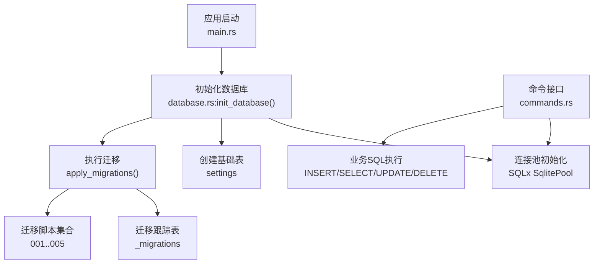
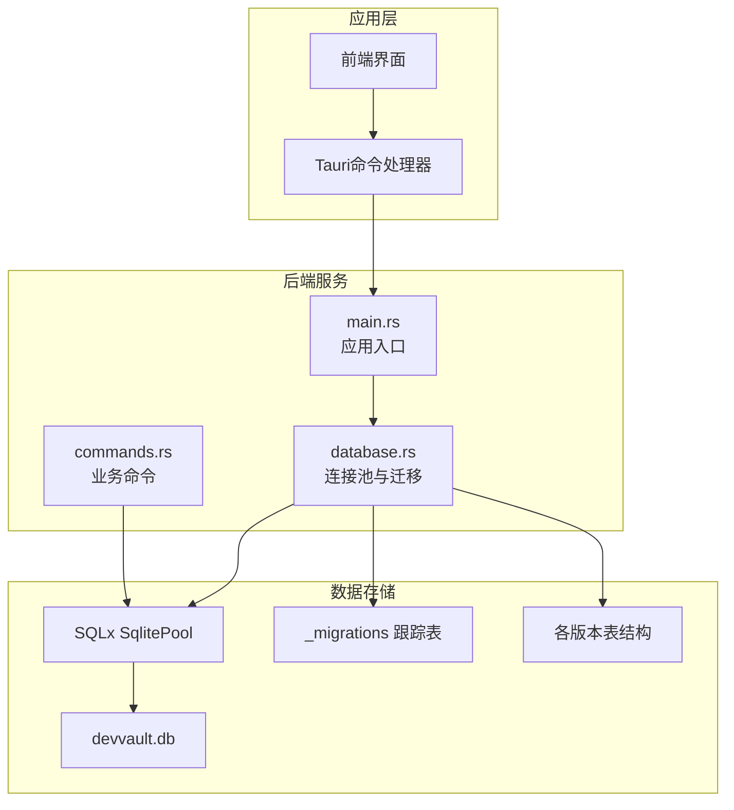
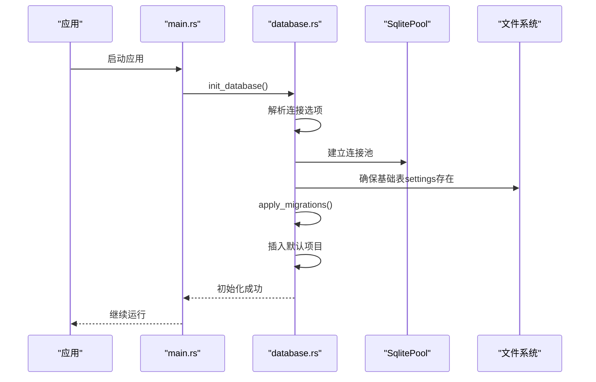
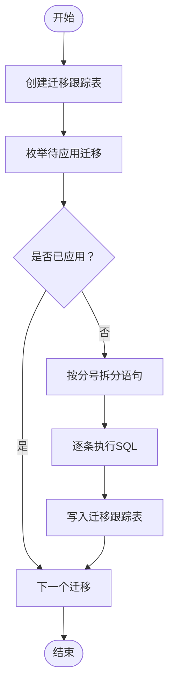
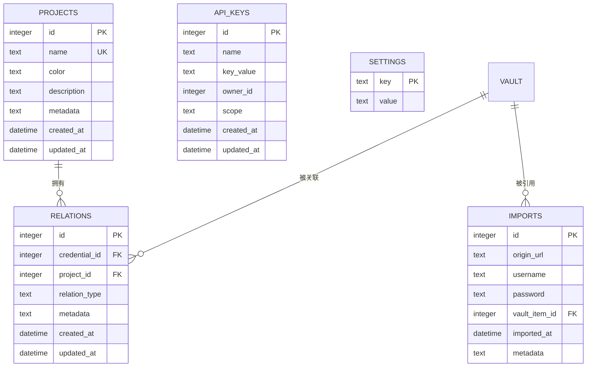
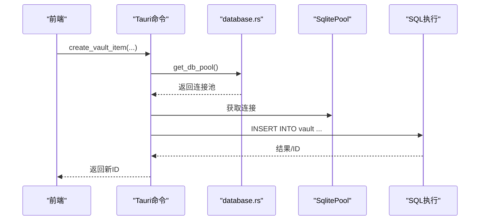
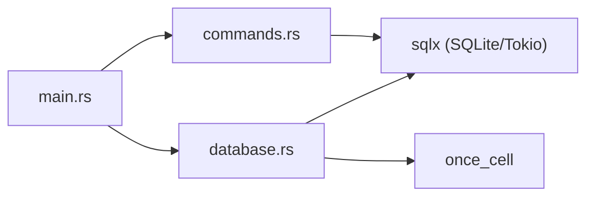

# 数据库操作模块

<cite>
**本文引用的文件**
- [src-tauri/src/database.rs](file://src-tauri/src/database.rs)
- [src-tauri/migrations/001_create_projects_table.sql](file://src-tauri/migrations/001_create_projects_table.sql)
- [src-tauri/migrations/002_create_relations_table.sql](file://src-tauri/migrations/002_create_relations_table.sql)
- [src-tauri/migrations/003_create_imports_table.sql](file://src-tauri/migrations/003_create_imports_table.sql)
- [src-tauri/migrations/004_create_api_keys_table.sql](file://src-tauri/migrations/004_create_api_keys_table.sql)
- [src-tauri/migrations/005_migrate_vault_relations.sql](file://src-tauri/migrations/005_migrate_vault_relations.sql)
- [src-tauri/src/bin/migrate.rs](file://src-tauri/src/bin/migrate.rs)
- [src-tauri/src/commands.rs](file://src-tauri/src/commands.rs)
- [src-tauri/src/main.rs](file://src-tauri/src/main.rs)
- [src-tauri/Cargo.toml](file://src-tauri/Cargo.toml)
</cite>

## 目录
1. [简介](#简介)
2. [项目结构](#项目结构)
3. [核心组件](#核心组件)
4. [架构总览](#架构总览)
5. [详细组件分析](#详细组件分析)
6. [依赖关系分析](#依赖关系分析)
7. [性能考虑](#性能考虑)
8. [故障排查指南](#故障排查指南)
9. [结论](#结论)
10. [附录](#附录)

## 简介
本文件面向AIpassword应用的数据库操作模块，系统化阐述基于SQLx的SQLite连接管理、查询执行与迁移机制；深入解析核心表结构及关系约束；说明迁移系统的版本管理与幂等策略；给出查询优化、索引设计与性能调优建议；覆盖数据完整性、并发访问控制与错误恢复；并提供SQLx最佳实践、连接池配置与生产部署要点。

## 项目结构
数据库相关代码集中在Tauri后端模块中，采用“迁移脚本 + 运行时初始化 + 命令接口”的分层组织方式：
- 初始化与迁移：在应用启动时完成数据库连接建立、基础表确保、迁移执行与默认数据注入，并通过全局单例池对外提供连接。
- 表结构与迁移：通过独立SQL脚本定义各版本表结构与索引，配合迁移跟踪表实现幂等升级。
- 命令接口：通过Tauri命令暴露数据库操作，封装增删改查与业务逻辑。

图表来源
- [src-tauri/src/main.rs](file://src-tauri/src/main.rs#L24-L51)
- [src-tauri/src/database.rs](file://src-tauri/src/database.rs#L13-L52)
- [src-tauri/src/database.rs](file://src-tauri/src/database.rs#L54-L97)

章节来源
- [src-tauri/src/main.rs](file://src-tauri/src/main.rs#L1-L54)
- [src-tauri/src/database.rs](file://src-tauri/src/database.rs#L1-L104)

## 核心组件
- 连接池与初始化
  - 通过连接选项创建SQLite连接，启用缺失即创建；随后建立全局单例连接池，供后续所有命令使用。
  - 启动时确保基础表存在（如settings），执行V2迁移，最后插入默认项目。
- 迁移系统
  - 通过内联字符串加载迁移脚本，按顺序检查迁移是否已应用；对每个迁移脚本支持多语句拆分执行；记录已应用迁移名称到跟踪表。
- 命令接口
  - 暴露Vault条目、项目、关系、导入记录、API密钥注册等CRUD与统计查询命令，统一从连接池获取连接并执行SQL。

章节来源
- [src-tauri/src/database.rs](file://src-tauri/src/database.rs#L13-L52)
- [src-tauri/src/database.rs](file://src-tauri/src/database.rs#L54-L97)
- [src-tauri/src/commands.rs](file://src-tauri/src/commands.rs#L40-L572)

## 架构总览
下图展示数据库模块在应用中的位置与交互：

图表来源
- [src-tauri/src/main.rs](file://src-tauri/src/main.rs#L24-L51)
- [src-tauri/src/database.rs](file://src-tauri/src/database.rs#L13-L52)
- [src-tauri/src/commands.rs](file://src-tauri/src/commands.rs#L40-L572)

## 详细组件分析

### 组件A：数据库连接与初始化
- 初始化流程
  - 解析数据库URL并设置缺失即创建；
  - 建立连接池；
  - 确保基础表settings存在；
  - 执行V2迁移（幂等）；
  - 若无项目则插入默认项目；
  - 将连接池放入全局单例。
- 连接池获取
  - 提供线程安全的全局池访问器，若未初始化则返回错误信息。

图表来源
- [src-tauri/src/main.rs](file://src-tauri/src/main.rs#L44-L49)
- [src-tauri/src/database.rs](file://src-tauri/src/database.rs#L13-L52)

章节来源
- [src-tauri/src/database.rs](file://src-tauri/src/database.rs#L13-L52)
- [src-tauri/src/database.rs](file://src-tauri/src/database.rs#L99-L104)

### 组件B：迁移系统与版本管理
- 迁移跟踪
  - 使用内部表记录已应用的迁移名称与时间，避免重复执行。
- 迁移脚本
  - 001至005分别负责：项目表、关系表、导入记录表、API密钥表以及一次性关系迁移。
- 幂等与多语句
  - 每个迁移脚本按分号拆分执行多个语句；仅当未应用时才执行；执行后写入跟踪表。

图表来源
- [src-tauri/src/database.rs](file://src-tauri/src/database.rs#L54-L97)
- [src-tauri/migrations/001_create_projects_table.sql](file://src-tauri/migrations/001_create_projects_table.sql#L1-L13)
- [src-tauri/migrations/002_create_relations_table.sql](file://src-tauri/migrations/002_create_relations_table.sql#L1-L16)
- [src-tauri/migrations/003_create_imports_table.sql](file://src-tauri/migrations/003_create_imports_table.sql#L1-L15)
- [src-tauri/migrations/004_create_api_keys_table.sql](file://src-tauri/migrations/004_create_api_keys_table.sql#L1-L13)
- [src-tauri/migrations/005_migrate_vault_relations.sql](file://src-tauri/migrations/005_migrate_vault_relations.sql#L1-L18)

章节来源
- [src-tauri/src/database.rs](file://src-tauri/src/database.rs#L54-L97)
- [src-tauri/src/bin/migrate.rs](file://src-tauri/src/bin/migrate.rs#L1-L39)

### 组件C：核心表结构与关系
- projects（项目）
  - 主键自增，name唯一，带颜色、描述、元数据与时间戳。
  - 索引：name列。
- credential_project_relations（凭证-项目关系）
  - 关系表，外键指向vault与projects，删除时级联；含类型、元数据与时间戳。
  - 索引：credential_id、project_id。
- chrome_imported_passwords（Chrome导入记录）
  - 记录导入的URL、用户名、密码与目标vault项ID；外键删除设为空。
  - 索引：vault_item_id、origin_url。
- api_keys_registry（API密钥注册）
  - 注册API密钥，含名称、值、所有者、范围与时间戳。
  - 索引：name。
- settings（基础表）
  - 键值对存储，用于持久化配置或状态（如主密码盐与哈希）。

图表来源
- [src-tauri/migrations/001_create_projects_table.sql](file://src-tauri/migrations/001_create_projects_table.sql#L1-L13)
- [src-tauri/migrations/002_create_relations_table.sql](file://src-tauri/migrations/002_create_relations_table.sql#L1-L16)
- [src-tauri/migrations/003_create_imports_table.sql](file://src-tauri/migrations/003_create_imports_table.sql#L1-L15)
- [src-tauri/migrations/004_create_api_keys_table.sql](file://src-tauri/migrations/004_create_api_keys_table.sql#L1-L13)

章节来源
- [src-tauri/migrations/001_create_projects_table.sql](file://src-tauri/migrations/001_create_projects_table.sql#L1-L13)
- [src-tauri/migrations/002_create_relations_table.sql](file://src-tauri/migrations/002_create_relations_table.sql#L1-L16)
- [src-tauri/migrations/003_create_imports_table.sql](file://src-tauri/migrations/003_create_imports_table.sql#L1-L15)
- [src-tauri/migrations/004_create_api_keys_table.sql](file://src-tauri/migrations/004_create_api_keys_table.sql#L1-L13)
- [src-tauri/migrations/005_migrate_vault_relations.sql](file://src-tauri/migrations/005_migrate_vault_relations.sql#L1-L18)

### 组件D：命令接口与查询执行
- Vault条目管理
  - 创建、读取、更新、归档删除（软删除标记）。
- 项目管理
  - 创建、读取、按名称排序。
- 关系管理
  - 创建、删除、按凭证查询关系列表、按项目统计数量、查询未链接条目、按凭证+项目删除关系。
- 导入记录管理
  - 查询导入记录、删除记录、将导入记录转换为Vault条目并回填引用。
- 设置与认证
  - 设置主密码（盐与哈希）、校验主密码、判断是否存在主密码。
- 其他工具
  - 搜索条目（标题/备注/URL模糊匹配）、抓取Favicon、复制到剪贴板（平台特定）。

图表来源
- [src-tauri/src/commands.rs](file://src-tauri/src/commands.rs#L40-L64)
- [src-tauri/src/database.rs](file://src-tauri/src/database.rs#L99-L104)

章节来源
- [src-tauri/src/commands.rs](file://src-tauri/src/commands.rs#L40-L572)

### 组件E：数据完整性与并发控制
- 外键约束
  - 关系表对vault与projects的外键约束，确保引用完整性；删除策略按脚本设定（级联/设空）。
- 唯一约束
  - 项目name唯一，防止重名冲突。
- 幂等迁移
  - 迁移跟踪表与“已应用检查”避免重复执行，保障升级一致性。
- 并发访问
  - 使用SQLx连接池进行并发请求处理；具体锁粒度由SQLite WAL模式与连接池大小共同决定。
- 错误恢复
  - 初始化失败会打印错误并阻止应用继续；命令执行返回Result，上层可捕获并提示用户。

章节来源
- [src-tauri/migrations/002_create_relations_table.sql](file://src-tauri/migrations/002_create_relations_table.sql#L10-L11)
- [src-tauri/migrations/001_create_projects_table.sql](file://src-tauri/migrations/001_create_projects_table.sql#L4)
- [src-tauri/src/database.rs](file://src-tauri/src/database.rs#L54-L97)
- [src-tauri/src/main.rs](file://src-tauri/src/main.rs#L46-L48)

## 依赖关系分析
- 外部依赖
  - SQLx 0.7（SQLite、Tokio运行时、chrono特性）；Tokio全功能运行时；once_cell用于全局单例。
- 内部模块
  - main.rs注册命令并负责初始化数据库；database.rs负责连接池与迁移；commands.rs提供业务命令。

图表来源
- [src-tauri/src/main.rs](file://src-tauri/src/main.rs#L8-L22)
- [src-tauri/Cargo.toml](file://src-tauri/Cargo.toml#L19-L28)

章节来源
- [src-tauri/Cargo.toml](file://src-tauri/Cargo.toml#L15-L29)
- [src-tauri/src/main.rs](file://src-tauri/src/main.rs#L1-L54)

## 性能考虑
- 连接池配置
  - 默认连接池大小与超时参数需结合并发场景调整；建议在生产环境评估最大并发请求数与平均响应时间，动态调优最大连接数与空闲连接数。
- 查询优化
  - 已有索引覆盖常用过滤列（项目名、关系凭证/项目、导入来源、API密钥名）。对于高频搜索（如按标题/备注/URL模糊匹配），可考虑全文检索扩展或添加虚拟列+函数索引（需评估成本）。
- I/O与WAL
  - SQLite默认模式下并发写入可能成为瓶颈；建议启用WAL模式并在高并发场景下限制同时写入事务数量。
- 批量与事务
  - 大批量导入/迁移建议使用事务包裹，减少日志写入次数；当前迁移脚本已按语句拆分执行，可在业务侧合并为事务以提升吞吐。
- 缓存与去重
  - 对于频繁读取的静态配置（如settings），可考虑内存缓存；但需注意多实例/多进程下的缓存一致性。

## 故障排查指南
- 初始化失败
  - 现象：应用启动时报数据库初始化错误。
  - 排查：确认数据库文件路径可写、磁盘空间充足；检查迁移脚本语法与外键引用；查看标准错误输出。
- 迁移未生效
  - 现象：升级后表结构未更新。
  - 排查：确认迁移跟踪表存在且未被意外清空；检查迁移脚本是否被正确包含；验证“已应用检查”逻辑。
- 查询异常
  - 现象：命令返回错误或结果为空。
  - 排查：核对SQL绑定参数顺序与类型；确认外键引用存在；检查索引是否命中；必要时开启SQLx日志定位慢查询。
- 并发写入冲突
  - 现象：写入报错或死锁。
  - 排查：降低并发或引入重试退避；拆分热点写入；评估WAL与连接池配置。

章节来源
- [src-tauri/src/main.rs](file://src-tauri/src/main.rs#L46-L48)
- [src-tauri/src/database.rs](file://src-tauri/src/database.rs#L54-L97)
- [src-tauri/src/bin/migrate.rs](file://src-tauri/src/bin/migrate.rs#L29-L37)

## 结论
该数据库模块以SQLx为核心，采用幂等迁移与全局连接池设计，满足本地化、轻量化的应用需求。通过明确的表结构与索引策略，配合命令层的统一接口，实现了从初始化、迁移、查询到导入转换的完整闭环。建议在生产环境中进一步完善连接池参数、监控慢查询、评估WAL与事务策略，并持续优化高频查询路径。

## 附录
- SQLx最佳实践
  - 使用命名参数绑定，避免SQL拼接；优先使用连接池而非每次新建连接；对批量操作使用事务；合理设置超时与重试。
- 连接池配置建议
  - 初始连接数：根据并发预估；最大连接数：受CPU/IO限制；空闲超时：避免资源泄露；健康检查：定期验证连接可用性。
- 生产部署要点
  - 文件权限：确保应用用户对数据库文件具备读写权限；备份策略：定期导出数据库或保留WAL归档；监控指标：连接数、查询延迟、错误率。