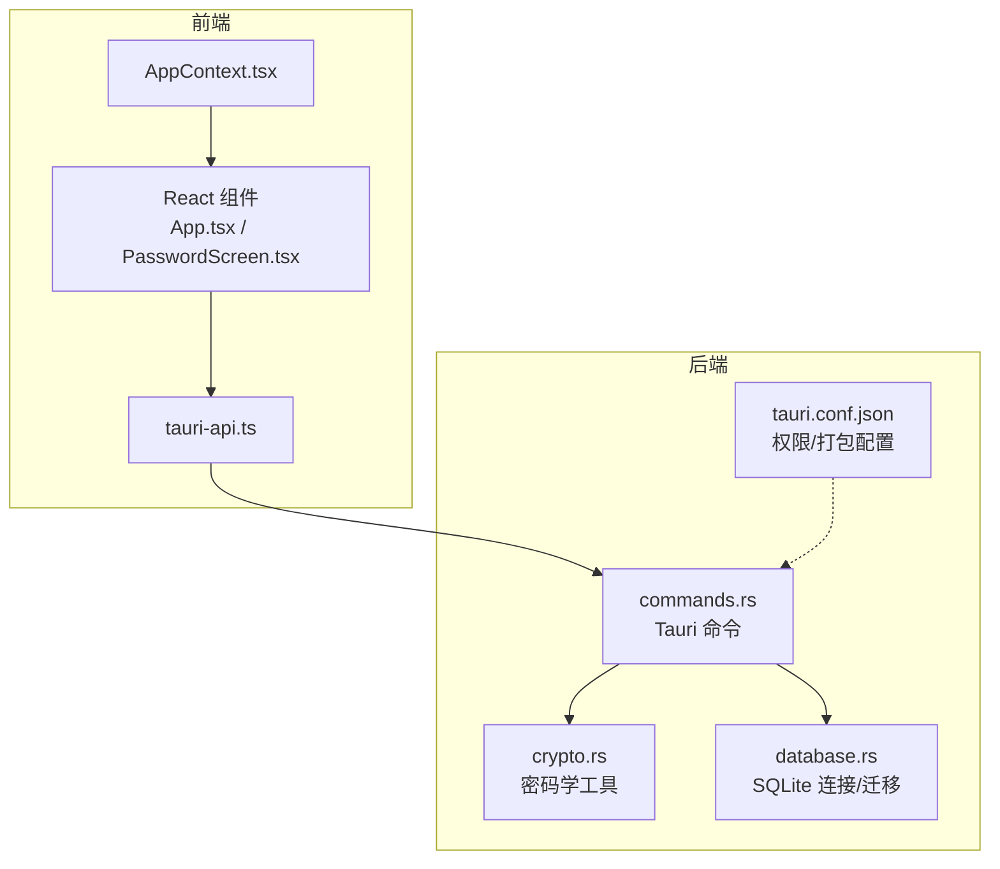
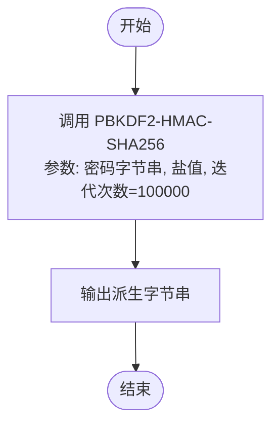
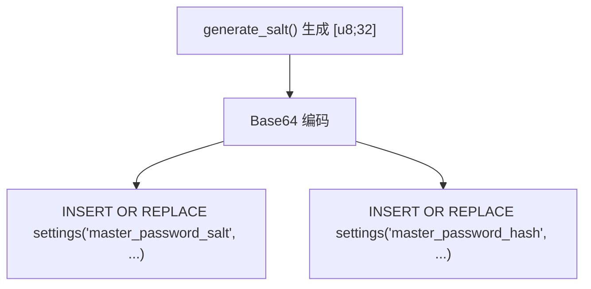
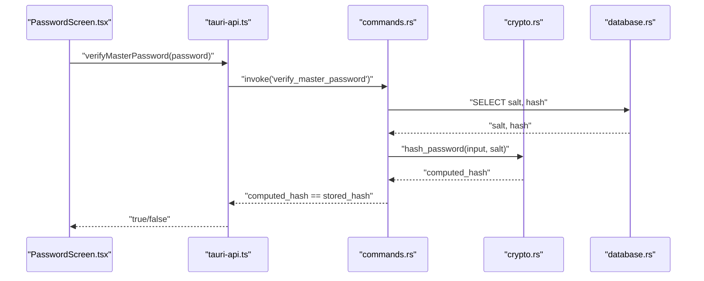
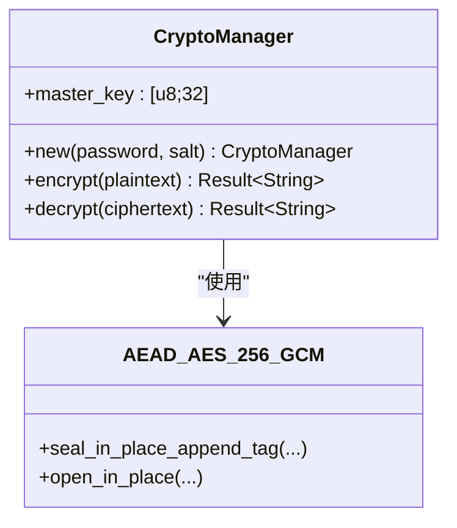
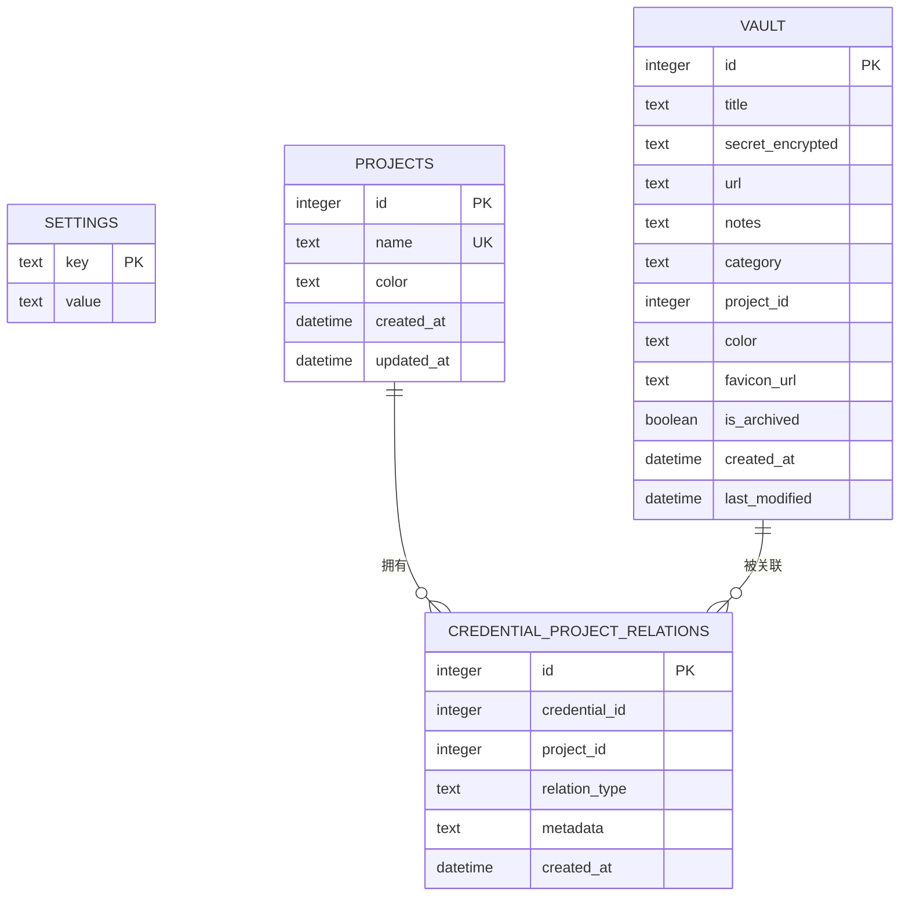
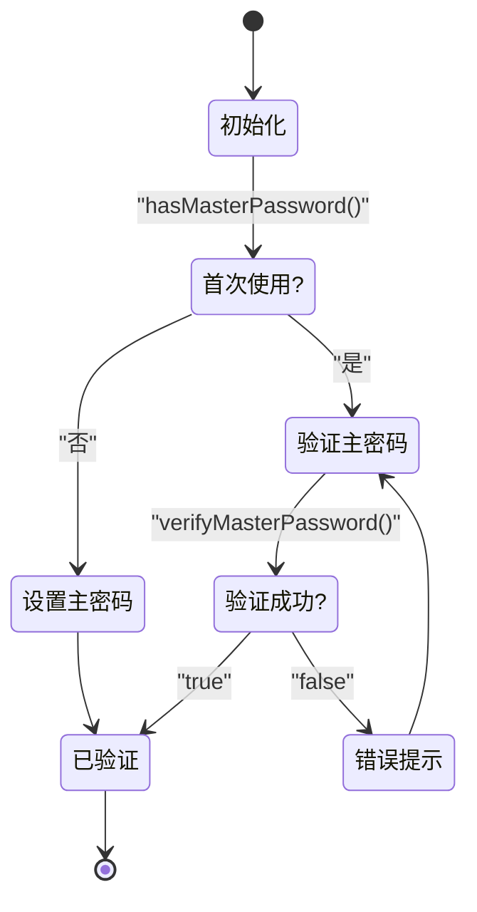
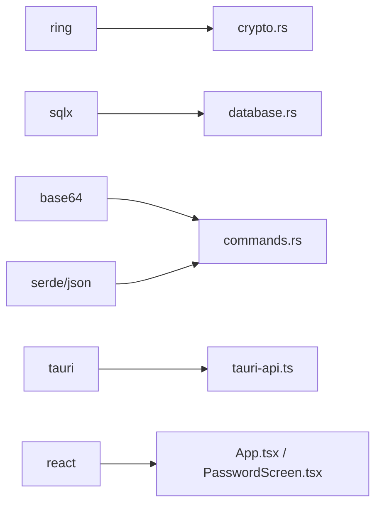

# 主密码系统

<cite>
**本文引用的文件**
- [src-tauri/src/crypto.rs](file://src-tauri/src/crypto.rs)
- [src-tauri/src/commands.rs](file://src-tauri/src/commands.rs)
- [src-tauri/src/database.rs](file://src-tauri/src/database.rs)
- [src-tauri/Cargo.toml](file://src-tauri/Cargo.toml)
- [src-tauri/tauri.conf.json](file://src-tauri/tauri.conf.json)
- [src-tauri/migrations/001_create_projects_table.sql](file://src-tauri/migrations/001_create_projects_table.sql)
- [src-tauri/migrations/005_migrate_vault_relations.sql](file://src-tauri/migrations/005_migrate_vault_relations.sql)
- [src/App.tsx](file://src/App.tsx)
- [src/components/PasswordScreen.tsx](file://src/components/PasswordScreen.tsx)
- [src/contexts/AppContext.tsx](file://src/contexts/AppContext.tsx)
- [src/lib/tauri-api.ts](file://src/lib/tauri-api.ts)
- [src/types/index.ts](file://src/types/index.ts)
</cite>

## 目录
1. [简介](#简介)
2. [项目结构](#项目结构)
3. [核心组件](#核心组件)
4. [架构总览](#架构总览)
5. [详细组件分析](#详细组件分析)
6. [依赖分析](#依赖分析)
7. [性能考虑](#性能考虑)
8. [故障排查指南](#故障排查指南)
9. [结论](#结论)
10. [附录](#附录)

## 简介
本文件为“主密码系统”的技术文档，聚焦于主密码的生成、存储与验证机制，深入解析 PBKDF2-HMAC-SHA256 的实现细节（含迭代次数、盐值生成与密码哈希），阐明主密码与加密密钥的派生关系、密码重哈希策略、验证流程、错误处理与安全存储策略，并给出密码强度要求、最佳实践与安全配置指南，最后提供主密码设置、修改与恢复的完整流程说明。

## 项目结构
该应用采用前后端分离架构：前端使用 React + Tauri API 调用后端命令；后端 Rust 模块负责数据库、密码学与业务命令。主密码相关逻辑集中在后端模块，前端通过 Tauri 命令与后端交互。



图表来源
- [src/App.tsx](file://src/App.tsx#L1-L29)
- [src/components/PasswordScreen.tsx](file://src/components/PasswordScreen.tsx#L1-L146)
- [src/contexts/AppContext.tsx](file://src/contexts/AppContext.tsx#L1-L162)
- [src/lib/tauri-api.ts](file://src/lib/tauri-api.ts#L1-L97)
- [src-tauri/src/commands.rs](file://src-tauri/src/commands.rs#L1-L572)
- [src-tauri/src/crypto.rs](file://src-tauri/src/crypto.rs#L1-L92)
- [src-tauri/src/database.rs](file://src-tauri/src/database.rs#L1-L104)
- [src-tauri/tauri.conf.json](file://src-tauri/tauri.conf.json#L1-L33)

章节来源
- [src/App.tsx](file://src/App.tsx#L1-L29)
- [src/components/PasswordScreen.tsx](file://src/components/PasswordScreen.tsx#L1-L146)
- [src/contexts/AppContext.tsx](file://src/contexts/AppContext.tsx#L1-L162)
- [src/lib/tauri-api.ts](file://src/lib/tauri-api.ts#L1-L97)
- [src-tauri/src/commands.rs](file://src-tauri/src/commands.rs#L1-L572)
- [src-tauri/src/crypto.rs](file://src-tauri/src/crypto.rs#L1-L92)
- [src-tauri/src/database.rs](file://src-tauri/src/database.rs#L1-L104)
- [src-tauri/tauri.conf.json](file://src-tauri/tauri.conf.json#L1-L33)

## 核心组件
- 密码学模块（PBKDF2-HMAC-SHA256、盐值生成、AEAD 加解密）
- Tauri 命令层（主密码设置、验证、存在性检查）
- 数据库层（settings 表存储盐值与哈希，SQLite 连接与迁移）
- 前端交互层（主密码设置/验证 UI、状态管理）

章节来源
- [src-tauri/src/crypto.rs](file://src-tauri/src/crypto.rs#L1-L92)
- [src-tauri/src/commands.rs](file://src-tauri/src/commands.rs#L248-L309)
- [src-tauri/src/database.rs](file://src-tauri/src/database.rs#L13-L52)
- [src/components/PasswordScreen.tsx](file://src/components/PasswordScreen.tsx#L1-L146)
- [src/contexts/AppContext.tsx](file://src/contexts/AppContext.tsx#L1-L162)

## 架构总览
主密码系统围绕“设置/验证主密码”这一核心流程展开，前端负责引导用户输入与展示结果，后端负责安全地生成与校验密码哈希，并持久化盐值与哈希到 SQLite 的 settings 表。同时，系统提供 AEAD 加解密能力以保护敏感数据字段。

```mermaid
sequenceDiagram
participant FE as "前端 UI<br/>PasswordScreen.tsx"
participant API as "Tauri API<br/>tauri-api.ts"
participant CMD as "命令层<br/>commands.rs"
participant CRY as "密码学<br/>crypto.rs"
participant DB as "数据库<br/>database.rs"
FE->>API : "调用 setMasterPassword()/verifyMasterPassword()"
API->>CMD : "invoke('set_master_password'|'verify_master_password')"
alt 设置主密码
CMD->>CRY : "generate_salt()"
CRY-->>CMD : "[u8;32] 盐值"
CMD->>CRY : "hash_password(password, salt)"
CRY-->>CMD : "Base64 编码的哈希"
CMD->>DB : "INSERT OR REPLACE settings(key,value)"
DB-->>CMD : "OK"
CMD-->>API : "成功"
API-->>FE : "成功"
else 验证主密码
CMD->>DB : "SELECT salt/hash from settings"
DB-->>CMD : "salt, hash"
CMD->>CRY : "hash_password(input, salt)"
CRY-->>CMD : "计算得到的哈希"
CMD-->>API : "比较结果布尔值"
API-->>FE : "true/false"
end
```

图表来源
- [src/components/PasswordScreen.tsx](file://src/components/PasswordScreen.tsx#L30-L61)
- [src/lib/tauri-api.ts](file://src/lib/tauri-api.ts#L78-L89)
- [src-tauri/src/commands.rs](file://src-tauri/src/commands.rs#L248-L309)
- [src-tauri/src/crypto.rs](file://src-tauri/src/crypto.rs#L76-L92)
- [src-tauri/src/database.rs](file://src-tauri/src/database.rs#L13-L52)

## 详细组件分析

### PBKDF2-HMAC-SHA256 实现与参数
- 算法：PBKDF2-HMAC-SHA256
- 迭代次数：100,000（非零正整数）
- 输入：password 字节串
- 输出：固定长度字节串（用于哈希或作为派生密钥）
- 安全要点：高迭代次数显著提升暴力破解成本；盐值必须随机且唯一



图表来源
- [src-tauri/src/crypto.rs](file://src-tauri/src/crypto.rs#L14-L20)
- [src-tauri/src/crypto.rs](file://src-tauri/src/crypto.rs#L84-L90)

章节来源
- [src-tauri/src/crypto.rs](file://src-tauri/src/crypto.rs#L14-L20)
- [src-tauri/src/crypto.rs](file://src-tauri/src/crypto.rs#L84-L90)

### 盐值生成与存储
- 盐值长度：32 字节
- 生成方式：系统安全随机源
- 存储位置：settings 表，键分别为 master_password_salt 与 master_password_hash
- 编码：Base64



图表来源
- [src-tauri/src/crypto.rs](file://src-tauri/src/crypto.rs#L76-L80)
- [src-tauri/src/commands.rs](file://src-tauri/src/commands.rs#L250-L266)

章节来源
- [src-tauri/src/crypto.rs](file://src-tauri/src/crypto.rs#L76-L80)
- [src-tauri/src/commands.rs](file://src-tauri/src/commands.rs#L250-L266)

### 主密码设置流程
- 前端检测是否已设置主密码
- 若未设置：要求用户输入两次主密码，进行长度与一致性校验
- 后端生成新盐值，计算哈希，写入 settings 表
- 成功后前端切换到主界面

```mermaid
sequenceDiagram
participant UI as "PasswordScreen.tsx"
participant API as "tauri-api.ts"
participant CMD as "commands.rs"
participant CRY as "crypto.rs"
participant DB as "database.rs"
UI->>API : "setMasterPassword(password)"
API->>CMD : "invoke('set_master_password')"
CMD->>CRY : "generate_salt()"
CRY-->>CMD : "[u8;32]"
CMD->>CRY : "hash_password(password, salt)"
CRY-->>CMD : "Base64 哈希"
CMD->>DB : "写入 settings"
DB-->>CMD : "OK"
CMD-->>API : "OK"
API-->>UI : "完成"
```

图表来源
- [src/components/PasswordScreen.tsx](file://src/components/PasswordScreen.tsx#L36-L46)
- [src/lib/tauri-api.ts](file://src/lib/tauri-api.ts#L78-L81)
- [src-tauri/src/commands.rs](file://src-tauri/src/commands.rs#L248-L269)
- [src-tauri/src/crypto.rs](file://src-tauri/src/crypto.rs#L76-L92)
- [src-tauri/src/database.rs](file://src-tauri/src/database.rs#L13-L52)

章节来源
- [src/components/PasswordScreen.tsx](file://src/components/PasswordScreen.tsx#L36-L46)
- [src-tauri/src/commands.rs](file://src-tauri/src/commands.rs#L248-L269)

### 主密码验证流程
- 前端在启动时或登录时调用验证接口
- 后端从 settings 表读取盐值与存储的哈希
- 使用相同盐值与输入密码重新计算哈希
- 比较两个哈希，返回布尔结果



图表来源
- [src/components/PasswordScreen.tsx](file://src/components/PasswordScreen.tsx#L47-L54)
- [src/lib/tauri-api.ts](file://src/lib/tauri-api.ts#L87-L89)
- [src-tauri/src/commands.rs](file://src-tauri/src/commands.rs#L284-L309)
- [src-tauri/src/crypto.rs](file://src-tauri/src/crypto.rs#L82-L92)
- [src-tauri/src/database.rs](file://src-tauri/src/database.rs#L13-L52)

章节来源
- [src-tauri/src/commands.rs](file://src-tauri/src/commands.rs#L284-L309)
- [src-tauri/src/crypto.rs](file://src-tauri/src/crypto.rs#L82-L92)

### 加密密钥派生与 AEAD 加密
- 主密码经 PBKDF2-HMAC-SHA256 派生出 32 字节主密钥
- 使用 AES-256-GCM 进行加密与认证
- 随机 12 字节 nonce（复用盐值前 12 字节）与密文拼接后 Base64 编码存储
- 解密时从存储数据中提取 nonce 并执行解密与认证



图表来源
- [src-tauri/src/crypto.rs](file://src-tauri/src/crypto.rs#L7-L23)
- [src-tauri/src/crypto.rs](file://src-tauri/src/crypto.rs#L25-L74)

章节来源
- [src-tauri/src/crypto.rs](file://src-tauri/src/crypto.rs#L7-L23)
- [src-tauri/src/crypto.rs](file://src-tauri/src/crypto.rs#L25-L74)

### 数据模型与存储策略
- settings 表：用于持久化主密码盐值与哈希
- 迁移脚本：确保表结构与默认数据存在
- 默认项目：若无项目则插入默认项目，保证后续关系表可用



图表来源
- [src-tauri/src/database.rs](file://src-tauri/src/database.rs#L24-L31)
- [src-tauri/migrations/001_create_projects_table.sql](file://src-tauri/migrations/001_create_projects_table.sql#L1-L13)
- [src-tauri/migrations/005_migrate_vault_relations.sql](file://src-tauri/migrations/005_migrate_vault_relations.sql#L1-L18)

章节来源
- [src-tauri/src/database.rs](file://src-tauri/src/database.rs#L13-L52)
- [src-tauri/migrations/001_create_projects_table.sql](file://src-tauri/migrations/001_create_projects_table.sql#L1-L13)
- [src-tauri/migrations/005_migrate_vault_relations.sql](file://src-tauri/migrations/005_migrate_vault_relations.sql#L1-L18)

### 前端集成与状态流转
- App.tsx 根据 masterPasswordVerified 决定渲染 PasswordScreen 或 MainLayout
- AppContext.tsx 管理全局状态，包括 masterPasswordVerified
- PasswordScreen.tsx 在首次使用时提示设置主密码，在已有密码时进行验证



图表来源
- [src/App.tsx](file://src/App.tsx#L7-L19)
- [src/contexts/AppContext.tsx](file://src/contexts/AppContext.tsx#L123-L140)
- [src/components/PasswordScreen.tsx](file://src/components/PasswordScreen.tsx#L14-L28)
- [src/components/PasswordScreen.tsx](file://src/components/PasswordScreen.tsx#L30-L61)

章节来源
- [src/App.tsx](file://src/App.tsx#L7-L19)
- [src/contexts/AppContext.tsx](file://src/contexts/AppContext.tsx#L123-L140)
- [src/components/PasswordScreen.tsx](file://src/components/PasswordScreen.tsx#L14-L28)
- [src/components/PasswordScreen.tsx](file://src/components/PasswordScreen.tsx#L30-L61)

## 依赖分析
- Rust 依赖：ring（密码学）、sqlx（SQLite）、base64（编码）、serde/serde_json（序列化）、tauri（跨平台）、reqwest/url/uuid/once_cell 等
- 前端依赖：@tauri-apps/api（与后端通信）、react 生态



图表来源
- [src-tauri/Cargo.toml](file://src-tauri/Cargo.toml#L15-L29)
- [src-tauri/src/crypto.rs](file://src-tauri/src/crypto.rs#L1-L5)
- [src-tauri/src/database.rs](file://src-tauri/src/database.rs#L1-L3)
- [src-tauri/src/commands.rs](file://src-tauri/src/commands.rs#L1-L7)
- [src/lib/tauri-api.ts](file://src/lib/tauri-api.ts#L1-L3)

章节来源
- [src-tauri/Cargo.toml](file://src-tauri/Cargo.toml#L15-L29)

## 性能考虑
- PBKDF2 迭代次数 100,000 在现代 CPU 上单次验证约数十毫秒，兼顾安全性与交互体验
- Base64 编码与 SQLite 读写为 I/O 开销主要来源，建议在批量操作时合并事务
- 前端避免频繁触发验证请求，可在输入框失焦或点击按钮时统一提交

## 故障排查指南
- 验证失败
  - 检查 settings 表是否存在 master_password_salt 与 master_password_hash
  - 确认盐值与哈希的 Base64 编码正确且未被篡改
  - 核对输入密码是否与设置时一致
- 设置失败
  - 确认前端输入长度与一致性校验通过
  - 检查数据库连接与权限
- 解密异常
  - 检查密文是否为完整 Base64 编码
  - 确认主密钥未被更改（由同一盐值与密码派生而来）

章节来源
- [src-tauri/src/commands.rs](file://src-tauri/src/commands.rs#L284-L309)
- [src-tauri/src/commands.rs](file://src-tauri/src/commands.rs#L248-L269)
- [src-tauri/src/crypto.rs](file://src-tauri/src/crypto.rs#L47-L74)

## 结论
本系统以 PBKDF2-HMAC-SHA256 为核心，结合安全随机盐值与 SQLite settings 表持久化，实现了可靠的主密码设置与验证流程。配合 AES-256-GCM 的 AEAD 加密，可有效保护敏感数据。建议在生产环境中持续监控验证耗时与数据库性能，并定期评估迭代次数以适应硬件升级。

## 附录

### 密码强度要求与最佳实践
- 最小长度：建议至少 12 字符
- 复杂度：包含大小写字母、数字与特殊字符
- 不要使用常见词典词汇或个人信息
- 定期更换，启用多设备同步时注意安全传输
- 备份盐值与哈希时仅在受信介质上存放

### 安全配置指南
- 限制后端命令访问范围，仅开放必要功能
- 使用只读数据库连接进行查询，写操作使用独立连接
- 对日志输出进行脱敏，避免泄露盐值与哈希
- 在 CI/CD 中对依赖版本进行锁定与扫描

### 主密码设置、修改与恢复流程
- 设置主密码
  - 前端检测是否已设置
  - 未设置时要求输入并确认，满足长度要求
  - 后端生成新盐值与哈希，写入 settings 表
- 修改主密码
  - 先验证当前主密码
  - 通过后按设置流程重新写入新的盐值与哈希
- 恢复主密码
  - 若忘记主密码，需重置应用数据（删除 devvault.db 与重新设置主密码）
  - 建议在设置主密码时备份盐值与哈希（仅限受信介质）

章节来源
- [src/components/PasswordScreen.tsx](file://src/components/PasswordScreen.tsx#L36-L46)
- [src-tauri/src/commands.rs](file://src-tauri/src/commands.rs#L248-L269)
- [src-tauri/src/commands.rs](file://src-tauri/src/commands.rs#L284-L309)
- [src-tauri/src/database.rs](file://src-tauri/src/database.rs#L13-L52)