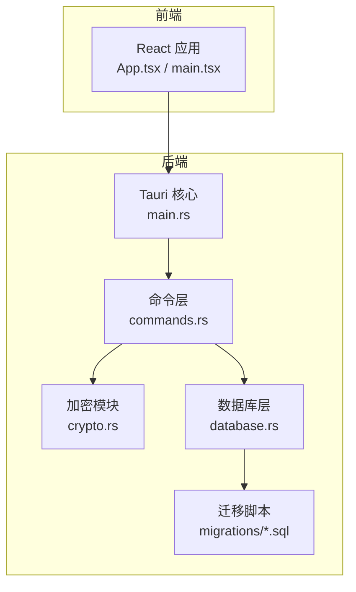
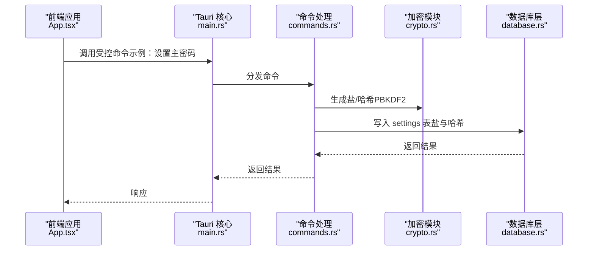
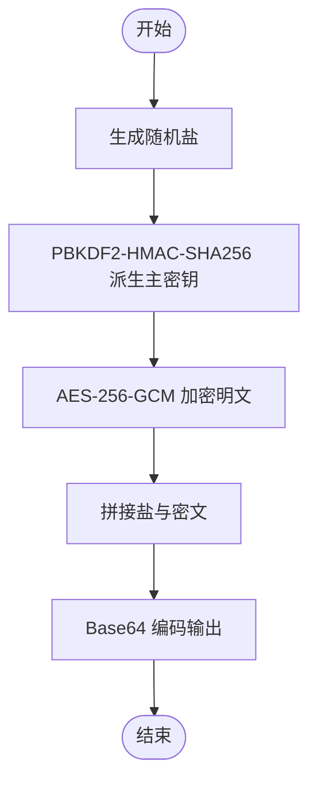
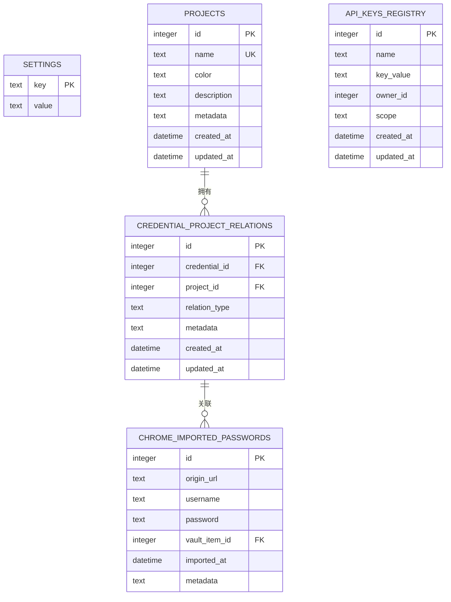
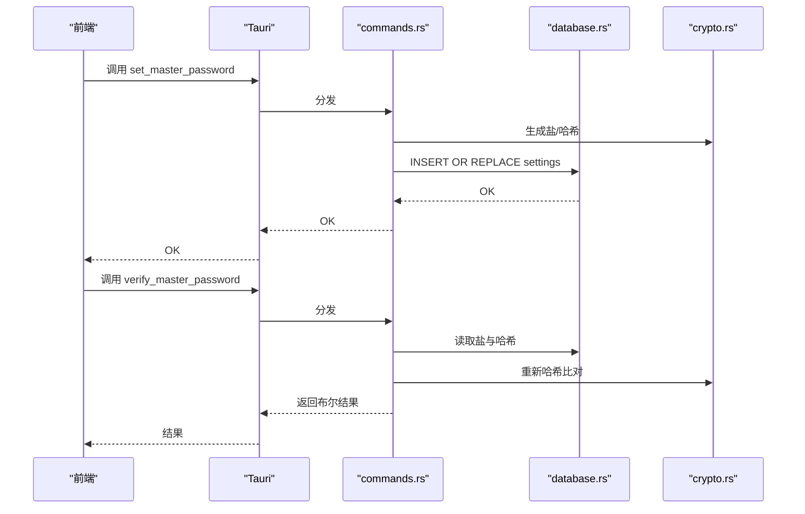
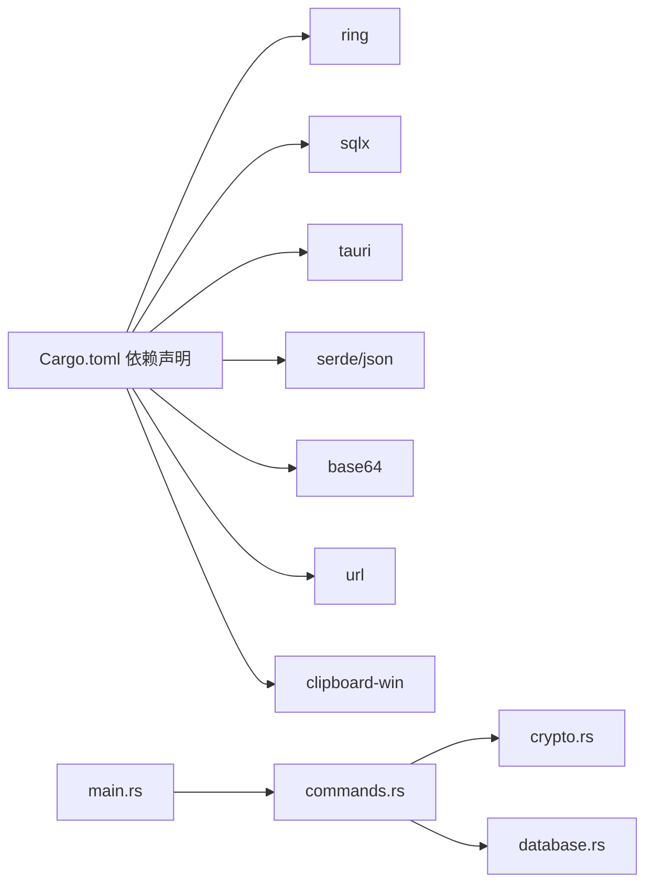

# 安全审计与监控

<cite>
**本文引用的文件**
- [src-tauri/src/crypto.rs](file://src-tauri/src/crypto.rs)
- [src-tauri/src/database.rs](file://src-tauri/src/database.rs)
- [src-tauri/src/commands.rs](file://src-tauri/src/commands.rs)
- [src-tauri/src/main.rs](file://src-tauri/src/main.rs)
- [src-tauri/Cargo.toml](file://src-tauri/Cargo.toml)
- [src-tauri/tauri.conf.json](file://src-tauri/tauri.conf.json)
- [src-tauri/migrations/001_create_projects_table.sql](file://src-tauri/migrations/001_create_projects_table.sql)
- [src-tauri/migrations/002_create_relations_table.sql](file://src-tauri/migrations/002_create_relations_table.sql)
- [src-tauri/migrations/003_create_imports_table.sql](file://src-tauri/migrations/003_create_imports_table.sql)
- [src-tauri/migrations/004_create_api_keys_table.sql](file://src-tauri/migrations/004_create_api_keys_table.sql)
- [src/App.tsx](file://src/App.tsx)
- [src/main.tsx](file://src/main.tsx)
</cite>

## 目录
1. [引言](#引言)
2. [项目结构](#项目结构)
3. [核心组件](#核心组件)
4. [架构总览](#架构总览)
5. [详细组件分析](#详细组件分析)
6. [依赖关系分析](#依赖关系分析)
7. [性能考虑](#性能考虑)
8. [故障排查指南](#故障排查指南)
9. [结论](#结论)
10. [附录](#附录)

## 引言
本文件面向安全审计与监控场景，系统化梳理该密码管理应用在安全事件记录、异常检测、威胁分析、加密操作日志、访问审计、数据变更追踪、安全指标监控、性能审计、合规检查、告警与事件响应、应急处理、安全基线配置、风险评估与漏洞扫描策略、监控配置、审计报告生成及安全改进建议等方面的实现与建议。文档以代码为依据，结合架构图与流程图，帮助安全与运维人员快速理解系统安全能力与薄弱点。

## 项目结构
后端采用 Tauri + Rust（SQLite + SQLx），前端为 React。安全相关的关键模块集中在后端：
- 加密与密钥派生：使用 ring 实现 PBKDF2-HMAC-SHA256 与 AES-256-GCM
- 数据持久化：SQLite 池化连接，迁移脚本管理表结构
- 命令接口：通过 Tauri 暴露受控命令，支持主密码设置/校验、导入记录管理、剪贴板写入等
- 配置与权限：Tauri 白名单控制，仅启用必要 API

图表来源
- [src-tauri/src/main.rs](file://src-tauri/src/main.rs#L24-L58)
- [src-tauri/src/commands.rs](file://src-tauri/src/commands.rs#L1-L572)
- [src-tauri/src/crypto.rs](file://src-tauri/src/crypto.rs#L1-L92)
- [src-tauri/src/database.rs](file://src-tauri/src/database.rs#L1-L104)
- [src-tauri/migrations/001_create_projects_table.sql](file://src-tauri/migrations/001_create_projects_table.sql#L1-L13)
- [src-tauri/migrations/002_create_relations_table.sql](file://src-tauri/migrations/002_create_relations_table.sql#L1-L16)
- [src-tauri/migrations/003_create_imports_table.sql](file://src-tauri/migrations/003_create_imports_table.sql#L1-L15)
- [src-tauri/migrations/004_create_api_keys_table.sql](file://src-tauri/migrations/004_create_api_keys_table.sql#L1-L13)

章节来源
- [src-tauri/src/main.rs](file://src-tauri/src/main.rs#L1-L58)
- [src-tauri/Cargo.toml](file://src-tauri/Cargo.toml#L1-L34)
- [src-tauri/tauri.conf.json](file://src-tauri/tauri.conf.json#L1-L33)
- [src/App.tsx](file://src/App.tsx#L1-L29)
- [src/main.tsx](file://src/main.tsx#L1-L10)

## 核心组件
- 加密与密钥派生
  - 使用 PBKDF2-HMAC-SHA256 进行主密码哈希，参数包含盐值与迭代次数；导出为 Base64 字符串
  - 使用 AES-256-GCM 对称加密，随机盐作为 nonce，加密结果与盐拼接后 Base64 编码
- 数据库与迁移
  - SQLite 池化连接，初始化时创建基础表与迁移跟踪表，并执行增量迁移
  - 提供项目、凭证关系、Chrome 导入记录、API 密钥注册表等结构
- 命令接口与访问控制
  - 通过 Tauri 暴露受控命令，前端仅能调用白名单内的命令
  - 支持主密码设置/校验、剪贴板写入、导入记录查询与转换到凭证库等
- 前端入口与安全门禁
  - 应用启动后先进行加载状态判断，再根据主密码验证状态决定渲染登录页或主界面

章节来源
- [src-tauri/src/crypto.rs](file://src-tauri/src/crypto.rs#L1-L92)
- [src-tauri/src/database.rs](file://src-tauri/src/database.rs#L1-L104)
- [src-tauri/src/commands.rs](file://src-tauri/src/commands.rs#L1-L572)
- [src-tauri/src/main.rs](file://src-tauri/src/main.rs#L1-L58)
- [src-tauri/tauri.conf.json](file://src-tauri/tauri.conf.json#L12-L33)
- [src/App.tsx](file://src/App.tsx#L1-L29)

## 架构总览
下图展示从前端到后端命令、数据库与加密模块的整体交互路径，以及安全控制点（白名单、主密码校验）。

图表来源
- [src-tauri/src/main.rs](file://src-tauri/src/main.rs#L24-L58)
- [src-tauri/src/commands.rs](file://src-tauri/src/commands.rs#L248-L269)
- [src-tauri/src/crypto.rs](file://src-tauri/src/crypto.rs#L76-L92)
- [src-tauri/src/database.rs](file://src-tauri/src/database.rs#L13-L52)

## 详细组件分析

### 组件一：加密与密钥派生（PBKDF2 + AES-256-GCM）
- 设计要点
  - 主密码经 PBKDF2-HMAC-SHA256 派生固定长度主密钥，用于后续对称加密
  - 加密时使用随机盐作为 GCM nonce，确保相同明文多次加密产生不同密文
  - 输出为“盐 + 密文”的拼接体，统一进行 Base64 编码
- 安全影响
  - 高熵盐与高迭代次数有效抵御离线暴力破解
  - AEAD 模式提供机密性与完整性保护
- 可审计点
  - 哈希与盐存储于 settings 表，可用于主密码校验与审计
  - 加密/解密失败返回统一错误类型，便于异常统计

图表来源
- [src-tauri/src/crypto.rs](file://src-tauri/src/crypto.rs#L12-L45)

章节来源
- [src-tauri/src/crypto.rs](file://src-tauri/src/crypto.rs#L1-L92)

### 组件二：数据库初始化与迁移（settings、项目、关系、导入、API 密钥）
- 初始化流程
  - 创建 settings 表用于存储主密码盐与哈希
  - 执行 V2 增量迁移，包含项目表、凭证-项目关系表、Chrome 导入记录表、API 密钥注册表
  - 迁移记录表用于幂等执行，避免重复迁移
- 关键表与索引
  - 项目表：唯一约束 name，带时间戳字段
  - 凭证-项目关系表：外键约束，级联删除，索引加速查询
  - Chrome 导入记录表：记录来源、用户名、密码、关联项等
  - API 密钥注册表：按名称建立索引，便于检索
- 变更追踪
  - 所有写入操作均带有 created_at/updated_at 时间戳，可作为审计线索
  - 删除采用软删除（archive 标记）或外键约束删除，便于回溯

图表来源
- [src-tauri/src/database.rs](file://src-tauri/src/database.rs#L54-L97)
- [src-tauri/migrations/001_create_projects_table.sql](file://src-tauri/migrations/001_create_projects_table.sql#L1-L13)
- [src-tauri/migrations/002_create_relations_table.sql](file://src-tauri/migrations/002_create_relations_table.sql#L1-L16)
- [src-tauri/migrations/003_create_imports_table.sql](file://src-tauri/migrations/003_create_imports_table.sql#L1-L15)
- [src-tauri/migrations/004_create_api_keys_table.sql](file://src-tauri/migrations/004_create_api_keys_table.sql#L1-L13)

章节来源
- [src-tauri/src/database.rs](file://src-tauri/src/database.rs#L1-L104)
- [src-tauri/migrations/001_create_projects_table.sql](file://src-tauri/migrations/001_create_projects_table.sql#L1-L13)
- [src-tauri/migrations/002_create_relations_table.sql](file://src-tauri/migrations/002_create_relations_table.sql#L1-L16)
- [src-tauri/migrations/003_create_imports_table.sql](file://src-tauri/migrations/003_create_imports_table.sql#L1-L15)
- [src-tauri/migrations/004_create_api_keys_table.sql](file://src-tauri/migrations/004_create_api_keys_table.sql#L1-L13)

### 组件三：命令接口与访问审计（主密码、导入记录、剪贴板）
- 主密码管理
  - 设置：生成盐与哈希，写入 settings 表
  - 校验：读取盐与哈希，重新计算输入哈希并与存储值比较
  - 未设置时返回无主密码状态
- 导入记录管理
  - 查询：返回 Chrome 导入记录列表（含元数据）
  - 删除：删除导入记录
  - 转换：将导入记录写入凭证库并更新关联
- 剪贴板写入
  - 仅在 Windows 平台启用，其他平台忽略并记录日志
- 访问控制
  - Tauri 白名单关闭 all，仅显式授权命令，降低攻击面

图表来源
- [src-tauri/src/commands.rs](file://src-tauri/src/commands.rs#L248-L309)
- [src-tauri/src/crypto.rs](file://src-tauri/src/crypto.rs#L76-L92)
- [src-tauri/src/database.rs](file://src-tauri/src/database.rs#L13-L52)

章节来源
- [src-tauri/src/commands.rs](file://src-tauri/src/commands.rs#L248-L309)
- [src-tauri/tauri.conf.json](file://src-tauri/tauri.conf.json#L12-L33)

### 组件四：前端安全门禁与渲染控制
- 启动流程
  - 初始状态为加载中，随后根据主密码验证状态切换至登录页或主布局
- 安全意义
  - 在主密码未验证前不暴露敏感界面，减少信息泄露风险

章节来源
- [src/App.tsx](file://src/App.tsx#L1-L29)
- [src/main.tsx](file://src/main.tsx#L1-L10)

## 依赖关系分析
- 外部依赖
  - ring：密码学原语（AEAD、PBKDF2）
  - sqlx：异步 SQLite 访问与迁移
  - tauri：跨平台运行时与命令分发
  - base64、url、clipboard-win 等
- 内部耦合
  - commands.rs 依赖 database.rs 与 crypto.rs
  - main.rs 将命令注册到 Tauri 并在启动时初始化数据库

图表来源
- [src-tauri/Cargo.toml](file://src-tauri/Cargo.toml#L15-L29)
- [src-tauri/src/main.rs](file://src-tauri/src/main.rs#L8-L22)
- [src-tauri/src/commands.rs](file://src-tauri/src/commands.rs#L1-L8)

章节来源
- [src-tauri/Cargo.toml](file://src-tauri/Cargo.toml#L1-L34)
- [src-tauri/src/main.rs](file://src-tauri/src/main.rs#L1-L58)

## 性能考虑
- 数据库连接池
  - 使用 OnceCell 缓存连接池，避免重复初始化开销
- 迁移幂等
  - 迁移记录表确保重复部署不会重复执行迁移
- 查询优化
  - 关系表与导入表均建立索引，提升 JOIN 与过滤效率
- 加密成本
  - PBKDF2 迭代次数较高，降低暴力破解可行性，但会增加 CPU 开销；建议在生产环境监控 CPU 使用率与延迟

章节来源
- [src-tauri/src/database.rs](file://src-tauri/src/database.rs#L5-L52)
- [src-tauri/migrations/002_create_relations_table.sql](file://src-tauri/migrations/002_create_relations_table.sql#L13-L16)
- [src-tauri/migrations/003_create_imports_table.sql](file://src-tauri/migrations/003_create_imports_table.sql#L13-L15)

## 故障排查指南
- 数据库初始化失败
  - 现象：启动时报错提示数据库初始化失败
  - 排查：确认 SQLite 文件权限、磁盘空间、路径正确；查看迁移是否成功
- 主密码设置/校验异常
  - 现象：设置后无法校验，或首次运行即提示无主密码
  - 排查：检查 settings 表是否存在盐与哈希；确认 Base64 编解码正确；核对 PBKDF2 参数一致性
- 剪贴板写入无效
  - 现象：调用复制接口无效果
  - 排查：仅 Windows 平台支持；确认 clipboard-win 版本与权限；查看日志输出
- 命令调用失败
  - 现象：前端调用后无响应或报错
  - 排查：确认 Tauri 白名单已授权对应命令；检查命令实现中的错误返回路径

章节来源
- [src-tauri/src/main.rs](file://src-tauri/src/main.rs#L47-L55)
- [src-tauri/src/commands.rs](file://src-tauri/src/commands.rs#L248-L309)
- [src-tauri/tauri.conf.json](file://src-tauri/tauri.conf.json#L12-L33)

## 结论
该系统在本地密码管理场景下具备较为完善的加密与访问控制基础：PBKDF2+AEAD 的组合提供了强健的主密码与数据保护；SQLite 池化与幂等迁移保障了稳定性；Tauri 白名单与前端门禁进一步降低了攻击面。为进一步强化安全审计与监控，建议补充：集中式日志采集与告警、入侵检测与异常行为分析、定期漏洞扫描与基线合规检查、事件响应预案与演练、以及针对敏感操作的细粒度审计与可视化报表。

## 附录

### 安全事件记录与异常检测建议
- 记录范围
  - 主密码设置/修改、校验失败、剪贴板写入、导入记录增删改、凭证库变更
- 记录字段
  - 时间戳、用户标识（如存在）、命令名、参数摘要、结果状态、客户端 IP/主机名
- 异常检测
  - 高频失败校验、短时间大量导入、异常平台调用（非 Windows 的剪贴板写入）

### 威胁分析与缓解
- 主密码泄露
  - 建议：强制复杂度、定期轮换、多因子辅助
- 本地文件被窃取
  - 建议：文件系统加密、最小权限、定期备份与校验
- 中间人与注入
  - 建议：HTTPS 传输、SQL 注入防护（已由 ORM/参数绑定覆盖）、命令白名单

### 安全指标监控
- 指标建议
  - 登录成功率、失败率、平均响应时间、数据库连接池利用率、CPU/内存占用
- 报表维度
  - 用户维度、命令维度、时间维度、地理/设备维度

### 合规性检查流程
- 自查清单
  - 加密算法与参数合规、密钥生命周期管理、日志保留与访问控制、备份恢复测试
- 审计周期
  - 月度自审、季度专项审计、年度外部审计

### 安全告警与事件响应
- 告警规则
  - 连续失败登录、异常批量操作、未知平台调用、数据库异常
- 响应流程
  - 快速隔离、取证分析、修复与加固、复盘与改进

### 应急处理流程
- 场景示例
  - 主密码遗忘：基于备份恢复流程；严格审批与双人复核
  - 数据库损坏：从备份恢复，验证完整性
- 文档与演练
  - 编写 SOP，定期演练，记录改进

### 安全基线配置
- 最小权限原则：仅授予必要命令与文件访问
- 强密码策略：主密码复杂度与轮换周期
- 日志保留：明确保留期限与归档策略

### 风险评估方法
- 方法建议
  - 威胁建模（STRIDE）、资产识别、攻击路径分析、概率与影响矩阵
- 工具建议
  - OWASP ASVS、NIST CSF、ISO 27001

### 漏洞扫描策略
- 静态分析
  - Rust 安全规则、依赖版本检查
- 动态扫描
  - API 测试、注入与异常路径覆盖
- 渗透测试
  - 限定范围、最小影响、完整报告

### 安全监控配置与审计报告
- 监控配置
  - 集成日志系统（如 ELK/Splunk），设置阈值与告警
- 报告模板
  - 事件描述、影响范围、处置过程、根因分析、改进措施与责任人