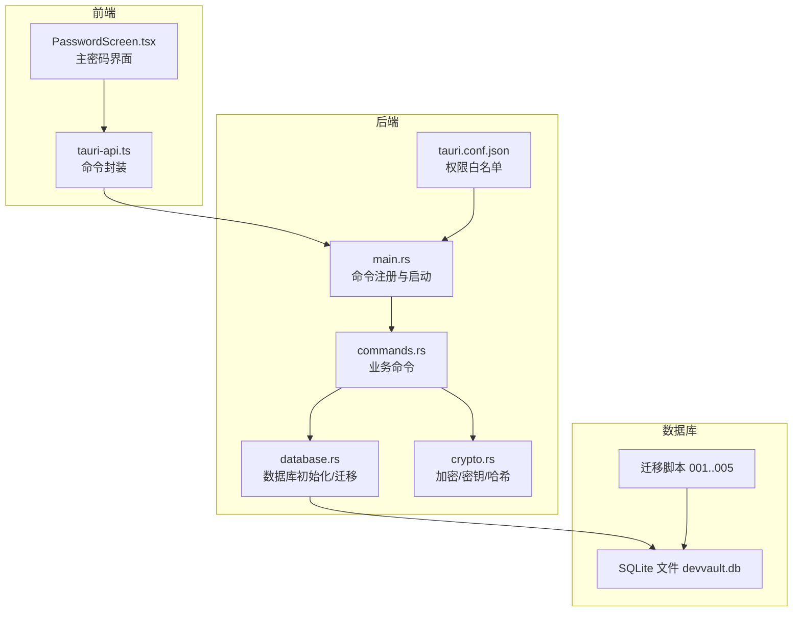
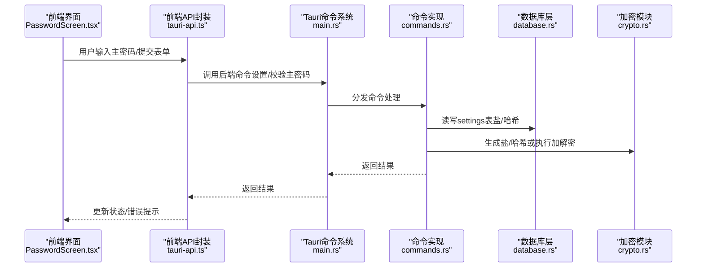
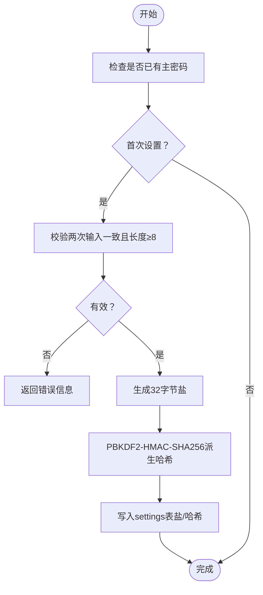
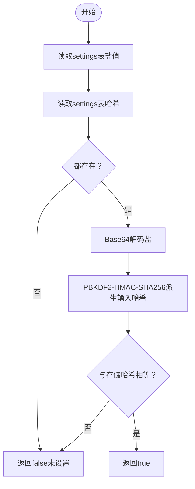
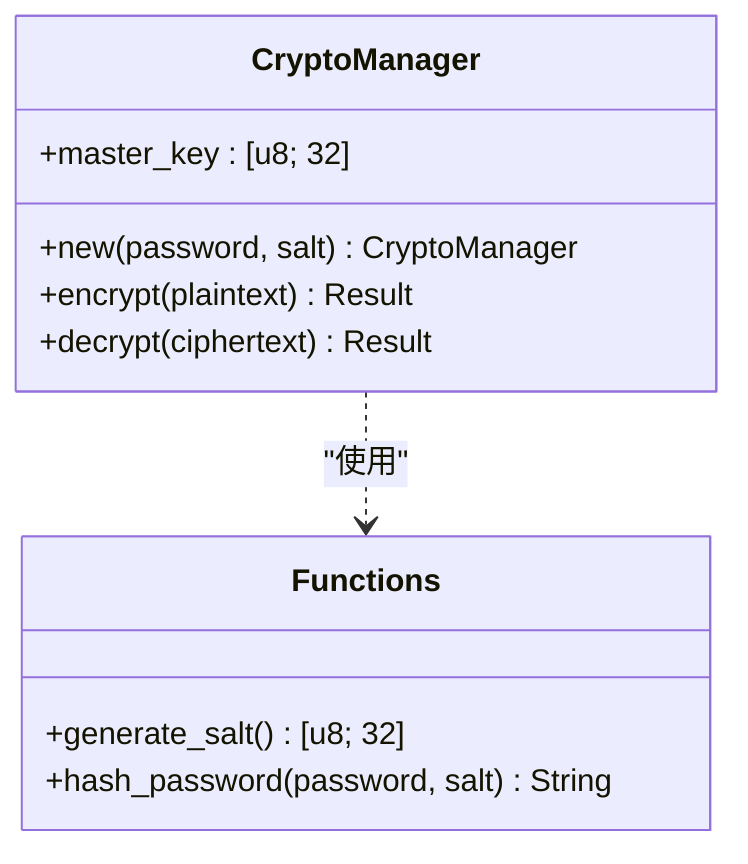
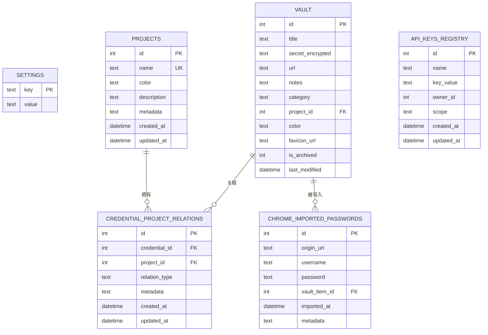
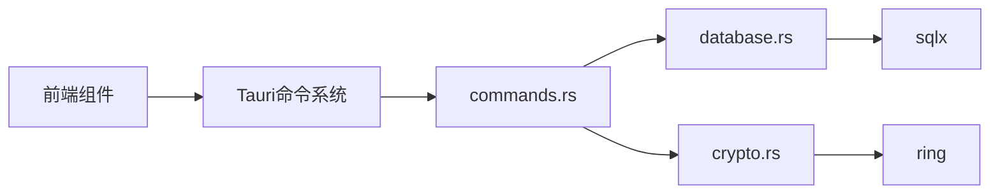

# 安全机制

<cite>
**本文引用的文件**
- [src-tauri/src/crypto.rs](file://src-tauri/src/crypto.rs)
- [src-tauri/src/database.rs](file://src-tauri/src/database.rs)
- [src-tauri/src/main.rs](file://src-tauri/src/main.rs)
- [src-tauri/Cargo.toml](file://src-tauri/Cargo.toml)
- [src-tauri/tauri.conf.json](file://src-tauri/tauri.conf.json)
- [src-tauri/src/commands.rs](file://src-tauri/src/commands.rs)
- [src-tauri/migrations/001_create_projects_table.sql](file://src-tauri/migrations/001_create_projects_table.sql)
- [src-tauri/migrations/002_create_relations_table.sql](file://src-tauri/migrations/002_create_relations_table.sql)
- [src-tauri/migrations/003_create_imports_table.sql](file://src-tauri/migrations/003_create_imports_table.sql)
- [src-tauri/migrations/004_create_api_keys_table.sql](file://src-tauri/migrations/004_create_api_keys_table.sql)
- [src-tauri/migrations/005_migrate_vault_relations.sql](file://src-tauri/migrations/005_migrate_vault_relations.sql)
- [src/components/PasswordScreen.tsx](file://src/components/PasswordScreen.tsx)
- [src/lib/tauri-api.ts](file://src/lib/tauri-api.ts)
- [src/lib/utils.ts](file://src/lib/utils.ts)
</cite>

## 目录
1. [引言](#引言)
2. [项目结构](#项目结构)
3. [核心组件](#核心组件)
4. [架构总览](#架构总览)
5. [详细组件分析](#详细组件分析)
6. [依赖关系分析](#依赖关系分析)
7. [性能考虑](#性能考虑)
8. [故障排查指南](#故障排查指南)
9. [结论](#结论)
10. [附录](#附录)

## 引言
本文件面向AIpassword的安全机制，系统化阐述主密码体系、密码存储与验证流程、数据加解密算法、密钥管理与安全存储、Ring加密库使用与参数配置、数据库安全与SQL注入防护、数据访问控制、会话与令牌处理、安全威胁与防护策略、漏洞检测机制、安全配置指南、最佳实践与合规性要求，以及安全审计、监控与应急响应方案。内容基于仓库中实际代码与配置进行分析，并通过图示帮助非专业读者理解。

## 项目结构
后端采用Tauri + Rust，前端为React。安全相关逻辑主要集中在后端Rust模块：加密与密钥管理、数据库初始化与迁移、命令接口（主密码设置/校验等）。前端负责用户交互与调用后端命令。

图表来源
- [src-tauri/src/main.rs](file://src-tauri/src/main.rs#L1-L51)
- [src-tauri/src/commands.rs](file://src-tauri/src/commands.rs#L1-L487)
- [src-tauri/src/database.rs](file://src-tauri/src/database.rs#L1-L104)
- [src-tauri/src/crypto.rs](file://src-tauri/src/crypto.rs#L1-L92)
- [src-tauri/tauri.conf.json](file://src-tauri/tauri.conf.json#L1-L33)
- [src-tauri/migrations/001_create_projects_table.sql](file://src-tauri/migrations/001_create_projects_table.sql#L1-L13)
- [src-tauri/migrations/002_create_relations_table.sql](file://src-tauri/migrations/002_create_relations_table.sql#L1-L16)
- [src-tauri/migrations/003_create_imports_table.sql](file://src-tauri/migrations/003_create_imports_table.sql#L1-L15)
- [src-tauri/migrations/004_create_api_keys_table.sql](file://src-tauri/migrations/004_create_api_keys_table.sql#L1-L13)
- [src-tauri/migrations/005_migrate_vault_relations.sql](file://src-tauri/migrations/005_migrate_vault_relations.sql#L1-L18)

章节来源
- [src-tauri/src/main.rs](file://src-tauri/src/main.rs#L1-L51)
- [src-tauri/tauri.conf.json](file://src-tauri/tauri.conf.json#L1-L33)

## 核心组件
- 加密与密钥管理（Ring）
  - PBKDF2-HMAC-SHA256派生主密钥，迭代次数约10万级；AES-256-GCM用于对称加密；随机盐值与随机nonce组合，Base64编码输出。
- 数据库与迁移
  - SQLite连接池初始化；应用基础表与版本化迁移；默认项目与关系表确保兼容性。
- 主密码流程
  - 前端界面判断是否首次使用；后端命令写入settings表保存盐与哈希；校验时读取并比对。
- 命令接口
  - 暴露主密码设置/校验、凭据增删改查、项目管理、搜索、剪贴板、图标抓取等命令。
- 前端交互
  - 密码输入、确认、错误提示；调用后端命令完成解锁或设置主密码。

章节来源
- [src-tauri/src/crypto.rs](file://src-tauri/src/crypto.rs#L1-L92)
- [src-tauri/src/database.rs](file://src-tauri/src/database.rs#L1-L104)
- [src-tauri/src/commands.rs](file://src-tauri/src/commands.rs#L248-L309)
- [src/components/PasswordScreen.tsx](file://src/components/PasswordScreen.tsx#L1-L146)
- [src/lib/tauri-api.ts](file://src/lib/tauri-api.ts#L1-L84)

## 架构总览
下图展示从UI到后端命令、再到数据库与加密模块的整体调用链路与职责边界。

图表来源
- [src/components/PasswordScreen.tsx](file://src/components/PasswordScreen.tsx#L30-L61)
- [src/lib/tauri-api.ts](file://src/lib/tauri-api.ts#L65-L76)
- [src-tauri/src/main.rs](file://src-tauri/src/main.rs#L21-L39)
- [src-tauri/src/commands.rs](file://src-tauri/src/commands.rs#L248-L309)
- [src-tauri/src/database.rs](file://src-tauri/src/database.rs#L13-L52)
- [src-tauri/src/crypto.rs](file://src-tauri/src/crypto.rs#L76-L92)

## 详细组件分析

### 组件A：主密码系统与密钥管理
- 设计要点
  - 主密码仅在内存中派生主密钥，不落盘；盐值与哈希分别存于settings表。
  - PBKDF2-HMAC-SHA256迭代次数约10万级，兼顾安全性与可用性。
  - AES-256-GCM用于对称加解密，随机盐作为nonce前缀，Base64编码便于持久化。
- 流程图（设置主密码）

图表来源
- [src-tauri/src/commands.rs](file://src-tauri/src/commands.rs#L248-L269)
- [src-tauri/src/crypto.rs](file://src-tauri/src/crypto.rs#L76-L92)

- 流程图（校验主密码）

图表来源
- [src-tauri/src/commands.rs](file://src-tauri/src/commands.rs#L284-L309)
- [src-tauri/src/crypto.rs](file://src-tauri/src/crypto.rs#L82-L92)

- 关键实现路径
  - 设置主密码命令：[src-tauri/src/commands.rs](file://src-tauri/src/commands.rs#L248-L269)
  - 校验主密码命令：[src-tauri/src/commands.rs](file://src-tauri/src/commands.rs#L284-L309)
  - 生成盐与哈希函数：[src-tauri/src/crypto.rs](file://src-tauri/src/crypto.rs#L76-L92)

章节来源
- [src-tauri/src/commands.rs](file://src-tauri/src/commands.rs#L248-L309)
- [src-tauri/src/crypto.rs](file://src-tauri/src/crypto.rs#L76-L92)
- [src/components/PasswordScreen.tsx](file://src/components/PasswordScreen.tsx#L30-L61)
- [src/lib/tauri-api.ts](file://src/lib/tauri-api.ts#L65-L76)

### 组件B：数据加密与解密（Ring AES-256-GCM）
- 算法与参数
  - 对称加密：AES-256-GCM
  - 随机源：SystemRandom
  - 非对称场景：当前仅用于派生主密钥（PBKDF2），未见RSA等非对称密钥交换
- 加密流程
  - 生成12字节随机盐，作为nonce前缀
  - 使用UnboundKey/LessSafeKey绑定主密钥
  - 在地执行密封，追加认证标签
  - 将nonce与密文拼接并Base64编码
- 解密流程
  - Base64解码
  - 切分nonce与密文
  - 打开密文并校验认证标签
  - 输出明文
- 复杂度与性能
  - 加密/解密时间复杂度近似O(n)，n为明文长度；PBKDF2迭代约10万次，CPU成本较高但能抵御暴力破解
- 安全性评估
  - GCM模式提供机密性与完整性；nonce长度12字节满足AES-256-GCM推荐；Base64便于跨平台存储
- 类图（简化）

图表来源
- [src-tauri/src/crypto.rs](file://src-tauri/src/crypto.rs#L7-L92)

章节来源
- [src-tauri/src/crypto.rs](file://src-tauri/src/crypto.rs#L1-L92)

### 组件C：数据库安全与SQL注入防护
- 初始化与连接
  - 使用SqlitePool连接本地SQLite文件；启用“按需创建”；全局OnceCell缓存连接池
- 迁移与表结构
  - 基础settings表保障主密码元数据；版本化迁移脚本保证幂等
  - 关系表与外键约束确保数据一致性
- SQL注入防护
  - 全面使用参数化查询（bind），避免字符串拼接
  - LIKE查询使用占位符绑定，防止注入
- 访问控制
  - 无内置RBAC；当前通过主密码保护数据，未见独立令牌/会话管理
- 表结构概览

图表来源
- [src-tauri/migrations/001_create_projects_table.sql](file://src-tauri/migrations/001_create_projects_table.sql#L1-L13)
- [src-tauri/migrations/002_create_relations_table.sql](file://src-tauri/migrations/002_create_relations_table.sql#L1-L16)
- [src-tauri/migrations/003_create_imports_table.sql](file://src-tauri/migrations/003_create_imports_table.sql#L1-L15)
- [src-tauri/migrations/004_create_api_keys_table.sql](file://src-tauri/migrations/004_create_api_keys_table.sql#L1-L13)
- [src-tauri/migrations/005_migrate_vault_relations.sql](file://src-tauri/migrations/005_migrate_vault_relations.sql#L1-L18)

章节来源
- [src-tauri/src/database.rs](file://src-tauri/src/database.rs#L13-L104)
- [src-tauri/migrations/001_create_projects_table.sql](file://src-tauri/migrations/001_create_projects_table.sql#L1-L13)
- [src-tauri/migrations/002_create_relations_table.sql](file://src-tauri/migrations/002_create_relations_table.sql#L1-L16)
- [src-tauri/migrations/003_create_imports_table.sql](file://src-tauri/migrations/003_create_imports_table.sql#L1-L15)
- [src-tauri/migrations/004_create_api_keys_table.sql](file://src-tauri/migrations/004_create_api_keys_table.sql#L1-L13)
- [src-tauri/migrations/005_migrate_vault_relations.sql](file://src-tauri/migrations/005_migrate_vault_relations.sql#L1-L18)

### 组件D：命令接口与前端交互
- 命令清单（与安全相关）
  - 主密码：set_master_password、verify_master_password、has_master_password
  - 凭据：create_vault_item、get_vault_items、update_vault_item、delete_vault_item、search_items
  - 项目与关系：create_project、get_projects、get_project_counts、get_vault_items_by_project、get_unlinked_vault_items、create_credential_project_relation、delete_relation_by_credential_and_project
  - 工具：copy_to_clipboard、fetch_favicon
- 前端调用
  - 通过tauri-api.ts封装invoke调用；PasswordScreen.tsx负责主密码输入与校验
- 安全注意
  - 命令白名单由tauri.conf.json控制；当前未启用“all”权限，具备一定隔离性
  - 剪贴板写入受平台条件编译限制（Windows）

章节来源
- [src-tauri/src/commands.rs](file://src-tauri/src/commands.rs#L40-L487)
- [src/lib/tauri-api.ts](file://src/lib/tauri-api.ts#L1-L84)
- [src/components/PasswordScreen.tsx](file://src/components/PasswordScreen.tsx#L1-L146)
- [src-tauri/tauri.conf.json](file://src-tauri/tauri.conf.json#L12-L33)

## 依赖关系分析
- 外部库
  - ring：AEAD加密、PBKDF2、随机数
  - sqlx：异步SQLite ORM与连接池
  - tauri：命令系统与桌面集成
  - base64：编码/解码
  - once_cell：全局连接池缓存
- 内部耦合
  - commands.rs依赖database.rs与crypto.rs
  - main.rs注册命令并初始化数据库
  - 前端通过tauri-api.ts调用命令

图表来源
- [src-tauri/Cargo.toml](file://src-tauri/Cargo.toml#L15-L29)
- [src-tauri/src/main.rs](file://src-tauri/src/main.rs#L8-L19)
- [src-tauri/src/commands.rs](file://src-tauri/src/commands.rs#L1-L8)
- [src-tauri/src/database.rs](file://src-tauri/src/database.rs#L1-L2)
- [src-tauri/src/crypto.rs](file://src-tauri/src/crypto.rs#L1-L5)

章节来源
- [src-tauri/Cargo.toml](file://src-tauri/Cargo.toml#L15-L29)
- [src-tauri/src/main.rs](file://src-tauri/src/main.rs#L8-L19)

## 性能考虑
- PBKDF2迭代次数约10万级，建议在低端设备上评估延迟；可通过硬件特性与线程调度优化
- SQLite连接池复用，减少频繁打开关闭带来的开销
- AES-256-GCM加解密为常数级时间复杂度，对大文本影响主要来自I/O
- 建议
  - 对高频操作（如搜索）增加索引覆盖（已存在部分索引）
  - 对主密码校验结果做短期缓存（需结合会话模型设计）

## 故障排查指南
- 主密码设置失败
  - 检查settings表写入是否成功；确认盐与哈希字段存在且Base64可解码
  - 参考：[src-tauri/src/commands.rs](file://src-tauri/src/commands.rs#L248-L269)
- 主密码校验失败
  - 确认settings表中盐与哈希存在；检查Base64解码与数组转换
  - 参考：[src-tauri/src/commands.rs](file://src-tauri/src/commands.rs#L284-L309)
- 数据库初始化异常
  - 检查SQLite文件路径与权限；确认迁移脚本执行顺序与幂等性
  - 参考：[src-tauri/src/database.rs](file://src-tauri/src/database.rs#L13-L52)
- 剪贴板不可用
  - 当前仅Windows平台实现；参考：[src-tauri/src/commands.rs](file://src-tauri/src/commands.rs#L213-L228)
- 前端调用失败
  - 检查tauri.conf.json命令白名单；确认命令已在main.rs注册
  - 参考：[src-tauri/tauri.conf.json](file://src-tauri/tauri.conf.json#L12-L33), [src-tauri/src/main.rs](file://src-tauri/src/main.rs#L21-L39)

章节来源
- [src-tauri/src/commands.rs](file://src-tauri/src/commands.rs#L213-L228)
- [src-tauri/src/database.rs](file://src-tauri/src/database.rs#L13-L52)
- [src-tauri/src/main.rs](file://src-tauri/src/main.rs#L21-L39)
- [src-tauri/tauri.conf.json](file://src-tauri/tauri.conf.json#L12-L33)

## 结论
AIpassword采用“主密码+PBKDF2+AES-256-GCM”的轻量安全模型，结合SQLite与参数化查询实现基本的本地安全存储。当前未实现独立令牌/会话管理，依赖主密码作为访问控制入口。建议后续引入会话令牌、审计日志与监控告警，完善安全运营闭环。

## 附录

### 安全威胁与防护策略
- 威胁类型
  - 离线密码破解（弱口令）、暴力破解（降低PBKDF2迭代）、侧信道（内存中主密钥暴露风险）
  - 本地文件泄露（SQLite文件被复制）、中间人篡改（未使用TLS）
  - 误用与越权（命令白名单不足、剪贴板滥用）
- 防护策略
  - 强制主密码复杂度与定期轮换提示
  - 适度提高PBKDF2迭代次数，限制登录尝试频率
  - 采用只读挂载或加密磁盘保护SQLite文件
  - 严格命令白名单与最小权限原则
  - 引入会话令牌与超时回收，避免长期持有主密钥

### 漏洞检测机制
- 代码扫描
  - 使用Rust静态分析工具（如Clippy、Rust Audit）识别潜在问题
- 运行时检测
  - 监控命令调用频率与异常返回
  - 检测剪贴板异常事件（平台事件监听）
- 日志与审计
  - 记录主密码设置/校验、敏感命令调用、数据库变更等关键事件
  - 建议：统一日志格式与保留周期

### 安全配置指南
- 命令白名单
  - 保持“all”关闭，仅开启必要命令
  - 参考：[src-tauri/tauri.conf.json](file://src-tauri/tauri.conf.json#L12-L33)
- 数据库安全
  - 限制文件系统访问权限；备份时加密传输
  - 迁移脚本幂等，避免重复执行
  - 参考：[src-tauri/src/database.rs](file://src-tauri/src/database.rs#L54-L97)
- 加密参数
  - PBKDF2-HMAC-SHA256迭代次数约10万级；AES-256-GCM；随机盐与nonce
  - 参考：[src-tauri/src/crypto.rs](file://src-tauri/src/crypto.rs#L14-L20), [src-tauri/src/crypto.rs](file://src-tauri/src/crypto.rs#L30-L39)

### 最佳实践
- 输入校验与参数化
  - 始终使用bind绑定参数，避免字符串拼接
  - 参考：[src-tauri/src/commands.rs](file://src-tauri/src/commands.rs#L44-L61)
- 错误处理
  - 将底层错误转换为统一消息，避免泄漏内部细节
  - 参考：[src-tauri/src/commands.rs](file://src-tauri/src/commands.rs#L41-L64)
- 剪贴板安全
  - 仅在Windows平台启用；及时清理剪贴板内容
  - 参考：[src-tauri/src/commands.rs](file://src-tauri/src/commands.rs#L213-L228)

### 合规性要求
- 数据最小化：仅存储必要的盐与哈希
- 可追溯性：记录关键操作日志
- 传输安全：建议引入TLS与证书固定（当前未见）
- 存储安全：SQLite文件加密与访问控制

### 会话管理与令牌处理
- 现状
  - 未实现独立令牌/会话；主密码作为访问控制入口
- 建议
  - 引入短期会话令牌（如JWT或自定义令牌），支持超时与刷新
  - 令牌存储于安全位置，避免明文落盘
  - 退出登录时销毁会话与清理剪贴板

### 安全审计、监控与应急响应
- 审计
  - 记录主密码设置/校验、凭据增删改、项目变更、关系维护等
- 监控
  - 命令调用QPS与错误率阈值告警
  - 剪贴板异常事件监测
- 应急
  - 发现异常立即冻结账户（模拟）并引导重新设置主密码
  - 回滚到最近一次安全备份