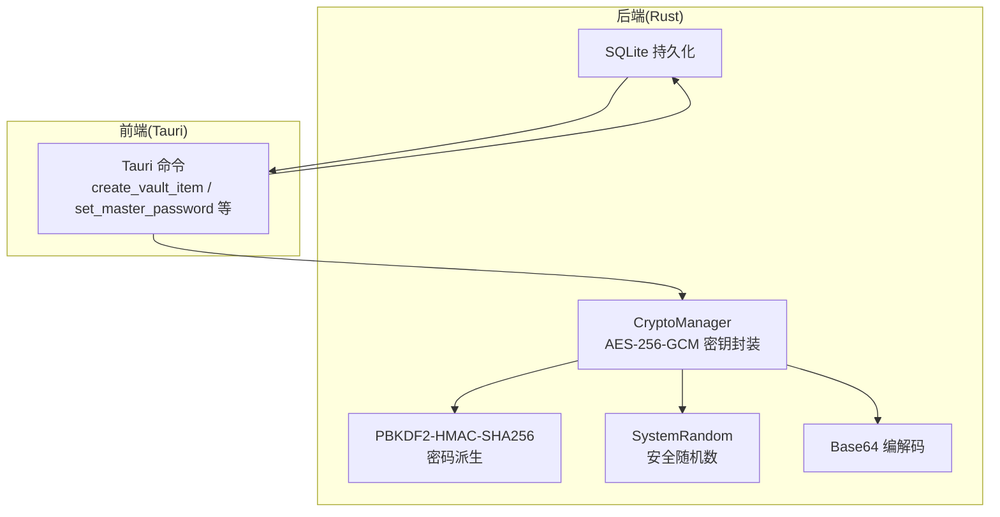
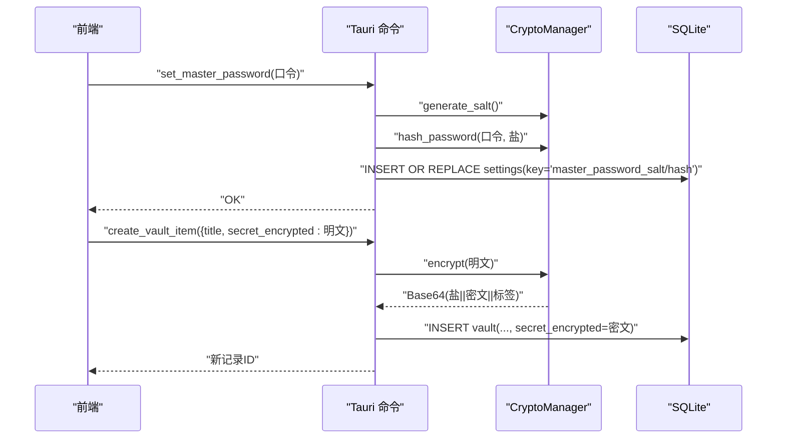
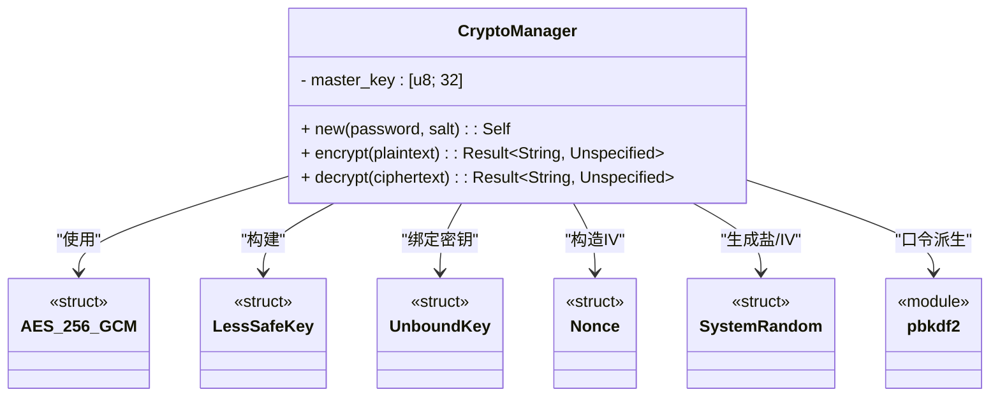
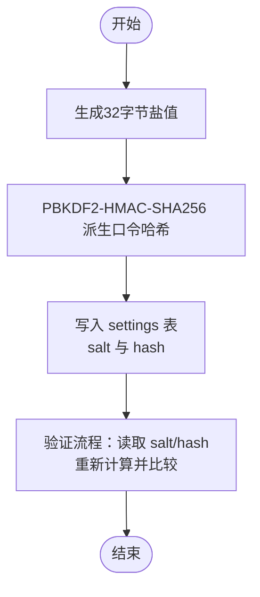
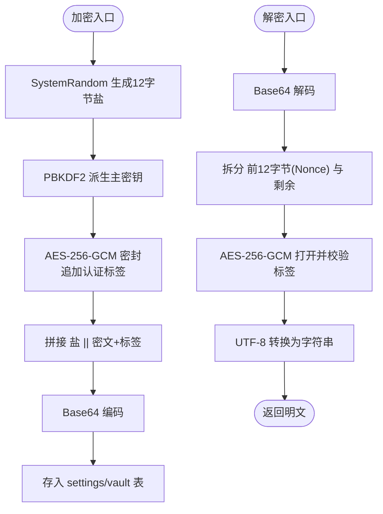
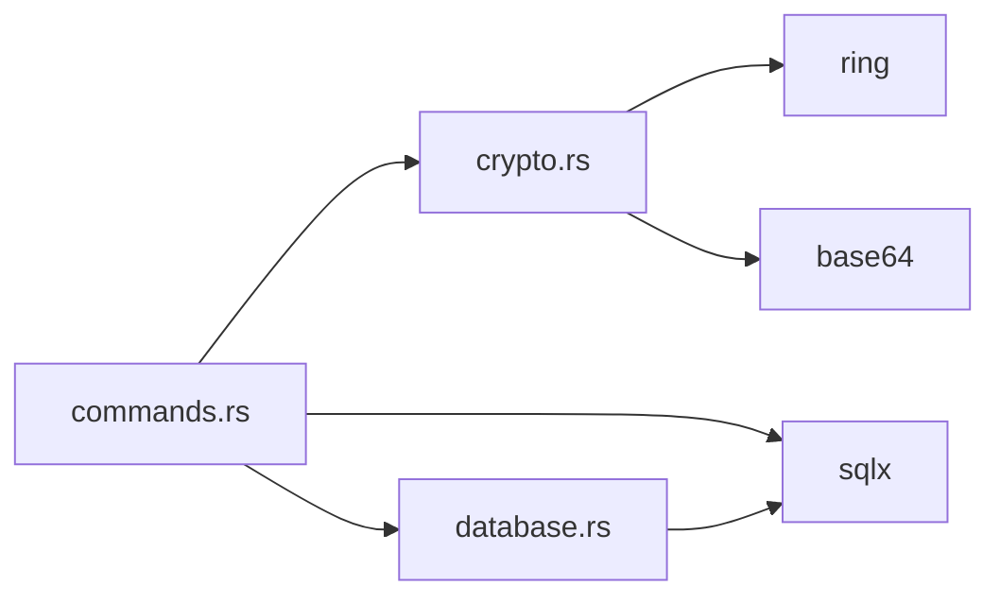

# 数据加密机制

<cite>
**本文引用的文件**
- [src-tauri/src/crypto.rs](file://src-tauri/src/crypto.rs)
- [src-tauri/src/commands.rs](file://src-tauri/src/commands.rs)
- [src-tauri/src/database.rs](file://src-tauri/src/database.rs)
- [src-tauri/Cargo.toml](file://src-tauri/Cargo.toml)
- [src-tauri/migrations/001_create_projects_table.sql](file://src-tauri/migrations/001_create_projects_table.sql)
- [src-tauri/migrations/005_migrate_vault_relations.sql](file://src-tauri/migrations/005_migrate_vault_relations.sql)
</cite>

## 目录
1. [简介](#简介)
2. [项目结构](#项目结构)
3. [核心组件](#核心组件)
4. [架构总览](#架构总览)
5. [详细组件分析](#详细组件分析)
6. [依赖关系分析](#依赖关系分析)
7. [性能考虑](#性能考虑)
8. [故障排查指南](#故障排查指南)
9. [结论](#结论)
10. [附录](#附录)

## 简介
本文件系统化阐述本项目的对称加密机制，基于 AES-256-GCM 的实现与使用方式，覆盖密钥派生、随机数与初始化向量（IV）处理、密文格式结构（含盐值、密文与认证标签）、性能优化、内存安全与错误处理，并给出加密强度评估、密钥轮换策略与数据完整性保护建议，以及配置选项、性能调优与安全审计指南。

## 项目结构
围绕加密功能的关键模块与文件如下：
- 加密实现：src-tauri/src/crypto.rs
- 前端命令与数据持久化：src-tauri/src/commands.rs
- 数据库初始化与设置表：src-tauri/src/database.rs
- 依赖声明：src-tauri/Cargo.toml
- 数据库迁移（项目表、关系表等）：src-tauri/migrations/*.sql

图表来源
- [src-tauri/src/crypto.rs](file://src-tauri/src/crypto.rs#L1-L92)
- [src-tauri/src/commands.rs](file://src-tauri/src/commands.rs#L1-L572)
- [src-tauri/src/database.rs](file://src-tauri/src/database.rs#L1-L104)

章节来源
- [src-tauri/src/crypto.rs](file://src-tauri/src/crypto.rs#L1-L92)
- [src-tauri/src/commands.rs](file://src-tauri/src/commands.rs#L1-L572)
- [src-tauri/src/database.rs](file://src-tauri/src/database.rs#L1-L104)
- [src-tauri/Cargo.toml](file://src-tauri/Cargo.toml#L1-L34)

## 核心组件
- CryptoManager：封装 AES-256-GCM 的密钥对象与加解密流程；提供从口令派生主密钥、加密与解密方法。
- PBKDF2-HMAC-SHA256：用于从用户口令与盐值派生固定长度主密钥。
- 安全随机数：SystemRandom 用于生成盐值与 IV。
- Base64：对密文结果进行编码以便存储与传输。
- 设置表 settings：用于持久化“主口令盐”和“主口令哈希”，支撑主口令验证流程。

章节来源
- [src-tauri/src/crypto.rs](file://src-tauri/src/crypto.rs#L7-L92)
- [src-tauri/src/commands.rs](file://src-tauri/src/commands.rs#L248-L309)
- [src-tauri/src/database.rs](file://src-tauri/src/database.rs#L24-L31)

## 架构总览
下图展示从“设置主口令”到“保存加密凭据”的端到端流程，包括口令验证、密钥派生、加密与持久化。

图表来源
- [src-tauri/src/commands.rs](file://src-tauri/src/commands.rs#L248-L269)
- [src-tauri/src/commands.rs](file://src-tauri/src/commands.rs#L41-L64)
- [src-tauri/src/crypto.rs](file://src-tauri/src/crypto.rs#L25-L45)

## 详细组件分析

### CryptoManager 组件
- 职责
  - 通过 PBKDF2-HMAC-SHA256 从口令与盐值派生 32 字节主密钥。
  - 使用 AES_256_GCM 对明文进行密封加密，返回 Base64 编码的结果。
  - 解密时验证认证标签并返回明文字符串。
- 关键点
  - 随机盐：每次加密生成 12 字节随机盐，作为本次加密的 IV 使用。
  - 认证标签：由 AEAD 自动附加在密文之后，解密时自动校验。
  - Base64 编码：统一输出格式，便于存储与跨进程传输。
- 错误处理
  - 所有底层错误统一转换为 Unspecified，上层以 Result 包裹处理。

图表来源
- [src-tauri/src/crypto.rs](file://src-tauri/src/crypto.rs#L1-L92)

章节来源
- [src-tauri/src/crypto.rs](file://src-tauri/src/crypto.rs#L7-L92)

### 口令与盐值管理
- 设置主口令
  - 生成 32 字节盐值并持久化到 settings 表。
  - 使用 PBKDF2-HMAC-SHA256 派生口令哈希并持久化到 settings 表。
- 验证主口令
  - 从 settings 读取盐值与哈希，重新计算输入口令的哈希并与存储值比较。
- 注意
  - 盐值与哈希均以 Base64 存储，便于跨平台兼容。

图表来源
- [src-tauri/src/commands.rs](file://src-tauri/src/commands.rs#L248-L309)
- [src-tauri/src/crypto.rs](file://src-tauri/src/crypto.rs#L76-L92)

章节来源
- [src-tauri/src/commands.rs](file://src-tauri/src/commands.rs#L248-L309)
- [src-tauri/src/crypto.rs](file://src-tauri/src/crypto.rs#L76-L92)

### 加密数据格式与存储
- 存储字段
  - settings 表：保存“master_password_salt”和“master_password_hash”。
  - vault 表：保存“secret_encrypted”字段，存储 Base64 编码后的密文。
- 密文结构
  - 前缀 12 字节随机盐（同时作为 GCM 的 IV）。
  - 后随密文与认证标签（AEAD 自动附加）。
  - 整体经 Base64 编码后存入数据库。
- 解密流程
  - Base64 解码得到盐+密文。
  - 前 12 字节作为 Nonce，其余为密文。
  - 使用 LessSafeKey 打开并校验标签，成功后提取明文。

图表来源
- [src-tauri/src/crypto.rs](file://src-tauri/src/crypto.rs#L25-L73)
- [src-tauri/src/commands.rs](file://src-tauri/src/commands.rs#L41-L64)

章节来源
- [src-tauri/src/crypto.rs](file://src-tauri/src/crypto.rs#L25-L73)
- [src-tauri/src/commands.rs](file://src-tauri/src/commands.rs#L41-L64)

### 数据库与表结构
- settings 表：用于存储全局设置项，如主口令盐与哈希。
- vault 表：存储凭据条目，其中 secret_encrypted 字段存放加密后的敏感信息。
- 迁移脚本确保表结构与索引存在，且默认项目已初始化。

章节来源
- [src-tauri/src/database.rs](file://src-tauri/src/database.rs#L24-L47)
- [src-tauri/migrations/001_create_projects_table.sql](file://src-tauri/migrations/001_create_projects_table.sql#L1-L13)
- [src-tauri/migrations/005_migrate_vault_relations.sql](file://src-tauri/migrations/005_migrate_vault_relations.sql#L1-L18)

## 依赖关系分析
- 外部库
  - ring：提供 AEAD（AES_256_GCM）、PBKDF2、安全随机数。
  - base64：提供 Base64 编解码。
  - sqlx：SQLite 异步访问。
- 内部模块
  - commands 依赖 crypto 提供的盐值生成与口令哈希函数。
  - database 提供 SQLite 连接池与设置表初始化。

图表来源
- [src-tauri/src/commands.rs](file://src-tauri/src/commands.rs#L1-L8)
- [src-tauri/src/crypto.rs](file://src-tauri/src/crypto.rs#L1-L5)
- [src-tauri/src/database.rs](file://src-tauri/src/database.rs#L1-L3)
- [src-tauri/Cargo.toml](file://src-tauri/Cargo.toml#L15-L28)

章节来源
- [src-tauri/Cargo.toml](file://src-tauri/Cargo.toml#L15-L28)

## 性能考虑
- PBKDF2 迭代次数
  - 当前迭代次数为 100,000，兼顾安全性与交互体验。若设备性能允许，可适度提高以增强抗暴力破解能力。
- 内存与拷贝
  - 加解密过程中对明文/密文进行一次性向量拷贝，避免不必要的中间分配；Base64 编解码亦为一次性操作。
- 并发与连接池
  - 数据库使用连接池，建议在高并发场景下合理配置池大小与超时参数，避免阻塞。
- I/O 优化
  - 将 Base64 字符串直接写入数据库，减少二次序列化成本。

## 故障排查指南
- 常见错误类型
  - 编码错误：Base64 解码失败或长度不足（例如少于 12 字节）。
  - AEAD 校验失败：认证标签不匹配，通常由篡改或密钥不一致导致。
  - 口令验证失败：存储的哈希与重新计算结果不一致。
- 排查步骤
  - 确认 settings 中 salt 与 hash 是否存在且 Base64 可解码。
  - 检查 vault 表中 secret_encrypted 是否为合法 Base64。
  - 在解密前先确认盐长度与整体长度满足要求。
  - 若出现异常，捕获底层 Unspecified 并记录上下文（如输入长度、是否为空）。
- 建议
  - 在生产环境增加日志级别与采样，区分“无效输入”与“系统错误”。

章节来源
- [src-tauri/src/crypto.rs](file://src-tauri/src/crypto.rs#L47-L73)
- [src-tauri/src/commands.rs](file://src-tauri/src/commands.rs#L284-L309)

## 结论
本项目采用 AES-256-GCM 实现对称加密，结合 PBKDF2-HMAC-SHA256 与安全随机盐，形成完整的密钥派生与认证加密方案。通过 Base64 统一编码与 SQLite 存储，实现了跨平台的可移植性与易用性。建议在生产环境中进一步提升 PBKDF2 迭代次数、完善密钥轮换策略与审计日志，以持续强化安全性与可维护性。

## 附录

### 加密强度评估
- 密钥长度：AES-256-GCM 使用 32 字节主密钥，满足高强度对称加密需求。
- 口令派生：PBKDF2-HMAC-SHA256 迭代次数 100,000，具备良好抗暴力破解能力。
- 随机性：使用 SystemRandom 生成盐值与 IV，保证唯一性与不可预测性。
- 认证：GCM 模式自带 AEAD，确保机密性与完整性。

### 密钥轮换策略
- 建议流程
  - 新增“master_password_hash_new”与“rotation_state”字段，标记轮换状态。
  - 用户修改口令后，先以新口令派生主密钥，再批量解密旧数据并重加密为新密钥。
  - 成功后替换 settings 中的“master_password_hash”，清理临时状态。
- 安全要点
  - 轮换期间保持旧密钥可用，直至所有数据完成迁移。
  - 严格控制日志与缓存中的明文暴露。

### 数据完整性保护
- 通过 AES-256-GCM 的认证标签确保数据未被篡改。
- 建议在应用层记录每条记录的“最后修改时间”与“版本号”，便于审计追踪。

### 配置选项与调优
- PBKDF2 迭代次数：根据目标设备性能调整至 100,000–500,000 区间。
- Base64 编解码：保持标准变体，确保跨语言一致性。
- 数据库连接池：按并发与 I/O 峰值调优，避免连接饥饿。
- 日志与监控：开启关键路径的采样日志，记录解密失败与口令验证失败事件。

### 安全审计清单
- 审计内容
  - settings 表盐与哈希的完整性与编码正确性。
  - vault 表 secret_encrypted 的长度与 Base64 合法性。
  - 解密失败率与错误类型分布。
  - 口令验证成功率与失败原因统计。
- 工具建议
  - 使用 SQL 查询检查异常记录。
  - 在 CI 中加入加密路径的回归测试，覆盖边界条件（空输入、非法 Base64、短盐等）。