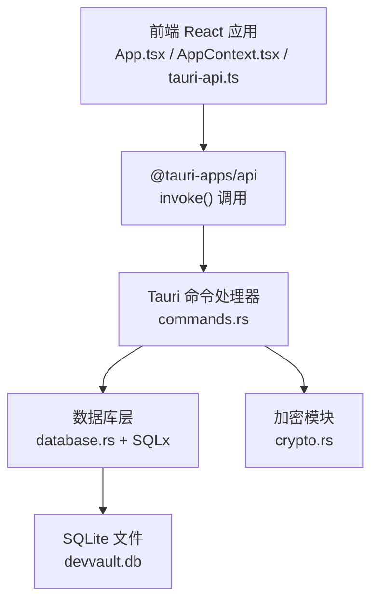
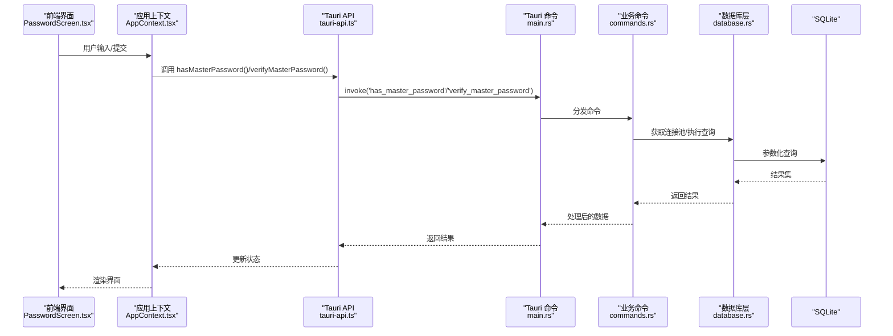
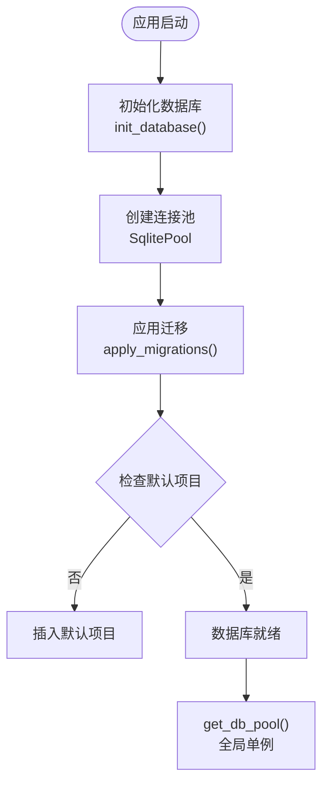
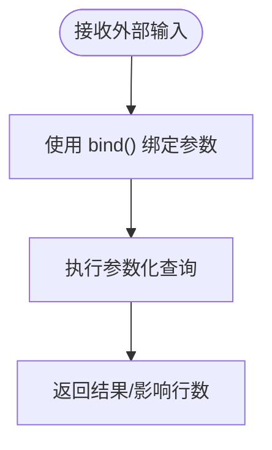
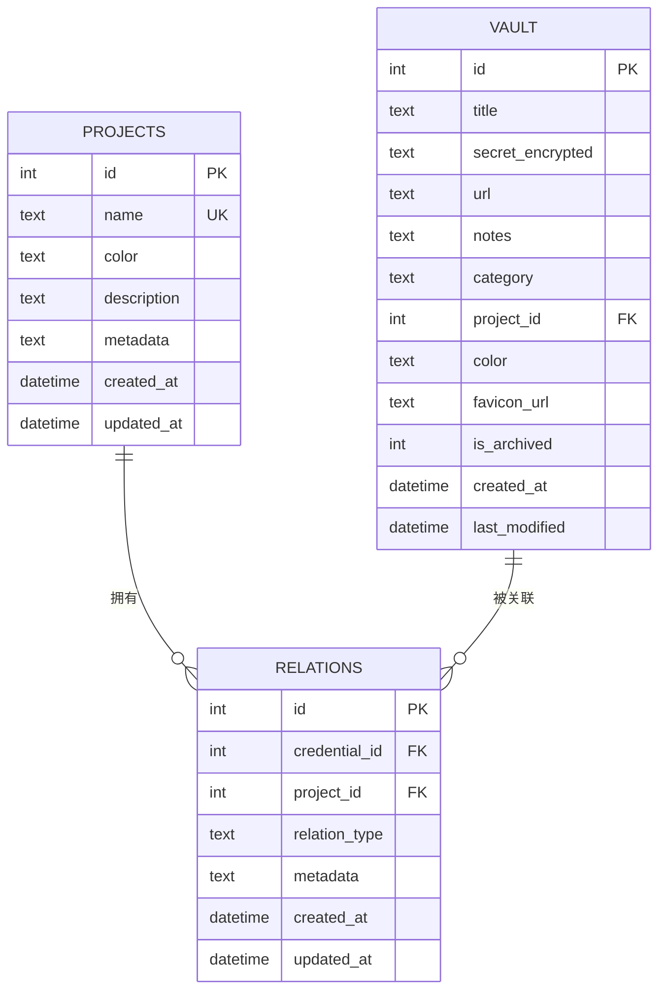
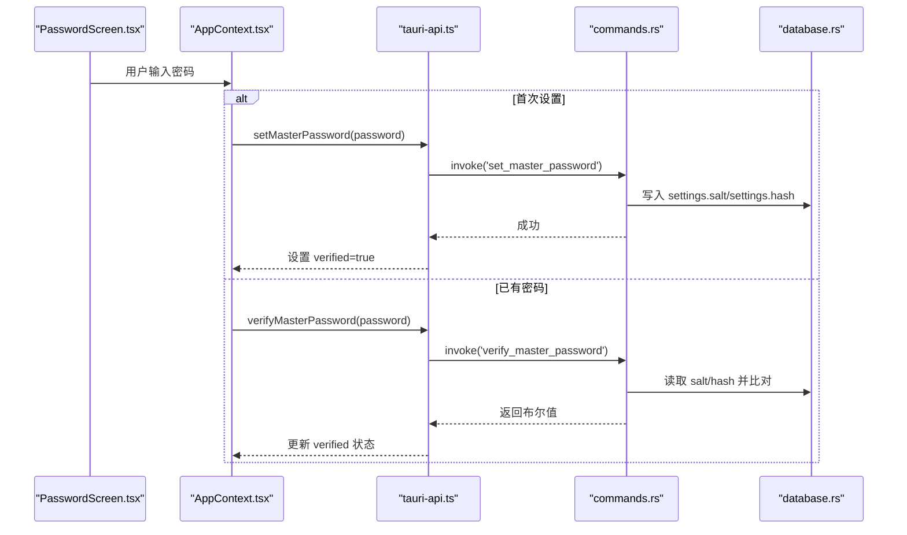
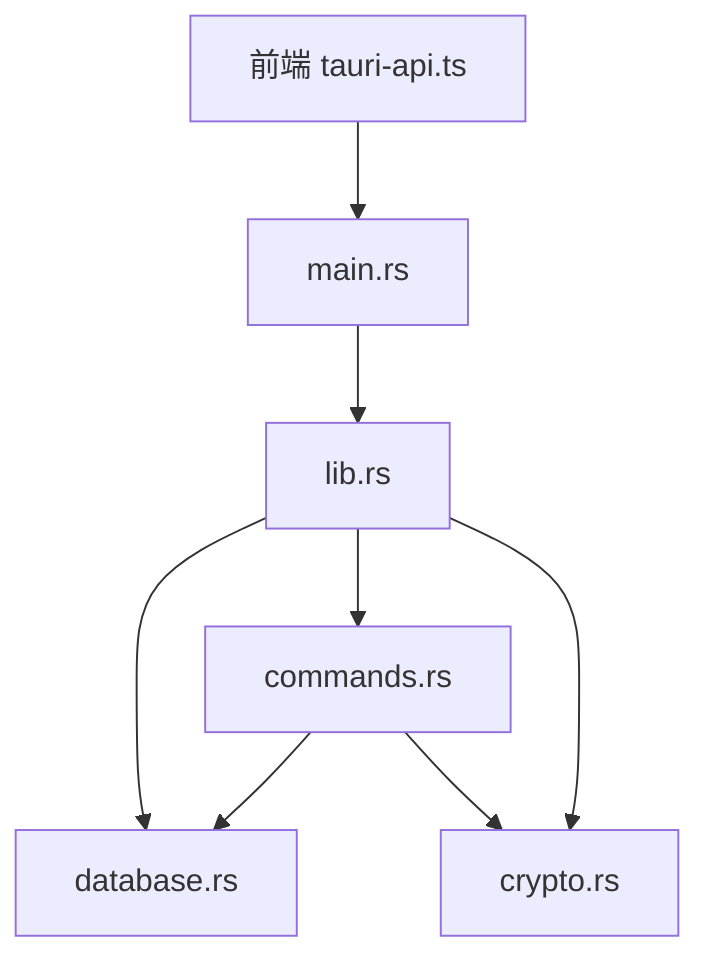

# 访问控制机制

<cite>
**本文档引用的文件**
- [src-tauri/src/main.rs](file://src-tauri/src/main.rs)
- [src-tauri/src/lib.rs](file://src-tauri/src/lib.rs)
- [src-tauri/src/database.rs](file://src-tauri/src/database.rs)
- [src-tauri/src/crypto.rs](file://src-tauri/src/crypto.rs)
- [src-tauri/src/commands.rs](file://src-tauri/src/commands.rs)
- [src-tauri/migrations/001_create_projects_table.sql](file://src-tauri/migrations/001_create_projects_table.sql)
- [src-tauri/migrations/002_create_relations_table.sql](file://src-tauri/migrations/002_create_relations_table.sql)
- [src-tauri/migrations/004_create_api_keys_table.sql](file://src-tauri/migrations/004_create_api_keys_table.sql)
- [src-tauri/Cargo.toml](file://src-tauri/Cargo.toml)
- [src-tauri/tauri.conf.json](file://src-tauri/tauri.conf.json)
- [src/App.tsx](file://src/App.tsx)
- [src/contexts/AppContext.tsx](file://src/contexts/AppContext.tsx)
- [src/lib/tauri-api.ts](file://src/lib/tauri-api.ts)
- [src/components/PasswordScreen.tsx](file://src/components/PasswordScreen.tsx)
</cite>

## 目录
1. [简介](#简介)
2. [项目结构](#项目结构)
3. [核心组件](#核心组件)
4. [架构总览](#架构总览)
5. [详细组件分析](#详细组件分析)
6. [依赖关系分析](#依赖关系分析)
7. [性能考虑](#性能考虑)
8. [故障排除指南](#故障排除指南)
9. [结论](#结论)
10. [附录](#附录)

## 简介
本文件系统性阐述该应用的访问控制机制，覆盖数据库访问权限管理、SQL 查询安全与数据隔离策略；用户身份验证流程、会话管理与权限验证；数据库连接池安全配置、查询参数化与 SQL 注入防护；数据访问日志、审计跟踪与异常监控；访问控制策略、权限模型设计与安全边界；以及配置、权限管理与安全审计的最佳实践。文档以代码为依据，结合可视化图示帮助读者快速理解并落地实施。

## 项目结构
应用采用前后端分离架构：前端使用 React + Tauri API 调用后端命令；后端基于 Rust + Tauri 命令处理业务逻辑，使用 SQLx 连接 SQLite 数据库，并通过迁移脚本维护数据库结构。安全相关的关键点包括：
- 后端命令白名单注册（仅暴露必要命令）
- 数据库连接池全局单例与迁移管理
- 主密码设置与校验（PBKDF2 哈希存储于 settings 表）
- 所有数据库操作均使用参数化查询防止 SQL 注入
- 项目-凭证关联表实现数据隔离与访问边界

图表来源
- [src-tauri/src/main.rs](file://src-tauri/src/main.rs#L24-L57)
- [src-tauri/src/commands.rs](file://src-tauri/src/commands.rs#L1-L572)
- [src-tauri/src/database.rs](file://src-tauri/src/database.rs#L1-L104)
- [src-tauri/src/crypto.rs](file://src-tauri/src/crypto.rs#L1-L92)
- [src-tauri/tauri.conf.json](file://src-tauri/tauri.conf.json#L12-L33)
- [src/App.tsx](file://src/App.tsx#L1-L29)
- [src/contexts/AppContext.tsx](file://src/contexts/AppContext.tsx#L1-L162)
- [src/lib/tauri-api.ts](file://src/lib/tauri-api.ts#L1-L97)

章节来源
- [src-tauri/src/main.rs](file://src-tauri/src/main.rs#L1-L58)
- [src-tauri/tauri.conf.json](file://src-tauri/tauri.conf.json#L1-L33)

## 核心组件
- 命令注册与白名单：后端仅注册必要的命令，避免任意命令执行风险。
- 数据库初始化与连接池：全局单例连接池，启动时完成迁移与默认项目初始化。
- 加密与主密码：PBKDF2 派生主密钥，AES-GCM 加解密，盐值与哈希安全存储。
- 用户认证：前端密码屏进行主密码设置或校验，状态在上下文中持久化。
- 数据隔离：通过项目-凭证关联表限定访问范围，查询时强制按项目过滤。

章节来源
- [src-tauri/src/main.rs](file://src-tauri/src/main.rs#L9-L22)
- [src-tauri/src/database.rs](file://src-tauri/src/database.rs#L13-L52)
- [src-tauri/src/crypto.rs](file://src-tauri/src/crypto.rs#L11-L74)
- [src-tauri/src/commands.rs](file://src-tauri/src/commands.rs#L248-L309)
- [src-tauri/migrations/002_create_relations_table.sql](file://src-tauri/migrations/002_create_relations_table.sql#L1-L16)
- [src/App.tsx](file://src/App.tsx#L7-L19)
- [src/contexts/AppContext.tsx](file://src/contexts/AppContext.tsx#L19-L28)

## 架构总览
下图展示从用户界面到数据库的完整访问链路，以及安全控制点：

图表来源
- [src/components/PasswordScreen.tsx](file://src/components/PasswordScreen.tsx#L14-L61)
- [src/contexts/AppContext.tsx](file://src/contexts/AppContext.tsx#L123-L140)
- [src/lib/tauri-api.ts](file://src/lib/tauri-api.ts#L78-L89)
- [src-tauri/src/main.rs](file://src-tauri/src/main.rs#L24-L57)
- [src-tauri/src/commands.rs](file://src-tauri/src/commands.rs#L272-L309)
- [src-tauri/src/database.rs](file://src-tauri/src/database.rs#L99-L104)

## 详细组件分析

### 数据库访问权限管理与连接池安全
- 全局连接池：使用 OnceCell 存储 SqlitePool，确保进程内唯一且线程安全；提供 get_db_pool() 获取连接，未初始化时返回错误。
- 连接选项：通过 SqliteConnectOptions 创建连接，支持“不存在则创建”；迁移表 _migrations 确保幂等升级。
- 默认项目初始化：若 projects 表为空，插入默认项目，保证最小可用状态。
- 安全边界：所有命令均通过 get_db_pool() 获取连接，避免直接绕过统一入口。

图表来源
- [src-tauri/src/database.rs](file://src-tauri/src/database.rs#L13-L52)
- [src-tauri/src/database.rs](file://src-tauri/src/database.rs#L54-L97)
- [src-tauri/src/database.rs](file://src-tauri/src/database.rs#L99-L104)

章节来源
- [src-tauri/src/database.rs](file://src-tauri/src/database.rs#L1-L104)

### SQL 查询安全与参数化防护
- 统一使用 sqlx::query 并配合 bind() 对参数进行绑定，所有外部输入均通过占位符传入，杜绝字符串拼接引发的 SQL 注入。
- 关键命令示例：
  - 新增/更新/删除凭证项：参数化 INSERT/UPDATE/UPDATE（archive）。
  - 查询项目与统计：参数化 SELECT/JOIN/LIKE。
  - 关系管理：参数化 INSERT/DELETE/SELECT。
  - 导入记录：参数化 SELECT/INSERT/UPDATE。
- LIKE 查询：对搜索关键词使用通配符包裹，避免误注入。

图表来源
- [src-tauri/src/commands.rs](file://src-tauri/src/commands.rs#L41-L64)
- [src-tauri/src/commands.rs](file://src-tauri/src/commands.rs#L101-L125)
- [src-tauri/src/commands.rs](file://src-tauri/src/commands.rs#L175-L210)
- [src-tauri/src/commands.rs](file://src-tauri/src/commands.rs#L312-L339)
- [src-tauri/src/commands.rs](file://src-tauri/src/commands.rs#L395-L435)
- [src-tauri/src/commands.rs](file://src-tauri/src/commands.rs#L527-L572)

章节来源
- [src-tauri/src/commands.rs](file://src-tauri/src/commands.rs#L41-L64)
- [src-tauri/src/commands.rs](file://src-tauri/src/commands.rs#L101-L125)
- [src-tauri/src/commands.rs](file://src-tauri/src/commands.rs#L175-L210)
- [src-tauri/src/commands.rs](file://src-tauri/src/commands.rs#L312-L339)
- [src-tauri/src/commands.rs](file://src-tauri/src/commands.rs#L395-L435)
- [src-tauri/src/commands.rs](file://src-tauri/src/commands.rs#L527-L572)

### 数据隔离策略与访问边界
- 项目-凭证关联表：credential_project_relations 提供凭证与项目的多对多关系，查询时通过 JOIN 限制访问范围。
- 访问边界：
  - 获取项目下的凭证：按 project_id 过滤，避免越权读取。
  - 未关联凭证查询：排除已关联的凭证，确保只看到未归类内容。
  - 删除关系：按 (project_id, credential_id) 精确删除，避免误删。
- 外键约束：CASCADE 删除确保数据一致性。

图表来源
- [src-tauri/migrations/001_create_projects_table.sql](file://src-tauri/migrations/001_create_projects_table.sql#L1-L13)
- [src-tauri/migrations/002_create_relations_table.sql](file://src-tauri/migrations/002_create_relations_table.sql#L1-L16)
- [src-tauri/src/commands.rs](file://src-tauri/src/commands.rs#L395-L435)
- [src-tauri/src/commands.rs](file://src-tauri/src/commands.rs#L438-L473)
- [src-tauri/src/commands.rs](file://src-tauri/src/commands.rs#L476-L487)

章节来源
- [src-tauri/migrations/001_create_projects_table.sql](file://src-tauri/migrations/001_create_projects_table.sql#L1-L13)
- [src-tauri/migrations/002_create_relations_table.sql](file://src-tauri/migrations/002_create_relations_table.sql#L1-L16)
- [src-tauri/src/commands.rs](file://src-tauri/src/commands.rs#L395-L435)
- [src-tauri/src/commands.rs](file://src-tauri/src/commands.rs#L438-L473)
- [src-tauri/src/commands.rs](file://src-tauri/src/commands.rs#L476-L487)

### 用户身份验证流程与会话管理
- 前端流程：
  - 首次使用：显示设置主密码界面，要求确认密码与长度校验。
  - 已设密码：显示解锁界面，调用 verifyMasterPassword 校验。
  - 状态持久化：通过 AppContext 将 masterPasswordVerified 写入全局状态。
- 后端流程：
  - set_master_password：生成随机盐，PBKDF2 哈希密码，分别写入 settings 表的 salt/hash 键。
  - has_master_password：检查 settings 中是否存在 hash 键。
  - verify_master_password：读取 salt/hash，重新计算输入密码哈希并比对。
- 会话管理：无服务端会话状态，采用“本地状态 + 本地数据库”的轻量模式；主密码作为一次性访问令牌，验证成功后进入受保护视图。

图表来源
- [src/components/PasswordScreen.tsx](file://src/components/PasswordScreen.tsx#L30-L61)
- [src/contexts/AppContext.tsx](file://src/contexts/AppContext.tsx#L123-L140)
- [src/lib/tauri-api.ts](file://src/lib/tauri-api.ts#L78-L89)
- [src-tauri/src/commands.rs](file://src-tauri/src/commands.rs#L248-L309)
- [src-tauri/src/database.rs](file://src-tauri/src/database.rs#L13-L52)

章节来源
- [src/components/PasswordScreen.tsx](file://src/components/PasswordScreen.tsx#L1-L146)
- [src/contexts/AppContext.tsx](file://src/contexts/AppContext.tsx#L1-L162)
- [src/lib/tauri-api.ts](file://src/lib/tauri-api.ts#L1-L97)
- [src-tauri/src/commands.rs](file://src-tauri/src/commands.rs#L248-L309)
- [src-tauri/src/database.rs](file://src-tauri/src/database.rs#L13-L52)

### 权限验证机制与命令白名单
- 命令白名单：main.rs 中显式注册所有可调用命令，未注册的命令无法被前端调用。
- 前端调用：tauri-api.ts 封装 invoke 调用，统一命名与参数传递。
- 后端分发：commands.rs 通过 #[command] 属性声明各命令处理函数，集中于单一模块便于审计。

图表来源
- [src-tauri/src/main.rs](file://src-tauri/src/main.rs#L24-L57)
- [src-tauri/src/commands.rs](file://src-tauri/src/commands.rs#L1-L572)
- [src/lib/tauri-api.ts](file://src/lib/tauri-api.ts#L1-L97)

章节来源
- [src-tauri/src/main.rs](file://src-tauri/src/main.rs#L9-L22)
- [src-tauri/src/commands.rs](file://src-tauri/src/commands.rs#L1-L572)
- [src-tauri/tauri.conf.json](file://src-tauri/tauri.conf.json#L12-L33)

### 数据访问日志、审计跟踪与异常监控
- 迁移审计：_migrations 表记录已应用的迁移名称与时间，便于审计与回溯。
- API 可审计性：命令模块集中，便于在命令层增加日志与审计钩子（如记录调用者、参数摘要、时间戳）。
- 异常处理：命令层统一捕获 sqlx::Error 并转换为字符串返回，前端根据布尔值或错误消息进行提示。
- 建议增强：
  - 在 commands.rs 的关键命令中增加结构化日志（如 tracing）。
  - 对敏感操作（如删除、修改）记录审计事件（操作人、对象、时间、结果）。
  - 对异常进行分级上报与告警。

章节来源
- [src-tauri/src/database.rs](file://src-tauri/src/database.rs#L54-L97)
- [src-tauri/src/commands.rs](file://src-tauri/src/commands.rs#L41-L64)
- [src-tauri/src/commands.rs](file://src-tauri/src/commands.rs#L101-L125)

### 访问控制策略、权限模型设计与安全边界
- 策略设计：
  - 最小权限原则：仅暴露必要命令；未注册即不可调用。
  - 数据隔离：通过项目维度隔离凭证，查询时强制 JOIN 与 WHERE 过滤。
  - 机密存储：settings 表存储主密码盐与哈希，不存储明文密码。
- 权限模型：
  - 单用户模型：本地设备上的单一用户，主密码即访问令牌。
  - 项目级访问控制：用户只能看到其所属项目的凭证。
- 安全边界：
  - 前端：仅通过受控 API 调用后端命令。
  - 后端：命令白名单 + 参数化查询 + 连接池统一入口。
  - 数据库：外键约束 + 唯一索引 + 迁移审计。

章节来源
- [src-tauri/src/main.rs](file://src-tauri/src/main.rs#L24-L57)
- [src-tauri/src/commands.rs](file://src-tauri/src/commands.rs#L395-L435)
- [src-tauri/src/database.rs](file://src-tauri/src/database.rs#L13-L52)
- [src-tauri/migrations/002_create_relations_table.sql](file://src-tauri/migrations/002_create_relations_table.sql#L10-L12)

### 访问控制配置、权限管理与安全审计最佳实践
- 配置建议：
  - 保持命令白名单最小化，新增命令需经过安全评审。
  - 连接池参数：根据并发需求调整最大连接数与超时；生产环境启用只读连接池用于查询。
  - 数据库安全：限制 devvault.db 文件权限（仅当前用户可读写），备份时加密存储。
- 权限管理：
  - 项目-凭证关系应定期清理孤儿关系，避免信息泄露。
  - 对高危操作（删除、导入）增加二次确认与审计记录。
- 安全审计：
  - 在命令层增加审计日志，记录操作类型、参数摘要、时间、结果。
  - 对异常与失败尝试进行告警（如连续失败登录）。
  - 定期审查迁移历史与权限变更。

## 依赖关系分析
- 外部依赖：
  - sqlx：异步 SQLite 访问，支持运行时与编译时特性组合。
  - ring：高性能密码学原语（AEAD、PBKDF2）。
  - serde/serde_json：序列化与反序列化。
  - tauri：跨平台桌面框架与命令通道。
- 内部模块耦合：
  - main.rs 依赖 database 与 commands 模块；commands 依赖 database 与 crypto。
  - 前端通过 tauri-api.ts 间接依赖 commands.rs 的命令签名。

图表来源
- [src-tauri/src/main.rs](file://src-tauri/src/main.rs#L1-L58)
- [src-tauri/src/lib.rs](file://src-tauri/src/lib.rs#L1-L4)
- [src-tauri/src/database.rs](file://src-tauri/src/database.rs#L1-L104)
- [src-tauri/src/commands.rs](file://src-tauri/src/commands.rs#L1-L572)
- [src-tauri/src/crypto.rs](file://src-tauri/src/crypto.rs#L1-L92)
- [src/lib/tauri-api.ts](file://src/lib/tauri-api.ts#L1-L97)

章节来源
- [src-tauri/Cargo.toml](file://src-tauri/Cargo.toml#L15-L29)
- [src-tauri/src/lib.rs](file://src-tauri/src/lib.rs#L1-L4)

## 性能考虑
- 连接池：全局单例池减少连接开销；建议根据并发查询量调整池大小与超时。
- 查询优化：为高频字段建立索引（如项目名、关系表的 credential_id/project_id）。
- 参数化查询：避免重复解析与计划生成，提升吞吐量。
- 前端渲染：批量请求与去抖（如搜索）降低后端压力。

## 故障排除指南
- 数据库未初始化：
  - 症状：get_db_pool 返回“未初始化”错误。
  - 排查：确认 init_database 是否在应用启动阶段成功执行。
- 迁移失败：
  - 症状：应用启动时报错或表结构异常。
  - 排查：检查 _migrations 表与各迁移 SQL 的语法；确认数据库文件权限。
- 主密码校验失败：
  - 症状：verifyMasterPassword 返回 false。
  - 排查：确认 settings 表中 salt/hash 是否存在且编码正确；检查 PBKDF2 参数是否一致。
- 命令调用失败：
  - 症状：前端 invoke 报错或无响应。
  - 排查：确认命令已在 main.rs 注册；检查命令签名与参数类型；查看后端日志。

章节来源
- [src-tauri/src/database.rs](file://src-tauri/src/database.rs#L99-L104)
- [src-tauri/src/database.rs](file://src-tauri/src/database.rs#L54-L97)
- [src-tauri/src/commands.rs](file://src-tauri/src/commands.rs#L284-L309)
- [src-tauri/src/main.rs](file://src-tauri/src/main.rs#L24-L57)

## 结论
该应用通过严格的命令白名单、参数化查询、项目-凭证关联与主密码机制构建了清晰的安全边界。数据库层采用连接池与迁移审计保障稳定性与可追溯性。建议在现有基础上进一步完善命令层日志与审计、高危操作的二次确认与告警机制，以满足更严格的安全合规要求。

## 附录
- 数据库迁移清单（摘自迁移文件）：
  - 001_create_projects_table.sql：创建项目表及索引。
  - 002_create_relations_table.sql：创建项目-凭证关联表及外键、索引。
  - 003_create_imports_table.sql：导入记录表（由迁移文件存在可见）。
  - 004_create_api_keys_table.sql：API 密钥注册表及索引。
  - 005_migrate_vault_relations.sql：迁移脚本（由迁移文件存在可见）。

章节来源
- [src-tauri/migrations/001_create_projects_table.sql](file://src-tauri/migrations/001_create_projects_table.sql#L1-L13)
- [src-tauri/migrations/002_create_relations_table.sql](file://src-tauri/migrations/002_create_relations_table.sql#L1-L16)
- [src-tauri/migrations/004_create_api_keys_table.sql](file://src-tauri/migrations/004_create_api_keys_table.sql#L1-L13)