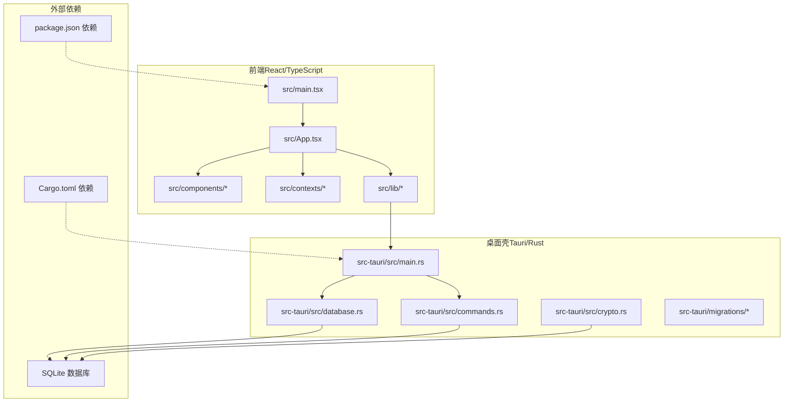
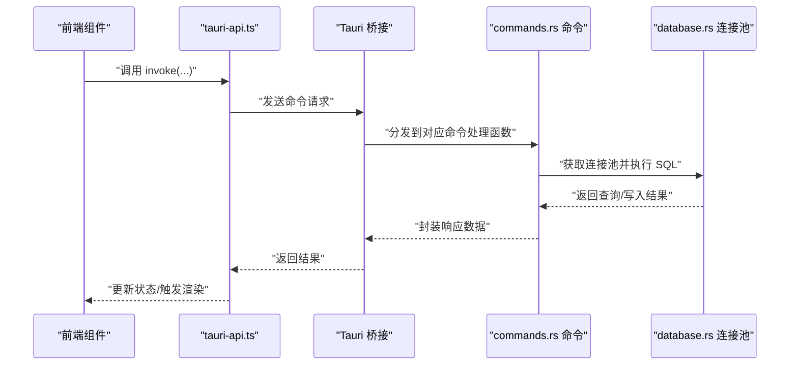
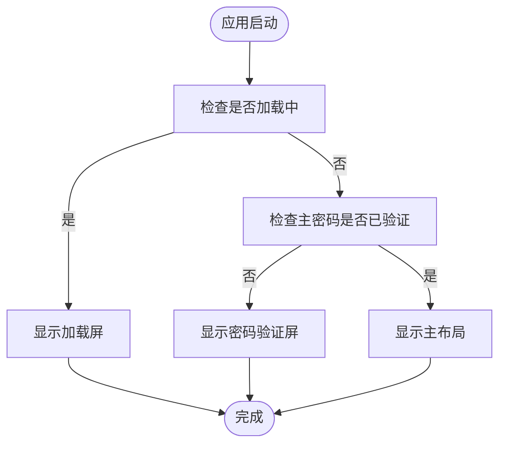
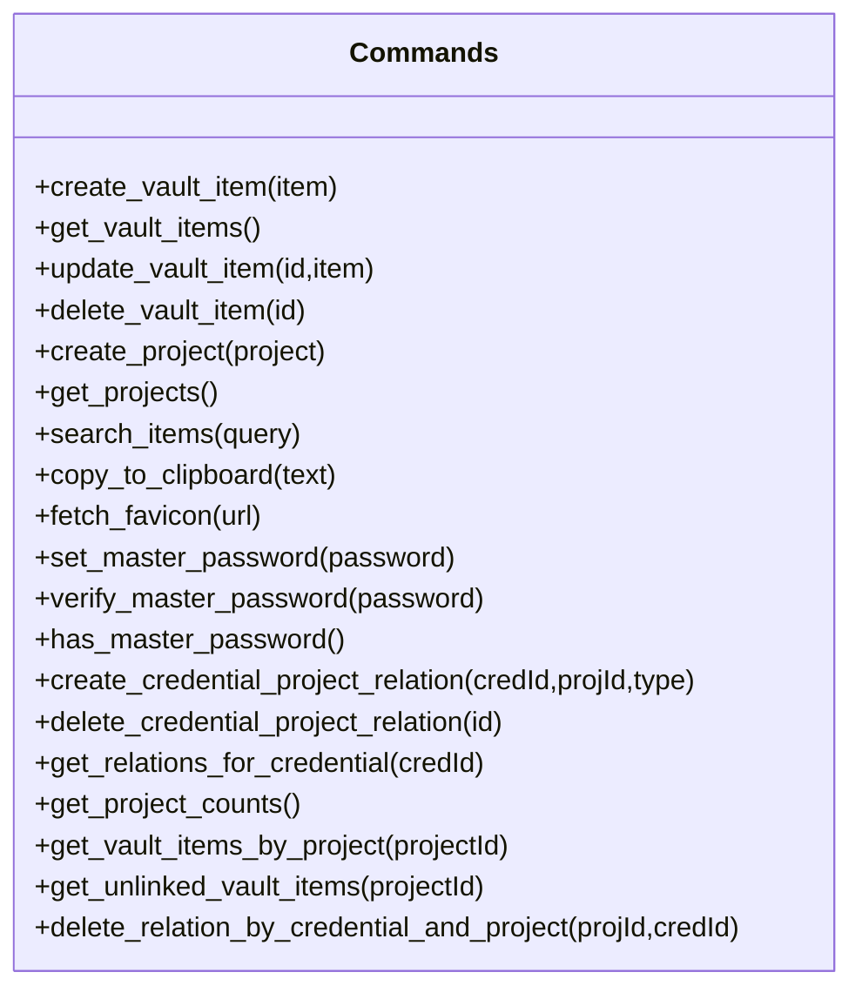
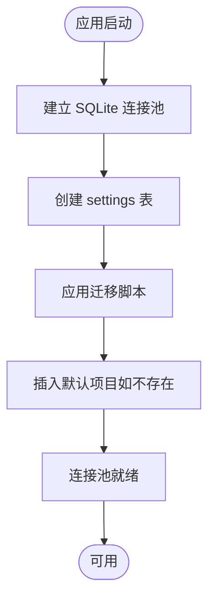
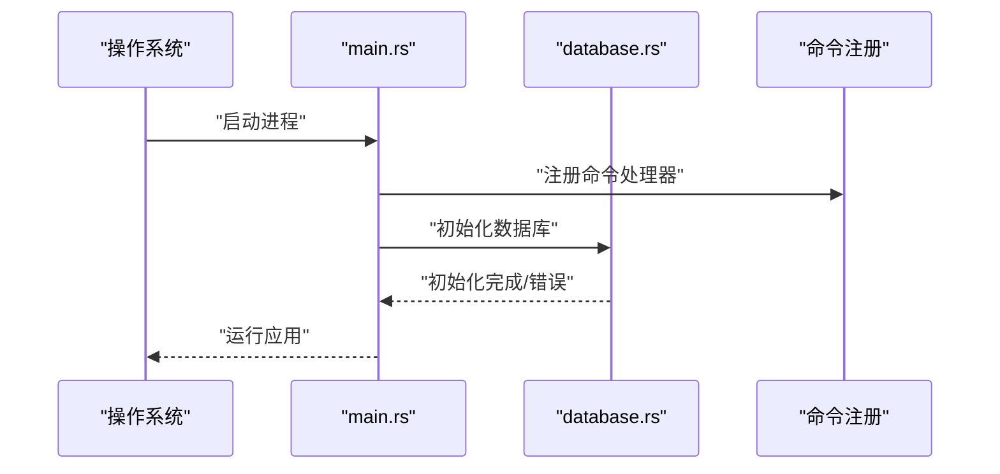
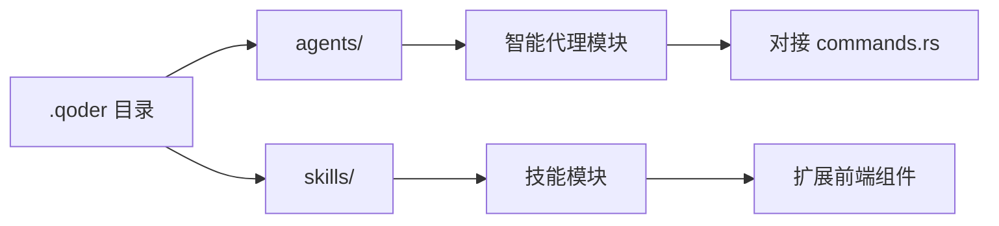
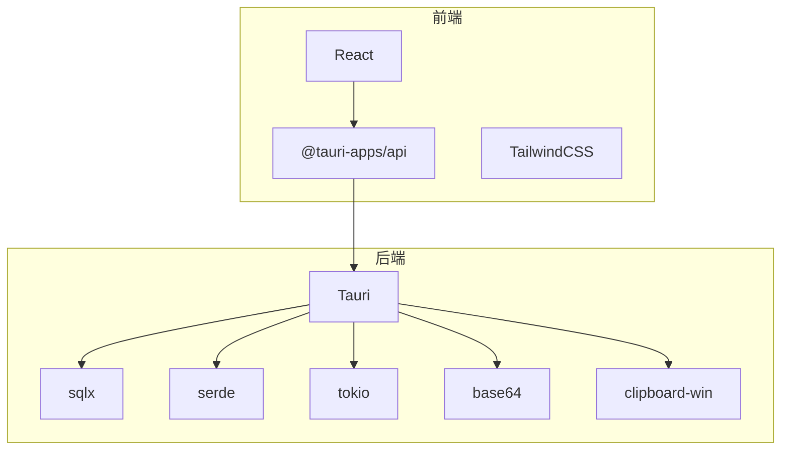

# 开发工具

<cite>
**本文引用的文件**
- [package.json](file://package.json)
- [Cargo.toml](file://src-tauri/Cargo.toml)
- [.qoder 目录结构](file://.qoder)
- [开发文档索引](file://docs/dev/README.md)
- [主入口（Rust）](file://src-tauri/src/main.rs)
- [命令处理（Rust）](file://src-tauri/src/commands.rs)
- [数据库初始化（Rust）](file://src-tauri/src/database.rs)
- [应用入口（React）](file://src/main.tsx)
- [应用组件（React）](file://src/App.tsx)
</cite>

## 目录
1. [简介](#简介)
2. [项目结构](#项目结构)
3. [核心组件](#核心组件)
4. [架构总览](#架构总览)
5. [详细组件分析](#详细组件分析)
6. [依赖分析](#依赖分析)
7. [性能考虑](#性能考虑)
8. [故障排查指南](#故障排查指南)
9. [结论](#结论)
10. [附录](#附录)

## 简介
本文件面向“AIpassword”项目的开发与维护者，系统化梳理.qoder开发工具与辅助功能的架构与实现，重点覆盖以下方面：
- 后端与前端的整体架构与职责边界
- Rust/Tauri 后端命令层、数据库层与加密层
- React/TypeScript 前端上下文、布局与组件
- 开发流程优化工具、调试辅助与测试支持
- 开发环境配置、代码生成与自动化脚本
- 开发工作流程、版本控制策略与协作规范
- CI/CD 集成、自动化测试与部署流程
- 开发效率提升技巧、代码质量保证与性能分析
- 团队协作指南与知识分享机制

## 项目结构
项目采用“前端 + 桌面壳（Tauri/Rust）”双栈架构：
- 前端：React + TypeScript，负责用户界面与交互逻辑
- 后端：Tauri + Rust，负责系统命令、数据库访问、加密与平台能力
- 数据层：SQLite（通过 sqlx），配合迁移脚本与全局设置表
- 开发工具：Vite + TypeScript + TailwindCSS，构建与样式体系

**图表来源**
- [应用入口（React）](file://src/main.tsx#L1-L10)
- [应用组件（React）](file://src/App.tsx#L1-L29)
- [主入口（Rust）](file://src-tauri/src/main.rs#L1-L51)
- [命令处理（Rust）](file://src-tauri/src/commands.rs#L1-L487)
- [数据库初始化（Rust）](file://src-tauri/src/database.rs#L1-L104)
- [package.json](file://package.json#L1-L32)
- [Cargo.toml](file://src-tauri/Cargo.toml#L1-L34)

**章节来源**
- [package.json](file://package.json#L1-L32)
- [Cargo.toml](file://src-tauri/Cargo.toml#L1-L34)
- [开发文档索引](file://docs/dev/README.md#L287-L341)

## 核心组件
- 前端应用入口与路由控制
  - 应用入口负责挂载 React 根节点与全局样式
  - 应用组件根据状态切换加载屏、密码验证屏与主布局
- 上下文与布局
  - AppProvider 提供全局状态与业务上下文
  - MainLayout 作为页面骨架，承载侧边栏、工具栏与内容区
- Tauri 命令层
  - 统一注册命令处理器，提供凭证、项目、关系、搜索、剪贴板、图标、主密码等能力
- 数据库层
  - 初始化 SQLite 连接池，应用迁移脚本，确保基础表与默认数据存在
- 加密与安全
  - 提供主密码设置、校验与盐值存储；后续可扩展更多加密能力

**章节来源**
- [应用入口（React）](file://src/main.tsx#L1-L10)
- [应用组件（React）](file://src/App.tsx#L1-L29)
- [主入口（Rust）](file://src-tauri/src/main.rs#L21-L50)
- [命令处理（Rust）](file://src-tauri/src/commands.rs#L40-L310)
- [数据库初始化（Rust）](file://src-tauri/src/database.rs#L13-L52)

## 架构总览
整体采用“前端驱动 + 桌面壳桥接”的模式：
- 前端通过 @tauri-apps/api 发起 invoke 调用
- Tauri 在原生侧注册命令处理器，执行数据库操作、系统能力调用与加密逻辑
- 数据通过 sqlx 与 SQLite 交互，迁移脚本保障数据库演进

**图表来源**
- [主入口（Rust）](file://src-tauri/src/main.rs#L21-L49)
- [命令处理（Rust）](file://src-tauri/src/commands.rs#L40-L245)
- [数据库初始化（Rust）](file://src-tauri/src/database.rs#L99-L104)

## 详细组件分析

### 前端组件与上下文
- 应用入口负责根节点挂载与全局样式引入
- 应用组件依据状态分支：加载中、未验证主密码、主界面
- 上下文提供全局状态管理，便于在组件树中共享数据与行为

**图表来源**
- [应用组件（React）](file://src/App.tsx#L7-L19)

**章节来源**
- [应用入口（React）](file://src/main.tsx#L1-L10)
- [应用组件（React）](file://src/App.tsx#L1-L29)

### Tauri 命令层（commands.rs）
- 凭证相关命令：创建、查询、更新、删除凭证
- 项目相关命令：创建、查询、按项目筛选、统计
- 关系相关命令：凭证与项目多对多关系的创建、删除、查询
- 辅助命令：搜索、复制到剪贴板、抓取 Favicon、主密码设置/校验/存在性判断
- 返回值统一使用 Result 类型，便于前端捕获错误

**图表来源**
- [命令处理（Rust）](file://src-tauri/src/commands.rs#L40-L487)

**章节来源**
- [命令处理（Rust）](file://src-tauri/src/commands.rs#L1-L487)

### 数据库层（database.rs）
- 初始化 SQLite 连接池，创建 settings 基础表
- 应用 V2 迁移脚本，确保表结构与默认数据一致
- 提供全局连接池获取方法，避免重复初始化

**图表来源**
- [数据库初始化（Rust）](file://src-tauri/src/database.rs#L13-L52)

**章节来源**
- [数据库初始化（Rust）](file://src-tauri/src/database.rs#L1-L104)

### 主入口（main.rs）
- 注册所有命令处理器
- 应用启动时异步初始化数据库
- 运行 Tauri 应用

**图表来源**
- [主入口（Rust）](file://src-tauri/src/main.rs#L21-L50)
- [数据库初始化（Rust）](file://src-tauri/src/database.rs#L13-L52)

**章节来源**
- [主入口（Rust）](file://src-tauri/src/main.rs#L1-L51)

### .qoder 开发工具与辅助功能
- 当前仓库中“.qoder”目录存在，但其内部 agents 与 skills 子目录暂为空，尚未包含具体实现文件
- 建议在该目录下按“智能代理（agents）+ 技能（skills）”的分层结构进行模块化组织，以便与现有命令层、前端组件形成松耦合的扩展点
- 可将 .qoder 作为“开发工具与辅助功能”的统一入口，后续逐步沉淀 AI 辅助开发能力

**图表来源**
- [.qoder 目录结构](file://.qoder)

**章节来源**
- [.qoder 目录结构](file://.qoder)

## 依赖分析
- 前端依赖
  - React 生态、@tauri-apps/api、TailwindCSS 等
- 后端依赖
  - Tauri、sqlx（SQLite）、serde、tokio、ring/base64、clipboard-win 等
- 运行时
  - 通过 package.json 的脚本与 Vite 构建前端，Tauri CLI 管理桌面壳

**图表来源**
- [package.json](file://package.json#L13-L31)
- [Cargo.toml](file://src-tauri/Cargo.toml#L15-L28)

**章节来源**
- [package.json](file://package.json#L1-L32)
- [Cargo.toml](file://src-tauri/Cargo.toml#L1-L34)

## 性能考虑
- 数据库访问
  - 使用连接池减少连接开销；避免在热路径上执行大查询
  - 对高频查询建立必要索引（如按标题/URL/备注模糊查询）
- 剪贴板与系统调用
  - 平台特定能力（如 Windows 剪贴板）需注意错误处理与降级
- 前端渲染
  - 合理拆分组件与懒加载；避免不必要的重渲染
- 构建与打包
  - 使用 Vite 的按需加载与 Tree-shaking；生产构建开启压缩与缓存

## 故障排查指南
- 编译与依赖
  - 检查 Cargo.toml 与 package.json 的版本一致性
  - 使用 cargo update 与 npm install 更新依赖
- 数据库初始化失败
  - 确认 SQLite 文件权限与路径；查看迁移脚本是否成功执行
- 剪贴板不可用
  - 确认平台支持与权限；检查命令返回的错误信息
- 前端无法调用命令
  - 检查命令是否在 main.rs 中注册；确认 invoke 调用签名一致

**章节来源**
- [开发文档索引](file://docs/dev/README.md#L462-L489)

## 结论
本项目以清晰的前后端分层与 Tauri/Rust 后端为核心，具备良好的扩展性与可维护性。结合 .qoder 的后续建设，可在不破坏现有架构的前提下，引入 AI 辅助开发工具与技能模块，进一步提升开发效率与代码质量。

## 附录

### 开发工作流程与协作规范
- 设计阶段：阅读对应功能文档，理解 API 契约与数据模型
- 后端开发：在 commands.rs 添加命令，必要时新增模块并在 main.rs 注册
- 前端开发：创建/修改组件与 hooks，并在 tauri-api.ts 中暴露新 API
- 集成测试：使用 npm run dev:tauri 启动开发服务器，逐项验证
- 代码审查：检查风格一致性、错误处理与性能
- 文档更新：更新 ROADMAP、CHANGELOG 与 API 文档

**章节来源**
- [开发文档索引](file://docs/dev/README.md#L343-L378)

### 版本控制策略与发布
- 分支策略：feature/* 开发，release/* 发布，hotfix/* 修复
- 提交规范：feat/fix/docs/chore 前缀，简明描述变更
- 标签与发布：语义化版本号，配套变更日志

**章节来源**
- [开发文档索引](file://docs/dev/README.md#L420-L441)

### CI/CD 集成与自动化测试
- 构建：Vite + Tauri CLI，分别执行前端构建与桌面壳构建
- 测试：单元与集成测试脚本，覆盖命令层与关键 UI
- 部署：根据目标平台生成安装包，支持自动上传与发布

**章节来源**
- [package.json](file://package.json#L6-L11)
- [开发文档索引](file://docs/dev/README.md#L380-L417)

### 开发效率提升技巧
- 使用 VS Code 调试器分别调试前端与后端
- 借助 Tauri Devtools 与浏览器开发者工具定位问题
- 通过迁移脚本与默认数据快速回滚与复现

**章节来源**
- [开发文档索引](file://docs/dev/README.md#L483-L487)

### 代码质量保证与性能分析
- 代码格式：Rust 使用 cargo fmt；前端使用 ESLint/Prettier
- 编译检查：cargo check；TypeScript 类型检查
- 性能分析：前端使用 React Profiler；后端使用 tokio-console 或日志采样

**章节来源**
- [开发文档索引](file://docs/dev/README.md#L436-L438)