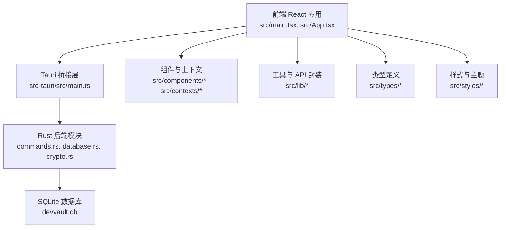
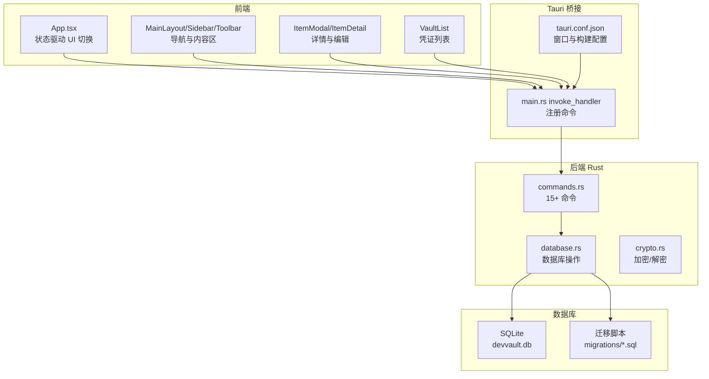
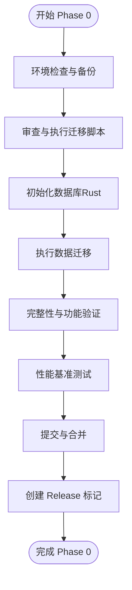
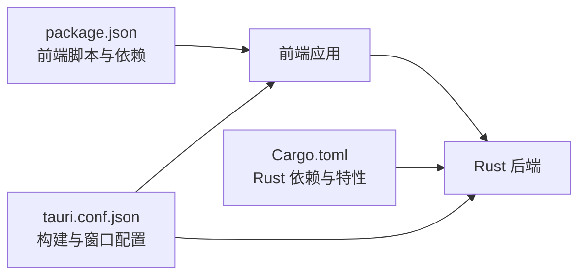

# 开发路线图

<cite>
**本文引用的文件**
- [package.json](file://package.json)
- [Cargo.toml](file://src-tauri/Cargo.toml)
- [main.tsx](file://src/main.tsx)
- [App.tsx](file://src/App.tsx)
- [main.rs](file://src-tauri/src/main.rs)
- [tauri.conf.json](file://src-tauri/tauri.conf.json)
- [PHASE_0_STARTUP_GUIDE.md](file://docs/development/PHASE_0_STARTUP_GUIDE.md)
- [IMPLEMENTATION_PLAN_V2_UPDATED.md](file://docs/development/IMPLEMENTATION_PLAN_V2_UPDATED.md)
- [FEATURE_ANALYSIS_SERVER_CREDENTIALS.md](file://docs/development/FEATURE_ANALYSIS_SERVER_CREDENTIALS.md)
- [ARCHITECTURE_REDESIGN_V2.md](file://docs/development/ARCHITECTURE_REDESIGN_V2.md)
- [MIGRATION_AND_IMPACT_ANALYSIS.md](file://docs/development/MIGRATION_AND_IMPACT_ANALYSIS.md)
- [FINAL_CONFIRMATION_V2.md](file://docs/development/FINAL_CONFIRMATION_V2.md)
- [ARCHITECTURE_QUICK_REFERENCE.md](file://docs/development/ARCHITECTURE_QUICK_REFERENCE.md)
</cite>

## 目录
1. [简介](#简介)
2. [项目结构](#项目结构)
3. [核心组件](#核心组件)
4. [架构总览](#架构总览)
5. [详细组件分析](#详细组件分析)
6. [依赖分析](#依赖分析)
7. [性能考量](#性能考量)
8. [故障排查指南](#故障排查指南)
9. [结论](#结论)
10. [附录](#附录)

## 简介
本开发路线图面向 AIpassword（DevVault）项目，系统梳理当前开发状态、阶段性里程碑与功能演进路径，明确技术债务管理、架构演进与性能优化计划，并给出新功能开发优先级、资源配置与时间安排。同时涵盖风险评估、变更管理与适应性调整策略，解释社区贡献与开源协作机制，分析市场趋势与用户需求对项目的影响，并提出长期愿景、商业模式与可持续发展策略。

## 项目结构
AIpassword 采用前端 React + Tauri 的桌面应用架构，前端负责 UI 与交互，后端 Rust 负责本地数据库、加密与系统能力调用，通过 Tauri 暴露命令接口供前端调用。构建与打包由 Vite/Tauri CLI 驱动，配置集中在 tauri.conf.json 与 package.json/Cargo.toml。

图表来源
- [main.tsx](file://src/main.tsx#L1-L10)
- [App.tsx](file://src/App.tsx#L1-L29)
- [main.rs](file://src-tauri/src/main.rs#L1-L51)
- [tauri.conf.json](file://src-tauri/tauri.conf.json#L1-L33)

章节来源
- [package.json](file://package.json#L1-L32)
- [Cargo.toml](file://src-tauri/Cargo.toml#L1-L34)
- [main.tsx](file://src/main.tsx#L1-L10)
- [App.tsx](file://src/App.tsx#L1-L29)
- [main.rs](file://src-tauri/src/main.rs#L1-L51)
- [tauri.conf.json](file://src-tauri/tauri.conf.json#L1-L33)

## 核心组件
- 前端入口与路由控制：React 根节点与应用容器负责加载全局样式、上下文提供者与主界面；根据应用状态在“加载屏”“主密码输入”“主布局”之间切换。
- Tauri 启动与命令注册：在应用启动时初始化数据库，注册后端命令（凭证、项目、关系、导入、剪贴板等），统一暴露给前端调用。
- 配置与构建：前端通过 Vite 构建，Tauri 配置 devPath/distDir、窗口属性与产品信息；Rust 侧声明依赖（SQLx、Tokio、Serde、加密库等）。

章节来源
- [main.tsx](file://src/main.tsx#L1-L10)
- [App.tsx](file://src/App.tsx#L1-L29)
- [main.rs](file://src-tauri/src/main.rs#L21-L50)
- [tauri.conf.json](file://src-tauri/tauri.conf.json#L2-L32)
- [package.json](file://package.json#L6-L11)
- [Cargo.toml](file://src-tauri/Cargo.toml#L15-L28)

## 架构总览
当前处于 V2 架构过渡阶段，核心目标是建立“独立信息模型”，将凭证与项目解耦，引入 N:N 关联表，支持跨项目共享、Chrome 导入历史与 API 密钥注册等能力。数据库迁移与命令实现构成 Phase 0 与 Phase 1 的关键产出，后续再推进前端 UI 重构与高级功能。

图表来源
- [App.tsx](file://src/App.tsx#L1-L29)
- [main.rs](file://src-tauri/src/main.rs#L8-L49)
- [tauri.conf.json](file://src-tauri/tauri.conf.json#L1-L33)
- [PHASE_0_STARTUP_GUIDE.md](file://docs/development/PHASE_0_STARTUP_GUIDE.md#L96-L146)

章节来源
- [App.tsx](file://src/App.tsx#L1-L29)
- [main.rs](file://src-tauri/src/main.rs#L8-L49)
- [tauri.conf.json](file://src-tauri/tauri.conf.json#L1-L33)
- [PHASE_0_STARTUP_GUIDE.md](file://docs/development/PHASE_0_STARTUP_GUIDE.md#L1-L477)

## 详细组件分析

### 阶段一：基础设施与数据库迁移（Phase 0）
- 目标：完成 V2 架构数据库表结构重设计与数据迁移，建立 projects、credential_project_relations、chrome_imported_passwords 等新表，清理旧依赖字段，确保数据一致性与可回滚。
- 关键产出：迁移脚本、Rust 初始化函数、数据库完整性校验、应用启动验证。
- 风险与回滚：提供完整回滚计划，包含数据库锁定、迁移后崩溃、数据丢失与性能下降等场景的处置方案。

图表来源
- [PHASE_0_STARTUP_GUIDE.md](file://docs/development/PHASE_0_STARTUP_GUIDE.md#L23-L359)

章节来源
- [PHASE_0_STARTUP_GUIDE.md](file://docs/development/PHASE_0_STARTUP_GUIDE.md#L1-L477)

### 阶段二：后端 API 与命令实现（Phase 1）
- 目标：实现 15+ Tauri 命令，覆盖凭证 CRUD、项目管理、关联管理、Chrome 导入与链接、剪贴板操作等；配套 Rust 数据结构与单元测试。
- 关键产出：commands.rs 命令实现、models.rs 数据结构、数据库操作封装、测试用例。
- 验收标准：所有命令可用、关联管理正常、单元测试通过。

章节来源
- [IMPLEMENTATION_PLAN_V2_UPDATED.md](file://docs/development/IMPLEMENTATION_PLAN_V2_UPDATED.md#L167-L479)

### 阶段三：前端 UI 框架与导航重构（Phase 2）
- 目标：建立新的导航结构与视图体系，支持凭证库、项目、导入、API 密钥等视图切换；更新 AppContext 与上下文状态管理。
- 关键产出：MainLayout、Sidebar、四大视图组件、样式与布局适配。
- 验收标准：新导航可用、视图可切换、项目管理基本功能就绪。

章节来源
- [IMPLEMENTATION_PLAN_V2_UPDATED.md](file://docs/development/IMPLEMENTATION_PLAN_V2_UPDATED.md#L485-L609)

### 阶段四：凭证管理 UI（服务器/数据库/服务）（Phase 3）
- 目标：实现服务器、数据库、服务等类型凭证的专用表单、列表与详情面板，支持类型特定字段与验证。
- 关键产出：ServerCredential、DatabaseCredential、ServiceCredential 组件与模态框。
- 验收标准：所有凭证类型表单可用、详情面板显示类型特定字段、CRUD 完整。

章节来源
- [IMPLEMENTATION_PLAN_V2_UPDATED.md](file://docs/development/IMPLEMENTATION_PLAN_V2_UPDATED.md#L612-L642)
- [FEATURE_ANALYSIS_SERVER_CREDENTIALS.md](file://docs/development/FEATURE_ANALYSIS_SERVER_CREDENTIALS.md#L521-L566)

### 阶段五：高级功能与优化（Phase 4/5）
- 目标：高级搜索与过滤、跨项目搜索、标签管理、收藏、导出、连接测试、性能优化、测试覆盖、文档与发布。
- 关键产出：搜索过滤、连接测试、导出、性能优化、测试与文档、v0.3.0 发布。
- 验收标准：性能指标达标、100% 功能测试通过、文档完整、版本发布。

章节来源
- [IMPLEMENTATION_PLAN_V2_UPDATED.md](file://docs/development/IMPLEMENTATION_PLAN_V2_UPDATED.md#L645-L774)

### 服务器与数据库凭证功能分析（P1 扩展）
- 目标：在现有密码管理基础上，扩展服务器、数据库与通用服务凭证的完整生命周期管理，支持说明区域、项目关联、环境标记与连接测试。
- 影响范围：数据模型（扩展 vault_items）、UI 结构（标签页 + 增强 Sidebar）、数据库模式与迁移策略。
- 安全与审计：敏感字段加密、访问控制、审计日志记录。

章节来源
- [FEATURE_ANALYSIS_SERVER_CREDENTIALS.md](file://docs/development/FEATURE_ANALYSIS_SERVER_CREDENTIALS.md#L1-L800)

## 依赖分析
- 前端依赖：React、React DOM、TailwindCSS、Lucide React、clsx、tailwind-merge；构建工具链由 Vite 与 TypeScript 支撑。
- 后端依赖：Tauri（clipboard 等）、Serde、SQLx（SQLite、Tokio、TLS）、Tokio（异步运行时）、ring/base64、uuid、reqwest/url、once_cell、clipboard-win。
- 配置依赖：tauri.conf.json 控制窗口尺寸、产品名称、构建路径与资源；package.json 与 Cargo.toml 分别管理前端与后端脚本与依赖。

图表来源
- [package.json](file://package.json#L6-L31)
- [Cargo.toml](file://src-tauri/Cargo.toml#L12-L34)
- [tauri.conf.json](file://src-tauri/tauri.conf.json#L2-L32)

章节来源
- [package.json](file://package.json#L1-L32)
- [Cargo.toml](file://src-tauri/Cargo.toml#L1-L34)
- [tauri.conf.json](file://src-tauri/tauri.conf.json#L1-L33)

## 性能考量
- 数据库层面：为新表与关联字段建立索引，执行 EXPLAIN QUERY PLAN 分析慢查询，定期 ANALYZE 统计信息；避免在大表上进行全表扫描。
- 前端层面：组件懒加载、虚拟滚动（针对大量凭证列表）、减少不必要的重渲染、按需加载图标与样式。
- 后端层面：异步 I/O（Tokio）、连接池复用、批量操作（导入/导出）、最小化序列化开销。
- 构建与打包：启用生产构建、Tree-shaking、按需引入样式与图标，减少首屏体积。

## 故障排查指南
- 数据库被锁定：确保应用未运行、无其他进程占用、清理 WAL/SHM 文件后重试。
- 迁移后应用崩溃：回滚至备份、检查外键与列类型、确认 NOT NULL 默认值。
- 数据迁移后数据丢失：检查孤儿凭证查询结果、使用备份恢复、复查迁移逻辑条件。
- 性能下降：检查缺失索引、执行查询计划分析、添加必要索引并更新统计信息。

章节来源
- [PHASE_0_STARTUP_GUIDE.md](file://docs/development/PHASE_0_STARTUP_GUIDE.md#L362-L417)

## 结论
AIpassword 当前正处在 V2 架构的关键过渡期，通过 Phase 0 的数据库迁移与初始化、Phase 1 的命令实现，以及后续的前端重构与高级功能，将形成一套可扩展、可审计、可团队协作的凭证管理体系。建议严格遵循阶段验收标准与回滚策略，持续进行性能优化与测试覆盖，确保高质量交付与可持续演进。

## 附录

### 阶段里程碑与时间安排
- Phase 0（基础设施与迁移）：约 4 小时，完成新表创建、数据迁移与验证。
- Phase 1（后端 API）：约 8 小时，实现 15+ 命令与单元测试。
- Phase 2（前端 UI 框架）：约 8 小时，导航与视图重构。
- Phase 3（凭证 UI）：约 10 小时，服务器/数据库/服务专用组件。
- Phase 4（高级功能）：约 6 小时，搜索/过滤/导出/连接测试。
- Phase 5（优化与发布）：约 6 小时，性能优化、测试覆盖、文档与发布。

章节来源
- [IMPLEMENTATION_PLAN_V2_UPDATED.md](file://docs/development/IMPLEMENTATION_PLAN_V2_UPDATED.md#L681-L739)

### 技术债务管理与架构演进
- 债务识别：旧版一对一项目关联、混合导入与凭证存储、缺乏跨项目共享与审计能力。
- 演进策略：采用独立信息模型与 N:N 关联，逐步迁移历史数据，保持向后兼容，完善索引与查询优化。
- 文档与回溯：保留 V1 文档作为历史参考，更新至 V2 实施计划与架构文档。

章节来源
- [PHASE_0_STARTUP_GUIDE.md](file://docs/development/PHASE_0_STARTUP_GUIDE.md#L421-L431)
- [ARCHITECTURE_REDESIGN_V2.md](file://docs/development/ARCHITECTURE_REDESIGN_V2.md)
- [MIGRATION_AND_IMPACT_ANALYSIS.md](file://docs/development/MIGRATION_AND_IMPACT_ANALYSIS.md)
- [FINAL_CONFIRMATION_V2.md](file://docs/development/FINAL_CONFIRMATION_V2.md)
- [ARCHITECTURE_QUICK_REFERENCE.md](file://docs/development/ARCHITECTURE_QUICK_REFERENCE.md)

### 风险评估与变更管理
- 风险等级：低（Phase 0 包含完整回滚计划）；中等（迁移与命令实现期间的回归风险）。
- 变更策略：分阶段交付、每阶段提交 PR、代码审查与测试覆盖；变更影响分析与回滚预案。
- 适应性调整：根据测试反馈与用户反馈动态调整优先级与实现细节。

章节来源
- [PHASE_0_STARTUP_GUIDE.md](file://docs/development/PHASE_0_STARTUP_GUIDE.md#L5-L7)
- [MIGRATION_AND_IMPACT_ANALYSIS.md](file://docs/development/MIGRATION_AND_IMPACT_ANALYSIS.md)

### 社区贡献与开源协作
- 贡献方式：通过 Pull Request 提交功能与修复，遵循代码风格与测试要求；使用文档与实施计划作为协作依据。
- 协作机制：在 GitHub 上创建 PR，附带变更说明与测试验证；保持清晰的提交历史与标签管理。

章节来源
- [PHASE_0_STARTUP_GUIDE.md](file://docs/development/PHASE_0_STARTUP_GUIDE.md#L323-L338)

### 市场趋势与用户需求
- 趋势：企业级凭证管理强调合规、审计与团队协作；跨项目共享、环境隔离与连接测试成为关键能力。
- 需求：除密码外，服务器、数据库与服务凭证的全生命周期管理；说明区域与变更日志提升可追溯性；项目关联与环境标记满足多环境与多团队场景。

章节来源
- [FEATURE_ANALYSIS_SERVER_CREDENTIALS.md](file://docs/development/FEATURE_ANALYSIS_SERVER_CREDENTIALS.md#L11-L25)

### 长期愿景、商业模式与可持续发展
- 愿景：打造跨平台、可审计、可扩展的企业级凭证管理平台，支持团队协作与合规要求。
- 商业模式：开源免费 + 企业版订阅（高级功能、审计与集成），通过生态合作与周边工具实现价值闭环。
- 可持续发展：持续迭代架构与性能、强化安全与合规、建设开发者与用户社区、完善文档与培训资源。