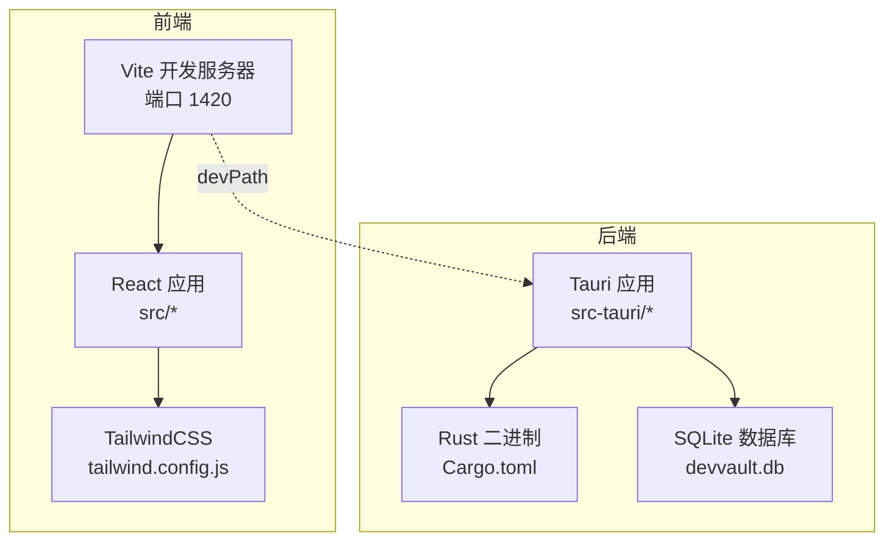
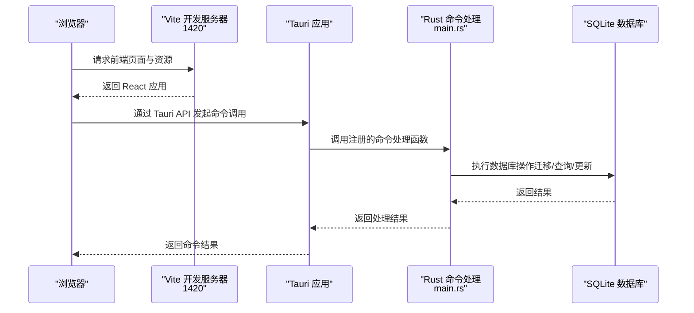
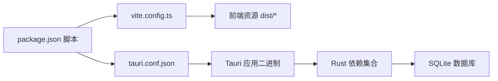

# 快速开始

<cite>
**本文引用的文件**
- [package.json](file://package.json)
- [vite.config.ts](file://vite.config.ts)
- [src-tauri/tauri.conf.json](file://src-tauri/tauri.conf.json)
- [src-tauri/Cargo.toml](file://src-tauri/Cargo.toml)
- [src-tauri/build.rs](file://src-tauri/build.rs)
- [src-tauri/src/main.rs](file://src-tauri/src/main.rs)
- [src/main.tsx](file://src/main.tsx)
- [src/App.tsx](file://src/App.tsx)
- [tsconfig.json](file://tsconfig.json)
- [tailwind.config.js](file://tailwind.config.js)
- [postcss.config.js](file://postcss.config.js)
- [docs/dev/PHASE_0_STARTUP_GUIDE.md](file://docs/dev/PHASE_0_STARTUP_GUIDE.md)
- [QUICK_DIAGNOSIS.md](file://QUICK_DIAGNOSIS.md)
- [src-tauri/migrations/001_create_projects_table.sql](file://src-tauri/migrations/001_create_projects_table.sql)
</cite>

## 目录
1. [简介](#简介)
2. [项目结构](#项目结构)
3. [核心组件](#核心组件)
4. [架构总览](#架构总览)
5. [详细组件分析](#详细组件分析)
6. [依赖分析](#依赖分析)
7. [性能考虑](#性能考虑)
8. [故障排除指南](#故障排除指南)
9. [结论](#结论)
10. [附录](#附录)

## 简介
本指南面向新手开发者，帮助你在最短时间内完成 AIpassword（DevVault）项目的环境搭建、首次运行与基础开发流程。你将学到如何安装 Node.js、Rust 工具链与 Tauri 框架，如何启动开发服务器、如何构建桌面应用，并掌握常见问题的排查方法。

## 项目结构
该项目采用前端（React + Vite）与后端（Rust + Tauri）分离的双层架构：
- 前端位于 src 目录，使用 React 与 TailwindCSS，通过 Vite 开发服务器提供页面与资源。
- 后端位于 src-tauri 目录，使用 Rust 语言与 Tauri 框架，负责系统窗口、原生能力（如剪贴板）、数据库与业务逻辑。
- 构建产物 dist 目录由 Vite 生成，Tauri 在打包时指向该目录作为前端静态资源。

图表来源
- [vite.config.ts](file://vite.config.ts#L13-L20)
- [src-tauri/tauri.conf.json](file://src-tauri/tauri.conf.json#L2-L6)
- [src-tauri/Cargo.toml](file://src-tauri/Cargo.toml#L15-L28)

章节来源
- [package.json](file://package.json#L6-L11)
- [vite.config.ts](file://vite.config.ts#L1-L21)
- [src-tauri/tauri.conf.json](file://src-tauri/tauri.conf.json#L1-L33)

## 核心组件
- 前端开发与构建
  - 使用 Vite 作为开发服务器与打包工具，端口固定为 1420，避免与 Tauri 默认端口冲突。
  - React 18 与 TailwindCSS 提供 UI 能力，PostCSS 自动化处理。
- Tauri 应用
  - 通过 tauri.conf.json 配置开发与构建参数，前端入口地址为 http://localhost:1420。
  - Rust 侧通过 main.rs 注册命令（如数据库、加密、剪贴板等），并在启动时初始化数据库。
- 数据库与迁移
  - 使用 SQLite，迁移脚本位于 src-tauri/migrations，包含项目表等结构。
- 包管理与脚本
  - package.json 提供 dev、build、tauri、tauri:dev、tauri:build 等脚本，便于一键启动与构建。

章节来源
- [package.json](file://package.json#L6-L11)
- [vite.config.ts](file://vite.config.ts#L13-L20)
- [src-tauri/tauri.conf.json](file://src-tauri/tauri.conf.json#L2-L6)
- [src-tauri/src/main.rs](file://src-tauri/src/main.rs#L21-L50)
- [src-tauri/migrations/001_create_projects_table.sql](file://src-tauri/migrations/001_create_projects_table.sql#L1-L13)

## 架构总览
下图展示了从浏览器到 Rust 后端的请求路径，以及数据库与资源的交互关系。

图表来源
- [src-tauri/tauri.conf.json](file://src-tauri/tauri.conf.json#L2-L6)
- [src-tauri/src/main.rs](file://src-tauri/src/main.rs#L21-L50)
- [src-tauri/migrations/001_create_projects_table.sql](file://src-tauri/migrations/001_create_projects_table.sql#L1-L13)

## 详细组件分析

### 前端启动与开发服务器
- 固定端口与忽略规则
  - Vite 配置固定端口 1420，严格模式下若端口被占用则启动失败；同时忽略对 src-tauri 的监听，避免不必要的热更新。
- 开发脚本
  - package.json 中提供 dev 脚本用于启动 Vite 开发服务器；Tauri 开发模式下由 tauri.conf.json 的 beforeDevCommand 指向 npm run dev。
- 入口与渲染
  - src/main.tsx 负责挂载 React 应用；src/App.tsx 根据应用状态决定渲染密码屏、加载屏或主布局。

章节来源
- [vite.config.ts](file://vite.config.ts#L13-L20)
- [src-tauri/tauri.conf.json](file://src-tauri/tauri.conf.json#L3-L5)
- [package.json](file://package.json#L7)
- [src/main.tsx](file://src/main.tsx#L1-L10)
- [src/App.tsx](file://src/App.tsx#L1-L29)

### Tauri 应用与命令注册
- 命令注册
  - main.rs 中集中注册了多个命令（如创建/查询/更新/删除凭证、项目关系、剪贴板、主密码设置与校验等），统一由 Tauri 的 invoke_handler 管理。
- 启动流程
  - 应用启动时异步初始化数据库，若失败会在控制台输出错误信息。
- 构建与打包
  - tauri.conf.json 指定开发前置命令与构建目标目录，Rust 侧通过 tauri_build::build() 完成资源与配置处理。

章节来源
- [src-tauri/src/main.rs](file://src-tauri/src/main.rs#L21-L50)
- [src-tauri/tauri.conf.json](file://src-tauri/tauri.conf.json#L2-L6)
- [src-tauri/build.rs](file://src-tauri/build.rs#L1-L3)

### 数据库与迁移
- 迁移脚本
  - 项目包含多张迁移表的 SQL 脚本，例如创建 projects 表与索引，确保数据库结构满足 V2 架构需求。
- 启动初始化
  - 应用启动时会尝试初始化数据库，若迁移脚本缺失或执行失败，需先补齐迁移文件并确保编译通过。

章节来源
- [src-tauri/migrations/001_create_projects_table.sql](file://src-tauri/migrations/001_create_projects_table.sql#L1-L13)
- [src-tauri/src/main.rs](file://src-tauri/src/main.rs#L40-L47)

### 样式与主题
- TailwindCSS
  - tailwind.config.js 定义了颜色、字体、动画等主题变量，content 指向 HTML 与 src 目录，确保按需生成样式。
- PostCSS
  - postcss.config.js 配置了 TailwindCSS 与 Autoprefixer 插件，保证样式兼容性与现代化特性。

章节来源
- [tailwind.config.js](file://tailwind.config.js#L1-L46)
- [postcss.config.js](file://postcss.config.js#L1-L6)

### TypeScript 与模块解析
- tsconfig.json
  - 使用 bundler 模块解析，启用严格模式与无副作用的 JSX 转换，确保类型安全与构建效率。

章节来源
- [tsconfig.json](file://tsconfig.json#L1-L25)

## 依赖分析
- 前端依赖
  - React 与 React DOM 提供 UI 渲染；@tauri-apps/api 提供前端与原生能力通信；TailwindCSS 生态与 Vite 配合实现样式与开发体验。
- Rust 依赖
  - Tauri 提供窗口与系统 API；sqlx 提供 SQLite 异步访问；ring/base64 提供加密与编码；reqwest/url 提供网络能力；clipboard-win 提供剪贴板支持。
- 构建链路
  - package.json 的 tauri:dev/tauri:build 脚本与 tauri.conf.json 的 devPath、distDir 配置共同驱动前端与后端的协同开发与打包。

图表来源
- [package.json](file://package.json#L6-L11)
- [vite.config.ts](file://vite.config.ts#L1-L21)
- [src-tauri/tauri.conf.json](file://src-tauri/tauri.conf.json#L1-L33)
- [src-tauri/Cargo.toml](file://src-tauri/Cargo.toml#L15-L28)

章节来源
- [package.json](file://package.json#L13-L31)
- [src-tauri/Cargo.toml](file://src-tauri/Cargo.toml#L15-L28)

## 性能考虑
- 开发服务器端口固定与严格模式有助于减少端口冲突与资源浪费。
- TailwindCSS 按需生成样式，结合 PostCSS 优化输出体积。
- 数据库迁移与查询应避免在主线程阻塞，保持 UI 流畅。

## 故障排除指南
以下为常见安装与运行问题的定位与修复建议：

- 编译阻塞问题（P0 级）
  - base64 Engine trait 未导入：在 Rust 源文件中添加对应导入，以修复编码/解码调用。
  - clipboard-win 依赖版本冲突：统一使用 clipboard-win 5.x API 或移除重复依赖，确保 set_string 调用一致。
  - icon.png 文件缺失：在 src-tauri/icons 目录创建占位图标文件，或复制现有尺寸图标。
  - build.rs 跳过 Tauri 编译：恢复 tauri_build::build() 调用，确保资源与配置被正确处理。
- 编译后功能问题
  - AppContext 初始化逻辑错误：使用 hasMasterPassword() 区分“未设置密码”与“验证失败”，修正初始状态判断。
  - PasswordScreen 逻辑调整：根据 hasMasterPassword() 结果决定展示设置或输入界面。
- 数据库相关
  - SQLite 数据库被锁定：关闭应用与可能的后台进程，清理 .db-shm 与 .db-wal 文件后重试。
  - 迁移后应用崩溃：回滚备份、检查外键与列类型、确保 NOT NULL 字段具备默认值。
  - 数据迁移后数据丢失：检查 orphan_credentials 查询结果，必要时恢复备份并复查迁移逻辑。
- 性能问题
  - 查询变慢：检查缺失索引并补充，执行 ANALYZE 更新统计信息。

章节来源
- [QUICK_DIAGNOSIS.md](file://QUICK_DIAGNOSIS.md#L1-L221)
- [docs/dev/PHASE_0_STARTUP_GUIDE.md](file://docs/dev/PHASE_0_STARTUP_GUIDE.md#L362-L417)

## 结论
通过本指南，你可以完成从环境准备到首次运行的全流程。建议先修复编译阻塞问题，再逐步完善功能逻辑与数据库迁移，最终使用 tauri:dev 启动开发模式，使用 tauri:build 生成可分发包。遇到问题时，优先参考故障排除章节与相关文档。

## 附录

### 环境要求与安装步骤
- Node.js
  - 安装稳定版 Node.js（含 npm），确保 npm 可用。
- Rust 工具链
  - 安装 Rust（使用 rustup），确保 cargo 可用。
- Tauri 依赖（Windows）
  - 安装 Windows SDK 与相关构建工具，确保 Tauri 能生成可执行文件。
- 项目依赖
  - 在项目根目录执行依赖安装，安装前端与 CLI 依赖。

章节来源
- [package.json](file://package.json#L21-L31)
- [src-tauri/Cargo.toml](file://src-tauri/Cargo.toml#L1-L34)

### 首次运行指导
- 启动前端开发服务器
  - 执行前端开发脚本，等待 Vite 启动并监听 1420 端口。
- 启动 Tauri 应用
  - 执行 Tauri 开发脚本，Tauri 将连接到前端开发服务器并加载应用。
- 首次进入应用
  - 若未设置主密码，将进入设置流程；若已设置，则进入密码验证流程。

章节来源
- [package.json](file://package.json#L7-L11)
- [src-tauri/tauri.conf.json](file://src-tauri/tauri.conf.json#L3-L5)
- [src-tauri/src/main.rs](file://src-tauri/src/main.rs#L40-L47)

### 构建流程
- 前端构建
  - 执行前端构建脚本，生成 dist 目录下的静态资源。
- 应用打包
  - 执行 Tauri 打包脚本，Tauri 读取 dist 目录并生成桌面应用安装包。

章节来源
- [package.json](file://package.json#L8-L11)
- [src-tauri/tauri.conf.json](file://src-tauri/tauri.conf.json#L4-L6)

### 基本使用示例
- 设置/验证主密码
  - 通过前端调用 Tauri 命令设置或验证主密码，应用状态将随之变化。
- 数据库初始化
  - 应用启动时自动初始化数据库，确保迁移脚本齐全且可执行。

章节来源
- [src-tauri/src/main.rs](file://src-tauri/src/main.rs#L40-L47)
- [src-tauri/migrations/001_create_projects_table.sql](file://src-tauri/migrations/001_create_projects_table.sql#L1-L13)