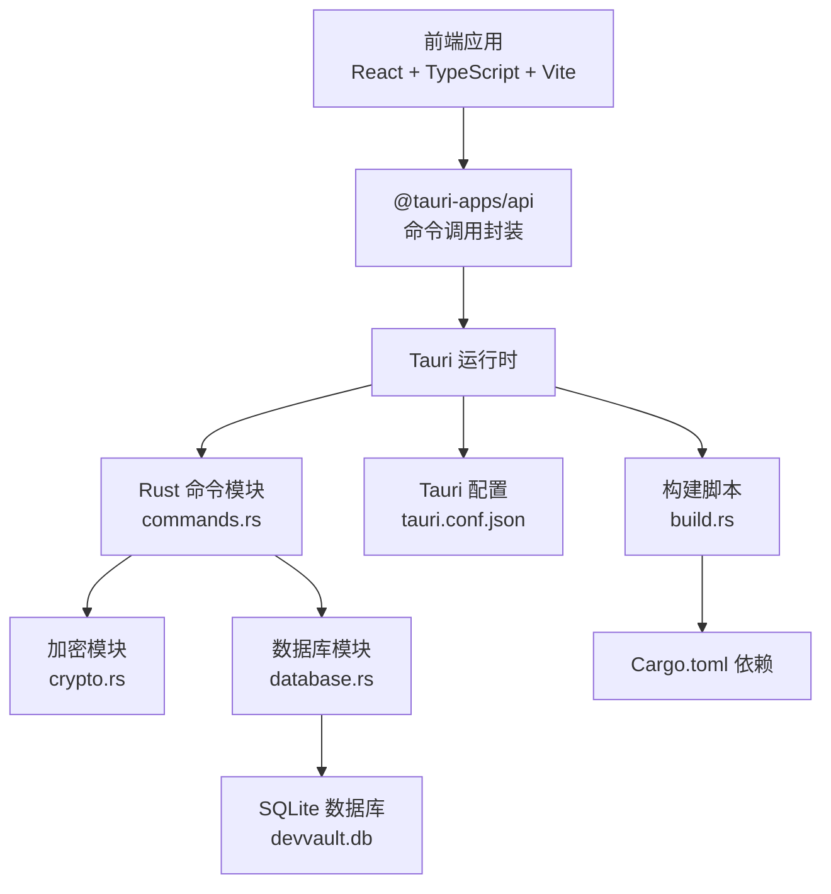
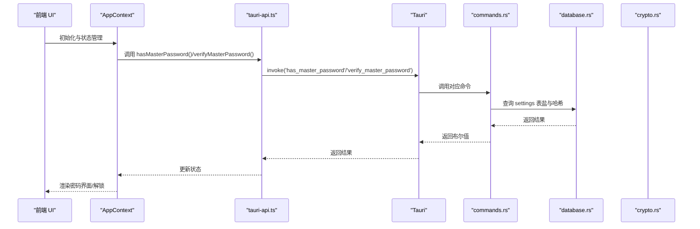
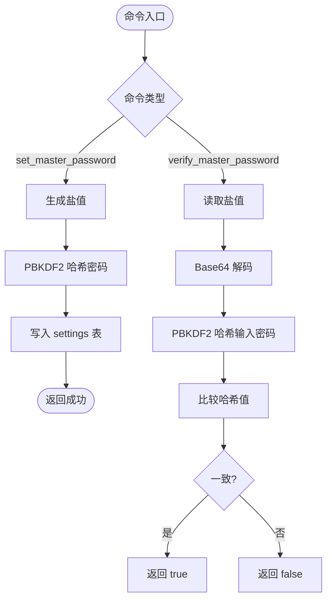
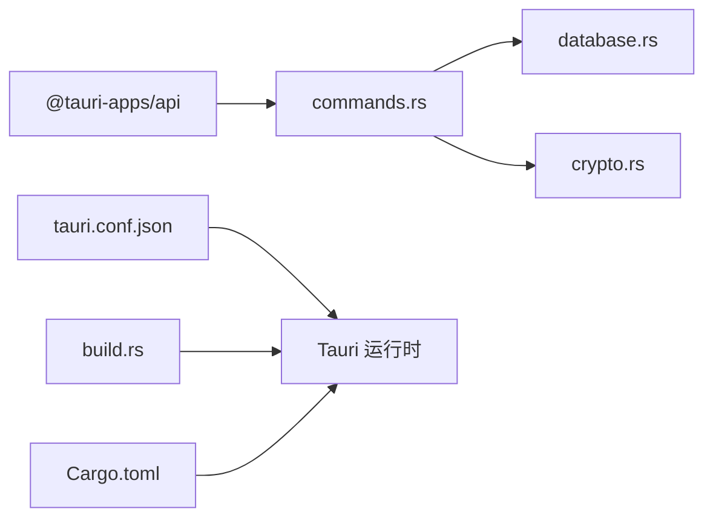

# 故障排除与维护

<cite>
**本文引用的文件**
- [QUICK_DIAGNOSIS.md](file://QUICK_DIAGNOSIS.md)
- [BUG_ANALYSIS.md](file://BUG_ANALYSIS.md)
- [TEST_REPORT.md](file://TEST_REPORT.md)
- [Cargo.toml](file://src-tauri/Cargo.toml)
- [tauri.conf.json](file://src-tauri/tauri.conf.json)
- [main.rs](file://src-tauri/src/main.rs)
- [commands.rs](file://src-tauri/src/commands.rs)
- [database.rs](file://src-tauri/src/database.rs)
- [crypto.rs](file://src-tauri/src/crypto.rs)
- [build.rs](file://src-tauri/build.rs)
- [AppContext.tsx](file://src/contexts/AppContext.tsx)
- [PasswordScreen.tsx](file://src/components/PasswordScreen.tsx)
- [tauri-api.ts](file://src/lib/tauri-api.ts)
- [package.json](file://package.json)
</cite>

## 目录
1. [简介](#简介)
2. [项目结构](#项目结构)
3. [核心组件](#核心组件)
4. [架构总览](#架构总览)
5. [详细组件分析](#详细组件分析)
6. [依赖关系分析](#依赖关系分析)
7. [性能考虑](#性能考虑)
8. [故障排除指南](#故障排除指南)
9. [结论](#结论)
10. [附录](#附录)

## 简介
本指南面向维护者与开发者，围绕 AIpassword/Tauri 桌面应用的故障排除、系统监控、日志分析、性能调优、维护流程、更新策略、升级注意事项、故障恢复、数据备份与灾难恢复、问题分类与优先级、用户反馈与改进、系统瓶颈与容量规划、以及维护工具与自动化脚本进行系统化说明。内容基于仓库中的诊断报告、问题分析、测试报告与源码实现，确保可操作性与可追溯性。

## 项目结构
项目采用 Tauri + React + TypeScript 前后端分离架构：
- 前端：React + TypeScript + Vite，通过 @tauri-apps/api 调用后端命令
- 后端：Rust + Tauri，提供命令接口、数据库连接池、加密与迁移
- 配置：tauri.conf.json 控制窗口、打包与开发路径；Cargo.toml 管理 Rust 依赖；build.rs 触发 Tauri 构建流程

图表来源
- [main.rs](file://src-tauri/src/main.rs#L21-L51)
- [commands.rs](file://src-tauri/src/commands.rs#L1-L487)
- [database.rs](file://src-tauri/src/database.rs#L1-L104)
- [crypto.rs](file://src-tauri/src/crypto.rs#L1-L92)
- [tauri.conf.json](file://src-tauri/tauri.conf.json#L1-L33)
- [build.rs](file://src-tauri/build.rs#L1-L3)
- [Cargo.toml](file://src-tauri/Cargo.toml#L1-L34)

章节来源
- [package.json](file://package.json#L1-L32)
- [tauri.conf.json](file://src-tauri/tauri.conf.json#L1-L33)

## 核心组件
- 命令层：提供凭据增删改查、项目管理、关系管理、剪贴板复制、Favicon 获取、主密码设置/校验等命令
- 数据库层：SQLite 连接池、迁移管理、默认项目初始化、全局连接池缓存
- 加密层：PBKDF2 + AES-256-GCM，支持盐生成、密码哈希与数据加解密
- 前端上下文与屏幕：主密码校验流程、数据刷新与搜索、状态管理
- 构建与配置：Tauri 构建流程、图标资源、开发/生产路径

章节来源
- [commands.rs](file://src-tauri/src/commands.rs#L40-L310)
- [database.rs](file://src-tauri/src/database.rs#L13-L52)
- [crypto.rs](file://src-tauri/src/crypto.rs#L76-L92)
- [AppContext.tsx](file://src/contexts/AppContext.tsx#L123-L140)
- [PasswordScreen.tsx](file://src/components/PasswordScreen.tsx#L14-L28)

## 架构总览
下图展示了从前端到后端、再到数据库与加密的整体调用链路与关键节点。

图表来源
- [AppContext.tsx](file://src/contexts/AppContext.tsx#L123-L140)
- [tauri-api.ts](file://src/lib/tauri-api.ts#L70-L76)
- [commands.rs](file://src-tauri/src/commands.rs#L272-L309)
- [database.rs](file://src-tauri/src/database.rs#L99-L104)

## 详细组件分析

### 命令模块（commands.rs）
- 职责：暴露 Tauri 命令，处理凭据、项目、关系、剪贴板、Favicon、主密码等业务逻辑
- 关键点：
  - 主密码设置/校验使用 base64::Engine 与 PBKDF2 + AES-256-GCM
  - 剪贴板复制在 Windows 平台使用 clipboard-win API
  - 数据查询与更新均通过数据库连接池执行

图表来源
- [commands.rs](file://src-tauri/src/commands.rs#L248-L309)
- [crypto.rs](file://src-tauri/src/crypto.rs#L82-L92)

章节来源
- [commands.rs](file://src-tauri/src/commands.rs#L248-L309)
- [crypto.rs](file://src-tauri/src/crypto.rs#L76-L92)

### 数据库模块（database.rs）
- 职责：初始化 SQLite 连接池、应用迁移、默认项目插入、提供全局连接池
- 关键点：
  - 迁移表 _migrations 记录已应用迁移，保证幂等
  - 默认项目在首次启动时插入
  - 连接池通过 OnceCell 缓存，避免重复初始化

章节来源
- [database.rs](file://src-tauri/src/database.rs#L13-L52)
- [database.rs](file://src-tauri/src/database.rs#L54-L97)
- [database.rs](file://src-tauri/src/database.rs#L99-L104)

### 加密模块（crypto.rs）
- 职责：提供 PBKDF2 密钥派生、AES-256-GCM 加解密、盐生成与密码哈希
- 关键点：
  - PBKDF2 迭代次数与盐长度固定
  - 加解密输出 Base64 编码，便于持久化
  - 使用 ring 库实现 AEAD 加密

章节来源
- [crypto.rs](file://src-tauri/src/crypto.rs#L7-L74)
- [crypto.rs](file://src-tauri/src/crypto.rs#L76-L92)

### 前端上下文与密码界面（AppContext.tsx、PasswordScreen.tsx）
- 职责：前端状态管理、数据刷新、搜索、主密码校验流程控制
- 关键点：
  - 初始化时调用 hasMasterPassword() 判断是否需要设置或验证密码
  - 密码界面根据状态切换“设置密码”或“输入密码”流程
  - 错误处理与加载状态管理

章节来源
- [AppContext.tsx](file://src/contexts/AppContext.tsx#L123-L140)
- [PasswordScreen.tsx](file://src/components/PasswordScreen.tsx#L14-L28)
- [PasswordScreen.tsx](file://src/components/PasswordScreen.tsx#L30-L61)

### 构建与配置（build.rs、tauri.conf.json、Cargo.toml）
- 职责：触发 Tauri 构建流程、定义窗口属性、开发/生产路径、依赖版本
- 关键点：
  - build.rs 必须调用 tauri_build::build()，否则图标与资源编译会被跳过
  - tauri.conf.json 控制 devPath、distDir、窗口尺寸与打包配置
  - Cargo.toml 管理 Rust 依赖，包括 clipboard-win 版本冲突

章节来源
- [build.rs](file://src-tauri/build.rs#L1-L3)
- [tauri.conf.json](file://src-tauri/tauri.conf.json#L1-L33)
- [Cargo.toml](file://src-tauri/Cargo.toml#L15-L28)

## 依赖关系分析
- 前端依赖：@tauri-apps/api、React、TailwindCSS 等
- 后端依赖：tauri、sqlx、ring、base64、reqwest、clipboard-win 等
- 关键耦合：
  - commands.rs 依赖 database.rs 与 crypto.rs
  - 前端通过 tauri-api.ts 调用 commands.rs 暴露的命令
  - 构建阶段依赖 build.rs 与 tauri.conf.json

图表来源
- [tauri-api.ts](file://src/lib/tauri-api.ts#L1-L84)
- [commands.rs](file://src-tauri/src/commands.rs#L1-L8)
- [database.rs](file://src-tauri/src/database.rs#L1-L5)
- [crypto.rs](file://src-tauri/src/crypto.rs#L1-L5)
- [tauri.conf.json](file://src-tauri/tauri.conf.json#L1-L33)
- [build.rs](file://src-tauri/build.rs#L1-L3)
- [Cargo.toml](file://src-tauri/Cargo.toml#L15-L28)

章节来源
- [package.json](file://package.json#L13-L31)
- [Cargo.toml](file://src-tauri/Cargo.toml#L15-L28)

## 性能考虑
- 数据库连接池：通过 OnceCell 缓存连接池，减少重复初始化开销
- 查询与索引：建议为常用查询字段建立索引（如 vault 的 title/url/notes），降低 LIKE 查询成本
- 迁移幂等：迁移表 _migrations 确保重复部署不会重复执行
- 剪贴板操作：Windows 平台使用 clipboard-win API，注意异步与错误处理
- 前端渲染：合理拆分组件与懒加载，避免一次性渲染大量数据

章节来源
- [database.rs](file://src-tauri/src/database.rs#L5-L51)
- [commands.rs](file://src-tauri/src/commands.rs#L175-L210)

## 故障排除指南

### 一、编译阻塞问题（P0 级）
- base64 Engine trait 未导入
  - 症状：编译报错提示 encode/decode 方法不存在
  - 修复：添加 use base64::Engine 导入
  - 影响范围：主密码盐值编码/解码
  - 参考路径：src-tauri/src/commands.rs
- clipboard-win 依赖版本冲突
  - 症状：clipboard-win API 不兼容（不同版本参数差异）
  - 修复：统一到 clipboard-win 5.4.x，并使用 set_clipboard_string API
  - 参考路径：src-tauri/src/commands.rs、src-tauri/Cargo.toml
- icon.png 文件缺失
  - 症状：Tauri generate_context!() 无法读取图标
  - 修复：创建占位符或复制现有 32x32.png
  - 参考路径：src-tauri/icons/
- build.rs 跳过 Tauri 编译
  - 症状：proc macro panic，资源编译失败
  - 修复：恢复 tauri_build::build() 调用
  - 参考路径：src-tauri/build.rs

章节来源
- [QUICK_DIAGNOSIS.md](file://QUICK_DIAGNOSIS.md#L3-L76)
- [BUG_ANALYSIS.md](file://BUG_ANALYSIS.md#L13-L71)
- [TEST_REPORT.md](file://TEST_REPORT.md#L120-L126)

### 二、编译后功能问题（P1 级）
- Row trait 未使用警告
  - 现象：导入但标记未使用，实际在多处使用
  - 处理：保留导入或忽略警告
  - 参考路径：src-tauri/src/database.rs
- AppContext 初始化逻辑错误
  - 症状：用空字符串验证无法区分“密码未设置”和“验证失败”
  - 修复：改为调用 hasMasterPassword() 判断
  - 参考路径：src/contexts/AppContext.tsx
- PasswordScreen 逻辑调整
  - 建议：首次加载时检查 hasMasterPassword()，按状态展示设置/输入界面
  - 参考路径：src/components/PasswordScreen.tsx

章节来源
- [QUICK_DIAGNOSIS.md](file://QUICK_DIAGNOSIS.md#L79-L114)
- [BUG_ANALYSIS.md](file://BUG_ANALYSIS.md#L59-L63)
- [BUG_ANALYSIS.md](file://BUG_ANALYSIS.md#L143-L163)

### 三、系统监控与日志分析
- 日志采集
  - 后端：在命令处理与数据库初始化处增加 eprintln! 或统一日志库
  - 前端：在 tauri-api.ts 的调用处捕获异常并记录
- 性能指标
  - 数据库查询耗时：为关键查询添加计时与慢查询日志
  - 剪贴板操作耗时：记录复制耗时与失败率
- 监控面板
  - 建议：在开发阶段使用浏览器性能面板与 Tauri 开发服务器日志
  - 生产阶段：结合系统事件日志与应用内埋点上报

章节来源
- [main.rs](file://src-tauri/src/main.rs#L40-L48)
- [tauri-api.ts](file://src/lib/tauri-api.ts#L7-L84)

### 四、维护流程与更新策略
- 版本发布流程
  - 前端：npm run build -> 产物拷贝至 distDir
  - 后端：cargo build --release -> tauri build
  - 配置：确保 tauri.conf.json 的 devPath/distDir 与图标资源可用
- 依赖更新
  - Rust：逐项更新 Cargo.toml 依赖，先在本地验证再合并
  - JS：先更新 package.json，再运行安装与构建
- 回滚策略
  - 保留上一版 dist 与可执行文件
  - 数据库迁移回滚：谨慎处理，必要时手动执行逆向 SQL

章节来源
- [tauri.conf.json](file://src-tauri/tauri.conf.json#L2-L6)
- [package.json](file://package.json#L6-L11)

### 五、升级注意事项
- Tauri 版本升级：同步 CLI 与运行时版本，检查 API 变更
- Rust 版本升级：关注语法与库 API 变更，逐步迁移
- 依赖冲突：clipboard-win 统一版本，避免多版本混用

章节来源
- [Cargo.toml](file://src-tauri/Cargo.toml#L12-L28)
- [QUICK_DIAGNOSIS.md](file://QUICK_DIAGNOSIS.md#L20-L36)

### 六、故障恢复与数据备份
- 数据库备份
  - 备份策略：定期复制 devvault.db，或导出 SQL
  - 恢复流程：停止应用 -> 替换数据库文件 -> 启动应用
- 配置备份
  - 备份 tauri.conf.json、icons/ 图标资源
- 灾难恢复
  - 重新构建：确保 build.rs 正常、图标存在、依赖版本正确
  - 重启服务：清理缓存与临时文件后重启

章节来源
- [database.rs](file://src-tauri/src/database.rs#L14-L17)
- [build.rs](file://src-tauri/build.rs#L1-L3)
- [tauri.conf.json](file://src-tauri/tauri.conf.json#L16-L21)

### 七、问题分类、严重程度与处理优先级
- P0：阻塞编译与运行（base64 trait、clipboard-win、icon.png、build.rs）
- P1：阻塞功能（Row 警告、AppContext 逻辑、数据库初始化错误处理）
- P2：优化项（SQLCipher 加密、清理冗余文件）

章节来源
- [QUICK_DIAGNOSIS.md](file://QUICK_DIAGNOSIS.md#L166-L184)
- [BUG_ANALYSIS.md](file://BUG_ANALYSIS.md#L166-L184)

### 八、用户反馈与改进
- 反馈收集
  - 前端：在 UI 中增加反馈入口，记录错误堆栈
  - 后端：统一错误包装与日志级别
- 改进措施
  - 增强错误提示与重试机制
  - 完善单元与集成测试覆盖

章节来源
- [AppContext.tsx](file://src/contexts/AppContext.tsx#L100-L104)
- [PasswordScreen.tsx](file://src/components/PasswordScreen.tsx#L55-L61)

### 九、系统瓶颈与容量规划
- 瓶颈识别
  - 数据库：大表扫描与 LIKE 查询，建议建立索引
  - 网络：Favicon 获取依赖外部服务，建议缓存
  - 剪贴板：平台差异导致的 API 不一致
- 容量规划
  - 数据库：监控文件大小与查询耗时，设定阈值告警
  - 前端：组件懒加载与虚拟滚动，减少内存占用

章节来源
- [commands.rs](file://src-tauri/src/commands.rs#L175-L210)
- [commands.rs](file://src-tauri/src/commands.rs#L231-L245)

### 十、维护工具与自动化脚本
- 构建与测试
  - npm run tauri:dev 启动开发模式
  - npm run tauri:build 打包
- 脚本建议
  - 自动化修复：针对常见问题（如图标、build.rs）编写修复脚本
  - 监控脚本：定时检查数据库连接、日志异常与慢查询

章节来源
- [package.json](file://package.json#L6-L11)
- [TEST_REPORT.md](file://TEST_REPORT.md#L18-L30)

## 结论
本指南提供了从架构到运维的全流程实践建议。针对当前阻塞性问题，建议优先修复 base64 trait、clipboard-win 版本、icon.png 与 build.rs，随后完善功能逻辑与监控体系。通过合理的依赖管理、日志与监控、备份与恢复策略，可显著提升系统的稳定性与可维护性。

## 附录

### A. 常见问题快速定位清单
- 编译失败：检查 build.rs 是否调用 tauri_build::build()
- 图标缺失：确认 icons/icon.png 存在
- 剪贴板异常：确认 clipboard-win 版本与 API 一致
- 主密码校验失败：确认 hasMasterPassword() 与 verifyMasterPassword() 调用链

章节来源
- [QUICK_DIAGNOSIS.md](file://QUICK_DIAGNOSIS.md#L171-L200)
- [TEST_REPORT.md](file://TEST_REPORT.md#L118-L131)