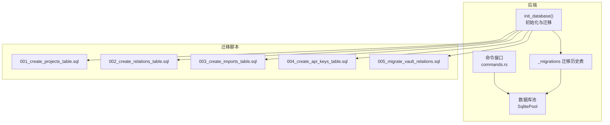
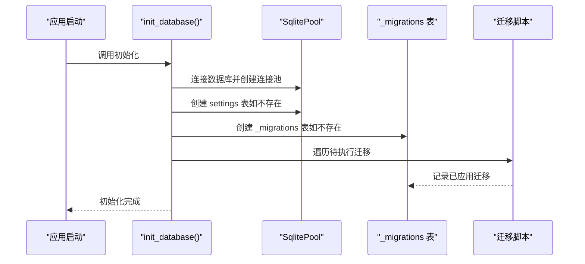
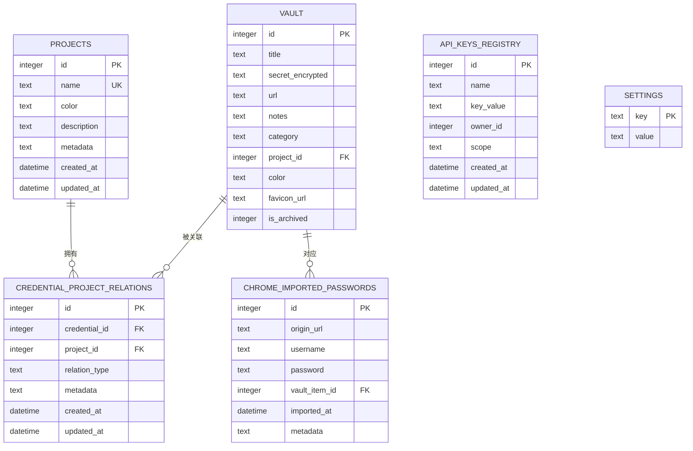
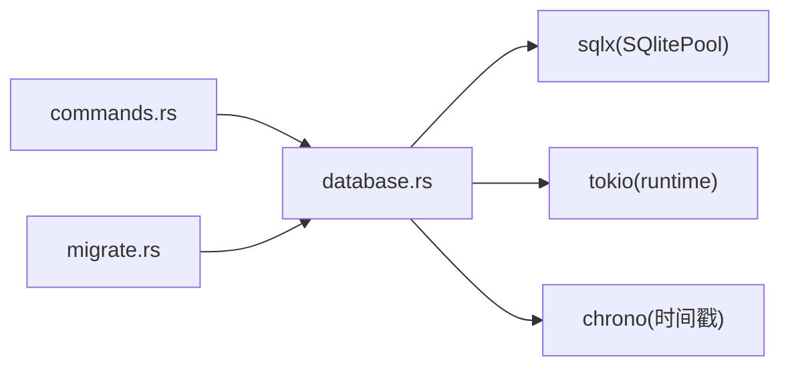

# 数据库设计

<cite>
**本文引用的文件**
- [001_create_projects_table.sql](file://src-tauri/migrations/001_create_projects_table.sql)
- [002_create_relations_table.sql](file://src-tauri/migrations/002_create_relations_table.sql)
- [003_create_imports_table.sql](file://src-tauri/migrations/003_create_imports_table.sql)
- [004_create_api_keys_table.sql](file://src-tauri/migrations/004_create_api_keys_table.sql)
- [005_migrate_vault_relations.sql](file://src-tauri/migrations/005_migrate_vault_relations.sql)
- [database.rs](file://src-tauri/src/database.rs)
- [migrate.rs](file://src-tauri/src/bin/migrate.rs)
- [commands.rs](file://src-tauri/src/commands.rs)
- [Cargo.toml](file://src-tauri/Cargo.toml)
- [index.ts](file://src/types/index.ts)
</cite>

## 目录
1. [简介](#简介)
2. [项目结构](#项目结构)
3. [核心组件](#核心组件)
4. [架构总览](#架构总览)
5. [详细组件分析](#详细组件分析)
6. [依赖分析](#依赖分析)
7. [性能考虑](#性能考虑)
8. [故障排除指南](#故障排除指南)
9. [结论](#结论)
10. [附录](#附录)

## 简介
本文件为 AIpassword 数据库设计的权威文档，聚焦 SQLite 数据库在本地应用中的表结构、字段定义与数据类型选择，系统阐述项目表、凭据关系表、导入记录表与 API 密钥表之间的关系与约束，并覆盖主键、外键、索引与约束规则；同时给出数据迁移策略、版本管理与向后兼容性方案，提供数据库 schema 图与实体关系图，说明数据访问模式、查询优化与性能考量，以及数据验证规则、业务逻辑约束与数据完整性保障。最后涵盖数据生命周期管理、备份策略与恢复机制。

## 项目结构
数据库相关代码主要位于 Tauri 后端模块中，采用“迁移脚本 + 运行时初始化 + 命令接口”的分层设计：
- 迁移脚本：按顺序执行的 SQL 脚本，确保数据库 schema 的幂等演进
- 运行时初始化：启动时自动检测并应用未执行的迁移，维护迁移历史表
- 命令接口：通过 Tauri 命令暴露对数据库的增删改查操作

**图表来源**
- [database.rs](file://src-tauri/src/database.rs#L13-L97)
- [migrate.rs](file://src-tauri/src/bin/migrate.rs#L27-L38)
- [001_create_projects_table.sql](file://src-tauri/migrations/001_create_projects_table.sql#L1-L13)
- [002_create_relations_table.sql](file://src-tauri/migrations/002_create_relations_table.sql#L1-L16)
- [003_create_imports_table.sql](file://src-tauri/migrations/003_create_imports_table.sql#L1-L15)
- [004_create_api_keys_table.sql](file://src-tauri/migrations/004_create_api_keys_table.sql#L1-L13)
- [005_migrate_vault_relations.sql](file://src-tauri/migrations/005_migrate_vault_relations.sql#L1-L18)

**章节来源**
- [database.rs](file://src-tauri/src/database.rs#L13-L97)
- [Cargo.toml](file://src-tauri/Cargo.toml#L15-L28)

## 核心组件
- 项目表（projects）
  - 主键：自增整数 id
  - 唯一约束：name
  - 默认值：color 默认绿色主题色
  - 时间戳：created_at、updated_at
  - 索引：name 字段建立唯一索引
- 凭据关系表（credential_project_relations）
  - 主键：自增整数 id
  - 外键：credential_id 引用 vault(id)，project_id 引用 projects(id)，均设置级联删除
  - 默认值：relation_type 默认 direct
  - 时间戳：created_at、updated_at
  - 索引：credential_id、project_id 建立普通索引
- 导入记录表（chrome_imported_passwords）
  - 主键：自增整数 id
  - 外键：vault_item_id 引用 vault(id)，删除时设为 NULL
  - 索引：vault_item_id、origin_url 建立索引
- API 密钥注册表（api_keys_registry）
  - 主键：自增整数 id
  - 索引：name 建立索引
- 设置表（settings）
  - 主键：字符串 key
  - 用途：存储主密码盐值与哈希，用于认证流程
- 迁移历史表（_migrations）
  - 主键：字符串 name
  - 用途：记录已应用的迁移脚本名称，确保幂等性

**章节来源**
- [001_create_projects_table.sql](file://src-tauri/migrations/001_create_projects_table.sql#L2-L12)
- [002_create_relations_table.sql](file://src-tauri/migrations/002_create_relations_table.sql#L2-L15)
- [003_create_imports_table.sql](file://src-tauri/migrations/003_create_imports_table.sql#L2-L14)
- [004_create_api_keys_table.sql](file://src-tauri/migrations/004_create_api_keys_table.sql#L2-L12)
- [database.rs](file://src-tauri/src/database.rs#L22-L31)
- [database.rs](file://src-tauri/src/database.rs#L56-L63)

## 架构总览
数据库层通过初始化流程确保 schema 的一致性与可演进性，命令层提供 CRUD 操作，前端通过 Tauri 命令调用后端接口。

**图表来源**
- [database.rs](file://src-tauri/src/database.rs#L13-L97)

## 详细组件分析

### 项目表（projects）
- 字段与类型
  - id: 整数，主键，自增
  - name: 文本，唯一，非空
  - color: 文本，默认值为绿色主题色
  - description: 文本
  - metadata: 文本
  - created_at: 时间戳，默认当前时间
  - updated_at: 时间戳，默认当前时间
- 约束与索引
  - 唯一索引：name
  - 默认值：color
  - 时间戳：自动维护
- 典型用途
  - 作为凭据的分组容器，支持多项目管理
  - 与凭据关系表形成一对多或多对多的中间表关系

**章节来源**
- [001_create_projects_table.sql](file://src-tauri/migrations/001_create_projects_table.sql#L2-L12)

### 凭据关系表（credential_project_relations）
- 字段与类型
  - id: 整数，主键，自增
  - credential_id: 整数，非空
  - project_id: 整数，非空
  - relation_type: 文本，默认 direct
  - metadata: 文本
  - created_at: 时间戳，默认当前时间
  - updated_at: 时间戳，默认当前时间
- 外键与级联
  - credential_id 引用 vault(id)，ON DELETE CASCADE
  - project_id 引用 projects(id)，ON DELETE CASCADE
- 索引
  - credential_id 上建立索引
  - project_id 上建立索引
- 业务语义
  - 将 vault 中的凭据项与 projects 关联，支持凭据的分类与统计
  - relation_type 可扩展为 direct、imported、shared 等类型

**章节来源**
- [002_create_relations_table.sql](file://src-tauri/migrations/002_create_relations_table.sql#L2-L15)
- [005_migrate_vault_relations.sql](file://src-tauri/migrations/005_migrate_vault_relations.sql#L9-L15)

### 导入记录表（chrome_imported_passwords）
- 字段与类型
  - id: 整数，主键，自增
  - origin_url: 文本
  - username: 文本
  - password: 文本
  - vault_item_id: 整数
  - imported_at: 时间戳，默认当前时间
  - metadata: 文本
- 外键与级联
  - vault_item_id 引用 vault(id)，ON DELETE SET NULL
- 索引
  - vault_item_id 上建立索引
  - origin_url 上建立索引
- 业务语义
  - 记录从 Chrome 导入的凭据，便于追踪与审计
  - 支持导入后将记录与 vault 项关联

**章节来源**
- [003_create_imports_table.sql](file://src-tauri/migrations/003_create_imports_table.sql#L2-L14)

### API 密钥注册表（api_keys_registry）
- 字段与类型
  - id: 整数，主键，自增
  - name: 文本，非空
  - key_value: 文本，非空
  - owner_id: 整数
  - scope: 文本
  - created_at: 时间戳，默认当前时间
  - updated_at: 时间戳，默认当前时间
- 索引
  - name 上建立索引
- 业务语义
  - 存储 API 密钥及其作用域与所有者信息，便于权限控制与审计

**章节来源**
- [004_create_api_keys_table.sql](file://src-tauri/migrations/004_create_api_keys_table.sql#L2-L12)

### 设置表（settings）
- 字段与类型
  - key: 文本，主键
  - value: 文本，非空
- 用途
  - 存储主密码盐值与哈希，用于认证流程
  - 也可扩展用于其他全局配置项

**章节来源**
- [database.rs](file://src-tauri/src/database.rs#L22-L31)

### 迁移历史表（_migrations）
- 字段与类型
  - name: 文本，主键
  - applied_at: 时间戳，默认当前时间
- 用途
  - 记录已应用的迁移脚本名称，确保幂等性与可追溯性

**章节来源**
- [database.rs](file://src-tauri/src/database.rs#L56-L63)

### 实体关系图

**图表来源**
- [001_create_projects_table.sql](file://src-tauri/migrations/001_create_projects_table.sql#L2-L12)
- [002_create_relations_table.sql](file://src-tauri/migrations/002_create_relations_table.sql#L2-L15)
- [003_create_imports_table.sql](file://src-tauri/migrations/003_create_imports_table.sql#L2-L14)
- [004_create_api_keys_table.sql](file://src-tauri/migrations/004_create_api_keys_table.sql#L2-L12)
- [database.rs](file://src-tauri/src/database.rs#L22-L31)

## 依赖分析
- 运行时依赖
  - sqlx: SQLite 连接池与查询执行
  - tokio: 异步运行时
  - chrono: 时间戳序列化
- 组件耦合
  - database.rs 作为入口，集中管理迁移与连接池
  - commands.rs 通过 get_db_pool() 获取连接池，执行具体查询
  - migrate.rs 用于验证迁移结果与计数

**图表来源**
- [Cargo.toml](file://src-tauri/Cargo.toml#L15-L28)
- [database.rs](file://src-tauri/src/database.rs#L1-L11)
- [commands.rs](file://src-tauri/src/commands.rs#L1-L8)
- [migrate.rs](file://src-tauri/src/bin/migrate.rs#L1-L4)

**章节来源**
- [Cargo.toml](file://src-tauri/Cargo.toml#L15-L28)

## 性能考虑
- 索引策略
  - 项目表：name 唯一索引，避免重复名称与加速查找
  - 关系表：credential_id、project_id 索引，支撑凭据与项目维度的查询
  - 导入表：vault_item_id、origin_url 索引，支撑导入追踪与按来源检索
- 查询优化建议
  - 在高频过滤条件上使用索引字段（如 origin_url、project_id）
  - 使用 JOIN 时限定条件，避免全表扫描
  - 对时间范围查询使用索引列（如 created_at、updated_at）
- 写入优化
  - 批量写入时合并事务，减少磁盘 IO
  - 控制日志与调试输出，避免影响写入性能
- 存储与并发
  - SQLite 在单机场景下表现稳定，注意避免长时间持有长事务
  - 使用连接池限制并发连接数，防止资源争用

[本节为通用性能指导，不直接分析特定文件]

## 故障排除指南
- 迁移失败
  - 检查 _migrations 表是否正确记录已应用的迁移
  - 确认迁移脚本语法正确且无冲突
  - 使用 migrate 工具验证各表计数
- 外键约束错误
  - 删除项目或凭据前，确认关系表与导入表的级联行为符合预期
  - 若出现约束冲突，先清理相关记录再重试
- 数据完整性问题
  - 核对默认值与时间戳字段是否正确填充
  - 检查 settings 表中的主密码盐值与哈希是否存在

**章节来源**
- [database.rs](file://src-tauri/src/database.rs#L54-L97)
- [migrate.rs](file://src-tauri/src/bin/migrate.rs#L5-L25)

## 结论
该数据库设计围绕“项目-凭据”关系展开，辅以导入记录与 API 密钥管理，通过迁移历史表实现幂等演进与版本管理。外键与索引策略确保了数据完整性与查询效率。结合前端类型定义与后端命令接口，整体架构清晰、可维护性强，适合本地应用的轻量级数据需求。

[本节为总结性内容，不直接分析特定文件]

## 附录

### 数据迁移策略与版本管理
- 幂等性
  - 使用 _migrations 表记录已应用脚本，避免重复执行
  - 迁移脚本内部使用 WHERE NOT EXISTS 等条件，确保可重复安全
- 版本演进
  - 新增迁移脚本时，按顺序编号并追加到迁移列表
  - 旧版本用户升级后自动应用缺失的迁移
- 向后兼容
  - 保留基础表（如 settings），满足旧版本期望
  - 迁移脚本中包含一次性修复与默认值注入逻辑

**章节来源**
- [database.rs](file://src-tauri/src/database.rs#L54-L97)
- [005_migrate_vault_relations.sql](file://src-tauri/migrations/005_migrate_vault_relations.sql#L1-L18)

### 数据访问模式与查询优化
- 访问模式
  - 通过 commands.rs 的命令接口进行 CRUD 操作
  - 使用 JOIN 实现项目维度的凭据筛选与统计
- 查询优化
  - 利用索引字段进行过滤与排序
  - 避免 SELECT *，仅取必要字段
  - 对高频查询建立复合索引（如 origin_url、project_id）

**章节来源**
- [commands.rs](file://src-tauri/src/commands.rs#L395-L435)
- [commands.rs](file://src-tauri/src/commands.rs#L438-L473)

### 数据验证规则与业务约束
- 字段约束
  - projects.name 唯一且非空
  - credential_project_relations.credential_id、project_id 非空
  - api_keys_registry.name、key_value 非空
- 级联行为
  - 删除项目或凭据时，关系表与导入表相应清理或置空
- 默认值与时间戳
  - 多数表具备 created_at、updated_at 自动维护
  - relation_type 默认 direct，color 默认主题色

**章节来源**
- [001_create_projects_table.sql](file://src-tauri/migrations/001_create_projects_table.sql#L2-L12)
- [002_create_relations_table.sql](file://src-tauri/migrations/002_create_relations_table.sql#L2-L15)
- [003_create_imports_table.sql](file://src-tauri/migrations/003_create_imports_table.sql#L2-L14)
- [004_create_api_keys_table.sql](file://src-tauri/migrations/004_create_api_keys_table.sql#L2-L12)

### 数据生命周期管理、备份与恢复
- 生命周期
  - 凭据删除采用归档标记（is_archived），支持恢复
  - 关系与导入记录随项目或凭据删除按级联策略处理
- 备份策略
  - 定期复制 devvault.db 文件至安全位置
  - 建议在应用关闭时进行备份，避免数据损坏
- 恢复机制
  - 使用备份文件替换当前数据库文件
  - 恢复后重新启动应用，确认迁移历史与表结构一致

[本节为通用实践建议，不直接分析特定文件]