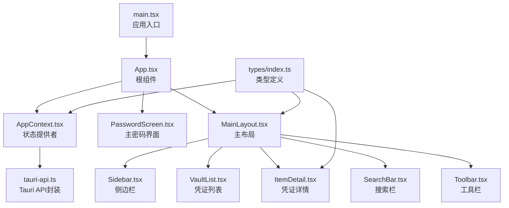
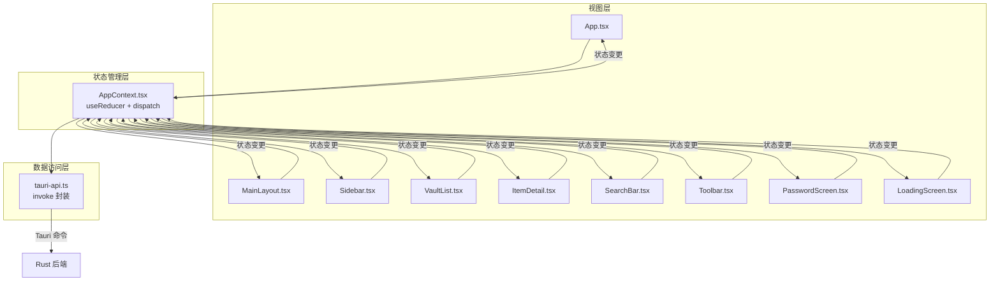
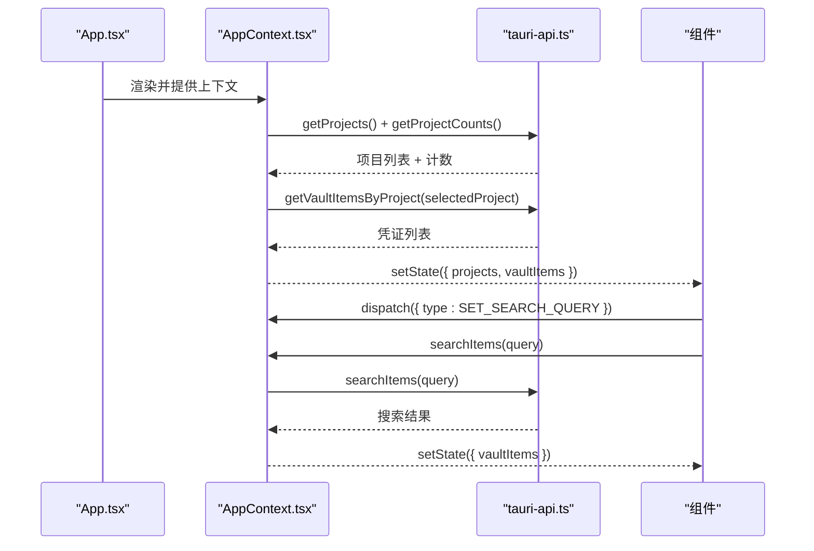
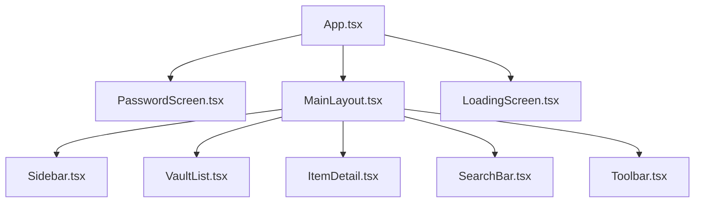
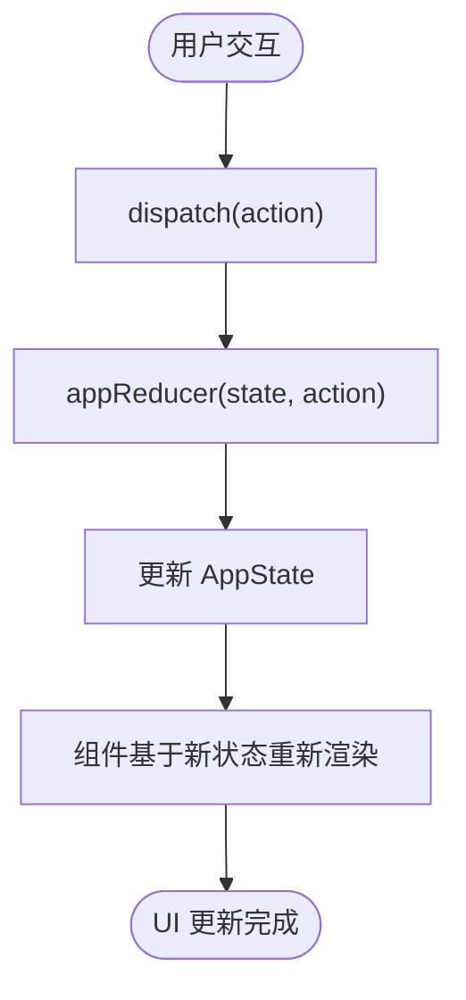
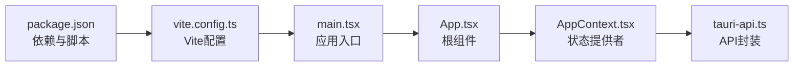

# 前端架构设计

<cite>
**本文档引用的文件**
- [src/App.tsx](file://src/App.tsx)
- [src/main.tsx](file://src/main.tsx)
- [src/contexts/AppContext.tsx](file://src/contexts/AppContext.tsx)
- [src/components/MainLayout.tsx](file://src/components/MainLayout.tsx)
- [src/components/PasswordScreen.tsx](file://src/components/PasswordScreen.tsx)
- [src/components/LoadingScreen.tsx](file://src/components/LoadingScreen.tsx)
- [src/components/Sidebar.tsx](file://src/components/Sidebar.tsx)
- [src/components/VaultList.tsx](file://src/components/VaultList.tsx)
- [src/components/ItemDetail.tsx](file://src/components/ItemDetail.tsx)
- [src/components/SearchBar.tsx](file://src/components/SearchBar.tsx)
- [src/components/Toolbar.tsx](file://src/components/Toolbar.tsx)
- [src/lib/tauri-api.ts](file://src/lib/tauri-api.ts)
- [src/types/index.ts](file://src/types/index.ts)
- [package.json](file://package.json)
- [vite.config.ts](file://vite.config.ts)
</cite>

## 目录
1. [简介](#简介)
2. [项目结构](#项目结构)
3. [核心组件](#核心组件)
4. [架构总览](#架构总览)
5. [详细组件分析](#详细组件分析)
6. [依赖关系分析](#依赖关系分析)
7. [性能考虑](#性能考虑)
8. [故障排除指南](#故障排除指南)
9. [结论](#结论)
10. [附录](#附录)

## 简介
本文件为 AIpassword（DevVault）项目的前端架构设计文档，聚焦于 React 应用的整体架构、组件层次结构与状态管理模式。文档详细解释了 AppContext 的状态管理设计、组件间通信机制与数据流向；阐述 UI 组件的设计原则、响应式布局与用户体验；并提供组件树结构图与状态管理流程图，说明从 API 到 UI 的完整数据流转过程。

## 项目结构
项目采用基于功能域的组织方式，前端代码位于 src 目录，核心入口为 main.tsx，应用根组件为 App.tsx，状态管理通过自定义上下文 AppContext 提供，业务组件按功能划分为 MainLayout、Sidebar、VaultList、ItemDetail、SearchBar、Toolbar、PasswordScreen、LoadingScreen 等，工具层包括 Tauri API 封装与类型定义。

图表来源
- [src/main.tsx](file://src/main.tsx#L1-L10)
- [src/App.tsx](file://src/App.tsx#L1-L29)
- [src/contexts/AppContext.tsx](file://src/contexts/AppContext.tsx#L1-L162)
- [src/components/MainLayout.tsx](file://src/components/MainLayout.tsx#L1-L103)
- [src/components/Sidebar.tsx](file://src/components/Sidebar.tsx#L1-L143)
- [src/components/VaultList.tsx](file://src/components/VaultList.tsx#L1-L209)
- [src/components/ItemDetail.tsx](file://src/components/ItemDetail.tsx#L1-L234)
- [src/components/SearchBar.tsx](file://src/components/SearchBar.tsx#L1-L50)
- [src/components/Toolbar.tsx](file://src/components/Toolbar.tsx#L1-L46)
- [src/lib/tauri-api.ts](file://src/lib/tauri-api.ts#L1-L97)
- [src/types/index.ts](file://src/types/index.ts#L1-L46)

章节来源
- [src/main.tsx](file://src/main.tsx#L1-L10)
- [src/App.tsx](file://src/App.tsx#L1-L29)
- [package.json](file://package.json#L1-L32)
- [vite.config.ts](file://vite.config.ts#L1-L21)

## 核心组件
- 应用入口与根组件：main.tsx 负责挂载 React 应用，App.tsx 作为根组件，根据状态在 LoadingScreen、PasswordScreen 与 MainLayout 之间切换。
- 状态提供者：AppContext.tsx 使用 useReducer 实现集中状态管理，提供刷新数据、搜索等方法，并通过 useEffect 在启动时拉取初始数据与检查主密码状态。
- 主布局：MainLayout.tsx 负责页面布局、响应式布局逻辑、模态框控制以及子组件的组合。
- UI 组件：Sidebar、VaultList、ItemDetail、SearchBar、Toolbar 等组件通过 useApp 获取状态与动作，实现数据驱动的交互。
- API 封装：tauri-api.ts 对 Tauri 命令进行封装，统一调用 invoke 并暴露业务方法。
- 类型系统：types/index.ts 定义 VaultItem、Project、AppState 等核心类型，确保状态结构清晰。

章节来源
- [src/App.tsx](file://src/App.tsx#L1-L29)
- [src/contexts/AppContext.tsx](file://src/contexts/AppContext.tsx#L1-L162)
- [src/components/MainLayout.tsx](file://src/components/MainLayout.tsx#L1-L103)
- [src/lib/tauri-api.ts](file://src/lib/tauri-api.ts#L1-L97)
- [src/types/index.ts](file://src/types/index.ts#L1-L46)

## 架构总览
应用采用“上下文 + reducer”的状态管理模式，所有组件通过 useApp 访问共享状态与动作。数据流自下而上：用户交互触发动作，reducer 更新状态，组件基于状态重新渲染；同时，AppContext 通过 API 封装与后端通信，完成数据的获取与更新。

图表来源
- [src/App.tsx](file://src/App.tsx#L1-L29)
- [src/contexts/AppContext.tsx](file://src/contexts/AppContext.tsx#L1-L162)
- [src/components/MainLayout.tsx](file://src/components/MainLayout.tsx#L1-L103)
- [src/components/Sidebar.tsx](file://src/components/Sidebar.tsx#L1-L143)
- [src/components/VaultList.tsx](file://src/components/VaultList.tsx#L1-L209)
- [src/components/ItemDetail.tsx](file://src/components/ItemDetail.tsx#L1-L234)
- [src/components/SearchBar.tsx](file://src/components/SearchBar.tsx#L1-L50)
- [src/components/Toolbar.tsx](file://src/components/Toolbar.tsx#L1-L46)
- [src/components/PasswordScreen.tsx](file://src/components/PasswordScreen.tsx#L1-L146)
- [src/components/LoadingScreen.tsx](file://src/components/LoadingScreen.tsx#L1-L13)
- [src/lib/tauri-api.ts](file://src/lib/tauri-api.ts#L1-L97)

## 详细组件分析

### AppContext 状态管理与数据流
- 状态结构：包含凭证项、项目、选中项目、搜索查询、选中项、加载状态、隐身模式、主密码校验状态等。
- 动作类型：涵盖设置加载、设置凭证/项目列表、设置选中项/项目、切换隐身模式、设置主密码校验结果、增删改项目与凭证等。
- 数据获取与刷新：启动时并行获取项目与计数、按选中项目获取凭证列表；选中项目变化时自动刷新凭证列表；搜索时支持防抖与回退刷新。
- 主密码流程：启动时检测是否存在主密码，据此决定是否展示解锁界面；提交时区分首次设置与验证流程。

图表来源
- [src/App.tsx](file://src/App.tsx#L1-L29)
- [src/contexts/AppContext.tsx](file://src/contexts/AppContext.tsx#L76-L121)
- [src/lib/tauri-api.ts](file://src/lib/tauri-api.ts#L52-L54)

章节来源
- [src/contexts/AppContext.tsx](file://src/contexts/AppContext.tsx#L1-L162)
- [src/types/index.ts](file://src/types/index.ts#L37-L46)

### 组件树结构与职责
- App.tsx：根据状态在 LoadingScreen、PasswordScreen、MainLayout 之间切换。
- MainLayout.tsx：负责头部、侧边栏、凭证列表、详情区、模态框与响应式布局。
- Sidebar.tsx：项目列表与新建项目表单，点击切换选中项目。
- VaultList.tsx：凭证列表展示、复制（原始/环境变量/JSON）、编辑、删除、隐身模式文本遮蔽。
- ItemDetail.tsx：凭证详情展示、密钥显示/隐藏、复制、编辑、删除、元数据展示。
- SearchBar.tsx：本地搜索输入与防抖，支持快捷键聚焦。
- Toolbar.tsx：新建条目、隐身模式切换、快速统计信息。
- PasswordScreen.tsx：主密码设置/验证界面，初始化状态判断。
- LoadingScreen.tsx：应用启动与异步操作时的加载提示。

图表来源
- [src/App.tsx](file://src/App.tsx#L1-L29)
- [src/components/MainLayout.tsx](file://src/components/MainLayout.tsx#L1-L103)
- [src/components/Sidebar.tsx](file://src/components/Sidebar.tsx#L1-L143)
- [src/components/VaultList.tsx](file://src/components/VaultList.tsx#L1-L209)
- [src/components/ItemDetail.tsx](file://src/components/ItemDetail.tsx#L1-L234)
- [src/components/SearchBar.tsx](file://src/components/SearchBar.tsx#L1-L50)
- [src/components/Toolbar.tsx](file://src/components/Toolbar.tsx#L1-L46)
- [src/components/PasswordScreen.tsx](file://src/components/PasswordScreen.tsx#L1-L146)
- [src/components/LoadingScreen.tsx](file://src/components/LoadingScreen.tsx#L1-L13)

章节来源
- [src/components/MainLayout.tsx](file://src/components/MainLayout.tsx#L1-L103)
- [src/components/Sidebar.tsx](file://src/components/Sidebar.tsx#L1-L143)
- [src/components/VaultList.tsx](file://src/components/VaultList.tsx#L1-L209)
- [src/components/ItemDetail.tsx](file://src/components/ItemDetail.tsx#L1-L234)
- [src/components/SearchBar.tsx](file://src/components/SearchBar.tsx#L1-L50)
- [src/components/Toolbar.tsx](file://src/components/Toolbar.tsx#L1-L46)
- [src/components/PasswordScreen.tsx](file://src/components/PasswordScreen.tsx#L1-L146)
- [src/components/LoadingScreen.tsx](file://src/components/LoadingScreen.tsx#L1-L13)

### 状态管理流程图
以下流程图展示从用户交互到状态更新再到 UI 重渲染的完整路径。

图表来源
- [src/contexts/AppContext.tsx](file://src/contexts/AppContext.tsx#L30-L67)

章节来源
- [src/contexts/AppContext.tsx](file://src/contexts/AppContext.tsx#L30-L67)

### 组件间通信机制
- 上下文通信：所有组件通过 useApp 访问 state 与 dispatch，实现跨层级通信。
- 属性传递：MainLayout 作为容器，向子组件传递回调（如 onEditItem），实现从子组件向父组件的事件冒泡。
- 事件监听：tauri-api.ts 提供事件监听能力，用于处理剪贴板变化等外部事件。

章节来源
- [src/contexts/AppContext.tsx](file://src/contexts/AppContext.tsx#L156-L162)
- [src/components/MainLayout.tsx](file://src/components/MainLayout.tsx#L52-L68)
- [src/lib/tauri-api.ts](file://src/lib/tauri-api.ts#L92-L94)

### 数据流向与 API 集成
- 初始化：AppContext 在启动时并行请求项目与计数，并按当前选中项目获取凭证列表。
- 搜索：SearchBar 防抖触发 searchItems，调用 API 搜索并更新列表，空查询时回退刷新。
- 项目管理：Sidebar 支持新建项目，成功后立即更新本地状态避免闪烁。
- 凭证管理：VaultList 与 ItemDetail 支持复制、编辑、删除等操作，均通过 API 调用与状态同步。

章节来源
- [src/contexts/AppContext.tsx](file://src/contexts/AppContext.tsx#L79-L121)
- [src/components/SearchBar.tsx](file://src/components/SearchBar.tsx#L9-L18)
- [src/components/Sidebar.tsx](file://src/components/Sidebar.tsx#L11-L45)
- [src/components/VaultList.tsx](file://src/components/VaultList.tsx#L9-L44)
- [src/components/ItemDetail.tsx](file://src/components/ItemDetail.tsx#L16-L51)

### UI 设计原则与响应式布局
- 设计原则：采用卡片式布局与语义化颜色，强调可读性与一致性；通过隐身模式对敏感信息进行遮蔽；提供多种复制格式以适配不同场景。
- 响应式布局：MainLayout 基于窗口宽度切换紧凑模式，小屏设备隐藏侧边栏与详情区，保证移动端可用性。
- 用户体验：提供键盘快捷键（⌘K 聚焦搜索、Ctrl+N 新建条目）、视觉反馈（按钮高亮）、加载状态与错误提示。

章节来源
- [src/components/MainLayout.tsx](file://src/components/MainLayout.tsx#L17-L24)
- [src/components/VaultList.tsx](file://src/components/VaultList.tsx#L50-L53)
- [src/components/Toolbar.tsx](file://src/components/Toolbar.tsx#L24-L35)
- [src/components/SearchBar.tsx](file://src/components/SearchBar.tsx#L20-L30)

## 依赖关系分析
- 依赖管理：package.json 中声明 React、React DOM、Tailwind 生态与 @tauri-apps/api 等依赖。
- 构建配置：vite.config.ts 配置 React 插件、固定端口与忽略 src-tauri 目录监控。
- 运行脚本：提供 dev、build、tauri、tauri:dev、tauri:build 等脚本，适配 Tauri 开发与构建流程。

图表来源
- [package.json](file://package.json#L1-L32)
- [vite.config.ts](file://vite.config.ts#L1-L21)
- [src/main.tsx](file://src/main.tsx#L1-L10)
- [src/App.tsx](file://src/App.tsx#L1-L29)
- [src/contexts/AppContext.tsx](file://src/contexts/AppContext.tsx#L1-L162)
- [src/lib/tauri-api.ts](file://src/lib/tauri-api.ts#L1-L97)

章节来源
- [package.json](file://package.json#L1-L32)
- [vite.config.ts](file://vite.config.ts#L1-L21)

## 性能考虑
- 防抖搜索：SearchBar 使用 300ms 防抖，减少频繁 API 调用与重渲染。
- 并行初始化：AppContext 启动时并行获取项目与计数，缩短首屏等待时间。
- 本地状态优先：新建项目成功后立即更新本地状态，避免等待后端返回导致的闪烁。
- 条件渲染：根据选中项目与选中项条件性渲染详情区与关系管理面板，减少不必要的 DOM 结构。
- 图标与样式：使用 lucide-react 图标库与 Tailwind CSS，保持体积与性能平衡。

章节来源
- [src/components/SearchBar.tsx](file://src/components/SearchBar.tsx#L9-L18)
- [src/contexts/AppContext.tsx](file://src/contexts/AppContext.tsx#L79-L85)
- [src/components/Sidebar.tsx](file://src/components/Sidebar.tsx#L28-L40)

## 故障排除指南
- 主密码相关
  - 症状：无法进入应用或反复要求输入主密码。
  - 排查：确认 hasMasterPassword 返回值与 verifyMasterPassword 行为；若检查失败，默认假设需要密码，确保后端命令正常。
- 搜索无结果
  - 症状：输入关键词无返回。
  - 排查：确认 searchItems API 是否正确实现；检查防抖逻辑与空查询回退刷新。
- 项目切换后凭证未更新
  - 症状：切换项目后列表未刷新。
  - 排查：确认 selectedProject 变更触发 useEffect；检查 getVaultItemsByProject 参数传递。
- 复制功能异常
  - 症状：复制按钮无反应或无视觉反馈。
  - 排查：检查 smartCopy.copyText 与 API 调用链；确认按钮 ID 与 DOM 查询一致。

章节来源
- [src/contexts/AppContext.tsx](file://src/contexts/AppContext.tsx#L123-L140)
- [src/components/SearchBar.tsx](file://src/components/SearchBar.tsx#L10-L15)
- [src/contexts/AppContext.tsx](file://src/contexts/AppContext.tsx#L142-L147)
- [src/components/VaultList.tsx](file://src/components/VaultList.tsx#L9-L28)

## 结论
本项目前端采用简洁明确的上下文 + reducer 架构，结合 Tauri 命令调用实现安全可控的数据访问。组件职责清晰、通信机制简单可靠，配合响应式布局与良好的交互细节，提供了稳定且易用的凭证管理体验。建议后续持续关注 API 性能与错误处理完善，并在大型列表场景引入虚拟滚动等优化手段。

## 附录
- 关键类型定义参考：VaultItem、Project、AppState、CopyFormat 等。
- API 方法清单：凭证 CRUD、项目 CRUD、导入记录、搜索、主密码设置/校验、剪贴板复制、图标抓取等。

章节来源
- [src/types/index.ts](file://src/types/index.ts#L1-L46)
- [src/lib/tauri-api.ts](file://src/lib/tauri-api.ts#L5-L97)