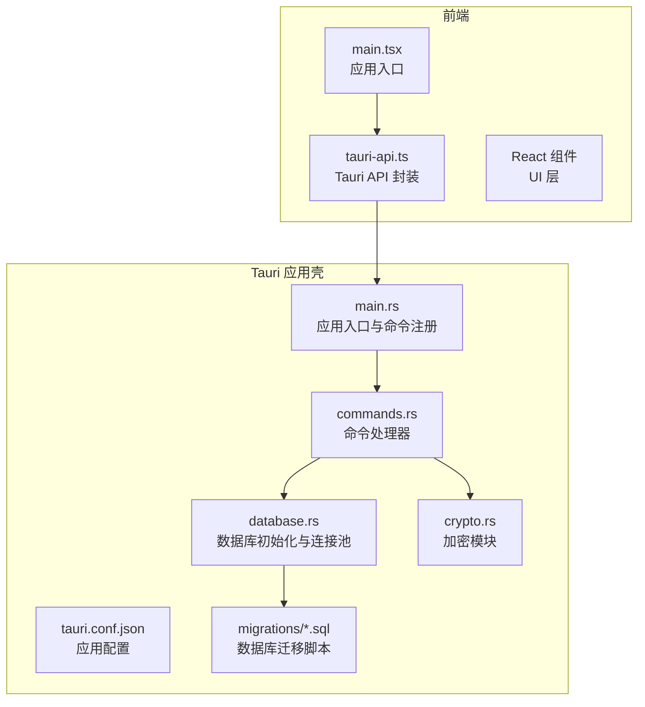
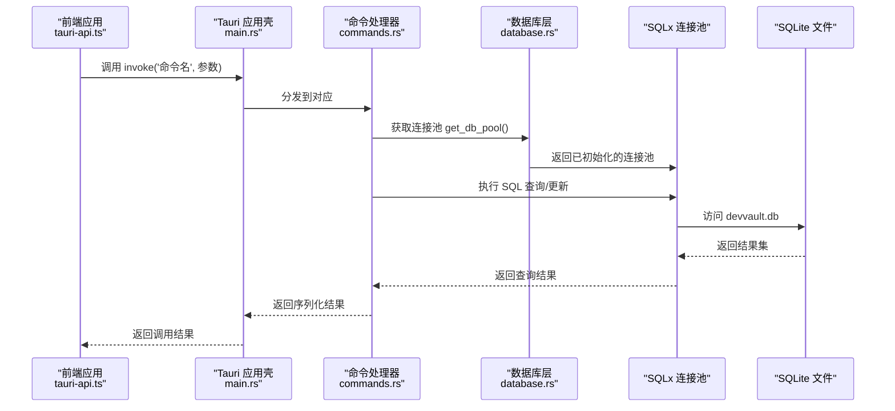
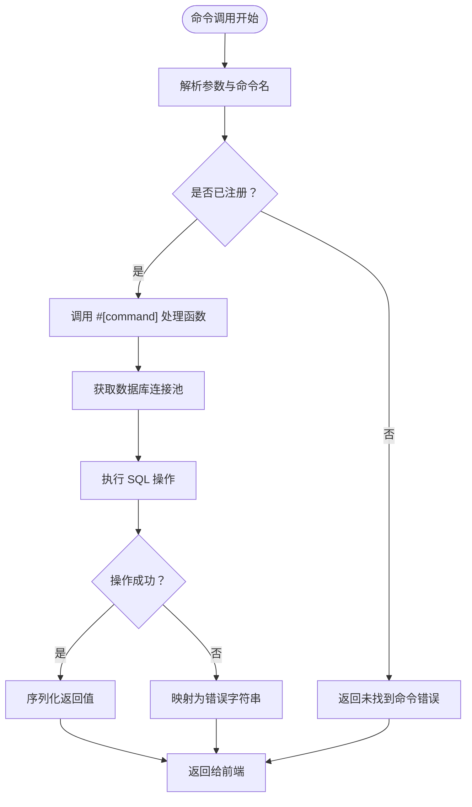
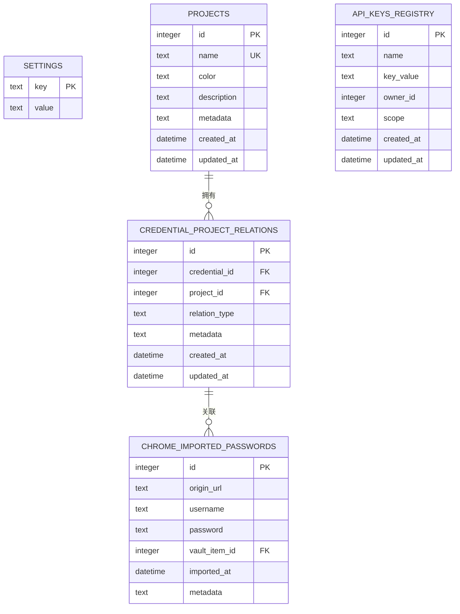
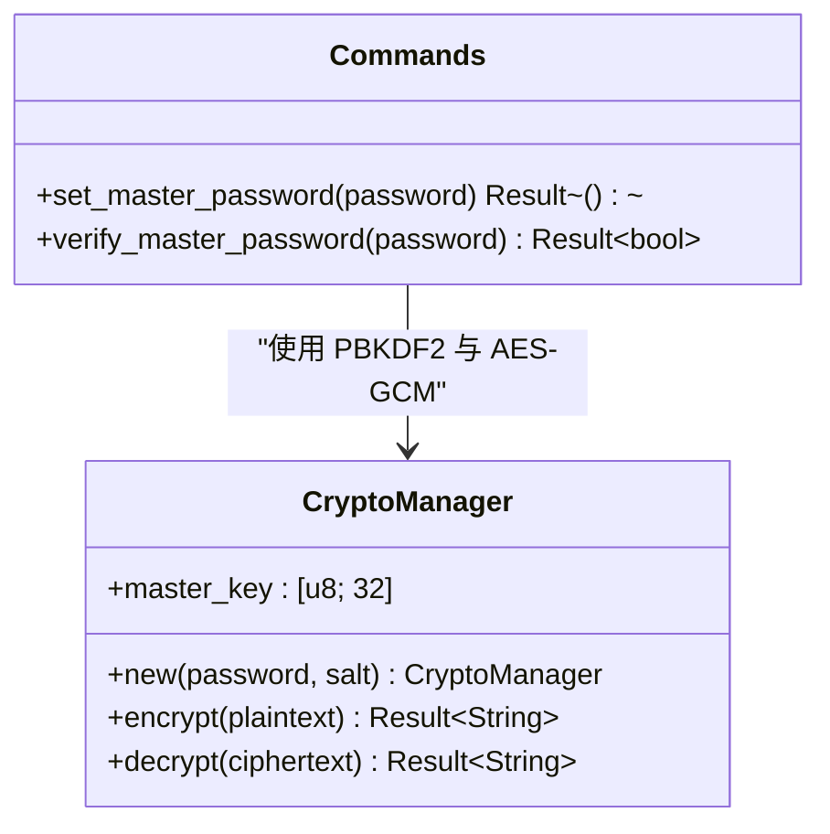
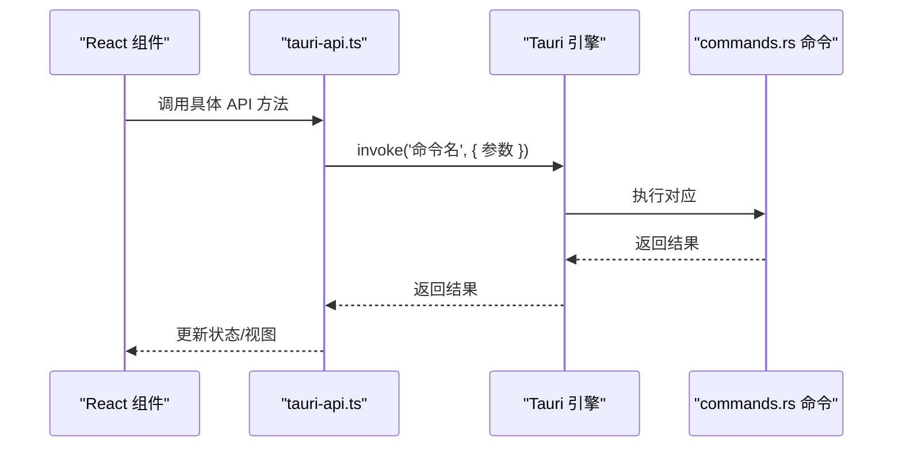
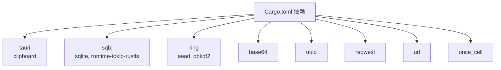

# 后端架构设计

<cite>
**本文档引用的文件**
- [Cargo.toml](file://src-tauri/Cargo.toml)
- [main.rs](file://src-tauri/src/main.rs)
- [lib.rs](file://src-tauri/src/lib.rs)
- [commands.rs](file://src-tauri/src/commands.rs)
- [database.rs](file://src-tauri/src/database.rs)
- [crypto.rs](file://src-tauri/src/crypto.rs)
- [001_create_projects_table.sql](file://src-tauri/migrations/001_create_projects_table.sql)
- [002_create_relations_table.sql](file://src-tauri/migrations/002_create_relations_table.sql)
- [003_create_imports_table.sql](file://src-tauri/migrations/003_create_imports_table.sql)
- [004_create_api_keys_table.sql](file://src-tauri/migrations/004_create_api_keys_table.sql)
- [005_migrate_vault_relations.sql](file://src-tauri/migrations/005_migrate_vault_relations.sql)
- [tauri.conf.json](file://src-tauri/tauri.conf.json)
- [tauri-api.ts](file://src/lib/tauri-api.ts)
- [main.tsx](file://src/main.tsx)
- [package.json](file://package.json)
</cite>

## 目录
1. [简介](#简介)
2. [项目结构](#项目结构)
3. [核心组件](#核心组件)
4. [架构总览](#架构总览)
5. [详细组件分析](#详细组件分析)
6. [依赖关系分析](#依赖关系分析)
7. [性能考虑](#性能考虑)
8. [故障排除指南](#故障排除指南)
9. [结论](#结论)

## 简介
本文件为 AIpassword 项目的后端架构设计文档，聚焦于 Rust 后端服务与 Tauri 应用壳的协作机制。文档从系统架构、组件关系、数据流、处理逻辑、集成点、错误处理与日志记录等方面进行深入解析，并提供架构图与命令执行流程图，帮助读者理解从前端请求到数据库操作的完整处理链路。

## 项目结构
项目采用前后端分离的混合架构：前端为基于 React 的 Web 应用，通过 Tauri 框架打包为桌面应用；后端为 Rust 实现的 Tauri 命令处理器，负责业务逻辑、数据库访问与加密处理。关键目录与文件如下：
- 前端：src 目录包含 React 组件、类型定义与 API 封装
- 后端壳：src-tauri 目录包含 Tauri 应用配置、Rust 主程序、命令处理、数据库与加密模块
- 数据库迁移：src-tauri/migrations 目录包含 SQLite 表结构与迁移脚本
- 构建与打包：package.json 定义前端构建脚本，tauri.conf.json 配置 Tauri 打包参数

**图表来源**
- [main.tsx](file://src/main.tsx#L1-L10)
- [tauri-api.ts](file://src/lib/tauri-api.ts#L1-L97)
- [tauri.conf.json](file://src-tauri/tauri.conf.json#L1-L33)
- [main.rs](file://src-tauri/src/main.rs#L1-L58)
- [commands.rs](file://src-tauri/src/commands.rs#L1-L572)
- [database.rs](file://src-tauri/src/database.rs#L1-L104)
- [crypto.rs](file://src-tauri/src/crypto.rs#L1-L92)
- [001_create_projects_table.sql](file://src-tauri/migrations/001_create_projects_table.sql#L1-L13)

**章节来源**
- [package.json](file://package.json#L1-L32)
- [tauri.conf.json](file://src-tauri/tauri.conf.json#L1-L33)

## 核心组件
- 应用入口与命令注册：在应用启动时注册所有后端命令，并在初始化阶段完成数据库连接池建立。
- 命令处理器：以 #[command] 注解的异步函数，封装 CRUD、搜索、导入、密码设置与校验等业务逻辑。
- 数据库层：基于 SQLx 的 SQLite 连接池，支持迁移、索引与外键约束，提供统一的查询与写入接口。
- 加密模块：基于 ring 的 AEAD 加密与 PBKDF2 密码哈希，确保主密码与敏感数据的安全存储。
- 前端 API 封装：通过 @tauri-apps/api 调用后端命令，实现跨语言通信。

**章节来源**
- [main.rs](file://src-tauri/src/main.rs#L24-L58)
- [commands.rs](file://src-tauri/src/commands.rs#L40-L572)
- [database.rs](file://src-tauri/src/database.rs#L13-L104)
- [crypto.rs](file://src-tauri/src/crypto.rs#L7-L92)
- [tauri-api.ts](file://src/lib/tauri-api.ts#L1-L97)

## 架构总览
下图展示了从前端调用到数据库操作的完整链路，包括命令注册、调用分发、数据库访问与加密处理。

**图表来源**
- [tauri-api.ts](file://src/lib/tauri-api.ts#L1-L97)
- [main.rs](file://src-tauri/src/main.rs#L24-L58)
- [commands.rs](file://src-tauri/src/commands.rs#L40-L572)
- [database.rs](file://src-tauri/src/database.rs#L99-L104)

## 详细组件分析

### 命令处理机制
- 命令注册：应用启动时通过 generate_handler! 将所有命令注册到 Tauri 引擎，前端通过 invoke('命令名') 调用。
- 异步处理：所有命令均声明为 async，内部通过 get_db_pool() 获取连接池，执行 SQL 操作后返回结果或错误字符串。
- 参数与返回：命令参数与返回值通过 serde 进行序列化/反序列化，确保跨语言兼容性。
- 平台特定功能：如复制到剪贴板仅在 Windows 平台启用，其他平台会输出未实现提示。

**图表来源**
- [main.rs](file://src-tauri/src/main.rs#L24-L58)
- [commands.rs](file://src-tauri/src/commands.rs#L40-L572)
- [database.rs](file://src-tauri/src/database.rs#L99-L104)

**章节来源**
- [main.rs](file://src-tauri/src/main.rs#L24-L58)
- [commands.rs](file://src-tauri/src/commands.rs#L40-L572)

### 数据库层设计
- 连接池：使用 OnceCell 存储全局 SqlitePool，避免重复初始化；通过 get_db_pool() 提供线程安全的克隆访问。
- 初始化流程：应用启动时调用 init_database()，创建 settings 表、应用 V2 迁移、插入默认项目，最后缓存连接池。
- 迁移机制：维护 _migrations 表跟踪已应用的迁移，按顺序执行未应用的脚本，支持多语句拆分与幂等性。
- 表结构与索引：项目表、关系表、导入表、API 密钥表均有明确的主键、外键与索引，保证查询效率与数据一致性。

**图表来源**
- [database.rs](file://src-tauri/src/database.rs#L13-L104)
- [001_create_projects_table.sql](file://src-tauri/migrations/001_create_projects_table.sql#L1-L13)
- [002_create_relations_table.sql](file://src-tauri/migrations/002_create_relations_table.sql#L1-L16)
- [003_create_imports_table.sql](file://src-tauri/migrations/003_create_imports_table.sql#L1-L15)
- [004_create_api_keys_table.sql](file://src-tauri/migrations/004_create_api_keys_table.sql#L1-L13)

**章节来源**
- [database.rs](file://src-tauri/src/database.rs#L13-L104)
- [001_create_projects_table.sql](file://src-tauri/migrations/001_create_projects_table.sql#L1-L13)
- [002_create_relations_table.sql](file://src-tauri/migrations/002_create_relations_table.sql#L1-L16)
- [003_create_imports_table.sql](file://src-tauri/migrations/003_create_imports_table.sql#L1-L15)
- [004_create_api_keys_table.sql](file://src-tauri/migrations/004_create_api_keys_table.sql#L1-L13)

### 加密模块实现
- 主密码与盐值：set_master_password 生成随机盐值，使用 PBKDF2-HMAC-SHA256 生成哈希并存储到 settings 表。
- 验证流程：verify_master_password 读取存储的盐值与哈希，重新计算输入密码的哈希并与存储值比较。
- 敏感数据加密：CryptoManager 使用 AES-256-GCM 对称加密，每次加密生成随机 nonce，将 salt 与密文拼接并 Base64 编码存储。
- 解密流程：解码 Base64 数据，提取 nonce 与密文，使用相同 master_key 解密并返回明文。

**图表来源**
- [crypto.rs](file://src-tauri/src/crypto.rs#L7-L92)
- [commands.rs](file://src-tauri/src/commands.rs#L248-L309)

**章节来源**
- [crypto.rs](file://src-tauri/src/crypto.rs#L7-L92)
- [commands.rs](file://src-tauri/src/commands.rs#L248-L309)

### 前端与后端交互
- 前端通过 @tauri-apps/api 的 invoke 方法调用后端命令，传入参数对象并接收返回值。
- API 封装集中于 tauri-api.ts，提供 Vault、项目、导入、剪贴板、主密码等方法。
- 事件监听：前端可通过 listen 订阅后端事件（如剪贴板变化），实现双向通信。

**图表来源**
- [tauri-api.ts](file://src/lib/tauri-api.ts#L1-L97)
- [main.rs](file://src-tauri/src/main.rs#L24-L58)
- [commands.rs](file://src-tauri/src/commands.rs#L40-L572)

**章节来源**
- [tauri-api.ts](file://src/lib/tauri-api.ts#L1-L97)
- [main.tsx](file://src/main.tsx#L1-L10)

## 依赖关系分析
- Rust 依赖：Tauri、SQLx、ring、base64、uuid、reqwest、url、once_cell、clipboard-win 等。
- 前端依赖：@tauri-apps/api、React 生态等。
- 构建与打包：Vite + Tauri CLI，开发时通过 npm scripts 启动前端与后端。

**图表来源**
- [Cargo.toml](file://src-tauri/Cargo.toml#L15-L29)

**章节来源**
- [Cargo.toml](file://src-tauri/Cargo.toml#L15-L29)
- [package.json](file://package.json#L13-L31)

## 性能考虑
- 连接池复用：通过 OnceCell 缓存 SqlitePool，避免重复连接开销，提升并发查询性能。
- 异步执行：命令均为 async，配合 tokio 运行时实现非阻塞 I/O，减少 UI 卡顿。
- 索引优化：迁移脚本中为常用查询字段建立索引（如项目名称、关系表外键、导入表索引），降低查询时间复杂度。
- 幂等迁移：迁移脚本通过 _migrations 表跟踪，避免重复执行，保障升级稳定性。
- 平台差异：剪贴板功能仅在 Windows 平台启用，减少不必要的系统调用。

[本节为通用性能建议，不直接分析具体文件]

## 故障排除指南
- 数据库未初始化：若 get_db_pool 返回“数据库未初始化”，检查应用启动时 init_database 是否成功执行。
- 迁移失败：确认 _migrations 表存在且迁移脚本无语法错误；逐条执行迁移脚本验证。
- 命令调用失败：检查命令是否在 generate_handler 中注册，参数类型是否匹配 serde 序列化要求。
- 主密码校验失败：确认 settings 表中存在对应的盐值与哈希，PBKDF2 参数一致。
- 平台限制：复制到剪贴板仅在 Windows 平台生效，其他平台会输出未实现提示。

**章节来源**
- [database.rs](file://src-tauri/src/database.rs#L99-L104)
- [commands.rs](file://src-tauri/src/commands.rs#L213-L228)
- [commands.rs](file://src-tauri/src/commands.rs#L284-L309)

## 结论
本架构以 Tauri 为应用壳，Rust 实现命令处理与数据库访问，结合 ring 提供的密码学原语，实现了安全、可扩展的本地密码管理解决方案。通过连接池、异步执行与索引优化，系统在性能与可用性之间取得平衡；通过幂等迁移与严格的错误处理，保障了长期演进的稳定性。前端通过 @tauri-apps/api 与后端进行无缝通信，形成完整的桌面应用生态。