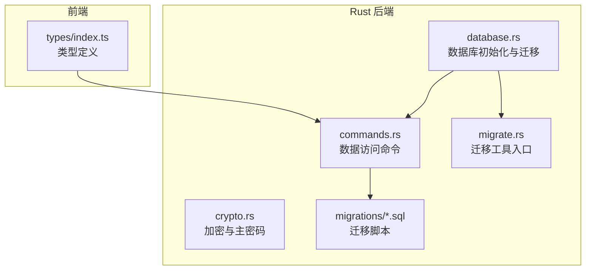
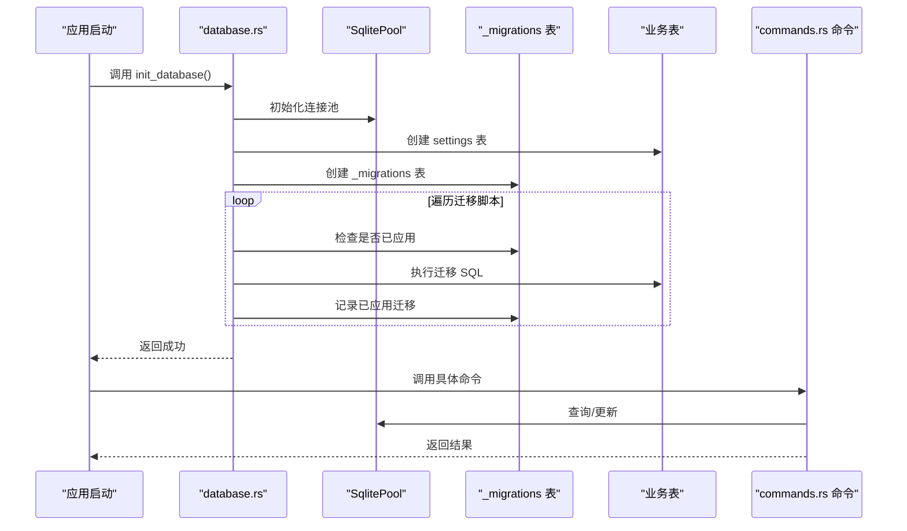
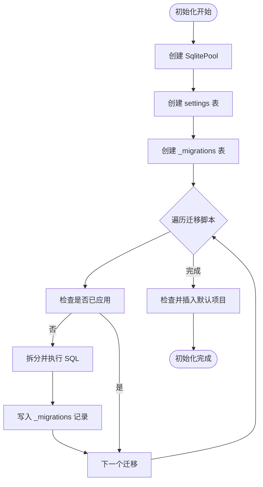
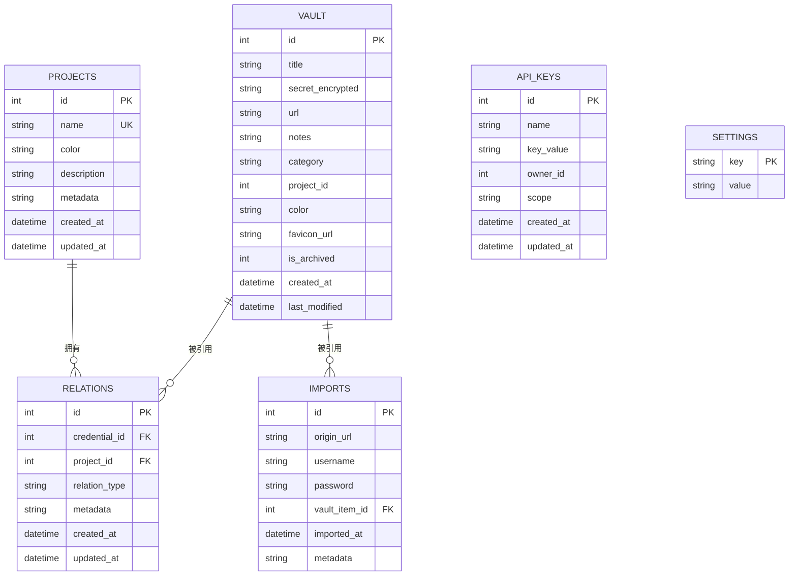
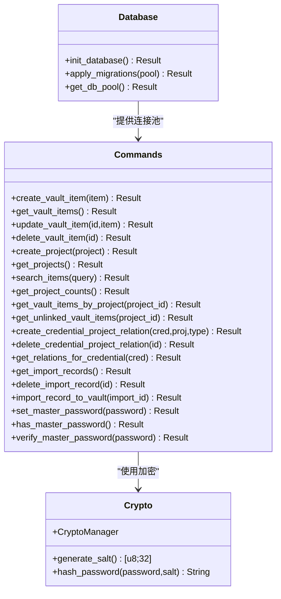
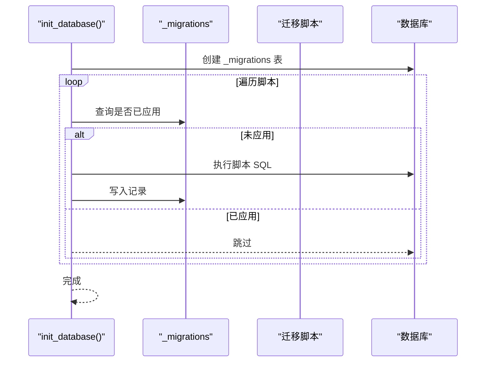
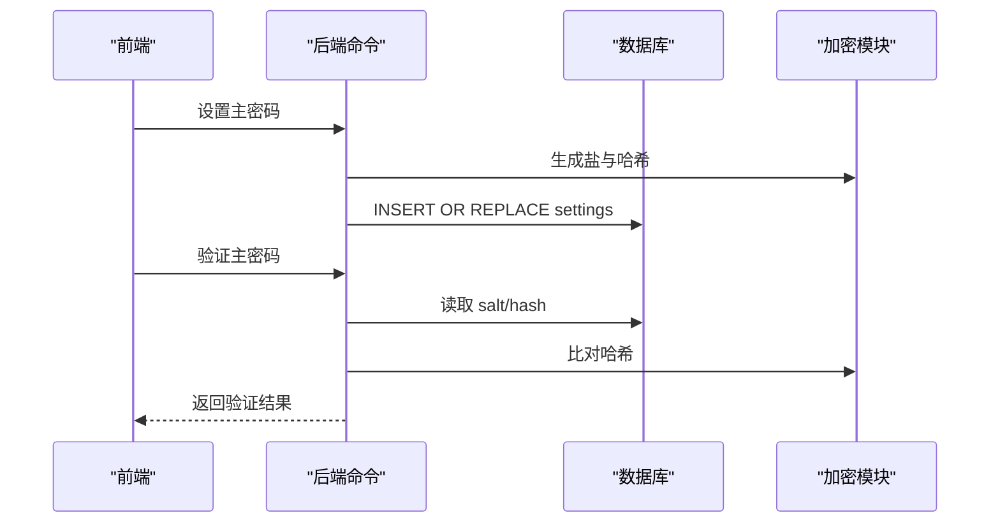
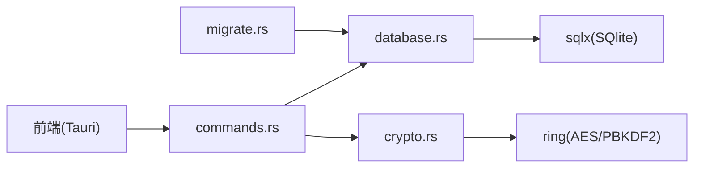

# 数据架构设计

<cite>
**本文引用的文件**
- [database.rs](file://src-tauri/src/database.rs)
- [commands.rs](file://src-tauri/src/commands.rs)
- [crypto.rs](file://src-tauri/src/crypto.rs)
- [migrate.rs](file://src-tauri/src/bin/migrate.rs)
- [001_create_projects_table.sql](file://src-tauri/migrations/001_create_projects_table.sql)
- [002_create_relations_table.sql](file://src-tauri/migrations/002_create_relations_table.sql)
- [003_create_imports_table.sql](file://src-tauri/migrations/003_create_imports_table.sql)
- [004_create_api_keys_table.sql](file://src-tauri/migrations/004_create_api_keys_table.sql)
- [005_migrate_vault_relations.sql](file://src-tauri/migrations/005_migrate_vault_relations.sql)
- [Cargo.toml](file://src-tauri/Cargo.toml)
- [index.ts](file://src/types/index.ts)
</cite>

## 目录
1. [简介](#简介)
2. [项目结构](#项目结构)
3. [核心组件](#核心组件)
4. [架构总览](#架构总览)
5. [详细组件分析](#详细组件分析)
6. [依赖分析](#依赖分析)
7. [性能考虑](#性能考虑)
8. [故障排除指南](#故障排除指南)
9. [结论](#结论)
10. [附录](#附录)

## 简介
本文件为 AIpassword 项目的数据库与数据架构设计文档，聚焦于 SQLite 数据库存储、表结构关系、数据模型定义、迁移策略与版本管理、数据访问层设计、ORM 使用与查询优化、以及数据完整性约束与索引策略。文档同时提供 ER 图与数据流图，帮助开发者与运维人员理解数据在应用中的存储、传输与持久化过程。

## 项目结构
数据库相关代码主要位于 Rust 后端模块中，前端 TypeScript 类型定义用于对接后端命令与数据模型。关键位置如下：
- 后端数据库初始化与迁移：src-tauri/src/database.rs
- 数据访问命令（SQL 查询封装）：src-tauri/src/commands.rs
- 加密与主密码校验：src-tauri/src/crypto.rs
- 迁移工具入口：src-tauri/src/bin/migrate.rs
- 迁移脚本目录：src-tauri/migrations/
- 前端类型定义：src/types/index.ts
- 依赖声明：src-tauri/Cargo.toml

图表来源
- [database.rs](file://src-tauri/src/database.rs#L13-L52)
- [commands.rs](file://src-tauri/src/commands.rs#L40-L98)
- [crypto.rs](file://src-tauri/src/crypto.rs#L7-L23)
- [migrate.rs](file://src-tauri/src/bin/migrate.rs#L27-L38)
- [Cargo.toml](file://src-tauri/Cargo.toml#L19-L21)

章节来源
- [database.rs](file://src-tauri/src/database.rs#L13-L52)
- [commands.rs](file://src-tauri/src/commands.rs#L40-L98)
- [migrate.rs](file://src-tauri/src/bin/migrate.rs#L27-L38)
- [Cargo.toml](file://src-tauri/Cargo.toml#L19-L21)

## 核心组件
- 数据库连接池与全局单例：通过 OnceCell 存储 SqlitePool，避免重复初始化。
- 迁移系统：内置 _migrations 表记录已应用迁移；支持幂等执行与一次性迁移脚本。
- 数据访问命令：围绕 vault、projects、credential_project_relations、chrome_imported_passwords、api_keys_registry 等表提供 CRUD 与聚合查询。
- 加密与主密码：基于 PBKDF2 的盐值派生与 AES-256-GCM 加解密，settings 表存储主密码盐与哈希。
- 前端类型：VaultItem、Project、Create/Update 请求体等，用于与后端命令交互。

章节来源
- [database.rs](file://src-tauri/src/database.rs#L5-L51)
- [commands.rs](file://src-tauri/src/commands.rs#L40-L98)
- [crypto.rs](file://src-tauri/src/crypto.rs#L76-L92)
- [index.ts](file://src/types/index.ts#L1-L46)

## 架构总览
下图展示数据库初始化、迁移、命令调用与数据表之间的关系：

图表来源
- [database.rs](file://src-tauri/src/database.rs#L13-L97)
- [commands.rs](file://src-tauri/src/commands.rs#L40-L98)

## 详细组件分析

### 数据库初始化与迁移
- 初始化流程
  - 创建数据库连接池（SQLite 文件路径 ./devvault.db），自动创建数据库文件。
  - 确保基础表 settings 存在，用于存储主密码盐与哈希。
  - 应用 V2 迁移：按顺序执行 001 到 005 脚本，使用分号拆分多语句安全执行。
  - 默认项目注入：若 projects 为空则插入默认项目。
  - 全局缓存连接池，供后续命令使用。
- 迁移跟踪
  - _migrations 表记录已应用的迁移名称，确保幂等性。
  - 一次性迁移脚本 005 会安全地重复执行而不产生重复数据。

图表来源
- [database.rs](file://src-tauri/src/database.rs#L13-L97)

章节来源
- [database.rs](file://src-tauri/src/database.rs#L13-L97)

### 数据模型与表结构
- vault（凭证表）
  - 字段要点：标题、加密后的凭据、URL、备注、分类、项目 ID、颜色、Favicon、归档标志、时间戳。
  - 约束：is_archived 以归档代替删除；last_modified 由命令更新。
- projects（项目表）
  - 字段要点：唯一名称、颜色、描述、元数据、时间戳。
  - 索引：按 name 建立唯一性与查询索引。
- credential_project_relations（凭证-项目关系表）
  - 字段要点：凭证 ID、项目 ID、关系类型、元数据、时间戳。
  - 外键：分别引用 vault(id) 与 projects(id)，级联删除。
  - 索引：对 credential_id 与 project_id 建立索引。
- chrome_imported_passwords（Chrome 导入记录表）
  - 字段要点：来源 URL、用户名、密码、关联 vault 项 ID、导入时间、元数据。
  - 外键：vault_item_id 引用 vault(id)，删除时置空。
  - 索引：对 vault_item_id 与 origin_url 建立索引。
- api_keys_registry（API 密钥注册表）
  - 字段要点：名称、密钥值、所有者 ID、作用域、时间戳。
  - 索引：按 name 建立索引。
- settings（设置表）
  - 字段要点：键（主键）、值。
  - 用途：存储主密码盐与哈希，实现主密码保护。

图表来源
- [001_create_projects_table.sql](file://src-tauri/migrations/001_create_projects_table.sql#L2-L12)
- [002_create_relations_table.sql](file://src-tauri/migrations/002_create_relations_table.sql#L2-L15)
- [003_create_imports_table.sql](file://src-tauri/migrations/003_create_imports_table.sql#L2-L14)
- [004_create_api_keys_table.sql](file://src-tauri/migrations/004_create_api_keys_table.sql#L2-L12)
- [commands.rs](file://src-tauri/src/commands.rs#L40-L98)

章节来源
- [001_create_projects_table.sql](file://src-tauri/migrations/001_create_projects_table.sql#L2-L12)
- [002_create_relations_table.sql](file://src-tauri/migrations/002_create_relations_table.sql#L2-L15)
- [003_create_imports_table.sql](file://src-tauri/migrations/003_create_imports_table.sql#L2-L14)
- [004_create_api_keys_table.sql](file://src-tauri/migrations/004_create_api_keys_table.sql#L2-L12)
- [commands.rs](file://src-tauri/src/commands.rs#L40-L98)

### 数据访问层与 ORM 使用
- ORM 选择：使用 sqlx 的 SQLite 运行时，支持编译期 SQL 检查与异步查询。
- 连接池：OnceCell 缓存 SqlitePool，避免重复初始化。
- 命令封装：commands.rs 中每个 #[command] 函数对应一组 SQL 操作，统一返回 Result 类型，便于前端处理。
- 查询优化点：
  - 使用索引字段进行过滤与连接（如 credential_id、project_id、origin_url）。
  - 使用 ORDER BY last_modified DESC 提升常用排序效率。
  - 使用 LEFT JOIN 统计项目下的凭证数量，减少多次往返查询。

图表来源
- [database.rs](file://src-tauri/src/database.rs#L54-L97)
- [commands.rs](file://src-tauri/src/commands.rs#L40-L572)
- [crypto.rs](file://src-tauri/src/crypto.rs#L7-L92)

章节来源
- [database.rs](file://src-tauri/src/database.rs#L54-L97)
- [commands.rs](file://src-tauri/src/commands.rs#L40-L572)
- [crypto.rs](file://src-tauri/src/crypto.rs#L7-L92)

### 数据迁移策略与版本管理
- 幂等性：_migrations 表记录已应用迁移，避免重复执行。
- 一次性迁移：005 脚本通过 WHERE NOT EXISTS 安全重复执行，保证默认项目与关系的创建。
- 版本演进：新增迁移脚本时，保持命名顺序，按顺序应用，确保依赖关系满足。
- 向后兼容：在初始化阶段创建 settings 表，兼容旧版本期望的基础表。

图表来源
- [database.rs](file://src-tauri/src/database.rs#L54-L97)
- [005_migrate_vault_relations.sql](file://src-tauri/migrations/005_migrate_vault_relations.sql#L1-L18)

章节来源
- [database.rs](file://src-tauri/src/database.rs#L54-L97)
- [005_migrate_vault_relations.sql](file://src-tauri/migrations/005_migrate_vault_relations.sql#L1-L18)

### 数据完整性约束与索引策略
- 主键与外键
  - 所有表主键均为自增整数。
  - credential_project_relations 对 vault(id) 与 projects(id) 建立外键，并启用 ON DELETE CASCADE。
  - chrome_imported_passwords 对 vault(id) 建立外键，ON DELETE SET NULL。
- 唯一性与非空
  - projects.name 唯一且非空。
  - 关键字段如 settings.key、api_keys_registry.name 等具备唯一性或非空约束。
- 索引策略
  - projects.name：加速项目查询与去重。
  - credential_project_relations.credential_id、project_id：加速关系查询与统计。
  - chrome_imported_passwords.vault_item_id、origin_url：加速导入记录检索与去重。
- 时间戳与归档
  - 使用 created_at/updated_at 记录变更时间。
  - is_archived 实现软删除，避免物理删除带来的关系断裂。

章节来源
- [001_create_projects_table.sql](file://src-tauri/migrations/001_create_projects_table.sql#L2-L12)
- [002_create_relations_table.sql](file://src-tauri/migrations/002_create_relations_table.sql#L2-L15)
- [003_create_imports_table.sql](file://src-tauri/migrations/003_create_imports_table.sql#L2-L14)
- [004_create_api_keys_table.sql](file://src-tauri/migrations/004_create_api_keys_table.sql#L2-L12)
- [commands.rs](file://src-tauri/src/commands.rs#L100-L138)

### 数据流与持久化
- 前端类型定义与后端命令交互：前端通过 Tauri 命令调用后端，命令封装 SQL 查询并返回结构化结果。
- 加密与主密码：前端输入主密码后，后端生成盐与哈希，存储于 settings 表，验证时读取并比对。
- 导入流程：从 Chrome 导入记录写入 chrome_imported_passwords，随后可一键导入到 vault 并建立关系。

图表来源
- [commands.rs](file://src-tauri/src/commands.rs#L248-L309)
- [crypto.rs](file://src-tauri/src/crypto.rs#L76-L92)

章节来源
- [index.ts](file://src/types/index.ts#L1-L46)
- [commands.rs](file://src-tauri/src/commands.rs#L248-L309)
- [crypto.rs](file://src-tauri/src/crypto.rs#L76-L92)

## 依赖分析
- 依赖关系
  - database.rs 依赖 sqlx、tokio、once_cell。
  - commands.rs 依赖 database、crypto、sqlx。
  - crypto.rs 依赖 ring、base64。
  - migrate.rs 依赖 database。
- 外部集成
  - SQLite 作为本地嵌入式数据库，无需额外服务进程。
  - 通过 Tauri 命令桥接前端与后端，实现安全的数据访问。

图表来源
- [Cargo.toml](file://src-tauri/Cargo.toml#L19-L28)
- [database.rs](file://src-tauri/src/database.rs#L1-L5)
- [commands.rs](file://src-tauri/src/commands.rs#L1-L8)
- [crypto.rs](file://src-tauri/src/crypto.rs#L1-L5)
- [migrate.rs](file://src-tauri/src/bin/migrate.rs#L1-L3)

章节来源
- [Cargo.toml](file://src-tauri/Cargo.toml#L19-L28)

## 性能考虑
- 连接池与并发
  - 使用 OnceCell 缓存 SqlitePool，减少初始化开销；sqlx 支持异步并发查询。
- 索引优化
  - 在高频过滤字段上建立索引（如 projects.name、relations.credential_id/project_id、imports.origin_url）。
- 查询优化
  - 使用 LIMIT 与 ORDER BY 限制结果集大小与排序成本。
  - 使用 LEFT JOIN 替代多次查询，减少往返次数。
- 存储与归档
  - 使用 is_archived 软删除，避免大表频繁重建索引。
- 加密成本
  - PBKDF2 迭代次数较高，建议在后台线程执行，避免阻塞主线程。

## 故障排除指南
- 迁移失败
  - 检查 _migrations 是否正确记录；确认脚本语法与依赖顺序。
  - 使用 migrate.rs 手动执行迁移并打印计数核验。
- 连接池未初始化
  - 确认 init_database 已在应用启动时调用；检查 get_db_pool 返回错误信息。
- 查询异常
  - 核对表名与字段名大小写；确认外键约束是否满足。
- 主密码问题
  - 检查 settings 表中是否存在 master_password_salt 与 master_password_hash；确认编码格式正确。

章节来源
- [database.rs](file://src-tauri/src/database.rs#L99-L104)
- [migrate.rs](file://src-tauri/src/bin/migrate.rs#L5-L25)
- [commands.rs](file://src-tauri/src/commands.rs#L248-L309)

## 结论
本设计采用 SQLite 作为本地嵌入式数据库，结合 sqlx 的异步 ORM 能力与 OnceCell 连接池，实现了幂等迁移、强一致的关系模型与高效的查询路径。通过合理的索引策略与软删除机制，兼顾了性能与数据完整性。前端通过 Tauri 命令与后端交互，配合主密码与 AES-256-GCM 加密，保障了敏感数据的安全存储与访问。

## 附录
- 迁移脚本清单
  - 001_create_projects_table.sql：创建 projects 表与索引。
  - 002_create_relations_table.sql：创建 credential_project_relations 表与外键、索引。
  - 003_create_imports_table.sql：创建 chrome_imported_passwords 表与外键、索引。
  - 004_create_api_keys_table.sql：创建 api_keys_registry 表与索引。
  - 005_migrate_vault_relations.sql：默认项目与关系的一次性迁移。
- 前端类型参考
  - VaultItem、Project、Create/Update 请求体等，用于与后端命令交互。

章节来源
- [001_create_projects_table.sql](file://src-tauri/migrations/001_create_projects_table.sql#L1-L13)
- [002_create_relations_table.sql](file://src-tauri/migrations/002_create_relations_table.sql#L1-L16)
- [003_create_imports_table.sql](file://src-tauri/migrations/003_create_imports_table.sql#L1-L15)
- [004_create_api_keys_table.sql](file://src-tauri/migrations/004_create_api_keys_table.sql#L1-L13)
- [005_migrate_vault_relations.sql](file://src-tauri/migrations/005_migrate_vault_relations.sql#L1-L18)
- [index.ts](file://src/types/index.ts#L1-L46)