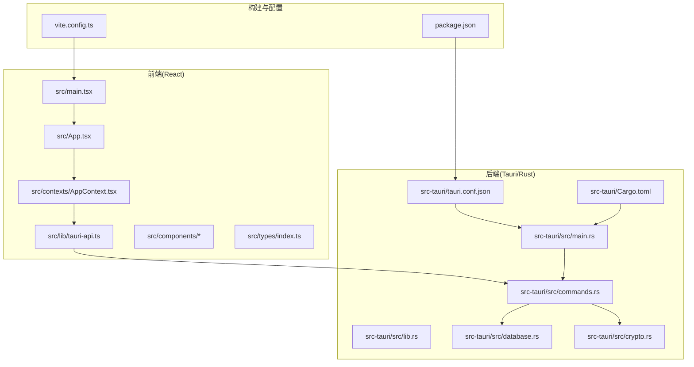
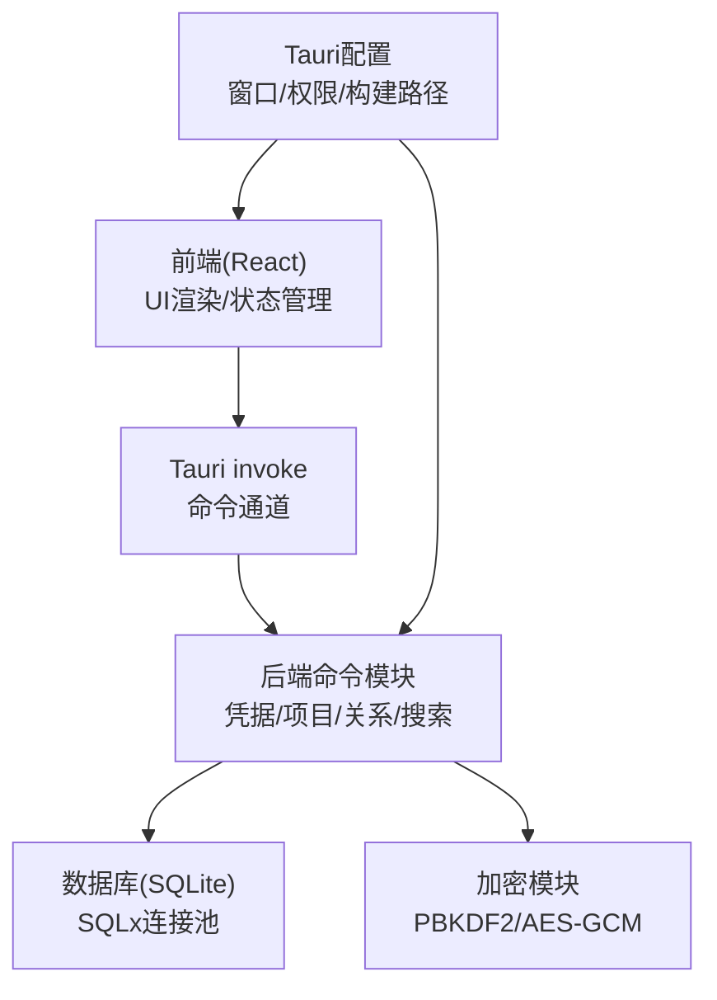
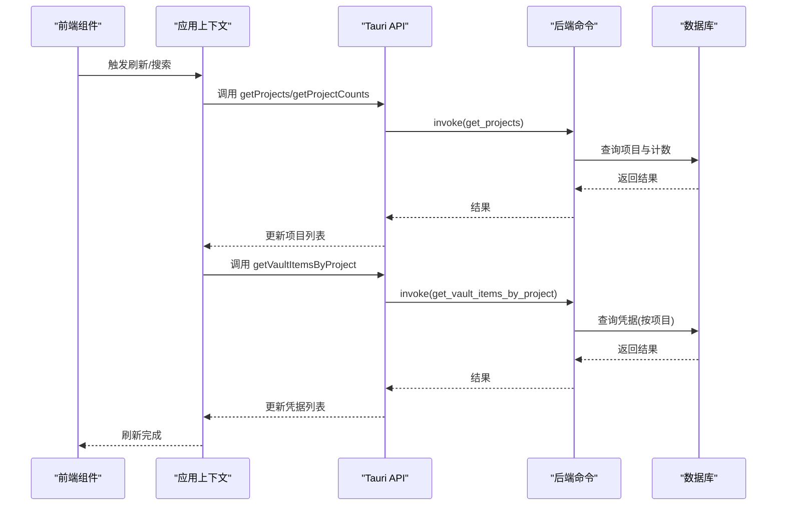
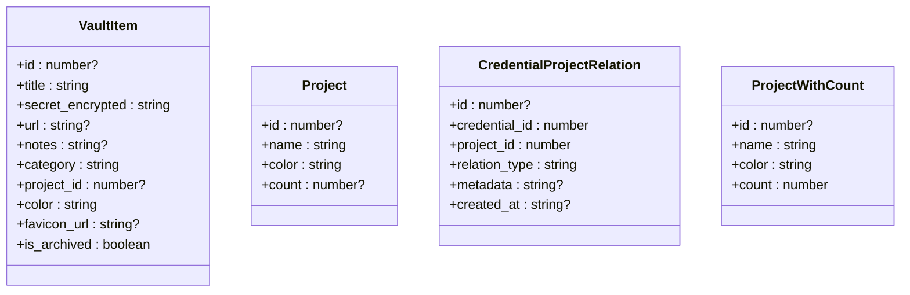
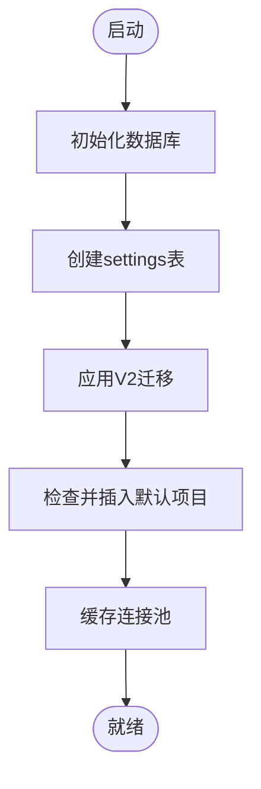
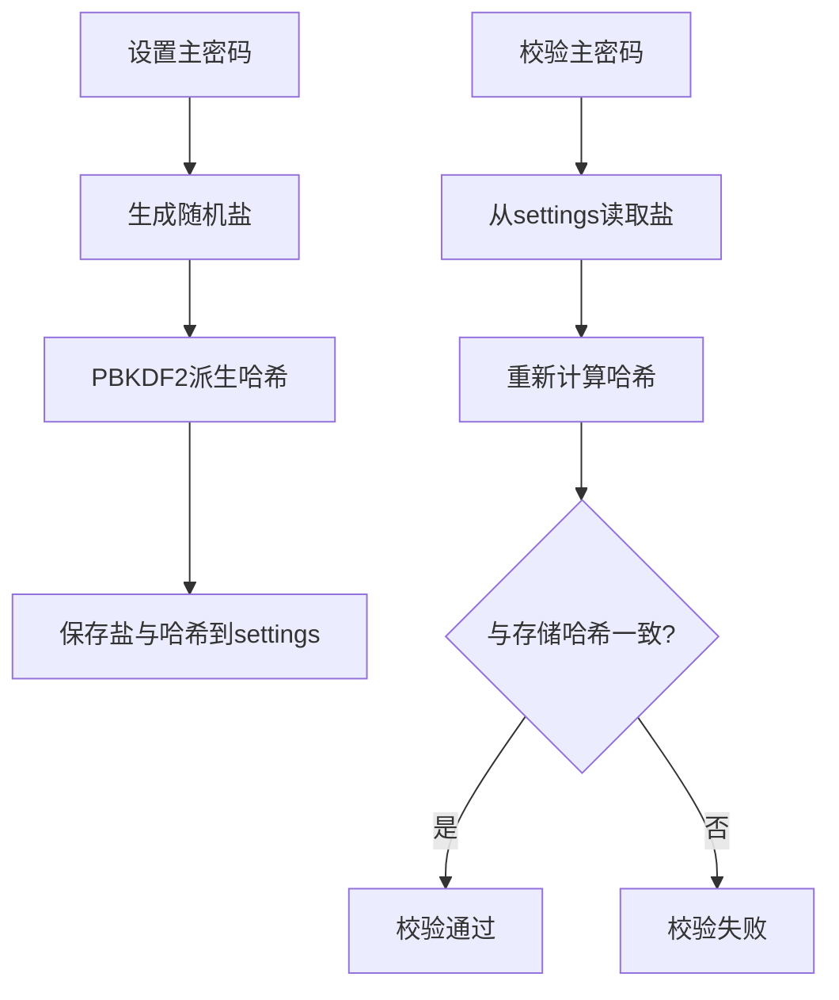
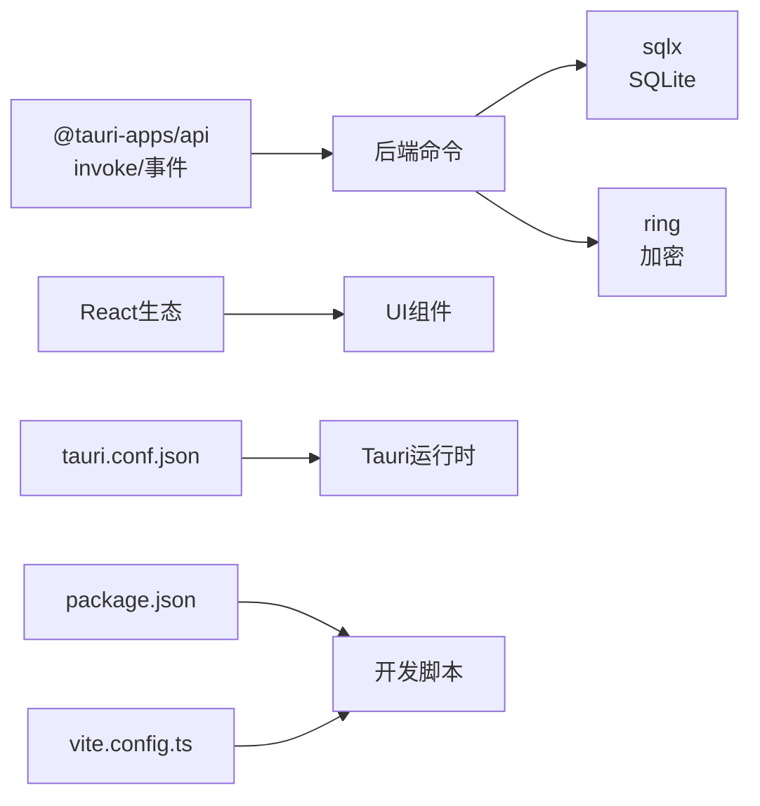

# 整体架构概览

<cite>
**本文档引用的文件**
- [package.json](file://package.json)
- [Cargo.toml](file://src-tauri/Cargo.toml)
- [tauri.conf.json](file://src-tauri/tauri.conf.json)
- [main.tsx](file://src/main.tsx)
- [App.tsx](file://src/App.tsx)
- [main.rs](file://src-tauri/src/main.rs)
- [lib.rs](file://src-tauri/src/lib.rs)
- [commands.rs](file://src-tauri/src/commands.rs)
- [database.rs](file://src-tauri/src/database.rs)
- [crypto.rs](file://src-tauri/src/crypto.rs)
- [AppContext.tsx](file://src/contexts/AppContext.tsx)
- [tauri-api.ts](file://src/lib/tauri-api.ts)
- [MainLayout.tsx](file://src/components/MainLayout.tsx)
- [index.ts](file://src/types/index.ts)
- [vite.config.ts](file://vite.config.ts)
</cite>

## 目录
1. [引言](#引言)
2. [项目结构](#项目结构)
3. [核心组件](#核心组件)
4. [架构总览](#架构总览)
5. [详细组件分析](#详细组件分析)
6. [依赖关系分析](#依赖关系分析)
7. [性能考虑](#性能考虑)
8. [故障排除指南](#故障排除指南)
9. [结论](#结论)

## 引言
本文件为 AIpassword（DevVault）项目的整体架构概览文档，聚焦于系统的高层设计、技术栈选择与架构模式。项目采用 Tauri 框架将 Web 技术与原生应用结合：前端使用 React + TypeScript 构建用户界面，后端以 Rust 实现，通过 Tauri 的命令通道进行通信。数据库采用 SQLite，配合迁移管理；密码学模块基于 ring 库实现安全存储与验证。文档将详细阐述系统边界、组件划分、数据流向与交互模式，并给出架构决策的技术考量、性能影响与可扩展性设计。

## 项目结构
项目采用前后端分离的混合架构：
- 前端（React + TypeScript）：位于 src 目录，负责 UI 渲染、状态管理与用户交互。
- 后端（Rust + Tauri）：位于 src-tauri 目录，负责业务逻辑、数据库访问、加密与系统能力调用。
- 配置与构建：Vite 作为开发服务器与打包工具，Tauri 负责应用打包与系统集成。

**图表来源**
- [main.tsx](file://src/main.tsx#L1-L10)
- [App.tsx](file://src/App.tsx#L1-L29)
- [AppContext.tsx](file://src/contexts/AppContext.tsx#L1-L162)
- [tauri-api.ts](file://src/lib/tauri-api.ts#L1-L84)
- [main.rs](file://src-tauri/src/main.rs#L1-L51)
- [lib.rs](file://src-tauri/src/lib.rs#L1-L4)
- [commands.rs](file://src-tauri/src/commands.rs#L1-L572)
- [database.rs](file://src-tauri/src/database.rs#L1-L104)
- [crypto.rs](file://src-tauri/src/crypto.rs#L1-L92)
- [tauri.conf.json](file://src-tauri/tauri.conf.json#L1-L33)
- [Cargo.toml](file://src-tauri/Cargo.toml#L1-L34)
- [vite.config.ts](file://vite.config.ts#L1-L21)
- [package.json](file://package.json#L1-L32)

**章节来源**
- [package.json](file://package.json#L1-L32)
- [Cargo.toml](file://src-tauri/Cargo.toml#L1-L34)
- [tauri.conf.json](file://src-tauri/tauri.conf.json#L1-L33)
- [vite.config.ts](file://vite.config.ts#L1-L21)

## 核心组件
- 前端入口与路由控制
  - 入口文件负责挂载 React 根节点与全局样式。
  - 应用根组件根据状态切换加载屏、主密码输入屏或主布局。
- 状态与数据流
  - 应用上下文集中管理应用状态、派发动作与数据刷新策略。
  - API 层封装 Tauri 命令调用，统一返回类型与错误处理。
- 后端命令与服务
  - 命令模块定义所有可被前端调用的后端操作，包括凭据、项目、关系、搜索、剪贴板与主密码校验等。
  - 数据库模块负责连接、迁移与查询池管理。
  - 加密模块提供 PBKDF2 密码派生与 AES-GCM 对称加解密。
- 配置与构建
  - Tauri 配置定义开发服务器地址、打包产物目录、窗口属性与权限白名单。
  - Vite 配置固定开发端口、忽略后端目录监听，确保热更新稳定。

**章节来源**
- [main.tsx](file://src/main.tsx#L1-L10)
- [App.tsx](file://src/App.tsx#L1-L29)
- [AppContext.tsx](file://src/contexts/AppContext.tsx#L1-L162)
- [tauri-api.ts](file://src/lib/tauri-api.ts#L1-L84)
- [main.rs](file://src-tauri/src/main.rs#L1-L51)
- [commands.rs](file://src-tauri/src/commands.rs#L1-L572)
- [database.rs](file://src-tauri/src/database.rs#L1-L104)
- [crypto.rs](file://src-tauri/src/crypto.rs#L1-L92)
- [tauri.conf.json](file://src-tauri/tauri.conf.json#L1-L33)
- [vite.config.ts](file://vite.config.ts#L1-L21)

## 架构总览
系统采用“前端渲染 + 后端命令”的混合架构，前端通过 Tauri 的 invoke 通道调用后端命令，后端通过 SQLx 访问 SQLite 数据库，通过 ring 实现安全存储。系统边界清晰：前端仅负责 UI 与交互，后端负责数据持久化与安全处理，二者通过强类型的命令接口通信。

**图表来源**
- [App.tsx](file://src/App.tsx#L1-L29)
- [AppContext.tsx](file://src/contexts/AppContext.tsx#L1-L162)
- [tauri-api.ts](file://src/lib/tauri-api.ts#L1-L84)
- [main.rs](file://src-tauri/src/main.rs#L1-L51)
- [commands.rs](file://src-tauri/src/commands.rs#L1-L572)
- [database.rs](file://src-tauri/src/database.rs#L1-L104)
- [crypto.rs](file://src-tauri/src/crypto.rs#L1-L92)
- [tauri.conf.json](file://src-tauri/tauri.conf.json#L1-L33)

## 详细组件分析

### 前端组件与状态流
- 主布局与响应式设计
  - 主布局根据窗口尺寸切换紧凑模式，左侧为侧边栏与凭据列表，右侧为详情或项目关系面板。
- 状态管理与数据刷新
  - 应用上下文集中维护凭据列表、项目列表、选中项、搜索条件与加载状态；支持按项目筛选与搜索回退。
- API 封装与错误处理
  - API 层对 invoke 进行统一封装，提供凭据 CRUD、项目管理、搜索、剪贴板与主密码相关方法；在刷新与搜索时统一设置加载态。

**图表来源**
- [MainLayout.tsx](file://src/components/MainLayout.tsx#L1-L103)
- [AppContext.tsx](file://src/contexts/AppContext.tsx#L76-L154)
- [tauri-api.ts](file://src/lib/tauri-api.ts#L15-L54)
- [commands.rs](file://src-tauri/src/commands.rs#L395-L435)
- [database.rs](file://src-tauri/src/database.rs#L13-L52)

**章节来源**
- [MainLayout.tsx](file://src/components/MainLayout.tsx#L1-L103)
- [AppContext.tsx](file://src/contexts/AppContext.tsx#L76-L154)
- [tauri-api.ts](file://src/lib/tauri-api.ts#L1-L84)

### 后端命令与数据模型
- 命令接口
  - 凭据：创建、读取、更新、归档删除、按项目查询、未关联凭据查询、导入记录到凭据。
  - 项目：创建、读取、统计项目下凭据数量。
  - 关系：凭据-项目关联创建、删除、查询。
  - 工具：复制到剪贴板（Windows）、抓取网站 favicon。
  - 安全：设置主密码（含盐与哈希存储）、校验主密码、检测是否已设置主密码。
- 数据模型
  - 凭据项、项目、关系、带计数的项目视图等结构体用于命令参数与返回值序列化。

**图表来源**
- [commands.rs](file://src-tauri/src/commands.rs#L9-L38)
- [commands.rs](file://src-tauri/src/commands.rs#L365-L371)

**章节来源**
- [commands.rs](file://src-tauri/src/commands.rs#L1-L572)
- [index.ts](file://src/types/index.ts#L1-L46)

### 数据库与迁移
- 初始化与连接
  - 初始化时创建 settings 表与迁移跟踪表，应用 V2 所有迁移脚本，插入默认项目。
- 连接池与并发
  - 使用 OnceCell 缓存连接池，避免重复初始化；通过异步查询执行业务逻辑。
- 迁移策略
  - 以文件内嵌方式引入迁移脚本，按名称去重执行，确保幂等。

**图表来源**
- [database.rs](file://src-tauri/src/database.rs#L13-L52)
- [database.rs](file://src-tauri/src/database.rs#L54-L97)

**章节来源**
- [database.rs](file://src-tauri/src/database.rs#L1-L104)

### 加密与安全
- 主密码与盐
  - 生成随机盐，使用 PBKDF2-HMAC-SHA256 派生主密钥，将盐与哈希存储于 settings 表。
- 对称加密
  - 使用 AES-256-GCM 对凭据内容进行加密与解密，随机生成 96-bit 非ces，拼接在密文前以便解密。
- 平台差异
  - 当前仅在 Windows 平台实现复制到剪贴板功能。

**图表来源**
- [crypto.rs](file://src-tauri/src/crypto.rs#L76-L92)
- [commands.rs](file://src-tauri/src/commands.rs#L248-L309)

**章节来源**
- [crypto.rs](file://src-tauri/src/crypto.rs#L1-L92)
- [commands.rs](file://src-tauri/src/commands.rs#L248-L309)

## 依赖关系分析
- 前端依赖
  - @tauri-apps/api 提供 invoke 与事件监听；React 生态提供 UI 组件与状态管理。
- 后端依赖
  - tauri 提供命令通道与系统能力；sqlx 提供异步 SQLite 访问；ring 提供密码学算法；clipboard-win 实现 Windows 剪贴板。
- 构建与运行
  - Vite 在固定端口 1420 提供开发服务器，忽略 src-tauri 目录；Tauri 配置 devPath 与 distDir 指向构建输出。

**图表来源**
- [package.json](file://package.json#L13-L31)
- [Cargo.toml](file://src-tauri/Cargo.toml#L15-L28)
- [tauri.conf.json](file://src-tauri/tauri.conf.json#L2-L7)
- [vite.config.ts](file://vite.config.ts#L13-L20)

**章节来源**
- [package.json](file://package.json#L1-L32)
- [Cargo.toml](file://src-tauri/Cargo.toml#L1-L34)
- [tauri.conf.json](file://src-tauri/tauri.conf.json#L1-L33)
- [vite.config.ts](file://vite.config.ts#L1-L21)

## 性能考虑
- 异步与并发
  - 后端使用 tokio 运行时与 sqlx 异步查询，减少阻塞；连接池复用降低开销。
- I/O 优化
  - 数据库迁移与查询均采用异步执行；默认项目插入与计数合并查询提升效率。
- 前端渲染
  - 使用 useReducer 管理复杂状态，避免不必要的重渲染；按需加载详情面板，减少初始渲染压力。
- 开发体验
  - 固定开发端口与忽略后端目录监听，缩短热更新时间；生产构建由 Tauri CLI 统一调度。

[本节为通用性能建议，不直接分析具体文件]

## 故障排除指南
- 启动失败
  - 检查开发端口占用与 Vite 配置；确认 Tauri 配置 devPath 与 distDir 正确。
- 数据库问题
  - 确认 SQLite 文件存在且可写；查看迁移是否成功执行；检查连接池初始化日志。
- 命令调用异常
  - 检查命令注册是否完整；确认 invoke 参数与返回类型匹配；关注后端错误日志。
- 剪贴板不可用
  - 当前仅 Windows 平台实现复制功能；其他平台会输出提示信息。

**章节来源**
- [vite.config.ts](file://vite.config.ts#L13-L20)
- [tauri.conf.json](file://src-tauri/tauri.conf.json#L2-L7)
- [database.rs](file://src-tauri/src/database.rs#L13-L52)
- [commands.rs](file://src-tauri/src/commands.rs#L213-L228)

## 结论
AIpassword 项目通过 Tauri 将 React 前端与 Rust 后端有机结合，形成清晰的分层架构：前端专注 UI 与交互，后端专注数据与安全，二者通过命令通道解耦。该架构具备良好的安全性（PBKDF2+AES-GCM）、可维护性（模块化命令与迁移）与可扩展性（新增命令与页面组件）。建议后续在跨平台剪贴板、批量导入导出、多用户场景等方面持续演进。