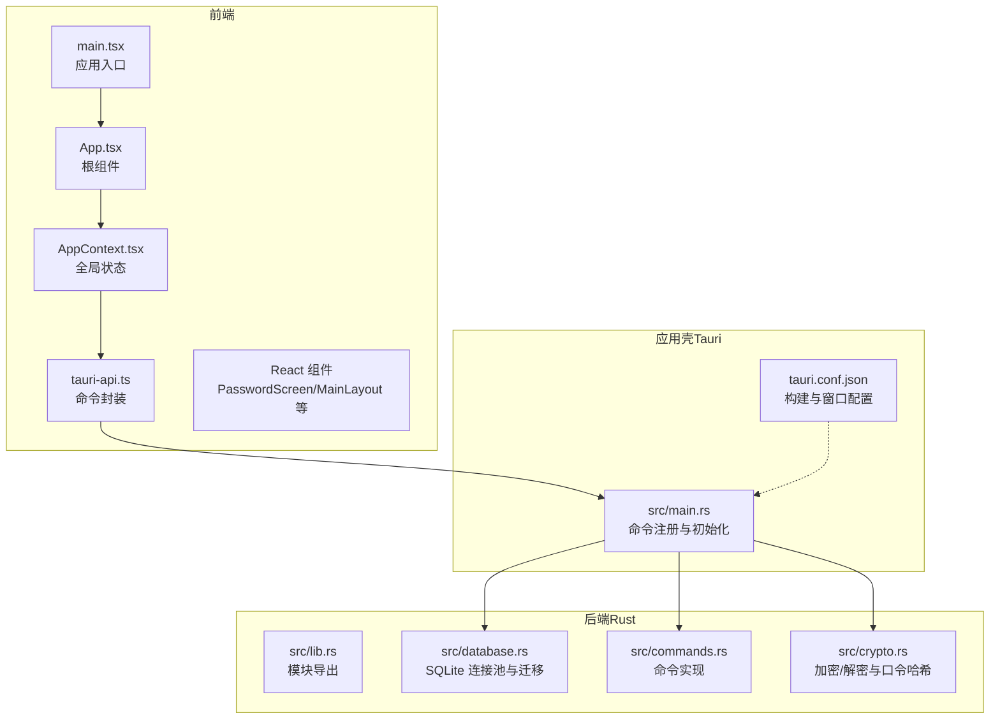
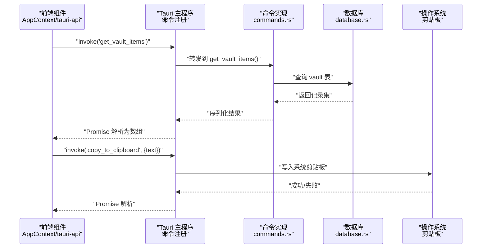
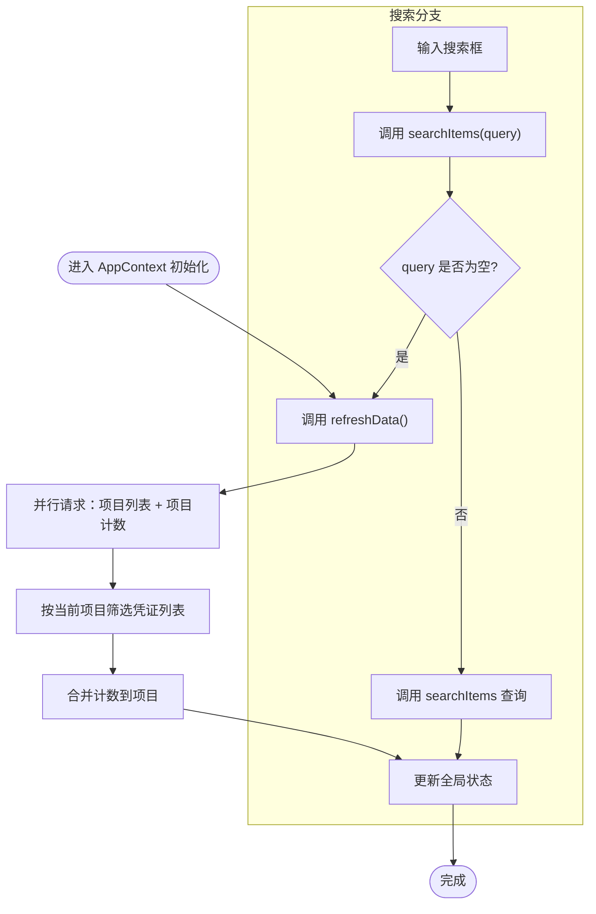
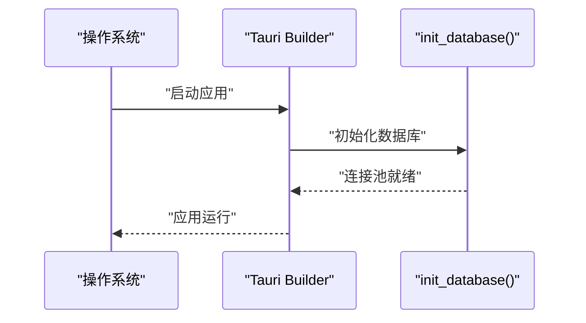
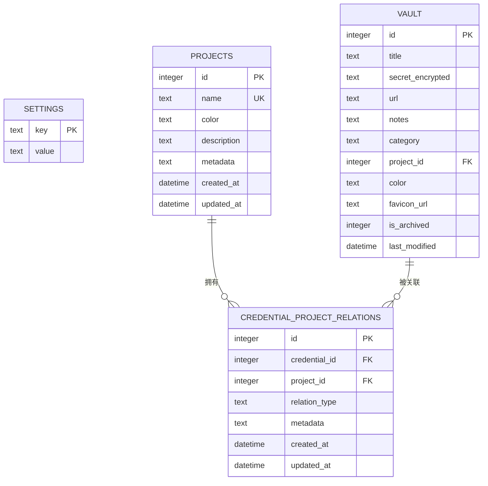
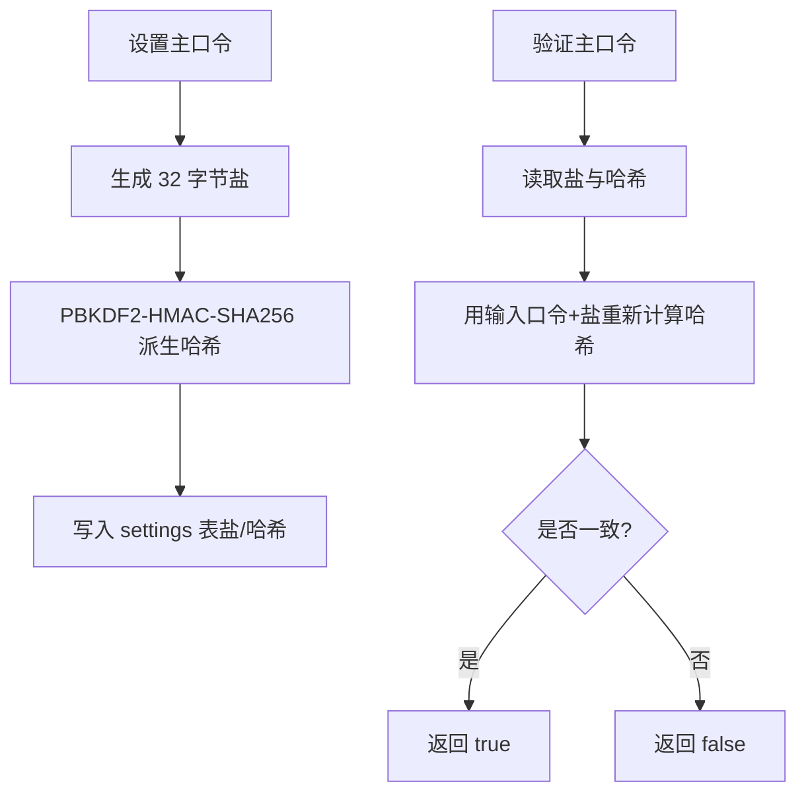
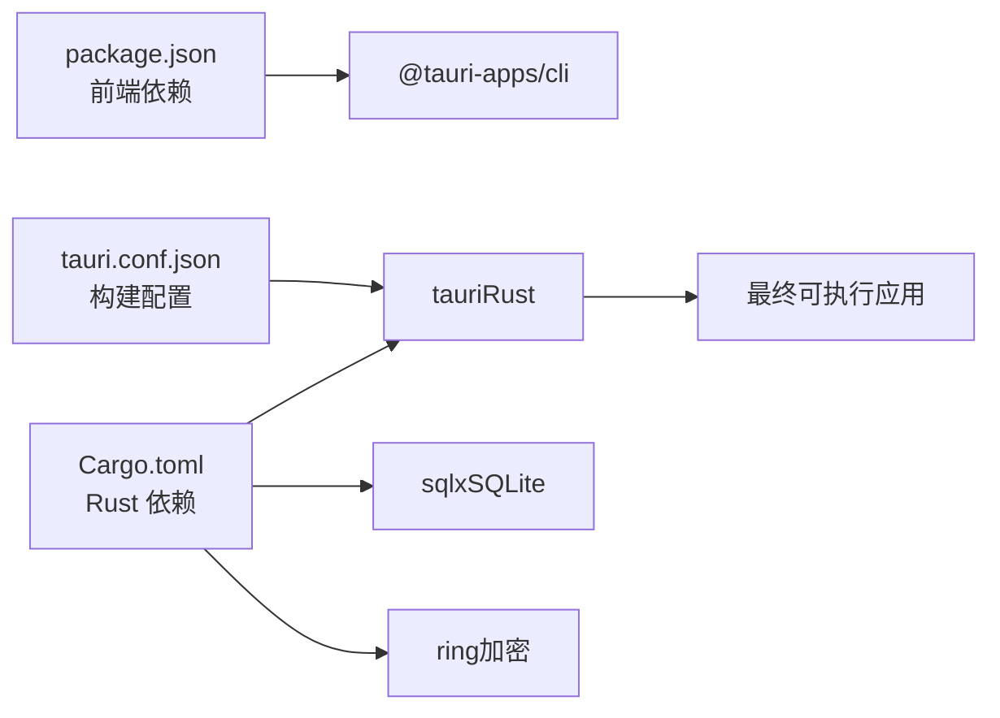

# 架构设计

<cite>
**本文引用的文件**
- [package.json](file://package.json)
- [Cargo.toml（Rust 后端）](file://src-tauri/Cargo.toml)
- [Tauri 配置](file://src-tauri/tauri.conf.json)
- [前端入口 main.tsx](file://src/main.tsx)
- [应用根组件 App.tsx](file://src/App.tsx)
- [全局上下文 AppContext.tsx](file://src/contexts/AppContext.tsx)
- [前端 API 封装 tauri-api.ts](file://src/lib/tauri-api.ts)
- [Rust 主程序 main.rs](file://src-tauri/src/main.rs)
- [库模块导出 lib.rs](file://src-tauri/src/lib.rs)
- [命令实现 commands.rs](file://src-tauri/src/commands.rs)
- [数据库初始化 database.rs](file://src-tauri/src/database.rs)
- [加密模块 crypto.rs](file://src-tauri/src/crypto.rs)
- [类型定义 index.ts](file://src/types/index.ts)
- [迁移脚本 001](file://src-tauri/migrations/001_create_projects_table.sql)
- [迁移脚本 002](file://src-tauri/migrations/002_create_relations_table.sql)
</cite>

## 目录
1. [引言](#引言)
2. [项目结构](#项目结构)
3. [核心组件](#核心组件)
4. [架构总览](#架构总览)
5. [详细组件分析](#详细组件分析)
6. [依赖分析](#依赖分析)
7. [性能考量](#性能考量)
8. [故障排查指南](#故障排查指南)
9. [结论](#结论)
10. [附录](#附录)

## 引言
本文件为 AIpassword（代号 DevVault）项目的架构设计文档，聚焦于整体系统架构、技术选型与设计模式的应用。系统采用前后端分离架构：前端使用 React + TypeScript，通过 Tauri 应用壳在桌面端运行；后端以 Rust 实现，负责数据库访问、加密处理与系统级能力（如剪贴板）。Tauri 提供了安全可控的原生通道，使前端通过受控的命令调用与后端通信，形成“Web 视图 + 原生后端”的混合架构。

## 项目结构
项目采用“前端 React/Vite + Tauri 应用壳 + Rust 后端”的分层组织方式：
- 前端层：React 组件、上下文与工具函数，构建用户界面与交互逻辑。
- 应用壳层：Tauri 配置与生命周期，负责启动前端资源、暴露受控命令、初始化数据库。
- 后端层：Rust 模块化实现，包括数据库连接池与迁移、加密算法、命令处理。

图表来源
- [前端入口 main.tsx](file://src/main.tsx#L1-L10)
- [应用根组件 App.tsx](file://src/App.tsx#L1-L29)
- [全局上下文 AppContext.tsx](file://src/contexts/AppContext.tsx#L1-L162)
- [前端 API 封装 tauri-api.ts](file://src/lib/tauri-api.ts#L1-L84)
- [Rust 主程序 main.rs](file://src-tauri/src/main.rs#L1-L51)
- [库模块导出 lib.rs](file://src-tauri/src/lib.rs#L1-L4)
- [数据库初始化 database.rs](file://src-tauri/src/database.rs#L1-L104)
- [命令实现 commands.rs](file://src-tauri/src/commands.rs#L1-L487)
- [加密模块 crypto.rs](file://src-tauri/src/crypto.rs#L1-L92)
- [Tauri 配置](file://src-tauri/tauri.conf.json#L1-L33)

章节来源
- [package.json](file://package.json#L1-L32)
- [Cargo.toml（Rust 后端）](file://src-tauri/Cargo.toml#L1-L34)
- [Tauri 配置](file://src-tauri/tauri.conf.json#L1-L33)
- [前端入口 main.tsx](file://src/main.tsx#L1-L10)
- [应用根组件 App.tsx](file://src/App.tsx#L1-L29)
- [全局上下文 AppContext.tsx](file://src/contexts/AppContext.tsx#L1-L162)
- [前端 API 封装 tauri-api.ts](file://src/lib/tauri-api.ts#L1-L84)
- [Rust 主程序 main.rs](file://src-tauri/src/main.rs#L1-L51)
- [库模块导出 lib.rs](file://src-tauri/src/lib.rs#L1-L4)
- [数据库初始化 database.rs](file://src-tauri/src/database.rs#L1-L104)
- [命令实现 commands.rs](file://src-tauri/src/commands.rs#L1-L487)
- [加密模块 crypto.rs](file://src-tauri/src/crypto.rs#L1-L92)

## 核心组件
- 前端应用入口与根组件：负责渲染与路由控制，根据状态切换加载屏、主密码输入或主布局。
- 全局状态上下文：集中管理凭证项、项目、搜索、选择项、静默模式、主密码验证状态等，并提供刷新与搜索方法。
- 命令封装层：对 @tauri-apps/api 的 invoke 调用进行统一封装，暴露语义化 API。
- Tauri 主程序：注册命令、初始化数据库、运行应用。
- 数据库与迁移：基于 SQLite，使用连接池与版本化迁移，确保表结构一致性。
- 加密模块：基于 ring 的 AEAD 加密与 PBKDF2 口令派生，用于敏感数据存储与主口令校验。

章节来源
- [应用根组件 App.tsx](file://src/App.tsx#L1-L29)
- [全局上下文 AppContext.tsx](file://src/contexts/AppContext.tsx#L1-L162)
- [前端 API 封装 tauri-api.ts](file://src/lib/tauri-api.ts#L1-L84)
- [Rust 主程序 main.rs](file://src-tauri/src/main.rs#L1-L51)
- [数据库初始化 database.rs](file://src-tauri/src/database.rs#L1-L104)
- [加密模块 crypto.rs](file://src-tauri/src/crypto.rs#L1-L92)

## 架构总览
系统边界与交互关系如下：
- 外部边界：浏览器内核（Webview）承载前端 UI；操作系统提供原生能力（剪贴板等）。
- 内部边界：前端通过受控命令与后端通信；后端通过 SQLX 访问 SQLite；加密模块提供安全能力。
- 数据流：前端发起命令请求 → Tauri 注册器转发 → Rust 命令处理 → 数据库/系统能力 → 返回结果。

图表来源
- [前端 API 封装 tauri-api.ts](file://src/lib/tauri-api.ts#L1-L84)
- [Rust 主程序 main.rs](file://src-tauri/src/main.rs#L21-L50)
- [命令实现 commands.rs](file://src-tauri/src/commands.rs#L66-L98)
- [数据库初始化 database.rs](file://src-tauri/src/database.rs#L99-L104)

## 详细组件分析

### 前端状态与数据流
- 状态模型：AppState 定义了凭证列表、项目列表、当前选择、搜索关键字、加载状态、静默模式与主密码验证状态。
- 上下文职责：统一调度数据刷新、搜索、增删改操作；在项目切换时自动刷新凭证列表；在初始挂载时检查主密码设置。
- 并发优化：使用 Promise.all 并行拉取项目与计数，减少等待时间。

图表来源
- [全局上下文 AppContext.tsx](file://src/contexts/AppContext.tsx#L79-L121)
- [类型定义 index.ts](file://src/types/index.ts#L37-L46)

章节来源
- [全局上下文 AppContext.tsx](file://src/contexts/AppContext.tsx#L1-L162)
- [类型定义 index.ts](file://src/types/index.ts#L1-L46)

### Tauri 命令注册与生命周期
- 命令注册：在 main.rs 中集中注册所有命令，确保前端仅能通过白名单命令访问后端能力。
- 初始化流程：应用启动时异步初始化数据库连接池与迁移，失败会打印错误但不影响运行。
- 平台差异：剪贴板功能在 Windows 平台启用，其他平台暂不实现。

图表来源
- [Rust 主程序 main.rs](file://src-tauri/src/main.rs#L40-L48)
- [数据库初始化 database.rs](file://src-tauri/src/database.rs#L13-L52)

章节来源
- [Rust 主程序 main.rs](file://src-tauri/src/main.rs#L1-L51)
- [数据库初始化 database.rs](file://src-tauri/src/database.rs#L1-L104)

### 数据库与迁移
- 连接池：使用 OnceCell 缓存 SqlitePool，避免重复连接；默认 sqlite:./devvault.db。
- 迁移策略：维护 _migrations 表跟踪已执行迁移；按顺序执行未应用的迁移脚本。
- 默认数据：若项目表为空，插入默认项目以保证最小可用状态。
- 关系表：credential_project_relations 支持凭证与项目的多维关联，含外键约束与索引。

图表来源
- [数据库初始化 database.rs](file://src-tauri/src/database.rs#L13-L52)
- [迁移脚本 001](file://src-tauri/migrations/001_create_projects_table.sql#L1-L13)
- [迁移脚本 002](file://src-tauri/migrations/002_create_relations_table.sql#L1-L16)

章节来源
- [数据库初始化 database.rs](file://src-tauri/src/database.rs#L1-L104)
- [迁移脚本 001](file://src-tauri/migrations/001_create_projects_table.sql#L1-L13)
- [迁移脚本 002](file://src-tauri/migrations/002_create_relations_table.sql#L1-L16)

### 加密模块与主口令
- 主口令存储：使用 PBKDF2-HMAC-SHA256 生成固定长度哈希，盐值与哈希分别存储于 settings 表。
- 凭证加密：CryptoManager 基于 AES-256-GCM 对称加密，随机盐与 nonce 组合，输出 Base64 编码密文。
- 验证流程：前端输入口令后，后端从 settings 读取盐与哈希，重新计算比对。

图表来源
- [命令实现 commands.rs（主口令相关）](file://src-tauri/src/commands.rs#L247-L309)
- [加密模块 crypto.rs](file://src-tauri/src/crypto.rs#L76-L92)

章节来源
- [命令实现 commands.rs](file://src-tauri/src/commands.rs#L247-L309)
- [加密模块 crypto.rs](file://src-tauri/src/crypto.rs#L1-L92)

### 剪贴板与图标抓取
- 剪贴板：Windows 平台使用 clipboard-win 库写入系统剪贴板；其他平台暂不实现。
- 图标抓取：解析 URL 域名，返回 Google Favicon 服务地址作为占位或实际图标。

章节来源
- [命令实现 commands.rs（剪贴板与图标）](file://src-tauri/src/commands.rs#L213-L245)

## 依赖分析
- 前端依赖：React 生态、@tauri-apps/api、TailwindCSS 等。
- 后端依赖：tauri、sqlx（SQLite）、tokio（异步）、ring（加密）、reqwest（HTTP，预留）、uuid/base64/url 等。
- 构建链路：Vite 打包前端 → Tauri 构建应用壳 → Rust 编译后端 → 产出可执行文件。

图表来源
- [package.json](file://package.json#L1-L32)
- [Cargo.toml（Rust 后端）](file://src-tauri/Cargo.toml#L1-L34)
- [Tauri 配置](file://src-tauri/tauri.conf.json#L1-L33)

章节来源
- [package.json](file://package.json#L1-L32)
- [Cargo.toml（Rust 后端）](file://src-tauri/Cargo.toml#L1-L34)
- [Tauri 配置](file://src-tauri/tauri.conf.json#L1-L33)

## 性能考量
- 数据库连接池：使用 OnceCell 缓存连接池，避免重复建立连接，降低开销。
- 查询优化：迁移脚本中为常用字段建立索引（如 projects.name、relations 的 credential/project），提升查询效率。
- 并发请求：前端在刷新数据时并行获取项目与计数，缩短首屏等待时间。
- 异步初始化：数据库初始化在应用启动阶段异步执行，避免阻塞主线程。
- 剪贴板平台差异：仅在 Windows 平台启用，减少跨平台兼容成本。

章节来源
- [数据库初始化 database.rs](file://src-tauri/src/database.rs#L5-L52)
- [迁移脚本 001](file://src-tauri/migrations/001_create_projects_table.sql#L12-L13)
- [迁移脚本 002](file://src-tauri/migrations/002_create_relations_table.sql#L14-L16)
- [全局上下文 AppContext.tsx](file://src/contexts/AppContext.tsx#L82-L85)

## 故障排查指南
- 数据库未初始化：检查 init_database 是否成功执行；确认 devvault.db 文件存在且可写。
- 命令调用失败：确认命令已在 main.rs 中注册；检查 invoke 参数与返回类型是否匹配。
- 主口令校验异常：检查 settings 表中是否存在 salt/hash；确认 Base64 编解码正确。
- 剪贴板无效：确认当前平台为 Windows；其他平台不会执行复制操作。
- 开发调试：查看 Tauri 控制台输出与前端日志；确认 devPath 与 distDir 配置正确。

章节来源
- [Rust 主程序 main.rs](file://src-tauri/src/main.rs#L40-L48)
- [数据库初始化 database.rs](file://src-tauri/src/database.rs#L13-L52)
- [命令实现 commands.rs（主口令）](file://src-tauri/src/commands.rs#L272-L309)
- [命令实现 commands.rs（剪贴板）](file://src-tauri/src/commands.rs#L213-L228)
- [Tauri 配置](file://src-tauri/tauri.conf.json#L2-L7)

## 结论
本架构以 Tauri 为应用壳，结合 React 前端与 Rust 后端，实现了安全、可扩展且跨平台的桌面应用。通过严格的命令白名单、SQLite 连接池与版本化迁移、以及基于 ring 的加密方案，系统在易用性与安全性之间取得平衡。未来可在以下方面持续演进：完善非 Windows 平台的剪贴板支持、引入更细粒度的权限控制、扩展备份与同步能力。

## 附录
- 技术选型要点
  - 前端：React + TypeScript + Vite，便于快速迭代与类型安全。
  - 应用壳：Tauri，兼顾性能与安全，支持多平台打包。
  - 后端：Rust + SQLX，高性能、内存安全，适合数据库与加密场景。
  - 加密：ring 提供业界标准 AEAD 与口令派生，满足本地存储安全需求。
- 设计模式
  - 命令模式：前端通过 invoke 调用后端命令，解耦 UI 与业务逻辑。
  - 单例/连接池：数据库连接池与一次性初始化，减少资源消耗。
  - 状态管理模式：全局上下文集中管理状态与副作用，简化组件间通信。