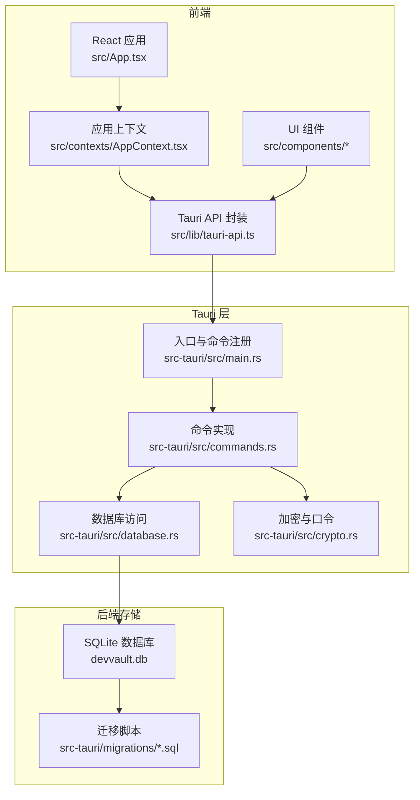
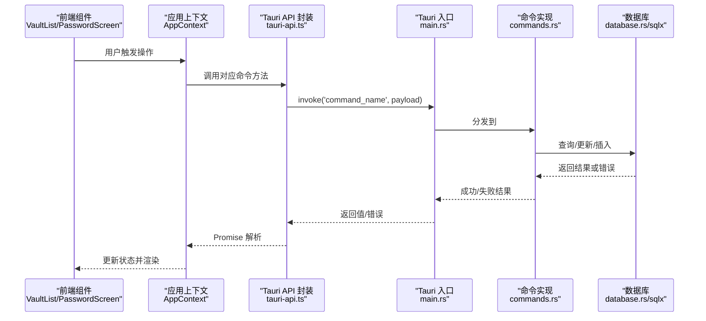
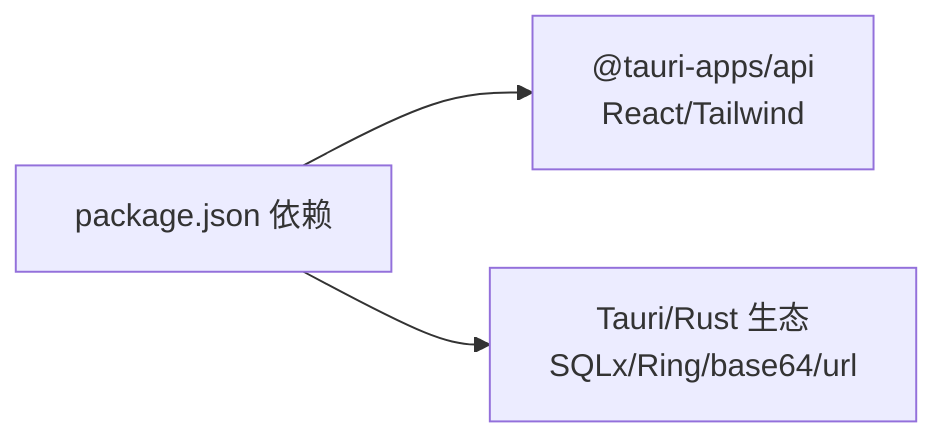

# 通信机制设计

<cite>
**本文引用的文件**
- [src/lib/tauri-api.ts](file://src/lib/tauri-api.ts)
- [src-tauri/src/main.rs](file://src-tauri/src/main.rs)
- [src-tauri/src/commands.rs](file://src-tauri/src/commands.rs)
- [src-tauri/src/database.rs](file://src-tauri/src/database.rs)
- [src-tauri/src/crypto.rs](file://src-tauri/src/crypto.rs)
- [src-tauri/tauri.conf.json](file://src-tauri/tauri.conf.json)
- [src/types/index.ts](file://src/types/index.ts)
- [src/contexts/AppContext.tsx](file://src/contexts/AppContext.tsx)
- [src/components/PasswordScreen.tsx](file://src/components/PasswordScreen.tsx)
- [src/components/SearchBar.tsx](file://src/components/SearchBar.tsx)
- [src/components/VaultList.tsx](file://src/components/VaultList.tsx)
- [src/App.tsx](file://src/App.tsx)
- [package.json](file://package.json)
- [src-tauri/migrations/001_create_projects_table.sql](file://src-tauri/migrations/001_create_projects_table.sql)
- [src-tauri/migrations/002_create_relations_table.sql](file://src-tauri/migrations/002_create_relations_table.sql)
- [src-tauri/migrations/003_create_imports_table.sql](file://src-tauri/migrations/003_create_imports_table.sql)
</cite>

## 目录
1. [引言](#引言)
2. [项目结构](#项目结构)
3. [核心组件](#核心组件)
4. [架构总览](#架构总览)
5. [详细组件分析](#详细组件分析)
6. [依赖关系分析](#依赖关系分析)
7. [性能考量](#性能考量)
8. [故障排查指南](#故障排查指南)
9. [结论](#结论)
10. [附录](#附录)

## 引言
本设计文档聚焦于 AIpassword（DevVault）项目的通信机制，系统性阐述前端与后端之间的通信协议、Tauri 命令系统实现与 IPC 通信机制，以及 API 接口设计规范、参数传递与返回值处理方式。文档还覆盖异步通信模式、错误处理与超时机制、通信安全与权限控制、数据验证策略，并通过通信流程图与消息序列图展示从用户交互到数据响应的完整链路。最后给出并发处理、队列管理与性能优化建议。

## 项目结构
项目采用 Tauri 桌面应用架构：前端基于 React + TypeScript，通过 @tauri-apps/api 的 invoke 与事件监听与后端 Rust 进程进行 IPC 通信；后端 Rust 模块通过 #[command] 注解暴露命令，统一在 main.rs 中注册，使用 SQLx 访问 SQLite 数据库，Ring 实现加密与口令校验。

图表来源
- [src/App.tsx](file://src/App.tsx#L1-L29)
- [src/contexts/AppContext.tsx](file://src/contexts/AppContext.tsx#L1-L162)
- [src/lib/tauri-api.ts](file://src/lib/tauri-api.ts#L1-L97)
- [src-tauri/src/main.rs](file://src-tauri/src/main.rs#L1-L58)
- [src-tauri/src/commands.rs](file://src-tauri/src/commands.rs#L1-L572)
- [src-tauri/src/database.rs](file://src-tauri/src/database.rs#L1-L104)
- [src-tauri/src/crypto.rs](file://src-tauri/src/crypto.rs#L1-L92)
- [src-tauri/migrations/001_create_projects_table.sql](file://src-tauri/migrations/001_create_projects_table.sql#L1-L13)
- [src-tauri/migrations/002_create_relations_table.sql](file://src-tauri/migrations/002_create_relations_table.sql#L1-L16)
- [src-tauri/migrations/003_create_imports_table.sql](file://src-tauri/migrations/003_create_imports_table.sql#L1-L15)

章节来源
- [src/App.tsx](file://src/App.tsx#L1-L29)
- [src-tauri/src/main.rs](file://src-tauri/src/main.rs#L1-L58)

## 核心组件
- 前端 API 封装层：集中定义所有 Tauri 命令调用，统一参数与返回类型，便于上层组件使用与测试。
- Tauri 命令层：以 #[command] 导出的函数作为 IPC 入口，负责参数解析、业务逻辑与数据库交互。
- 数据库层：SQLx 连接池与迁移脚本，确保表结构一致性与幂等迁移。
- 加密与口令层：基于 Ring 的 AEAD 加密与 PBKDF2 口令哈希，保障敏感数据安全。
- 应用上下文与组件：状态管理、并发请求合并、搜索去抖、主口令验证与 UI 切换。

章节来源
- [src/lib/tauri-api.ts](file://src/lib/tauri-api.ts#L1-L97)
- [src-tauri/src/commands.rs](file://src-tauri/src/commands.rs#L1-L572)
- [src-tauri/src/database.rs](file://src-tauri/src/database.rs#L1-L104)
- [src-tauri/src/crypto.rs](file://src-tauri/src/crypto.rs#L1-L92)
- [src/contexts/AppContext.tsx](file://src/contexts/AppContext.tsx#L1-L162)

## 架构总览
下图展示了从前端到后端的典型调用链路：前端通过 invoke 调用后端命令，后端命令执行数据库查询或写入，必要时进行加密/解密，最终返回结果给前端。

图表来源
- [src/lib/tauri-api.ts](file://src/lib/tauri-api.ts#L1-L97)
- [src-tauri/src/main.rs](file://src-tauri/src/main.rs#L24-L57)
- [src-tauri/src/commands.rs](file://src-tauri/src/commands.rs#L40-L228)
- [src-tauri/src/database.rs](file://src-tauri/src/database.rs#L13-L52)

## 详细组件分析

### 前端通信封装与类型模型
- API 方法命名与职责清晰：如创建/读取/更新/删除凭证项、项目、关系、导入记录；剪贴板复制、Favicon 获取；主口令设置/校验/存在性检查；搜索与按项目筛选等。
- 类型模型与后端保持一致：VaultItem、Project、CreateVaultItemRequest、UpdateVaultItemRequest 等，确保序列化/反序列化一致性。
- 事件监听：提供剪贴板变更事件监听，便于实现“粘贴即用”等特性。

章节来源
- [src/lib/tauri-api.ts](file://src/lib/tauri-api.ts#L1-L97)
- [src/types/index.ts](file://src/types/index.ts#L1-L46)

### Tauri 命令系统与 IPC
- 命令注册：在 main.rs 中集中注册所有 #[command] 函数，形成统一的 IPC 入口。
- 参数与返回：命令函数接收明确的参数类型，返回 Result<T, String>，前端以 Promise 形式接收成功/失败。
- 平台差异：如剪贴板功能仅在 Windows 平台启用，其他平台返回空结果，避免跨平台兼容性问题。

章节来源
- [src-tauri/src/main.rs](file://src-tauri/src/main.rs#L24-L57)
- [src-tauri/src/commands.rs](file://src-tauri/src/commands.rs#L212-L228)

### 数据库与迁移
- 连接池与初始化：启动时初始化 SQLite 连接池，创建 settings 表与默认项目，保证最小可用状态。
- 迁移机制：通过 _migrations 表跟踪已应用的迁移，支持幂等执行多版本迁移脚本。
- 关系与索引：项目/凭证关系表与索引提升查询效率；导入表支持外键约束。

章节来源
- [src-tauri/src/database.rs](file://src-tauri/src/database.rs#L13-L52)
- [src-tauri/migrations/001_create_projects_table.sql](file://src-tauri/migrations/001_create_projects_table.sql#L1-L13)
- [src-tauri/migrations/002_create_relations_table.sql](file://src-tauri/migrations/002_create_relations_table.sql#L1-L16)
- [src-tauri/migrations/003_create_imports_table.sql](file://src-tauri/migrations/003_create_imports_table.sql#L1-L15)

### 加密与口令安全
- 主口令：PBKDF2 + 盐值存储，口令校验时解码存储的盐并重新计算哈希比对。
- 加密/解密：基于 AES-256-GCM，随机盐作为 nonce，加密结果包含盐与密文，便于解密。
- 敏感数据保护：后端仅在必要时进行解密，前端复制前应由后端完成解密与格式化，避免明文泄露。

章节来源
- [src-tauri/src/crypto.rs](file://src-tauri/src/crypto.rs#L1-L92)
- [src-tauri/src/commands.rs](file://src-tauri/src/commands.rs#L248-L309)

### 应用上下文与异步通信
- 并发请求合并：刷新数据时并行获取项目与计数，减少等待时间。
- 搜索去抖：输入框变更后延迟 300ms 触发搜索，避免频繁网络/数据库请求。
- 主口令验证：启动时检测口令状态，决定 UI 切换至密码屏或主界面。

章节来源
- [src/contexts/AppContext.tsx](file://src/contexts/AppContext.tsx#L79-L121)
- [src/components/SearchBar.tsx](file://src/components/SearchBar.tsx#L9-L18)
- [src/components/PasswordScreen.tsx](file://src/components/PasswordScreen.tsx#L14-L28)

### 组件级通信示例
- 复制凭证：VaultList 组件调用 smartCopy，底层通过 API 调用后端命令完成复制（当前实现为占位，实际应先解密再复制）。
- 删除凭证：确认后调用 API 删除命令，同步更新本地状态。
- 主口令流程：PasswordScreen 在首次使用时设置口令，后续使用时校验口令，成功后进入主界面。

章节来源
- [src/components/VaultList.tsx](file://src/components/VaultList.tsx#L9-L28)
- [src/components/PasswordScreen.tsx](file://src/components/PasswordScreen.tsx#L30-L61)

### API 设计规范与参数/返回值
- 命名规范：动词+名词形式，如 create_vault_item、get_vault_items_by_project、search_items。
- 参数传递：对象参数统一序列化，后端以结构体接收；可选参数使用 Option 类型。
- 返回值处理：成功返回具体类型（如 id、列表），失败返回字符串错误信息；前端以 Promise.catch 捕获错误。

章节来源
- [src/lib/tauri-api.ts](file://src/lib/tauri-api.ts#L5-L97)
- [src-tauri/src/commands.rs](file://src-tauri/src/commands.rs#L40-L228)

### 错误处理与超时机制
- 错误传播：命令内部将错误转换为字符串，统一通过 Result 返回；前端捕获并显示。
- 超时控制：当前未显式设置超时；可在前端调用侧增加超时包装，或在 Tauri 层通过 tokio 超时任务实现。
- UI 反馈：加载状态与错误提示在上下文中集中管理，避免重复代码。

章节来源
- [src/contexts/AppContext.tsx](file://src/contexts/AppContext.tsx#L79-L121)
- [src/components/PasswordScreen.tsx](file://src/components/PasswordScreen.tsx#L30-L61)

### 安全与权限控制
- 权限白名单：tauri.conf.json 显式关闭 all，仅允许必要能力，降低攻击面。
- 主口令保护：口令设置/校验流程确保应用级访问控制；敏感操作可结合口令二次确认。
- 数据验证：前端对输入进行基础校验（长度、匹配），后端对关键字段进行非空与格式检查。

章节来源
- [src-tauri/tauri.conf.json](file://src-tauri/tauri.conf.json#L13-L15)
- [src/components/PasswordScreen.tsx](file://src/components/PasswordScreen.tsx#L36-L44)

### 并发处理、队列与性能优化
- 并发请求：使用 Promise.all 并行获取项目与计数，缩短首屏加载时间。
- 搜索去抖：300ms 延迟减少无效请求，提升用户体验。
- 数据库连接池：全局单例连接池，避免频繁建立/销毁连接。
- 索引优化：迁移脚本中为高频查询字段建立索引，降低查询成本。

章节来源
- [src/contexts/AppContext.tsx](file://src/contexts/AppContext.tsx#L82-L85)
- [src-tauri/src/database.rs](file://src-tauri/src/database.rs#L99-L104)
- [src-tauri/migrations/001_create_projects_table.sql](file://src-tauri/migrations/001_create_projects_table.sql#L12-L13)
- [src-tauri/migrations/002_create_relations_table.sql](file://src-tauri/migrations/002_create_relations_table.sql#L14-L15)
- [src-tauri/migrations/003_create_imports_table.sql](file://src-tauri/migrations/003_create_imports_table.sql#L13-L14)

## 依赖关系分析
- 前端依赖：React、@tauri-apps/api、TailwindCSS 等。
- 后端依赖：Tauri、SQLx、Ring、base64、url、clipboard-win（Windows）等。
- 构建与运行：Vite + TypeScript 前端构建，Tauri CLI 打包桌面应用。

图表来源
- [package.json](file://package.json#L13-L31)

章节来源
- [package.json](file://package.json#L1-L32)

## 性能考量
- 请求合并：在 AppContext 中对相关请求进行并行处理，减少总耗时。
- 搜索节流：输入搜索时采用去抖策略，避免高频请求。
- 数据库优化：索引与迁移脚本确保查询路径高效；连接池复用连接。
- 剪贴板平台适配：仅在 Windows 平台启用原生剪贴板，避免跨平台开销。
- 前端渲染优化：列表项使用选择态与条件渲染，减少不必要的重绘。

章节来源
- [src/contexts/AppContext.tsx](file://src/contexts/AppContext.tsx#L79-L121)
- [src/components/SearchBar.tsx](file://src/components/SearchBar.tsx#L9-L18)
- [src-tauri/src/commands.rs](file://src-tauri/src/commands.rs#L212-L228)
- [src-tauri/migrations/001_create_projects_table.sql](file://src-tauri/migrations/001_create_projects_table.sql#L12-L13)

## 故障排查指南
- 数据库未初始化：检查初始化日志与连接池状态，确认迁移脚本是否成功执行。
- 命令调用失败：查看命令返回的错误字符串，定位 SQLx 查询或加密/解密环节。
- 剪贴板无响应：确认平台为 Windows，且 clipboard-win 可用；其他平台会直接返回空结果。
- 主口令异常：检查 settings 表中盐与哈希是否存在，PBKDF2 参数是否一致。
- 前端无响应：确认 AppContext 是否正确刷新数据，Promise 错误是否被捕获并显示。

章节来源
- [src-tauri/src/database.rs](file://src-tauri/src/database.rs#L13-L52)
- [src-tauri/src/commands.rs](file://src-tauri/src/commands.rs#L248-L309)
- [src-tauri/src/commands.rs](file://src-tauri/src/commands.rs#L212-L228)
- [src/contexts/AppContext.tsx](file://src/contexts/AppContext.tsx#L79-L121)

## 结论
本项目通过清晰的前后端分层与 Tauri 命令系统实现了稳定高效的 IPC 通信。前端以 API 封装屏蔽底层细节，后端以命令模块承载业务逻辑与数据持久化，配合数据库迁移与加密模块，形成安全、可维护的通信体系。未来可在超时控制、错误分类与更细粒度的并发策略方面进一步优化。

## 附录
- 命令清单与职责概览
  - 凭证项：create_vault_item、get_vault_items、get_vault_items_by_project、get_unlinked_vault_items、update_vault_item、delete_vault_item、search_items
  - 项目：create_project、get_projects、get_project_counts
  - 关系：create_credential_project_relation、delete_credential_project_relation、get_relations_for_credential、delete_relation_by_credential_and_project
  - 导入：get_import_records、delete_import_record、import_record_to_vault
  - 工具：copy_to_clipboard、fetch_favicon
  - 主口令：set_master_password、has_master_password、verify_master_password

章节来源
- [src/lib/tauri-api.ts](file://src/lib/tauri-api.ts#L5-L97)
- [src-tauri/src/commands.rs](file://src-tauri/src/commands.rs#L40-L572)