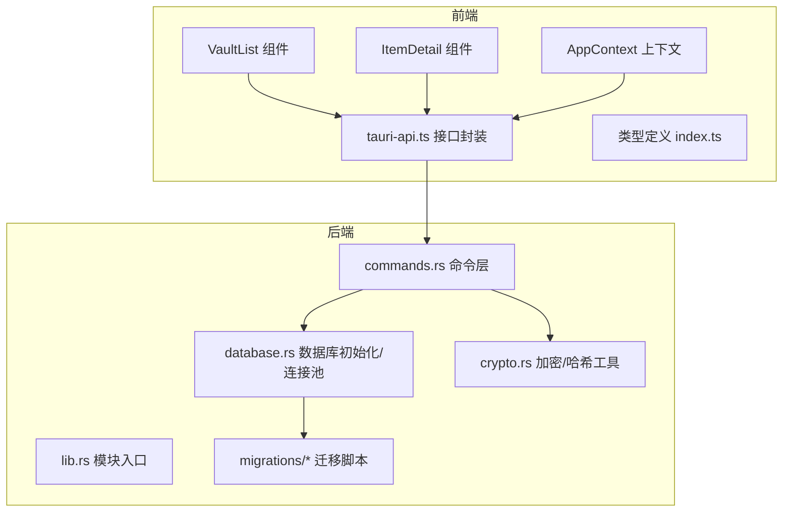
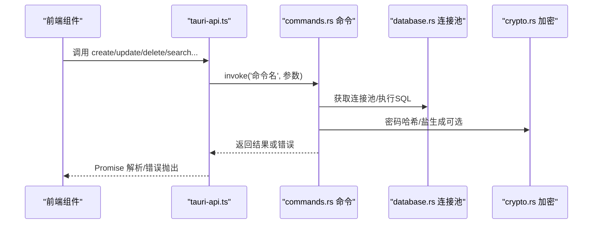
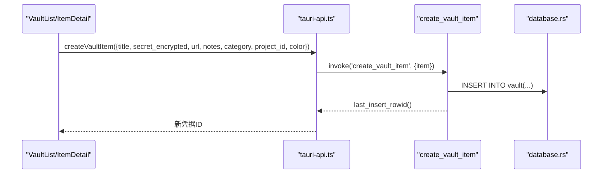
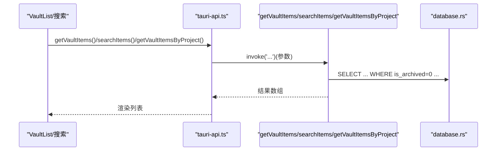
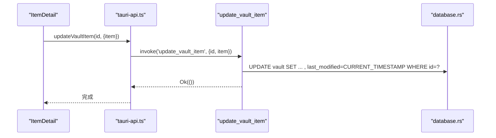
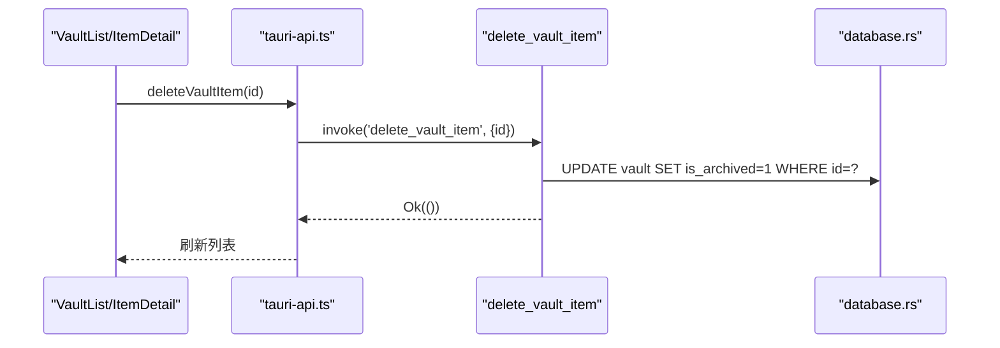
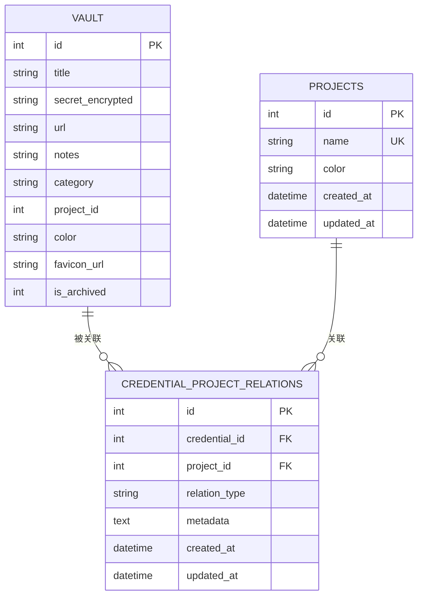
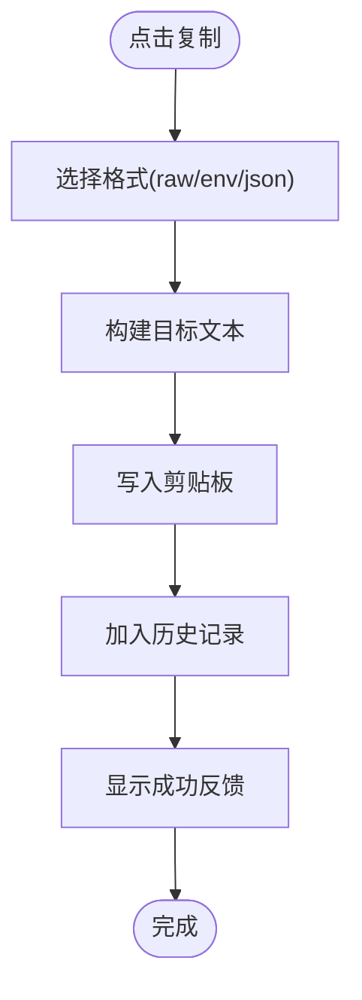
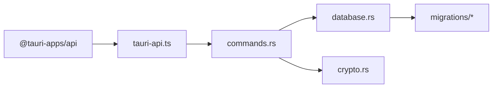

# 凭据管理

<cite>
**本文引用的文件**
- [src-tauri/src/lib.rs](file://src-tauri/src/lib.rs)
- [src-tauri/src/commands.rs](file://src-tauri/src/commands.rs)
- [src-tauri/src/database.rs](file://src-tauri/src/database.rs)
- [src-tauri/src/crypto.rs](file://src-tauri/src/crypto.rs)
- [src-tauri/migrations/001_create_projects_table.sql](file://src-tauri/migrations/001_create_projects_table.sql)
- [src-tauri/migrations/002_create_relations_table.sql](file://src-tauri/migrations/002_create_relations_table.sql)
- [src-tauri/migrations/003_create_imports_table.sql](file://src-tauri/migrations/003_create_imports_table.sql)
- [src-tauri/migrations/004_create_api_keys_table.sql](file://src-tauri/migrations/004_create_api_keys_table.sql)
- [src-tauri/migrations/005_migrate_vault_relations.sql](file://src-tauri/migrations/005_migrate_vault_relations.sql)
- [src/types/index.ts](file://src/types/index.ts)
- [src/lib/tauri-api.ts](file://src/lib/tauri-api.ts)
- [src/components/VaultList.tsx](file://src/components/VaultList.tsx)
- [src/components/ItemDetail.tsx](file://src/components/ItemDetail.tsx)
- [src/contexts/AppContext.tsx](file://src/contexts/AppContext.tsx)
- [src/lib/smart-copy.ts](file://src/lib/smart-copy.ts)
- [src-tauri/Cargo.toml](file://src-tauri/Cargo.toml)
</cite>

## 目录
1. [简介](#简介)
2. [项目结构](#项目结构)
3. [核心组件](#核心组件)
4. [架构总览](#架构总览)
5. [详细组件分析](#详细组件分析)
6. [依赖分析](#依赖分析)
7. [性能考虑](#性能考虑)
8. [故障排查指南](#故障排查指南)
9. [结论](#结论)
10. [附录](#附录)

## 简介
本文件围绕凭据管理功能进行系统化技术文档编写，覆盖凭据的完整生命周期：创建、编辑、删除与查看；深入解析 VaultItem 数据模型与项目关联关系；梳理前后端数据传输协议、参数校验、错误处理与事务管理；提供 API 调用示例与使用模式（含批量与异步）、数据持久化与缓存策略及性能优化建议。

## 项目结构
该应用采用 Tauri 前后端分离架构：
- 前端（React + TypeScript）负责 UI、状态管理与用户交互；
- 后端（Rust + SQLx + SQLite）负责数据库访问、加密与命令处理；
- 通过 Tauri 的 invoke 机制进行跨端通信。

图表来源
- [src-tauri/src/lib.rs](file://src-tauri/src/lib.rs#L1-L4)
- [src-tauri/src/commands.rs](file://src-tauri/src/commands.rs#L1-L572)
- [src-tauri/src/database.rs](file://src-tauri/src/database.rs#L1-L104)
- [src-tauri/src/crypto.rs](file://src-tauri/src/crypto.rs#L1-L92)
- [src/lib/tauri-api.ts](file://src/lib/tauri-api.ts#L1-L97)
- [src/components/VaultList.tsx](file://src/components/VaultList.tsx#L1-L209)
- [src/components/ItemDetail.tsx](file://src/components/ItemDetail.tsx#L1-L234)
- [src/contexts/AppContext.tsx](file://src/contexts/AppContext.tsx#L1-L162)

章节来源
- [src-tauri/src/lib.rs](file://src-tauri/src/lib.rs#L1-L4)
- [src-tauri/src/commands.rs](file://src-tauri/src/commands.rs#L1-L572)
- [src-tauri/src/database.rs](file://src-tauri/src/database.rs#L1-L104)
- [src-tauri/src/crypto.rs](file://src-tauri/src/crypto.rs#L1-L92)
- [src/lib/tauri-api.ts](file://src/lib/tauri-api.ts#L1-L97)
- [src/components/VaultList.tsx](file://src/components/VaultList.tsx#L1-L209)
- [src/components/ItemDetail.tsx](file://src/components/ItemDetail.tsx#L1-L234)
- [src/contexts/AppContext.tsx](file://src/contexts/AppContext.tsx#L1-L162)

## 核心组件
- 命令层（Rust）：提供凭据与项目 CRUD、搜索、导入记录转换、剪贴板、主密码设置与校验等命令。
- 数据库层（SQLx + SQLite）：初始化连接池、执行迁移、查询与更新。
- 类型层（TypeScript）：定义 VaultItem、Project、请求体等接口。
- 前端接口封装（tauri-api.ts）：统一暴露 invoke 调用，屏蔽命令名差异。
- UI 组件：列表展示、详情展示、复制粘贴格式化、搜索与项目筛选。
- 加密模块（Rust）：基于 PBKDF2 + AES-256-GCM 的密钥派生与加解密。

章节来源
- [src-tauri/src/commands.rs](file://src-tauri/src/commands.rs#L40-L138)
- [src-tauri/src/database.rs](file://src-tauri/src/database.rs#L13-L52)
- [src/types/index.ts](file://src/types/index.ts#L1-L46)
- [src/lib/tauri-api.ts](file://src/lib/tauri-api.ts#L1-L97)
- [src/components/VaultList.tsx](file://src/components/VaultList.tsx#L1-L209)
- [src/components/ItemDetail.tsx](file://src/components/ItemDetail.tsx#L1-L234)
- [src/lib/smart-copy.ts](file://src/lib/smart-copy.ts#L1-L152)
- [src-tauri/src/crypto.rs](file://src-tauri/src/crypto.rs#L1-L92)

## 架构总览
前后端通过 Tauri 的 invoke 通道通信，命令层对数据库与加密模块进行编排，类型层确保前后端契约一致。

图表来源
- [src/lib/tauri-api.ts](file://src/lib/tauri-api.ts#L1-L97)
- [src-tauri/src/commands.rs](file://src-tauri/src/commands.rs#L1-L572)
- [src-tauri/src/database.rs](file://src-tauri/src/database.rs#L99-L104)
- [src-tauri/src/crypto.rs](file://src-tauri/src/crypto.rs#L76-L92)

## 详细组件分析

### VaultItem 数据模型与字段定义
- 字段概览（后端结构体与前端接口保持一致）：
  - id：可选自增主键
  - title：标题（凭据名称）
  - secret_encrypted：加密后的密钥文本
  - url：可选 URL
  - notes：可选备注
  - category：分类标签
  - project_id：可选项目关联
  - color：颜色标识
  - favicon_url：可选站点图标
  - is_archived：逻辑删除标记（软删除）

- 关系与索引：
  - 与项目通过 credential_project_relations 关联，支持多对多扩展（当前默认直连）。
  - 数据库包含多个索引以提升查询性能（项目名、关系表双列索引、导入记录索引等）。

- 字段约束与默认值：
  - 项目表 name 唯一，color 默认值存在。
  - 关系表 relation_type 默认直连，metadata 为 JSON 文本。
  - 导入表外键指向 vault，删除时置空引用。

章节来源
- [src-tauri/src/commands.rs](file://src-tauri/src/commands.rs#L9-L21)
- [src/types/index.ts](file://src/types/index.ts#L1-L12)
- [src-tauri/migrations/001_create_projects_table.sql](file://src-tauri/migrations/001_create_projects_table.sql#L1-L13)
- [src-tauri/migrations/002_create_relations_table.sql](file://src-tauri/migrations/002_create_relations_table.sql#L1-L16)
- [src-tauri/migrations/003_create_imports_table.sql](file://src-tauri/migrations/003_create_imports_table.sql#L1-L15)

### 凭据生命周期管理

#### 创建凭据
- 前端调用：调用 createVaultItem，传入去除了 id 的 VaultItem。
- 后端流程：写入 vault 表，返回新行的自增 ID。
- 错误处理：数据库异常转字符串错误返回。

图表来源
- [src/lib/tauri-api.ts](file://src/lib/tauri-api.ts#L7-L9)
- [src-tauri/src/commands.rs](file://src-tauri/src/commands.rs#L40-L64)
- [src-tauri/src/database.rs](file://src-tauri/src/database.rs#L99-L104)

章节来源
- [src/lib/tauri-api.ts](file://src/lib/tauri-api.ts#L7-L9)
- [src-tauri/src/commands.rs](file://src-tauri/src/commands.rs#L40-L64)

#### 查看凭据
- 单项查询：getVaultItems 返回未归档列表，按最后修改时间倒序。
- 按项目查询：getVaultItemsByProject 支持按项目过滤。
- 搜索：searchItems 支持标题/备注/URL 模糊匹配。
- 未关联凭据：getUnlinkedVaultItems 返回某项目未关联的凭据集合。

图表来源
- [src/lib/tauri-api.ts](file://src/lib/tauri-api.ts#L11-L17)
- [src-tauri/src/commands.rs](file://src-tauri/src/commands.rs#L67-L98)
- [src-tauri/src/commands.rs](file://src-tauri/src/commands.rs#L175-L210)
- [src-tauri/src/commands.rs](file://src-tauri/src/commands.rs#L395-L435)
- [src-tauri/src/commands.rs](file://src-tauri/src/commands.rs#L438-L473)

章节来源
- [src/lib/tauri-api.ts](file://src/lib/tauri-api.ts#L11-L17)
- [src-tauri/src/commands.rs](file://src-tauri/src/commands.rs#L67-L98)
- [src-tauri/src/commands.rs](file://src-tauri/src/commands.rs#L175-L210)
- [src-tauri/src/commands.rs](file://src-tauri/src/commands.rs#L395-L435)
- [src-tauri/src/commands.rs](file://src-tauri/src/commands.rs#L438-L473)

#### 编辑凭据
- 前端调用：updateVaultItem(id, item)。
- 后端流程：更新除 id 外所有字段，并更新最后修改时间戳。

图表来源
- [src/lib/tauri-api.ts](file://src/lib/tauri-api.ts#L44-L46)
- [src-tauri/src/commands.rs](file://src-tauri/src/commands.rs#L101-L125)
- [src-tauri/src/database.rs](file://src-tauri/src/database.rs#L99-L104)

章节来源
- [src/lib/tauri-api.ts](file://src/lib/tauri-api.ts#L44-L46)
- [src-tauri/src/commands.rs](file://src-tauri/src/commands.rs#L101-L125)

#### 删除凭据
- 前端调用：deleteVaultItem(id)。
- 后端流程：将 is_archived 设为 1 实现软删除，不物理删除记录。

图表来源
- [src/lib/tauri-api.ts](file://src/lib/tauri-api.ts#L48-L50)
- [src-tauri/src/commands.rs](file://src-tauri/src/commands.rs#L127-L138)
- [src-tauri/src/database.rs](file://src-tauri/src/database.rs#L99-L104)

章节来源
- [src/lib/tauri-api.ts](file://src/lib/tauri-api.ts#L48-L50)
- [src-tauri/src/commands.rs](file://src-tauri/src/commands.rs#L127-L138)

### 项目与凭据关联关系
- 关系表设计：credential_project_relations 记录凭据与项目的关联，支持 relation_type 扩展（默认直连），metadata 可存储额外元数据。
- 查询能力：
  - 获取凭据的所有关联：get_relations_for_credential。
  - 按项目获取凭据：getVaultItemsByProject。
  - 获取项目计数：getProjectCounts。
  - 获取未关联凭据：getUnlinkedVaultItems。
  - 删除特定关联：deleteRelationByCredentialAndProject。
  - 创建关联：createCredentialProjectRelation。

图表来源
- [src-tauri/migrations/001_create_projects_table.sql](file://src-tauri/migrations/001_create_projects_table.sql#L1-L13)
- [src-tauri/migrations/002_create_relations_table.sql](file://src-tauri/migrations/002_create_relations_table.sql#L1-L16)
- [src-tauri/src/commands.rs](file://src-tauri/src/commands.rs#L312-L363)

章节来源
- [src-tauri/migrations/001_create_projects_table.sql](file://src-tauri/migrations/001_create_projects_table.sql#L1-L13)
- [src-tauri/migrations/002_create_relations_table.sql](file://src-tauri/migrations/002_create_relations_table.sql#L1-L16)
- [src-tauri/src/commands.rs](file://src-tauri/src/commands.rs#L312-L363)
- [src-tauri/src/commands.rs](file://src-tauri/src/commands.rs#L373-L392)
- [src-tauri/src/commands.rs](file://src-tauri/src/commands.rs#L395-L435)
- [src-tauri/src/commands.rs](file://src-tauri/src/commands.rs#L438-L473)
- [src-tauri/src/commands.rs](file://src-tauri/src/commands.rs#L476-L487)

### 前后端数据传输协议与参数校验
- 前端类型定义：VaultItem、Project、CreateVaultItemRequest、UpdateVaultItemRequest 等，确保调用方参数结构正确。
- 命令参数：invoke('命令名', { ... })，后端 #[command] 函数接收对应结构体。
- 参数校验：
  - 前端：在调用前由 TypeScript 类型系统约束。
  - 后端：SQL 查询绑定参数，避免注入；布尔值以整型写入数据库。
- 错误处理：命令函数统一返回 Result<T, String>，错误转为字符串传播至前端。
- 事务管理：当前命令未显式开启事务，涉及多表更新的场景（如导入记录转凭据）通过顺序执行保证一致性。

章节来源
- [src/types/index.ts](file://src/types/index.ts#L1-L46)
- [src/lib/tauri-api.ts](file://src/lib/tauri-api.ts#L1-L97)
- [src-tauri/src/commands.rs](file://src-tauri/src/commands.rs#L40-L64)
- [src-tauri/src/commands.rs](file://src-tauri/src/commands.rs#L527-L572)

### API 调用示例与使用模式
- 单个凭据操作
  - 创建：createVaultItem({title, secret_encrypted, url?, notes?, category, project_id?, color?})
  - 更新：updateVaultItem(id, {item})
  - 删除：deleteVaultItem(id)
  - 查看：getVaultItems()/getVaultItemsByProject(projectId?)/searchItems(query)
- 项目与关联
  - createProject({name, color})
  - getProjects()/getProjectCounts()
  - createCredentialProjectRelation(credentialId, projectId, relationType?)
  - get_relations_for_credential(credentialId)
  - getUnlinkedVaultItems(projectId)
  - deleteRelationByCredentialAndProject(projectId, credentialId)
- 导入记录
  - getImportRecords()/deleteImportRecord(id)/importRecordToVault(importId)
- 工具
  - copyToClipboard(text)/fetchFavicon(url)
  - 主密码：setMasterPassword()/hasMasterPassword()/verifyMasterPassword()

章节来源
- [src/lib/tauri-api.ts](file://src/lib/tauri-api.ts#L5-L97)
- [src-tauri/src/commands.rs](file://src-tauri/src/commands.rs#L40-L572)

### 复制粘贴与格式化
- 支持三种格式：原始值、环境变量、JSON。
- 智能键名推断：根据内容特征自动选择常见服务的键名。
- 历史记录与可视化反馈：记录最近复制内容并在界面右上角提示。

图表来源
- [src/lib/smart-copy.ts](file://src/lib/smart-copy.ts#L20-L56)
- [src/lib/smart-copy.ts](file://src/lib/smart-copy.ts#L73-L94)
- [src/lib/smart-copy.ts](file://src/lib/smart-copy.ts#L108-L132)

章节来源
- [src/lib/smart-copy.ts](file://src/lib/smart-copy.ts#L1-L152)
- [src/components/VaultList.tsx](file://src/components/VaultList.tsx#L9-L28)
- [src/components/ItemDetail.tsx](file://src/components/ItemDetail.tsx#L16-L35)

### 数据持久化机制与缓存策略
- 数据库：SQLite 文件（devvault.db），通过连接池复用连接。
- 迁移：_migrations 表跟踪已应用迁移，支持幂等重试。
- 默认项目：首次启动若无项目则创建默认项目。
- 缓存策略：
  - 前端：AppContext 使用 useReducer 维护内存态（vaultItems、projects、selectedProject 等），减少重复拉取。
  - 后端：OnceCell 存储全局连接池，避免重复初始化。
- 性能优化：
  - 为项目名、关系表双列、导入记录建立索引。
  - 按最后修改时间倒序查询，减少全表扫描。
  - 软删除避免大表 DROP/重建。

章节来源
- [src-tauri/src/database.rs](file://src-tauri/src/database.rs#L13-L52)
- [src-tauri/src/database.rs](file://src-tauri/src/database.rs#L54-L97)
- [src-tauri/migrations/001_create_projects_table.sql](file://src-tauri/migrations/001_create_projects_table.sql#L12-L13)
- [src-tauri/migrations/002_create_relations_table.sql](file://src-tauri/migrations/002_create_relations_table.sql#L14-L16)
- [src-tauri/migrations/003_create_imports_table.sql](file://src-tauri/migrations/003_create_imports_table.sql#L13-L15)
- [src/contexts/AppContext.tsx](file://src/contexts/AppContext.tsx#L76-L105)

### 加密与安全
- 主密码设置与校验：PBKDF2-HMAC-SHA256 + Base64 存储盐与哈希。
- 凭据存储：secret_encrypted 字段保存加密文本（具体加解密在 Rust 中完成，前端仅传递密文）。
- 平台差异：Windows 剪贴板写入通过 clipboard-win 实现。

章节来源
- [src-tauri/src/commands.rs](file://src-tauri/src/commands.rs#L248-L309)
- [src-tauri/src/crypto.rs](file://src-tauri/src/crypto.rs#L76-L92)
- [src-tauri/Cargo.toml](file://src-tauri/Cargo.toml#L28-L28)

## 依赖分析
- 前端依赖：@tauri-apps/api 提供 invoke/listen；lucide-react 图标；自定义工具与样式。
- 后端依赖：tauri、sqlx、ring、base64、url、clipboard-win 等。
- 模块耦合：命令层依赖数据库与加密模块；前端仅通过 API 封装间接依赖命令层。

图表来源
- [src-tauri/Cargo.toml](file://src-tauri/Cargo.toml#L15-L29)
- [src/lib/tauri-api.ts](file://src/lib/tauri-api.ts#L1-L3)
- [src-tauri/src/commands.rs](file://src-tauri/src/commands.rs#L1-L8)
- [src-tauri/src/database.rs](file://src-tauri/src/database.rs#L1-L3)
- [src-tauri/src/crypto.rs](file://src-tauri/src/crypto.rs#L1-L5)

章节来源
- [src-tauri/Cargo.toml](file://src-tauri/Cargo.toml#L15-L29)
- [src/lib/tauri-api.ts](file://src/lib/tauri-api.ts#L1-L3)
- [src-tauri/src/commands.rs](file://src-tauri/src/commands.rs#L1-L8)
- [src-tauri/src/database.rs](file://src-tauri/src/database.rs#L1-L3)
- [src-tauri/src/crypto.rs](file://src-tauri/src/crypto.rs#L1-L5)

## 性能考虑
- 查询优化：利用索引（项目名、关系表双列、导入记录）；按时间倒序减少 IO。
- 写入优化：批量导入记录转凭据时顺序执行，避免不必要的事务开销。
- 前端渲染：列表组件按需渲染，Stealth 模式下缩短显示长度。
- 数据库连接：连接池复用，避免频繁创建销毁。

## 故障排查指南
- 数据库未初始化：检查 database.rs 初始化日志与 devvault.db 是否存在。
- 迁移失败：确认 _migrations 表与各迁移脚本是否正确应用。
- 命令调用报错：查看 invoke 返回的字符串错误，定位具体 SQL 或加密步骤。
- 剪贴板不可用：非 Windows 平台 copy_to_clipboard 不可用，需平台适配。
- 主密码问题：verify_master_password 失败通常因盐或哈希不匹配，检查 settings 表。

章节来源
- [src-tauri/src/database.rs](file://src-tauri/src/database.rs#L13-L52)
- [src-tauri/src/database.rs](file://src-tauri/src/database.rs#L54-L97)
- [src-tauri/src/commands.rs](file://src-tauri/src/commands.rs#L213-L228)
- [src-tauri/src/commands.rs](file://src-tauri/src/commands.rs#L284-L309)

## 结论
本凭据管理系统以清晰的数据模型与命令层为核心，结合 SQLite 与连接池实现稳定持久化，配合前端上下文与 UI 组件提供良好的用户体验。通过软删除、索引与连接池等手段兼顾性能与可靠性；主密码与 PBKDF2 哈希保障安全性。后续可在导入与复制场景引入更细粒度的事务与异步批处理以进一步提升吞吐量。

## 附录
- 常用命令清单
  - 凭据：create_vault_item、get_vault_items、update_vault_item、delete_vault_item、search_items、get_vault_items_by_project、get_unlinked_vault_items
  - 项目：create_project、get_projects、get_project_counts
  - 关联：create_credential_project_relation、delete_relation_by_credential_and_project、get_relations_for_credential
  - 导入：get_import_records、delete_import_record、import_record_to_vault
  - 工具：copy_to_clipboard、fetch_favicon、set_master_password、has_master_password、verify_master_password