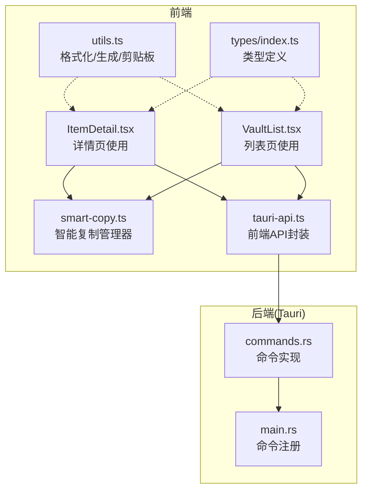
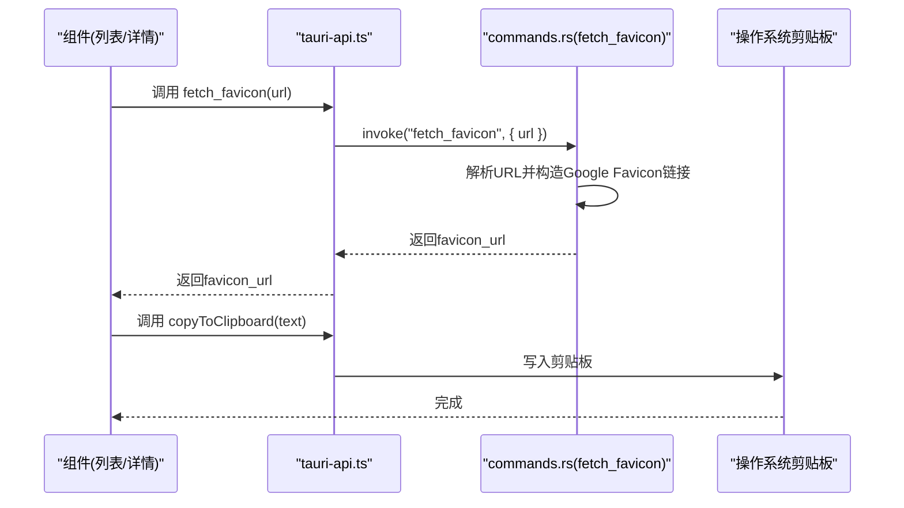
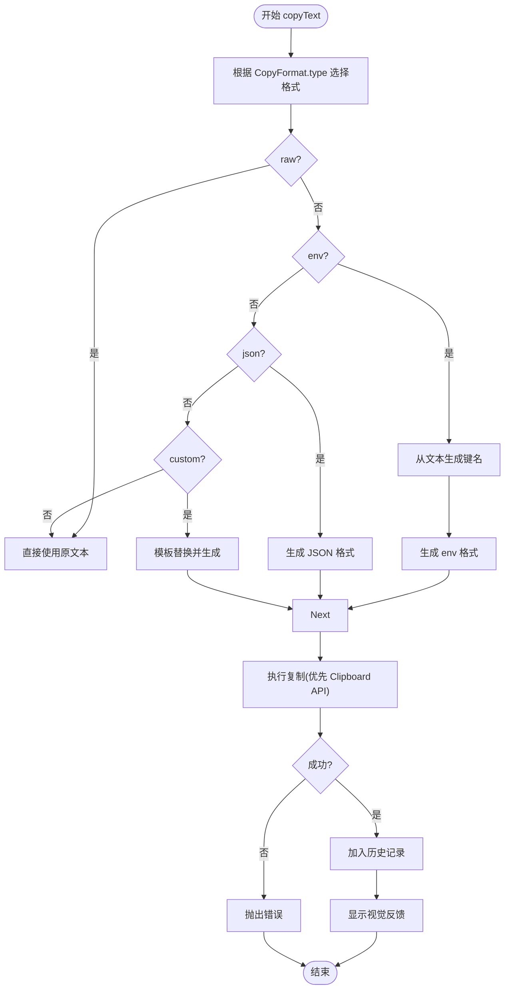
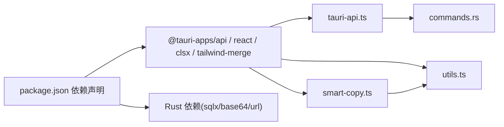

# 实用工具

<cite>
**本文引用的文件**
- [src/lib/utils.ts](file://src/lib/utils.ts)
- [src/lib/smart-copy.ts](file://src/lib/smart-copy.ts)
- [src/lib/tauri-api.ts](file://src/lib/tauri-api.ts)
- [src/types/index.ts](file://src/types/index.ts)
- [src/components/ItemDetail.tsx](file://src/components/ItemDetail.tsx)
- [src/components/VaultList.tsx](file://src/components/VaultList.tsx)
- [src-tauri/src/commands.rs](file://src-tauri/src/commands.rs)
- [src-tauri/src/main.rs](file://src-tauri/src/main.rs)
- [package.json](file://package.json)
</cite>

## 目录
1. [简介](#简介)
2. [项目结构](#项目结构)
3. [核心组件](#核心组件)
4. [架构总览](#架构总览)
5. [详细组件分析](#详细组件分析)
6. [依赖关系分析](#依赖关系分析)
7. [性能考虑](#性能考虑)
8. [故障排查指南](#故障排查指南)
9. [结论](#结论)
10. [附录](#附录)

## 简介
本文件系统性梳理项目中的实用工具与辅助能力，重点覆盖以下方面：
- 剪贴板复制与“智能复制”：支持原样、环境变量、JSON、自定义模板四种格式，并具备复制历史与可视化反馈。
- 数据格式化与转换：日期本地化格式化、文本截断、类名合并、环境变量与JSON格式生成。
- Favicon 获取机制：前端通过 Tauri 桥接调用后端命令，后端解析 URL 并返回 Google 提供的站点图标地址。
- 组件集成与使用：在列表与详情页中如何调用工具函数与智能复制管理器。
- 性能特性与内存使用：基于当前实现的评估与优化建议。
- 测试策略与质量保障：当前仓库未包含单元测试文件，建议方向与落地方法。

## 项目结构
实用工具相关的核心位置如下：
- 前端工具函数与智能复制：src/lib/utils.ts、src/lib/smart-copy.ts
- Tauri API 封装：src/lib/tauri-api.ts
- 类型定义：src/types/index.ts
- 组件使用示例：src/components/ItemDetail.tsx、src/components/VaultList.tsx
- 后端命令实现（含 favicon 获取）：src-tauri/src/commands.rs
- 应用入口与命令注册：src-tauri/src/main.rs
- 依赖声明：package.json

图表来源
- [src/lib/utils.ts](file://src/lib/utils.ts#L1-L44)
- [src/lib/smart-copy.ts](file://src/lib/smart-copy.ts#L1-L152)
- [src/lib/tauri-api.ts](file://src/lib/tauri-api.ts#L1-L97)
- [src/components/ItemDetail.tsx](file://src/components/ItemDetail.tsx#L1-L234)
- [src/components/VaultList.tsx](file://src/components/VaultList.tsx#L1-L209)
- [src-tauri/src/commands.rs](file://src-tauri/src/commands.rs#L231-L245)
- [src-tauri/src/main.rs](file://src-tauri/src/main.rs#L8-L57)

章节来源
- [src/lib/utils.ts](file://src/lib/utils.ts#L1-L44)
- [src/lib/smart-copy.ts](file://src/lib/smart-copy.ts#L1-L152)
- [src/lib/tauri-api.ts](file://src/lib/tauri-api.ts#L1-L97)
- [src-tauri/src/commands.rs](file://src-tauri/src/commands.rs#L231-L245)
- [src-tauri/src/main.rs](file://src-tauri/src/main.rs#L8-L57)
- [src/types/index.ts](file://src/types/index.ts#L1-L46)
- [src/components/ItemDetail.tsx](file://src/components/ItemDetail.tsx#L1-L234)
- [src/components/VaultList.tsx](file://src/components/VaultList.tsx#L1-L209)
- [package.json](file://package.json#L1-L32)

## 核心组件
- 工具函数模块（utils.ts）
  - 类名合并：cn(...inputs: ClassValue[]): string
  - 日期格式化：formatDate(date: Date): string（本地化 zh-CN）
  - 剪贴板写入：copyToClipboard(text: string): Promise<void>（优先使用 Clipboard API，回退 textarea）
  - 环境变量格式：generateEnvFormat(key: string, value: string): string
  - JSON 格式：generateJsonFormat(key: string, value: string): string
  - 文本截断：truncateText(text: string, maxLength: number): string
- 智能复制管理器（smart-copy.ts）
  - 单例模式：getInstance()
  - 支持格式：raw/env/json/custom
  - 关键能力：根据内容生成键名、模板替换、历史记录、可视化反馈
- Tauri API 封装（tauri-api.ts）
  - 对应后端命令的前端调用接口，如复制到剪贴板、获取 favicon
- 类型定义（types/index.ts）
  - VaultItem、Project、CopyFormat 等类型，用于约束数据结构与复制格式

章节来源
- [src/lib/utils.ts](file://src/lib/utils.ts#L1-L44)
- [src/lib/smart-copy.ts](file://src/lib/smart-copy.ts#L1-L152)
- [src/lib/tauri-api.ts](file://src/lib/tauri-api.ts#L1-L97)
- [src/types/index.ts](file://src/types/index.ts#L1-L46)

## 架构总览
前端通过 tauri-api.ts 调用后端命令；智能复制管理器负责格式化与复制流程；工具函数提供基础格式化与剪贴板能力；组件在交互时触发复制动作并展示反馈。

图表来源
- [src/lib/tauri-api.ts](file://src/lib/tauri-api.ts#L74-L76)
- [src-tauri/src/commands.rs](file://src-tauri/src/commands.rs#L231-L245)
- [src/lib/utils.ts](file://src/lib/utils.ts#L18-L31)

章节来源
- [src/lib/tauri-api.ts](file://src/lib/tauri-api.ts#L1-L97)
- [src-tauri/src/commands.rs](file://src-tauri/src/commands.rs#L231-L245)
- [src/lib/utils.ts](file://src/lib/utils.ts#L18-L31)

## 详细组件分析

### 工具函数模块（utils.ts）
- 功能要点
  - 类名合并：cn(...) 将多个输入合并为最终类名字符串，避免重复与冲突。
  - 日期格式化：formatDate 使用 Intl.DateTimeFormat('zh-CN') 输出年-月-日 时:分 的本地化格式。
  - 剪贴板写入：优先使用 Clipboard API；若不可用则回退到创建临时 textarea 并 execCommand('copy')。
  - 格式生成：generateEnvFormat/generateJsonFormat 分别输出环境变量与 JSON 字符串。
  - 文本截断：truncateText 在超过最大长度时追加省略号。
- 复杂度与性能
  - 时间复杂度：均为 O(n)，n 为输入字符串长度。
  - 空间复杂度：O(n)。
  - 剪贴板回退方案涉及 DOM 操作，需注意在移动设备上的兼容性与权限提示。
- 错误处理
  - 当前实现未对 Clipboard API 抛错进行显式捕获，建议在上层调用处增加 try/catch。

章节来源
- [src/lib/utils.ts](file://src/lib/utils.ts#L1-L44)

### 智能复制管理器（smart-copy.ts）
- 设计与职责
  - 单例模式：确保全局仅有一个复制管理器实例，便于共享状态（历史记录）。
  - 格式化策略：根据 CopyFormat.type 选择 raw/env/json/custom。
  - 自动键生成：根据内容关键词映射常见服务的键名（如 openai、anthropic、github 等），否则默认 API_KEY。
  - 历史记录：最多保留最近 10 条，自动截断过长文本。
  - 可视化反馈：创建右上角提示元素，2 秒后淡出并移除。
- 处理流程（复制）

图表来源
- [src/lib/smart-copy.ts](file://src/lib/smart-copy.ts#L20-L71)
- [src/lib/smart-copy.ts](file://src/lib/smart-copy.ts#L73-L94)
- [src/lib/smart-copy.ts](file://src/lib/smart-copy.ts#L96-L132)

- 复杂度与性能
  - 键生成：遍历预设模式字典，时间复杂度 O(P)，P 为模式数量（常数级）。
  - 历史记录：数组头部插入与尾部弹出，单次操作 O(1)，整体 O(N)。
  - DOM 反馈：一次性创建与移除节点，开销极小。
- 错误处理
  - 复制失败会抛出异常，调用方需捕获并处理。
  - 可视化反馈在 2.3 秒后完全移除，避免残留 DOM。

章节来源
- [src/lib/smart-copy.ts](file://src/lib/smart-copy.ts#L1-L152)

### Tauri API 封装（tauri-api.ts）
- 能力概览
  - Vault 项 CRUD、项目管理、导入记录管理、搜索、主密码设置与校验、剪贴板写入、favicon 获取。
- 与后端命令的对应关系
  - fetchFavicon(url: string) -> invoke('fetch_favicon', { url })
  - copyToClipboard(text: string) -> invoke('copy_to_clipboard', { text })

章节来源
- [src/lib/tauri-api.ts](file://src/lib/tauri-api.ts#L1-L97)

### 后端命令实现（commands.rs）
- favicon 获取
  - 输入为空时返回默认 Google Favicon 链接。
  - 正常情况下解析 URL 并提取域名，拼接 Google Favicon 请求地址返回。
- 剪贴板写入
  - Windows 平台使用 clipboard-win 库写入系统剪贴板；其他平台暂不实现。
- 注册与运行
  - main.rs 中集中注册所有命令，应用启动时加载数据库并运行。

章节来源
- [src-tauri/src/commands.rs](file://src-tauri/src/commands.rs#L231-L245)
- [src-tauri/src/commands.rs](file://src-tauri/src/commands.rs#L213-L228)
- [src-tauri/src/main.rs](file://src-tauri/src/main.rs#L8-L57)

### 组件中的使用示例
- 列表页（VaultList.tsx）
  - 在每一项的复制按钮点击时，调用 smartCopy.copyText(secret, { type })，并提供视觉反馈。
- 详情页（ItemDetail.tsx）
  - 在三个复制按钮（原始、环境变量、JSON）中分别调用，同时对按钮添加短暂的成功态样式。

章节来源
- [src/components/VaultList.tsx](file://src/components/VaultList.tsx#L9-L28)
- [src/components/ItemDetail.tsx](file://src/components/ItemDetail.tsx#L16-L35)

## 依赖关系分析
- 前端依赖
  - @tauri-apps/api：桥接前端与后端命令。
  - react/lucide-react：组件与图标。
  - clsx/tailwind-merge：类名合并与样式处理。
- 后端依赖
  - sqlx、base64、url：数据库访问、编码与 URL 解析。
- 模块耦合
  - utils.ts 与 smart-copy.ts 低耦合，前者提供纯函数，后者封装状态与流程。
  - tauri-api.ts 作为薄封装，向上暴露统一接口，向下依赖命令实现。
  - 组件通过 tauri-api.ts 间接依赖后端命令，形成清晰的分层。

图表来源
- [package.json](file://package.json#L13-L31)
- [src/lib/tauri-api.ts](file://src/lib/tauri-api.ts#L1-L3)
- [src-tauri/src/commands.rs](file://src-tauri/src/commands.rs#L1-L6)

章节来源
- [package.json](file://package.json#L1-L32)
- [src/lib/tauri-api.ts](file://src/lib/tauri-api.ts#L1-L97)
- [src-tauri/src/commands.rs](file://src-tauri/src/commands.rs#L1-L6)

## 性能考虑
- favicon 获取
  - URL 解析与字符串拼接为 O(n)；无网络请求，延迟极低。
  - 若未来改为下载图标并缓存，需考虑磁盘/内存占用与并发控制。
- 智能复制
  - 键生成与模板替换为 O(n)；历史记录维护为 O(1) 操作。
  - DOM 反馈只创建一次，移除后释放，内存占用可忽略。
- 剪贴板写入
  - Clipboard API 通常异步且高效；Windows 回退路径使用系统库，性能取决于平台实现。
- 内存使用
  - 历史记录最多 10 条，每条包含短文本片段，内存占用很小。
  - 建议避免在历史中存储敏感信息，或对敏感文本进行脱敏处理。

[本节为通用性能讨论，无需特定文件引用]

## 故障排查指南
- 复制失败
  - 检查浏览器是否支持 Clipboard API；若不支持，确认页面处于安全上下文（HTTPS）。
  - 在 Windows 平台，确认系统剪贴板可用。
- favicon 不显示
  - 确认返回的 favicon_url 是否有效；组件中已对图片加载失败进行隐藏处理。
- 主密码相关
  - 设置/校验主密码依赖数据库初始化与 settings 表；若报错，检查数据库连接与迁移状态。
- 调试建议
  - 在调用处包裹 try/catch 并记录错误堆栈。
  - 在 tauri 日志中观察命令执行结果与错误信息。

章节来源
- [src/lib/utils.ts](file://src/lib/utils.ts#L18-L31)
- [src-tauri/src/commands.rs](file://src-tauri/src/commands.rs#L213-L228)
- [src-tauri/src/commands.rs](file://src-tauri/src/commands.rs#L231-L245)

## 结论
本项目的实用工具以“轻量、可复用、可扩展”为目标：工具函数提供基础能力，智能复制管理器封装业务流程，Tauri API 将前端与后端命令解耦。当前实现简洁可靠，适合在多场景下复用。后续可在 favicon 缓存、复制历史脱敏、测试覆盖率等方面进一步完善。

[本节为总结性内容，无需特定文件引用]

## 附录

### 使用示例与集成方法
- 在组件中调用智能复制
  - 列表页：在复制按钮点击事件中调用 smartCopy.copyText(secret, { type })，并在 UI 上给出反馈。
  - 详情页：类似地在三个复制按钮中分别传入 'raw'/'env'/'json'。
- 在组件中调用 Tauri API
  - 获取 favicon：调用 api.fetchFavicon(url) 并将返回的 favicon_url 绑定到 img 的 src。
  - 写入剪贴板：调用 api.copyToClipboard(text)。
- 类型约束
  - 使用 src/types/index.ts 中的 CopyFormat 与 VaultItem 等类型，确保数据结构一致。

章节来源
- [src/components/VaultList.tsx](file://src/components/VaultList.tsx#L9-L28)
- [src/components/ItemDetail.tsx](file://src/components/ItemDetail.tsx#L16-L35)
- [src/lib/tauri-api.ts](file://src/lib/tauri-api.ts#L74-L76)
- [src/types/index.ts](file://src/types/index.ts#L35-L35)

### 测试策略与质量保证
- 当前状态
  - 仓库未发现单元测试文件，测试覆盖度未知。
- 建议策略
  - 工具函数测试：针对 formatDate、truncateText、generateEnvFormat/generateJsonFormat 进行边界与本地化测试。
  - 智能复制测试：模拟不同输入格式、历史记录上限、DOM 反馈行为。
  - Tauri 命令测试：使用 Tauri 的测试框架或 mock URL/剪贴板库，验证 fetch_favicon 与 copy_to_clipboard。
  - 集成测试：在组件中模拟用户交互，验证复制流程与 UI 反馈。
- 质量保障
  - 代码规范：统一 ESLint/Prettier 规则。
  - 构建检查：在 CI 中执行构建与类型检查。
  - 回归测试：新增功能时同步补充测试用例。

[本节为通用测试建议，无需特定文件引用]