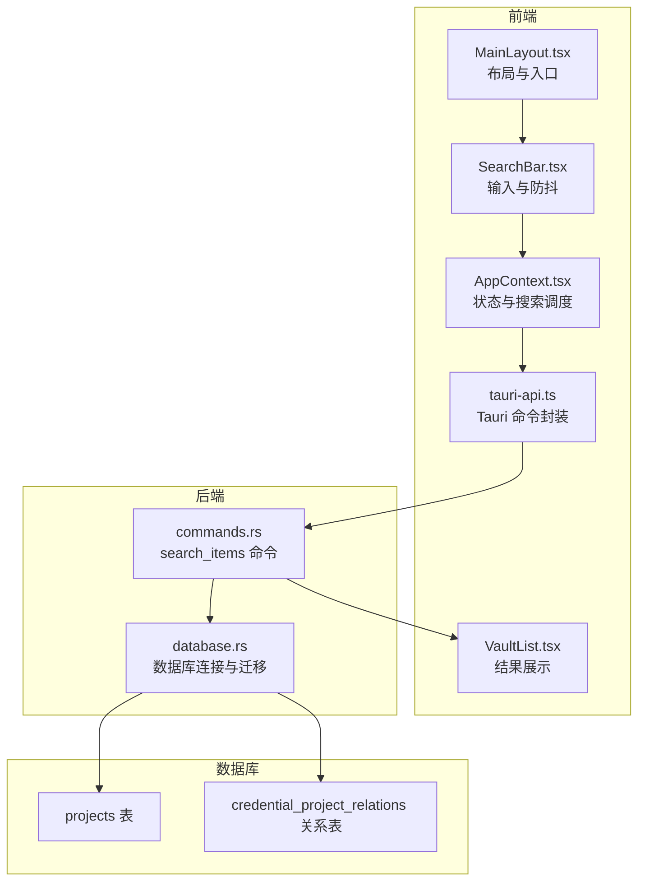
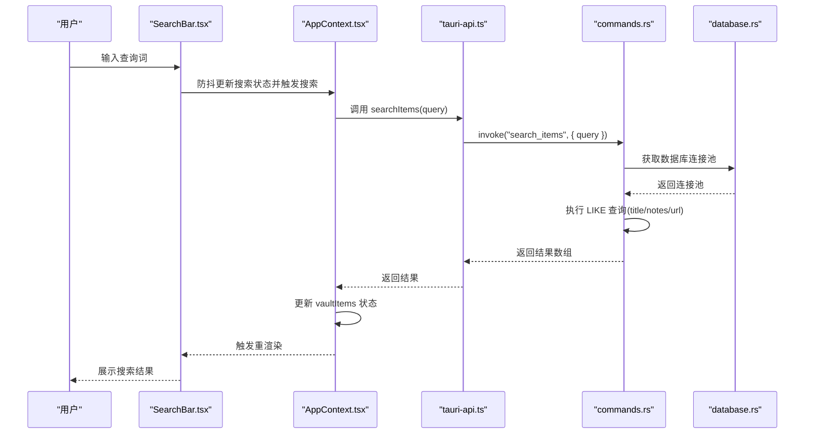
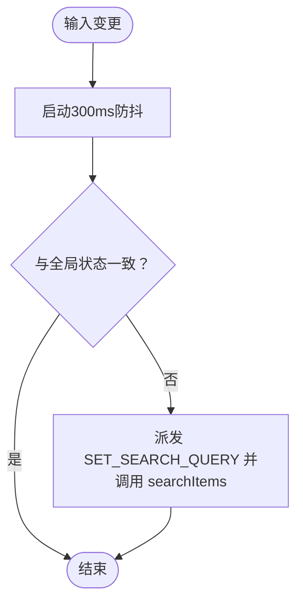
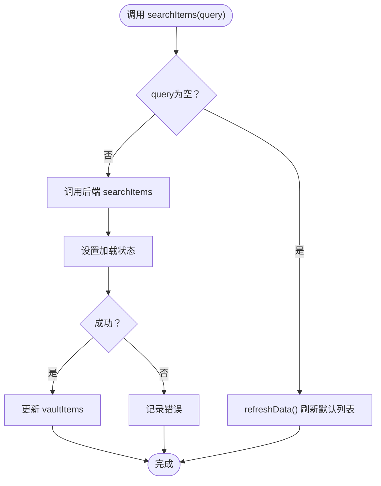
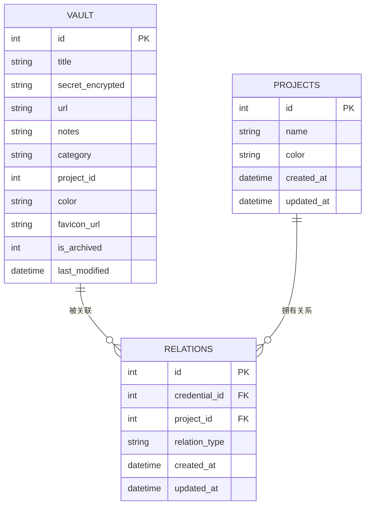
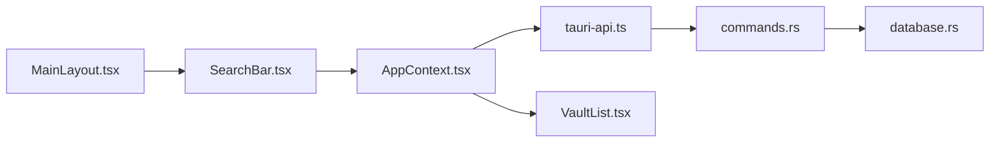

# 搜索过滤

<cite>
**本文引用的文件**
- [src/components/SearchBar.tsx](file://src/components/SearchBar.tsx)
- [src/components/VaultList.tsx](file://src/components/VaultList.tsx)
- [src/components/MainLayout.tsx](file://src/components/MainLayout.tsx)
- [src/contexts/AppContext.tsx](file://src/contexts/AppContext.tsx)
- [src/lib/tauri-api.ts](file://src/lib/tauri-api.ts)
- [src/lib/utils.ts](file://src/lib/utils.ts)
- [src/types/index.ts](file://src/types/index.ts)
- [src-tauri/src/commands.rs](file://src-tauri/src/commands.rs)
- [src-tauri/src/database.rs](file://src-tauri/src/database.rs)
- [src-tauri/migrations/001_create_projects_table.sql](file://src-tauri/migrations/001_create_projects_table.sql)
- [src-tauri/migrations/002_create_relations_table.sql](file://src-tauri/migrations/002_create_relations_table.sql)
</cite>

## 目录
1. [简介](#简介)
2. [项目结构](#项目结构)
3. [核心组件](#核心组件)
4. [架构总览](#架构总览)
5. [详细组件分析](#详细组件分析)
6. [依赖关系分析](#依赖关系分析)
7. [性能考量](#性能考量)
8. [故障排查指南](#故障排查指南)
9. [结论](#结论)
10. [附录：使用指南与最佳实践](#附录使用指南与最佳实践)

## 简介
本文件系统性梳理该密码管理应用的“搜索过滤”能力，覆盖以下主题：
- 实时搜索算法与防抖机制
- 前端展示层的高亮与排序思路（基于现有数据结构）
- 搜索索引与数据库设计及性能优化策略（全文检索与字段级搜索）
- 过滤条件组合逻辑（项目筛选、日期范围、状态过滤现状与扩展建议）
- 搜索历史与常用查询的管理机制现状与建议
- 分页加载与无限滚动的实现现状与建议
- 性能监控与优化建议

## 项目结构
前端采用 React + Tauri 架构，搜索功能由前端输入组件触发，通过 Tauri 命令调用后端数据库查询，最终在列表组件中呈现。

图表来源
- [src/components/MainLayout.tsx](file://src/components/MainLayout.tsx#L36-L38)
- [src/components/SearchBar.tsx](file://src/components/SearchBar.tsx#L5-L18)
- [src/contexts/AppContext.tsx](file://src/contexts/AppContext.tsx#L107-L121)
- [src/lib/tauri-api.ts](file://src/lib/tauri-api.ts#L52-L54)
- [src-tauri/src/commands.rs](file://src-tauri/src/commands.rs#L174-L210)
- [src-tauri/src/database.rs](file://src-tauri/src/database.rs#L13-L52)

章节来源
- [src/components/MainLayout.tsx](file://src/components/MainLayout.tsx#L11-L41)
- [src/components/SearchBar.tsx](file://src/components/SearchBar.tsx#L1-L50)
- [src/contexts/AppContext.tsx](file://src/contexts/AppContext.tsx#L1-L162)
- [src/lib/tauri-api.ts](file://src/lib/tauri-api.ts#L1-L97)
- [src-tauri/src/commands.rs](file://src-tauri/src/commands.rs#L1-L572)
- [src-tauri/src/database.rs](file://src-tauri/src/database.rs#L1-L104)

## 核心组件
- 搜索输入与防抖：用户输入变更后延迟触发搜索，避免频繁请求。
- 应用上下文：集中管理搜索状态、加载状态与搜索调度函数。
- Tauri API 封装：统一调用后端命令，屏蔽跨端细节。
- 数据库命令：实现按标题/备注/URL 的模糊匹配与排序。
- 列表展示：渲染搜索结果，支持静默模式与空态提示。

章节来源
- [src/components/SearchBar.tsx](file://src/components/SearchBar.tsx#L5-L18)
- [src/contexts/AppContext.tsx](file://src/contexts/AppContext.tsx#L107-L121)
- [src/lib/tauri-api.ts](file://src/lib/tauri-api.ts#L52-L54)
- [src-tauri/src/commands.rs](file://src-tauri/src/commands.rs#L174-L210)
- [src/components/VaultList.tsx](file://src/components/VaultList.tsx#L75-L206)

## 架构总览
搜索流程从 UI 输入开始，经由上下文调度，调用 Tauri 命令，执行数据库查询，最后回填到列表组件。

图表来源
- [src/components/SearchBar.tsx](file://src/components/SearchBar.tsx#L9-L18)
- [src/contexts/AppContext.tsx](file://src/contexts/AppContext.tsx#L107-L121)
- [src/lib/tauri-api.ts](file://src/lib/tauri-api.ts#L52-L54)
- [src-tauri/src/commands.rs](file://src-tauri/src/commands.rs#L174-L210)
- [src-tauri/src/database.rs](file://src-tauri/src/database.rs#L99-L104)

## 详细组件分析

### 组件一：搜索输入与防抖（SearchBar）
- 功能要点
  - 双向绑定本地查询词，避免与全局状态不同步。
  - 300ms 防抖，减少无效请求。
  - 支持快捷键聚焦输入框。
- 关键行为
  - 当本地查询词变化且不同于全局状态时，派发动作并调用搜索函数。
  - 清理定时器，防止内存泄漏。

图表来源
- [src/components/SearchBar.tsx](file://src/components/SearchBar.tsx#L9-L18)

章节来源
- [src/components/SearchBar.tsx](file://src/components/SearchBar.tsx#L1-L50)

### 组件二：应用上下文与搜索调度（AppContext）
- 功能要点
  - 维护搜索查询词、加载状态、项目筛选、选中项等。
  - 提供 searchItems(query)：当查询非空时调用后端搜索；否则刷新默认列表。
  - 在项目切换时自动刷新数据。
- 错误处理
  - 捕获异常并恢复加载状态，保证 UI 不卡死。

图表来源
- [src/contexts/AppContext.tsx](file://src/contexts/AppContext.tsx#L107-L121)

章节来源
- [src/contexts/AppContext.tsx](file://src/contexts/AppContext.tsx#L1-L162)

### 组件三：Tauri API 封装（tauri-api）
- 功能要点
  - 对后端命令进行统一封装，暴露 searchItems(query)。
  - 其他命令如项目管理、剪贴板、图标抓取等，为后续扩展提供基础。

章节来源
- [src/lib/tauri-api.ts](file://src/lib/tauri-api.ts#L1-L97)

### 组件四：数据库命令与查询（commands.rs）
- 搜索实现
  - 使用 LIKE 模糊匹配 title/notes/url 字段。
  - 排序依据最近修改时间倒序。
  - 仅返回未归档记录。
- 性能注意
  - LIKE 百分号通配符可能导致全表扫描，需建立索引优化。

图表来源
- [src-tauri/src/commands.rs](file://src-tauri/src/commands.rs#L9-L38)
- [src-tauri/migrations/001_create_projects_table.sql](file://src-tauri/migrations/001_create_projects_table.sql#L1-L13)
- [src-tauri/migrations/002_create_relations_table.sql](file://src-tauri/migrations/002_create_relations_table.sql#L1-L16)

章节来源
- [src-tauri/src/commands.rs](file://src-tauri/src/commands.rs#L174-L210)

### 组件五：列表展示与空态（VaultList）
- 功能要点
  - 渲染当前状态下的 vaultItems。
  - 支持静默模式显示掩码文本。
  - 无结果时提示“没有找到匹配的条目”或引导创建首个条目。
- 与搜索联动
  - 列表直接消费上下文中的 vaultItems，无需额外处理。

章节来源
- [src/components/VaultList.tsx](file://src/components/VaultList.tsx#L46-L206)

### 组件六：布局与入口（MainLayout）
- 功能要点
  - 在头部集成搜索栏，作为全局入口。
  - 根据窗口尺寸决定侧边栏显示策略。

章节来源
- [src/components/MainLayout.tsx](file://src/components/MainLayout.tsx#L28-L41)

## 依赖关系分析
- 前端依赖链
  - MainLayout → SearchBar → AppContext → tauri-api → commands.rs → database.rs
- 数据模型依赖
  - VaultList 依赖 AppState 中的 vaultItems。
  - 项目筛选通过 selectedProject 影响 get_vault_items_by_project 的查询。

图表来源
- [src/components/MainLayout.tsx](file://src/components/MainLayout.tsx#L36-L38)
- [src/components/SearchBar.tsx](file://src/components/SearchBar.tsx#L5-L18)
- [src/contexts/AppContext.tsx](file://src/contexts/AppContext.tsx#L107-L121)
- [src/lib/tauri-api.ts](file://src/lib/tauri-api.ts#L52-L54)
- [src-tauri/src/commands.rs](file://src-tauri/src/commands.rs#L174-L210)
- [src-tauri/src/database.rs](file://src-tauri/src/database.rs#L99-L104)
- [src/components/VaultList.tsx](file://src/components/VaultList.tsx#L46-L48)

章节来源
- [src/types/index.ts](file://src/types/index.ts#L1-L46)
- [src/contexts/AppContext.tsx](file://src/contexts/AppContext.tsx#L19-L67)

## 性能考量
- 现状与问题
  - 模糊匹配使用 LIKE 百分号通配符，可能触发全表扫描，影响大数据量性能。
  - 未见专用全文检索索引或复合索引，排序依赖 last_modified。
- 优化建议
  - 为 title/notes/url 建立复合索引，或引入 FTS5 全文检索以提升模糊匹配效率。
  - 对搜索结果增加分页或游标分页，避免一次性加载过多数据。
  - 在前端缓存近期热门查询结果，减少重复请求。
  - 对搜索词做长度阈值控制（如小于2字符不触发），降低无效请求。
  - 引入查询去重与去抖合并策略，避免高频重复请求。
- 监控建议
  - 记录每次搜索耗时、命中率与返回条数，用于评估优化效果。
  - 监控数据库慢查询日志，定位热点 SQL。

[本节为通用性能指导，不直接分析具体文件，故无章节来源]

## 故障排查指南
- 搜索无结果
  - 确认 query 非空且已触发 searchItems。
  - 检查后端是否正确执行 LIKE 查询与未归档过滤。
- 列表未更新
  - 检查上下文是否正确更新 vaultItems。
  - 确认 AppContext 的搜索分支逻辑与 refreshData 是否按预期执行。
- 数据库异常
  - 检查数据库连接池初始化与迁移是否成功。
  - 查看后端命令返回的错误信息，确认 SQL 语句与参数绑定。

章节来源
- [src/contexts/AppContext.tsx](file://src/contexts/AppContext.tsx#L107-L121)
- [src-tauri/src/commands.rs](file://src-tauri/src/commands.rs#L174-L210)
- [src-tauri/src/database.rs](file://src-tauri/src/database.rs#L13-L52)

## 结论
当前搜索功能以“输入防抖 + LIKE 模糊匹配 + 最近修改排序”为核心，具备基本可用性。为进一步提升体验与性能，建议引入全文检索、复合索引与分页/缓存策略，并完善过滤条件与历史查询管理。

[本节为总结性内容，不直接分析具体文件，故无章节来源]

## 附录：使用指南与最佳实践

### 使用指南
- 实时搜索
  - 在顶部搜索框输入关键词，300ms 后自动触发搜索。
  - 支持 Ctrl/Cmd+K 快捷键快速聚焦搜索框。
- 结果展示
  - 搜索结果按最近修改时间倒序排列。
  - 支持静默模式，敏感信息以掩码形式显示。
- 项目筛选
  - 通过侧边栏选择项目，列表自动切换为该项目下的条目。
  - 未选择项目时显示全部条目；选择项目后按关系表过滤。

章节来源
- [src/components/SearchBar.tsx](file://src/components/SearchBar.tsx#L20-L30)
- [src/components/VaultList.tsx](file://src/components/VaultList.tsx#L46-L73)
- [src-tauri/src/commands.rs](file://src-tauri/src/commands.rs#L394-L435)

### 最佳实践
- 搜索词规范
  - 避免过短词（如单字符）触发搜索，减少无效请求。
  - 对特殊字符进行转义或清洗，避免 SQL 注入风险（当前 LIKE 已通过参数绑定，仍建议清洗）。
- 结果排序
  - 保持按最近修改时间排序，确保用户优先看到最新条目。
- 高亮与可读性
  - 前端可扩展高亮匹配词（如加粗/背景色），提升可读性。
- 分页与无限滚动
  - 当前列表为完整渲染，建议引入分页或虚拟滚动，提升大列表性能。
- 历史与常用查询
  - 建议新增本地存储（如 IndexedDB 或 localStorage）保存最近搜索词与常用查询，提供下拉建议与一键复用。

[本节为通用指导，不直接分析具体文件，故无章节来源]