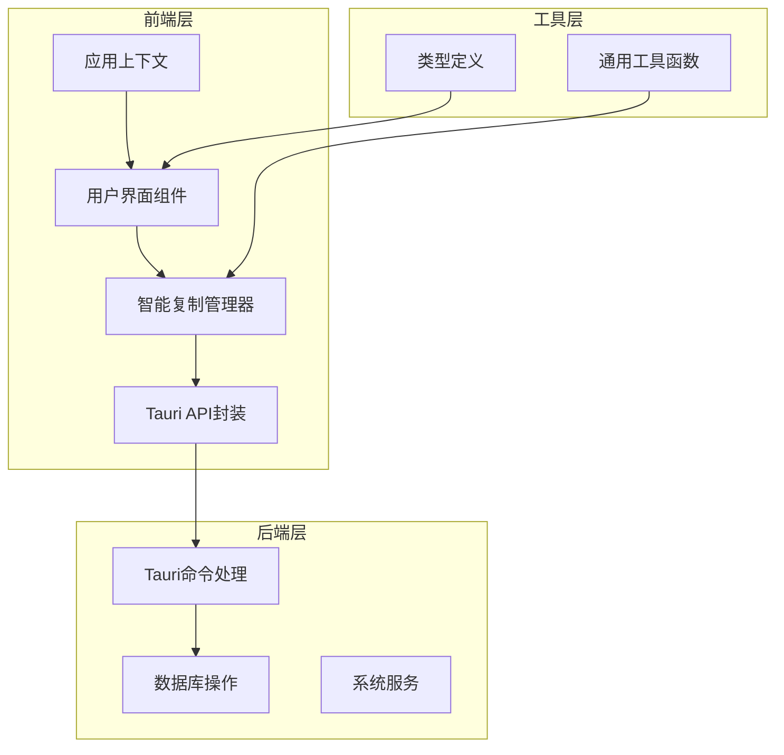
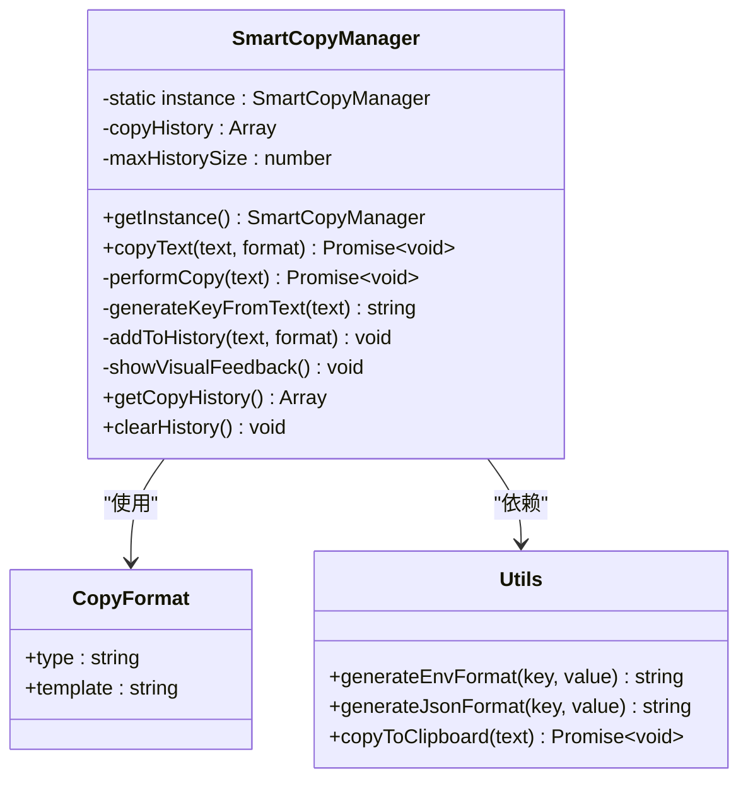
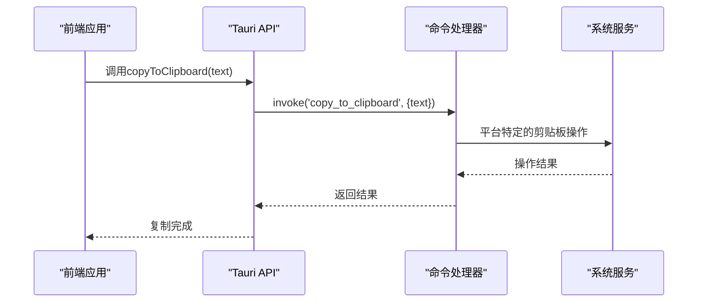
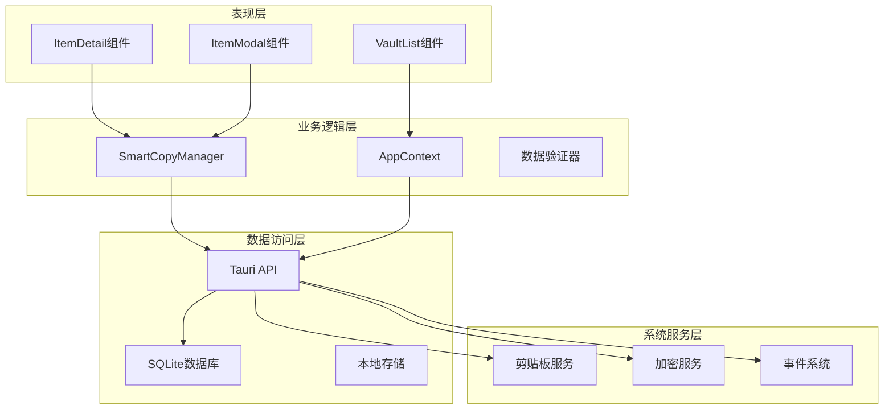
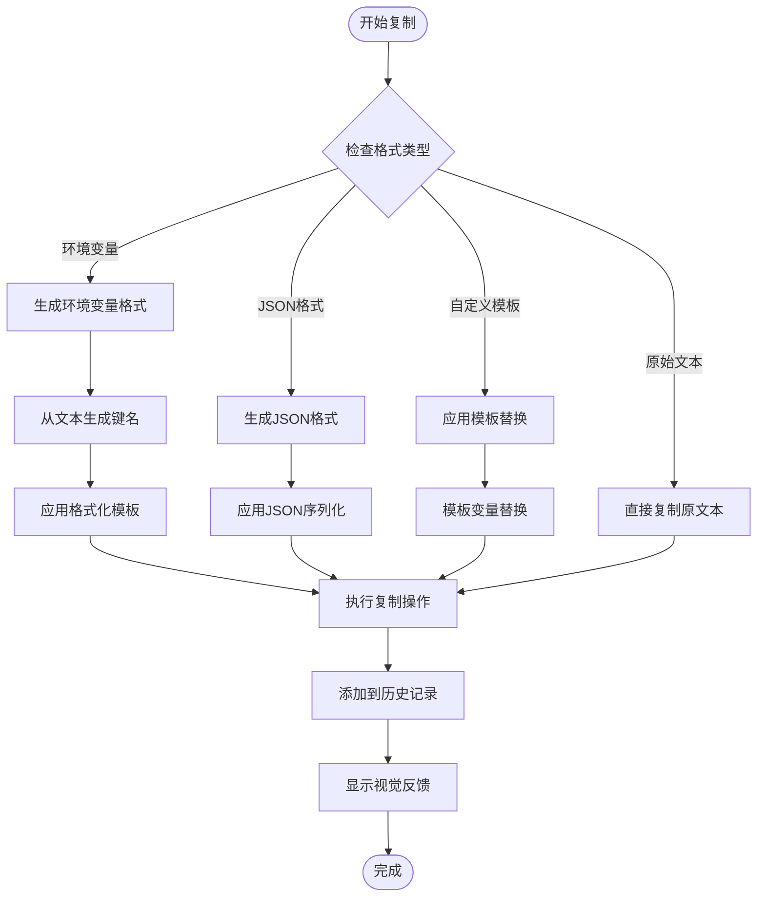
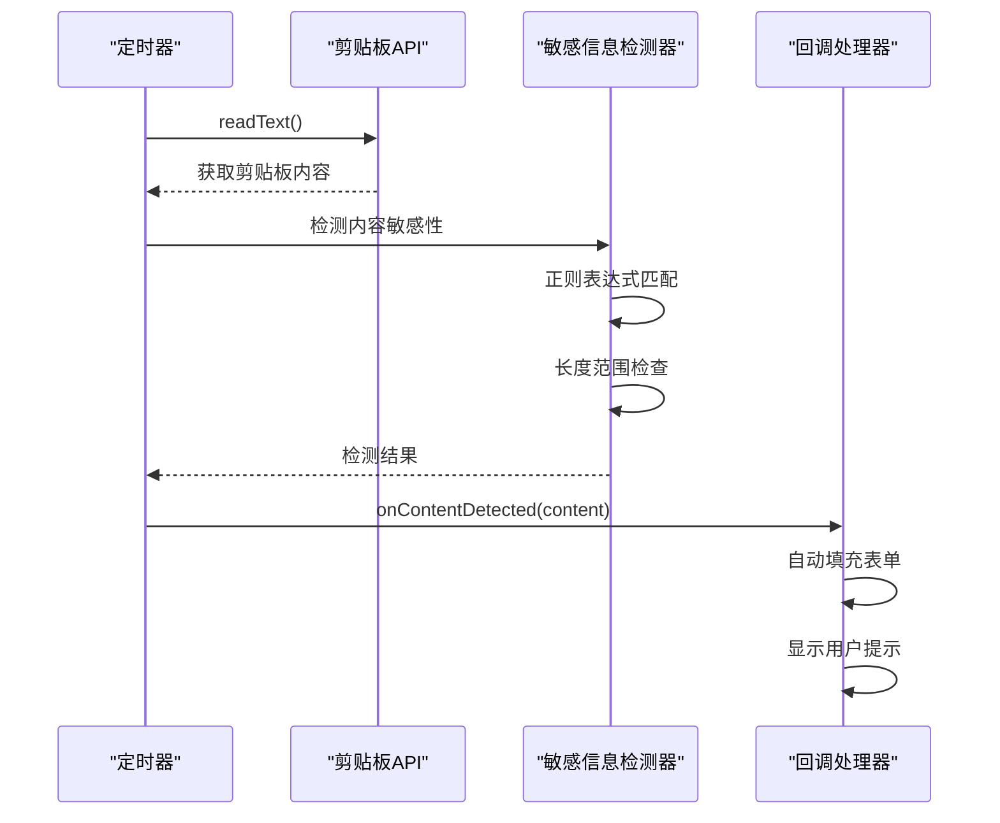
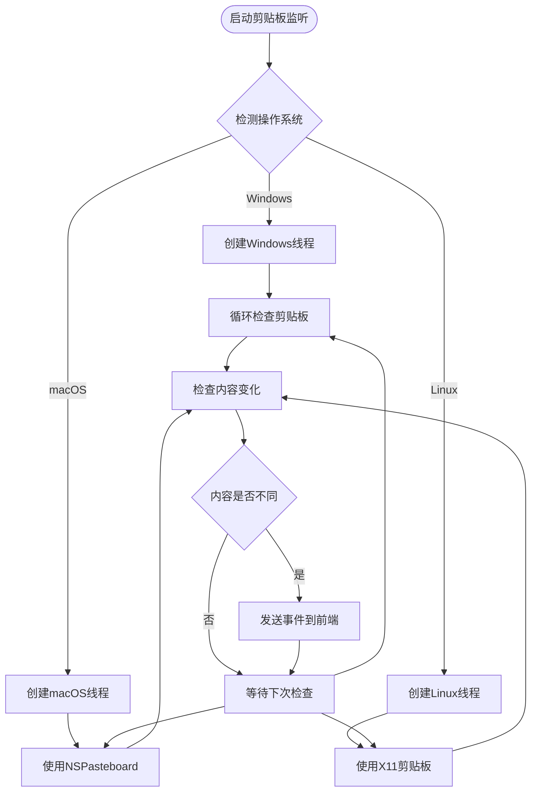
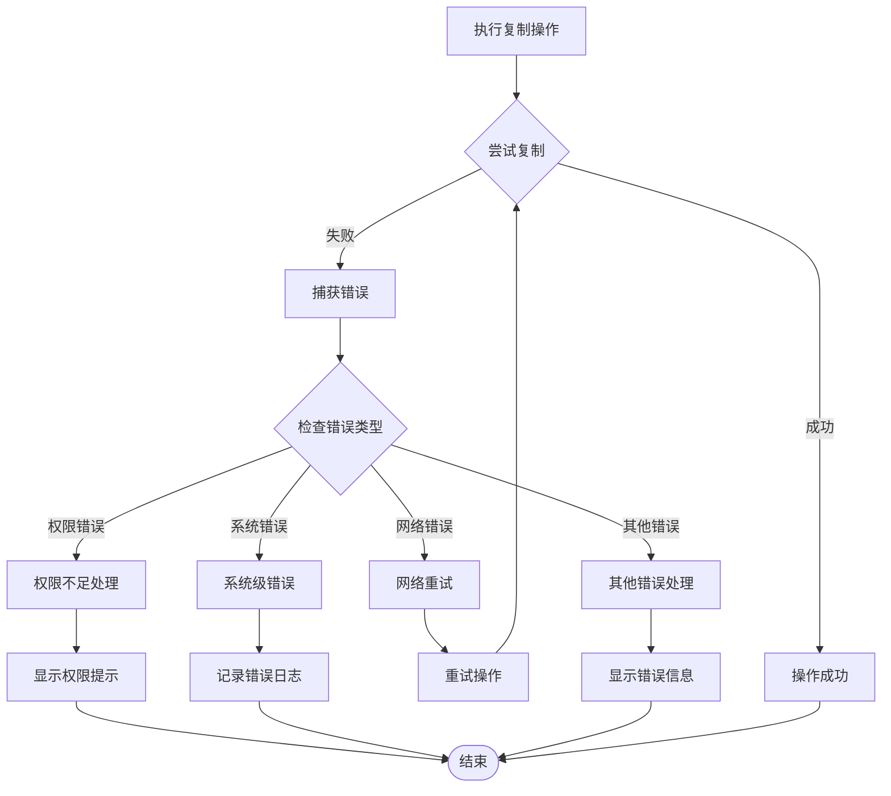

# 智能复制系统

<cite>
**本文档引用的文件**
- [smart-copy.ts](file://src/lib/smart-copy.ts)
- [tauri-api.ts](file://src/lib/tauri-api.ts)
- [utils.ts](file://src/lib/utils.ts)
- [commands.rs](file://src-tauri/src/commands.rs)
- [main.rs](file://src-tauri/src/main.rs)
- [index.ts](file://src/types/index.ts)
- [ItemDetail.tsx](file://src/components/ItemDetail.tsx)
- [AppContext.tsx](file://src/contexts/AppContext.tsx)
- [App.tsx](file://src/App.tsx)
- [main.tsx](file://src/main.tsx)
- [tauri.conf.json](file://src-tauri/tauri.conf.json)
- [CLIPBOARD_FIX.md](file://docs/dev/CLIPBOARD_FIX.md)
</cite>

## 目录
1. [简介](#简介)
2. [项目结构](#项目结构)
3. [核心组件](#核心组件)
4. [架构概览](#架构概览)
5. [详细组件分析](#详细组件分析)
6. [依赖关系分析](#依赖关系分析)
7. [性能考虑](#性能考虑)
8. [故障排除指南](#故障排除指南)
9. [结论](#结论)
10. [附录](#附录)

## 简介

智能复制系统是一个集成了多种复制格式支持和剪贴板操作的现代化密码管理应用。该系统提供了原始文本、环境变量、JSON等多种格式的智能复制功能，并具备剪贴板监听和响应机制。

系统采用前后端分离架构，前端使用React和TypeScript构建用户界面，后端基于Tauri框架提供原生功能支持。核心功能包括：

- **多格式复制**：支持原始文本、环境变量、JSON格式的智能转换
- **模板系统**：可扩展的自定义格式支持
- **剪贴板监听**：实时检测系统剪贴板变化
- **安全权限管理**：严格的权限控制和隐私保护
- **历史记录管理**：复制历史的追踪和清理

## 项目结构

智能复制系统采用模块化设计，主要分为以下几个核心模块：



**图表来源**
- [main.tsx](file://src/main.tsx#L1-L10)
- [App.tsx](file://src/App.tsx#L1-L29)
- [AppContext.tsx](file://src/contexts/AppContext.tsx#L1-L162)

**章节来源**
- [main.tsx](file://src/main.tsx#L1-L10)
- [App.tsx](file://src/App.tsx#L1-L29)
- [AppContext.tsx](file://src/contexts/AppContext.tsx#L1-L162)

## 核心组件

### 智能复制管理器

智能复制管理器是系统的核心组件，负责处理所有复制操作和格式转换逻辑。



**图表来源**
- [smart-copy.ts](file://src/lib/smart-copy.ts#L8-L143)
- [utils.ts](file://src/lib/utils.ts#L33-L39)

### Tauri命令系统

后端通过Tauri命令系统提供原生功能支持，特别是剪贴板操作。



**图表来源**
- [tauri-api.ts](file://src/lib/tauri-api.ts#L70-L72)
- [commands.rs](file://src-tauri/src/commands.rs#L213-L228)

**章节来源**
- [smart-copy.ts](file://src/lib/smart-copy.ts#L1-L152)
- [tauri-api.ts](file://src/lib/tauri-api.ts#L1-L97)
- [utils.ts](file://src/lib/utils.ts#L1-L44)

## 架构概览

智能复制系统采用分层架构设计，确保各层职责清晰分离：



**图表来源**
- [ItemDetail.tsx](file://src/components/ItemDetail.tsx#L1-L234)
- [AppContext.tsx](file://src/contexts/AppContext.tsx#L1-L162)
- [tauri.conf.json](file://src-tauri/tauri.conf.json#L1-L33)

## 详细组件分析

### 复制格式系统

系统支持四种主要的复制格式，每种格式都有特定的用途和转换逻辑：

#### 原始文本格式
最基础的复制格式，直接复制原文本内容，适用于简单场景。

#### 环境变量格式
将文本转换为标准的环境变量格式，支持多种编程语言的环境变量声明。

#### JSON格式
将文本包装为JSON对象，便于在JavaScript环境中直接使用。

#### 自定义模板格式
提供灵活的模板系统，允许用户定义个性化的复制格式。



**图表来源**
- [smart-copy.ts](file://src/lib/smart-copy.ts#L20-L56)
- [utils.ts](file://src/lib/utils.ts#L33-L39)

**章节来源**
- [smart-copy.ts](file://src/lib/smart-copy.ts#L3-L6)
- [smart-copy.ts](file://src/lib/smart-copy.ts#L20-L56)
- [utils.ts](file://src/lib/utils.ts#L33-L39)

### 剪贴板监听机制

系统实现了多层次的剪贴板监听机制，包括前端定时检查和后端原生监听：

#### 前端剪贴板监听



**图表来源**
- [CLIPBOARD_FIX.md](file://docs/dev/CLIPBOARD_FIX.md#L43-L69)

#### 后端原生剪贴板监听

系统还提供了原生平台的剪贴板监听能力，特别是在Windows平台上：



**图表来源**
- [CLIPBOARD_FIX.md](file://docs/dev/CLIPBOARD_FIX.md#L144-L181)

**章节来源**
- [CLIPBOARD_FIX.md](file://docs/dev/CLIPBOARD_FIX.md#L21-L82)
- [CLIPBOARD_FIX.md](file://docs/dev/CLIPBOARD_FIX.md#L134-L181)

### 安全性和权限管理

系统在设计时充分考虑了安全性，实施了多层安全措施：

#### 权限控制
- 浏览器剪贴板访问需要用户明确授权
- 移动端设备会显示剪贴板访问指示器
- 所有敏感操作都有明确的用户确认流程

#### 数据保护
- 剪贴板内容仅在内存中处理，不进行持久化存储
- 敏感信息检测算法仅在客户端执行
- 复制操作完成后立即清理临时数据

#### 隐私保护
- 用户可以选择禁用自动检测功能
- 所有操作都有明确的用户可见反馈
- 系统不会记录或分析用户复制的内容

**章节来源**
- [CLIPBOARD_FIX.md](file://docs/dev/CLIPBOARD_FIX.md#L232-L250)

### 错误处理和异常恢复

系统实现了完善的错误处理机制，确保在各种异常情况下都能保持稳定运行：



**图表来源**
- [smart-copy.ts](file://src/lib/smart-copy.ts#L48-L55)

**章节来源**
- [smart-copy.ts](file://src/lib/smart-copy.ts#L48-L55)

## 依赖关系分析

智能复制系统的依赖关系体现了清晰的分层架构：

```mermaid
graph TB
subgraph "外部依赖"
React[React 18.3.1]
Tauri[@tauri-apps/api]
TailwindCSS[Tailwind CSS]
end
subgraph "内部模块"
SmartCopy[src/lib/smart-copy.ts]
TauriAPI[src/lib/tauri-api.ts]
Utils[src/lib/utils.ts]
Commands[src-tauri/src/commands.rs]
Main[src-tauri/src/main.rs]
end
subgraph "类型定义"
Types[src/types/index.ts]
Context[src/contexts/AppContext.tsx]
end
React --> SmartCopy
TauriAPI --> Commands
SmartCopy --> Utils
SmartCopy --> TauriAPI
TauriAPI --> Commands
Commands --> Main
Types --> SmartCopy
Types --> Context
Context --> React
```

**图表来源**
- [main.rs](file://src-tauri/src/main.rs#L1-L58)
- [tauri.conf.json](file://src-tauri/tauri.conf.json#L1-L33)

**章节来源**
- [main.rs](file://src-tauri/src/main.rs#L1-L58)
- [tauri.conf.json](file://src-tauri/tauri.conf.json#L1-L33)

## 性能考虑

智能复制系统在设计时充分考虑了性能优化：

### 内存管理
- 复制历史记录限制为固定大小（默认10条）
- 使用弱引用避免内存泄漏
- 及时清理DOM元素和事件监听器

### 异步操作
- 所有剪贴板操作都是异步执行
- 使用Promise链处理复杂的异步流程
- 避免阻塞主线程的操作

### 缓存策略
- 剪贴板内容变化检测使用缓存机制
- 防止频繁的系统调用
- 合理的检查间隔设置

### 优化建议
- 对于大量数据的复制操作，考虑分批处理
- 实施背压机制防止过度的系统调用
- 使用Web Workers处理CPU密集型任务

## 故障排除指南

### 常见问题及解决方案

#### 剪贴板权限问题
**症状**：复制操作失败或出现权限错误
**解决方案**：
1. 检查浏览器的剪贴板权限设置
2. 确认用户已经明确授权剪贴板访问
3. 在移动设备上检查系统设置中的权限状态

#### 复制格式不正确
**症状**：复制的内容格式不符合预期
**解决方案**：
1. 检查选择的复制格式类型
2. 验证自定义模板的语法正确性
3. 确认输入文本符合格式要求

#### 剪贴板监听失效
**症状**：无法检测到系统剪贴板的变化
**解决方案**：
1. 检查定时器是否正常运行
2. 确认敏感信息检测算法的正则表达式
3. 验证事件监听器的注册状态

**章节来源**
- [CLIPBOARD_FIX.md](file://docs/dev/CLIPBOARD_FIX.md#L279-L295)

## 结论

智能复制系统通过精心设计的架构和实现，成功地将多种复制格式支持、剪贴板监听和安全权限管理整合在一个统一的解决方案中。系统的主要优势包括：

1. **多功能性**：支持多种复制格式，满足不同的使用场景需求
2. **安全性**：实施了全面的安全措施，保护用户隐私和数据安全
3. **可扩展性**：模块化设计使得功能扩展变得简单直观
4. **用户体验**：提供流畅的交互体验和及时的反馈机制

未来的发展方向包括增强跨平台兼容性、优化性能表现、扩展更多的复制格式支持，以及进一步完善安全防护机制。

## 附录

### 使用示例

#### 开发环境配置
```typescript
// 在开发环境中启用智能复制功能
const smartCopy = SmartCopyManager.getInstance();
await smartCopy.copyText('your-secret-key', { type: 'env' });
```

#### 自动化脚本生成
```typescript
// 生成多种格式的API密钥
const apiKey = 'sk-proj-abc123';
const formats = [
  { type: 'raw' },
  { type: 'env' },
  { type: 'json' },
  { type: 'custom', template: 'const API_KEY = "{value}";' }
];

formats.forEach(async (format) => {
  await smartCopy.copyText(apiKey, format);
});
```

### 配置选项

| 选项名称 | 默认值 | 描述 |
|---------|--------|------|
| maxHistorySize | 10 | 复制历史的最大条目数 |
| checkInterval | 2000ms | 剪贴板检查的间隔时间 |
| minLength | 8 | 敏感信息检测的最小长度 |
| maxLength | 500 | 敏感信息检测的最大长度 |