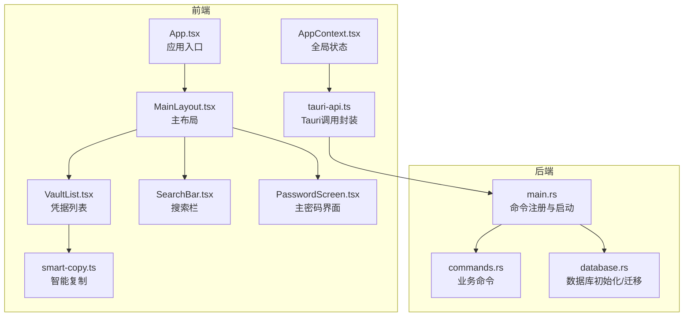
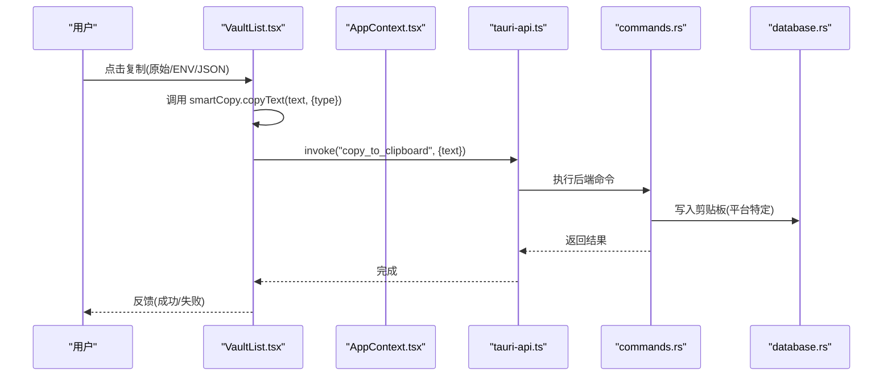
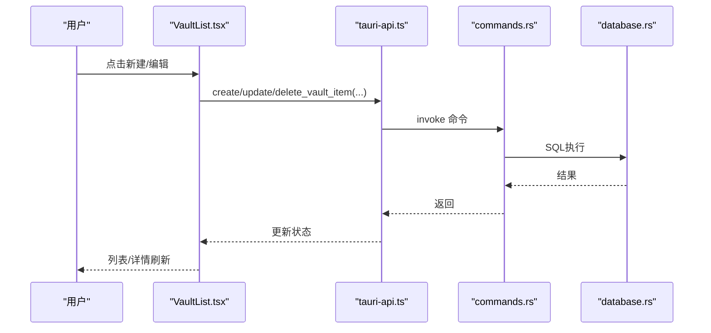
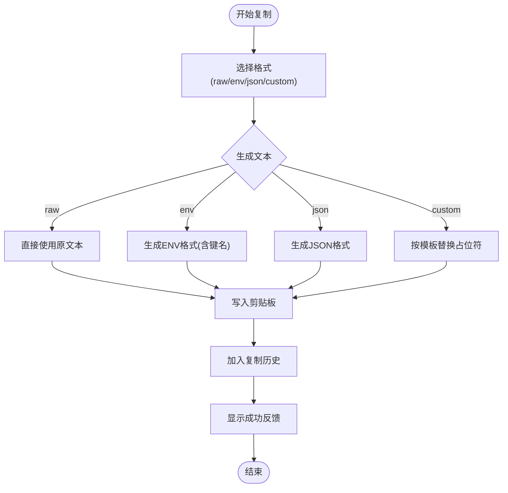
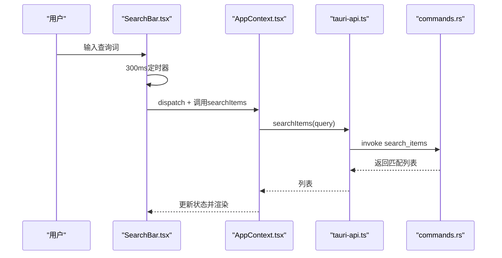
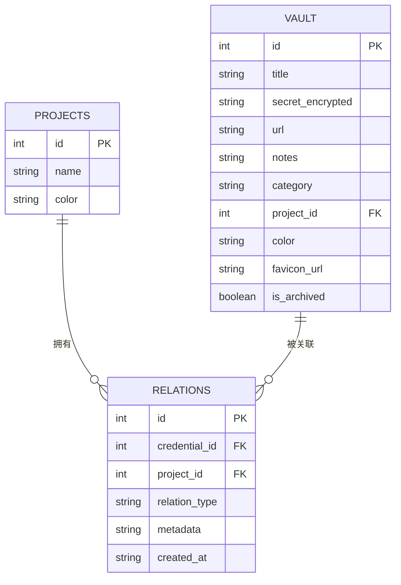
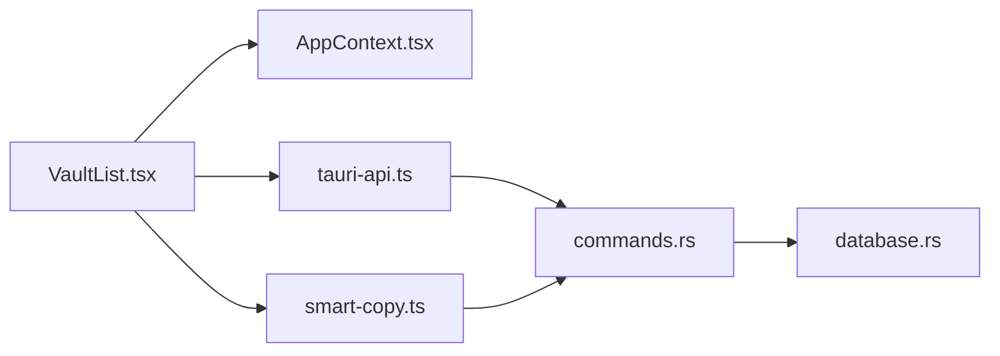

# 核心功能

<cite>
**本文引用的文件**
- [src/App.tsx](file://src/App.tsx)
- [src/main.tsx](file://src/main.tsx)
- [src/contexts/AppContext.tsx](file://src/contexts/AppContext.tsx)
- [src/components/PasswordScreen.tsx](file://src/components/PasswordScreen.tsx)
- [src/components/MainLayout.tsx](file://src/components/MainLayout.tsx)
- [src/components/VaultList.tsx](file://src/components/VaultList.tsx)
- [src/components/SearchBar.tsx](file://src/components/SearchBar.tsx)
- [src/lib/smart-copy.ts](file://src/lib/smart-copy.ts)
- [src/lib/tauri-api.ts](file://src/lib/tauri-api.ts)
- [src/types/index.ts](file://src/types/index.ts)
- [src-tauri/src/main.rs](file://src-tauri/src/main.rs)
- [src-tauri/src/lib.rs](file://src-tauri/src/lib.rs)
- [src-tauri/src/commands.rs](file://src-tauri/src/commands.rs)
- [src-tauri/src/database.rs](file://src-tauri/src/database.rs)
</cite>

## 目录
1. [简介](#简介)
2. [项目结构](#项目结构)
3. [核心组件](#核心组件)
4. [架构总览](#架构总览)
5. [详细组件分析](#详细组件分析)
6. [依赖分析](#依赖分析)
7. [性能考虑](#性能考虑)
8. [故障排除指南](#故障排除指南)
9. [结论](#结论)
10. [附录](#附录)

## 简介
本文件面向AIpassword（DevVault）的核心功能，系统性梳理凭据管理、智能复制、搜索过滤与项目分类的关系映射与数据组织方式，并给出API接口定义、参数规范、返回值格式、使用示例、最佳实践与常见问题解决方案。读者可据此快速掌握从“创建/编辑/删除/查看”到“多格式复制”再到“搜索与分类”的完整工作流。

## 项目结构
前端采用React + Tauri架构，后端通过Tauri命令桥接SQLite数据库；核心状态由上下文管理，UI组件围绕凭据列表、详情、侧边栏与工具栏组织；智能复制在前端完成格式化与剪贴板写入，后端提供平台级复制能力与密码校验。

图表来源
- [src/App.tsx](file://src/App.tsx#L1-L29)
- [src/main.tsx](file://src/main.tsx#L1-L10)
- [src-tauri/src/main.rs](file://src-tauri/src/main.rs#L21-L50)
- [src-tauri/src/lib.rs](file://src-tauri/src/lib.rs#L1-L4)

章节来源
- [src/App.tsx](file://src/App.tsx#L1-L29)
- [src/main.tsx](file://src/main.tsx#L1-L10)
- [src-tauri/src/main.rs](file://src-tauri/src/main.rs#L1-L51)
- [src-tauri/src/lib.rs](file://src-tauri/src/lib.rs#L1-L4)

## 核心组件
- 应用入口与路由控制：根据主密码验证状态切换登录页或主界面。
- 全局状态与数据刷新：统一拉取项目、统计与凭据列表，支持按项目筛选与搜索。
- 凭据列表与操作：支持复制（原始/环境变量/JSON）、编辑、删除与选择详情。
- 智能复制：根据格式类型生成目标文本并写入剪贴板，提供可视化反馈与历史记录。
- 搜索：防抖触发，模糊匹配标题/备注/URL，空查询回退至全量数据。
- 项目分类与关系映射：项目计数、凭据-项目关联、未关联凭据查询。
- 主密码安全：设置/校验/存在性检查，基于盐值哈希存储。

章节来源
- [src/contexts/AppContext.tsx](file://src/contexts/AppContext.tsx#L79-L147)
- [src/components/VaultList.tsx](file://src/components/VaultList.tsx#L9-L44)
- [src/lib/smart-copy.ts](file://src/lib/smart-copy.ts#L20-L71)
- [src/components/SearchBar.tsx](file://src/components/SearchBar.tsx#L9-L18)
- [src-tauri/src/commands.rs](file://src-tauri/src/commands.rs#L174-L210)
- [src-tauri/src/commands.rs](file://src-tauri/src/commands.rs#L394-L435)

## 架构总览
前后端通过Tauri命令通道通信，前端负责UI与交互，后端负责数据持久化与安全策略。状态驱动UI更新，命令调用返回Promise结果，错误通过前端日志与提示展示。

图表来源
- [src/components/VaultList.tsx](file://src/components/VaultList.tsx#L9-L28)
- [src/lib/tauri-api.ts](file://src/lib/tauri-api.ts#L57-L59)
- [src-tauri/src/commands.rs](file://src-tauri/src/commands.rs#L213-L228)
- [src-tauri/src/database.rs](file://src-tauri/src/database.rs#L99-L104)

## 详细组件分析

### 凭据管理（创建/编辑/删除/查看）
- 创建：调用后端命令插入新凭据，返回新增ID；前端更新状态并置顶显示。
- 编辑：更新凭据字段并写回数据库；前端替换对应项。
- 删除：软删除（归档位），不影响真实表结构；前端移除列表项并清空选中。
- 查看：点击列表项选择，非紧凑模式下右侧详情区展示；无选中时显示占位提示或项目关系面板。

图表来源
- [src/components/VaultList.tsx](file://src/components/VaultList.tsx#L30-L44)
- [src/lib/tauri-api.ts](file://src/lib/tauri-api.ts#L7-L37)
- [src-tauri/src/commands.rs](file://src-tauri/src/commands.rs#L41-L138)

章节来源
- [src/components/VaultList.tsx](file://src/components/VaultList.tsx#L6-L209)
- [src/lib/tauri-api.ts](file://src/lib/tauri-api.ts#L7-L37)
- [src-tauri/src/commands.rs](file://src-tauri/src/commands.rs#L41-L138)

### 智能复制系统（多格式支持）
- 支持格式：原始文本、环境变量（ENV）、JSON、自定义模板。
- 关键流程：
  - 选择格式 → 生成目标文本 → 写入剪贴板 → 记录历史 → 显示视觉反馈。
  - ENV键名自动推断（基于常见服务关键词），否则使用默认键名。
  - JSON格式以固定键名包装，便于直接粘贴到配置文件。
  - 自定义模板支持占位符替换（键名、值、时间戳）。
- 平台差异：浏览器端优先使用Clipboard API，降级到textarea execCommand；Windows平台后端提供专用写剪贴板命令。

图表来源
- [src/lib/smart-copy.ts](file://src/lib/smart-copy.ts#L20-L71)
- [src/lib/smart-copy.ts](file://src/lib/smart-copy.ts#L73-L94)
- [src/lib/smart-copy.ts](file://src/lib/smart-copy.ts#L108-L132)
- [src-tauri/src/commands.rs](file://src-tauri/src/commands.rs#L213-L228)

章节来源
- [src/lib/smart-copy.ts](file://src/lib/smart-copy.ts#L1-L152)
- [src/components/VaultList.tsx](file://src/components/VaultList.tsx#L9-L28)
- [src-tauri/src/commands.rs](file://src-tauri/src/commands.rs#L213-L228)

### 搜索过滤（实时搜索与性能优化）
- 实时搜索：输入框本地状态变更后延迟300ms触发搜索；避免每次按键都请求后端。
- 匹配范围：标题、备注、URL三列模糊匹配；空查询回退到刷新数据。
- 性能优化：
  - 防抖节流：前端去抖，减少网络与数据库压力。
  - 后端索引友好：LIKE通配符查询，建议在相关列建立索引（当前SQL未显式索引，可在迁移脚本中补充）。
  - 分页/分批加载：当前一次性返回结果，后续可引入分页以降低大数据集渲染压力。

图表来源
- [src/components/SearchBar.tsx](file://src/components/SearchBar.tsx#L9-L18)
- [src/contexts/AppContext.tsx](file://src/contexts/AppContext.tsx#L107-L121)
- [src/lib/tauri-api.ts](file://src/lib/tauri-api.ts#L39-L41)
- [src-tauri/src/commands.rs](file://src-tauri/src/commands.rs#L174-L210)

章节来源
- [src/components/SearchBar.tsx](file://src/components/SearchBar.tsx#L1-L50)
- [src/contexts/AppContext.tsx](file://src/contexts/AppContext.tsx#L107-L121)
- [src-tauri/src/commands.rs](file://src-tauri/src/commands.rs#L174-L210)

### 项目分类管理与关系映射
- 项目列表与计数：获取所有项目并合并每个项目的凭据数量。
- 凭据-项目关系：
  - 新建/删除关系：凭据与项目建立或解除关联。
  - 查询关系：按凭据ID获取其关联项目列表。
  - 按项目筛选：仅返回与指定项目关联的非归档凭据。
  - 未关联凭据：查询某项目下尚未关联的凭据集合。
- 数据组织：通过中间表维护“凭据-项目”关系，支持多对多扩展（当前实现为直接关联）。

图表来源
- [src-tauri/src/commands.rs](file://src-tauri/src/commands.rs#L312-L363)
- [src-tauri/src/commands.rs](file://src-tauri/src/commands.rs#L394-L435)
- [src-tauri/src/commands.rs](file://src-tauri/src/commands.rs#L438-L473)

章节来源
- [src-tauri/src/commands.rs](file://src-tauri/src/commands.rs#L312-L363)
- [src-tauri/src/commands.rs](file://src-tauri/src/commands.rs#L394-L473)

### 主密码与安全
- 设置主密码：生成盐值并哈希存储于settings表。
- 校验主密码：读取盐值与哈希，重新计算输入的哈希进行比对。
- 存在性检查：用于决定是否显示解锁界面。
- 注意：当前前端复制按钮仍以加密密文作为示例，实际解密应在调用前完成（UI层注释已提示）。

章节来源
- [src-tauri/src/commands.rs](file://src-tauri/src/commands.rs#L248-L309)
- [src/components/PasswordScreen.tsx](file://src/components/PasswordScreen.tsx#L30-L61)
- [src/contexts/AppContext.tsx](file://src/contexts/AppContext.tsx#L123-L139)

## 依赖分析
- 组件耦合：
  - AppContext集中管理状态与副作用，VaultList依赖其状态与API封装。
  - SearchBar与AppContext双向协作：本地状态与全局状态同步。
  - smart-copy独立于后端命令，但最终写剪贴板可能受平台限制。
- 外部依赖：
  - Tauri命令：前端通过invoke调用后端命令。
  - SQLite：通过sqlx访问，迁移脚本确保表结构一致。
  - Clipboard：浏览器API优先，Windows平台后端辅助。

图表来源
- [src/components/VaultList.tsx](file://src/components/VaultList.tsx#L1-L7)
- [src/contexts/AppContext.tsx](file://src/contexts/AppContext.tsx#L1-L4)
- [src/lib/tauri-api.ts](file://src/lib/tauri-api.ts#L1-L3)
- [src-tauri/src/commands.rs](file://src-tauri/src/commands.rs#L1-L8)
- [src-tauri/src/database.rs](file://src-tauri/src/database.rs#L1-L5)
- [src/lib/smart-copy.ts](file://src/lib/smart-copy.ts#L1)

章节来源
- [src/components/VaultList.tsx](file://src/components/VaultList.tsx#L1-L7)
- [src/contexts/AppContext.tsx](file://src/contexts/AppContext.tsx#L1-L4)
- [src/lib/tauri-api.ts](file://src/lib/tauri-api.ts#L1-L3)
- [src-tauri/src/commands.rs](file://src-tauri/src/commands.rs#L1-L8)
- [src-tauri/src/database.rs](file://src-tauri/src/database.rs#L1-L5)
- [src/lib/smart-copy.ts](file://src/lib/smart-copy.ts#L1)

## 性能考虑
- 搜索防抖：300ms延迟有效降低频繁请求。
- 数据懒加载：按项目筛选与空查询回退，避免一次性拉取全量数据。
- 渲染优化：列表项使用虚拟滚动（建议）与最小化重排。
- 数据库：LIKE通配符查询在大表上较慢，建议在title/notes/url列建立索引（迁移脚本中可补充）。
- 剪贴板写入：浏览器API优先，Windows平台后端写入避免阻塞UI。

[本节为通用性能建议，无需特定文件来源]

## 故障排除指南
- 复制失败：
  - 浏览器兼容性：确认Clipboard API可用，必要时降级路径生效。
  - 平台差异：Windows平台可尝试后端命令写剪贴板。
- 搜索无结果：
  - 确认查询词长度与字符集；检查数据库中title/notes/url是否为空。
  - 清空查询词以恢复全量数据。
- 删除后仍可见：
  - 确认为软删除（归档位），需在筛选条件中排除归档项。
- 主密码错误：
  - 校验盐值与哈希存储是否正确；确认输入长度与字符要求。

章节来源
- [src/lib/smart-copy.ts](file://src/lib/smart-copy.ts#L58-L71)
- [src-tauri/src/commands.rs](file://src-tauri/src/commands.rs#L213-L228)
- [src-tauri/src/commands.rs](file://src-tauri/src/commands.rs#L174-L210)
- [src-tauri/src/commands.rs](file://src-tauri/src/commands.rs#L128-L138)
- [src-tauri/src/commands.rs](file://src-tauri/src/commands.rs#L284-L309)

## 结论
AIpassword以清晰的前后端职责划分实现了完整的凭据生命周期管理：从安全的主密码保护、灵活的项目分类与关系映射，到高效的实时搜索与多格式智能复制。通过Tauri命令桥接SQLite，既保证了跨平台一致性，又提供了必要的系统级能力（如写剪贴板）。建议后续在数据库层面引入索引与分页策略，进一步提升大规模数据下的响应速度与用户体验。

[本节为总结性内容，无需特定文件来源]

## 附录

### API接口定义与参数规范
- 凭据相关
  - create_vault_item(item: Omit<VaultItem, 'id'>): Promise<number>
  - get_vault_items(): Promise<VaultItem[]>
  - get_vault_items_by_project(projectId?: number | null): Promise<VaultItem[]>
  - get_unlinked_vault_items(projectId: number): Promise<VaultItem[]>
  - update_vault_item(id: number, item: VaultItem): Promise<void>
  - delete_vault_item(id: number): Promise<void>
  - search_items(query: string): Promise<VaultItem[]>
- 项目相关
  - create_project(project: Omit<Project, 'id'>): Promise<number>
  - get_projects(): Promise<Project[]>
  - get_project_counts(): Promise<Project[]>
- 关系映射
  - create_credential_project_relation(credentialId: number, projectId: number, relationType?: string): Promise<number>
  - delete_credential_project_relation(id: number): Promise<void>
  - get_relations_for_credential(credentialId: number): Promise<CredentialProjectRelation[]>
  - delete_relation_by_credential_and_project(projectId: number, credentialId: number): Promise<void>
- 工具与安全
  - copy_to_clipboard(text: string): Promise<void>
  - fetch_favicon(url: string): Promise<string>
  - set_master_password(password: string): Promise<void>
  - has_master_password(): Promise<boolean>
  - verify_master_password(password: string): Promise<boolean>

章节来源
- [src/lib/tauri-api.ts](file://src/lib/tauri-api.ts#L5-L82)
- [src-tauri/src/commands.rs](file://src-tauri/src/commands.rs#L40-L487)

### 数据模型与类型
- VaultItem
  - 字段：id?, title, secret_encrypted, url?, notes?, category, project_id?, color, favicon_url?, is_archived
- Project
  - 字段：id?, name, color, count?
- Create/Update请求
  - CreateVaultItemRequest：title, secret, url?, notes?, category, project_id?, color?
  - UpdateVaultItemRequest：继承上述字段并包含id
- CopyFormat
  - 类型：'raw' | 'env' | 'json'

章节来源
- [src/types/index.ts](file://src/types/index.ts#L1-L46)

### 功能使用示例与最佳实践
- 创建凭据
  - 调用create_vault_item，传入标题、密文、类别与可选项目ID；成功后前端更新列表。
- 编辑凭据
  - 调用update_vault_item，传入id与更新后的对象；前端替换对应项。
- 删除凭据
  - 调用delete_vault_item，前端移除并清空选中；注意软删除策略。
- 智能复制
  - 选择格式(raw/env/json)，smart-copy生成文本并写入剪贴板；建议在调用前完成解密。
- 搜索
  - 在搜索框输入关键词，等待300ms自动触发；空查询恢复全量数据。
- 项目分类
  - 新建项目后，通过create_credential_project_relation将凭据与项目关联；使用get_vault_items_by_project按项目筛选。

章节来源
- [src/components/VaultList.tsx](file://src/components/VaultList.tsx#L9-L44)
- [src/components/SearchBar.tsx](file://src/components/SearchBar.tsx#L9-L18)
- [src-tauri/src/commands.rs](file://src-tauri/src/commands.rs#L41-L138)
- [src-tauri/src/commands.rs](file://src-tauri/src/commands.rs#L312-L363)
- [src-tauri/src/commands.rs](file://src-tauri/src/commands.rs#L394-L435)