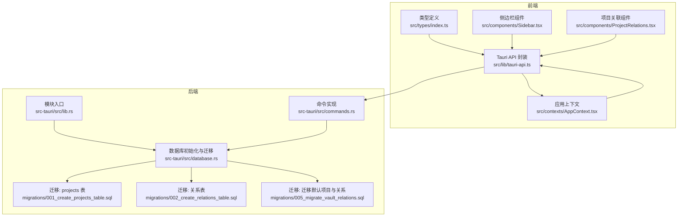
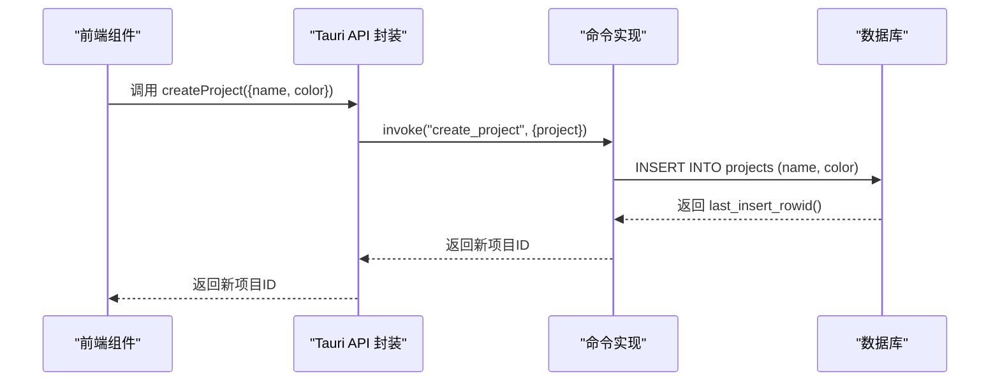
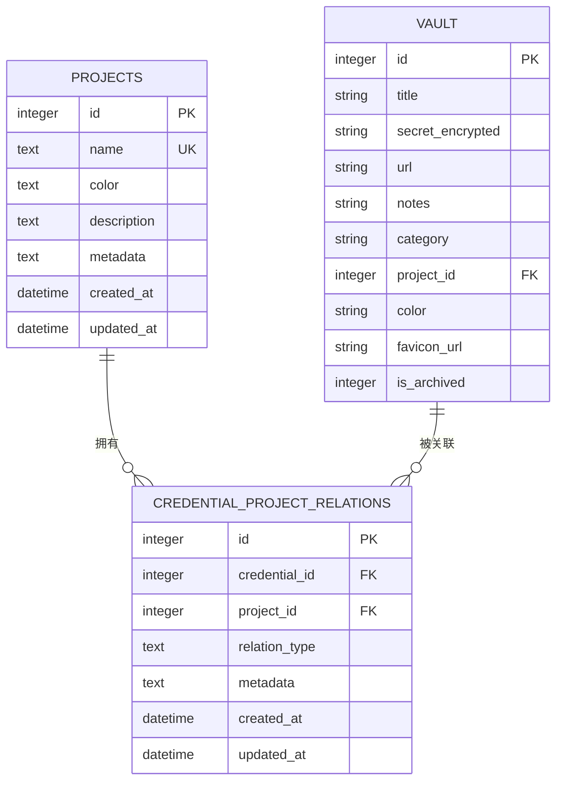
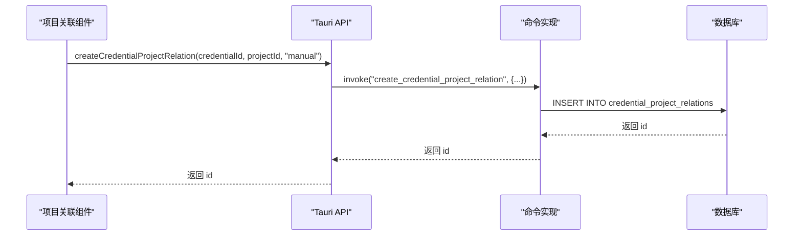
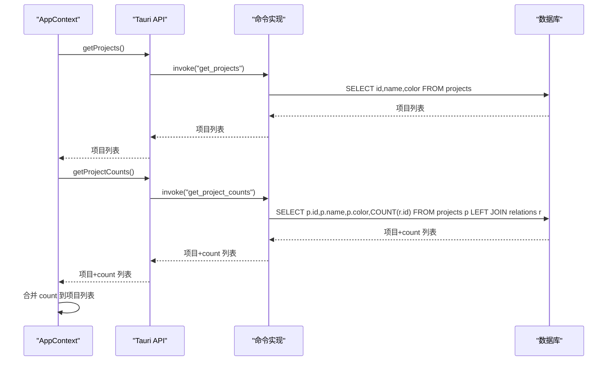
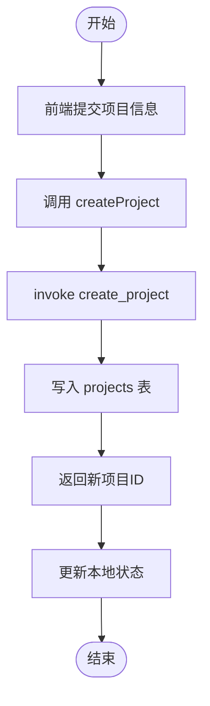
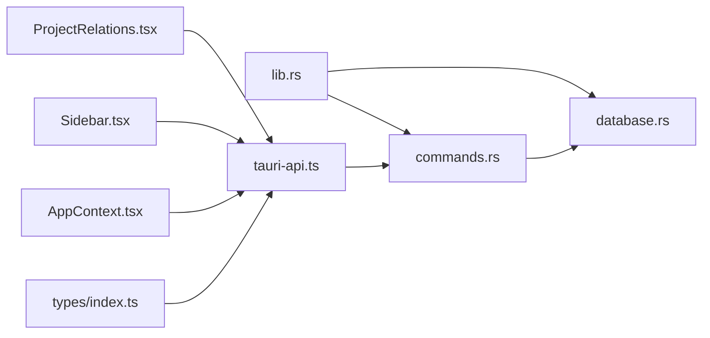

# 项目管理

<cite>
**本文引用的文件**
- [src-tauri/src/lib.rs](file://src-tauri/src/lib.rs)
- [src-tauri/src/commands.rs](file://src-tauri/src/commands.rs)
- [src-tauri/src/database.rs](file://src-tauri/src/database.rs)
- [src-tauri/migrations/001_create_projects_table.sql](file://src-tauri/migrations/001_create_projects_table.sql)
- [src-tauri/migrations/002_create_relations_table.sql](file://src-tauri/migrations/002_create_relations_table.sql)
- [src-tauri/migrations/005_migrate_vault_relations.sql](file://src-tauri/migrations/005_migrate_vault_relations.sql)
- [src/types/index.ts](file://src/types/index.ts)
- [src/lib/tauri-api.ts](file://src/lib/tauri-api.ts)
- [src/contexts/AppContext.tsx](file://src/contexts/AppContext.tsx)
- [src/components/Sidebar.tsx](file://src/components/Sidebar.tsx)
- [src/components/ProjectRelations.tsx](file://src/components/ProjectRelations.tsx)
</cite>

## 目录
1. [简介](#简介)
2. [项目结构](#项目结构)
3. [核心组件](#核心组件)
4. [架构总览](#架构总览)
5. [详细组件分析](#详细组件分析)
6. [依赖分析](#依赖分析)
7. [性能考虑](#性能考虑)
8. [故障排查指南](#故障排查指南)
9. [结论](#结论)
10. [附录：API 使用示例与最佳实践](#附录api-使用示例与最佳实践)

## 简介
本文件系统化梳理项目管理功能的实现，覆盖以下方面：
- 项目创建、编辑、删除、查询的完整流程
- Project 数据模型设计与字段语义
- 项目与凭据的多对多关系映射及中间表设计
- 项目统计（凭据数量统计、分类汇总）的实现
- 权限控制与访问模式
- 最佳实践（命名规范、颜色选择、组织策略）
- API 使用示例与错误处理方案

## 项目结构
后端采用 Tauri + Rust + SQLx + SQLite；前端为 React + TypeScript。项目管理相关的关键路径如下：
- 后端命令层：定义并实现项目与关系的 CRUD 命令
- 数据库层：迁移脚本定义 projects 与 credential_project_relations 表结构
- 前端类型与 API 封装：统一前后端数据契约
- 前端上下文与组件：负责状态管理、UI 交互与调用后端命令

图表来源
- [src-tauri/src/lib.rs](file://src-tauri/src/lib.rs#L1-L4)
- [src-tauri/src/database.rs](file://src-tauri/src/database.rs#L1-L104)
- [src-tauri/src/commands.rs](file://src-tauri/src/commands.rs#L1-L572)
- [src-tauri/migrations/001_create_projects_table.sql](file://src-tauri/migrations/001_create_projects_table.sql#L1-L13)
- [src-tauri/migrations/002_create_relations_table.sql](file://src-tauri/migrations/002_create_relations_table.sql#L1-L16)
- [src-tauri/migrations/005_migrate_vault_relations.sql](file://src-tauri/migrations/005_migrate_vault_relations.sql#L1-L18)
- [src/types/index.ts](file://src/types/index.ts#L1-L46)
- [src/lib/tauri-api.ts](file://src/lib/tauri-api.ts#L1-L97)
- [src/contexts/AppContext.tsx](file://src/contexts/AppContext.tsx#L1-L162)
- [src/components/Sidebar.tsx](file://src/components/Sidebar.tsx#L1-L143)
- [src/components/ProjectRelations.tsx](file://src/components/ProjectRelations.tsx#L1-L105)

章节来源
- [src-tauri/src/lib.rs](file://src-tauri/src/lib.rs#L1-L4)
- [src-tauri/src/database.rs](file://src-tauri/src/database.rs#L1-L104)
- [src-tauri/src/commands.rs](file://src-tauri/src/commands.rs#L1-L572)
- [src-tauri/migrations/001_create_projects_table.sql](file://src-tauri/migrations/001_create_projects_table.sql#L1-L13)
- [src-tauri/migrations/002_create_relations_table.sql](file://src-tauri/migrations/002_create_relations_table.sql#L1-L16)
- [src-tauri/migrations/005_migrate_vault_relations.sql](file://src-tauri/migrations/005_migrate_vault_relations.sql#L1-L18)
- [src/types/index.ts](file://src/types/index.ts#L1-L46)
- [src/lib/tauri-api.ts](file://src/lib/tauri-api.ts#L1-L97)
- [src/contexts/AppContext.tsx](file://src/contexts/AppContext.tsx#L1-L162)
- [src/components/Sidebar.tsx](file://src/components/Sidebar.tsx#L1-L143)
- [src/components/ProjectRelations.tsx](file://src/components/ProjectRelations.tsx#L1-L105)

## 核心组件
- 项目模型与前端类型
  - 后端模型：Project 结构体包含 id、name、color 字段
  - 前端类型：Project 接口包含 id、name、color，并扩展了 count 字段用于统计展示
- 凭据-项目关系模型
  - 关系实体：CredentialProjectRelation 包含 id、credential_id、project_id、relation_type、metadata、created_at
  - 关系类型：支持 direct、manual、migrated_default 等类型
- 统计模型：ProjectWithCount 在查询项目时附加 count 字段，表示该项目下关联的凭据数量
- 前端 API 封装：提供 createProject、getProjects、getProjectCounts 等方法
- 上下文与组件：AppContext 负责拉取项目列表与统计、刷新数据；Sidebar 负责创建项目与展示项目列表；ProjectRelations 负责凭据与项目的关联/解绑

章节来源
- [src-tauri/src/commands.rs](file://src-tauri/src/commands.rs#L23-L38)
- [src-tauri/src/commands.rs](file://src-tauri/src/commands.rs#L365-L371)
- [src/types/index.ts](file://src/types/index.ts#L14-L19)
- [src/lib/tauri-api.ts](file://src/lib/tauri-api.ts#L56-L67)
- [src/contexts/AppContext.tsx](file://src/contexts/AppContext.tsx#L79-L105)
- [src/components/Sidebar.tsx](file://src/components/Sidebar.tsx#L11-L45)
- [src/components/ProjectRelations.tsx](file://src/components/ProjectRelations.tsx#L39-L60)

## 架构总览
项目管理在后端通过命令函数暴露接口，在数据库中以 projects 与 credential_project_relations 两张表存储；前端通过 Tauri API 调用命令，结合上下文状态驱动 UI。

图表来源
- [src/lib/tauri-api.ts](file://src/lib/tauri-api.ts#L56-L59)
- [src-tauri/src/commands.rs](file://src-tauri/src/commands.rs#L141-L152)
- [src-tauri/src/database.rs](file://src-tauri/src/database.rs#L13-L52)

## 详细组件分析

### 项目数据模型与字段语义
- projects 表
  - 字段：id、name（唯一）、color（默认值）、description、metadata、created_at、updated_at
  - 约束：name 唯一索引
- credential_project_relations 中间表
  - 字段：id、credential_id（外键至 vault.id，级联删除）、project_id（外键至 projects.id，级联删除）、relation_type（默认 direct）、metadata、created_at、updated_at
  - 索引：credential_id、project_id

图表来源
- [src-tauri/migrations/001_create_projects_table.sql](file://src-tauri/migrations/001_create_projects_table.sql#L1-L13)
- [src-tauri/migrations/002_create_relations_table.sql](file://src-tauri/migrations/002_create_relations_table.sql#L1-L16)

章节来源
- [src-tauri/migrations/001_create_projects_table.sql](file://src-tauri/migrations/001_create_projects_table.sql#L1-L13)
- [src-tauri/migrations/002_create_relations_table.sql](file://src-tauri/migrations/002_create_relations_table.sql#L1-L16)

### 项目与凭据的多对多关系映射
- 关系建立
  - 通过 create_credential_project_relation 写入 credential_project_relations
  - relation_type 支持 manual、direct 等，默认 direct
- 关系查询
  - get_relations_for_credential 按 credential_id 查询所有关系
  - get_vault_items_by_project 通过 JOIN 关系表筛选指定项目下的凭据
  - get_unlinked_vault_items 查询未关联到某项目的凭据
- 关系删除
  - delete_credential_project_relation 删除单条关系
  - delete_relation_by_credential_and_project 按 (project_id, credential_id) 删除

图表来源
- [src/components/ProjectRelations.tsx](file://src/components/ProjectRelations.tsx#L39-L48)
- [src/lib/tauri-api.ts](file://src/lib/tauri-api.ts#L23-L25)
- [src-tauri/src/commands.rs](file://src-tauri/src/commands.rs#L312-L326)

章节来源
- [src-tauri/src/commands.rs](file://src-tauri/src/commands.rs#L312-L363)
- [src-tauri/src/commands.rs](file://src-tauri/src/commands.rs#L395-L435)
- [src-tauri/src/commands.rs](file://src-tauri/src/commands.rs#L438-L473)
- [src/components/ProjectRelations.tsx](file://src/components/ProjectRelations.tsx#L39-L60)

### 项目统计与分类汇总
- 项目统计
  - get_project_counts 通过 LEFT JOIN 计算每个项目的关联凭据数量
  - 返回 ProjectWithCount 列表，包含 id、name、color、count
- 分类汇总
  - 当前实现聚焦于“凭据数量统计”，未见按类别分组的聚合逻辑
- 前端展示
  - AppContext.refreshData 并发拉取项目与统计，合并 count 至项目列表
  - Sidebar 展示“全部条目”总数（基于项目 count 求和）

图表来源
- [src/contexts/AppContext.tsx](file://src/contexts/AppContext.tsx#L82-L96)
- [src/lib/tauri-api.ts](file://src/lib/tauri-api.ts#L61-L67)
- [src-tauri/src/commands.rs](file://src-tauri/src/commands.rs#L374-L392)

章节来源
- [src-tauri/src/commands.rs](file://src-tauri/src/commands.rs#L365-L392)
- [src/contexts/AppContext.tsx](file://src/contexts/AppContext.tsx#L82-L96)
- [src/components/Sidebar.tsx](file://src/components/Sidebar.tsx#L73-L74)

### 项目创建、编辑、删除与查询流程
- 创建项目
  - 前端：Sidebar 提交表单，调用 createProject，成功后立即更新本地状态
  - 后端：insert into projects，返回 last_insert_rowid
- 查询项目
  - get_projects：按 name 排序返回项目列表
  - getProjectCounts：返回带 count 的项目列表
- 编辑项目
  - 当前命令未提供 update_project；如需修改项目信息，可在前端 UI 中扩展或通过迁移脚本一次性修正
- 删除项目
  - 当前命令未提供 delete_project；由于关系表设置了外键级联删除，删除项目不会直接删除凭据，但会删除关系记录
  - 若需彻底删除项目并保留凭据，应先解除所有关系再删除项目（当前未提供该命令）

图表来源
- [src/components/Sidebar.tsx](file://src/components/Sidebar.tsx#L11-L45)
- [src/lib/tauri-api.ts](file://src/lib/tauri-api.ts#L56-L59)
- [src-tauri/src/commands.rs](file://src-tauri/src/commands.rs#L141-L152)

章节来源
- [src/components/Sidebar.tsx](file://src/components/Sidebar.tsx#L11-L45)
- [src/lib/tauri-api.ts](file://src/lib/tauri-api.ts#L56-L59)
- [src-tauri/src/commands.rs](file://src-tauri/src/commands.rs#L141-L152)

### 默认项目与迁移策略
- 迁移脚本 005 会在首次运行时：
  - 插入默认项目 Default（若不存在）
  - 为所有 vault 条目创建 credential_project_relations 关系（relation_type=migrated_default）
- 这确保了旧版本数据平滑过渡到新的项目体系

章节来源
- [src-tauri/migrations/005_migrate_vault_relations.sql](file://src-tauri/migrations/005_migrate_vault_relations.sql#L1-L18)
- [src-tauri/src/database.rs](file://src-tauri/src/database.rs#L41-L47)

## 依赖分析
- 模块耦合
  - commands.rs 依赖 database.rs 提供的连接池
  - lib.rs 将 database、crypto、commands 暴露为模块入口
- 外部依赖
  - SQLx：异步数据库访问
  - Tauri：跨平台桌面端桥接
- 前后端契约
  - 前端通过 @tauri-apps/api/tauri 的 invoke 调用后端命令
  - 类型定义在 src/types/index.ts 与后端模型保持一致

图表来源
- [src-tauri/src/lib.rs](file://src-tauri/src/lib.rs#L1-L4)
- [src-tauri/src/commands.rs](file://src-tauri/src/commands.rs#L1-L8)
- [src-tauri/src/database.rs](file://src-tauri/src/database.rs#L1-L104)
- [src/lib/tauri-api.ts](file://src/lib/tauri-api.ts#L1-L97)
- [src/types/index.ts](file://src/types/index.ts#L1-L46)
- [src/contexts/AppContext.tsx](file://src/contexts/AppContext.tsx#L1-L162)
- [src/components/Sidebar.tsx](file://src/components/Sidebar.tsx#L1-L143)
- [src/components/ProjectRelations.tsx](file://src/components/ProjectRelations.tsx#L1-L105)

章节来源
- [src-tauri/src/lib.rs](file://src-tauri/src/lib.rs#L1-L4)
- [src-tauri/src/commands.rs](file://src-tauri/src/commands.rs#L1-L8)
- [src-tauri/src/database.rs](file://src-tauri/src/database.rs#L1-L104)
- [src/lib/tauri-api.ts](file://src/lib/tauri-api.ts#L1-L97)
- [src/types/index.ts](file://src/types/index.ts#L1-L46)
- [src/contexts/AppContext.tsx](file://src/contexts/AppContext.tsx#L1-L162)
- [src/components/Sidebar.tsx](file://src/components/Sidebar.tsx#L1-L143)
- [src/components/ProjectRelations.tsx](file://src/components/ProjectRelations.tsx#L1-L105)

## 性能考虑
- 查询优化
  - 项目列表与统计并发拉取，减少往返时间
  - 项目表与关系表均建立索引，提升 JOIN 与过滤效率
- 写入优化
  - 关系表外键级联删除避免孤立数据
  - 批量迁移脚本一次性完成默认项目与关系注入
- 前端渲染
  - 本地状态即时更新，避免等待后端同步导致的闪烁

章节来源
- [src/contexts/AppContext.tsx](file://src/contexts/AppContext.tsx#L82-L85)
- [src-tauri/migrations/001_create_projects_table.sql](file://src-tauri/migrations/001_create_projects_table.sql#L12-L12)
- [src-tauri/migrations/002_create_relations_table.sql](file://src-tauri/migrations/002_create_relations_table.sql#L14-L15)

## 故障排查指南
- 数据库未初始化
  - 现象：调用命令时报错“Database not initialized”
  - 处理：确认 database.rs.init_database 已执行并成功建立连接池
- 项目名冲突
  - 现象：插入 projects 报唯一约束冲突
  - 处理：确保项目名唯一，或在前端进行去重校验
- 关系删除失败
  - 现象：按 (project_id, credential_id) 删除关系无效果
  - 处理：确认传入参数正确且对应关系存在
- 项目统计不准确
  - 现象：count 与实际关联数不符
  - 处理：检查迁移是否完成、是否存在 orphan 关系；必要时重建统计查询

章节来源
- [src-tauri/src/database.rs](file://src-tauri/src/database.rs#L99-L104)
- [src-tauri/migrations/001_create_projects_table.sql](file://src-tauri/migrations/001_create_projects_table.sql#L3-L4)
- [src-tauri/src/commands.rs](file://src-tauri/src/commands.rs#L476-L487)
- [src-tauri/migrations/005_migrate_vault_relations.sql](file://src-tauri/migrations/005_migrate_vault_relations.sql#L9-L15)

## 结论
项目管理功能以清晰的数据模型与中间表实现了灵活的多对多关系，配合统计查询与迁移策略，保障了从旧版本到新版本的平滑演进。前端通过上下文与组件封装，提供了良好的用户体验。建议后续补充项目编辑与删除命令，以及按类别统计的扩展能力。

## 附录：API 使用示例与最佳实践

### API 使用示例
- 创建项目
  - 前端调用：调用 createProject，传入 { name, color }
  - 成功后立即更新本地状态，避免 UI 闪烁
- 查询项目与统计
  - 并发调用 getProjects 与 getProjectCounts，合并 count 至项目列表
- 凭据与项目关联
  - 通过 getUnlinkedVaultItems 获取未关联凭据，调用 createCredentialProjectRelation 建立关系
  - 解绑时调用 delete_relation_by_credential_and_project

章节来源
- [src/lib/tauri-api.ts](file://src/lib/tauri-api.ts#L56-L67)
- [src/lib/tauri-api.ts](file://src/lib/tauri-api.ts#L19-L29)
- [src/contexts/AppContext.tsx](file://src/contexts/AppContext.tsx#L82-L96)
- [src/components/ProjectRelations.tsx](file://src/components/ProjectRelations.tsx#L39-L60)

### 错误处理方案
- 参数校验
  - 前端：创建项目时校验名称非空；选择凭据时校验选中项存在
- 异常捕获
  - 前端：try/catch 包裹 API 调用，统一弹窗提示
  - 后端：命令函数返回 Result，错误转为字符串传播
- 状态回滚
  - 前端：失败时撤销本地状态变更，保持一致性

章节来源
- [src/components/Sidebar.tsx](file://src/components/Sidebar.tsx#L13-L16)
- [src/components/ProjectRelations.tsx](file://src/components/ProjectRelations.tsx#L52-L52)
- [src-tauri/src/commands.rs](file://src-tauri/src/commands.rs#L41-L64)

### 最佳实践
- 命名规范
  - 项目名建议使用语义化、唯一的名称，避免重复
- 颜色选择
  - 使用高对比度颜色便于区分；默认颜色可参考主题色板
- 组织策略
  - 按业务域或环境划分项目，减少跨项目依赖
  - 定期清理孤儿关系，保持统计准确性
- 权限与访问
  - 当前实现未显式鉴权；建议在命令层增加访问控制（如仅允许已认证用户操作）
  - 对敏感操作（如删除关系）增加二次确认