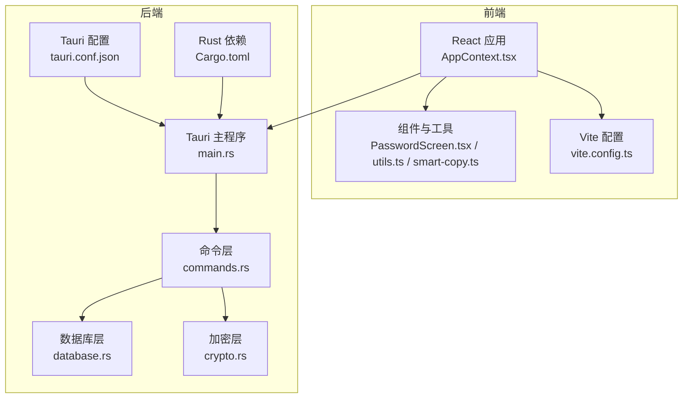
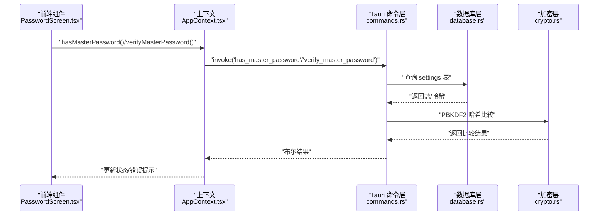
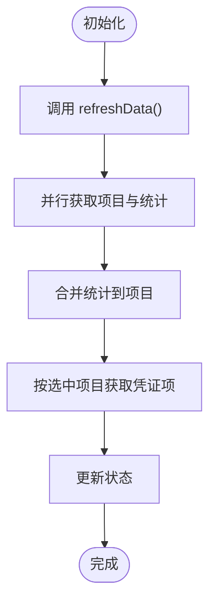
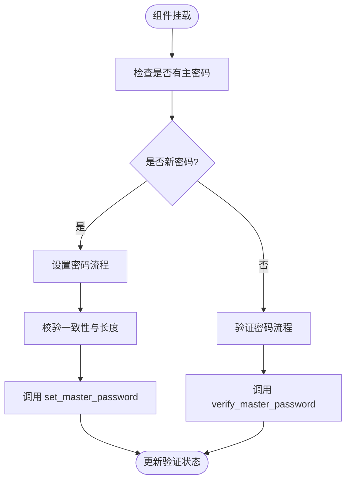
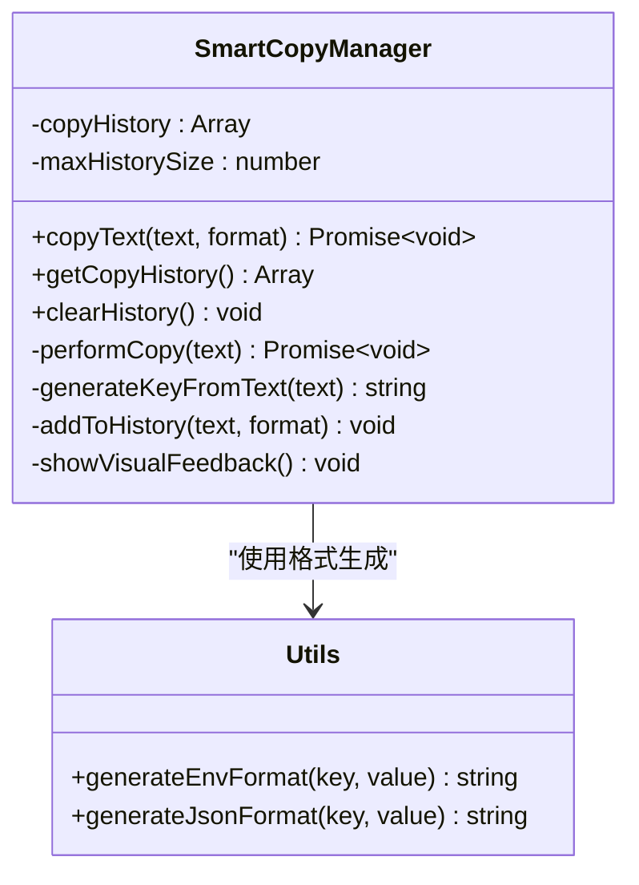
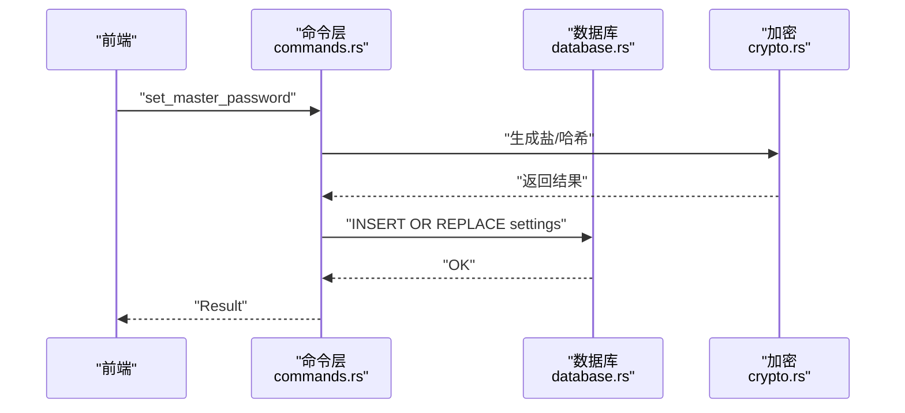
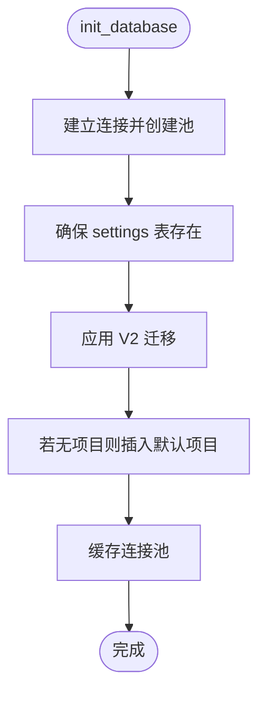
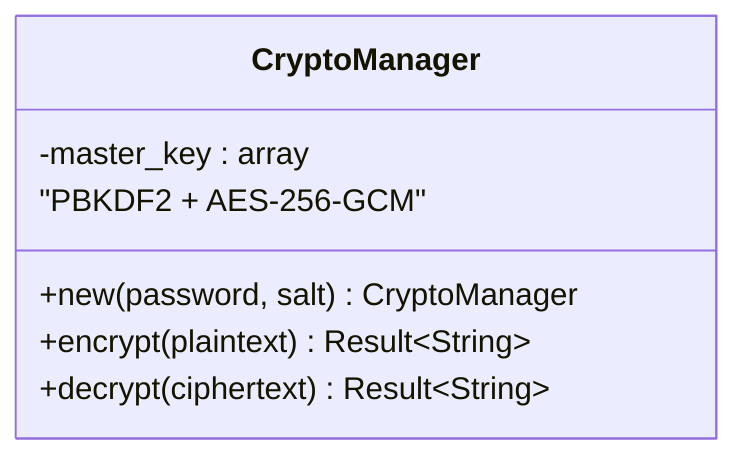
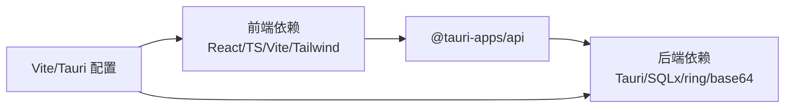
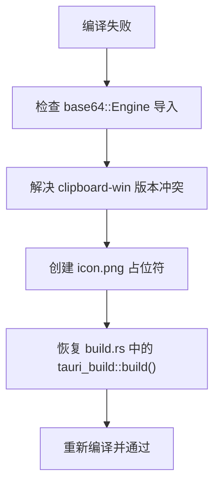

# 测试与质量保证

<cite>
**本文引用的文件**
- [package.json](file://package.json)
- [vite.config.ts](file://vite.config.ts)
- [tsconfig.json](file://tsconfig.json)
- [test.html](file://test.html)
- [TEST_REPORT.md](file://TEST_REPORT.md)
- [QUICK_DIAGNOSIS.md](file://QUICK_DIAGNOSIS.md)
- [BUG_ANALYSIS.md](file://BUG_ANALYSIS.md)
- [src-tauri/tauri.conf.json](file://src-tauri/tauri.conf.json)
- [src-tauri/Cargo.toml](file://src-tauri/Cargo.toml)
- [src-tauri/src/main.rs](file://src-tauri/src/main.rs)
- [src-tauri/src/commands.rs](file://src-tauri/src/commands.rs)
- [src-tauri/src/database.rs](file://src-tauri/src/database.rs)
- [src-tauri/src/crypto.rs](file://src-tauri/src/crypto.rs)
- [src/contexts/AppContext.tsx](file://src/contexts/AppContext.tsx)
- [src/components/PasswordScreen.tsx](file://src/components/PasswordScreen.tsx)
- [src/lib/utils.ts](file://src/lib/utils.ts)
- [src/lib/smart-copy.ts](file://src/lib/smart-copy.ts)
</cite>

## 目录
1. [引言](#引言)
2. [项目结构](#项目结构)
3. [核心组件](#核心组件)
4. [架构总览](#架构总览)
5. [详细组件分析](#详细组件分析)
6. [依赖分析](#依赖分析)
7. [性能考虑](#性能考虑)
8. [故障排查指南](#故障排查指南)
9. [结论](#结论)
10. [附录](#附录)

## 引言
本文件面向 AIpassword（DevVault）项目的测试与质量保证，系统梳理测试策略、测试用例设计、质量控制流程与工具链现状，并结合当前仓库中的诊断与测试报告，提出可落地的单元测试、集成测试、端到端测试与持续测试建议。同时涵盖代码质量检查、静态分析、覆盖率分析、性能测试、安全测试、兼容性测试、缺陷跟踪、问题诊断与修复验证机制，以及测试数据管理、测试环境配置与测试报告生成。

## 项目结构
项目采用前端（React + TypeScript + Vite）与后端（Rust + Tauri + SQLx）分离架构，前端负责 UI 与交互，后端负责数据持久化、加密与系统能力（如剪贴板）。测试与质量保证围绕以下层次展开：
- 前端 UI 与交互测试：静态页面验证与开发服务器验证
- 后端命令与数据库测试：命令函数、数据库迁移与连接池
- 集成测试：前端通过 Tauri 暴露的命令与后端交互
- 端到端测试：桌面应用启动、主密码流程、复制功能等

图表来源
- [src-tauri/src/main.rs](file://src-tauri/src/main.rs#L21-L51)
- [src-tauri/src/commands.rs](file://src-tauri/src/commands.rs#L40-L392)
- [src-tauri/src/database.rs](file://src-tauri/src/database.rs#L13-L52)
- [src-tauri/src/crypto.rs](file://src-tauri/src/crypto.rs#L1-L92)
- [src-tauri/tauri.conf.json](file://src-tauri/tauri.conf.json#L1-L33)
- [src-tauri/Cargo.toml](file://src-tauri/Cargo.toml#L1-L34)
- [src/contexts/AppContext.tsx](file://src/contexts/AppContext.tsx#L76-L154)
- [src/components/PasswordScreen.tsx](file://src/components/PasswordScreen.tsx#L1-L146)
- [vite.config.ts](file://vite.config.ts#L1-L21)

章节来源
- [package.json](file://package.json#L1-L32)
- [vite.config.ts](file://vite.config.ts#L1-L21)
- [tsconfig.json](file://tsconfig.json#L1-L25)
- [src-tauri/tauri.conf.json](file://src-tauri/tauri.conf.json#L1-L33)
- [src-tauri/Cargo.toml](file://src-tauri/Cargo.toml#L1-L34)

## 核心组件
- 前端上下文与状态管理：集中管理凭证项、项目、搜索、主密码验证状态等，支持并发请求与错误兜底。
- 密码屏组件：根据是否存在主密码决定设置或验证流程，提供输入校验与错误提示。
- 智能复制工具：支持多种复制格式（原始、环境变量、JSON、自定义模板），具备复制历史与可视化反馈。
- 后端命令层：封装数据库 CRUD、项目关系、搜索、剪贴板、Favicon 获取、主密码设置/验证等命令。
- 数据库层：SQLite 连接池、迁移管理、默认项目初始化。
- 加密层：基于 ring 的 PBKDF2 + AES-256-GCM，提供盐值生成与密码哈希。

章节来源
- [src/contexts/AppContext.tsx](file://src/contexts/AppContext.tsx#L1-L162)
- [src/components/PasswordScreen.tsx](file://src/components/PasswordScreen.tsx#L1-L146)
- [src/lib/smart-copy.ts](file://src/lib/smart-copy.ts#L1-L152)
- [src-tauri/src/commands.rs](file://src-tauri/src/commands.rs#L40-L392)
- [src-tauri/src/database.rs](file://src-tauri/src/database.rs#L13-L52)
- [src-tauri/src/crypto.rs](file://src-tauri/src/crypto.rs#L1-L92)

## 架构总览
下图展示从前端到后端的关键调用链与数据流，体现测试关注点：命令注册、数据库连接、加密处理与剪贴板能力。

图表来源
- [src/components/PasswordScreen.tsx](file://src/components/PasswordScreen.tsx#L14-L61)
- [src/contexts/AppContext.tsx](file://src/contexts/AppContext.tsx#L123-L140)
- [src-tauri/src/commands.rs](file://src-tauri/src/commands.rs#L272-L309)
- [src-tauri/src/database.rs](file://src-tauri/src/database.rs#L99-L104)
- [src-tauri/src/crypto.rs](file://src-tauri/src/crypto.rs#L82-L92)

## 详细组件分析

### 前端上下文与状态管理（AppContext）
- 职责：集中管理应用状态、刷新数据、搜索、主密码验证；并发拉取项目与统计，合并结果。
- 关键点：初始加载与项目切换触发刷新；错误捕获与加载状态管理。
- 测试关注：初始化流程、错误分支、并发请求顺序与合并逻辑。

图表来源
- [src/contexts/AppContext.tsx](file://src/contexts/AppContext.tsx#L79-L105)
- [src/contexts/AppContext.tsx](file://src/contexts/AppContext.tsx#L143-L147)

章节来源
- [src/contexts/AppContext.tsx](file://src/contexts/AppContext.tsx#L76-L154)

### 密码屏组件（PasswordScreen）
- 职责：判断是否首次使用（无主密码），设置或验证主密码；输入校验与错误提示。
- 关键点：hasMasterPassword 与 verifyMasterPassword 的区分；提交流程与状态切换。
- 测试关注：首次使用与已有密码两种路径；输入长度与一致性校验；错误提示与 UI 状态。

图表来源
- [src/components/PasswordScreen.tsx](file://src/components/PasswordScreen.tsx#L14-L61)

章节来源
- [src/components/PasswordScreen.tsx](file://src/components/PasswordScreen.tsx#L1-L146)

### 智能复制工具（SmartCopyManager）
- 职责：多格式复制（原始、ENV、JSON、自定义模板）、复制历史、可视化反馈。
- 关键点：格式生成、剪贴板回退、历史截断与去重。
- 测试关注：不同格式生成正确性、历史容量限制、异常捕获与反馈。

图表来源
- [src/lib/smart-copy.ts](file://src/lib/smart-copy.ts#L8-L152)
- [src/lib/utils.ts](file://src/lib/utils.ts#L33-L39)

章节来源
- [src/lib/smart-copy.ts](file://src/lib/smart-copy.ts#L1-L152)
- [src/lib/utils.ts](file://src/lib/utils.ts#L1-L44)

### 后端命令层（commands.rs）
- 职责：暴露 Tauri 命令，封装数据库操作、项目关系、搜索、剪贴板、Favicon 获取、主密码设置/验证。
- 关键点：base64::Engine trait 导入、clipboard-win API 兼容、SQLx Row trait 使用。
- 测试关注：命令注册、数据库事务、错误传播、平台差异（Windows 剪贴板）。

图表来源
- [src-tauri/src/commands.rs](file://src-tauri/src/commands.rs#L248-L269)
- [src-tauri/src/database.rs](file://src-tauri/src/database.rs#L24-L31)
- [src-tauri/src/crypto.rs](file://src-tauri/src/crypto.rs#L76-L92)

章节来源
- [src-tauri/src/commands.rs](file://src-tauri/src/commands.rs#L40-L392)

### 数据库层（database.rs）
- 职责：SQLite 连接池初始化、迁移管理、默认项目插入、全局池缓存。
- 关键点：迁移幂等、默认项目、连接选项。
- 测试关注：初始化顺序、迁移执行、池获取失败场景。

图表来源
- [src-tauri/src/database.rs](file://src-tauri/src/database.rs#L13-L52)

章节来源
- [src-tauri/src/database.rs](file://src-tauri/src/database.rs#L1-L104)

### 加密层（crypto.rs）
- 职责：PBKDF2 + AES-256-GCM，盐值生成与密码哈希。
- 关键点：随机盐、非ces 生成、Base64 编解码。
- 测试关注：盐长度与格式、加密/解密往返、错误处理。

图表来源
- [src-tauri/src/crypto.rs](file://src-tauri/src/crypto.rs#L7-L74)

章节来源
- [src-tauri/src/crypto.rs](file://src-tauri/src/crypto.rs#L1-L92)

## 依赖分析
- 前端：React + TypeScript + Vite，Tailwind CSS，@tauri-apps/api。
- 后端：Tauri 1.5，SQLx SQLite，ring（加密），base64，clipboard-win（平台差异）。
- 配置：Vite 固定端口 1420，Tauri 开发路径与构建目录，Cargo 依赖与特性。

图表来源
- [package.json](file://package.json#L13-L31)
- [src-tauri/Cargo.toml](file://src-tauri/Cargo.toml#L15-L29)
- [vite.config.ts](file://vite.config.ts#L13-L20)
- [src-tauri/tauri.conf.json](file://src-tauri/tauri.conf.json#L2-L7)

章节来源
- [package.json](file://package.json#L1-L32)
- [src-tauri/Cargo.toml](file://src-tauri/Cargo.toml#L1-L34)
- [src-tauri/tauri.conf.json](file://src-tauri/tauri.conf.json#L1-L33)
- [vite.config.ts](file://vite.config.ts#L1-L21)

## 性能考虑
- 前端：并发请求（项目与统计）减少往返；组件懒加载与虚拟滚动（如列表较大时）。
- 后端：连接池复用、SQLx 查询预编译、避免 N+1 查询；迁移幂等降低启动时间。
- 剪贴板：平台差异处理，Windows 使用 clipboard-win，其他平台降级提示。
- 配置：固定端口与严格端口模式，避免端口竞争导致的冷启动延迟。

## 故障排查指南
当前仓库存在编译阻塞问题，需优先修复以下 P0 级问题：
- base64 Engine trait 未导入：命令层使用 STANDARD.encode/decode 需要导入 Engine trait。
- clipboard-win 版本冲突：clipboard-win 5.4.1 与直接依赖 4.5.0 API 不兼容，需统一版本并更新调用。
- icon.png 缺失：Tauri 的 generate_context!() 宏期望 icon.png 存在，需创建占位符或复制现有文件。
- build.rs 跳过 Tauri 编译：完全跳过 tauri_build::build()，导致资源编译与宏处理未初始化。

图表来源
- [QUICK_DIAGNOSIS.md](file://QUICK_DIAGNOSIS.md#L5-L75)
- [BUG_ANALYSIS.md](file://BUG_ANALYSIS.md#L13-L111)

章节来源
- [QUICK_DIAGNOSIS.md](file://QUICK_DIAGNOSIS.md#L1-L221)
- [BUG_ANALYSIS.md](file://BUG_ANALYSIS.md#L1-L224)

## 结论
当前项目已完成前端 UI 与交互验证，后端命令与数据库层具备基础能力。测试与质量保证工作应围绕以下主线推进：先解决编译阻塞问题，再开展单元测试、集成测试与端到端测试；引入静态分析与覆盖率工具；完善性能与安全测试；建立缺陷跟踪与回归测试机制；规范测试数据与环境配置，形成可重复的质量保障闭环。

## 附录

### 测试策略与用例设计
- 单元测试
  - 前端：AppContext reducer 与副作用、PasswordScreen 输入校验、SmartCopyManager 格式生成与历史。
  - 后端：commands.rs 命令函数（含错误路径）、database.rs 连接池与迁移、crypto.rs 加密/解密。
- 集成测试
  - Tauri 命令注册与调用、数据库事务一致性、主密码设置/验证流程。
- 端到端测试
  - 桌面应用启动、主密码首次设置与验证、复制功能（含平台差异）、搜索与列表渲染。

章节来源
- [src/contexts/AppContext.tsx](file://src/contexts/AppContext.tsx#L30-L67)
- [src/components/PasswordScreen.tsx](file://src/components/PasswordScreen.tsx#L30-L61)
- [src/lib/smart-copy.ts](file://src/lib/smart-copy.ts#L20-L56)
- [src-tauri/src/commands.rs](file://src-tauri/src/commands.rs#L40-L392)
- [src-tauri/src/database.rs](file://src-tauri/src/database.rs#L13-L52)
- [src-tauri/src/crypto.rs](file://src-tauri/src/crypto.rs#L25-L73)

### 代码质量检查与静态分析
- TypeScript/ESLint：启用严格模式、未使用变量/参数检查、switch 穿透检查。
- Rust：cargo clippy（建议加入 CI），检查未使用导入与潜在问题。
- 前端：Vite 固定端口与忽略 src-tauri 目录监控，避免误触发。

章节来源
- [tsconfig.json](file://tsconfig.json#L18-L22)
- [vite.config.ts](file://vite.config.ts#L13-L20)

### 代码覆盖率分析
- 建议：前端使用 Vitest + @vitest/coverage，后端使用 cargo-tarpaulin 或 tarpaulin。
- 覆盖率目标：核心命令与加密逻辑达到高覆盖率，UI 组件达到中等以上覆盖率。

### 性能测试
- 前端：Vite 开发服务器性能基线、组件渲染时间（React DevTools）。
- 后端：数据库查询耗时、连接池命中率、命令调用延迟。

### 安全测试
- 主密码：PBKDF2 参数强度、盐值随机性、哈希存储与验证。
- 数据传输：本地命令调用，注意敏感信息日志脱敏。
- 权限：Tauri 权限白名单配置，剪贴板权限平台差异。

### 兼容性测试
- 平台：Windows（clipboard-win）、macOS/Linux（剪贴板降级）。
- 浏览器：现代浏览器对 Clipboard API 的支持。

### 缺陷跟踪与修复验证
- 缺陷跟踪：基于仓库中的诊断与问题分析文档，建立问题清单与修复计划。
- 修复验证：编译通过、功能验证、回归测试覆盖。

章节来源
- [TEST_REPORT.md](file://TEST_REPORT.md#L118-L131)
- [QUICK_DIAGNOSIS.md](file://QUICK_DIAGNOSIS.md#L146-L167)

### 持续测试与自动化
- CI 集成：前端构建与类型检查、后端编译与 clippy、测试覆盖率上报。
- 回归测试：每次后端命令变更与数据库迁移后执行回归集。

### 测试数据管理与环境配置
- 测试数据库：SQLite 内存数据库或临时文件，迁移隔离。
- 环境变量：通过 Tauri 配置与 Cargo.toml 管理，避免硬编码。

章节来源
- [src-tauri/tauri.conf.json](file://src-tauri/tauri.conf.json#L2-L7)
- [src-tauri/Cargo.toml](file://src-tauri/Cargo.toml#L15-L29)

### 测试报告生成
- 前端：Vitest 覆盖率报告、构建产物校验。
- 后端：clippy 报告、测试输出与覆盖率（如使用 tarpaulin）。

### 质量指标与用户体验评估
- 质量指标：编译成功率、测试通过率、覆盖率阈值、平均启动时间。
- 用户体验：主密码流程耗时、复制反馈时延、UI 响应时间、错误提示清晰度。