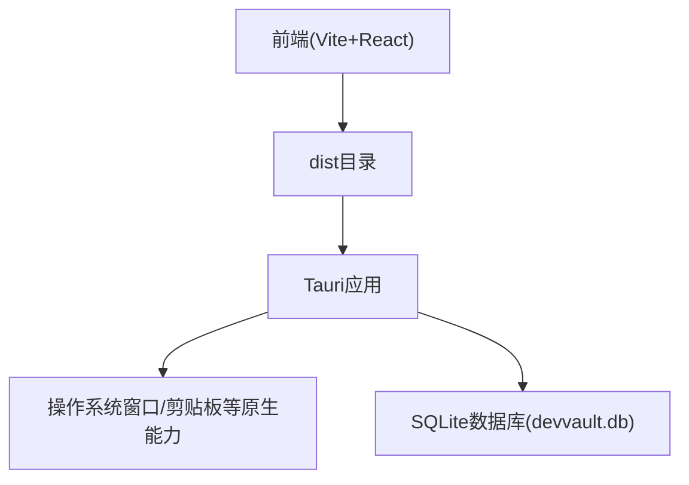
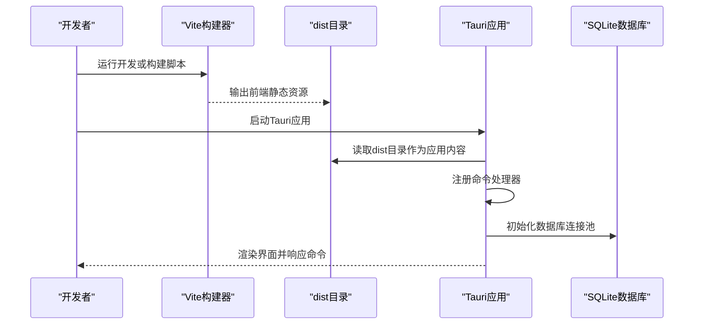
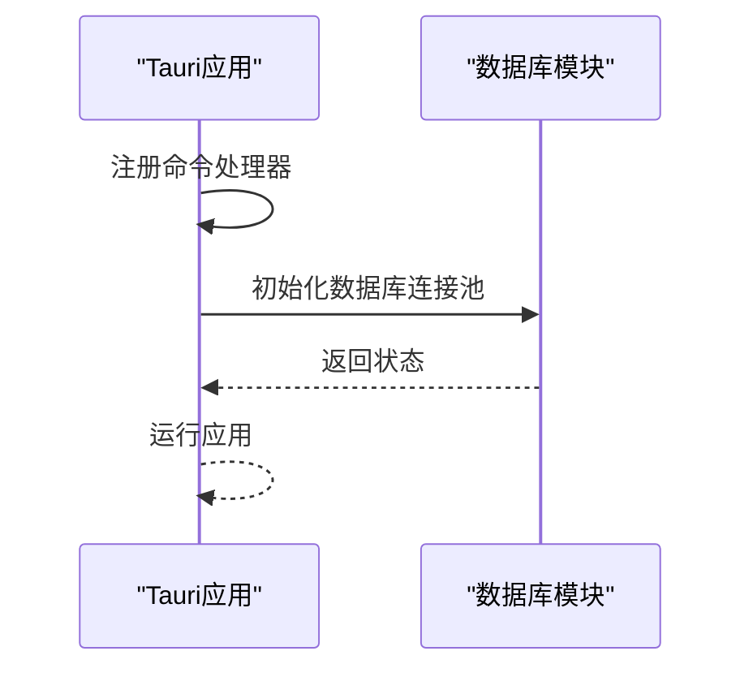
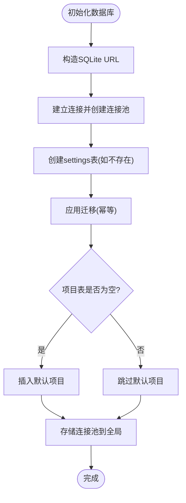
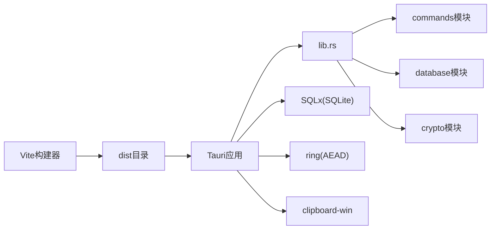

# 部署构建

<cite>
**本文引用的文件**
- [package.json](file://package.json)
- [vite.config.ts](file://vite.config.ts)
- [Cargo.toml](file://src-tauri/Cargo.toml)
- [tauri.conf.json](file://src-tauri/tauri.conf.json)
- [build.rs](file://src-tauri/build.rs)
- [main.rs](file://src-tauri/src/main.rs)
- [lib.rs](file://src-tauri/src/lib.rs)
- [database.rs](file://src-tauri/src/database.rs)
- [crypto.rs](file://src-tauri/src/crypto.rs)
- [tsconfig.json](file://tsconfig.json)
- [tailwind.config.js](file://tailwind.config.js)
- [postcss.config.js](file://postcss.config.js)
</cite>

## 目录
1. [简介](#简介)
2. [项目结构](#项目结构)
3. [核心组件](#核心组件)
4. [架构总览](#架构总览)
5. [详细组件分析](#详细组件分析)
6. [依赖关系分析](#依赖关系分析)
7. [性能考虑](#性能考虑)
8. [故障排除指南](#故障排除指南)
9. [结论](#结论)
10. [附录](#附录)

## 简介
本文件面向AIpassword项目的部署与构建，系统性梳理Tauri应用的配置、构建流程与打包策略，覆盖跨平台支持、平台特定配置、依赖管理、构建脚本与编译选项、发布与版本管理、分发策略、生产环境部署与运维监控、构建优化与性能调优、安全加固与防篡改、持续集成与自动化部署、回滚机制、故障排除与日志分析等主题。文档以仓库现有配置与源码为依据，避免臆测，确保可操作性与可追溯性。

## 项目结构
AIpassword采用前端React/Vite + 后端Rust/Tauri的双层架构：前端负责UI与交互，后端通过Tauri桥接原生能力（剪贴板、系统窗口、SQLite等），并提供命令接口供前端调用。构建时，Vite先将前端产物输出到dist目录，再由Tauri读取该目录作为应用分发内容。



**图表来源**
- [vite.config.ts](file://vite.config.ts#L1-L21)
- [tauri.conf.json](file://src-tauri/tauri.conf.json#L1-L33)

**章节来源**
- [vite.config.ts](file://vite.config.ts#L1-L21)
- [tauri.conf.json](file://src-tauri/tauri.conf.json#L1-L33)

## 核心组件
- 前端构建与开发服务器
  - 使用Vite进行开发与构建，固定端口1420用于Tauri dev模式，忽略对src-tauri的监听。
- Tauri应用入口与命令注册
  - 在main.rs中注册所有后端命令，并在启动时初始化数据库连接池。
- 数据库与迁移
  - 使用SQLx管理SQLite连接池，内置迁移跟踪表与多版本迁移脚本。
- 加密模块
  - 基于ring实现AES-256-GCM对称加密与PBKDF2-HMAC-SHA256密钥派生，支持盐值生成与密码哈希。
- 打包与配置
  - Tauri配置文件定义开发/构建路径、产品名称与版本、窗口属性、功能特性开关等；Cargo.toml声明Rust依赖与特性。

**章节来源**
- [main.rs](file://src-tauri/src/main.rs#L1-L51)
- [database.rs](file://src-tauri/src/database.rs#L1-L104)
- [crypto.rs](file://src-tauri/src/crypto.rs#L1-L92)
- [tauri.conf.json](file://src-tauri/tauri.conf.json#L1-L33)
- [Cargo.toml](file://src-tauri/Cargo.toml#L1-L34)

## 架构总览
下图展示从开发到构建的关键流程：Vite负责前端开发与产物生成，Tauri读取dist目录并注入命令处理逻辑，运行时通过Rust模块访问系统能力与数据库。



**图表来源**
- [vite.config.ts](file://vite.config.ts#L1-L21)
- [tauri.conf.json](file://src-tauri/tauri.conf.json#L1-L33)
- [main.rs](file://src-tauri/src/main.rs#L1-L51)
- [database.rs](file://src-tauri/src/database.rs#L1-L104)

## 详细组件分析

### 前端构建与开发服务器
- 开发与构建脚本
  - 脚本定义了开发、构建、Tauri开发与构建入口，构建阶段先执行TypeScript编译，再执行Vite构建。
- Vite配置要点
  - 固定端口1420并严格端口占用，忽略对src-tauri的监听，避免不必要的热更新开销。
- TypeScript与样式链路
  - tsconfig启用bundler解析、严格模式与JSX转换；Tailwind与PostCSS用于样式管线。

**章节来源**
- [package.json](file://package.json#L1-L32)
- [vite.config.ts](file://vite.config.ts#L1-L21)
- [tsconfig.json](file://tsconfig.json#L1-L25)
- [tailwind.config.js](file://tailwind.config.js#L1-L46)
- [postcss.config.js](file://postcss.config.js#L1-L6)

### Tauri应用入口与命令注册
- 应用入口
  - 在Windows发布版隐藏控制台窗口；注册大量命令（增删改查、搜索、剪贴板、图标获取、主密码设置/校验/存在性检查等）。
- 启动流程
  - 应用启动时异步初始化数据库，失败会打印错误但不影响应用继续运行。



**图表来源**
- [main.rs](file://src-tauri/src/main.rs#L1-L51)
- [database.rs](file://src-tauri/src/database.rs#L1-L104)

**章节来源**
- [main.rs](file://src-tauri/src/main.rs#L1-L51)

### 数据库与迁移
- 连接与池化
  - 使用SQLx建立SQLite连接，创建连接池并存储为全局单例，提供获取函数。
- 迁移机制
  - 内置迁移跟踪表，按顺序执行多版本SQL脚本，支持幂等与多语句拆分。
- 默认数据
  - 若项目表为空，插入默认项目以保证旧版本期望的基础表结构。



**图表来源**
- [database.rs](file://src-tauri/src/database.rs#L1-L104)

**章节来源**
- [database.rs](file://src-tauri/src/database.rs#L1-L104)

### 加密模块
- 密钥派生
  - PBKDF2-HMAC-SHA256，迭代次数100000，生成32字节主密钥。
- 对称加解密
  - AES-256-GCM，随机盐作为nonce，加密结果包含盐与密文，使用Base64编码。
- 工具函数
  - 提供随机盐生成与密码哈希计算。

```mermaid
classDiagram
class CryptoManager {
+master_key : [u8; 32]
+new(password, salt) CryptoManager
+encrypt(plaintext) Result~String~
+decrypt(ciphertext) Result~String~
}
fun generate_salt() [u8; 32]
fun hash_password(password, salt) String
```

**图表来源**
- [crypto.rs](file://src-tauri/src/crypto.rs#L1-L92)

**章节来源**
- [crypto.rs](file://src-tauri/src/crypto.rs#L1-L92)

### 打包与配置
- 开发/构建路径
  - devPath指向Vite开发服务器地址，distDir指向dist目录；构建前/后命令分别调用npm脚本。
- 产品信息
  - 产品名与版本在配置文件中定义。
- 安全与功能特性
  - 显式关闭全部allowlist，仅按需开放；自定义协议特性保留。
- 窗口属性
  - 宽高、可调整、标题等窗口参数集中配置。

**章节来源**
- [tauri.conf.json](file://src-tauri/tauri.conf.json#L1-L33)

### Rust依赖与特性
- 关键依赖
  - Tauri核心、SQLx(SQLite+Tokio+rustls)、ring(AEAD)、clipboard-win、reqwest、uuid、serde系列等。
- 特性
  - 自定义协议特性用于生产构建或文件系统开发场景。

**章节来源**
- [Cargo.toml](file://src-tauri/Cargo.toml#L1-L34)

## 依赖关系分析
- 前端到后端
  - Vite构建产物(dist)被Tauri读取；Tauri通过命令处理器与Rust模块交互。
- 后端内部
  - main.rs聚合commands/database/crypto模块；lib.rs统一导出模块入口。
- 外部依赖
  - Tauri提供系统级能力；SQLx提供数据库访问；ring提供加密算法；clipboard-win提供Windows剪贴板支持。



**图表来源**
- [lib.rs](file://src-tauri/src/lib.rs#L1-L4)
- [main.rs](file://src-tauri/src/main.rs#L1-L51)
- [Cargo.toml](file://src-tauri/Cargo.toml#L1-L34)

**章节来源**
- [lib.rs](file://src-tauri/src/lib.rs#L1-L4)
- [main.rs](file://src-tauri/src/main.rs#L1-L51)
- [Cargo.toml](file://src-tauri/Cargo.toml#L1-L34)

## 性能考虑
- 构建性能
  - Vite固定端口与忽略src-tauri监听减少不必要扫描；TypeScript与JSX在bundler模式下提升打包效率。
  - Tailwind按需扫描源文件，避免无关目录影响。
- 运行性能
  - SQLite连接池复用连接，减少频繁打开/关闭开销；迁移幂等避免重复执行。
  - AES-256-GCM与PBKDF2参数在安全性与性能间取得平衡。
- 资源与体积
  - 建议在生产构建中启用最小化与Tree-shaking（Vite/Tauri默认行为），并结合静态资源压缩与缓存策略。

**章节来源**
- [vite.config.ts](file://vite.config.ts#L1-L21)
- [tsconfig.json](file://tsconfig.json#L1-L25)
- [tailwind.config.js](file://tailwind.config.js#L1-L46)
- [database.rs](file://src-tauri/src/database.rs#L1-L104)
- [crypto.rs](file://src-tauri/src/crypto.rs#L1-L92)

## 故障排除指南
- 开发服务器端口冲突
  - 确认1420端口未被占用；若被占用，修改Vite配置或释放端口。
- Tauri无法加载dist
  - 检查dist目录是否存在且包含构建产物；确认tauri.conf.json中的distDir与实际输出一致。
- 数据库初始化失败
  - 查看启动日志中的错误输出；确认SQLite文件权限与路径有效。
- 剪贴板/系统能力异常
  - 确认Tauri配置中已开启相应功能；在Windows上检查clipboard-win依赖可用性。
- 加密/解密异常
  - 检查输入数据格式与Base64编码；确认盐长度与nonce使用正确。

**章节来源**
- [vite.config.ts](file://vite.config.ts#L1-L21)
- [tauri.conf.json](file://src-tauri/tauri.conf.json#L1-L33)
- [main.rs](file://src-tauri/src/main.rs#L1-L51)
- [database.rs](file://src-tauri/src/database.rs#L1-L104)
- [crypto.rs](file://src-tauri/src/crypto.rs#L1-L92)

## 结论
本项目以Vite+React作为前端框架，配合Tauri实现跨平台桌面应用，后端通过Rust模块提供数据库与加密能力。现有配置清晰地分离了开发与构建路径，具备良好的扩展性与安全性基线。建议在生产环境中完善打包与签名、引入CI/CD自动化、细化日志与监控策略，并持续评估性能与安全加固方案。

## 附录

### 构建与打包流程
- 开发流程
  - 运行前端开发服务器；Tauri dev模式通过固定端口与devPath加载前端。
- 生产构建
  - 先构建前端产物至dist，再由Tauri读取dist作为应用内容；当前配置未启用Tauri内置打包，建议在CI中添加平台目标与签名步骤。

**章节来源**
- [package.json](file://package.json#L1-L32)
- [vite.config.ts](file://vite.config.ts#L1-L21)
- [tauri.conf.json](file://src-tauri/tauri.conf.json#L1-L33)

### 跨平台支持与平台特定配置
- 平台差异
  - Windows：隐藏控制台窗口；使用clipboard-win访问剪贴板；SQLite文件位于应用工作目录。
- 窗口与显示
  - 窗口尺寸、标题、可调整性在配置文件中集中定义，便于跨平台一致性管理。

**章节来源**
- [main.rs](file://src-tauri/src/main.rs#L1-L51)
- [tauri.conf.json](file://src-tauri/tauri.conf.json#L1-L33)

### 依赖管理与安全加固
- 依赖清单
  - Tauri、SQLx、ring、clipboard-win、reqwest、uuid、serde等按需启用特性。
- 安全建议
  - 启用自定义协议特性用于生产构建；对敏感数据使用AES-256-GCM加密；对主密码使用PBKDF2-HMAC-SHA256并高迭代次数；限制Tauri API白名单。

**章节来源**
- [Cargo.toml](file://src-tauri/Cargo.toml#L1-L34)
- [crypto.rs](file://src-tauri/src/crypto.rs#L1-L92)
- [tauri.conf.json](file://src-tauri/tauri.conf.json#L1-L33)

### 发布、版本与分发
- 版本管理
  - 前端与Tauri均在配置中维护版本号，建议统一版本同步策略。
- 分发策略
  - 当前未启用Tauri内置打包；建议在CI中为目标平台生成安装包并签名。

**章节来源**
- [package.json](file://package.json#L1-L32)
- [tauri.conf.json](file://src-tauri/tauri.conf.json#L1-L33)

### 持续集成与自动化部署
- 建议流程
  - 触发构建：拉取代码 → 安装依赖 → 前端构建 → Tauri构建 → 生成安装包 → 签名 → 上传制品 → 发布。
  - 回滚机制：保留最近N个版本的安装包与变更记录，支持一键回滚。
- 监控与日志
  - 收集应用启动日志、数据库初始化日志与加密操作日志；在生产环境启用错误上报与性能指标采集。

**章节来源**
- [package.json](file://package.json#L1-L32)
- [main.rs](file://src-tauri/src/main.rs#L1-L51)
- [database.rs](file://src-tauri/src/database.rs#L1-L104)