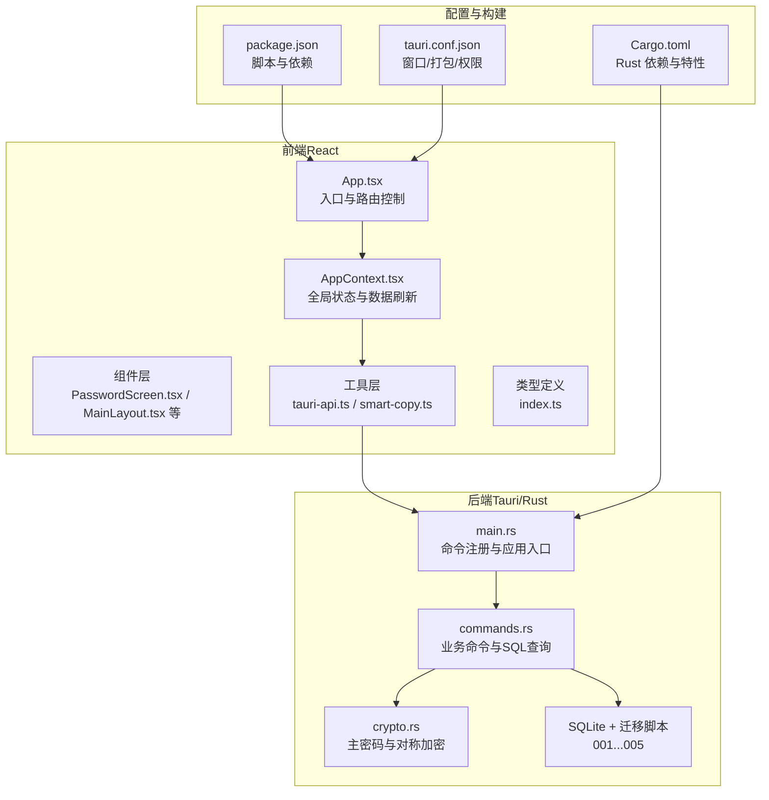
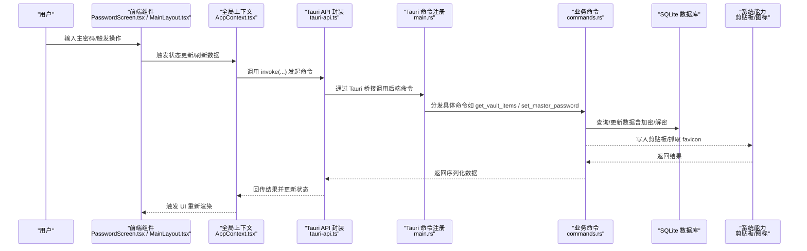
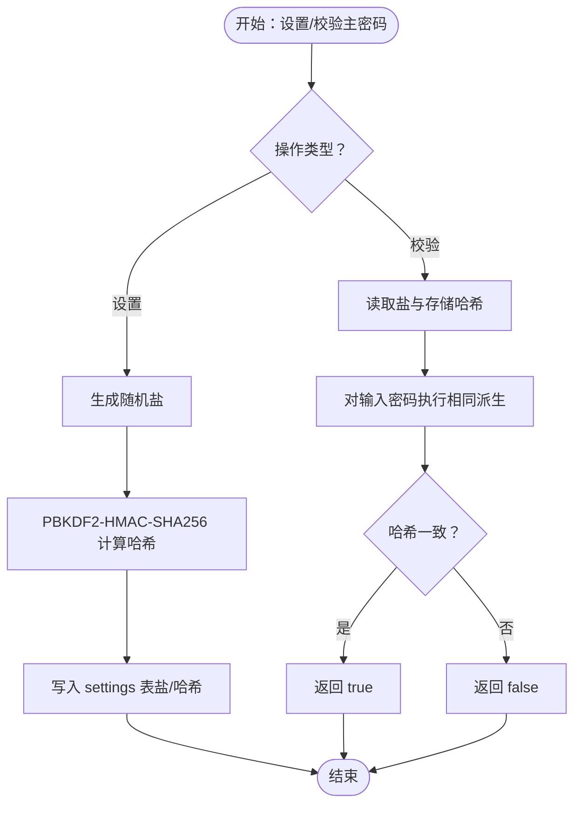
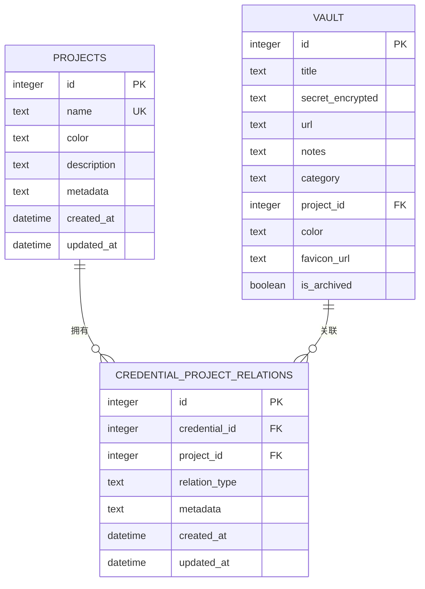
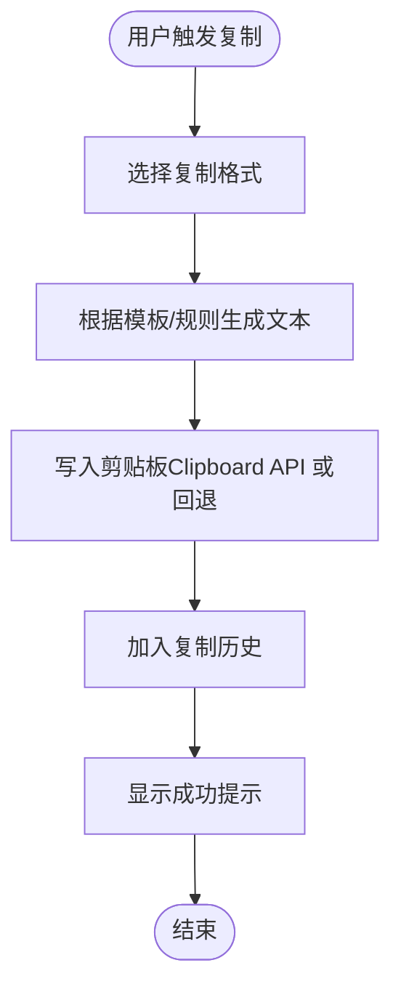
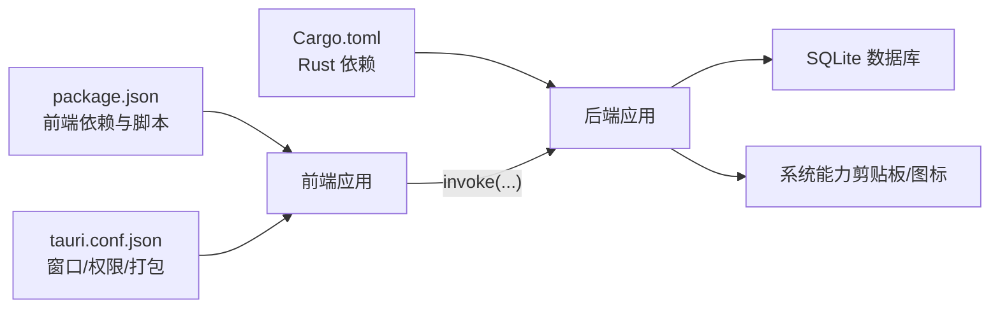

# 项目概述

<cite>
**本文引用的文件**
- [package.json](file://package.json)
- [Cargo.toml](file://src-tauri/Cargo.toml)
- [tauri.conf.json](file://src-tauri/tauri.conf.json)
- [App.tsx](file://src/App.tsx)
- [main.tsx](file://src/main.tsx)
- [AppContext.tsx](file://src/contexts/AppContext.tsx)
- [smart-copy.ts](file://src/lib/smart-copy.ts)
- [main.rs](file://src-tauri/src/main.rs)
- [commands.rs](file://src-tauri/src/commands.rs)
- [crypto.rs](file://src-tauri/src/crypto.rs)
- [001_create_projects_table.sql](file://src-tauri/migrations/001_create_projects_table.sql)
- [002_create_relations_table.sql](file://src-tauri/migrations/002_create_relations_table.sql)
- [PasswordScreen.tsx](file://src/components/PasswordScreen.tsx)
- [MainLayout.tsx](file://src/components/MainLayout.tsx)
- [tauri-api.ts](file://src/lib/tauri-api.ts)
- [index.ts](file://src/types/index.ts)
</cite>

## 目录
1. [简介](#简介)
2. [项目结构](#项目结构)
3. [核心组件](#核心组件)
4. [架构总览](#架构总览)
5. [详细组件分析](#详细组件分析)
6. [依赖关系分析](#依赖关系分析)
7. [性能考虑](#性能考虑)
8. [故障排查指南](#故障排查指南)
9. [结论](#结论)
10. [附录](#附录)

## 简介
AIpassword（代号 DevVault）是一个基于 Tauri 框架构建的跨平台密码管理器，专为开发者设计，用于集中管理各类 API 密钥、令牌与敏感凭证。项目采用“主密码”保护机制，结合 SQLite 数据库存储与 Rust 后端命令处理，确保本地化、离线可用与高安全性。前端使用 React + TypeScript 构建，配合 TailwindCSS 实现响应式界面；后端通过 Tauri 的安全通道调用原生能力（如剪贴板），并提供可扩展的迁移与加密模块。

本项目的独特价值在于：
- 面向开发者的“凭据即资产”理念：支持按项目维度组织凭据，便于团队协作与环境隔离。
- 智能复制：根据内容自动推断键名并生成 env/json/custom 格式，提升开发效率。
- 安全优先：主密码保护、PBKDF2+AES-GCM 加密、盐值存储与只在本地运行。
- 轻量与高性能：Tauri 原生打包，无浏览器沙箱开销，启动快、资源占用低。

## 项目结构
项目采用前后端分离但紧密集成的结构：
- 前端（React + TypeScript）位于 src/，负责 UI、状态管理与与后端的 Tauri 通信。
- 后端（Rust + SQLx + SQLite）位于 src-tauri/，负责数据库、加密、命令处理与系统能力调用。
- 构建配置与产物位于根目录，前端产物输出至 dist/，由 Tauri 打包为原生应用。

图表来源
- [main.rs](file://src-tauri/src/main.rs#L21-L50)
- [commands.rs](file://src-tauri/src/commands.rs#L40-L392)
- [App.tsx](file://src/App.tsx#L7-L19)
- [AppContext.tsx](file://src/contexts/AppContext.tsx#L76-L154)
- [tauri-api.ts](file://src/lib/tauri-api.ts#L5-L82)
- [package.json](file://package.json#L6-L11)
- [Cargo.toml](file://src-tauri/Cargo.toml#L15-L28)
- [tauri.conf.json](file://src-tauri/tauri.conf.json#L1-L33)

章节来源
- [package.json](file://package.json#L1-L32)
- [Cargo.toml](file://src-tauri/Cargo.toml#L1-L34)
- [tauri.conf.json](file://src-tauri/tauri.conf.json#L1-L33)

## 核心组件
- 应用入口与路由控制
  - 前端入口负责根据“主密码验证状态”切换登录页或主界面。
- 全局状态管理
  - 提供 vault 项、项目、搜索、选中项、隐身模式、加载状态等统一状态，并封装刷新与搜索逻辑。
- 主密码与安全
  - 支持设置/校验主密码，采用 PBKDF2+盐值存储；凭据字段使用 AES-256-GCM 加密存储。
- 凭据与项目管理
  - 支持凭据增删改查、按项目筛选、未关联凭据查询、凭据-项目关系维护。
- 智能复制
  - 自动识别常见服务键名，生成 raw/env/json/custom 格式文本并写入剪贴板，带复制历史与可视化反馈。
- 剪贴板与图标
  - 在 Windows 平台通过原生库写入剪贴板；根据 URL 获取站点 favicon。
- 数据库与迁移
  - 使用 SQLite，提供项目表、关系表及迁移脚本，支持项目计数统计与按项目查询。

章节来源
- [App.tsx](file://src/App.tsx#L7-L19)
- [AppContext.tsx](file://src/contexts/AppContext.tsx#L19-L67)
- [commands.rs](file://src-tauri/src/commands.rs#L40-L392)
- [smart-copy.ts](file://src/lib/smart-copy.ts#L8-L152)
- [crypto.rs](file://src-tauri/src/crypto.rs#L7-L92)
- [001_create_projects_table.sql](file://src-tauri/migrations/001_create_projects_table.sql#L1-L13)
- [002_create_relations_table.sql](file://src-tauri/migrations/002_create_relations_table.sql#L1-L16)

## 架构总览
下图展示了从用户交互到数据库与系统能力的完整调用链路，体现前后端职责边界与数据流向。

图表来源
- [main.rs](file://src-tauri/src/main.rs#L21-L50)
- [commands.rs](file://src-tauri/src/commands.rs#L40-L392)
- [tauri-api.ts](file://src/lib/tauri-api.ts#L5-L82)
- [AppContext.tsx](file://src/contexts/AppContext.tsx#L79-L121)
- [PasswordScreen.tsx](file://src/components/PasswordScreen.tsx#L30-L61)
- [MainLayout.tsx](file://src/components/MainLayout.tsx#L11-L103)

## 详细组件分析

### 组件一：应用入口与路由控制（App.tsx）
- 功能要点
  - 根据“是否已验证主密码”决定显示 PasswordScreen 或 MainLayout。
  - 作为 React 根组件，承载全局 Provider。
- 设计考量
  - 将“主密码校验”前置，保证后续 UI 只在受保护状态下渲染。
- 交互流程
  - 初始加载时隐藏 UI，等待主密码检查完成后再切换到对应视图。

章节来源
- [App.tsx](file://src/App.tsx#L7-L19)

### 组件二：全局状态与数据刷新（AppContext.tsx）
- 功能要点
  - 维护 AppState，包括 vaultItems、projects、selectedProject、searchQuery、selectedItem、stealthMode、loading 状态与主密码验证状态。
  - 提供 refreshData 与 searchItems，内部并发拉取项目与计数，并按需筛选凭据。
  - 监听项目变化自动刷新列表。
- 性能与可靠性
  - 使用 useReducer 控制状态变更，避免重复渲染。
  - 并行请求项目与计数，减少首屏等待时间。
- 错误处理
  - 对每个异步操作包裹 try/catch 并最终恢复 loading 状态。

章节来源
- [AppContext.tsx](file://src/contexts/AppContext.tsx#L19-L67)
- [AppContext.tsx](file://src/contexts/AppContext.tsx#L79-L121)
- [AppContext.tsx](file://src/contexts/AppContext.tsx#L123-L147)

### 组件三：主密码与安全（commands.rs + crypto.rs）
- 主密码流程
  - 设置：生成随机盐，PBKDF2-HMAC-SHA256 计算哈希，分别存入 settings 表。
  - 校验：读取盐与哈希，重新计算输入密码哈希进行比对。
- 凭据加密
  - 使用 PBKDF2 派生主密钥，AES-256-GCM 加密/解密凭据字段，随机盐随密文一起编码存储。
- 安全性保障
  - 仅在本地存储，无网络传输；哈希与盐均不暴露明文；剪贴板写入仅在 Windows 平台启用。

图表来源
- [commands.rs](file://src-tauri/src/commands.rs#L248-L309)
- [crypto.rs](file://src-tauri/src/crypto.rs#L76-L92)

章节来源
- [commands.rs](file://src-tauri/src/commands.rs#L248-L309)
- [crypto.rs](file://src-tauri/src/crypto.rs#L7-L92)

### 组件四：凭据与项目管理（commands.rs + 类型定义）
- 数据模型
  - VaultItem：标题、加密密文、URL、备注、分类、项目ID、颜色、favicon、归档标志。
  - Project：名称、颜色、计数。
  - 关系表：credential_project_relations，建立凭据与项目的多维关联。
- 关键命令
  - 凭据：创建/查询/更新/归档（软删除）、按项目筛选、未关联凭据查询。
  - 项目：创建/查询/统计计数。
  - 搜索：全文模糊匹配标题/备注/URL。
- 复杂度与索引
  - 项目与关系表均建立索引，查询按名称与外键高效排序。
  - 计数通过 LEFT JOIN 统计，避免多次往返。

图表来源
- [001_create_projects_table.sql](file://src-tauri/migrations/001_create_projects_table.sql#L1-L13)
- [002_create_relations_table.sql](file://src-tauri/migrations/002_create_relations_table.sql#L1-L16)
- [commands.rs](file://src-tauri/src/commands.rs#L9-L38)
- [index.ts](file://src/types/index.ts#L1-L46)

章节来源
- [commands.rs](file://src-tauri/src/commands.rs#L40-L487)
- [index.ts](file://src/types/index.ts#L1-L46)
- [001_create_projects_table.sql](file://src-tauri/migrations/001_create_projects_table.sql#L1-L13)
- [002_create_relations_table.sql](file://src-tauri/migrations/002_create_relations_table.sql#L1-L16)

### 组件五：智能复制（smart-copy.ts）
- 功能特性
  - 支持 raw/env/json/custom 多格式复制。
  - 自动推断键名（如 openai/anthropic/github 等），生成标准化 env/json 输出。
  - 带复制历史记录与可视化反馈（右上角成功提示）。
- 兼容性
  - 优先使用 Clipboard API；回退到 textarea execCommand 方案。
- 用户体验
  - 历史最多保留 10 条，自动截断超长文本，提供清空历史能力。

图表来源
- [smart-copy.ts](file://src/lib/smart-copy.ts#L20-L71)
- [smart-copy.ts](file://src/lib/smart-copy.ts#L73-L94)
- [smart-copy.ts](file://src/lib/smart-copy.ts#L96-L132)

章节来源
- [smart-copy.ts](file://src/lib/smart-copy.ts#L1-L152)

### 组件六：前端 UI 与交互（PasswordScreen.tsx / MainLayout.tsx）
- 登录页 PasswordScreen
  - 首次使用引导设置主密码（长度校验、确认一致性）；非首次则进行校验。
  - 初始化阶段显示加载态，避免 UI 抖动。
- 主布局 MainLayout
  - 响应式布局：窄屏隐藏侧边栏与详情区，适配移动端。
  - 工具栏提供新建条目入口；模态框支持新增/编辑。
  - 项目选择联动凭据列表与关系管理面板。

章节来源
- [PasswordScreen.tsx](file://src/components/PasswordScreen.tsx#L14-L28)
- [PasswordScreen.tsx](file://src/components/PasswordScreen.tsx#L30-L61)
- [MainLayout.tsx](file://src/components/MainLayout.tsx#L11-L103)

### 组件七：前端与后端通信（tauri-api.ts + main.rs）
- 前端封装
  - 统一的 invoke 调用接口，覆盖凭据、项目、工具方法与事件监听。
- 后端注册
  - 在 main.rs 中集中注册所有命令，启动时初始化数据库连接池。
- 事件机制
  - 提供 clipboard-change 事件监听，便于 UI 响应外部剪贴板变化。

章节来源
- [tauri-api.ts](file://src/lib/tauri-api.ts#L5-L82)
- [main.rs](file://src-tauri/src/main.rs#L21-L50)

## 依赖关系分析
- 前端依赖
  - @tauri-apps/api：与后端桥接通信。
  - react/react-dom：UI 渲染与生命周期。
  - lucide-react、clsx、tailwind-merge：图标与样式工具。
- 后端依赖
  - tauri：应用框架与权限白名单。
  - sqlx：异步 SQLite ORM。
  - ring：密码学算法（PBKDF2/AES-GCM）。
  - clipboard-win：Windows 剪贴板写入。
- 构建与打包
  - Vite + TypeScript 前端构建；Tauri CLI 管理原生打包与 dev/build 脚本。

图表来源
- [package.json](file://package.json#L13-L31)
- [Cargo.toml](file://src-tauri/Cargo.toml#L15-L28)
- [tauri.conf.json](file://src-tauri/tauri.conf.json#L1-L33)

章节来源
- [package.json](file://package.json#L13-L31)
- [Cargo.toml](file://src-tauri/Cargo.toml#L15-L28)
- [tauri.conf.json](file://src-tauri/tauri.conf.json#L1-L33)

## 性能考虑
- 前端
  - 使用 useReducer 与 useMemo/useState 合理拆分状态，避免不必要的重渲染。
  - 并行请求项目与计数，缩短首屏加载时间。
- 后端
  - SQLx 异步查询，合理使用索引（项目名、关系表外键）降低查询成本。
  - AES-GCM 加密/解密在内存中完成，避免频繁 IO。
- 构建与打包
  - Tauri 原生打包，无需浏览器运行时，启动更快、内存占用更低。
  - 建议开启生产特性（如自定义协议）以满足分发需求。

## 故障排查指南
- 无法复制到剪贴板（Windows）
  - 确认已启用剪贴板相关特性；检查权限与杀毒软件拦截。
- 主密码设置/校验失败
  - 检查 settings 表中 salt/hash 是否存在；确认 PBKDF2 参数一致。
- 数据库连接异常
  - 查看初始化日志；确认迁移脚本执行顺序与数据库文件路径。
- UI 不更新或卡顿
  - 检查状态派发是否正确；确认并发请求是否被取消或覆盖。

章节来源
- [commands.rs](file://src-tauri/src/commands.rs#L213-L228)
- [commands.rs](file://src-tauri/src/commands.rs#L248-L309)
- [main.rs](file://src-tauri/src/main.rs#L40-L48)

## 结论
AIpassword（DevVault）以“开发者友好、安全可靠、轻量高效”为核心目标，通过主密码保护、项目化组织、智能复制与原生打包，为开发者提供即用即走的本地化凭据管理方案。其模块化架构与清晰的前后端职责划分，既适合初学者快速上手，也为进阶用户提供了扩展与二次开发的空间。

## 附录
- 目标用户
  - 开发者、测试工程师、运维人员等需要管理大量 API 密钥与令牌的用户。
- 应用场景
  - 本地开发调试、CI/CD 环境变量注入、多项目凭证隔离与共享。
- 技术优势
  - 本地化存储、零网络暴露、原生性能、可移植性强、可扩展的命令体系与迁移机制。